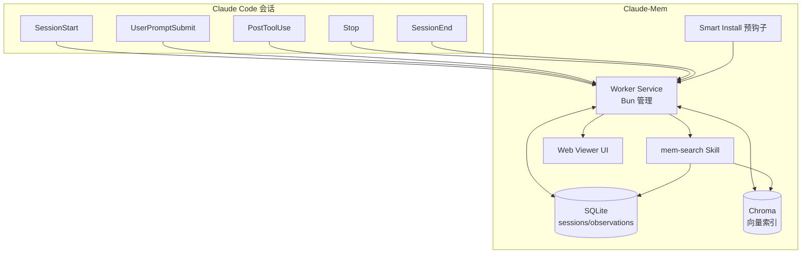
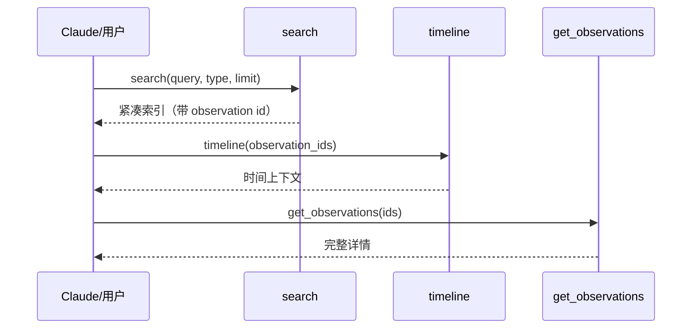

# Claude-Mem：用 5 个钩子，把 Claude Code 的上下文留在会话之间

Claude Code 每次会话结束，上下文就归零。下一会话要接着改同一个项目，得把项目背景、之前的决定、踩过的坑重新讲一遍。Claude-Mem 处理的就是这件事：它把会话里发生的工具调用抓下来、压缩成摘要存进本地，下次会话开始再按需放回去，让 Claude 记住"上次干到哪了"。

它不解决"模型记不记得"的问题，解决的是"会话结束后上下文去了哪"的问题。看清楚这一点，后面读它的组件就不会乱。

> **GitHub**: [thedotmack/claude-mem](https://github.com/thedotmack/claude-mem)
> **Stars**: 89.3K（截至 2026-08-03）
> **Forks**: 7.8K
> **语言**: TypeScript（GitHub 主语言检测为 JavaScript）
> **版本**: 13.4.0
> **许可证**: Apache-2.0
> **Node**: 20.0.0 及以上
> **官方文档**: [docs.claude-mem.ai](https://docs.claude-mem.ai/)

官方把它的定位写得很直白：Persistent Context Across Sessions for Every Agent。除了 Claude Code，还支持 OpenClaw、OpenCode、Codex、Gemini、Hermes、Copilot 等入口，但记忆引擎本身是同一套。

## 它把一套系统拆成了哪些部分

Claude-Mem 不是单一程序，而是六个组件各管一段。先看这张地图，再看每个组件怎么配合。


```mermaid
graph TB
  subgraph CC["Claude Code 会话"]
    HS[SessionStart]
    UP[UserPromptSubmit]
    PT[PostToolUse]
    ST[Stop]
    SE[SessionEnd]
  end
  subgraph CM["Claude-Mem"]
    Install[Smart Install 预钩子]
    Worker[Worker Service<br/>Bun 管理]
    SQL[(SQLite<br/>sessions/observations)]
    CH[(Chroma<br/>向量索引)]
    Skill[mem-search Skill]
    WebUI[Web Viewer UI]
  end
  HS --> Worker
  UP --> Worker
  PT --> Worker
  ST --> Worker
  SE --> Worker
  Install --> Worker
  Worker <--> SQL
  Worker <--> CH
  Worker --> Skill
  Worker --> WebUI
  Skill --> SQL
  Skill --> CH
```

| 组件 | 职责 |
|------|------|
| 5 个生命周期钩子 | 在会话的关键时机自动触发，负责"抓"和"放" |
| Smart Install 预钩子 | 会话前检查依赖缓存，不是生命周期钩子 |
| Worker Service | 本地 HTTP 服务，由 Bun 管理，承接钩子写入并提供搜索接口 |
| SQLite | 存 sessions、observations、summaries，带 FTS5 全文索引 |
| Chroma | 向量数据库，做语义检索 |
| mem-search Skill | 给 Claude 用的自然语言搜索技能，按需取回记忆 |

两条存储线要分开看：SQLite 管"字面的关键词命中和结构化记录"，Chroma 管"意思相近的语义命中"。搜索时两边都查，再合并排序。

## 捕获：5 个钩子怎么把上下文留下来

Hook 是 Claude Code 的机制，在会话特定时机执行脚本。Claude-Mem 用了其中 5 个，另外加一个跑在会话前的预钩子。

| 钩子 | 时机 | 做的事 |
|------|------|--------|
| SessionStart | 会话开始 | 加载本项目历史记忆，注入上下文 |
| UserPromptSubmit | 用户提交提示 | 记录意图，更新记忆索引 |
| PostToolUse | 工具调用之后 | 捕获工具输出，生成观察摘要 |
| Stop | 停止时 | 保存检查点，写入会话状态 |
| SessionEnd | 会话结束 | 生成最终摘要，归档记忆 |

每个钩子做的都是同一类动作：往 Worker Service 发数据。SessionStart 是读，后面四个是写。这套设计让"捕获"对用户完全透明——不用手动保存，会话正常进出，记忆就自动落下来了。

## 存储：SQLite 和 Chroma 各管什么

Worker Service 收到钩子数据后，落成两种形态。

SQLite 存的是结构化记录：sessions（会话）、observations（观察）、summaries（摘要）。observations 带 file_refs、concept_tags 这类字段，方便按文件或概念定位。FTS5 全文索引负责关键词层面的事，快、省资源。

Chroma 存的是向量，负责语义层面的事：一个查询和某条历史记忆字面不重合，但意思接近，靠向量相似度也能捞出来。README 明确点出这是 hybrid search——关键词和语义两条路都走，再合并。

两条线解决的是不同的问题，不是重复实现。关键词匹配能精确命中"改动过 ws-manager.ts"这类事实；语义搜索能命中"之前那个断连重连的 bug"这种说法不一致但意思一致的请求。

## 检索：mem-search 的三层协议

记忆存下来，最终要能查。Claude-Mem 通过 4 个 MCP 搜索工具暴露能力，核心是 3 个，按一个三层工作流配合，避免一次把所有记忆灌进上下文。


```mermaid
sequenceDiagram
  participant U as Claude/用户
  participant S as search
  participant T as timeline
  participant G as get_observations
  U->>S: search(query, type, limit)
  S-->>U: 紧凑索引（带 observation id）
  U->>T: timeline(observation_ids)
  T-->>U: 时间上下文
  U->>G: get_observations(ids)
  G-->>U: 完整详情
```

1. `search`：先做全文+向量混合搜索，返回紧凑索引，每条约 50-100 token，只带 id 和概要。
2. `timeline`：对感兴趣的 id，取周围的时间上下文，看事情是怎么发展的。
3. `get_observations`：只对最终筛出的 id 拉完整详情，每条约 500-1000 token。

价值在第三步"只拉需要的"：先在前两层过滤，再取详情，官方称能省约 10 倍 token。如果一上来就把所有记忆详情塞进上下文，token 会随项目规模线性膨胀，这正是渐进式披露要避免的。

```typescript
// 第一步：搜索引
search(query="authentication bug", type="bugfix", limit=10)

// 第二步：从索引里挑出相关的 id（比如 123、456）

// 第三步：只取这些 id 的完整详情
get_observations(ids=[123, 456])
```

## 一条记忆怎么流过这套系统

把上面的组件串成一个具体流程，看一次记忆从产生到被复用要经过哪些环节。

1. 你在项目里跑 `npx claude-mem install`。Smart Install 预钩子检查依赖缓存，把 5 个钩子脚本和 Worker Service 装好。
2. 启动 Claude Code。SessionStart 钩子询问 Worker Service：这个项目之前有没有记忆？有就注入上下文，Claude 一开始就知道项目的来龙去脉。
3. 会话里你让 Claude 改文件、跑命令。每次工具调用结束，PostToolUse 钩子捕获输出，Worker Service 生成观察摘要，连同文件引用、类型标签一起写进 SQLite。
4. 你退出会话。SessionEnd 钩子让 Worker Service 生成最终汇总，归档这次会话。
5. 下次再开会话，想不起来细节时，用 mem-search skill 问"上次那个 WebSocket 断连的问题是因为什么"。`search` 返回索引，`timeline` 补上下文，`get_observations` 取完整记录，Claude 拿到答案。

这套流程里，用户唯一要做的动作是第一步安装。之后的捕获、归档、检索，都由钩子和 Worker 自动完成。

## 安装与配置

安装是一条命令，支持按目标 IDE 指定：

```bash
npx claude-mem install                         # 默认 Claude Code
npx claude-mem install --ide opencode          # OpenCode
npx claude-mem install --ide antigravity       # Antigravity CLI
```

也可以直接在 Claude Code 插件市场里装：

```bash
/plugin marketplace add thedotmack/claude-mem
/plugin install claude-mem
```

OpenClaw 网关用另一条脚本：

```bash
curl -fsSL https://install.cmem.ai/openclaw.sh | bash
```

装完重启 Claude Code，上一会话的上下文就会自动出现在新会话。

配置放在 `~/.claude-mem/settings.json`，首次运行自动生成。核心是 `CLAUDE_MEM_MODE`，它同时控制工作流行为和生成摘要用的语言：

| Mode | 说明 |
|------|------|
| `code` | 默认英文模式 |
| `code--zh` | 简体中文模式 |
| `code--ja` | 日文模式 |

语言模式遵循 `code--[语言码]` 的命名，`code--zh` 已内置，改完重启 Claude Code 生效。

需要注意一点：npm 上 `claude-mem` 这个包是可用的，但 `npm install -g claude-mem` 只装 SDK 库，不会注册钩子、也不会起 Worker Service。要真正接入，得走 `npx claude-mem install` 或 `/plugin` 命令。

## 隐私：`<private>` 标签

对不想进记忆的内容，用 `<private>` 标签包起来，Worker Service 在存储时会跳过标签之间的内容。

```html
<!-- <private> -->
API_SECRET=prod-key-do-not-leak
<!-- </private> -->
```

这是纯字符串匹配，不做语法解析，所以任何文本文件都适用；相应地，它对被编码或拆散的敏感内容识别有限。标签要成对出现。

## 什么时候该用，什么时候先等等

Claude-Mem 适合的场景比较明确：你在 Claude Code 里维护的项目跨多个会话进行，记忆的价值才体现得出来。会话之间没有连续性、每次都是独立任务的项目，它带来的收益不明显。

本地优先是它的默认形态，数据落在自己机器上。官方也提供 Cloud Sync，把记忆备份到 cmem.ai，Worker 在写入时同步，不额外跑后台进程；介不介意记忆上云，会影响是否开启这一项。

团队场景要留意：记忆默认按项目路径隔离，`<private>` 标签是唯一的内容过滤手段。要在团队共享记忆，需要自己设计共享方式和访问控制，README 没有内置的多用户共享方案。

## 数据口径

- 本文数据（Stars、Forks、版本、许可证、Node 要求）来自 GitHub API 与 README，截至 2026-08-03；项目迭代很快，安装方式与命令以最新文档为准。
- 5 个钩子、SQLite + Chroma 混合存储、三层搜索工作流、`<private>` 标签均来自 README 的官方描述。
- 许可证为 Apache-2.0，兼容商业嵌入；README 明确说明选择该协议是为了让记忆能力容易嵌进开发工具、本地 Agent、MCP 服务和企业系统。

## 参考

| 资源 | 链接 |
|------|------|
| GitHub | [thedotmack/claude-mem](https://github.com/thedotmack/claude-mem) |
| 官方文档 | [docs.claude-mem.ai](https://docs.claude-mem.ai/) |
| 中文 README | [docs/i18n/README.zh.md](https://github.com/thedotmack/claude-mem/blob/main/docs/i18n/README.zh.md) |
| Cloud Sync | [docs.claude-mem.ai/cloud-sync](https://docs.claude-mem.ai/cloud-sync) |
| Discord | [Join Discord](https://discord.com/invite/J4wttp9vDu) |
| 作者 | Alex Newman（[@thedotmack](https://github.com/thedotmack)） |