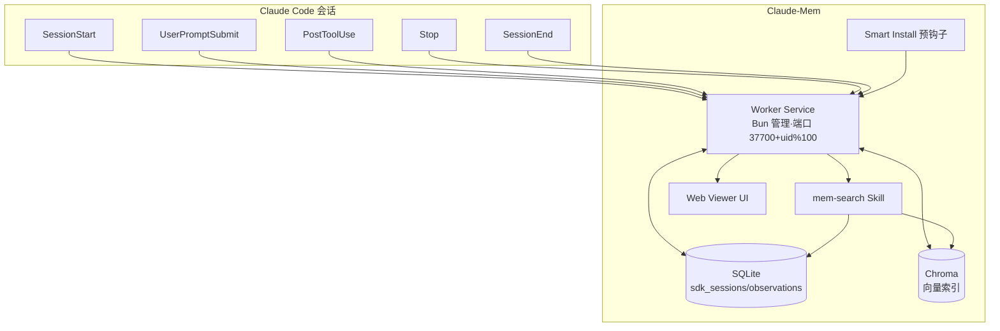
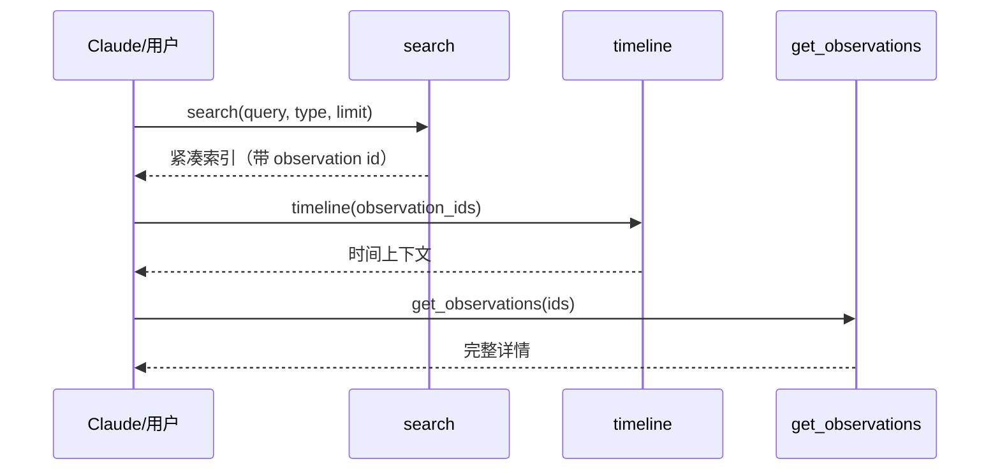

# Claude-Mem：用 5 个钩子，把 Claude Code 的上下文留在会话之间

Claude Code 每次会话结束，上下文就归零。下一会话要接着改同一个项目，得把项目背景、之前的决定、踩过的坑重新讲一遍。Claude-Mem 处理的就是这件事：它把会话里发生的工具调用抓下来、压缩成摘要存进本地，下次会话开始再按需放回去，让 Claude 记住"上次干到哪了"。

它不解决"模型记不记得"的问题，解决的是"会话结束后上下文去了哪"的问题。看清楚这一点，后面读它的组件就不会乱。

> **GitHub**: [thedotmack/claude-mem](https://github.com/thedotmack/claude-mem)
> **Stars**: 95,083（截至 2026-10-01；项目 2025-08-31 创建，13 个月破 9 万）
> **Forks**: 8,418
> **语言**: TypeScript（占代码量约 56%，另有 JavaScript 33%、Python 10%）
> **版本**: 13.28.0（2026-09-26 发布）
> **许可证**: Apache-2.0
> **运行时**: Node ≥ 20，Bun 与 uv 缺失时自动安装，SQLite 随包内置
> **官方文档**: [docs.claude-mem.ai](https://docs.claude-mem.ai/)

官方把它的定位写得很直白：Persistent Context Across Sessions for Every Agent。除了 Claude Code，还支持 OpenClaw、OpenCode、Codex、Gemini、Hermes、Copilot、Cursor、Kimi Code 等入口，但记忆引擎本身是同一套。

## 它把一套系统拆成了哪些部分

Claude-Mem 不是单一程序，而是六个组件各管一段。先看这张地图，再看每个组件怎么配合。


```mermaid
graph TB
  subgraph CC["Claude Code 会话"]
    HS[SessionStart]
    UP[UserPromptSubmit]
    PT[PostToolUse]
    ST[Stop]
    SE[SessionEnd]
  end
  subgraph CM["Claude-Mem"]
    Install[Smart Install 预钩子]
    Worker[Worker Service<br/>Bun 管理·端口 37700+uid%100]
    SQL[(SQLite<br/>sdk_sessions/observations)]
    CH[(Chroma<br/>向量索引)]
    Skill[mem-search Skill]
    WebUI[Web Viewer UI]
  end
  HS --> Worker
  UP --> Worker
  PT --> Worker
  ST --> Worker
  SE --> Worker
  Install --> Worker
  Worker <--> SQL
  Worker <--> CH
  Worker --> Skill
  Worker --> WebUI
  Skill --> SQL
  Skill --> CH
```

| 组件 | 职责 |
|------|------|
| 5 个生命周期钩子 | 在会话的关键时机自动触发，负责"抓"和"放" |
| Smart Install 预钩子 | 会话前检查依赖缓存，不是生命周期钩子 |
| Worker Service | 本地 HTTP 服务，由 Bun 管理，承接钩子写入并提供搜索接口 |
| SQLite | 存 sdk_sessions、observations、session_summaries，带 FTS5 全文索引 |
| Chroma | 向量数据库，做语义检索 |
| mem-search Skill | 给 Claude 用的自然语言搜索技能，按需取回记忆 |

两条存储线要分开看：SQLite 管"字面的关键词命中和结构化记录"，Chroma 管"意思相近的语义命中"。搜索时两边都查，再合并排序。

Worker 是个常驻的 Express 服务，端口按用户错开（37700 + uid % 100），避免多用户抢同一端口。它挂了也不影响你用 Claude Code——钩子遇到连接失败一律静默退出（exit 0），只在代码本身有 bug 时才报错阻断。这是刻意的降级设计：记忆系统坏了，最多丢记忆，不能挡路。

## 捕获：钩子怎么把上下文留下来

Hook 是 Claude Code 的机制，在会话特定时机执行脚本。Claude-Mem 用了其中 5 个生命周期钩子，另外加一个跑在会话前的预钩子。

| 钩子 | 时机 | 做的事 |
|------|------|--------|
| SessionStart | 会话开始（含 resume、clear、compact） | 启动 Worker，注入本项目历史记忆 |
| UserPromptSubmit | 用户提交提示 | 注册会话，启动 SDK Agent 做语义注入 |
| PostToolUse | 工具调用之后 | 捕获工具输出，入队等待提取观察 |
| Stop | Claude 停止响应 | 生成会话摘要 |
| SessionEnd | 会话结束 | 结束会话，清空待处理队列 |

每个钩子做的都是同一类动作：往 Worker Service 发数据。SessionStart 是读，后面四个是写。这套设计让"捕获"对用户完全透明——不用手动保存，会话正常进出，记忆就自动落下来了。

v13 的 hooks.json 里还注册了两个辅助事件：Setup 钩子在每次启动时跑一个 100 毫秒以内的版本检查，发现插件被外部升级过就在 stderr 里提示你跑 `npx claude-mem repair`；PreToolUse 钩子只匹配 Read 工具，是"文件读取门"的入口，后面单独讲。

一次工具调用被捕获后，Worker 用 Claude Agent SDK 把它提炼成一条观察，提取七个维度：标题、副标题、叙述、事实要点、概念标签、类型（decision、bugfix、feature 等）、读改了哪些文件。写入前去重靠内容哈希——SHA256（会话 ID + 标题 + 叙述）取前 16 位，30 秒窗口内撞哈希的直接复用已有记录，不重复入库。

下次会话开始时，SessionStart 钩子从库里拉本项目最近的观察（默认 50 条）和会话摘要，覆盖最近 10 个会话，按时间线排好注入上下文。摘要详情只有比最新观察更新时才完整展示——如果摘要之后又有新工作，只列条目不展开，免得把过时结论当成最新状态喂给 Claude。

## 存储：SQLite 和 Chroma 各管什么

Worker Service 收到钩子数据后，落成两种形态。

SQLite（claude-mem.db）存结构化记录：sdk_sessions 管会话生命周期；observations 存观察正文和类型；session_summaries 按 request、investigated、learned、completed、next_steps、files_read、files_edited 分栏存摘要；另有 user_prompts 存你的原始提问。FTS5 全文索引负责关键词层面的事，快、省资源。

Chroma 存的是向量，负责语义层面的事：一个查询和某条历史记忆字面不重合，但意思接近，靠向量相似度也能捞出来。每条观察会拆成多个向量文档——叙述一条、每条事实要点各一条——按 `obs_{id}_narrative`、`obs_{id}_fact_0` 这样的键组织，经 chroma-mcp 进程以 stdio 通信。

README 明确点出这是 hybrid search——关键词和语义两条路都走，再合并。两条线解决的是不同的问题：关键词匹配能精确命中"改动过 ws-manager.ts"这类事实；语义搜索能命中"之前那个断连重连的 bug"这种说法不一致但意思一致的请求。

## 检索：mem-search 的三层协议

记忆存下来，最终要能查。Claude-Mem 通过 4 个 MCP 工具暴露搜索能力：`important_workflow` 是一条自动展示的工作流提醒，真正干活的是 3 个，按一个三层工作流配合，避免一次把所有记忆灌进上下文。


```mermaid
sequenceDiagram
  participant U as Claude/用户
  participant S as search
  participant T as timeline
  participant G as get_observations
  U->>S: search(query, type, limit)
  S-->>U: 紧凑索引（带 observation id）
  U->>T: timeline(observation_ids)
  T-->>U: 时间上下文
  U->>G: get_observations(ids)
  G-->>U: 完整详情
```

1. `search`：先做全文+向量混合搜索，返回紧凑索引，每条约 50-100 token，只带 id 和概要。支持按类型、日期区间、项目过滤和分页。
2. `timeline`：对感兴趣的 id，取前后各几条的时间上下文，看事情是怎么发展的。
3. `get_observations`：只对最终筛出的 id 拉完整详情，每条约 500-1000 token。

官方给过一笔账：传统 RAG 一上来拉全部历史，2 万 token 里真正有用的约一成；三层走下来 3000 token 全是相关的，约省 10 倍。这正是渐进式披露的思路——先在前两层过滤，再取详情。

```typescript
// 第一步：搜索引
search(query="authentication bug", type="bugfix", limit=10)

// 第二步：从索引里挑出相关的 id（比如 123、456）

// 第三步：只取这些 id 的完整详情
get_observations(ids=[123, 456])
```

## 读文件之前，先查记忆

13.x 加了两个直接省 token 的机制，都建在同一份观察历史上。

**File Read Gate** 是 PreToolUse 钩子，拦截 Claude 的 Read 调用。文件小于 1500 字节直接放行——看时间线的代价高于读文件本身；文件较大且库里存有对它的历史观察时，读取被拒，改成给 Claude 一份该文件的变更时间线，最多 15 条、按具体程度排序。Claude 看到时间线后自己挑最便宜的路：时间线够用就到此为止（0 token），要细节用 `get_observations`（约 300 token 一条），要看当前代码用 `smart_outline` 看结构（1-2k token）或 `smart_unfold` 展开单个函数（400-2000 token）。

**Smart Explore** 把这套思路做成了常规工具：`smart_search`、`smart_outline`、`smart_unfold` 走 AST 解析代码，让 Claude 用大纲和符号级展开替代整文件阅读。官方文档里有它与整读文件方式的 token 对比基准。

## 把历史炼成可问答的"大脑"

搜索返回的是原始条目，Knowledge Agents 再往前一步：把一段观察历史编译成语料（corpus），对着它问答时拿到的是综合后的答案，而不是一条条记录。

流程是三步：`build_corpus` 按查询条件捞历史存成语料文件，`prime_corpus` 把语料装进一个 Claude 会话的上下文，然后 `query_corpus` 提问——返回的答案基于你项目的真实历史生成，幻觉空间比自由问答小。历史更新了就 `rebuild_corpus` 重跑原查询，再 `reprime_corpus` 换个干净会话。这整个能力也有对应的 `/knowledge-agent` 技能。

## 一条记忆怎么流过这套系统

把上面的组件串成一个具体流程，看一次记忆从产生到被复用要经过哪些环节。

1. 你在项目里跑 `npx claude-mem install`。安装器装好 Bun 和 uv、缓存依赖、注册钩子脚本，然后引导你在浏览器里登录（邮箱魔法链接，不要求绑卡）。登录后你会拿到一个 memory key，并在 provider 选择里挑一个：claude-mem 托管的 observer（生成记忆不占你的订阅额度，免费试用 14 天）、自己的 OpenRouter 或 Gemini key，或者直接用 Anthropic 订阅额度。
2. 启动 Claude Code。SessionStart 钩子唤醒 Worker Service 并询问：这个项目之前有没有记忆？有就注入上下文，Claude 一开始就知道项目的来龙去脉。
3. 会话里你让 Claude 改文件、跑命令。每次工具调用结束，PostToolUse 钩子把输出交给 Worker，SDK Agent 提炼成七维观察，写进 SQLite，同步到 Chroma。
4. Claude 停止响应，Stop 钩子生成摘要；退出会话时 SessionEnd 归档收尾。
5. 下次再开会话，想不起来细节时，用 mem-search skill 问"上次那个 WebSocket 断连的问题是因为什么"。`search` 返回索引，`timeline` 补上下文，`get_observations` 取完整记录，Claude 拿到答案。

这套流程里，用户要做的只有第一步。之后的捕获、归档、检索都自动进行；不想登录账号的话，加 `--provider` 参数、设 `CLAUDE_MEM_ONLINE_OPTIN=false`，或在 CI 等非交互环境里跑，安装器会跳过登录直接完成。

## 安装与配置

安装是一条命令，支持按目标 IDE 指定：

```bash
npx claude-mem install                         # 默认 Claude Code
npx claude-mem install --ide opencode          # OpenCode
npx claude-mem install --ide antigravity       # Antigravity CLI
```

也可以直接在 Claude Code 插件市场里装：

```bash
/plugin marketplace add thedotmack/claude-mem
/plugin install claude-mem
```

OpenClaw 网关用另一条脚本：

```bash
curl -fsSL https://install.cmem.ai/openclaw.sh | bash
```

Cursor、Grok Bot、OMP（Oh My Pi）、Kimi Code 各有专属安装路径，见官方文档的对应集成页。Grok Bot 比较特殊：它没有宿主钩子机制，claude-mem 改为监视它的聊天日志文件来捕获内容。

装完重启 Claude Code，上一会话的上下文就会自动出现在新会话。

配置放在 `~/.claude-mem/settings.json`，首次运行自动生成。核心是 `CLAUDE_MEM_MODE`，它同时决定观察者的角色设定、观察类型、概念标签和生成记忆用的语言：

| Mode | 说明 |
|------|------|
| `code` | 默认编码模式 |
| `code--chill` | 少记模式：只记"重新发现会很痛苦"的事——上线功能、架构决定、隐蔽的坑 |
| `code--zh` | 简体中文模式 |
| `code--ja` | 日文模式 |
| `email-investigation` | 邮件取证模式：识别人名、机构、时间线（分析 FOIA 解密档这类材料用） |

语言模式遵循 `code--[ISO 639-1 语言码]`，v13.28.0 的 plugin/modes/ 目录内置 29 种语言变体，改完重启 Claude Code 生效。没有合适的模式可以用 `/mode-creator` 技能对话式创建一个，装到 `~/.claude-mem/modes/`，插件升级不会冲掉自定义模式。

需要注意一点：npm 上 `claude-mem` 这个包是可用的，但 `npm install -g claude-mem` 只装 SDK 库，不会注册钩子、也不会起 Worker Service。要真正接入，得走 `npx claude-mem install` 或 `/plugin` 命令。

## 隐私：`<private>` 标签和自动脱敏

对不想进记忆的内容，用 `<private>` 标签包起来，Worker 在存储时跳过标签之间的内容。当前会话里 Claude 照常能看到、用到这些内容，只是不落库。

```html
<!-- <private> -->
API_SECRET=prod-key-do-not-leak
<!-- </private> -->
```

标签过滤依赖你手动包，漏包的拦不住。13.x 补了 Auto-Redaction：设 `CLAUDE_MEM_REDACT_ENABLED` 为 `"true"` 后，存储前用一组确定性正则扫描常见密钥格式并替换成 `<redacted type='...'/>` 占位符。内置 11 种模式，覆盖 AWS 密钥、GitHub PAT、OpenAI/Anthropic key、JWT、PEM 私钥块、Stripe 密钥、Slack token 等——专抓那些你自己都没意识到的泄露，比如 `curl` 响应里打印出来的 API key。正则匹配不上编码变形的密钥，两种手段是互补关系：标签管你知道的，脱敏管你不知道的。

## 什么时候该用，什么时候先等等

Claude-Mem 适合的场景比较明确：你在 Claude Code 里维护的项目跨多个会话进行，记忆的价值才体现得出来。会话之间没有连续性、每次都是独立任务的项目，它带来的收益不明显。

数据默认落在本地，`<private>` 标签和 Auto-Redaction 都只管入库这一层。官方提供 Cloud Sync（cmem.ai Pro 付费功能）：Worker 写入时同步推拉，不额外跑后台进程，多台设备共享同一份记忆。要注意它上传的内容包括观察叙述和你的完整 prompt 文本——介不介意这些上云，直接决定要不要开。

另外两条路径值得知道：生成摘要这一步调用谁家的模型是可配置的（observer、OpenRouter、Gemini 或 Anthropic 订阅），重度使用时这笔开销落在哪可以自己挑；除了 Claude Code，Cursor、Kimi Code、OpenClaw 网关这些宿主也能接入同一套记忆。

## 排查

Worker 出问题先看状态：`npm run worker:status` 看进程，`npm run worker:logs` 翻日志；启动、停止、重启都有对应命令。Windows 上报 `npm : The term 'npm' is not recognized`，是 Node 没进 PATH，装完 Node 重启终端即可。插件被外部升级后 Setup 钩子会提示跑 `npx claude-mem repair` 修复版本错位。其余问题可以直接把报错描述给 Claude，自带 troubleshoot skill 会自动诊断。

## 数据口径

- 本文数据（Stars、Forks、语言占比、版本、许可证）来自 GitHub API 与仓库，截至 2026-10-01；项目迭代很快（8 月初还是 v13.4.0，9 月底已到 v13.28.0），安装方式与命令以最新文档为准。
- 5 个生命周期钩子、SQLite + Chroma 混合存储、三层搜索工作流、`<private>` 标签来自 README 官方描述；Worker 端口、去重哈希、降级策略、SQLite 表结构来自仓库内 docs/architecture-overview.md 与源码（src/storage/、plugin/hooks/hooks.json）；File Read Gate、Auto-Redaction、Knowledge Agents、Mode System 的细节来自官方文档对应页面。
- 许可证为 Apache-2.0，README 明确说明选择该协议是为了让记忆能力容易嵌进开发工具、本地 Agent、MCP 服务和企业系统；商业边界见仓库 docs/ip-boundary.md。

## 参考

| 资源 | 链接 |
|------|------|
| GitHub | [thedotmack/claude-mem](https://github.com/thedotmack/claude-mem) |
| 官方文档 | [docs.claude-mem.ai](https://docs.claude-mem.ai/) |
| 架构总览 | [docs/architecture-overview.md](https://github.com/thedotmack/claude-mem/blob/main/docs/architecture-overview.md) |
| Cloud Sync | [docs.claude-mem.ai/cloud-sync](https://docs.claude-mem.ai/cloud-sync) |
| Discord | [Join Discord](https://discord.com/invite/J4wttp9vDu) |
| 作者 | Alex Newman（[@thedotmack](https://github.com/thedotmack)） |
