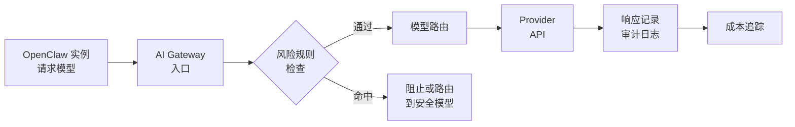

# ClawManager：Kubernetes 桌面运维平台从入门到精通专家级技术文档

> **目标读者**：需要管理团队级 AI Agent 桌面实例的运维工程师、技术负责人
> **核心问题**：如何在 Kubernetes 集群上批量管理 OpenClaw 桌面实例？如何实现 AI Gateway 模型治理？

---

## 1. 学习目标

完成本文档后，你将掌握：

- ✅ 理解 ClawManager 的定位与核心功能
- ✅ 掌握 Kubernetes 环境下的部署与配置
- ✅ 熟练管理用户、配额和桌面实例
- ✅ 理解 AI Gateway 模型治理架构
- ✅ 掌握权限控制、审计追踪、成本分析
- ✅ 能够进行二次开发和扩展

---

## 2. 原理分析

### 2.1 什么是 ClawManager？

**ClawManager** 是面向 Kubernetes 的 OpenClaw 和 Linux 桌面运行时管理平台，让团队从一个地方完成桌面实例的部署、运维和访问。

> 💡 **核心定位**：不是替代 OpenClaw，而是为团队提供**集中化管理平面**——多用户、多配额、多集群的桌面实例生命周期管理。

### 2.2 解决的核心问题

| 问题 | 传统方式 | ClawManager |
|------|---------|-------------|
| **多用户管理** | 各自部署 | 集中配额管控 |
| **桌面访问** | 直接暴露 Pod | 安全代理访问 |
| **模型治理** | 无统一管控 | AI Gateway |
| **资源隔离** | 手动配置 | 自动配额 |
| **运维成本** | 逐台维护 | 批量管理 |

### 2.3 技术边界

| 支持 | 不支持 |
|------|--------|
| ✅ OpenClaw 实例 | ❌ Windows 桌面 |
| ✅ Webtop 桌面 | ❌ macOS 桌面 |
| ✅ Ubuntu/Debian/CentOS | ❌ 嵌套虚拟化 |
| ✅ AI Gateway 治理 | ❌ 离线部署 |
| ✅ 多集群管理 | ❌ 物理机管理 |

---

## 3. 架构分析

### 3.1 整体架构

```
┌─────────────────────────────────────────────────────────────────┐
│                        ClawManager 架构                           │
├─────────────────────────────────────────────────────────────────┤
│  用户层                                                           │
│  ├── Admin Portal（管理面板）                                      │
│  ├── User Portal（用户门户）                                      │
│  └── Desktop Access（桌面访问）                                   │
├─────────────────────────────────────────────────────────────────┤
│  控制层                                                           │
│  ├── ClawManager Frontend（React 19）                            │
│  ├── ClawManager Backend（Go）                                   │
│  └── AI Gateway（模型治理）                                       │
├─────────────────────────────────────────────────────────────────┤
│  资源层                                                           │
│  ├── MySQL（状态存储）                                            │
│  └── Kubernetes API（资源调度）                                   │
├─────────────────────────────────────────────────────────────────┤
│  运行时层                                                         │
│  ├── OpenClaw（AI Agent 桌面）                                   │
│  ├── Webtop（浏览器桌面）                                         │
│  └── Linux Desktop（Ubuntu/Debian/CentOS）                       │
└─────────────────────────────────────────────────────────────────┘
```

### 3.2 数据流

```
Browser → ClawManager Frontend → ClawManager Backend → MySQL
                                                      ↓
                                              Kubernetes API
                                                      ↓
                              Pod / PVC / Service → OpenClaw / Webtop / Linux Desktop
```

### 3.3 核心技术栈

| 组件 | 技术选型 | 说明 |
|------|---------|------|
| **前端框架** | React 19 | 现代化响应式 UI |
| **后端语言** | Go 1.21+ | 高性能、Kubernetes 原生 |
| **数据库** | MySQL | 关系型状态存储 |
| **容器编排** | Kubernetes | Pod/PVC/Service 管理 |
| **访问协议** | WebSocket | 安全的桌面代理访问 |
| **认证** | JWT Token | 无状态认证 |

### 3.4 目录结构

```
ClawManager/
├── backend/                 # Go 后端
│   └── cmd/server/          # 主服务入口
├── frontend/               # React 前端
│   └── src/                # 前端源码
├── deployments/            # Kubernetes 部署
│   └── k8s/
│       └── clawmanager.yaml # 一键部署清单
├── docs/                   # 文档
├── .github/workflows/      # CI/CD
└── Dockerfile              # 容器镜像
```

---

## 4. 核心功能详解

### 4.1 实例生命周期管理

| 操作 | 命令 | 说明 |
|------|------|------|
| **创建** | Portal 发起 | 用户自助创建实例 |
| **启动** | K8s Pod | 基于 PVC 的有状态启动 |
| **停止** | K8s Pod | 保留数据、释放资源 |
| **重启** | K8s Pod | 热重启 |
| **删除** | K8s PVC | 清理存储 |
| **检查** | 状态同步 | Pod 状态同步 |

### 4.2 支持的运行时类型

```yaml
runtime_types:
  - openclaw    # AI Agent 桌面（主要）
  - webtop      # 浏览器桌面
  - ubuntu      # Ubuntu 桌面
  - debian      # Debian 桌面
  - centos      # CentOS 桌面
  - custom      # 自定义镜像
```

### 4.3 用户配额控制

| 配额维度 | 说明 | 单位 |
|----------|------|------|
| **CPU 核数** | 最大 CPU 核心数 | 核 |
| **内存** | 最大内存 | GB |
| **存储** | 最大存储空间 | GB |
| **GPU** | 最大 GPU 卡数 | 卡 |
| **实例数** | 最大实例个数 | 个 |

**CSV 批量导入模板**：

```csv
Username,Email,Role,Max Instances,Max CPU Cores,Max Memory (GB),Max Storage (GB),Max GPU Count (optional)
john, john@example.com, user, 2, 4, 8, 100, 0
```

### 4.4 AI Gateway 治理

**AI Gateway** 是 ClawManager 内置的模型访问治理平面，为 OpenClaw 实例提供统一的 OpenAI 兼容入口，同时在上游 Provider 之上增加策略、审计和成本控制。

#### 核心功能

| 功能 | 说明 |
|------|------|
| **模型管理** | 普通模型/安全模型、Provider 接入、激活、端点配置、定价策略 |
| **审计追踪** | 请求/响应/路由决策/风险命中 全链路记录 |
| **成本核算** | Token 追踪、预估用量分析 |
| **风险控制** | 可配置规则、自动执行 block/route_secure_model |

#### 治理流程



### 4.5 集群资源概览

管理员面板实时展示：

| 资源 | 监控指标 |
|------|---------|
| **节点** | 节点数、状态 |
| **CPU** | 总量、使用量、使用率 |
| **内存** | 总量、使用量、使用率 |
| **存储** | PVC 总量、已用 |

---

## 5. 使用说明

### 5.1 环境准备

**前置条件**：

- ✅ 工作的 Kubernetes 集群
- ✅ kubectl 已配置（`kubectl get nodes` 可用）
- ✅ Kubernetes 1.20+

### 5.2 快速部署

**方式一：一键部署（推荐）**

```bash
# 应用清单
kubectl apply -f deployments/k8s/clawmanager.yaml

# 检查 Pod
kubectl get pods -A

# 检查服务
kubectl get svc -A
```

**方式二：从源码构建**

```bash
# 前端构建
cd frontend
npm install
npm run build

# 后端构建
cd backend
go mod tidy
go build -o bin/clawreef cmd/server/main.go

# Docker 镜像
docker build -t clawmanager:latest .
```

### 5.3 首次使用

| 步骤 | 操作 | 说明 |
|------|------|------|
| 1 | 登录管理面板 | admin / admin123 |
| 2 | 创建/导入用户 | 设置配额 |
| 3 | 配置运行时镜像 | 系统设置中管理 |
| 4 | 用户登录创建实例 | 自助服务 |
| 5 | 通过门户访问桌面 | WebSocket 代理 |

### 5.4 默认账户

| 账户类型 | 用户名 | 密码 |
|----------|--------|------|
| **管理员** | admin | admin123 |
| **导入管理员** | - | admin123 |
| **导入普通用户** | - | user123 |

### 5.5 配置参数

**常用后端环境变量**：

| 变量 | 说明 | 默认值 |
|------|------|--------|
| **SERVER_ADDRESS** | 服务地址 | :8080 |
| **SERVER_MODE** | 运行模式 | release |
| **DB_HOST** | 数据库主机 | localhost |
| **DB_PORT** | 数据库端口 | 3306 |
| **DB_USER** | 数据库用户 | root |
| **DB_PASSWORD** | 数据库密码 | - |
| **DB_NAME** | 数据库名 | clawmanager |
| **JWT_SECRET** | JWT 密钥 | - |

---

## 6. 开发扩展

### 6.1 添加新的运行时类型

在 `backend` 中扩展运行时类型定义：

```go
// backend/pkg/runtime/types.go
type RuntimeType string

const (
    RuntimeOpenClaw  RuntimeType = "openclaw"
    RuntimeWebtop    RuntimeType = "webtop"
    RuntimeUbuntu    RuntimeType = "ubuntu"
    RuntimeDebian    RuntimeType = "debian"
    RuntimeCentOS    RuntimeType = "centos"
    RuntimeCustom    RuntimeType = "custom"  // 新增
)
```

### 6.2 AI Gateway 扩展 Provider

添加新的模型 Provider：

```yaml
# deployments/k8s/aigateway-providers.yaml
providers:
  - name: "custom-provider"
    type: "openai-compatible"
    endpoint: "https://api.custom.com/v1"
    api_key: "${CUSTOM_API_KEY}"
    models:
      - "custom-model-1"
      - "custom-model-2"
```

### 6.3 自定义风险规则

```yaml
risk_rules:
  - id: "block-high-cost"
    condition: "token_usage > 100000"
    action: "block"
    message: "单次请求 Token 超过限制"
  
  - id: "route-secure"
    condition: "user.quota_level == 'restricted'"
    action: "route_secure_model"
    fallback: "gpt-4o-mini"
```

### 6.4 Webhook 集成

```yaml
webhooks:
  - name: "slack-notification"
    url: "${SLACK_WEBHOOK_URL}"
    events:
      - instance.created
      - instance.deleted
      - risk.blocked
```

---

## 7. 最佳实践

### 7.1 生产环境部署

**高可用架构**：

```yaml
# 生产环境建议配置
apiVersion: apps/v1
kind: Deployment
metadata:
  name: clawmanager-backend
spec:
  replicas: 3  # 多副本高可用
  strategy:
    type: RollingUpdate
    rollingUpdate:
      maxSurge: 1
      maxUnavailable: 0
```

**数据库高可用**：

```yaml
# 使用云数据库或 RDS
DB_HOST: mysql.prod.svc.cluster.local
DB_PORT: 3306
# 建议开启自动备份
```

### 7.2 安全配置

| 安全项 | 配置建议 |
|--------|---------|
| **JWT 密钥** | 使用强随机值，定期轮换 |
| **数据库密码** | 使用 Kubernetes Secret |
| **API 访问** | 限制来源 IP |
| **WebSocket** | 启用 TLS |
| **审计日志** | 开启全链路记录 |

### 7.3 性能优化

| 优化项 | 建议 |
|--------|------|
| **前端构建** | 启用 CDN 加速 |
| **后端缓存** | 启用 Redis 缓存 |
| **数据库索引** | 为常用查询建索引 |
| **K8s 资源** | 合理设置 Requests/Limits |

---

## 8. 常见问题

### Q1: 如何迁移已有 OpenClaw 实例？

```bash
# 导出配置
openclaw export --format markdown

# 在 ClawManager 中导入
# 管理员面板 → 用户 → 导入 → 选择文件
```

### Q2: AI Gateway 支持哪些 Provider？

| Provider 类型 | 支持情况 |
|--------------|---------|
| OpenAI 兼容 | ✅ 完全支持 |
| Anthropic | ✅ 通过 OpenAI 兼容层 |
| Azure OpenAI | ✅ 自定义端点 |
| 本地模型 | ✅ Ollama/vLLM |
| 自定义 | ✅ OpenAI 兼容 API |

### Q3: 如何查看审计日志？

```bash
# 后端日志
kubectl logs -f deployment/clawmanager-backend

# AI Gateway 追踪
# 管理员面板 → AI Gateway → 审计追踪
```

### Q4: 实例访问很慢怎么办？

| 可能原因 | 排查方法 | 解决方案 |
|----------|---------|---------|
| 网络延迟 | 检查 K8s 节点网络 | 使用同区域节点 |
| WebSocket 代理 | 检查 backend 资源 | 扩容 backend |
| 桌面启动慢 | 检查镜像大小 | 使用预热镜像 |

---

## 9. 总结

### 9.1 核心要点

| 要点 | 说明 |
|------|------|
| **ClawManager** | Kubernetes-first 桌面管理平台 |
| **多运行时** | OpenClaw + Webtop + Linux Desktop |
| **AI Gateway** | 模型治理 + 审计 + 成本控制 |
| **安全访问** | WebSocket 代理，不直接暴露 Pod |
| **配额管理** | CPU/内存/存储/GPU/实例数 |

### 9.2 快速参考

```bash
# 一键部署
kubectl apply -f deployments/k8s/clawmanager.yaml

# 默认账户
admin / admin123

# 访问服务
# 管理员面板 + 用户门户 + 桌面访问
```

### 9.3 资源链接

| 资源 | 链接 |
|------|------|
| **GitHub** | [https://github.com/Yuan-lab-LLM/ClawManager](https://github.com/Yuan-lab-LLM/ClawManager) |
| **项目文档** | [https://github.com/Yuan-lab-LLM/ClawManager/blob/main/README.zh-CN.md](https://github.com/Yuan-lab-LLM/ClawManager/blob/main/README.zh-CN.md) |

---

*文档信息：ClawManager 入门到精通 | 更新日期：2026-03-30 | 难度：⭐⭐⭐*
