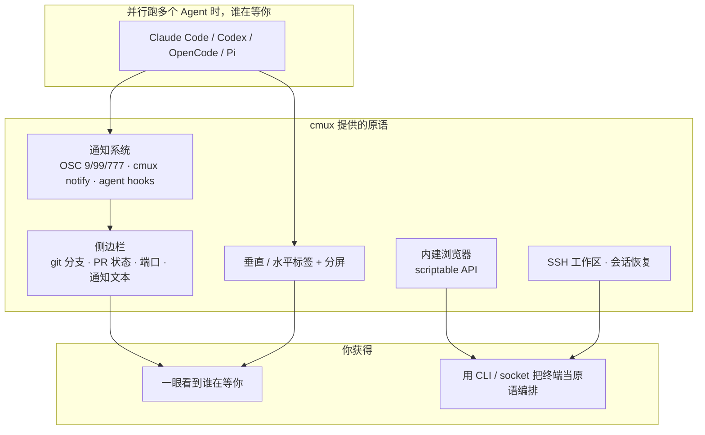

+++
github_repo = "manaflow-ai/cmux"
date = '2026-05-24T23:07:00+08:00'
draft = false
title = 'cmux：一台可编程的 macOS 终端，让并行的 AI Agent 各归其位'
slug = 'cmux-ghostty-terminal-ai-coding'
description = 'cmux 是 manaflow-ai 出品的 Ghostty 内核 macOS 原生终端。它不规定你该怎么用 Agent，而是给出一组可编程原语——通知、侧边栏、内建浏览器、SSH 工作区和会话恢复——让并行跑的多个 Agent 各归其位。'
categories = ['技术笔记']
tags = ['终端', 'macOS', 'AI 编程', '开发工具']
+++

# cmux：一台可编程的 macOS 终端，让并行的 AI Agent 各归其位

cmux 真正解决的问题不是"又一款好看的终端"，而是：当你同时开着好几个 Claude Code、Codex 会话时，怎么一眼看出哪个 Agent 正在等你。它给出的不是一套规定好用法的工作流，而是一组可编程的原语——终端、侧边栏、通知、内建浏览器、SSH 工作区、CLI 和 socket API——剩下的由你自己组合。

## 它是什么

一段话定位：基于 Ghostty 渲染内核的 macOS 原生终端，为并行运行的 AI 编程 Agent 提供通知、垂直标签和可编程控制面。

核心数据（GitHub API 2026-08-06 验证）：

| 项 | 值 |
|------|------|
| Stars | 25,678 |
| Forks | 2,159 |
| 主语言 | Swift（原生 AppKit，非 Electron） |
| 许可证 | GPL（README 声明 free and GPL-licensed） |
| 创建时间 | 2026-01-28 |
| 默认分支 | main |
| 官网 | cmux.com |
| 最新 Release | v0.64.22（2026-08-03） |

仓库官方描述：*Open source Ghostty-based macOS terminal with vertical tabs and notifications for AI coding agents*——开源、Ghostty 内核、macOS、垂直标签、面向 AI 编程 Agent 的通知。

## 它要解决什么问题

作者 manaflow 自己并行跑大量 Claude Code 和 Codex 会话。用 Ghostty 开一堆分屏，靠 macOS 原生通知判断谁需要他，但 Claude Code 的通知永远只有一句 "Claude is waiting for your input"，没有上下文；标签一多，连标题都读不清。也试过几款 coding orchestrator，大多是 Electron/Tauri，性能不行，而且图形界面把工作流锁死——他更愿意留在终端里。

于是他自己用 Swift/AppKit 写了一个原生 app，用 libghostty 做渲染内核，直接读取已有的 `~/.config/ghostty/config` 主题、字体和颜色。所以 cmux 不是 Ghostty 的分叉，而是搭在它渲染引擎之上的另一个应用，就像应用用 WebKit 渲染网页一样。

## 机制怎么拆

系统由几条各自独立的主线组成，下面这张图先把"东西怎么分"画清楚：

## 核心机制

### 通知：蓝色光圈 + 侧边栏亮起

通知是 cmux 最核心的增量。当某个进程需要你注意时，它的 pane 会出现一圈蓝色光环，侧边栏里对应的标签同步亮起，还伴随通知弹层和一条 macOS 桌面通知。触发方式有三个来源：

- 标准终端转义序列（OSC 9 / 99 / 777）；
- `cmux notify` 这个 CLI，可以接进 Claude Code、OpenCode 等 Agent 的 hooks；
- 直接调用 CLI/socket。

`Cmd+Shift+U` 跳到最新一条未读，`Cmd+I` 打开通知面板集中查看。这样在多分屏、多标签下，你不用逐个切过去看，就能知道哪一格在等你。

### 侧边栏：每个 workspace 的"体检表"

侧边栏用垂直标签展示每个 workspace 的状态：git 分支、关联 PR 的状态和编号、工作目录、正在监听的端口，以及最新一条通知文本。分屏既可水平也可垂直。作者说自己"靠这些信息在多标签之间导航"，这就是它比一堆原生通知强的地方——上下文是带上的。

### 内建浏览器：让 Agent 直接操作 dev server

cmux 内置一个浏览器分屏，可脚本化 API 移植自 vercel-labs/agent-browser。Agent 可以拍下无障碍树快照、拿到元素引用、点击、填表、执行 JS。你可以把浏览器 pane 和终端并排，让 Claude Code 直接跟本地 dev server 交互，而不是自己开一个浏览器费劲操作。

### SSH 工作区与远程 tmux

`cmux ssh user@remote` 会为远程机器建一个 workspace，支持 `--command "omp 'investigate auth'"` 在首个远程终端里跑一条初始命令。浏览器 pane 会走远程网络路由，所以远端 `localhost` 直接可用；把图片拖进远程会话会通过 scp 上传。远程 agent 跑在远端，你在 cmux 里驱动它们。

### 会话恢复与 hooks

`cmux hooks setup` 会安装它能找到的 Agent hooks，`cmux hooks setup codex`、`cmux hooks setup --agent opencode` 单独装特定 Agent。恢复集成支持 Claude Code、Codex、Grok、OpenCode、Pi、Amp、Cursor CLI、Gemini、Rovo Dev、Copilot、CodeBuddy、Factory、Qoder。cmux 会存下布局、工作目录、滚动历史（尽力）和浏览器导航历史；tmux、vim 这类不支持的应用恢复为普通终端重开。想关掉自动恢复 Agent 会话，在 `~/.config/cmux/cmux.json` 里设 `"terminal": { "autoResumeAgentSessions": false }`。

## 一次真实工作流

假设你同时接两个活：一个在项目 A 修 bug，一个在项目 B 让 Codex 写测试。

- `Cmd+N` 各开一个 workspace，侧边栏里分别显示 A、B 的 git 分支和端口。
- 项目 B 的 Codex 跑完等你确认，pane 边缘浮起蓝色光圈，侧边栏对应标签亮起，同时弹一条系统通知。
- 你按 `Cmd+Shift+U` 跳到项目 B 的最新未读，回到终端确认，Codex 继续。
- 项目 A 的 Claude Code 需要看页面效果，你在它旁边按 `Cmd+Shift+L` 分出一个浏览器 pane，Claude Code 通过脚本化 API 直接操作本地 dev server。
- 晚上退出，第二天 `Cmd+Shift+O` 重开上一个会话，布局、目录、浏览器历史都回来了。

## 性能与 benchmark 的诚实口径

README 对性能只给了定性说法——"fast startup, low memory"、GPU 加速由 libghostty 承担——没有公开可复现的 benchmark 数字。作者把它和 Electron/Tauri 编排器对比，说的是体感，不是测量。网上流传的"空闲 45MB""启动 87ms"这类具体数字没有出处，别当真。cmux 是原生 Swift 应用，这点比 Electron 天然轻，但"到底轻多少"没有官方数据支撑。

## 适用边界与采用顺序

适合你先上的情况：

- 并行跑多个 coding agent，靠通知判断谁在等你的重度用户；
- 喜欢留在终端、不想被图形编排器锁死工作流的人；
- 已经在用 Ghostty——配置直接复用，几乎零迁移成本。

可以先缓一缓的情况：

- 大多数时间只开一个终端会话，通知和侧边栏的收益不明显；
- 主力是 Linux/Windows——cmux 目前只支持 macOS，iOS 应用还在 beta。

采用顺序建议：先用 DMG 装上，确认它能读到你现有 Ghostty 配置、跑起来通知正常；再接 agent hooks（`cmux hooks setup`）让通知带上上下文；然后按需上内建浏览器、SSH 工作区和多 Agent 编排。

## 结语

cmux 的价值不在多一个能分屏的终端，而在两件事：一是把"谁在等我"从灾难性的原生通知里解救出来，变成带上下文的可编排通知流；二是用 CLI 和 socket 把整个终端变成能被 Agent 自身调用的原语。它刻意不规定你该怎么做——把可组合的原语交给开发者，剩下的由最熟悉自己代码库的人去拼。