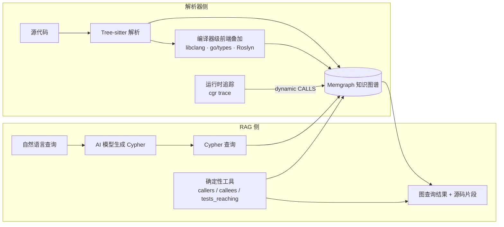

# Code-Graph-RAG：把 monorepo 的结构关系建成知识图谱，再让 AI 沿着图查代码

## 核心判断

传统代码搜索靠关键词或正则，理解代码靠读文件。Code-Graph-RAG 提供第三条路：**把代码库的结构信息（谁调用了谁、谁定义了什么、谁依赖了哪个模块）提取成知识图谱，然后用两种方式查询它——让 AI 把自然语言转成 Cypher，或者直接调确定性的图查询工具**。

它不是在嵌入向量里找相似文本，而是在图数据库里走边。从入口点沿调用边出发，能找到所有可达但从未被调用的死代码；沿 `FLOWS_TO` 数据流边追踪，能看到一个值从 `os.getenv` 读入到写出 `STDOUT` 的完整路径——这条边本质上是进程内的污点传播模型，"这个用户输入能流到哪次数据库写入"这类问题因此变成了图可达性问题。

| 项目 | 数据（2026-09-29 核实） |
|------|------|
| 仓库 | [vitali87/code-graph-rag](https://github.com/vitali87/code-graph-rag) |
| Stars / Forks | 5,189 / 688 |
| 语言 | Python（wheel 为纯 Python，要求解释器 3.12+） |
| 协议 | MIT（[LICENSE](https://github.com/vitali87/code-graph-rag/blob/main/LICENSE)） |
| 版本 | 最新 release v0.1.38（2026-09-29，与 PyPI 同步）；main 最新 tag v0.1.41 |
| 官网 | [code-graph-rag.com](https://code-graph-rag.com)（提供托管与本地部署的企业服务） |

## 系统地图

系统由两个子系统组成，外加一层可选的增强：



**解析器侧**：Tree-sitter 对每种语言生成 AST，提取函数、类、方法、模块及它们之间的关系，统一写入 Memgraph，全语言共用一套图 schema。有工具链可用时，编译器级前端在其上叠加精确事实——libclang 管 C/C++（默认混合模式，`CPP_FRONTEND=hybrid`），`go/types` 管 Go，C#、Java、Python 可分别选配 Roslyn、javac、Jedi。动态追踪（`cgr trace`）再把测试运行或 eBPF 采集到的真实调用合并进图。

**RAG 侧**（`codebase_rag/` 包）：一条路是交互式 CLI，AI 模型把自然语言转写成 Cypher，执行后返回匹配的代码片段和结构关系（agent 框架基于 pydantic-ai）；另一条路是确定性工具——`cgr graph` 命令和 MCP 工具里的 `resolve`、`callers`、`callees`、`tests_reaching` 等，固定图查询、不经 LLM，同一张图永远给出同样的 JSON。需要可复现结果时走第二条路。

## 图 schema 要点

图的节点远不止代码定义：除了 `Function`、`Class`、`Method`、`Module`，还有 `File`、`Interface`、`Enum`、`Parameter`、`Field` 这些结构节点，代表外部 I/O 目标的 `Resource`（文件、环境变量、网络端点、数据库等 8 种 kind），Markdown 文档的 `Section`，以及把"为什么"笔记钉在图上的 `Gloss`。关系类型有 34 种，调用、引用、导入之外还有 `INHERITS`/`IMPLEMENTS`（继承与实现）、`READS_FROM`/`WRITES_TO`（I/O 访问）、`EXPOSES`（把处理函数连到它暴露的 HTTP 路由或 RPC 方法）。

两个设计值得注意：

**边带定位与解析方式**。`CALLS`、`REFERENCES`、`IMPORTS` 边记录产生它的表达式位置（`line`/`col`），调用边还带实参数量与关键字名；`resolution` 属性标注这条边是怎么解析出来的——`exact`（作用域/导入/类型确证）、`overload`、`heuristic`（仅按名字匹配）、`trace_confirmed`（运行时追踪佐证过）、`dynamic`（只有运行时才看到的调用）。一个函数调用 `g` 两次就有两条 `CALLS` 边，每个调用点一条。

**数据流边是分形态的**。`FLOWS_TO` 用 `kind` 属性区分三种传播：resource → resource（函数体内从读一个资源到写另一个）、caller → callee（实参传入，`kind = arg`）、callee → caller（返回值带回，`kind = return`）。传播按赋值链推进，跨函数的实参交接只走一层——保守但可解释。

资源类节点和 I/O 边默认关闭，索引时设 `CGR_CAPTURE=io` 启用；`Pattern`、`CodeSmell`、`SecurityIssue` 三类发现节点对应 `findings` 捕获组。

## 支持语言

完全支持 13 种：Python、TypeScript、TSX、JavaScript、Rust、Go、Java、C、C++、C#、PHP、Lua、Dart。Scala 和 SQL（PostgreSQL 方言，目前限存储函数）开发中。

另一层是可插拔的 ast-grep 结构层，覆盖 Ruby、Kotlin、Swift、Elixir、Haskell、Solidity、Bash、Nix 八种语言：每门语言一个 YAML 模式文件，从 AST 匹配生成 `Module`、`Function`、`Class` 节点和 `IMPORTS` 边，加新语言的成本是写一个 YAML 而不是适配一套 Tree-sitter grammar。但这一层有明确的能力边界——**它不解析调用关系，产不出 `CALLS` 边**，所以依赖调用图的分析（死代码检测等）会跳过这些文件，命令会打印跳过了多少符号。

Markdown 文档走独立的文档层：每个标题成为 `Section` 节点，按标题层级通过 `CONTAINS_SECTION` 边嵌套。文档没有调用图，同样不进死代码分析。

## 一个查询如何流过系统

以"找出 `processPayment` 函数调用的所有函数，以及它们的定义位置"为例：

1. **图构建**（预先完成）：`cgr start --repo-path ./my-repo --update-graph` 触发 Tree-sitter 解析整个仓库，在 Memgraph 中创建节点和 `CALLS` 边。
2. **交互路径**：在 CLI 中用自然语言问"show me all functions called by processPayment"，AI 模型把它转写成 Cypher：

   ```cypher
   MATCH (f:Function {name: 'processPayment'})-[:CALLS]->(called:Function)
   RETURN called.qualified_name, called.path, called.start_line
   ```

3. **确定性路径**：等价操作是调 MCP 工具 `callees`（或 `cgr graph` 子命令），传入限定名，直接拿回每个调用点的调用者、文件、行号、实参数——同一张图，同样的 JSON，没有任何模型参与。
4. **代码检索**：按返回的 `path` 和 `start_line` 从源码提取实际片段，呈现给用户。

与文本搜索的差别在间接调用：A 调 B、B 调 C，grep "A" 找不到 C，图查询可以递归走边。`tests_reaching` 工具反过来走——给定一个函数，列出哪些测试函数能通过调用链到达它，改完代码该跑哪些测试由图给出。

## 核心能力

| 能力 | 说明 |
|------|------|
| 自然语言查询 | 交互 CLI 里提问，AI 生成 Cypher，答案锚定真实图结构 |
| 确定性图查询 | `resolve`/`definition`/`callers`/`callees`/`implementors`/`overrides`/`importers`/`tests_reaching` 固定查询，无 LLM |
| 死代码检测 | `cgr dead-code` 从入口点走 `CALLS`/`REFERENCES` 边，报告不可达函数；`--fail-on-found` 可直接进 CI |
| 重复代码检测 | `cgr duplicates` 按 AST 骨架指纹找结构克隆，改名和轻改副本都在射程内（相似度默认阈值 0.8） |
| 代码编辑 | agent 做 AST 级精准补丁，改前出 diff 预览；`rename` 沿图重命名所有引用点，解析不确定的位置拒绝执行 |
| 动态追踪 | `cgr trace` 把测试运行或 eBPF 采集的真实调用合并进图，动态分发、反射、注册表调用由此可见 |
| 结构化搜索替换 | ast-grep 的 AST 模式匹配与重写，不依赖文本正则 |
| 语义搜索 | UniXcoder 嵌入按意图找函数，向量默认存 Qdrant（本地文件模式，可切 Qdrant Cloud 或 Milvus Lite） |
| 实时更新 | 文件监视增量更新，只重解析变更文件及其依赖；MCP `reingest` 让一次编辑在数百毫秒内落图 |
| MCP Server | 约 20 个工具，Claude Code 等 MCP 客户端可直查直编；`annotate`/`glosses` 把设计笔记钉在图上，随代码演进自动标注 EXACT/STALE/MOVED |

死代码检测的入口点启发式值得单独说明：导出与公共符号、测试、带路由/任务/CLI 命令类装饰器的函数、dunder 与生命周期方法都算可达根。官方对输出的定性是"待复核的候选清单，不是保证可删清单"——动态分发、反射、字符串键查找触达的代码静态图看不见，删前必须逐条人审。

## 安装与快速开始

前置依赖：Python 3.12+（硬下限，Debian Bookworm 系统自带的 3.11 不够）、Docker 与 Docker Compose（跑 Memgraph）、cmake（编译 pymgclient 需要）、ripgrep。

```bash
# 安装（推荐 uv；semantic extras 含向量检索）
uv tool install "code-graph-rag[treesitter-full,semantic]"

# 或用 pipx
pipx install "code-graph-rag[treesitter-full,semantic]"

# 启动打包好的 Memgraph + Qdrant 栈（不需要自备 Compose 文件）
cgr daemon up

# 解析仓库到图中
cgr start --repo-path /path/to/repo --update-graph

# 进入交互查询
cgr start --repo-path /path/to/repo
```

版本节奏有个容易困惑的点，README 专门写了一节：git tag 每次合并都打（当前 v0.1.41），GitHub release 和 PyPI 每 50 个版本发一次（当前 v0.1.38），安全修复例外、立即发。`uv tool install` 装到的是最新 release 而不是最新 tag，想跑最新代码得从 git 安装；日常使用两者通常只差几十个补丁版本。

多个仓库可以依次索引到同一张共享图中，同步一个项目不影响其他项目。`--clean` 参数清空的是**所有**项目而不是当前项目（会先确认），单独的 `cgr delete-project` 才是只删一个。

## 适用边界

**适合**：

- 接手大型 monorepo，需要快速理解代码结构和依赖关系
- 技术债清理：系统性地找死代码、重复代码、循环依赖
- 跨语言调用链追溯和数据流溯源（"这个输入能流到哪次写出"）
- 作为 MCP 服务器接进 Claude Code 等客户端，做图驱动的重构安全网（rename 前先看影响面、check 后看结构增量、tests_reaching 圈定要跑的测试）

**不适合**：

- 小型项目（几百文件以内），grep 和 IDE 跳转足够快
- ast-grep 结构层语言的调用图分析——Ruby、Kotlin 等产不出 `CALLS` 边，死代码检测对它们不适用
- 需要 100% 精度的场景：Tree-sitter 是语法级解析，动态分发和反射要靠 `cgr trace` 补，且补不全
- 分析二进制文件或编译产物；无法运行 Docker 的环境（Memgraph 是硬依赖）

## 该怎么决定用不用

判断标准不是"项目大不大"，而是"你的问题是否依赖结构关系"。找死代码、重复代码、跨语言调用链、变量流向——这些本质是图问题，值得上。查某个符号在哪定义——IDE 跳转更快，不必为它维护一张图。

真要用，按这个顺序小步走：先 `cgr daemon up` 建栈，对单个目录 `cgr start --update-graph` 建图；跑一次 `cgr dead-code` 看产出是否符合直觉，再跑 `cgr duplicates` 交叉验证；产出可信后接 MCP 进日常工具链；活跃开发期另开一个终端跑实时更新。需要数据流分析的项目，索引时记得 `CGR_CAPTURE=io`，否则 `FLOWS_TO` 和 `Resource` 节点根本不在图里。

本文按 2026-09-29 的仓库状态（release v0.1.38）核实。这个项目发版极快，命令参数和 schema 细节以你安装版本的 `cgr help` 与 [docs/](https://github.com/vitali87/code-graph-rag/tree/main/docs) 目录为准。
