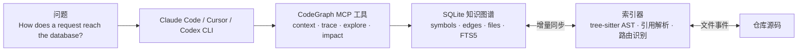

CodeGraph 把 AI Coding Agent 在大型仓库里最耗钱、也最容易失焦的一段工作提前做完了：先把代码库索引成一张可查询的图，再让 agent 沿着符号、调用关系、导入链和路由绑定去找答案。模型本身没有变强，变的是它不必每次都从 `grep`、`glob`、`Read` 重新找路。

这类工具只有在“结构理解”任务里才会明显拉开差距。问“一个请求怎么打到数据库”“改这个接口会影响哪些实现”“这个 handler 是从哪条路由进来的”，CodeGraph 往往能把几十次文件扫描压缩成几次图查询。要只是搜一段字符串，`rg` 依旧更直接。

## 这篇文章的 5 条主线

- CodeGraph 改造的是 AI Coding Agent 工作流里的哪一段，为什么大型仓库收益最明显？
- `codegraph_context`、`codegraph_trace`、`codegraph_explore` 分别适合什么问题？
- tree-sitter、SQLite、FTS5、自动增量同步和路由感知是怎么串成一条链路的？
- 官方 benchmark 到底测了什么，哪些结论成立，哪些结论不能外推？
- 在 Claude Code、Cursor、Codex CLI、opencode、Hermes Agent 里，怎样以最低成本接入 CodeGraph？

## CodeGraph 把 discovery 前置成可复用索引

CodeGraph 的价值，落在 discovery 这一段，也就是“答案到底藏在哪”。没有它时，agent 往往先靠 `grep`、`glob`、`Read` 和 Explore 子代理一层层试出来；有了它以后，问题先落到图查询，再决定是否需要补读少量源码。预算不再反复花在找路上，而是更多花在解释相关实现。

| 没有 CodeGraph | 有 CodeGraph |
| ------ | ------ |
| Agent 先扫文件，常见路径是 `grep`、`glob`、`Read` 和文件扫描子代理 | Agent 先查图，再决定是否需要补读源码 |
| 每次提问都重复做 discovery | 初始化后复用同一份索引 |
| 成本主要花在“答案在哪里” | 成本主要花在“相关代码到底做了什么” |
| 大仓库里工具调用和 token 很容易膨胀 | 很多结构问题能在少量工具调用内结束 |

把它看成“给 agent 预先画好的代码地图”，比把它看成“又一个搜索命令”更接近事实。

## 先把系统拆成两条线看

理解 CodeGraph 时，最容易混在一起的是两条主线：一条负责把仓库建成图，另一条负责让 agent 在图上提问。先把边界拆开，后面的设计就很好理解。



从实现上看，核心只有 4 个层次：

- 抽取：用 tree-sitter 把源码解析成 AST，而不是用正则去猜。
- 存储：把符号、边和文件索引写进本地 SQLite，并启用 FTS5。
- 解析：把调用、导入、继承、实现和框架路由补成可查询、可遍历的图。
- 同步：监听文件变更，在 2 秒安静窗口后只更新受影响的源码文件。

如果你准备顺着仓库读一遍实现，最省时间的入口也是这 4 层：`src/extraction/` 负责 tree-sitter 解析与符号抽取，`src/resolution/` 负责导入解析、名称匹配和框架路由，`src/graph/` 负责遍历与查询，`src/context/` 负责把结果整理成 agent 能直接消费的 Markdown 或 JSON。重型解析任务会被分流到 `parse-worker`，避免把交互查询卡死在单线程上。

数据层则单独落在 `src/db/`。Schema 写在 `schema.sql`，查询走预编译语句；官方实现同时兼容 `better-sqlite3` 和 `node-sqlite3-wasm` 这两类后端，并默认启用 WAL 模式。日常读取不会因为一次索引写入就整库阻塞，真要排查锁冲突时也更容易判断问题是出在旧版本安装，还是出在网络盘、WSL 挂载目录这类不适合 WAL 的文件系统。

## 这张图是怎么建出来的

### 用 tree-sitter 拿到可靠的结构边界

CodeGraph 的第一步是用 tree-sitter 解析源码。它的关键价值不只是支持多语言，而是能稳定区分函数、类、方法、接口、导入、继承这些结构化对象。对 agent 来说，“名字出现过” 和 “这里真的是一个定义” 是两件事，AST 解决的是后者。

### 用 SQLite 和 FTS5 把索引落到本地

官方 README 给出的实现很直接：索引写入本地数据库 `.codegraph/codegraph.db`，全文搜索由 FTS5 提供。这一套设计很务实。

- SQLite 足够轻，适合和项目目录一起初始化、一起迁移。
- FTS5 让 CodeGraph 不只能走图关系，也能按名称和文本检索。
- 数据全留在本机，不需要 API Key，也没有外部服务依赖。

很多“代码知识图谱”项目最后都会绕回远程服务；CodeGraph 则反过来，先保证本地就能成立，再去谈 agent 集成。

### 只抽 AST 不够，后面还要做 resolution

只有 AST，还回答不了“从 A 到 B 能不能走通”。CodeGraph 在抽取后还会做一轮 resolution：函数调用要连回定义，导入要连回源文件，继承和实现要补成边，框架约定也要识别出来。MCP 文档里对 `codegraph_trace` 的描述尤其能说明这一点：它不只是把名字串起来，还会沿着动态派发、回调和接口实现继续追下去。

### 路由感知让图不只停在代码内部

对 Web 项目来说，更有用的一层补边，是把“这段代码到底挂在哪条入口上”补出来。CodeGraph 会把 URL 模式和处理函数连起来，生成 `route` 节点；查某个 view 或 controller 的调用方时，能直接看到绑定它的路由。

按当前官方文档，framework-aware route nodes 覆盖 14 组 Web 框架和路由系统，包括 Django、Flask、FastAPI、Express、NestJS、Laravel、Drupal、Rails、Spring、Gin / chi / gorilla / mux、Axum / actix / Rocket、ASP.NET、Vapor，以及 React Router / SvelteKit。除此之外，`.vue` 文件还支持 Nuxt 的 page、API、middleware route extraction。

### 自动增量同步解决的是“日常开发能不能用”

如果每保存一次文件都要全量重建索引，CodeGraph 只适合做演示，不适合真开发。它当前的实现是用原生文件事件接口 FSEvents、inotify、ReadDirectoryChangesW 监听变化，在 2 秒安静窗口后增量同步，并且只处理源码文件。

这里还有一个容易忽略的细节：零配置不等于“什么都索引”。官方文档明确写了默认排除策略，`node_modules`、`vendor`、`dist`、`build`、`target`、`.venv`、`Pods`、`.next` 这类依赖、产物和缓存目录会被跳过；Git 仓库下会尊重 `.gitignore`，非 Git 项目则直接读取 `.gitignore`；大于 1 MB 的文件默认也不进图。这让索引更像“你的代码”，而不是把第三方噪声一起吞进去。

如果要手动排查同步本身，命令行层面还有一组更直接的入口：`codegraph watch` 用来开启文件监听，`codegraph unwatch` 用来停掉监听，`codegraph sync` 则适合在怀疑索引没跟上时手动补一次。平时不一定会用到，但当你怀疑“图里怎么还没有刚改过的符号”时，这组命令比盲猜缓存状态更有效。

## Agent 应该怎么问这张图

官方 README 里最值得记住的一条建议，是使用顺序：结构问题要直接调用 CodeGraph 工具，不要再把探索交给文件扫描子代理，也不要回到 `grep` / `Read` 循环。

CodeGraph 的收益全部来自一件事：提前建好了索引。如果问题到了 agent 手里还是先按老路去扫文件，最贵的 discovery 照样重新发生一遍，CodeGraph 就只剩额外开销。

常用工具和问题类型，大致可以这样对应：

| 工具 | 更适合的问题 | 作用 |
| ------ | ------ | ------ |
| `codegraph_context` | “这个任务相关的入口点和关键符号在哪里？” | 先把问题所在区域圈出来；它本质上是把 `search`、`node`、`callers`、`callees` 组合成第一跳 |
| `codegraph_trace` | “X 是怎么到达 Y 的？” | 一次返回调用路径，并沿动态派发、回调、接口实现继续走 |
| `codegraph_explore` | “把这批相关符号的源码集中给我看” | 把多个相关符号按文件打包返回，减少碎片化读取 |
| `codegraph_search` | “我只知道名字，先帮我定位” | 按名称搜符号 |
| `codegraph_callers` / `codegraph_callees` | “我想单跳展开调用流” | 适合局部验证和补边 |
| `codegraph_impact` | “改这个符号会波及哪些代码？” | 重构、修 bug、改接口前最有用 |
| `codegraph_node` | “给我这个符号的签名和源码” | 适合精确确认单点 |
| `codegraph_files` | “索引里到底有哪些文件？” | 比直接扫文件系统更快 |
| `codegraph_status` | “索引现在健不健康？” | 看统计信息、同步状态和存储状态 |

实际使用时，一条更高效的路径是：先问图，再补读细节。只有当 CodeGraph 没覆盖到某个实现细枝末节时，再回退到 `Read` 或 `Grep`。

## 一次真实问题怎么穿过系统

官方 README 用的示例问题是 “How does a request reach the database?”。这类题目很适合看出 CodeGraph 的节奏和边界。

| 步骤 | 工具 | 拿到什么 | 为什么这样问 |
| ------ | ------ | ------ | ------ |
| 1 | `codegraph_context` | 入口点、相关符号、周边代码片段 | 先确认问题落在哪个子系统 |
| 2 | `codegraph_trace` | 从请求入口到数据层的路径 | 这是典型的 “X 如何到达 Y” 问题 |
| 3 | `codegraph_explore` | 多个关键符号的源码和关系图 | 把相关实现集中读完 |
| 4 | `codegraph_node` / `callers` / `callees` | 单点补证据 | 对某个 hop 做局部确认 |
| 5 | `Read` / `Grep`（仅在必要时） | 缺失的边角细节 | 只在图没覆盖到时回退 |

如果仓库本身是 Web 项目，第一跳常常还能多拿一层信息：某个 handler 不只是"被谁调用"，它还会带出绑定它的 URL 模式。agent 不必再去猜入口是 `routes.ts`、`urls.py`、controller decorator 还是某个 router builder。

这个工作流里最关键的约束只有一个：别把结构问题重新委托给文件扫描子代理。官方 benchmark 的收益，就是建立在“agent 直接调用 CodeGraph 工具”这件事上。

## Benchmark 值得看，但读法要克制

截至 README 对 v0.9.4 在 2026-05-24 的复验结果，CodeGraph 在 7 个真实开源仓库上的平均收益是：35% 更便宜、57% 更少 tokens、46% 更快、71% 更少工具调用。

| 代码库 | 语言 | 成本 | Tokens | 时间 | 工具调用 |
| ------ | ------ | ------ | ------ | ------ | ------ |
| VS Code | TypeScript | 26% 更便宜 | 78% 更少 | 52% 更快 | 85% 更少 |
| Excalidraw | TypeScript | 52% 更便宜 | 90% 更少 | 73% 更快 | 96% 更少 |
| Django | Python | 12% 更便宜 | 36% 更少 | 19% 更快 | 53% 更少 |
| Tokio | Rust | 82% 更便宜 | 86% 更少 | 71% 更快 | 92% 更少 |
| OkHttp | Java | 2% 更便宜 | 13% 更少 | 31% 更快 | 45% 更少 |
| Gin | Go | 21% 更便宜 | 34% 更少 | 27% 更快 | 40% 更少 |
| Alamofire | Swift | 47% 更便宜 | 64% 更少 | 48% 更快 | 83% 更少 |

这组数字的读法：

- 测的是什么：Claude Code 在 headless 模式下回答单个架构问题的总成本，对比“启用 CodeGraph MCP”和“空 MCP 配置”，每个仓库两组配置各跑 4 次，取中位数；内建 `Read`、`Grep`、`Bash` 两边都开放。
- 反映了什么：当问题本质上是结构理解时，知识图谱最直接降低的是 discovery 成本。大仓库里，agent 往往能在少量工具调用内直接从索引拿到足够上下文，而不是反复扇出到 `grep`、`Read` 和文件扫描子代理。
- 不能推出什么：这些数字不能证明 CodeGraph 对所有任务都有效。纯文本生成、一次性脚本、小仓库里的简单定位，本来就不依赖深度 discovery，收益自然会小很多。

README 还特别强调了一点：大仓库上的优势经常伴随“零文件读取”。这不是硬性保证，更像一个信号，说明 agent 在很多结构问题上已经能从图里拿到足够上下文，不必再把预算花在无效扫描上。

## 支持面已经不只是 Claude Code 插件

CodeGraph 的公开文档已经覆盖了 5 种主流 AI Coding Agent：Claude Code、Cursor、Codex CLI、opencode、Hermes Agent。语言上支持 20+ 种，包括 TypeScript、JavaScript、Python、Go、Rust、Java、C#、PHP、Ruby、C、C++、Swift、Kotlin、Scala、Dart、Svelte、Vue、Liquid、Pascal / Delphi、Lua、Luau 等；README 当前把 Objective-C 列为 Partial support。平台方面，Windows、macOS、Linux 的 x64 和 arm64 都有自包含构建，100% 本地运行，数据不离开机器，持久化由 SQLite 完成，不需要 API Key 也不依赖外部服务。

从这个覆盖面和运行方式来看，CodeGraph 已经不像一个 Claude Code 的附属插件了——它更像在往通用代码理解层走。

## 接入并不复杂，但顺序别搞反

官方推荐的安装路径有两条：一条给不想装 Node.js 的用户，一条给已经习惯 npm 的开发者。

### 零依赖安装

```bash
# macOS / Linux
curl -fsSL https://raw.githubusercontent.com/colbymchenry/codegraph/main/install.sh | sh

# Windows (PowerShell)
irm https://raw.githubusercontent.com/colbymchenry/codegraph/main/install.ps1 | iex
```

这条路径的关键点是 No Node.js required。CodeGraph 自带运行时，目标就是“一条命令拿到适合当前系统的构建”。

### npm 方式

```bash
npx @colbymchenry/codegraph
npm i -g @colbymchenry/codegraph
```

安装器会自动识别并配置 Claude Code、Cursor、Codex CLI、opencode、Hermes Agent 中的一个或多个，并写入对应的 MCP 配置与说明文件。

### 初始化项目

```bash
cd your-project
codegraph init -i
```

这一步不能省。执行完以后，项目目录下会出现 `.codegraph/`；重启 agent 后，CodeGraph 工具才会在工作流里生效。

### Claude Code 手动配置

如果不想走交互安装，也可以手动把 MCP server 写进 `~/.claude.json`：

```json
{
  "mcpServers": {
    "codegraph": {
      "type": "stdio",
      "command": "codegraph",
      "args": ["serve", "--mcp"]
    }
  }
}
```

这条路径适合已经有现成 agent 环境、只想精确控制接入方式的人；大多数情况下，直接跑安装器更省事。

## 3 个容易被忽略的工程细节

### `codegraph affected` 让它进入 CI 场景

旧稿更关注 MCP 查询，这没问题，但还少了一个很有工程价值的 CLI：`codegraph affected`。它会沿着导入依赖做传递分析，找出某些源码文件变化后，哪些测试文件会受到影响。

```bash
codegraph affected src/utils.ts src/api.ts
git diff --name-only | codegraph affected --stdin
codegraph affected src/auth.ts --filter "e2e/*"
```

这让 CodeGraph 不只是在“回答问题”时省钱，也能在 CI 和本地回归里减少无意义的全量测试。对已经在用 Vitest、Jest 之类命令的团队来说，这是最容易先落地的一环。

### 零配置不等于没有排查成本

日常最常见的 4 个问题，官方文档其实都给了答案：

- `CodeGraph not initialized`：先在项目目录里跑 `codegraph init`。
- Missing symbols：等自动同步跑完，或者手动执行 `codegraph sync`；再检查文件语言是否受支持，以及是否被 `.gitignore` 或默认排除目录挡掉了。
- `database is locked`：官方现在默认走自带运行时和 `node:sqlite` 的 WAL 模式，理论上不该频繁出现；如果还会碰到，优先检查是不是旧版本安装，或者项目在网络盘、WSL2 `/mnt` 这类不适合启用 WAL 的文件系统上。
- MCP server not connecting：先确认项目已经 `init` 并完成索引，再检查 MCP 配置路径和命令是否正确，最后在命令行里直接跑一次 `codegraph serve --mcp` 看能不能启动。

### `codegraph status` 值得放进排查工具箱

只要你开始把 CodeGraph 当日常工具用，`codegraph_status` 和命令行里的 `codegraph status` 都很有价值。前者适合给 agent 看索引健康，后者适合人工确认统计信息、同步状态，以及数据库是否真的跑在 WAL 模式下。

## 什么时候值得接入，什么时候先别急

下面这些场景，CodeGraph 的收益通常最直接：

- 仓库已经到了几百到上万文件，新人上手和架构问答成本很高。
- 问题类型以“这个请求怎么流过去”“这个函数会影响谁”“这个 handler 挂在哪条路由上”为主。
- 项目跨语言、跨模块、跨框架，靠人工 `grep` 很难快速拼完整调用链。
- 团队已经重度依赖 Claude Code、Cursor 或 Codex CLI 做代码理解，而不是只让模型生成几段样板代码。

收益会明显变小的场景也很明确：

- 仓库很小，原生搜索本来就足够快。
- 任务主要是纯文本生成，而不是代码结构理解。
- 你问的是非常局部、非常确定的问题，一两次 `Read` 就够了。

推荐的落地步骤：先安装到常用 agent，再挑 1 到 2 个最大的仓库初始化索引；先把 `context`、`trace`、`impact` 用在架构问答和影响分析上，再把 `affected` 接进测试或 CI，最后才考虑把它写进团队约定。

## 常见误解

### 它不替代模型

CodeGraph 不会让模型突然更会写业务逻辑。它做的事情更基础：减少模型为了拿到上下文而付出的工具调用和 tokens。

### 它也不替代 `grep`

当你只是搜一段字符串、查一个配置键、找某条日志文案出现在哪时，`rg` 依旧最直接。CodeGraph 的优势在结构化关系，不在所有文本搜索场景里都占优。

### “零文件读取”是高收益场景里的常见结果，不是保证

官方 benchmark 里，大仓库经常出现零文件读取，但这取决于问题类型和工具调用方式。遇到图没有覆盖到的实现细节，回退去读少量源码是正常动作。

### 如果 agent 还在先扫文件，收益会被明显稀释

这是最容易踩的坑。结构问题如果仍然先交给文件扫描子代理，CodeGraph 的优势就会被大幅削弱。它最适合的顺序始终是：先图查询，再补细节。

## 自测问题

读到这里，可以先用 4 个问题检验自己是否已经吃透 CodeGraph：

- 为什么 CodeGraph 在大型仓库上的收益通常远高于小仓库？
- `codegraph_context` 和 `codegraph_trace` 的职责边界分别是什么？
- 为什么官方建议直接调用 CodeGraph 工具，而不是把探索交给文件扫描子代理？
- `codegraph affected` 为什么说明 CodeGraph 不只是一个“问答加速器”？

## 结论

CodeGraph 最值得看的，是它对 AI Coding Agent 工作流的改造足够具体：把最昂贵、最重复、最不稳定的 discovery 阶段前置成可复用的本地索引，再通过 MCP 让 agent 直接消费这张图。

对经常在大型仓库里问架构问题、追调用链、做重构前影响分析的团队，它已经很接近“应该优先接入的基础设施”。如果日常工作主要还是小脚本和文案生成，就没必要为一个并不存在的收益增加维护面。

## 参考资料

- [CodeGraph GitHub 仓库](https://github.com/colbymchenry/codegraph)
- [CodeGraph 官方文档](https://colbymchenry.github.io/codegraph/)
- [CodeGraph npm 页面](https://www.npmjs.com/package/@colbymchenry/codegraph)
