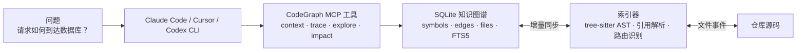

## 1. 学习目标

读完这篇文章，你应该能回答下面 5 个问题：

- CodeGraph 优化了 AI Coding Agent 工作流里的哪一段，为什么大型仓库收益最明显？
- `codegraph_context`、`codegraph_trace`、`codegraph_explore` 分别适合什么问题？
- tree-sitter、SQLite、FTS5、自动增量同步和路由感知是怎样拼成一条完整链路的？
- 官方 benchmark 到底测了什么，哪些结论成立，哪些结论不能外推？
- 在 Claude Code、Cursor、Codex CLI、opencode、Hermes Agent 里，怎样以最低成本接入 CodeGraph？

## 2. 核心判断

CodeGraph 真正优化的，不是模型能力本身，而是模型理解代码库时最贵的那一步：discovery，也就是“答案到底藏在哪”。没有 CodeGraph 时，AI Coding Agent 往往要靠 `grep`、`glob`、`Read`，再配合 Explore 子代理一层层试出来；CodeGraph 则把这一步前置成离线索引，让 agent 直接在图上查调用关系、符号边界和路由绑定。

这意味着它解决的不是“搜索更快一点”，而是“不要为同一段探索反复付费”。对于结构理解类问题，差别往往不是 10% 或 20% 的体验优化，而是把一次回答从几十次工具调用压到几次图查询。

| 没有 CodeGraph | 有 CodeGraph |
| ------ | ------ |
| Agent 先找答案在哪，常见路径是 `grep`、`glob`、`Read` 和文件扫描子代理 | Agent 先查图，再决定是否需要补读少量源码 |
| 每次提问都重复做 discovery | 初始化后复用同一份索引 |
| 成本主要花在“找路” | 成本更多花在“解释真正相关的代码” |
| 大仓库里工具调用和 token 很容易膨胀 | 很多结构问题能在少量工具调用内结束 |

如果只用一句话概括：CodeGraph 不是给 agent 加了一个更花哨的搜索框，而是给它准备了一张已经建好的代码地图。

## 3. 先看系统地图

理解 CodeGraph 时，最容易混在一起的是两条主线：一条负责“把仓库建成图”，一条负责“让 agent 在图上找答案”。把这两条线分开看，很多设计选择就自然了。



从架构上看，CodeGraph 的关键点只有 4 个：

- 抽取：用 tree-sitter 把源码解析成 AST，而不是用正则硬猜。
- 存储：把符号、边和文件索引落到本地 SQLite 里，配上 FTS5 全文搜索。
- 解析：把调用、导入、继承和框架路由这类关系补全成可查询的图。
- 同步：用原生文件事件监听仓库变化，在 2 秒安静窗口后增量刷新，而不是每次都全量重建。

## 4. CodeGraph 是怎么把仓库建成图的

### 4.1 抽取层：从源码到 AST

CodeGraph 的第一步是用 tree-sitter 解析源码。这样做的价值不只是“支持多语言”，更重要的是它能稳定地区分函数、类、方法、接口、导入、继承这些结构化对象。对 AI Coding Agent 来说，能不能分清“一个名字出现过”和“这个名字真的是一个定义”是两回事，AST 解析解决的是后者。

### 4.2 存储层：本地 SQLite + FTS5

官方 README 明确给出了存储实现：所有索引写入本地 SQLite 数据库 `.codegraph/codegraph.db`，并启用 FTS5 做全文搜索。这个选择很务实。

- SQLite 足够轻，适合放在项目目录里，和仓库一起初始化、一起迁移。
- FTS5 让 CodeGraph 不只能走图关系，也能做名称和文本检索。
- 数据全留在本机，不需要 API key，也没有外部服务依赖。

很多“知识图谱”项目最后都绕回远程服务；CodeGraph 恰恰相反，它先保证本地可用，再谈 agent 集成。

### 4.3 解析层：把离散节点补成真正可走的图

只有 AST 还不够，因为 AI Coding Agent 真正需要的是“从 A 能不能走到 B”。CodeGraph 在抽取后还会做一轮 resolution，把函数调用解析到定义，把导入解析到源文件，把继承、实现和框架约定也补成边。

这一步尤其重要的扩展是路由感知。对于 Web 项目，CodeGraph 不只是知道某个 handler 存在，还会把 URL 模式和处理函数连起来，生成 `route` 节点。这样你查一个 view 或 controller 的调用方时，能直接看到它挂在哪条路由上。

官方列出的路由识别范围覆盖 Django、Flask、FastAPI、Express、NestJS、Laravel、Drupal、Rails、Spring、Gin/chi/gorilla/mux、Axum/actix/Rocket、ASP.NET、Vapor、React Router、SvelteKit；`.vue` 文件还支持 Nuxt 的 page、API、middleware route extraction。

### 4.4 同步层：增量更新，而不是反复全量重建

CodeGraph 的另一个关键设计是自动增量同步。官方说明里给出的实现是：MCP server 使用原生文件事件接口 FSEvents、inotify、ReadDirectoryChangesW 监听变更，在 2 秒安静窗口后只同步受影响的源码文件。

这比“保存一次就全量重建索引”实用得多。前者适合日常开发，后者只适合 demo。

## 5. Agent 应该怎样使用这张图

官方 README 里最值得记住的一条指导，不是 benchmark 数字，而是这句使用原则：**直接用 CodeGraph 工具回答结构问题，不要再把探索委托给文件扫描子代理，也不要回到 `grep`/`Read` 循环。**

原因很简单：CodeGraph 的收益来自“提前建好了索引”。如果问题到了 agent 手里，仍然先走老路去扫文件，那么最贵的 discovery 又会被重复执行一遍，CodeGraph 反而成了额外开销。

官方工具各自更适合下面这些问题：

| 工具 | 最适合的问题 | 说明 |
| ------ | ------ | ------ |
| `codegraph_context` | “这个任务相关的入口点和关键符号在哪里？” | 先把问题所在区域圈出来，适合做第一跳 |
| `codegraph_trace` | “X 是怎么到达 Y 的？” | 一次给出调用路径，能跨动态派发、回调和接口实现 |
| `codegraph_explore` | “把这批相关符号的源码集中给我看” | 把多个相关符号按文件打包返回，减少碎片化读取 |
| `codegraph_search` | “我只知道一个名字，先帮我定位” | 用名称搜符号 |
| `codegraph_callers` / `codegraph_callees` | “我只想单跳展开调用流” | 适合局部验证和补边 |
| `codegraph_impact` | “改这个符号会波及哪些代码？” | 重构、修 bug、改接口前最有用 |
| `codegraph_node` | “给我一个符号的签名和源码” | 适合精确确认单点 |
| `codegraph_files` | “索引里到底有哪些文件？” | 比直接扫文件系统更快 |
| `codegraph_status` | “索引健康不健康？” | 看统计信息、排查同步和存储状态 |

直接调用，并不意味着永远不读文件。更准确的说法是：**先问图，后补读细节**。只有当 CodeGraph 没覆盖到某个具体实现细节时，再回退到 `Read` 或 `Grep`，这才是成本最低的顺序。

## 6. 一次真实问题如何流过系统

以官方示例问题 “How does a request reach the database?” 为例，更合理的工作流通常是这样的：

| 步骤 | 工具 | 拿到什么 | 为什么这样问 |
| ------ | ------ | ------ | ------ |
| 1 | `codegraph_context` | 入口点、相关符号、周边代码片段 | 先确认问题落在哪个子系统 |
| 2 | `codegraph_trace` | 从请求入口到数据层的调用路径 | 这是“X 如何到达 Y”的典型题型 |
| 3 | `codegraph_explore` | 多个关键符号的源码和关系图 | 把真正相关的实现集中读完 |
| 4 | `codegraph_node` / `callers` / `callees` | 单点补证据 | 对某个 hop 做局部确认 |
| 5 | `Read` / `Grep`（仅在必要时） | 缺失的边角细节 | 只在 CodeGraph 没覆盖时回退 |

这个流程里最重要的一点，是 **不要一上来就派文件扫描子代理**。官方 benchmark 的收益，恰恰建立在“agent 直接调用 CodeGraph 工具”这件事上。README 里甚至明确说明：如果问题还是交给文件扫描子代理，子代理照样会去读文件，CodeGraph 的优势就会被抵消。

## 7. Benchmark 应该怎么看

截至官方 README 在 2026-05-24 针对 v0.9.4 的复验结果，CodeGraph 在 7 个真实开源仓库上的平均收益是：**35% 更便宜、57% 更少 tokens、46% 更快、71% 更少工具调用**。

| 代码库 | 语言 | 成本 | Tokens | 时间 | 工具调用 |
| ------ | ------ | ------ | ------ | ------ | ------ |
| VS Code | TypeScript | 26% 更便宜 | 78% 更少 | 52% 更快 | 85% 更少 |
| Excalidraw | TypeScript | 52% 更便宜 | 90% 更少 | 73% 更快 | 96% 更少 |
| Django | Python | 12% 更便宜 | 36% 更少 | 19% 更快 | 53% 更少 |
| Tokio | Rust | 82% 更便宜 | 86% 更少 | 71% 更快 | 92% 更少 |
| OkHttp | Java | 2% 更便宜 | 13% 更少 | 31% 更快 | 45% 更少 |
| Gin | Go | 21% 更便宜 | 34% 更少 | 27% 更快 | 40% 更少 |
| Alamofire | Swift | 47% 更便宜 | 64% 更少 | 48% 更快 | 83% 更少 |

这组数字至少说明了 3 件事：

- **测的是什么**：Claude Opus 4.7 在 headless 模式下回答单个架构问题的总成本，对比“启用 CodeGraph MCP”和“空 MCP 配置”，每个仓库两组配置各跑 4 次，取中位数；内建 `Read`、`Grep`、`Bash` 对两边都开放。
- **反映了什么**：当问题本质上是结构理解时，知识图谱最直接降低的是 discovery 成本。VS Code 的工具调用从 55 次降到 8 次，Tokio 的成本从 2.41 美元降到 0.42 美元，都是这个逻辑的直接体现。
- **不能推出什么**：这些数字不能证明 CodeGraph 对所有任务都有效。纯文本生成、一次性脚本、小仓库里的简单定位，本来就不太依赖深度 discovery，收益自然会小很多。

还有一个细节很值得注意：官方特别强调，大仓库上的优势经常伴随“零文件读取”。这不是一个硬性承诺，而是一个信号，说明 agent 很多时候已经能从图里拿到足够上下文，不必再把预算花在无效扫描上。

## 8. 支持矩阵：agent、语言与框架

从官方当前文档看，CodeGraph 已经不只是 Claude Code 的专用增强，而是一套面向 AI Coding Agent 的通用基础设施。

- **支持的 agent**：Claude Code、Cursor、Codex CLI、opencode、Hermes Agent。
- **支持的语言**：20+ 种，覆盖 TypeScript、JavaScript、Python、Go、Rust、Java、C#、PHP、Ruby、C、C++、Objective-C、Swift、Kotlin、Scala、Dart、Svelte、Vue、Liquid、Pascal / Delphi、Lua、Luau 等。
- **框架与路由感知**：除了通用语言解析，还能识别多类 Web 框架和前端路由系统，把 URL 模式直接连到 handler。
- **运行方式**：100% 本地，数据不离开机器，不依赖外部服务，SQLite 即可完成持久化。

这也是它和单纯“加一个搜索命令”最大的区别：它已经在向跨 agent、跨语言、跨框架的代码理解层演进。

## 9. 安装与接入

官方推荐的安装方式有两条线，一条面向“不想装 Node.js”的用户，一条面向已经在用 npm 的开发者。

### 9.1 零依赖安装

```bash
# macOS / Linux
curl -fsSL https://raw.githubusercontent.com/colbymchenry/codegraph/main/install.sh | sh

# Windows (PowerShell)
irm https://raw.githubusercontent.com/colbymchenry/codegraph/main/install.ps1 | iex
```

这条安装线的关键点是：**No Node.js required**。CodeGraph 自带运行时，目标是“一条命令拿到适合当前系统的构建”。

### 9.2 npm 方式

```bash
npx @colbymchenry/codegraph
npm i -g @colbymchenry/codegraph
```

安装程序会自动识别并配置 Claude Code、Cursor、Codex CLI、opencode、Hermes Agent 中的一个或多个。

### 9.3 初始化项目

```bash
cd your-project
codegraph init -i
```

执行完以后，项目目录下会有 `.codegraph/`，agent 重启后就能自动使用 CodeGraph 工具。

### 9.4 Claude Code 手动配置

如果不走交互安装，也可以手动把 MCP server 写进 `~/.claude.json`：

```json
{
  "mcpServers": {
    "codegraph": {
      "type": "stdio",
      "command": "codegraph",
      "args": ["serve", "--mcp"]
    }
  }
}
```

手动配置适合已经有现成 agent 环境、只想精确控制接入方式的人；大多数情况下，直接跑安装器省事得多。

## 10. 一个容易被忽略的 CLI 能力：`codegraph affected`

旧稿里更关注 MCP 查询，这是对的，但还漏掉了一个很有工程价值的 CLI：`codegraph affected`。它会沿着导入依赖向上传播，找出某些源文件变化后，哪些测试文件受到影响。

这件事的意义在于：CodeGraph 不只是在“回答问题”时省钱，也可能在 CI 和本地回归里减少无意义的全量测试。

```bash
codegraph affected src/utils.ts src/api.ts
git diff --name-only | codegraph affected --stdin
codegraph affected src/auth.ts --filter "e2e/*"
```

如果你的团队已经有 Vitest、Jest 或其他测试命令，这个能力几乎是最容易落地的一环。官方 README 甚至直接给了按 `git diff` 结果筛选测试的示例。

## 11. 什么时候值得上 CodeGraph

下面这些场景，CodeGraph 的收益通常最直接：

- 仓库规模已经到了几百到上万文件，新人上手和架构问答成本很高。
- 问题类型以“这个请求怎么流过去”“这个函数会影响谁”“这个 handler 挂在哪条路由上”为主。
- 项目跨语言、跨模块、跨框架，靠人工 `grep` 很难快速拼完整调用链。
- 你已经重度依赖 Claude Code、Cursor 或 Codex CLI 做代码理解，而不是只让模型生成几段样板代码。

收益会明显变小的场景也很清楚：

- 仓库很小，原生搜索本来就足够快。
- 任务主要是纯文本生成，而不是代码结构理解。
- 你问的是非常局部、非常确定的问题，一两次 `Read` 就够了。

如果要给一个更实际的采用顺序，我会建议这样落地：

1. 先全局安装到你常用的 agent。
2. 只挑 1 到 2 个最大的仓库初始化索引。
3. 先在架构问答和影响分析上用 `context`、`trace`、`impact`。
4. 再把 `affected` 接进测试和 CI。
5. 最后才考虑把它写进团队约定，让 agent 默认优先走 CodeGraph。

## 12. 常见误区

### 12.1 它不是在“替代模型”

CodeGraph 不会让模型突然更会写业务逻辑。它做的事情更基础：减少模型为了找上下文而付出的工具调用和 token。

### 12.2 它也不是 `grep` 的完全替代品

当你只想搜一段字符串、查一个配置键、看某个日志文案出现在哪时，`rg` 依旧直接有效。CodeGraph 的优势在结构化关系，不在每一种文本搜索。

### 12.3 “零文件读取”是常见结果，不是硬性保证

官方 benchmark 里，大仓库经常出现零文件读取，但这取决于问题类型和工具调用方式。遇到 CodeGraph 没覆盖到的实现细节，回退去读少量源码仍然是正常动作。

### 12.4 如果 agent 还在扫文件，收益会被稀释

这是最容易踩的坑。只要结构问题仍然先交给文件扫描子代理，CodeGraph 的优势就会被大幅削弱。它最适合的是“先图查询，再补细节”，而不是“先扫一遍，再用图验证”。

## 13. 自测问题

如果你已经读完，可以先拿下面 4 个问题检验自己是否真正理解了 CodeGraph：

- 为什么 CodeGraph 在大型仓库上的收益通常远高于小仓库？
- `codegraph_context` 和 `codegraph_trace` 的职责边界分别是什么？
- 为什么官方建议直接调用 CodeGraph 工具，而不是把探索交给文件扫描子代理？
- `codegraph affected` 为什么说明 CodeGraph 不只是一个“问答加速器”？

## 14. 结论

CodeGraph 值得关注的地方，不在“知识图谱”这 4 个字，而在它对 AI Coding Agent 工作流的改造足够具体：把最昂贵、最重复、最不稳定的 discovery 阶段前置成可复用的本地索引，再通过 MCP 让 agent 直接消费这张图。

如果你经常在大型仓库里问架构问题、追调用链、做重构前影响分析，CodeGraph 基本已经从“可选插件”进入“值得优先接入的基础设施”；如果你的工作主要还是小脚本和文案生成，那就没必要为了一个并不存在的收益去增加维护面。

相关资料可以直接看 [GitHub 仓库](https://github.com/colbymchenry/codegraph)、[官方文档](https://colbymchenry.github.io/codegraph/)、[npm 包页面](https://www.npmjs.com/package/@colbymchenry/codegraph)。
