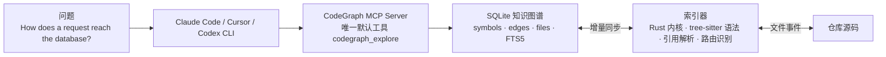

CodeGraph 把 AI Coding Agent 在大型仓库里最耗钱、也最容易失焦的一段工作提前做完了：先把代码库索引成一张可查询的图，再让 agent（智能体）沿着符号、调用关系、导入链和路由绑定去找答案。模型本身没有变强，变的是它不必每次都从 `grep`、`glob`、`Read` 重新找路。

这类工具只有在「结构理解」任务里才会明显拉开差距。问「一个请求怎么打到数据库」「改这个接口会影响哪些实现」「这个 handler 是从哪条路由进来的」，CodeGraph 往往能把几十次文件扫描压缩成几次图查询。要只是搜一段字符串，`rg` 依旧更直接。

下面按 v1.6.0 的当前实现来分析，官方 README 的 benchmark 复测时间是 2026-08-05。版本之间差异不小：早期版本（0.9.4）暴露的是 `codegraph_context`、`codegraph_trace`、`codegraph_explore` 三个工具，而 0.9.9 起这两个窄工具被删掉，只留一个。这个改动本身就是理解这套系统最好的切入点。

## 这篇文章要回答的五个问题

- CodeGraph 改造的是 AI Coding Agent 工作流里的哪一段，为什么大仓库收益最明显、小仓库也能占便宜？
- 为什么它把多个查询工具收敛成一个 `codegraph_explore`，这个取舍解决了什么真实问题？
- tree-sitter 语法、原生 Rust 内核、SQLite、FTS5、自动增量同步和路由感知，是怎么串成一条链路的？
- 官方 benchmark 到底测了什么、能推出什么、又刻意没测什么？
- 在 Claude Code、Cursor、Codex CLI 等九个 agent 上，怎样以最低成本把它接进来？

## CodeGraph 把 discovery 前置成可复用索引

CodeGraph 的价值，落在 discovery 这一段，也就是「答案到底藏在哪」。没有它时，agent 往往先靠 `grep`、`glob`、`Read` 和文件扫描子代理一层层试出来；有了它以后，问题先落到图查询，再决定是否需要补读少量源码。预算不再反复花在找路上，而是更多花在解释相关实现。

| 没有 CodeGraph | 有 CodeGraph |
| ------ | ------ |
| Agent 先扫文件，常见路径是 `grep`、`glob`、`Read` 和文件扫描子代理 | Agent 先查图，再决定是否需要补读源码 |
| 每次提问都重复做 discovery | 初始化后复用同一份索引 |
| 成本主要花在「答案在哪里」 | 成本主要花在「相关代码到底做了什么」 |
| 大仓库里工具调用和 token（词元）很容易膨胀 | 很多结构问题能在一到几次工具调用内结束 |

把它看成「给 agent 预先画好的代码地图」，比看成「又一个搜索命令」更接近事实。

## 先把系统拆成两条线看

理解 CodeGraph 时最容易混在一起的是两条主线：一条负责把仓库建成图，另一条负责让 agent 在图上提问。先把边界拆开，后面的设计就很好理解。


```mermaid
flowchart LR
    Q["问题\nHow does a request reach the database?"] --> A["Claude Code / Cursor / Codex CLI"]
    A --> B["CodeGraph MCP Server\n唯一默认工具 codegraph_explore"]
    B --> C["SQLite 知识图谱\nsymbols · edges · files · FTS5"]
    C <-->|增量同步| D["索引器\nRust 内核 · tree-sitter 语法 · 引用解析 · 路由识别"]
    D <-->|文件事件| E["仓库源码"]
```

从实现上看，核心只有 4 个层次：

- 抽取：用原生 Rust 内核加载编译进去的 tree-sitter 语法，把源码解析成 AST，而不是用正则去猜。
- 存储：把符号、边和文件索引写进本地 SQLite，并启用 FTS5。
- 解析：把调用、导入、继承、实现和框架路由补成可查询、可遍历的图。
- 同步：监听文件变更，在默认 2 秒安静窗口后只更新受影响的源码文件。

如果准备顺着仓库读一遍实现，最省时间的入口也是这 4 层：`src/extraction/` 负责解析与符号抽取，`src/resolution/` 负责导入解析、名称匹配和框架路由，`src/graph/` 负责遍历与查询，`src/context/` 负责把结果整理成 agent 能直接消费的输出。重型解析会被分流到 `src/extraction/parse-worker.ts`，避免把交互式查询卡死在单线程上。

数据层单独落在 `src/db/`。Schema 写在 `src/db/schema.sql`，查询走预编译语句；官方实现同时用 `better-sqlite3` 和 Node 自带的 `node:sqlite` 两类后端，并默认启用 WAL 模式（对应 `src/db/wal-valve.ts`）。日常读取不会因为一次索引写入就整库阻塞，真要排查锁冲突时，也更容易判断问题是出在旧版本安装，还是出在网络盘、WSL 挂载目录这类不适合 WAL 的文件系统上。

## 这张图是怎么建出来的

### 抽取靠 tree-sitter，但引擎换成了 Rust

CodeGraph 的第一步是解析源码。它的关键词从「多语言 tree-sitter」变成了「原生 Rust 内核」：TypeScript、JavaScript、Java、Python、Go、C、C++、Rust、C#、Ruby、PHP、Swift、Kotlin、Scala、Dart、R、Lua、Luau 这 20 种语言在编译代码里解析，每个文件只跨一次语言边界（Metal 和 CUDA 走 C++ 路径）。每种语言都是在真实仓库上验证过、生成的图与参考引擎逐字节一致后才上线；没有预编译二进制的平台、有语法错误的文件会自动按文件回退到便携引擎，两条路径产出的图相同。

对 agent 来说，「名字出现过」和「这里真的是一个定义」是两件事，AST 解决的是后者，这也是它比普通文本检索更值钱的地方。

### 用 SQLite 和 FTS5 把索引落到本地

官方 README 给出的存储实现很直接：索引写入本地数据库 `.codegraph/codegraph.db`，全文搜索由 FTS5 提供。这一套设计很务实。

- SQLite 足够轻，适合和项目目录一起初始化、一起迁移。
- FTS5 让 CodeGraph 不只能走图关系，也能按名称和文本检索。
- 数据全留在本机，不需要 API Key，也没有外部服务依赖。

很多「代码知识图谱」项目最后都会绕回远程服务；CodeGraph 反过来，先保证本地就能成立，再去谈 agent 集成。

### 只抽 AST 不够，后面还要做 resolution

只有 AST，还回答不了「从 A 到 B 能不能走通」。CodeGraph 在抽取后还会做一轮 resolution：函数调用要连回定义，导入要连回源文件，继承和实现要补成边，框架约定也要识别出来。它尤其强调能沿动态派发、回调和接口实现继续追下去——这类跳数是 `grep` 跟不动的。

### 路由感知和跨语言桥接让图不停在单文件内部

对 Web 项目来说，更有用的一层补边，是把「这段代码到底挂在哪条入口上」补出来。CodeGraph 会识别框架路由文件，生成 `route` 节点并用 `references` 边连到处理函数；查某个 view 或 controller 的调用方时，能直接看到绑定它的路由。

按当前文档，framework-aware routes 覆盖 17 组框架，包括 Django、Flask、FastAPI、Express、NestJS、Laravel、Drupal、Rails、Spring、Play、Gin / chi / gorilla / mux、Axum / actix / Rocket、ASP.NET、Vapor、Astro。另外还有一类前端路由会额外生成 `navigates` 边，把「跳到哪」这个动作连到目标屏幕：Expo Router、Next.js、React Router、TanStack Router、Vue Router / Nuxt、SvelteKit 都在其中。

这里有两个容易被忽略的边界。一是多应用仓库里，每套应用的路由只跟写在这套应用内部的跳转匹配，不会把 A 应用的 `Link` 错误连到 B 应用的同名页面。二是这种导航只认字面目标：跳转写在配置里、渲染前就能确定的路径会落进图里；真正靠运行结果才能算出来的目标，以及没有 `route` 节点服务的地址，CodeGraph 宁可留成「未解析」也不会去猜，写在模板标记里的链接则会标成 inferred，避免把推理冒充成事实。

在 iOS、React Native、Expo 这类混合工程里，静态解析会在语言边界处断掉：Swift 调用一个被自动桥接的 Objective-C selector，JS 通过 RN bridge 调 native 模块。CodeGraph 会把这些边界接上，生成的边带有 `provenance: 'heuristic'` 和稳定的 `synthesizedBy` 通道名（如 `swift-objc-bridge`、`rn-event-channel`），agent 因此能看出一跳是怎么进来的。

### 自动增量同步解决的是「日常开发能不能用」

如果每保存一次文件都要全量重建索引，CodeGraph 只适合做演示。它的实现是用原生文件事件接口 FSEvents、inotify、ReadDirectoryChangesW 监听变化，在默认 2 秒安静窗口（可用 `CODEGRAPH_WATCH_DEBOUNCE_MS` 调整，范围 `[100ms, 60s]`）后合并成一次增量同步，且只处理源码文件。

这里有两个容易忽略的细节。一是零配置不等于「什么都索引」：默认排除 `node_modules`、`vendor`、`dist`、`build`、`target`、`.venv`、`Pods`、`.next` 这类依赖、产物和缓存目录；Git 仓库下尊重 `.gitignore`，非 Git 项目直接读取 `.gitignore`；大于 1 MB 的文件默认不进图。二是同步窗口内不静默给错答案：MCP 响应若引用到还在等待同步的文件，会在开头加一条 `⚠️` 提示让 agent 直接 `Read`；MCP server 重连时，也会先对做一次 `(size, mtime)` 加内容哈希的追赶，把离线期间的改动吸收掉。

## Agent 只有一个工具要记：codegraph_explore

官方 README 里最值得记住的一条设计，是它把查询面收窄了。v0.9.9 的更新日志写得很直白：`codegraph_explore` 现在是主工具，一次调用通常就够——它返回相关符号的逐字源码（按文件分组，query 用自然语言即可、不必给精确符号名，点名某个文件或符号时还能拿到带行号的当前源码），并且已经内联了符号之间的调用流，所以早期那两个更窄的 `codegraph_context` 和 `codegraph_trace` 被删掉了，与其留三个工具让 agent 挑，不如留一个明显的。

这不是功能缩水，而是对着真实 agent 行为调出来的结论：项目自己的设计笔记里记着「新工具的表现不如把已有工具做厚——agent 甚至会漏选 trace，context 直接被删」。常用工具现在大致是这样：

| 工具 | 状态 | 作用 |
| ------ | ------ | ------ |
| `codegraph_explore` | 默认唯一列出 | 一个调用回答「X 是怎么工作的」「X 怎么到 Y」「这块区域长什么样」：返回相关符号逐字源码 + 调用路径（含动态派发跳数）+ 影响半径 |
| `codegraph_node` | 默认不列出 | 单个符号的源码和调用方，或按行读某个文件 |
| `codegraph_search` | 默认不列出 | 按名称定位符号 |
| `codegraph_callers` / `codegraph_callees` | 默认不列出 | 单跳展开调用流 |
| `codegraph_impact` | 默认不列出 | 改动波及面分析 |
| `codegraph_files` / `codegraph_status` | 默认不列出 | 文件结构 / 索引健康与同步状态 |

未列出的那些工具依然可用，它们的结果本来就已经内联在 `explore` 的输出里；确实需要独立的 MCP 工具面时，用环境变量 `CODEGRAPH_MCP_TOOLS`（例如 `CODEGRAPH_MCP_TOOLS=explore,node,search,callers`）重新开启，或直接走对应的命令行等价物。

还有一条同样关键的约束：CodeGraph 的收益全部来自「提前建好索引」这件事。如果问题到了 agent 手里还是先按老路去扫文件，最贵的 discovery 照样重跑一遍，CodeGraph 就只剩额外开销。所以 MCP server 自带的使用指引会反复强调——结构问题直接调用工具，别把探索再委托给文件扫描子代理。

## 一次真实问题怎么穿过系统

官方 README 用的示例问题是 "How does a request reach the database?"，这类题很适合看出 CodeGraph 的节奏和边界。下面用一个示例串一遍。

| 步骤 | 动作 | 拿到什么 | 为什么这样问 |
| ------ | ------ | ------ | ------ |
| 1 | `codegraph_explore` 提出这句架构问题 | 相关符号的源码、彼此调用路径、改动影响半径 | 一次调用通常就把答案说清，不必再补读 |
| 2 | 若还差某个符号的精确签名，再 `codegraph_node` | 单个符号源码 + 调用方 | 对某一跳做局部确认 |
| 3 | Web 项目里第一跳常会带出绑定该 handler 的 URL 模式 | route 节点 | 入口不再靠猜是 `urls.py`、controller decorator 还是 router builder |
| 4 | 只有图没覆盖到的边角细节，才回退 `Read` / `Grep` | 缺失的当前内容 | 同步窗口或数据流边界处偶发，属正常动作 |

这里的经验值是「一到四次 `explore` 就停」。在 benchmark 里，启用侧最终七个仓库全部零文件读取；反过来，缺了图的那个对照臂最多需要 43 次工具调用、19 次文件读取，才把图里早就知道的结构重新推一遍。

## Benchmark：值得看，但两种成本要分开读

截至 2026-08-05 的复测（v1.6.0），CodeGraph 在 7 个真实开源仓库上的平均收益是：少 88% 工具调用、快 53%、少 62% tokens、省 44% 成本，且七个仓库的文件读取中位数全部降到 0。

| 代码库 | 语言·规模 | 工具调用（有 vs 无） | 时间 | 文件读取 | Tokens | 成本 |
| ------ | ------ | ------ | ------ | ------ | ------ | ------ |
| VS Code | TypeScript · ~11k | 2 vs 28 | 2.2× 快（58s vs 2m10s） | 0 vs 12 | 少 77% | 省 71% |
| Excalidraw | TypeScript · ~640 | 2 vs 43 | 3.6× 快（45s vs 2m42s） | 0 vs 18 | 少 84% | 省 78% |
| Django | Python · ~3k | 3 vs 14 | 快 35%（54s vs 1m23s） | 0 vs 8.5 | 少 41% | 省 13% |
| Tokio | Rust · ~790 | 3 vs 29 | 2.6× 快（1m3s vs 2m43s） | 0 vs 19 | 少 65% | 省 64% |
| OkHttp | Java · ~645 | 1 vs 6 | 快 43%（33s vs 58s） | 0 vs 2 | 少 54% | 省 21% |
| Gin | Go · ~110 | 1 vs 7 | 快 39%（28s vs 46s） | 0 vs 4 | 少 52% | 基本持平 |
| Alamofire | Swift · ~110 | 4 vs 33 | 2.6× 快（54s vs 2m22s） | 0 vs 16.5 | 少 59% | 省 57% |

这组数字怎么读：

- 测的是什么：Claude Code（Claude Opus 4.8）headless 下回答单个架构问题的总成本，对比「启用 CodeGraph MCP」与「空 MCP 配置」，每仓库每臂各跑 4 次取中位数，内建 `Read`、`Grep`、`Bash` 两边都开放。关键一点：这一版把 `codegraph` 命令行在**两个臂里都封掉**（净化过的 `PATH` 加一个 `PreToolUse` 钩子）。因为在不封的版本上，无 CodeGraph 的臂有 28 次里 26 次会自己在 `PATH` 上摸到 CLI、绕道把图用上，对照组就名不副实。上一版公开数字正是没做这个封堵时测的。
- 反映了什么：当问题本质是结构理解时，图最直接压低的是 discovery 成本，省不省又更多取决于问题要多少 discovery、而不是仓库多大——需要 28 到 43 次调用的问题省 57%–78%，14 次就能到的 Django 只省 13%，7 次到的 Gin 基本持平。
- 不能推出什么：这不能证明 CodeGraph 对所有任务都有用，纯文本生成、一次性脚本、小仓库里的单点定位本就不依赖深度 discovery。

README 还特意补了一句容易被忽略的话，值得原样记住它的方向：上面测的是**吞吐**——为拿到一个答案处理了多少 token、花多少钱，它没有衡量**事后还留在上下文窗口里的东西**。而在这个维度上 CodeGraph 反而更贵：多轮会话里，它的响应会留下约 80% 更多的检索上下文驻留（VS Code 上是 67k 对 18k），原因正是让它快的那个机制——一次返回一个又密又完整、读完即答的负载，它就一直待在窗口里，而 grep-and-read 是许多小结果、用完即被挤出去。处理得少、占得久，两件事同时为真。长会话配小窗口的话，要把这笔预算算进去。

## 原生 Rust 内核带来的工程余量

解析引擎换成 Rust 内核后，最明显的收益不在单次查询，而在「索引本身多久能建好、能不能在破机器上建好」。内核会按机器真实资源来定并行度：worker 池、并行 resolution、分析缓存的大小都取自实际核数（容器 / cgroup 感知，所以只给 2 核的 VPS 就按 2 核配，而不是宿主机的 64 核）、如实测得的可用内存，以及你这个项目 resolution 工作的实测开销。

官方给的三个锚点：

- 工作站：完整并行管线。Swift 编译器仓库（27k 个 Swift 与 C++ 文件）全量索引约 100 秒，改一个文件的重同步约 4 秒。
- 2 核 / 6GB 的 VPS：走一条「为跑完而调」的管线，同样这张图。Linux 内核（70k 文件、200 万符号、640 万关系）在 12 分钟内建完，而内存优先的设计往往撑不到 1% 就 OOM。
- 之后的每一天：保存一个文件，watcher 在孤立保存后 300ms 触发，只同步真正变化的部分（4,400 文件项目约 0.3 秒、27,000 文件的 Swift 仓库约 0.4 秒），绝不重扫整棵树。与「改动即重建」的最快同类索引器对比，在 31 仓库、30 语言的基准上，中大仓库快 2–7 倍，且仓库越大差距越大，因为对方的成本随仓库规模涨、己方随改动量涨。

## 接入：先装运行时，再连 agent，最后建索引

官方推荐的安装有三条路径，共同点是自带运行时、不需要先装 Node.js。

```bash
# macOS / Linux：抓取适配当前系统的构建
curl -fsSL https://raw.githubusercontent.com/colbymchenry/codegraph/main/install.sh | sh

# Windows (PowerShell)
irm https://raw.githubusercontent.com/colbymchenry/codegraph/main/install.ps1 | iex

# 或者用 npm
npx @colbymchenry/codegraph
npm install -g @colbymchenry/codegraph
```

装好命令行后，交互安装器会自动检测并配置它认得的 agent——现在是九个：Claude Code、Cursor、Codex CLI、opencode、Hermes Agent、Gemini CLI、Antigravity IDE、Kiro，以及 GitHub Copilot（VS Code、Copilot CLI、JetBrains IDE）。它写入各 agent 的 MCP 配置，并在 `CLAUDE.md` / `AGENTS.md` / `GEMINI.md` 里放一小段带标记的 CodeGraph 说明（子代理和不走 MCP 的 harness 看不到 MCP 自带的指引，就靠这段学会 `codegraph explore`）。

注意安装器只负责「把 agent 接上」，不索引任何代码。接线之后：

```bash
cd your-project
codegraph init          # 建这个项目的图；此后随文件变更自动同步
```

（早期文档里的 `codegraph init -i` 现在被标为「已弃用，索引默认就会跑」，直接 `codegraph init` 即可。）一个全局 `codegraph install` 对你打开的每个项目都生效，不必逐项目重装；重启一次 agent 让 MCP server 加载，出现 `.codegraph/` 目录后工具就会自动被用上。

如果想精确控制接入方式，可以手动把 server 写进 `~/.claude.json`：

```json
{
  "mcpServers": {
    "codegraph": {
      "type": "stdio",
      "command": "codegraph",
      "args": ["serve", "--mcp"],
      "alwaysLoad": true
    }
  }
}
```

这里的 `alwaysLoad: true` 是有讲究的：Claude Code 默认会把每个 MCP 工具都挡在一次 tool-search 后面，新会话里模型只看到工具名、不搜就不知道它能干嘛；`alwaysLoad` 让 `codegraph_explore` 从第一条提示起就在列表里。大多数情况下直接跑安装器更省事。

## 排查：几类会真实遇到的问题

命令面比早期版本更值得依赖：`codegraph sync` 手动补一次增量，`codegraph status` 看统计、同步与存储状态（还能确认数据库是否真跑在 WAL 上），`codegraph explore` / `node` / `query` / `callers` / `callees` / `impact` / `files` 都对应各自的 MCP 工具。日常最容易撞上的四类错误：

- `CodeGraph not initialized`：先在项目目录里跑 `codegraph init`。
- Missing symbols：等自动同步跑完，或手动 `codegraph sync`；再检查文件语言是否受支持、是否被 `.gitignore` 或默认排除目录挡掉。
- `database is locked`：现在的构建自带运行时、用 `node:sqlite` 的 WAL 模式，理论上读不会因写被挡；如果还遇到，先确认不是 pre-0.9 的旧安装（重装即可拿到 bundled runtime），再看项目是不是在网络盘或 WSL2 的 `/mnt` 这类不适合 WAL 的文件系统上。
- `Transport closed` 而 `status` / `sync` 都正常：几乎总是 WSL2 把工程放在 Windows 盘（`/mnt/c`、`/mnt/d`），共享后台 server 的本地 socket（套接字）不可靠；把项目挪到 Linux 原生文件系统，或设 `CODEGRAPH_NO_DAEMON=1` 让每个会话各跑一个进程。

还有一个只在 CI 里才显出来的命令：`codegraph affected`。它沿导入依赖做传递分析，找出某些源码文件变更后哪些测试会受影响，让 CodeGraph 不只在「回答问题」时省钱，也能在 CI 和本地回归里少跑无意义的全量测试。

```bash
codegraph affected src/utils.ts src/api.ts
git diff --name-only | codegraph affected --stdin
codegraph affected src/auth.ts --filter "e2e/*"
```

对已经在用 Vitest、Jest 这类命令的团队，这往往是最容易先落地的一环，也是把它接进流水线的下一步。

## 什么时候值得接入，什么时候先别急

下面这些场景，CodeGraph 的收益通常最直接：

- 仓库到了几百到上万文件，新人上手和架构问答成本很高。
- 问题类型以「这个请求怎么流过去」「这个函数会影响谁」「这个 handler 挂在哪条路由上」为主。
- 项目跨语言、跨模块、跨框架，靠人工 `grep` 很难拼完整调用链，尤其是 iOS / React Native 这种要跨语言桥的。
- 团队已经重度依赖 Claude Code、Cursor 或 Codex CLI 做代码理解，而不是只让模型生成几段样板代码。

收益会明显变小、甚至倒贴的场景也很明确：

- 任务主要是纯文本生成，而不是代码结构理解。
- 问的是非常局部、非常确定的问题，一两次 `Read` 就够了。
- 长会话、小上下文窗口：省下的处理 token 会被更高的上下文驻留吃回去一部分。

## 常见误解

### 它不替代模型

CodeGraph 不会让模型突然更会写业务逻辑。它做的事情更基础：减少模型为了拿到上下文而付出的工具调用和 tokens。

### 它也不替代 `grep`

当你只是搜一段字符串、查一个配置键、找某条日志文案出现在哪时，`rg` 依旧最直接。CodeGraph 的优势在结构化关系，不是所有文本搜索场景都占优。

### 「零文件读取」是高收益场景里的常见结果，不是保证

官方 benchmark 里七个仓库中位数都是零文件读取，但这取决于问题类型和工具调用方式。遇到图没覆盖到的实现细枝末节（比如没有图边的局部变量数据流），回退去读少量源码是正常动作。

### 如果 agent 还在先扫文件，收益会被明显稀释

这是最容易踩的坑。结构问题如果仍先交给文件扫描子代理，CodeGraph 的优势会被大幅削弱。它最适合的顺序始终是：先图查询，再补细节。

## 读完自测

能不能不回头翻，答上下面四个问题，基本就吃透了这个工具：

- v0.9.9 为什么删掉 `codegraph_context` 和 `codegraph_trace`、只留 `codegraph_explore`？这个取舍对 agent 行为意味着什么？
- benchmark 为什么坚持在两个臂里都封掉 `codegraph` 命令行？不封的话，对照实验会被怎样污染？
- CodeGraph 明明少处理了 62% 的 token，为什么 README 又说它在上下文窗口这一维度上更贵？
- 动手改一个接口前，你会先用哪个命令估影响半径；接进 CI 后，又用哪个命令从 `git diff` 挑出真正该跑的测试？

## 结论

CodeGraph 对 AI Coding Agent 工作流的改造足够具体：把最昂贵、最重复、最不稳定的 discovery 阶段前置成可复用的本地索引，再通过一个 MCP 工具让 agent 直接消费这张图。它最新这版把工具面收敛到 `codegraph_explore`、把解析换成能自适配机器的 Rust 内核，方向都很清楚——不是加功能，而是让 agent 更少做无用功、让大型仓库的索引在普通机器上也建得起来。

对经常在大型仓库里问架构问题、追调用链、做重构前影响分析的团队，它已经很接近「应该优先接入的基础设施」。日常工作如果主要是小脚本和文案生成，就不必为一个不存在的问题增加维护面。

## 参考资料

- [CodeGraph 官方文档站](https://colbymchenry.github.io/codegraph/)
- [CodeGraph GitHub 仓库](https://github.com/colbymchenry/codegraph)
- [CodeGraph 官方 README](https://github.com/colbymchenry/codegraph/blob/main/README.md)
- [CodeGraph npm 页面](https://www.npmjs.com/package/@colbymchenry/codegraph)
