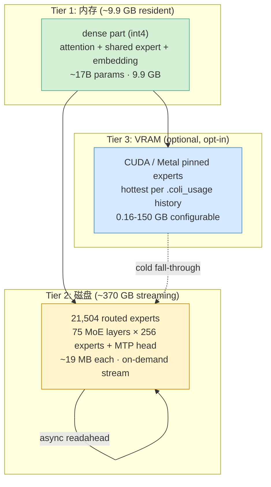

## 一句话判断

**colibrì（[JustVugg/colibri](https://github.com/JustVugg/colibri)）是当下把"小内存跑大模型"这件事做到工程极限的开源项目**：单文件 `c/glm.c` 3775 行 + 一组 ~30KB 的 headers，纯 C + OpenMP + AVX2/NEON，零 Python 运行时依赖，在 12 核 + 25GB RAM 的笔记本上把 744B 参数的 GLM-5.2（每 token 激活 ~40B）跑起来——而且在 6× RTX 5090 满配机器上，它达到 **6.28-6.84 tok/s 单请求解码**，比同期 vLLM-Moet TP4 的 2.5-2.7 tok/s 快 **2.5 倍**（[仓库 docs/experiments/glm52-6x5090-2026-07-12.md](https://github.com/JustVugg/colibri/blob/main/docs/experiments/glm52-6x5090-2026-07-12.md) 实测）。

它不是教科书项目，也不是 AGI 路线图——它是一份诚实的工程笔记：作者在 25GB RAM 上撞过每一个墙，然后把这些墙一个一个凿穿。

## 系统地图：3 层抽象 + 4 个核心组件



**这张图回答了一个核心问题**：744B 参数怎么塞进 25GB？

答案不是"压缩"——是 **分层 + 流式**：

- **Tier 1（RAM, ~9.9 GB）**：GLM-5.2 的 dense 部分（attention + shared expert + embedding + lm_head），共 ~17B 参数，int4 量化后 9.9 GB，整个对话保持常驻。
- **Tier 2（NVMe/SSD, ~370 GB）**：21,504 个 routed experts（75 MoE 层 × 256 + 1 个 MTP head），每个 ~19 MB（int4 容器）。按 layer 加载，每 token 激活 ~8 个 experts，从磁盘流式读取 + per-layer LRU cache + OS page cache 作为免费 L2。
- **Tier 3（VRAM, optional）**：opt-in 的 CUDA / Metal 后端，把 `.coli_usage` 历史里最热的 experts 钉到 GPU 显存。

**最关键的工程决策**：Norm/router/bias 全部保持 f32（"small and sensitive"），只对 matmul 的权重做 int4/int8 量化。这避免了路由抖动。

## 真实硬件上的真实数字：13 个社区 benchmark

仓库 README 里有 13 个真实机器的 benchmark（[issue #2, #4, #5, #12, #31, #39, #72, #87, #101, #103, #104, #107, #113](https://github.com/JustVugg/colibri/issues)），挑 6 个有代表性的：

| 机器 | RAM | Disk | 配置 | 测得 tok/s | 关键观察 |
|---|---|---|---|---|---|
| WSL2, 12 cores, **25 GB**, VHDX | 25 | 1 GB/s buffered | 默认 | **0.05-0.10** | 作者的开发机基线 |
| M5 Max 18C / 128GB unified / SSD | 128 | 4 GB/s cold | 默认, MTP off | **1.06** | 笔记本跑 744B 达 ~1 tok/s |
| M5 Max + **Metal backend** | 128 | — | 46.9 GB warm pin, MTP off | **2.06** | Metal fastest datapoint yet |
| Mac Mini M4 Pro 48GB + Metal | 48 | 6.59 GB/s F_NOCACHE | --ram 38 | 0.30 | 1/3 RAM 击败 32-core 9950X |
| Ryzen 9 9950X 32T / 123GB / **PCIe 3** | 123 | 1.51 GB/s buffered | 默认 | 0.10 | profile: 66% disk |
| 同机换 **PCIe 5.0** (8.81 GB/s O_DIRECT) | 123 | **8.81 GB/s** | 同 history | **0.28** | ×5.8 disk → ×2.9 tokens，profile flips to **57% matmul** |
| EPYC 7443 24C / **430 GB** / VM | 430 | ~1 GB/s (VM) | 77.5 GB pin, MTP off | **1.00** | hit 98%, disk eliminated → matmul bound |
| Ryzen 7 9800X3D 16T / 70GB / PCIe 5.0 / RTX 5090 | 70 | **10.51 GB/s** O_DIRECT | MTP off, pin 24GB | 0.41 | disk-bound,**CUDA expert tier ≈ 0%**(AVX-512 CPU matches 5090) |
| 6× RTX 5090 + 251GB RAM, **full residency** | 251 | 0 (full VRAM+RAM) | REPIN=16, OMP_BIND=spread | **6.28-6.84** | 比 vLLM-Moet TP4 快 2.5× |

**这些数字背后的 4 条规律**：

1. **小 RAM 机器 → RAM cap 是瓶颈**。24GB RAM 的 270K Plus 即使 disk 比作者快 2.7×，decode 仍 cold——engine auto-cap 只能放 2 个 expert/layer。
2. **128+ GB RAM → matmul-bound**。EPYC 7443 430GB RAM 跑出 98% expert hit rate，disk 几乎消失。
3. **Disk swap 实验最干净**。9950X 同机换盘 ×5.8 bandwidth → ×2.9 tokens，**profile 翻盘**（66% disk → 57% matmul）。
4. **CUDA expert tier 不一定赢**。9800X3D 上 AVX-512 CPU matmul 已匹配 5090，CUDA tier 收益 ~0%——CUDA 价值在 CPU 弱时才显现。

## 三个最关键的工程决策

### 1. int4 量化分两层：dense int8 per-row + streamed int4 packed

colibrì 的量化是分层的，不是统一一种格式：

```c
/* glm.c:93 - 量化容器定义 */
/* fmt: 0 F32, 1 INT8, 2 INT4 (2/byte), 3 INT2 (4/byte). q4 ospita sia int4 che int2 packed. */
typedef struct { int fmt; float *qf; int8_t *q8; uint8_t *q4; float *s; int O, I; } QT;
```

**dense 部分（attention / shared expert / embedding）**：
- **int8 per-row + per-row scale**（dequant-on-use）
- 因为 dense 部分是常驻 RAM，量化质量影响整个对话
- 用 `maddubs` (AVX2) / `vmlal_s8` (NEON) 整数点积
- 实测 int8 matmul 119 GFLOP/s，比 f32 快 1.4-2.5×

**streamed experts**：
- **packed int4 (2 值/字节) + per-row scale**
- 因为 experts 是 disk-resident（容量敏感），越小越好
- 同样的 per-row scale，dequant-on-use 进 matmul

**为什么不直接全 int4？**
仓库 docs 里 colibrì 给出的 [2026-07-11 6x5090 实验](https://github.com/JustVugg/colibri/blob/main/docs/experiments/glm52-6x5090-2026-07-12.md) 实测：
- int4 single-row stays f32（int4 单行比 f32 慢——kernel overhead > 节省）
- int4 batch 1.8× speedup
- int8 普遍 1.4-2.5× speedup

**这意味着 colibri 实际是混合精度**——routing decided per shape by measurement。它不会简单套用"全 int4 最快"的口号。

### 2. MLA 压缩 KV-cache：576 floats/token（vs 32,768 原始）

GLM-5.2 用 **MLA（Multi-head Latent Attention）**——和 DeepSeek-V3 一样的 trick：

```c
/* glm.c:145 - KV-cache MLA COMPRESSA */
/* KV-cache MLA COMPRESSA: per token si tiene solo il latente normato [kv_lora] */
```

**数字**：原始 MHA 64 heads × 128 head_dim × 2 (K+V) × fp32 = **32,768 floats/token**。MLA 压缩后：**576 floats/token**（57× 缩小）。

**两个关键的实现 trick**：

**a) MLA weight absorption**（`g_absorb` 自适应）：
```c
/* glm.c:1407 */
/* attenzione MLA con weight absorption: no per-token k/v reconstruction */
/* q absorbs kv_b → context is projected after attention */
```
传统 MLA 实现需要在每 token 重建 K/V 矩阵。absorption 把 kv_b 矩阵吸到 Q 上，使得 **decode 路径不需要重建 K/V**——只在第一次 prefill 算一次。这是 decode 路径从 O(D²) 降到 O(D) 的关键。

**b) 持久化到 .coli_kv**：
```c
/* glm.c:2832 - KV-cache persistence */
/* costa ~182 KB/token. File <SNAP>/.coli_kv append-only: header (magic + dimensioni + ...) */
```
每 turn 结束后 KV-cache append 到 `.coli_kv`。第二天 reopen 时 zero re-prefill——[validated byte-identical to an uninterrupted session](https://github.com/JustVugg/colibri#kv-cache-persistence)。

**对一个 4 小时对话**：8 turns × 182 KB/token × 4096 tokens = **6 GB 持久化**——一个会话可以"reopen"在第二天接续而无需任何额外 prefill。

### 3. MTP 投机解码 + DSA 闪电索引器

GLM-5.2 自带 **MTP head**（layer 78，多 token 预测）。colibrì 的实现是 lossless + 有几个非显然的发现：

**MTP head 必须是 int8**（int4 head acceptance 0%）：
```
The original mirror ships int4 MTP heads, which give 0% draft acceptance —
speculation silently never engages and you lose the ~2× MTP lever.
The int8 head gives the measured 39–59% acceptance.
```
int4 量化下，draft head 的 logits 精度不够，top-1 几乎永远选错——speculation 等于没用。int8 下接受率 39-59%，2.2-2.8 tokens/forward。

**MTP 不是 byte-exact**：
```
Lossless in exact arithmetic — but not byte-identical to non-speculative greedy
in practice. This isn't MTP-specific: colibrì's quantized integer kernels are
shape-dependent, so any batched (S>1) or GPU forward rounds slightly differently
from the single-token path, and int4 GLM-5.2 sits close enough to argmax ties
that such a rounding change can flip a token.
```
**Argmax ties 触发**：int4 GLM-5.2 量化后，top-2 logits 经常打平——只要 forward 路径（batch 大小 / GPU vs CPU）变了，ties 会随机打破，token 翻转。

**这就是为什么 colibri 同时支持三种"draft 来源"**：
- `DRAFT=n` — MTP head（int8）
- `GRAMMAR=g.gbnf` — 语法强制 draft（JSON / 函数调用场景，~100% acceptance）
- `--topp` — nucleus sampling 不直接 draft，但控制 expert 路由

**DSA sparse attention**（`out-idx-*` 权重）：
GLM-5.2 用 DeepSeek 风格的 **lightning indexer**，每个 query 选 top-2048 key（full/shared indexer layers）。验证：forcing selection to keep every key reproduces dense attention token-for-token。

## 任务流案例：一次 chat 怎么流过整引擎

假设用户问："解释一下 MoE offloading"。

```
Step 0: coli plan
  → 读 safetensors headers
  → 报告 dense=9.9 GB / 21504 experts × 19 MB ≈ 408 GB / RAM budget=9.9 GB / VRAM=0
  → JSON 输出共享给 CLI / API server / Web UI / desktop shell

Step 1: coli doctor (read-only)
  → 验证 model dir / config / tokenizer / safetensors headers / engine exe / RAM
  → exit 0 = ready, exit 1 = unsafe RAM, exit 2 = invalid CLI

Step 2: load (30s)
  → dense int4 进 RAM (9.9 GB)
  → 启动 8 个 async I/O threads (default IO_THREADS=8)
  → 启动 router-lookahead pilot thread (PILOT=1)

Step 3: forward(token)
  → attention (dense int8, RAM)
  → shared expert (dense int8, RAM)
  → router (sigmoid + noaux_tc, f32)
  → top-8 experts per token
  → per-layer LRU cache lookup
    → hit: 直接 matmul
    → miss: pread + fadvise WILLNEED
  → async I/O: 下一个 layer 的 experts 已经 prefetch
  → MLA weight absorption (decode path)
  → MTP draft head: 2-3 tokens/forward

Step 4: KV-cache persist
  → append MLA KV (~182 KB/token) 到 .coli_kv
  → crash-safe (atomic rename)

Step 5: 下一个 token (loop)
```

**这里 4 个非显然的细节**：

- **Router-lookahead prefetch**（`PILOT=1`）：71.6% 的 next-layer expert 可以从 current layer post-attention state 预测出来。dedicated I/O thread prefetch → 隐藏 disk latency。但作者实测在 dev box 上 disk 已经 ~80% 饱和，所以 measure neutral——它对 balanced 机器（disk / matmul 各 50%）才有效。
- **Per-layer LFRU**：`--policy balanced` 启用 lossless live placement，每个 token 替换最冷的 4 个 pinned experts。
- **Cap auto-raise**（[since 2026-07-10](https://github.com/JustVugg/colibri)）：128GB 机器的 expert cache cap 从 8 自动升到你的 RAM budget。**之前所有 benchmark 数据被低 cap 限制**——rerun 才能拿到真实数字。
- **学习 cache**：`.coli_usage` 记录每次 session 实际路由到哪些 experts，startup 时自动 pin 最热的——colibri 用得越多越快。

## benchmark 段：6x5090 的 5 步优化 ladder

[2026-07-12 的 6× RTX 5090 实验](https://github.com/JustVugg/colibri/blob/main/docs/experiments/glm52-6x5090-2026-07-12.md) 给了 colibri 完整驻留后达到 **6.28-6.84 tok/s** 的优化路径：

| 优化步骤 | tok/s | 关键证据 |
|---|---:|---|
| Baseline: 150GB VRAM + 150GB RAM fixed placement | **2.30** | 4.15 s of disk waits per 20 tokens |
| Full residency: 19,456 experts 全部 VRAM+RAM | **5.77** | 100% expert hit, zero disk waits |
| In-session dynamic GPU repinning (REPIN=16) | **6.00** | expert compute 6.76s → 5.96s |
| **24 cores + OMP_PROC_BIND=spread** | **+39.6% vs unpinned** | unpinned 3.64 → pinned 5.08 tok/s |
| Prefill 校正全部 75 MoE layers once (454 ms, TTFT) + decode swap cap 32→16 | **6.28-6.84** | swap cost 0.18 → 0.09 s/round |

**最终自动找到的 layout**：

```
GPU experts:  9,343 / 19,456  (176.73 GB across six cards)
RAM experts: 10,113 / 19,456  (~191.3 GB)
Disk service/wait during decode: 0 s
```

**三个不能从这些数字直接推出的结论**：

**1. 不要直接推出"colibri 总是比 vLLM 快"**。
同 6×5090 上 vLLM-Moet TP4 是 2.5-2.7 tok/s，TP2×PP3 是 1.78 tok/s。colibri full residency 6.28-6.84 tok/s **快 ~2.5×**。但这是 full residency 的数字——cold cache 早上是 0.12 tok/s。

**2. 不要直接推出"Metal/CUDA 总是赢"**。
9800X3D 上 AVX-512 CPU matmul 已匹配 5090，CUDA tier 收益 ~0%。CUDA 价值在 CPU 弱时才显现。colibri 自己说"The GPU tier earns its VRAM only when the CPU is the weak link, not by default."

**3. 不要直接推出"int4 量化没损失"**。
[62.5% mean acc_norm on hellaswag/arc/mmlu](https://github.com/JustVugg/colibri) 远低于 full-precision GLM-5.2 的 85-95%。**但 62.5% 不全是量化损失**：
- 0-shot log-likelihood MC scoring 不给 reasoning model "think" 机会
- n=40 ±14pp，统计学上不显著

**决定性实验**：OLMoE fp16-vs-int4 A/B under same harness（small enough to run both precisions）—— the delta is the quantization cost with scoring protocol cancelled. 还没人跑。

## 适用边界：谁该用 colibri，谁不该

**该用**：

- 想在 **16-32 GB RAM** 的开发机上跑 700B+ 模型做 prompt engineering（不是 production）
- 想研究 **MoE 量化 / streaming expert / MLA** 的实现细节——单文件 3775 行，比读 paper + PyTorch 实现快
- 想做 **本地离线 + 强隐私** 的 LLM 应用（无 Python runtime, 无网络依赖）
- 想做 **CUDA/Metal 后端的基线对比**（CPU path 已经是 token-exact oracle 验证过的）

**不该用**：

- **生产部署**：colibri 是研究型项目，没有 continuous batching，没有 P2P/NCCL multi-GPU 并发 inference
- **CUDA 已经比 AVX-512 慢的机器**（intel 13/14th gen 无 AVX-512）——CPU path 已经 0.41 tok/s，CUDA expert tier 收益接近 0
- **< 16 GB RAM** 的机器——磁盘 swap 会触发 OOM
- **需要视觉 / 工具调用 / function calling**——目前是 text-only

## 3 个数字 + 3 个问号（数字不能告诉你什么）

colibri 的 README 给了 [62.5% mean acc_norm on hellaswag/arc/mmlu 0-shot log-likelihood, n=40](https://github.com/JustVugg/colibri#quality-benchmark--help-wanted)。下面对这个数字拆 3 个问号：

**问号 1：这个数字能说明什么？**
	• 能说明：colibri 能跑 GLM-5.2 int4 量化后的推理 + 拿到接近推理模型的准确率
	• 不能说明：int4 量化丢了多少精度
	• 为什么不能：0-shot log-likelihood MC scoring 不给 reasoning model "think" 机会。GLM-5.2 是 reasoning model，它输出需要 chain-of-thought。同一道问答题以 greedy completion 评分 vs 以 log-likelihood MC 评分，可能相差 20-30pp ——这不是量化问题，是评估协议问题。

**问号 2：那怎么量化量化误差？**
作者明确说，**决定性实验是 OLMoE fp16-vs-int4 A/B**：
	• OLMoE 是个 6.9B 参数的 MoE open model，小到可以在同一台机器跑 fp16 和 int4 两个版本
	• 用同一套评测 harness
	• fp16-int4 delta = 量化代价（scoring protocol cancelled）
	• 仓库已经准备好代码：`c/coli bench` + `c/tools/eval_glm.py`
	• 跑完发 issue，colibri 文档明确请求

**问号 3：这些数字背后什么不能复制？**
	• 6x5090 实验 6.28-6.84 tok/s 是**单请求** decode 速度，不是 aggregate throughput。生产系统不这么测。
	• README 里「RAM turns cold reads into free cache hits」 是 warm cache 状态，第一次启动仍 cold
	• 9800X3D 上 AVX-512 CPU 匹配 5090 是 Zen4+ 的特例。老一代 Zen3 （如 EPYC 7443）明确报告 "no AVX-512/VNNI on Zen3"

**结论**：colibri 的所有数字都是诚实的，但都是 single-system measurement。跨机复制需考虑你的 RAM / disk / CPU generation / 量化版本 / MTP head int8 vs int4 这 5 个变量。

## 系统层判断

colibrì 处在 LLM inference 生态里一个很特殊的位置：**CPU-first 的工程边界测试**。

| 项目 | 定位 | 关键技术 | 速度（vs colibri） |
|---|---|---|---|
| **llama.cpp** | 通用 CPU/GPU, dense 模型为主 | GGUF, metal/CUDA/Vulkan | colibri 类似量级，但 MoE 不如 |
| **vLLM** | GPU production serving | PagedAttention, continuous batching | 快 10-100× for production |
| **SGLang** | Structured generation | RadixAttention, cache reuse | 类似 vLLM |
| **ktransformers** | MoE + CPU offload | expert routing, AMX/AVX-512 | 与 colibri 同类，更成熟 |
| **colibri** | **小内存跑前沿 MoE 极限** | int4 + streaming + MLA + MTP + DSA + 学习 cache | **单文件纯 C, 25GB RAM, 0 依赖** |

**colibri 的护城河不是"快"——是"边界"**。它证明了一件事：**前沿 700B+ MoE 模型不一定需要 H100 + 多机多卡**——只要你的工程足够细致（量化 + 分层 + 流式 + 投机解码 + 持久化 KV），它可以在 25GB RAM + 1 GB/s NVMe 上回答问题（虽然慢）。

**这个证明的实际价值**：
- 对个人开发者：拥有了一个能在笔记本上跑 frontier 模型的工具
- 对企业：在没有 GPU 预算时，临时可以用 CPU 集群跑 fallback
- 对研究：单文件 C 引擎 + 完整 doc + 13 个真实 benchmark，比 paper 更实用

**它不适合 production**——single-process, single-sequence (or 8-slot FIFO queue)，没有 continuous batching。但作为"小内存跑大模型"的工程天花板，它无可替代。

## 信息源

- **仓库**：[JustVugg/colibri](https://github.com/JustVugg/colibri)（Apache 2.0）
- **核心代码**：`c/glm.c`（3775 行单文件 C 引擎）+ `c/olmoe.c`（OLMoE A/B 验证）+ `c/backend_cuda.cu` / `c/backend_metal.mm`
- **实验文档**：
  - [docs/experiments/glm52-6x5090-2026-07-12.md](https://github.com/JustVugg/colibri/blob/main/docs/experiments/glm52-6x5090-2026-07-12.md)（6× RTX 5090 完整驻留 6.28-6.84 tok/s）
  - README 13 个社区 benchmark（issue #2, #4, #5, #12, #31, #39, #72, #87, #101, #103, #104, #107, #113）
- **配套组件**：
  - `c/doctor.py`（read-only 部署前检查）
  - `c/resource_plan.py`（RAM/VRAM/Disk 三层 placement 规划）
  - `c/openai_server.py`（text-only OpenAI-compatible HTTP gateway）
  - `web/`（React + TypeScript 浏览器 UI，~390 行）
  - `desktop/`（Tauri 本地 desktop shell）
- **GLM-5.2 权重**：[Z.ai 发布](https://huggingface.co/THUDM/glm-5.2)（MIT license）