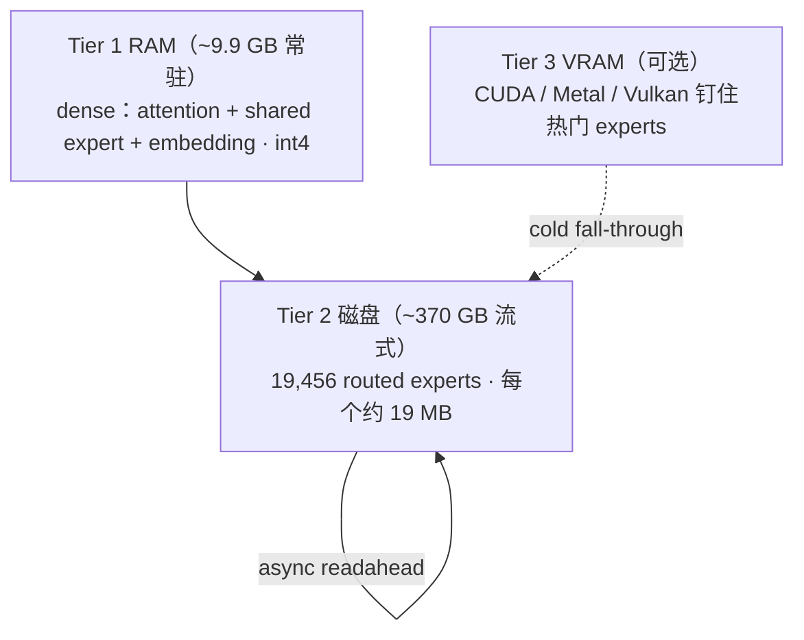

# colibrì 引擎拆解：在 25GB RAM 上跑 744B 大模型，纯 C 实现

**[colibrì](https://github.com/JustVugg/colibri)** 把"小内存跑大模型"做到了工程极限：纯 C + OpenMP + AVX2/NEON，引擎本体零依赖，单个 `c/colibri.c` 加一组共享头文件，就能在 12 核 + 25GB RAM 的开发机上跑 744B 参数的 GLM-5.2——一个 MoE（混合专家模型），每个 token（词元）只激活约 40B 参数。

在 6× RTX 5090 满配机器上，全部 expert 驻留后单请求解码 6.28-6.84 tok/s，比同机 vLLM-Moet TP4 的 2.3-2.7 tok/s 快约 2.5 倍（[作者实验记录](https://github.com/JustVugg/colibri/blob/main/docs/experiments/glm52-6x5090-2026-07-12.md)）。数字先摆在这里，下文逐个核对它们的来源和适用边界。

## 目录

- 学习目标
- 系统地图：三层驻留 + 流式读取
- 实测数字：18 台机器的社区 benchmark
- 三个关键工程决策
- 任务流示例：一条消息怎么流过引擎
- 6x5090 优化阶梯：从 2.30 到 6.84 tok/s
- 生态定位：CPU-first 的边界实验
- 常见问题与排查
- 练习与自测
- 进阶阅读
- 参考文献

## 学习目标

读完本文，你应该能回答：

- 744B 参数为什么能装进 25GB RAM，瓶颈到底卡在哪一层；
- colibrì 的量化为什么分成 int4、f32、int8 三档，各自解决什么问题；
- MLA 如何把 KV 状态压到原来的约 1/57，以及压完之后还能持久化意味着什么；
- 哪些 benchmark 结论可以外推到自己的机器，哪些不能。

## 系统地图：三层驻留 + 流式读取


```mermaid
flowchart TB
    D1["Tier 1 RAM（~9.9 GB 常驻）<br/>dense：attention + shared expert + embedding · int4"]
    D2["Tier 2 磁盘（~370 GB 流式）<br/>19,456 routed experts · 每个约 19 MB"]
    D3["Tier 3 VRAM（可选）<br/>CUDA / Metal / Vulkan 钉住热门 experts"]
    D1 --> D2
    D2 -->|async readahead| D2
    D3 -.->|cold fall-through| D2
```

744B 参数塞进 25GB，靠的不是压缩，而是**分层驻留 + 流式读取**。GLM-5.2 每个 token 只激活约 40B 参数，其中随 token 变化的 routed experts 只占约 11 GB——模型不需要整个装进快内存，只需要在被路由到时及时到场：

- **Tier 1（RAM，约 9.9 GB）**：dense 部分——attention（注意力机制）、shared expert、embedding（嵌入向量）——约 17B 参数，int4 容器，整个会话常驻。
- **Tier 2（磁盘，约 370 GB）**：19,456 个 routed experts（75 个 MoE 层 × 256，加 MTP head），每个约 19 MB（int4）。每 token 每层激活 8 个，按需从磁盘流式读取，配合 per-layer LRU cache（缓存）和操作系统 page cache。
- **Tier 3（显存，可选）**：opt-in 的 CUDA / Metal / Vulkan 后端（backend），把 `.coli_usage` 历史里最热的 experts 钉进 GPU。

README 把这个思路称作"给权重做 JIT"：像即时编译器只编译热路径一样，引擎只把被路由证明需要的 expert 搬进快层。分层之外还有一个容易被忽略的决策：norm、router（路由器，给每个 token 的 expert 打分的网络）、bias 全部保持 f32——源码注释直说它们"小且敏感"，量化只发生在 matmul 权重上，路由因此不会被量化噪声带偏。

## 实测数字：18 台机器的社区 benchmark

全部实测数据在 [docs/benchmarks.md](https://github.com/JustVugg/colibri/blob/main/docs/benchmarks.md)，覆盖 18 台真实机器，挑有代表性的 9 行：

| 机器 | RAM | 磁盘读速 | 配置 | tok/s | 观察 |
|---|---|---|---|---:|---|
| WSL2 12 核（作者开发机） | 25 GB | ~1 GB/s | 默认 | 0.05-0.10 | 项目起点的诚实基线 |
| M5 Max 18 核 | 128 GB | ~4 GB/s cold | 默认，MTP off | 1.06 | 笔记本跑 744B |
| M5 Max + Metal 后端 | 128 GB | — | 46.9 GB warm pin | 2.06 | 目前最快的单点数据 |
| Mac Mini M4 Pro | 48 GB | 6.59 GB/s F_NOCACHE | `--ram 38` | 0.30 | 1/3 的 RAM 跑过 32 线程 9950X |
| Ryzen 9 9950X · PCIe 3 | 123 GB | 1.51 GB/s | 默认 | 0.10 | profile：66% 在磁盘 |
| 同机换 PCIe 5.0 盘 | 123 GB | 8.81 GB/s O_DIRECT | 同历史 | 0.28 | 盘速 ×5.8 → token ×2.9，profile 翻转为 57% matmul |
| EPYC 7443 · 虚拟机 | 430 GB | ~1 GB/s | 77.5 GB pin | 1.00 | expert 命中 98%，磁盘出局 |
| Ryzen 7 9800X3D + RTX 5090 | 70 GB | 10.51 GB/s O_DIRECT | pin 24 GB | 0.41 | CUDA expert 层收益 ≈ 0% |
| 6× RTX 5090 · 251 GB | 251 GB | 全驻留 | REPIN=16 | 6.28-6.84 | 比 vLLM-Moet TP4 快约 2.5× |

从这些数字里能抽出四条站得住的结论：

1. **小 RAM 机器上，RAM cap 才是瓶颈。** 24GB RAM 的机器引擎自动把 expert cache 压到每层 2 个，盘再快 decode 也是冷的。
2. **RAM 足够大时瓶颈转向 matmul。** 430GB 的 EPYC 7443 跑出 98% 命中率，磁盘等待基本消失。
3. **换盘实验是最干净的证据。** 同一台 9950X、同一段使用历史，只换盘：带宽（bandwidth）×5.8 换来 token ×2.9，profile 从 66% disk 翻成 57% matmul。
4. **GPU 层不是默认划算。** 9800X3D 上 AVX-512 CPU matmul 与 RTX 5090 打平，CUDA expert 层收益接近零——仓库自己的原话："GPU 层只有当 CPU 是短板时，才挣回它占的显存。"

## 三个关键工程决策

### 1. 量化分三档：int4 主体、f32 敏感层、int8 MTP 头

colibrì 的量化（用低比特存权重以省空间和带宽）不是一刀切，而是按角色分档。`c/colibri.c` 文件头注释把两条关键决策写在最前面：

```c
/* c/colibri.c 文件头（摘译） */
/* - router sigmoid + noaux_tc (n_group=1) 配合 routed_scaling_factor */
/* - Norm/router/bias 保持 f32（小且敏感） */
```

- **dense 部分与 routed experts 都走 int4 容器**：dense 约 17B 参数驻留 9.9 GB；expert 每个约 19 MB，总量约 370 GB。官方推荐 gs64（64 个权重共享一个缩放因子）容器。
- **norm / router / bias 保持 f32**：这些张量小、对误差敏感，量化省不了多少空间，却会让路由抖动。
- **MTP head 必须 int8**：int4 的 MTP head 草稿接受率只有 0-4%，投机解码等于没开（[#8](https://github.com/JustVugg/colibri/issues/8)）。

为什么不把精度压得更狠？仓库用受控 A/B 回答了代价：在 OLMoE（7B 的开源 MoE）上做 fp16 vs int4 对照，纯量化损失约 -8.2pp；按行缩放的 int4 在难题上侵蚀 logit 余量，gs64 分组缩放能找回约 63% 的损失（[#108](https://github.com/JustVugg/colibri/issues/108)、[#225](https://github.com/JustVugg/colibri/issues/225)）。

### 2. MLA 把 KV 状态压到约 1/57，还能持久化

GLM-5.2 用 MLA（Multi-head Latent Attention，多头潜在注意力）：每个 token 只保留压缩后的 latent 向量。摊到每个 token，KV 状态从约 32,768 个 float 降到 576 个，约 57×——README 与 `c/colibri.c` 源码注释给的是同一组数字。

两个实现要点：

**a) weight absorption。** 解码时不逐 token 重建 K/V，而是把投影吸进 query（查询）一侧，只在 prefill 阶段算一次，decode 路径的注意力开销因此与历史长度解耦。Metal / CUDA / Vulkan 路径都有对应的 absorb 注意力核心。

**b) 持久化到 `.coli_kv`。** 源码注释写明每个 token 约 182 KB，append-only 文件。会话重开时零 re-prefill，README 声称输出与不中断的会话逐字节一致。按此估算：8 轮对话、每轮 4096 token，约产生 6 GB 持久化数据，第二天 reopen 可直接续聊，不付任何 prefill 成本。

### 3. MTP 投机解码与 DSA：哪里赚、哪里亏

GLM-5.2 自带 MTP（Multi-Token Prediction，多 token 预测）head：由它起草 token，主模型一次批量验证，有效时每 forward 产出 2.2-2.8 个 token。colibrì 在这里交过两笔学费，都记录在案：

- **int4 head 不可用。** 接受率只有 0-4%，投机静默失效，只剩 15-18% 的验证开销（[6x5090 实验记录](https://github.com/JustVugg/colibri/blob/main/docs/experiments/glm52-6x5090-2026-07-12.md)）。换 int8 head 后，干净文本上链式 top-1 接受率 69-79%。
- **满驻留时投机反而亏。** MoE 里验证 batch 的每个位置路由到不同 expert，单 forward 的 expert 开销随 batch 近乎线性增长（实测 S=1 80 ms、S=2 168 ms、S=4 306 ms），摊薄不存在——即使 79% 接受率，DRAFT=1 仍亏约 5%。所以这台机器的 benchmark 要显式 `DRAFT=0`。

DSA 稀疏注意力用 lightning indexer（闪电索引器）给每个 query（查询）只保留 top-k 个 key，k 由模型配置的 `index_topk` 决定。验证方式很硬：强制选全部 key，输出与稠密注意力逐 token 一致。结构化输出走另一条路：`GRAMMAR=file.gbnf` 语法强制 draft 在受约束的 JSON 场景下接受率接近免费。

## 任务流示例：一条消息怎么流过引擎

假设用户问"解释一下 MoE offloading"：

```text
Step 0: coli plan —— 读 safetensors 头，报告布局与 RAM/VRAM 预算（JSON 输出）
Step 1: coli doctor —— 只读体检：模型目录、分片、引擎、RAM；exit 0 就绪 / exit 1 发现问题
Step 2: load（约 30-32 秒）—— dense int4 进 RAM（9.9 GB）；异步 I/O 池（PIPE_WORKERS 默认 8 线程）；router-lookahead 预取线程（PILOT=1）
```

接着是每个 token 的循环：

```text
Step 3: forward(token)，每层依次：
  attention / shared expert（RAM 常驻）→ router 打分（f32）取 top-8 experts
  per-layer LRU cache：命中直接 matmul；未命中 pread + WILLNEED hint，异步 I/O 同时搬下一层
  MLA absorb 解码注意力
Step 4: KV 追加写 .coli_kv（每 token 约 182 KB，crash-safe）
Step 5: 下一个 token
```

流式路径上有四个容易被忽略的细节：

- **Router-lookahead 预取**：下一层的路由有 71.6% 可以提前一层预测（源码注释的实测值），专用线程提前搬运，以隐藏磁盘延迟（latency）。但它只对磁盘与计算接近平衡的机器有效——作者的 dev box 磁盘已近饱和，收益测不出来；6x5090 上叠加 GPU staging 的版本甚至端到端变慢（5.39-5.44 tok/s），被回退。
- **驱逐策略可调**：`--policy quality|balanced|experimental-fast` 三档，缓存驱逐用带滞后的 LFRU（最近最少使用 + 频率），避免把刚要热的 expert 踢出去。
- **Cap auto-raise**：RAM 预算富余时，expert cache 上限自动抬高（[#12](https://github.com/JustVugg/colibri/issues/12)），`CAP_RAISE=0` 可关。这也意味着早期低 cap 时代的一些 benchmark 数字需要重跑才作数。
- **学习 cache**：`.coli_usage` 每轮记录实际路由到的 experts，启动时自动钉住最热的——引擎用得越多越快。

## 6x5090 优化阶梯：从 2.30 到 6.84 tok/s

[实验记录](https://github.com/JustVugg/colibri/blob/main/docs/experiments/glm52-6x5090-2026-07-12.md) 的完整阶梯，每步累加：

| 优化步骤 | tok/s | 关键证据 |
|---|---:|---|
| 基线：150 GB VRAM + 150 GB RAM 固定布局 | 2.30 | 每 20 token 有 4.15 s 在等盘 |
| 全驻留：19,456 experts 全进 VRAM+RAM | 5.77 | 命中 100%，磁盘等待归零 |
| 会话内动态重钉（REPIN=16） | 6.00 | expert 计算 6.76 s → 5.96 s |
| 24 核 + OMP_PROC_BIND=spread | +39.6% | 未绑核 3.64 → 绑核 5.08 |
| Prefill 一次校正全部 75 层（454 ms，计入 TTFT） | 6.05-6.08 | GPU expert 调用 36,865 → 37,285 |
| decode swap cap 32 → 16 | 6.10-6.28 | swap 开销 0.18 → 0.09 s/轮 |

最终 96 token 贪心基准 6.28 tok/s，256 token 跑 6.84 tok/s——更长的解码摊薄了固定开销，所以引用速率必须带 token 数。自动找到的布局：

```text
GPU experts:  9,343 / 19,456  (六卡共 176.73 GB)
RAM experts: 10,113 / 19,456  (~191.3 GB)
Decode 期间磁盘服务/等待: 0 s
```

这些数字有三条使用限制：

1. **不是总快。** 同一台机器冷缓存的早上只有 0.12 tok/s；这里比的也只是单请求解码，vLLM-Moet 在高并发生产场景的吞吐量（throughput）优势不在此列。
2. **GPU 层不是默认划算。** 9800X3D 上 AVX-512 CPU 已打平 5090；没有 AVX-512/VNNI 的老 CPU 不能外推这个结论。
3. **量化损失要拆开归因。** int4 容器在 hellaswag/arc/mmlu 0-shot 均值 62.5%（[#108](https://github.com/JustVugg/colibri/issues/108)）；0-shot 打分不给推理模型"思考"机会，协议本身就会造成分数差，不能全记在量化头上。干净的量化代价测量是 OLMoE fp16 vs int4 同 harness A/B：-8.2pp。

## 生态定位：CPU-first 的边界实验

colibrì 在 LLM（大语言模型）inference（推理）生态里的位置很特殊——它测的是资源下限：

| 项目 | 定位 | 与 colibrì 的关系 |
|---|---|---|
| llama.cpp | 通用 CPU/GPU，dense 模型为主 | 同为轻量 C 系，MoE 流式不是主线 |
| vLLM / SGLang | GPU 生产级 serving，连续批处理 | 目标是高并发，不是单机最小资源 |
| ktransformers | MoE + CPU offload | 同类思路、更成熟；colibrì README 致谢里明确引用 |
| colibrì | 小内存跑前沿 MoE 的极限实验 | 单文件纯 C、25GB RAM、引擎零依赖 |

colibrì 的护城河不在"快"，在"边界"：前沿 700B+ MoE 不一定需要 H100 多机集群，量化、分层、流式、投机、KV 持久化凑齐，25GB RAM + 1 GB/s 的盘也能回答问题——慢，但正确。它也不适合生产：单进程，HTTP 请求走有界 FIFO 队列（默认 8 个），最多 16 个独立 KV slot，没有 continuous batching。README 把自己定位成研究平台：列了一张开放假设表，并明确请求社区连同负结果一起发布——"一个受控的失败，比一个解释不通的快数字更有价值"。

## 常见问题与排查

**25GB 机器真的能跑 744B 吗？** 能，但要对速度有预期：作者的 25GB 开发机冷缓存 0.05-0.1 tok/s。README 的说法是"慢但正确"，速度主要由磁盘随机读决定。

**需要 GPU 吗？** 不需要。仓库的支持表里五个模型家族全部标注不需要 GPU，GPU 只是可选加速层。

**怎么判断我的盘够不够快？** 用仓库自带的 `iobench` 按引擎的真实读法测（19 MB 并行随机读）。注意 #86 的坑：buffered 模式在大内存机器上测到的是 page cache，要看真数字用 O_DIRECT；macOS 没有 O_DIRECT，F_NOCACHE 也挡不住已被缓存的页。

**开了 MTP 反而更慢？** 满驻留场景下投机净亏 10-37%，而 `DRAFT` 默认自动开启 3 层草稿。显式 `DRAFT=0` 关掉再对比。

**输出陷入重复、不结束？** 先确认用的是 gs64 容器：早期按行缩放的 int4 镜像测出差约 9pp，正是 think-mode 死循环的根因（[#455](https://github.com/JustVugg/colibri/issues/455)）；MTP head 也要确认是 int8 文件。

**服务返回 HTTP 429？** FIFO 队列满了或等超时（默认队列 8、超时 300 秒），`GET /health` 可看排队计数。

## 练习与自测

**练习 1**：用 `iobench` 测自己机器的磁盘读速，对照 [docs/benchmarks.md](https://github.com/JustVugg/colibri/blob/main/docs/benchmarks.md) 的 back-of-envelope 预测表，看你的机器落在哪一档。

**练习 2**：不想下载 372 GB？先跑 OLMoE（约 4 GB 权重、8 GB RAM 即可）：`make -C c olmoe` 编译后指向转换好的模型目录，观察 `coli plan` 输出的布局 JSON 和 `coli doctor` 的体检项。

**自测三题**（答案散在上文）：

1. 744B 模型在 25GB RAM 上能跑，是因为权重压得更狠，还是因为别的？
2. MTP head 为什么必须 int8，而主体权重可以用 int4？
3. 9950X 换盘实验为什么被认为是最干净的瓶颈证据？

## 进阶阅读

- [docs/tuning.md](https://github.com/JustVugg/colibri/blob/main/docs/tuning.md)：全部调优开关与策略。
- [docs/benchmarks.md](https://github.com/JustVugg/colibri/blob/main/docs/benchmarks.md)：基准协议与全部社区数据点。
- README 的开放假设表：路由历史 vs LRU、双 SSD、投机盈亏面——每一行都是一个可认领的实验。
- 对照阅读：[ktransformers](https://github.com/kvcache-ai/ktransformers)（同类 MoE offload）、[llama.cpp](https://github.com/ggml-org/llama.cpp)。

## 参考文献

- 仓库：[JustVugg/colibri](https://github.com/JustVugg/colibri)（Apache 2.0；GLM-5.2 权重由 Z.ai 以 MIT 许可发布）
- 实验记录：[GLM-5.2 on 6× RTX 5090（2026-07-12）](https://github.com/JustVugg/colibri/blob/main/docs/experiments/glm52-6x5090-2026-07-12.md)
- 基准数据：[docs/benchmarks.md](https://github.com/JustVugg/colibri/blob/main/docs/benchmarks.md)
- 推荐权重容器：[mastouri/GLM-5.2-colibri-int4-g64-with-int8-mtp](https://huggingface.co/mastouri/GLM-5.2-colibri-int4-g64-with-int8-mtp)
- 相关 issue：[#8（int4 MTP head 缺陷）](https://github.com/JustVugg/colibri/issues/8)、[#108 与 #225（量化代价测量）](https://github.com/JustVugg/colibri/issues/108)、[#455（gs64 容器修复）](https://github.com/JustVugg/colibri/issues/455)
