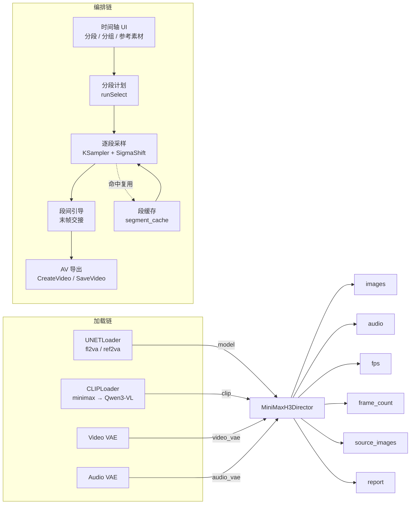

这个项目真正解决的不是"怎么生成一段视频"。官方 ComfyUI 已经给了 MiniMax H3 的原子节点，动手连四五下也能出片。AIMixer 的 `MiniMaxH3Director` 把这条原子链收进一个带时间轴的节点，让多段视频的长片生成、逐段重跑、缓存复用和段间衔接变成同一个界面里的事。难点从"连对节点"移到了"编排时间轴"。

仓库实际上有两层，别把它们当成一个东西：**插件代码**在上游 [AIMixer/ComfyUI_MiniMaxH3_Director](https://github.com/AIMixer/ComfyUI_MiniMaxH3_Director)，**开箱即用的工作流 JSON** 在 [huangserva 的副本](https://github.com/huangserva/ComfyUI_MiniMaxH3_Director)。

## 两个仓库，各管一段

| 字段 | 上游 AIMixer（插件） | 副本 huangserva（工作流） |
|------|---------------------|--------------------------|
| 内容 | Python 后端 + JS 前端自定义节点 | 5 份 ComfyUI 工作流 JSON + README |
| Stars / Forks | 137 / 7 | 260 / 28 |
| 创建时间 | 2026-08-04 04:20 UTC | 2026-08-04 10:39 UTC |
| 最近 push | 2026-08-05 10:33 UTC | 2026-08-04 10:45 UTC |
| 大小 | 711 KB | 10 KB |
| 许可证 | Apache-2.0 | Apache-2.0 |
| 默认分支 | main | main |

数据来自 GitHub API（2026-08-06 验证）。上游是完整的 Python 插件，`__init__.py` 注册节点，`director/` 下是倍数超 50 KB 的编排模块（plan、executor、segment_cache、segment_continuity、audio_export 等），`web/` 是前端时间轴 UI，所以 GitHub 把语言标记成 JavaScript。副本只有 5 份 JSON 和一份 README，没有一行代码——它也不是上游的 fork，是 README 里明确定义的「方便下载、复现和测试的副本」。

要做的是：先装插件，再拖工作流。缺了插件，JSON 里的 `MiniMaxH3Director` 节点根本加载不出来。

## 导演台到底把什么收进来了

官方 ComfyUI 对 MiniMax H3 的支持是原子级的：`MiniMaxH3ImageToVideo`、`MiniMaxH3ReferenceToVideo`、`MiniMaxH3SigmaShift`、`KSampler` 各管一步。要出一段 5 秒视频，用户得手动把它们连起来。导演台在内部仍然调用这些官方节点，只是外面多包了一层时间轴管理、分段调度和缓存。



两条主线：左边四条模型线（UNET、CLIP、两个 VAE）汇进导演台；右边是编排链，时间轴决定分段，逐段采样，段间缓存和末帧引导减少重复计算与画面跳变，最后导出。节点对外只露 4 个输入、6 个输出。

## MiniMax H3 模型族

MiniMax H3 是 MiniMax-AI 的多模态音视频生成模型。ComfyUI 官方在 v0.30.0 里合并了对它的原生支持（[PR #15224](https://github.com/comfyanonymous/ComfyUI/pull/15224)、[PR #15228](https://github.com/comfyanonymous/ComfyUI/pull/15228)），权重由 [Comfy-Org 在 Hugging Face 发布](https://huggingface.co/Comfy-Org/MiniMax-H3)。

两个核心变体，差异在输入通道：

| UNET 变体 | 文件名 | 适配模式 |
|-----------|--------|---------|
| **fl2va** | `minimax_h3_fl2va_pruned_int8_convrot.safetensors` | T2V、I2V、FL2V——纯文本或图片到视频 |
| **ref2va** | `minimax_h3_ref2va_pruned_int8_convrot.safetensors` | R2V、V2V、RV2V——需要参考素材或源视频输入 |

共用同一套辅助组件：

| 用途 | 文件 | 放置目录 |
|------|------|---------|
| 文本编码器（Qwen3-VL 32B） | `qwen3vl_32b_minimax_h3_nvfp4_awq.safetensors` | `models/text_encoders/` |
| 视频 VAE | `minimax_h3_video_vae_fp16.safetensors` | `models/vae/` |
| 音频 VAE | `minimax_h3_audio_vae_fp32.safetensors` | `models/vae/` |

一个容易漏的细节：CLIP Loader 节点的 `type` 参数必须选 `minimax`，不能留默认值。这个值告诉 ComfyUI 用 Qwen3-VL 而非常规 CLIP 模型做文本编码。

## 导演台节点的四个机制

输入：`model` → `video_vae` → `audio_vae` → `clip`。输出：`images` → `audio` → `fps` → `frame_count` → `source_images` → `report`。4 进 6 出，机制落在这四处。

**逐段选择运行。** 传统视频工作流是"一条线跑到底"，改一个参数整段从头生成。导演台用分段时间轴，把长视频拆成多段，每段独立提示词，只勾选要跑的那几段。工作流 JSON 里的 `runSelectEnabled` 和 `runSelection` 控制这个行为：开启时只采样勾选的段，未勾选的段在用缓存或源画面填充。

**缓存复用。** 逐段运行的前提是缓存能命中。`director/segment_cache.py` 是独立模块，缓存以段为粒度。段内提示词、参考素材或采样参数变了，该段缓存失效，其他段不受影响。一个实际注意点：全局参数（分辨率、帧率、seed）变了，所有段的缓存可能全部失效。做 A/B 测试时固定这些变量，缓存才真正起作用。

**参考素材约束身份。** 在 R2V、V2V、RV2V 三种模式里，导演台用标签系统引用参考素材：`<Picture N>`（1–9）、`<Video K>`（1–3）、`<Audio J>`（1–3）。提示词写 `<Picture 1> walks into a neon-lit alley at night`，模型会尝试让画面人物外观对齐 Picture 1。导演台没有硬身份锁——身份一致性由模型能力和参考素材共同决定，它只负责把素材送进去。参考图角度偏、分辨率低，身份漂移照样发生。

**段间引导。** 多段拼接时，导演台用上一段末帧作为下一段首帧的初始条件，让画面有交接。`output.continuityEnabled` 和 `output.continuityOverlapFrames`（默认 9 帧）控制这个行为，默认关闭。注意：末帧交接解决的是画面连续性——镜头、光线、背景的平滑过渡——人物长相这类跨段一致性，仍靠参考素材约束和人工检视。

## 五种模式：同一节点的五个预设

5 份工作流节点拓扑完全一样，差异只在导演台节点的 `timelineMode` 和 `taskType` 参数。

| 工作流 | 模式 | UNET | timelineMode | 典型用途 |
|--------|------|------|-------------|---------|
| `minimax_h3_director_t2v.json` | T2V | fl2va | `gen_blank` | 纯文本生成音视频 |
| `minimax_h3_director_fl2v.json` | FL2V / I2V | fl2va | `fl2v` | 首尾帧生视频；只放首帧时退化为 I2V |
| `minimax_h3_director_r2v.json` | R2V | ref2va | `gen_blank` | 多张参考图 + 提示词生成视频 |
| `minimax_h3_director_v2v.json` | V2V | ref2va | `video` | 上传源视频，按时间轴逐段重绘 |
| `minimax_h3_director_rv2v.json` | RV2V | ref2va | `video` | 源视频 + 参考图/参考音频，视频换人 |

`timelineMode` 决定导演台 UI 的交互方式：`gen_blank` 是空白时间轴（从零创建），`fl2v` 是首尾帧分组 UI（每组一对关键帧），`video` 是源视频时间轴（上传后按帧分割）。`taskType` 是字符串标签，同时作为节点的显示名和内部调度逻辑的判断依据。

两组退化关系值得记住：T2V 是 FL2V 把首尾帧都留空的退化形态（共用 fl2va）；V2V 是 RV2V 不挂参考素材时的退化形态（共用 ref2va）。理解这一点，5 份 JSON 就变成 1 份模板的 5 个预设，切换模式只改参数和 UNET 文件名。

## 11 节点拓扑

5 份工作流的节点图一致——11 个节点，结构相同，差异全在导演台节点的参数里。

| 节点 ID | 类型 | 标题 | 作用 |
|---------|------|------|------|
| 1 | `UNETLoader` | MiniMax H3 UNET | 加载 fl2va 或 ref2va 扩散模型 |
| 2 | `CLIPLoader` | CLIP (minimax / Qwen3-VL) | 加载 Qwen3-VL 32B 文本编码器，type 选 `minimax` |
| 3 | `VAELoader` | Video VAE | 加载视频变分自编码器（fp16） |
| 4 | `VAELoader` | Audio VAE | 加载音频变分自编码器（fp32） |
| 5 | `MiniMaxH3Director` | （无标题） | 导演台核心节点 |
| 6 | `CreateVideo` | （无标题） | 将画面帧序列编码为视频 |
| 7 | `SaveVideo` | （无标题） | 保存视频文件到输出目录 |
| 8 | `PreviewAny` | Director 运行报告 | 显示导演台输出的分段计划和任务摘要 |
| 9 | `PreviewAny` | fps | 显示帧率 |
| 10 | `PreviewAny` | frame_count | 显示总帧数 |
| 11 | `MarkdownNote` | （工作流名称） | 嵌入使用说明的 Markdown 笔记节点 |

数据流：4 个 Loader 把 model、clip、video_vae、audio_vae 送进导演台节点；导演台吐出 images、audio、fps、frame_count、source_images、report；CreateVideo 接收 images 和 audio 打包视频流，SaveVideo 写盘，3 个 PreviewAny 只显示元数据不参与加工。拓扑一致意味着换模式不用重新搭图，只改导演台参数，再换 UNET 文件名。

## 导演台节点的参数结构

从工作流 JSON 提取的 `widgets_values`：

| 序号 | 参数 | 示例值 | 说明 |
|------|------|--------|------|
| 0 | task_type | `t2v — 文生视频(Text to Video)` | 任务模式标签 |
| 1 | global_prompt | （多行文本） | 全局提示词 |
| 3 | cfg | `1.0` | CFG 比例 |
| 4 | seed | `42` | 随机种子 |
| 5 | seed_control | `randomize` | 种子控制模式 |
| 6 | frame_rate | `24.0` | 帧率 |
| 7 / 8 | width / height | `864` / `480` | 画面尺寸 |
| 9 | long_edge / ref_max_size | `864` | 长边/参考图最大尺寸 |
| 10 | total_frames | `124` | 总帧数（17k+5 网格对齐） |
| 11 | timeline_data | （JSON 字符串） | 时间轴完整配置 |
| 13 | steps | `25` | 采样步数 |
| 14 | sampler | `res_multistep` | 采样器 |
| 15 | scheduler | `simple` | 调度器 |
| 16 | shift_video | `12.0` | 视频 sigma 偏移 |
| 17 | shift_audio | `3.0` | 音频 sigma 偏移 |
| 19 | clear_vram_between_segments | `True` | 段间清理显存 |
| 20 | export_source_images | `False` | 是否导出源画面 |

`timeline_data` 是序列化 JSON，包含 `editMode`、`timelineMode`、`totalFrames`、`output`（导出设置）、`videoClips`、`segments`、`runSelectEnabled`、`runSelection` 等字段，是导演台 UI 的完整状态快照——界面上每步操作都反映到这里。

**帧数对齐规则。** 总帧数 124 不是随手填的。MiniMax H3 的扩散模型按 17k+5 网格对齐（k 为非负整数）：k=0→5、k=1→22、k=2→39、k=3→56、k=4→73、k=5→90、k=6→107、k=7→124 帧 ≈ 5.17 秒 @ 24fps。输入非对齐帧数，模型会自动 round 到最近的网格点。想精确控制时长（比如刚好 4 秒 = 96 帧）是做不到的，你只能选网格点。

## 一次视频换人怎么流过系统

RV2V 是交互最复杂也最常用的模式。以它为任务流案例，看导演台怎么把一次换人组织起来。

导入 `minimax_h3_director_rv2v.json`，确认 UNET Loader 选中 `ref2va`、CLIP type 为 `minimax`、两个 VAE 指向对应文件。上传源视频后分段——手动切、按段数均分、或用 PySceneDetect 智能检测镜头边界。段越长单段计算压力越大，段越短段间交接越多、画面连续性风险越高。接着上传人物参考图（1–9 张），要声音约束再加参考音频（1–3 段）。参考图的拍摄角度、光线、分辨率直接影响身份一致性——正面照、均匀光、高分辨率最好。

每段分别写提示词。源视频片段自动绑定为 `<Video 1>`，参考素材用 `<Picture N>` 和 `<Audio J>` 引用。

```text
Replace the person in <Video 1> with the subject from <Picture 1>.
Keep camera motion and scene layout from <Video 1>.
Match identity, hair, and outfit of <Picture 1>.
Cinematic lighting. No text or logos.
```

这段提示词来自工作流 JSON 的默认值，结构是"指定替换对象 → 保留源属性 → 约束参考身份"三段式。保持这个结构有助于模型理解意图。

README 的建议是先生成一个 5 秒片段（124 帧），检查脸部、服装、动作和镜头边界再决定扩展。原因直接：视频生成的时间和显存成本随帧数线性增长，不确定质量时用最短片段试错成本最低。音频有三种选择——模型生成（根据提示词自动生成）、沿用原声（用源视频音轨）、静音。换人场景里想保留背景音但替换人声，「模型生成」会整段重来，不如后期混音。

## 硬件与默认参数：测了什么，不能推出什么

README 验证环境：NVIDIA RTX 4090 **48GB**、ComfyUI 0.30.0、PyTorch 2.11.0、CUDA 12.8、MiniMax H3 Ref2VA INT8。这套数字只说明一件事：在 48GB 显存、INT8 量化、864×480、124 帧、25 步的配置下，ref2va 这条链路能跑通。它不能推出"所有卡都能跑""速度有多快""质量有多好"。

值得注意的是 README 明确写"当前已验证的 4090 环境只有 Ref2VA"——R2V、V2V、RV2V 有实机验证，T2V、I2V、FL2V 需要补 fl2va 权重，在该硬件上还没跑通。RTX 4090 48GB 是定制版（零售版 4090 为 24GB 显存）。显存更小的卡（24GB、16GB）需要降分辨率或帧数，但没给出实测参考。导演台的 `clear_vram_between_segments`（默认 True）在段间清显存防累积 OOM，代价是清理和重载的时间开销。

## 安装

前置：ComfyUI ≥ 0.30.0（含官方 MiniMax H3 节点）、NVIDIA GPU 显存 ≥ 24GB、CUDA 12.x + PyTorch 2.x。

```bash
cd ComfyUI/custom_nodes
git clone https://github.com/AIMixer/ComfyUI_MiniMaxH3_Director.git
python -m pip install -r ComfyUI_MiniMaxH3_Director/requirements.txt
```

`requirements.txt` 里是可选依赖：`scenedetect`（智能分镜）、`opencv-python-headless`（源视频解码）、`imageio-ffmpeg`（原声抽取）。装完重启 ComfyUI，节点列表里应出现 `MiniMaxH3Director`。也可以在 ComfyUI Manager 里用 Install via Git URL 装上游地址。模型权重按前面表格放到 `models/` 对应目录，再把 `example_workflows/` 的 JSON 拖进界面。

## 局限与陷阱

**身份一致性没有硬保证。** 导演台通过参考素材约束身份，但模型没有"身份锁"。一段 30 秒视频分 6 段生成，即使每段挂同一张参考图，脸型、发色、服装仍可能段间漂移。段间引导解决画面连续性，不解决身份一致性。严格一致目前只能每段生成后人工检视、重跑不满意的段（逐段运行和缓存就是为这个流程设计的），或后期用 face-swap 修正。

**fl2va 模式未经验证。** README 只验证了 Ref2VA。T2V、I2V、FL2V 需要 fl2va 权重，架构上与 ref2va 共享大部分组件，但没有实机跑通记录。遇到 OOM、质量异常、注册失败，优先考虑这个因素。

**可选依赖的安装风险。** 智能分镜依赖 `scenedetect`，V2V/RV2V 的源视频解码和原声抽取依赖 `opencv-python-headless` 和 `imageio-ffmpeg`。它们不是 ComfyUI 标准依赖，漏装会让对应按钮直接报错。

**SageAttention 是可选优化。** 安装后在 UNETLoader 与导演台的 `model` 连线之间插一个补丁节点。README 建议先确认开启后输出质量与不开一致，再记录速度变化。注意力近似有时引人生成伪影，长视频多段拼接时可能累积放大。

## 谁该先上，谁可以等

这条路径适合已经在用 ComfyUI 做长视频、觉得"每改一个参数都要重跑整条时间轴"的人。逐段选择 + 缓存 + 末帧引导这套编排，对多段叙事、需要反复迭代镜头的内容是实打实的省事。做 A/B 测试时固定源素材、提示词、seed、分辨率、帧数和 steps 六个变量，每次只改一个维度，才能把效果差异归因到具体改动。

还不急的条件也很清楚：没有 24GB 以上显存，或只想跑单段 T2V 短视频，官方原子节点已经够用，导演台的编排能力用不上。而如果你需要严格的人物身份一致、或对 fl2va 链路有刚性需求，现阶段 README 还没验证过，建议先观望实机结果再上。

回到开头那句判断：这个项目没发明新的生成能力，它把"多段视频生成"从一堆离散节点改造成一个有状态的时间轴。值得参考的正是这套编排思路——它把最容易出错的段间衔接、缓存失效和逐段回归收进了同一个节点。