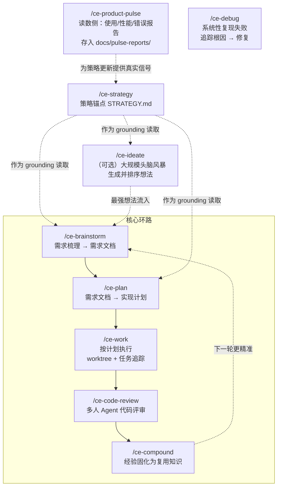

Compound Engineering 做一件事：让每次工程工作产出的不只是一个功能，还有下一次更好工作的条件。

传统开发里，每加一个功能，代码库变大，下一个功能更难改。Compound Engineering 反过来做——80% 的精力放在规划和评审，20% 在执行。brainstorm 把需求想清楚，plan 把路径定下来，work 按计划执行，review 抓模式而不只是 bug，compound 把学到的东西固化成下次可用的知识。每一轮循环都在为下一轮降低难度。

目前插件包含 37 个 Skill 和 51 个 Agent，支持 Claude Code、Cursor、Codex、GitHub Copilot、Factory Droid、Qwen Code、OpenCode、Pi、Gemini CLI、Kiro CLI 共 10+ 个平台。

读完这篇文章，你至少能回答几个问题：

- Compound Engineering 的「复利」具体是怎么发生的
- 核心环路里每一步解决什么问题，跳过某一步会丢什么
- 在不同平台上安装的差异藏在哪
- 这套协议什么时候该用，什么时候反而会拖慢你

| → | [系统地图](#系统地图) | [核心环路](#核心环路) | [一条典型循环](#一条典型循环) | [安装](#安装) | [适用边界](#适用边界) | [FAQ](#faq) | [自测](#自测)

## 系统地图



图上的核心信息：`/ce-strategy` 是上游锚点——STRATEGY.md 写下目标问题、方案、指标和追踪记录。brainstorm 和 plan 在执行前都读它，保证策略选择能流进功能构思。`/ce-product-pulse` 是读数侧配套——从真实用户数据里拉信号回到策略锚点。这两个闭合了「策略 → 执行 → 测量 → 策略」的大环。

## 核心环路

Compound Engineering 的核心环路只有 5 步，缺任何一步都会让复利断掉：

| 步骤 | Skill | 做什么 | 跳过会丢什么 |
|------|-------|--------|------------|
| 1. 需求梳理 | `/ce-brainstorm` | 交互式问答，把模糊想法变成需求文档 | 方向和边界没对齐就开始写代码，返工成本高 |
| 2. 实现计划 | `/ce-plan` | 把需求文档转为分步骤的实现计划 | 代码改了才发现方案有问题，上下文已经耗尽 |
| 3. 执行 | `/ce-work` | 用 worktree 隔离变更，任务追踪保证不遗漏 | 多任务交叉污染，不小心提交了未完成的代码 |
| 4. 评审 | `/ce-code-review` | 多人 Agent 代码评审，抓模式而不只是语法错误 | bug 进了主干，下一次 debug 要重新理解上下文 |
| 5. 知识固化 | `/ce-compound` | 把这次学到的经验文档化 | 换了个人（或同一个 Agent 的下次会话），从零开始 |

`/ce-debug` 是一个独立入口——当需要系统性排查 bug 时，它走「复现失败 → 追踪根因 → 实施修复」这条线，完成后一样接 code-review 和 compound。

`/ce-ideate` 是环路前的一个可选拓展：在动手前让 Agent 生成并批判性评估一批想法，排完序后把最强的一个流入 brainstorm。适合「连做什么都还没想清楚」的阶段——如果你已经有明确需求，直接从 brainstorm 开始。

## 一条典型循环

下面走一遍最常用的路径：从「有个模糊想法」到「经验被固化」的完整过程。

**Step 1: `/ce-brainstorm`**

```
/ce-brainstorm "make background job retries safer"
```

Agent 进入交互式问答——问清楚「安全」的定义是什么、当前重试策略在哪、哪些场景会出问题、有没有幂等性保证。最后产出一份 `docs/brainstorms/background-job-retry-safety-requirements.md`。

**Step 2: `/ce-plan`**

```
/ce-plan docs/brainstorms/background-job-retry-safety-requirements.md
```

Agent 读需求文档，输出分步骤实现计划——先改哪里、后改哪里、每步的验证方式、可能影响的其他模块。计划本身是 markdown 文件，可以 review 后再进执行。

**Step 3: `/ce-work`**

```
/ce-work
```

Agent 创建 worktree 隔离变更，按计划逐条执行。任务追踪保证每条计划项都被处理，遗漏的会标记出来。

**Step 4: `/ce-code-review`**

```
/ce-code-review
```

多个 Agent 从不同角度审查：逻辑正确性、安全漏洞、性能影响、代码风格。输出一份合并评审报告，不只是标 bug，还标出了「这次踩的坑和上次某个 compound 笔记里的坑是同一种模式」。

**Step 5: `/ce-compound`**

```
/ce-compound
```

Agent 把这次的经验写进知识库——「后台任务重试的安全边界取决于幂等性保证和死信队列的超时配置」。下一次有人（或 Agent）处理类似任务时，这条笔记会出现在上下文中。

重点是这步完了之后回到 Step 1：下一轮 brainstorm 会读到上次 compound 的笔记和 STRATEGY.md 里的最新指标，起点比上一轮高。

## 安装

Compound Engineering 是一个跨平台插件，不同平台的安装路径不同。核心差异：原生的 Claude Code/Cursor/Copilot 一步装完；Codex/OpenCode/Pi 等需要额外步骤注册 Agent。

### Claude Code

```shell
/plugin marketplace add EveryInc/compound-engineering-plugin
/plugin install compound-engineering
```

### Cursor

```
/add-plugin compound-engineering
```

### GitHub Copilot

VS Code 内：`Chat: Install Plugin from Source` → 输入 `EveryInc/compound-engineering-plugin` → 选 `compound-engineering`。

Copilot CLI：

```shell
/plugin marketplace add EveryInc/compound-engineering-plugin
/plugin install compound-engineering@compound-engineering-plugin
```

### Codex（三步）

Codex 的插件系统不会自动注册自定义 Agent，需要额外一步：

```bash
codex plugin marketplace add EveryInc/compound-engineering-plugin
bunx @every-env/compound-plugin install compound-engineering --to codex
```

然后在 Codex TUI 里运行 `/plugins`，找到 Compound Engineering marketplace，选中 `compound-engineering` 插件安装。三步缺一不可。

### Qwen Code / Factory Droid

```shell
qwen extensions install EveryInc/compound-engineering-plugin:compound-engineering

droid plugin marketplace add https://github.com/EveryInc/compound-engineering-plugin
droid plugin install compound-engineering@compound-engineering-plugin
```

### OpenCode / Pi / Gemini / Kiro

通过 Bun 安装器转换格式：

```shell
bunx @every-env/compound-plugin install compound-engineering --to opencode
bunx @every-env/compound-plugin install compound-engineering --to pi
bunx @every-env/compound-plugin install compound-engineering --to gemini
bunx @every-env/compound-plugin install compound-engineering --to kiro
```

Pi 需要额外安装 `pi-subagents`（必需）和 `pi-ask-user`（推荐），因为 Pi 不自带 subagent 原语。

### 安装后第一件事

```
/ce-setup
```

检查环境、安装缺失工具、初始化项目配置。任何一个平台装完后都应该先跑这一步。

## 适用边界

**值回票价的情况：**

- 团队在做一个持续迭代的产品，不是一次性项目——复利需要时间积累
- 每次写代码前需要先把需求想清楚——brainstorm 的交互式问答比「对着空白的 cursor 发呆」省下的是决策时间
- 团队里有人做完功能就忘了总结——compound 把口头经验变成 51 个 Agent 都能读到的文件
- 代码评审不只是找语法错误，而是抓模式——多人 Agent 评审的覆盖角度比单人 review 宽

**不值得折腾的情况：**

- 一次性脚本或原型验证——走完整个环路的 overhead 超过实际编码时间
- 团队只有一个人且任务量小——compound 笔记的受益者太少
- 已有成熟的 CI/代码审查/知识管理流程且运转良好——Compound Engineering 会和你现有的工具打架

## FAQ

**Q1: 37 个 Skill 和 51 个 Agent，是不是堆数量？**

每个 Skill 和 Agent 有明确的职责边界。核心环路只用到 5 个 Skill（brainstorm / plan / work / code-review / compound），剩下的 32 个是覆盖不同领域的高阶能力——比如 `/ce-doc-review` 审查文档、`/ce-cross-artifact-review` 跨产物一致性检查。日常 80% 的场景用 5 个核心 Skill 就够了。

**Q2: 80% 规划 20% 编码，会不会变成过度设计？**

Compound Engineering 里的「规划」不是写 50 页设计文档。brainstorm 产出的需求文档是「刚好够」的——回答清楚边界、约束和验收标准就停。plan 产出的实现计划是按文件粒度的改动列表，不是架构设计图。真正花时间的不是写文档，而是「提问 → 回答 → 澄清」这个过程——这个过程省掉了后面「写了一半发现方向错了」的返工。

**Q3: 和 Harness / Archon 的关系？**

不同层。Compound Engineering 是一套工作流协议——定义「怎么做事」。Harness 和 Archon 是 L3 层的配置工厂——定义「Agent 团队怎么组」。Compound Engineering 的 Agent 可以在 Harness 生成的团队结构里跑。

## 自测

1. 你上次修完一个 bug 或做完一个功能后，有没有把经验写下来？如果换了个人来做同样的事，他能从你的笔记里省多少时间？
2. 你的团队现在是「先写代码再想方案」还是「先想方案再写代码」？如果是前者，选一个中等复杂度的任务，用 brainstorm → plan → work 走一遍，比较一下和原来流程的时间差。
3. 你的团队在用哪个平台？Claude Code 和 Cursor 是一步安装，Codex 和 OpenCode/Pi 需要多一步 Agent 注册。先确认安装复杂度能不能接受。
4. 把你的代码审查记录翻出来看——这半年里，有多少次评审只是标了语法问题和拼写错误？多少次抓到了「这个模式和上次出过的 bug 是同一种」？

## 参考

- [Compound Engineering GitHub](https://github.com/EveryInc/compound-engineering-plugin)
- [完整组件参考（所有 Agent 和 Skill 清单）](https://github.com/EveryInc/compound-engineering-plugin/blob/main/plugins/compound-engineering/README.md)
- [Compound engineering: how Every codes with agents](https://every.to/chain-of-thought/compound-engineering-how-every-codes-with-agents)
- [The story behind compounding engineering](https://every.to/source-code/my-ai-had-already-fixed-the-code-before-i-saw-it)