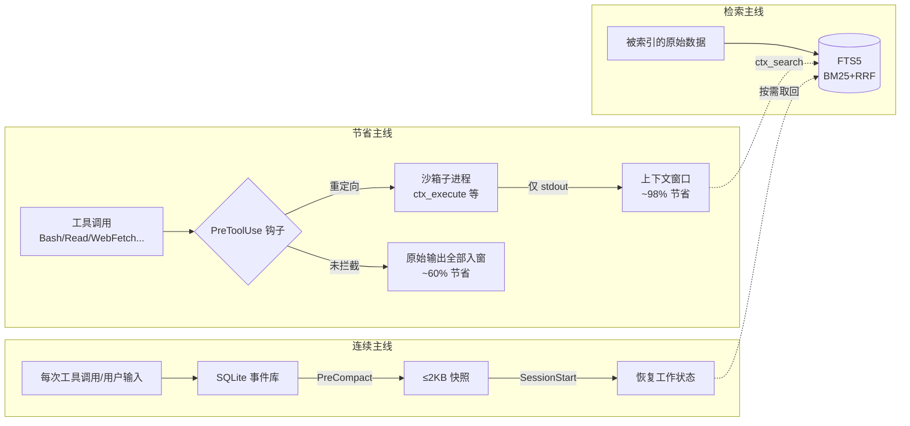

# Context Mode：用沙箱和本地索引管住 AI 编程 Agent 的上下文

AI 编程 Agent 的上下文问题其实有两个，多数优化方案只管住其中一个。第一个是**倾倒**：MCP 工具每次调用都把原始数据整个塞进上下文窗口——一个 Playwright 快照 56KB，20 个 GitHub Issue 59KB，一小时后 40% 的窗口就没了。第二个是**失忆**：Agent 为了腾空间压缩对话时，正在改哪些文件、任务进行到哪、你上次的要求是什么，全部丢掉。Context Mode（mksglu/context-mode）的做法是把这两个问题拆开治：沙箱把原始数据挡在窗口外，只放行最终答案；SQLite FTS5 知识库把会话事件落盘，压缩后按需取回；再由钩子强制路由——让模型真的走沙箱，而不是靠提示词劝它。这一整套机制跑下来，官方测得整场会话 315KB 原始输出压到 5.4KB，节省 98%。

这篇文章不讲安装步骤的每个细节，而是回答三个问题：沙箱凭什么能省这么多、会话恢复到底恢复了什么、以及在 17 个平台参差不齐的钩子支持下，你该把自己的平台归入哪一档预期。

## 系统总览：三条主线

Context Mode 是一个 MCP 服务器（npm 包名 `context-mode`），外加一组平台钩子。它的全部工作可以画成三条主线：



三条主线的分工：**节省主线**决定什么东西永远不进窗口；**连续主线**决定压缩之后模型还记得什么；**检索主线**是前两者的兜底——被挡在窗外的数据没有消失，只是从"占着窗口"变成了"可查询"。

## 项目概况

Context Mode 由 Mert Koseoglu 开发，2026 年 2 月建仓，上线当月即冲上 Hacker News 首页第一（570+ 分）。截至 2026-10-05 的仓库数据：

| 指标 | 数值 |
|------|------|
| GitHub Stars | 25,398 |
| Forks | 1,818 |
| 贡献者 | 111 人（含匿名） |
| 累计安装量 | 644.2k+（npm 601.8k + 插件市场 42.3k，官方 stats.json） |
| 最新 release | v1.0.169（2026-06-29，主分支此后仍在活跃推送） |
| 许可证 | Elastic License 2.0（ELv2，source-available） |
| 语言构成 | TypeScript 68.8%、JavaScript 28.1%、HTML 2.2%、Shell 0.9% |

ELv2 不是传统开源许可证：你可以自由使用、修改、分发源码，但不能把它包装成托管服务转售，也不能移除许可声明。作者对此说得直白——选 ELv2 而不是 MIT，是因为 MIT 允许有人拿代码做一个闭源 SaaS 来竞争。对个人和团队内部使用没有任何限制；如果你在做 AI 基础设施生意，这是唯一需要留意的条款。

官方对能力面的概括是四条：沙箱省上下文、会话连续、Think in Code、不干涉模型文风。最后一条常被忽略但值得单独说：Context Mode 只管"数据往哪走"，不管"模型怎么说话"——它不在系统提示里塞"请简洁回答"这类指令，因为作者引用 Moonshot AI 对 kimi-k2.5 的观察指出，激进的简洁要求会损伤编码和推理基准。这条边界让它在各种"压缩提示词"方案里显得克制。

## 11 个 MCP 工具

工具面由 6 个沙箱工具和 5 个元工具组成。沙箱工具是省上下文的执行者，元工具负责统计、诊断和维护：

| 工具 | 职责 | 官方标注的上下文节省 |
|------|------|---------------------|
| `ctx_batch_execute` | 一次调用跑多条命令+多个搜索，可选 `concurrency: 1-8` 并行 | 986KB → 62KB |
| `ctx_execute` | 在 12 种语言运行时里执行代码，仅 stdout 进入上下文 | 56KB → 299B |
| `ctx_execute_file` | 在沙箱内处理文件，原始内容不出沙箱 | 45KB → 155B |
| `ctx_index` | 把 markdown 按标题分块存入 FTS5（代码块保持完整） | 60KB → 40B |
| `ctx_search` | 一次调用多查询检索已索引内容 | 按需检索 |
| `ctx_fetch_and_index` | 抓取 URL、转 markdown、分块索引；TTL 内命中缓存直接复用 | 60KB → 40B |
| `ctx_stats` | 查看节省统计、调用次数、缓存命中 | — |
| `ctx_doctor` | 诊断安装：运行时、钩子、FTS5、插件注册、版本 | — |
| `ctx_upgrade` | 升级、重建、迁移缓存、修复钩子 | — |
| `ctx_purge` | 永久删除知识库中所有已索引内容 | — |
| `ctx_insight` | 打开托管 Insight 仪表盘（context-mode.com/insight，面向团队的用量分析） | — |

在 Claude Code 里这 11 个工具包装成斜杠命令（`/context-mode:ctx-stats` 等）；其他平台在聊天里直接输入 `ctx stats`、`ctx doctor`，模型会自动调用对应 MCP 工具。离开 AI 会话也可以在终端直接跑 `context-mode doctor`、`context-mode index . --source project:my-app`，`scripts/ctx-debug.sh` 则生成一份可直接贴进 issue 的完整诊断报告。

## 沙箱执行：原始数据为什么出不来

每次 `ctx_execute` 调用都会启动一个带独立进程边界的子进程。脚本在里面跑，stdout 被捕获后送进上下文，其余一切——日志文件、API 响应、快照——留在沙箱内。脚本之间互不可见内存和状态。

支持 12 种语言运行时：JavaScript、TypeScript、Python、Shell、Ruby、Go、Rust、PHP、Perl、R、Elixir、C#。检测到 Bun 时 JS/TS 执行快 3-5 倍。一个对实用性影响很大的细节是**凭证透传**：`gh`、`aws`、`gcloud`、`kubectl`、`docker` 这类已认证 CLI 继承环境变量和配置路径正常工作，但凭证本身不会暴露给对话——模型只看到命令输出，看不到你的 token。

### 输出超长时的 intent 过滤

当输出超过 5KB 且调用时给了 `intent` 参数，Context Mode 切换到意图驱动过滤：先把完整输出索引进知识库，再检索与意图匹配的片段，只返回相关匹配加上一份"可继续检索的词汇表"。也就是说 500 行访问日志只留下 155B 的结论，但那 45KB 没有丢，随时可以 `ctx_search` 回来。

### ctx_search 的渐进节流

连续裸调检索会被限流：第 1-3 次正常返回（每次查询 2 条），第 4-8 次降为 1 条并给出警告，第 9 次起直接阻断并重定向到 `ctx_batch_execute`。节流逼着模型把多次小查询合并成一次批量调用——这是防"省了输出却把调用次数翻倍"的自我平衡设计。

## 知识库：FTS5 之上的三层检索

`ctx_index` 按标题分块存入 SQLite FTS5 虚拟表，索引时套用 Porter 词干化（"running"、"runs"、"ran" 归并到同一词干），标题和章节头在 BM25 打分中占 5 倍权重——这对"找某个章节"类的导航查询很关键。

`ctx_search` 每次跑两条并行策略，用 Reciprocal Rank Fusion（倒数排名融合）合并：

| 策略 | 机制 | 擅长 |
|------|------|------|
| **Porter 词干** | FTS5 MATCH + porter 分词器 | "caching" 命中 "cached"、"caches" |
| **Trigram 子串** | FTS5 trigram 分词器 | "useEff" 找到 "useEffect"，代码标识符的部分匹配 |

融合后再过三道后处理：多词查询做**邻近度重排**（两个词挨得近的段落排前面）；查询词先用 **Levenshtein 距离纠错**（"kuberntes" 自动改成 "kubernetes" 再搜）；返回结果用**智能摘录**——围绕命中位置取窗口，而不是傻截前 N 个字符。

缓存策略：索引内容存在项目级数据库 `~/.context-mode/content/`，TTL 默认 24 小时，可按次用 `ttl: <毫秒>` 覆盖，`ttl: 0` 或 `force: true` 强制重抓。TTL 内再取同一 URL 直接返回约 0.3KB 的缓存提示而不重新抓取；启动时清理 14 天以上的旧内容。`ctx_stats` 会把缓存命中单独列出来——省了多少数据、少发了多少请求。

## 会话连续性：压缩之后恢复的是什么

这是 Context Mode 和"提示词压缩方案"分道扬镳的地方。会话连续依赖 6 类钩子事件协同：

| 事件 | 职责 | 支持平台（节选） |
|------|------|-----------------|
| **PreToolUse** | 工具执行前强制沙箱路由 | Claude Code、Copilot CLI、Cursor、Codex CLI、Kiro 等 |
| **PostToolUse** | 每次工具调用后捕获事件 | 几乎全部平台 |
| **UserPromptSubmit** | 捕获用户决策与纠正（"用 X 别用 Y"） | Claude Code、Copilot CLI、Codex CLI；OpenCode/KiloCode 用 `chat.message` 等价实现 |
| **Stop** | 捕获轮次结束状态 | Claude Code、Copilot CLI、Cursor、Codex CLI |
| **PreCompact** | 压缩前建快照 | Claude Code、Gemini CLI、两类 Copilot、Codex CLI；插件平台等效 |
| **SessionStart** | 压缩或恢复后重建状态 | 同上；Cursor 的 sessionStart 被其校验器拒绝，暂缺 |

捕获的内容分 23 类事件，按优先级分层：文件读写、任务、计划是 P1；用户纠正、git 操作、错误及其修复对、约束和阻塞项是 P2；延迟、MCP 调用计数、子 Agent 结果是 P3。

**一次压缩恢复的完整流转**是这样的：上下文快满时 PreCompact 钩子触发，从 SQLite 读出本场会话全部事件，压成一个不超过 2KB 的优先级分层 XML 快照存入 `session_resume` 表——预算紧张时先丢 P4（会话意图、MCP 计数），活动文件、任务、规则、用户决策这些关键状态永远保留。SessionStart 触发后取回快照，把结构化事件写入文件并自动索引进 FTS5，生成一份含最近请求、任务清单（带完成状态）、关键决策、未解决错误、git 操作等条目的 Session Guide，以 `<session_knowledge>` 指令注入上下文。模型于是从你最后一句话接着干，不用你复述任何东西。事后想查细节，`ctx_search` 检索的是落盘的全量事件，不只是那 2KB 快照。

各平台的会话完整度差异很大，直接决定你对"压缩后恢复"的预期：

| 完整度 | 平台 | 说明 |
|--------|------|------|
| **完整** | Claude Code、Gemini CLI、VS Code Copilot、JetBrains Copilot、OpenCode、KiloCode | 捕获+快照+恢复全链路。OpenCode/KiloCode 用 `experimental.chat.system.transform` 作为 SessionStart 替身实现 |
| **高** | GitHub Copilot CLI、OpenClaw、Pi、OMP | 关键事件齐备，个别事件走等效通道 |
| **部分** | Cursor、Codex CLI、Antigravity CLI（agy）、Kiro | 有路由有捕获，缺恢复环节（Cursor 的 sessionStart 被校验器拒绝；Kiro 的 agentSpawn 未接通；Codex 的 PreCompact 取决于构建版本是否发出该事件） |
| **无** | Antigravity IDE、Zed | 无钩子，仅 MCP + 手动复制路由文件 |

## 性能数据怎么读

官方基准（21 个场景，完整数据在仓库 BENCHMARK.md）中的代表性数字：

| 场景 | 原始大小 | 进入上下文 | 节省率 |
|------|----------|-----------|--------|
| Playwright 快照 | 56.2KB | 299B | 99% |
| GitHub Issues（20 个） | 58.9KB | 1.1KB | 98% |
| 访问日志（500 条请求） | 45.1KB | 155B | 100% |
| Context7 React 文档 | 5.9KB | 261B | 96% |
| 分析 CSV（500 行） | 85.5KB | 222B | 100% |
| Git 日志（153 次提交） | 11.6KB | 107B | 99% |
| 测试输出（30 个套件） | 6.0KB | 337B | 95% |
| 子 Agent 仓库研究 | 986KB | 62KB | 94% |

整场会话合计：315KB 原始输出压到 5.4KB，官方称会话时长从约 30 分钟延长到约 3 小时。

读这组数字要守住三条边界。**测的是什么**：每行对比的是"工具原始输出体积"对"沙箱放行后的 stdout/结论体积"，节省率本质上取决于原始输出和最终答案之间的信息比——访问日志这种"结论只有一行"的数据天然接近 100%，文档检索这种结论占比高的就只有 95% 左右。**它不推出什么**：不等于 API 账单降 98%（token 计费还含系统提示、代码文件和对话本身）；也不等于任务质量提升——省上下文的收益是延迟更少的压缩、更长的有效工作窗口，而不是模型变聪明。**数据出处**：全部是作者自测，没有第三方复现，但测量方法（`ctx_stats` 的前后对比）你可以装好后在同样场景里自行验证，练习 1 就是干这个的。

## 安装配置

### Claude Code：插件市场全自动（推荐）

```bash
# 前置要求：Claude Code v1.0.33+（claude --version 查看）
# /plugin 不识别时先更新：brew upgrade claude-code 或 npm update -g @anthropic-ai/claude-code

/plugin marketplace add mksglu/context-mode
/plugin install context-mode@context-mode

# 重启 Claude Code（或 /reload-plugins）
# 验证：全部检查应显示 [x]
/context-mode:ctx-doctor
```

插件注册全部 6 类钩子事件和 11 个 MCP 工具，SessionStart 钩子在运行时注入路由指令，不往项目里写任何文件。想先轻量试用，可以只装 MCP 不装钩子：

```bash
claude mcp add context-mode -- npx -y context-mode
```

这样 11 个工具可用、没有自动路由——模型仍可能去用裸 Bash 和 Read，适合先看效果再决定是否全量上钩子。Claude Code 还支持可选的状态栏（手动往 `~/.claude/settings.json` 加一行 `context-mode statusline`），实时显示本会话省了多少。

### 其他平台：按钩子能力分三档

| 档位 | 平台 | 安装方式与预期 |
|------|------|---------------|
| 钩子全自动 | Gemini CLI（单配置文件含 4 钩子）、VS Code/JetBrains Copilot、GitHub Copilot CLI（插件一条命令）、Codex CLI（`codex plugin marketplace add` + `[features].hooks`）、OpenCode/KiloCode（`plugin: ["context-mode"]` 一行）、Kiro、Pi（`pi install npm:context-mode`）、OMP（`omp plugin install context-mode`）、OpenClaw（网关插件，需 >2026.1.29）、Antigravity CLI（agy ≥1.0.7） | 路由强制 + 会话连续，体验接近 Claude Code |
| 钩子部分可用 | Cursor（市场插件待审，先走本地文件夹或手动 hooks.json）、Codex CLI 手动路径 | 有路由有捕获，缺压缩后恢复，见上文完整度表 |
| 仅 MCP 无钩子 | Antigravity IDE、Zed | MCP 注册 + 手动复制一份路由文件（GEMINI.md / AGENTS.md），节省降到 ~60% |

两个安装期注意事项：其一，OpenCode/KiloCode 的配置里如果同时存在 `plugin: ["context-mode"]` 和旧的 `mcp.context-mode` 条目，会注册出零个工具，跑一次 `context-mode upgrade` 清掉旧条目即可（v1.0.140+ 会主动报这个诊断）；其二，存储依赖 SQLite——Linux 上 Node.js ≥22.5 自动切换到内置 `node:sqlite` 模块（顺带绕开 better-sqlite3 在 Linux 上的偶发 SIGSEGV 问题），Node <22.5 不受支持；Bun 用内置 `bun:sqlite`，都免去原生编译，只有老 glibc 系统（CentOS 7/8、RHEL 8）需要装 C++20 工具链从源码编译。

## Think in Code：范式层的收益

前面讲的都是"同样的输出少进窗口"，第三条能力改的是工作方式本身：**LLM 应该编程做分析，而不是自己当计算器**。README 的官方例子：

```js
// 之前：47 × Read() = 700KB 进上下文
// 之后：1 × ctx_execute() = 3.6KB
ctx_execute("javascript", `
  const files = fs.readdirSync('src').filter(f => f.endsWith('.ts'));
  files.forEach(f => console.log(f + ': ' + fs.readFileSync('src/'+f,'utf8').split('\n').length + ' lines'));
`);
```

要统计 47 个文件各多少行，让模型把文件全读进上下文再数，700KB 就没了；让它写个脚本去数，只有脚本加结果共 3.6KB 进窗口，官方口径是 100 倍节省。这个范式是 17 个支持客户端通用的强制要求——钩子路由挡住被动的输出倾倒，Think in Code 消除主动的倾倒（读文件、抓页面本来就是模型自己发起的）。这也是为什么不支持钩子的平台（Zed、Antigravity IDE）即使装了 MCP，效果也差一截：路由层缺失后，模型是否走沙箱全凭自觉，官方实测合规率约 60%。

## 安全与隐私

### 权限规则延伸进沙箱

Context Mode 复用你已有的 Claude Code 权限规则，并把它们扩展到 MCP 沙箱内——你封了 `sudo`，`ctx_execute` 里跑 `sudo` 同样被封。写进项目的 `.claude/settings.json`（或全局配置）：

```json
{
  "permissions": {
    "deny": [
      "Bash(sudo *)",
      "Bash(rm -rf /*)",
      "Read(.env)",
      "Read(**/.env*)"
    ],
    "allow": [
      "Bash(git:*)",
      "Bash(npm:*)"
    ]
  }
}
```

规则语义：`deny` 永远赢过 `allow`，项目级规则覆盖全局；`&&`、`;`、`|` 串联的命令会被拆开逐段检查——`echo hello && sudo rm -rf /tmp` 会因为 `sudo` 段命中 deny 而被拦。没配置任何规则时一切照旧，零配置成本。

三层更新的防护值得专门列出：

- **项目边界围栏**：`ctx_execute_file` 的 `path` 解析到项目根之外（绝对路径、`../../` 穿越、逃逸项目的符号链接）一律拒绝。这是针对 issue #852 的修复——Agent 被宿主沙箱拒绝后，改道 MCP 沙箱重试读取项目外文件，而宿主的 MCP 审批提示看不到工具入参，批准者无从察觉。需要处理项目外的文件（如 `/var/log` 下的共享日志）时，用你给宿主 `Read` 工具的同一句 `permissions.allow` 规则显式放行。
- **网络抓取加固**：`ctx_fetch_and_index` 默认只放行 `http:`/`https:`，硬封云元数据地址段 `169.254.0.0/16`（含 AWS/GCP/Azure 的 IMDS，防 DNS 重绑定）、多播和保留段；`localhost` 和 RFC1918 内网段默认放行以便本地开发，托管/CI 环境设 `CTX_FETCH_STRICT=1` 连这些也封掉。
- **凭证脱敏**：所有 `mcp__*` 工具调用的入参在落库前过一遍正则，`api_key`、`authorization`、`cookie`、`private_key` 等敏感键值统一替换为 `[REDACTED]`，凭证不会留在会话数据库里。

同时要清楚边界：`ctx_execute` 和 `ctx_batch_execute` 跑的是任意代码，继承进程的文件系统访问权限，项目围栏只是文件读取工具上的纵深防御层，不是完整 OS 沙箱——批准这两个工具就等于批准任意代码执行，宿主级沙箱（如 Claude Code 的沙箱模式）仍然应该开着。

### 隐私账本

本机闭环的部分：无遥测、无云同步、无账号，代码、提示词、会话数据全部留在本地，SQLite 数据库在 home 目录下。会话数据不是永久积累的——不开 `--continue` 时上一场会话的数据立即删除，新会话从零开始；索引内容按上文 TTL 策略 14 天清理。

一处需要知情：`ctx_insight` 打开的是**托管**仪表盘（context-mode.com/insight），面向团队做 AI 辅助工程的组织分析。本机数据闭环与这个云端面板如何分工，README 没有给出数据上传路径的说明——对隐私敏感的部署，不用这个命令即可，核心功能完全不依赖它。

## 路由强制：钩子与指令文件的差距

同样一套工具，路由方式决定节省的量级：

| 路由方式 | 机制 | 实测节省 |
|----------|------|---------|
| 钩子 | 程序化拦截，可在执行前阻断并重定向 | **~98%** |
| 指令文件 | 只在提示里引导模型，拦不住任何操作 | ~60% |

差距的来源很具体：没有钩子时，一次未路由的 `curl` 或 Playwright 快照就能把 56KB 灌回窗口，一场会话攒的节省一次清零。所以在支持钩子的平台上永远启用钩子；只有 MCP 的平台要把指令文件当底线而不是保障。作者还刻意收窄过指令的管辖范围——早期版本会在会话启动时往项目目录自动写路由文件，后来因污染 git 树（issue #158、#164）改为钩子运行时注入，不再落盘。

## 上手示例

以下提示词开箱即用，跑完执行 `/context-mode:ctx-stats` 看节省：

**深度仓库研究**（5 次调用，62KB 上下文，原始 986KB）：

```bash
Research https://github.com/modelcontextprotocol/servers — architecture, tech stack, top contributors, open issues, and recent activity. Then run /context-mode:ctx-stats.
```

**Git 历史分析**（1 次调用，5.6KB 上下文）：

```bash
Clone https://github.com/facebook/react and analyze the last 500 commits: top contributors, commit frequency by month, and most changed files. Then run /context-mode:ctx-stats.
```

**超大 JSON 检索**（7.5MB 原始 → 0.9KB 上下文）：

```bash
Create a local server that returns a 7.5 MB JSON with 20,000 records and a secret hidden at index 13000. Fetch the endpoint, find the hidden record, and show me exactly what's in it. Then run /context-mode:ctx-stats.
```

这个例子最能看出范式的差异：在两万条记录里定位一条，传统读入式做法 7.5MB 直接打爆窗口，沙箱里一个脚本几毫秒跑完，模型只看到那一条记录。

**会话连续性验证**：

```bash
# 开始多步骤任务
"Create a REST API with Express — add routes, tests, and error handling."

# 20+ 次工具调用后
ctx stats  # 查看会话事件数

# 触发上下文压缩后
# 模型从你最后的提示继续，任务、文件、决策完整保留
```

## 生态兼容全景

18 个平台目标的钩子能力一览（MCP 工具在所有平台均可用）：

| 平台 | MCP | PreToolUse | PostToolUse | SessionStart | PreCompact |
|------|:---:|:---:|:---:|:---:|:---:|
| Claude Code | ✅ | ✅ | ✅ | ✅ | ✅ |
| Qwen Code | ✅ | ✅ | ✅ | ✅ | ✅ |
| Gemini CLI | ✅ | ✅ | ✅ | ✅ | ✅ |
| VS Code Copilot | ✅ | ✅ | ✅ | ✅ | ✅ |
| JetBrains Copilot | ✅ | ✅ | ✅ | ✅ | ✅ |
| GitHub Copilot CLI | ✅ | ✅ | ✅ | ✅ | ✅ |
| Kimi Code | ✅ | ✅ | ✅ | ✅ | ✅ |
| Cursor | ✅ | ✅ | ✅ | ❌（校验器拒绝） | ❌ |
| Codex CLI | ✅ | ✅（仅 deny） | ✅ | ✅ | ⚠️ 运行时门控 |
| OpenCode | 原生插件 | Plugin | Plugin | ✅（system.transform 替身） | Plugin |
| KiloCode | 原生插件 | Plugin | Plugin | ✅（system.transform 替身） | Plugin |
| OpenClaw（网关） | ✅ | Plugin | Plugin | Plugin | Plugin |
| Kiro | ✅ | ✅ | ✅ | ❌（agentSpawn 未接通） | ❌ |
| Pi Coding Agent | ✅ | ✅ | ✅ | ✅ | ✅ |
| OMP（Oh My Pi） | Plugin | Plugin | Plugin | Plugin | Plugin |
| Antigravity CLI（agy） | ✅ | 有界拦截 | 仅捕获 | ❌ | ❌ |
| Antigravity IDE | ✅ | ❌ | ❌ | ❌ | ❌ |
| Zed | ✅ | ❌ | ❌ | ❌ | ❌ |

这张表的读法：**SessionStart 和 PreCompact 两列决定"压缩后还能不能续命"**，这两列空的平台只拿到节省收益、拿不到连续性收益。Codex CLI 的 PreCompact 标"运行时门控"意味着取决于你手里构建版本是否发出该事件；Cursor 的 sessionStart 被其校验器拒绝是上游问题（官方论坛有报告），恢复路径暂时只能靠 MCP 启动注入的路由说明。

## 自测问题

1. **Context Mode 省上下文的三条主线分别是什么？各解决哪个问题？**
   <details>
   <summary>参考答案</summary>
   节省主线（沙箱工具把原始数据挡在窗口外，只放行 stdout/结论，~98% 节省）；连续主线（SQLite 事件库 + PreCompact 快照 + SessionStart 恢复，解决压缩后失忆）；检索主线（FTS5 + BM25/RRF 知识库，让被挡在窗外的数据可按需取回）。
   </details>

2. **钩子路由和指令文件路由的本质区别是什么？**
   <details>
   <summary>参考答案</summary>
   钩子在工具执行前程序化拦截，能阻断危险命令并强制重定向到沙箱，实测节省 ~98%；指令文件只是提示引导，模型可以无视，拦不住一次 56KB 的裸 curl，节省降到 ~60%。所以在支持钩子的平台上应始终启用钩子。
   </details>

3. **`ctx_execute` 和 `ctx_execute_file` 的分工是什么？**
   <details>
   <summary>参考答案</summary>
   `ctx_execute` 在 12 种语言运行时里执行代码，仅 stdout 进入上下文，适合"写脚本算"场景；`ctx_execute_file` 在沙箱内处理文件且受项目边界围栏约束（项目外路径直接拒绝），适合处理日志、API 响应、CSV 这类大文件——原始内容永不离开沙箱。
   </details>

4. **Think in Code 为什么能把统计 47 个文件行数的上下文成本从 700KB 降到 3.6KB？**
   <details>
   <summary>参考答案</summary>
   传统做法把 47 个文件全部读进上下文再数，原始内容占满窗口；Think in Code 让模型生成一个计数脚本交给 `ctx_execute` 执行，进上下文的只有脚本本身和最终的行数结果。模型的角色从"数据处理器"变成"代码生成器"，数据从不经过窗口。
   </details>

5. **你的平台如果不支持 SessionStart 钩子，会损失什么？有什么补偿手段？**
   <details>
   <summary>参考答案</summary>
   损失的是"压缩后恢复"：工具事件仍被捕获，但压缩后模型拿不到快照，需要你重新交代任务背景。补偿手段因平台而异——OpenCode/KiloCode 用 `experimental.chat.system.transform` 作为 SessionStart 替身实现等效恢复；Cursor、Kiro 这类暂缺的平台可以在压缩后主动 `ctx_search` 检索会话事件，但不如自动恢复顺畅。
   </details>

## FAQ

### Q1: Context Mode 会影响我的代码执行结果吗？

不会。沙箱只是拦截工具的 stdout/stderr，代码照常在真实环境执行，只是输出不再整块灌进 LLM 上下文。需要注意的是超 5KB 的输出若带 `intent` 会走意图过滤，返回的是相关片段而非全文——要完整输出时控制好输出体积或调整 intent。

### Q2: 知识库会占用很多磁盘空间吗？

通常不会。SQLite 数据库在 home 目录下（索引内容在 `~/.context-mode/content/`），只存 markdown 分块和搜索索引，一般 MB 量级；TTL 默认 24 小时、14 天自动清理旧内容。会话事件库同样不是永久积累——不开 `--continue` 就随会话结束删除。

### Q3: 可以同时用 Context Mode 和其他 MCP 服务器吗？

可以。它就是一个普通 MCP 服务器，与其他 MCP 服务器并存。PreToolUse 钩子还会顺带把其他大输出 MCP 工具的调用引导到沙箱里包装执行（默认每 10 次调用重新注入一次该引导，可用 `CONTEXT_MODE_EXTERNAL_MCP_NUDGE_EVERY` 调节）。

### Q4: `ctx_purge` 会删除我的源代码吗？

不会。`ctx_purge` 只清空知识库里的索引内容（markdown 分块、搜索索引），不碰任何源代码文件。

### Q5: 为什么我的平台显示"部分支持"？

部分支持通常意味着钩子事件不全——最常见的是缺 SessionStart/PreCompact，路由和捕获正常但压缩后无法自动恢复。这类缺口多是上游未开放的钩子类型（如 Cursor 校验器拒绝 sessionStart、Kiro 的 agentSpawn 未接通），可以关注对应平台的 issue 跟踪进展；Antigravity IDE 和 Zed 则完全没有钩子，属于"仅 MCP"档。

## 练习

### 练习 1：测量你自己的节省率

1. 安装 Context Mode 前，用 Claude Code 完成一个涉及日志分析或 API 调用的任务，记录上下文消耗
2. 安装后完成同类任务，跑 `/context-mode:ctx-stats`
3. 对比两次的上下文消耗和压缩发生次数

验证点：`ctx_stats` 的按工具节省明细；对照官方基准表看你的场景落在哪一行附近，偏差大时检查钩子是否真的在拦截（`ctx_doctor`）。

### 练习 2：体会 Think in Code 的差异

1. 找一个数据分析任务（如统计一个 CSV 的分组均值）
2. 传统方式：让 AI 读文件再分析，记录上下文消耗
3. Think in Code 方式：让 AI 生成分析脚本、`ctx_execute` 执行、只返回结果
4. 两种方式各跑一次 `/context-mode:ctx-stats` 对比

### 练习 3：验证会话连续性

1. 在 Claude Code 里开始一个多步骤任务（如搭一个带测试的 REST API）
2. 20+ 次工具调用后 `ctx stats` 查看会话事件数
3. 触发上下文压缩（或手动触发），检查模型是否还记得任务、文件和之前的决策
4. 恢复不完整时用 `/context-mode:ctx-doctor` 检查钩子配置

## 采用建议：谁该现在上，谁可以等

按平台和场景给出落地顺序：

1. **Claude Code 重度用户**：插件市场一条命令装上，收益即拿，风险最低——钩子、会话连续、斜杠命令全支持，`ctx_doctor` 五分钟验证。
2. **Gemini CLI / 两类 Copilot / OpenCode / KiloCode / Codex CLI 用户**：钩子能力已经齐全或接近齐全，值得现在配置；OpenCode 用户注意先清掉旧的 `mcp.context-mode` 条目，Codex 用户确认构建版本支持 PreCompact。
3. **Cursor / Kiro / agy 用户**：能拿到路由和捕获的收益，但压缩后恢复暂时缺位，装之前把预期放在"省上下文"而不是"续会话"上。
4. **Zed / Antigravity IDE 用户**：只有 MCP + 手动路由文件，~60% 的节省且无会话连续。如果省上下文是你的刚需，可以考虑换主平台，否则收益有限。
5. **要把 Agent 服务产品化的团队**：先过许可证——ELv2 禁止把软件本身作为托管/托管管理服务提供给第三方，内部使用不受限。
6. **对数据出镜零容忍的环境**：核心链路（沙箱、索引、钩子）完全本地，可以放心；只是不要用 `ctx_insight`，并在托管/CI 环境里打开 `CTX_FETCH_STRICT=1`。

Context Mode 的真正位置，是把"上下文管理"从提示词技巧变成了基础设施：数据往哪走由钩子裁决，被挡下的数据可检索，会话状态可恢复。如果你的日常工作流里 Playwright 快照、长日志、大文档检索是常客，18 个平台的兼容矩阵和 64 万+ 的安装量说明这个方向已经有人替你踩过坑；如果你的 Agent 会话普遍很短、输出都很小，先把基础打牢，它随时可以后装。

---

🦞
