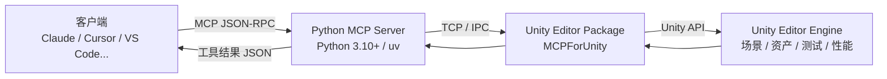

# MCP for Unity 深度拆解：把 Unity Editor 暴露给 AI 编码代理的 MCP 桥接器

**MCP for Unity 解决的问题不是"让 AI 读 Unity 代码"，而是"让 AI 能驱动 Unity Editor 本身"。47 个工具入口把场景、资产、脚本、测试、性能打包成 AI 可调用的能力，AI 写完脚本能自己建对象、挂组件、跑测试。**

在浏览器、Node、Python 项目里，AI 编码代理基本能自主闭环：读代码、改代码、跑测试、删 bug。到了 Unity / Unreal 这类引擎，AI 被锁在"只能读、只能写、不能跑"的状态——它建不了 GameObject、切不了场景、跑不了 Play Mode。原因很简单：引擎的验证环在 Editor 里，不在终端里。MCP for Unity 想要打破的正是这道墙，它把 Unity Editor 的能力切片成 MCP 工具，让任何 MCP 客户端（Claude Desktop、Claude Code、Cursor、VS Code、Windsurf、Cline、Gemini CLI）都能驱动 Unity。

## 目录

- [一、它解决什么问题](#一它解决什么问题)
- [二、架构：Editor 插件 + Python MCP Server](#二架构editor-插件--python-mcp-server)
- [三、一条命令流过四层：以"创建 Cube"为例](#三一条命令流过四层以创建-cube为例)
- [四、47 个工具能力全景](#四47-个工具能力全景)
- [五、配置链路：从安装到第一次对话](#五配置链路从安装到第一次对话)
- [六、版本节奏与迁移](#六版本节奏与迁移)
- [七、学术引用与 Aura 商业化](#七学术引用与-aura-商业化)
- [八、适用边界与限制](#八适用边界与限制)

## 一、它解决什么问题

传统流程里，AI 编码代理（Cline、Cursor、Copilot）进 Unity 项目只做两件事：

1. **读**：扫描 C# 脚本，理解业务逻辑
2. **写**：生成或修改脚本

但游戏开发的"验证"必须在 Editor 里发生：进入/退出 Play Mode、加载场景、物理模拟、UI 渲染。这些不是"写代码"能完成的，Agent 缺的不是理解力而是"手"。MCP for Unity 把两半接起来：

- **Editor 侧**：装一个 Unity Package，让 Editor 暴露一组结构化 MCP 工具（创建/销毁 GameObject、改 Transform、跑测试）
- **客户端侧**：任何 MCP 兼容客户端都能发现这些工具，AI 在自然语言对话里调用它们

效果是：你对 Claude 说"Create a cube at the origin and add a Rigidbody"，Claude 通过 MCP 调用 Unity Editor，几秒后场景里真的出现一个带物理的 Cube。

## 二、架构：Editor 插件 + Python MCP Server

MCP for Unity 的实现拆成两半：Unity 侧和 Python 侧。先看整体链路，再逐层拆。



| 组件 | 形态 | 职责 |
|------|------|------|
| Unity Editor Package | Unity Package（`MCPForUnity/`） | 在 Editor 进程内监听 MCP 请求、执行 Unity API 调用 |
| Python MCP Server | Python 3.10+（依赖 `uv`） | 实现 MCP 协议，桥接客户端与 Editor |

两端通过 Unity 的 TCP/IPC 通道通信（底层基于 Unity Transport Package 或类似机制，README 未公开协议细节）。

### 2.1 依赖栈

- Unity 2021.3 LTS → 6.x（覆盖 Unity 2021 LTS 到 Unity 6 全系列）
- Python 3.10+（安装通过 [uv](https://docs.astral.sh/uv/)）
- 任何 MCP 兼容客户端

### 2.2 安装方式

通过 Unity Package Manager 装：

```
https://github.com/CoplayDev/unity-mcp.git?path=/MCPForUnity#main
```

可以 pin 到具体 tag（如 `#v10.0.0`）锁定版本，也可以走 OpenUPM：

```
openupm add com.coplaydev.unity-mcp
```

### 2.3 多实例路由

`docs/guides/multi-instance` 描述了多 Unity 实例场景下的工具路由。同一台机器同时开多个 Unity Editor 时，MCP 请求按 Project ID 或 Editor PID 路由到正确的实例。

## 三、一条命令流过四层：以"创建 Cube"为例

架构图是静态的，一次真实请求更容易说清楚各层怎么配合。以"Create a cube at the origin and add a Rigidbody"为例，这条命令会走完四层：

1. **客户端层**：Claude 决定需要调用工具 `create_gameobject`（或等价入口），按 MCP 协议发出一个带参数结构（名字、Transform 位置、挂的组件)的 JSON-RPC 请求。这里是 AI 的"决策处"——它要把自然语言翻译成结构化工具调用。
2. **Python Server 层**：Python MCP Server 接收请求，做参数校验与路由。它不清楚 Unity 内部细节，只负责把 MCP 协议翻译成 Editor 能懂的 IPC 消息，并把回传结果再翻译回 MCP JSON。
3. **Editor Package 层**：`MCPForUnity` 包在 Editor 进程内收到 IPC 消息，用 Unity API 执行真实操作——`Object.Instantiate` 建 Cube、`AddComponent<Rigidbody>` 挂物理组件、刷新场景视图。
4. **Unity 引擎层**：物理对象真正出现在场景里。之后 Editor 把操作结果（对象名、是否成功、可能的异常）逐层回传，最终以 JSON 回到 Claude，再由它向你复述结果。

这条链的关键点在第 1 层到第 3 层之间：自然语言在客户端被翻译成结构化调用，在 Editor 被翻译成引擎 API，中间不经过任何"手写脚本"的确认。这就是"AI 写代码 + AI 自己跑"能成立的原因——而传统 Agent 恰恰断在"写完代码没人帮忙跑"这一环。

## 四、47 个工具能力全景

README 写明 "47 focused MCP tool entrypoints"。v10 迁移指南给出了确切的分布：这 47 个入口分属 10 个 Tool Group——`core`、`scripting_ext`、`testing`、`profiling`、`animation`、`vfx`、`ui`、`probuilder`、`asset_gen`、`docs`，其中**非 core 分组默认禁用**，要用 `manage_tools` 显式开启：

| Tool Group | 能力 | 默认状态 |
|------------|------|----------|
| `core` | GameObject 创建/销毁、组件挂载、场景与菜单操作 | 启用 |
| `scripting_ext` | C# 脚本读写、Roslyn 编译验证 | 默认禁用 |
| `testing` | Edit Mode / Play Mode 测试运行 | 默认禁用 |
| `profiling` | 性能分析 | 默认禁用 |
| `animation` | 动画状态机操作 | 默认禁用 |
| `vfx` | 粒子与视觉特效 | 默认禁用 |
| `ui` | Canvas 与 UI 控件 | 默认禁用 |
| `probuilder` | ProBuilder 3D 建模 | 默认禁用 |
| `asset_gen` | AI 资产生成：Tripo/Meshy 生成 3D 模型、fal.ai/OpenRouter 生成图片、导入 Sketchfab 或本地 FBX/OBJ/glTF | 默认禁用 |
| `docs` | 文档查询 | 默认禁用 |

每个工具的输入/输出 schema 都按 MCP 标准暴露，AI 能自动理解参数；确切的工具名与参数以[工具目录页](https://coplaydev.github.io/unity-mcp/reference/tools/)为准。

这套"分组 + 默认禁用"的设计值得注意：v9 时代是 29 个固定工具一揽子暴露，v10 把选择权交回用户——按需开启分组，客户端的工具列表就能保持精简。对上下文窗口有限的本地模型，这个设计比工具数量本身更实际。

### 4.1 Roslyn 脚本验证

官方文档（`docs/guides/roslyn`）提到，AI 写完 C# 脚本后可走 Roslyn 编译器级别的验证，捕获语法错误与部分语义错误。作用是避免 AI 写出"过 30 秒才发现编译不过"的脚本，把编译检查前移到生成时刻。

### 4.2 远程 Server + 鉴权

`docs/guides/remote-server-auth` 描述把 MCP Server 部署到远程机器并加 API Key 鉴权的方案。这让"AI 跑在笔记本、Unity 跑在远程 Windows 构建机"的协作成为可能——Editor 的工作负载与推理客户端解耦。

## 五、配置链路：从安装到第一次对话

README 给的三步走：

1. **Install**：Unity Package Manager 装 MCP for Unity 包
2. **Configure**：菜单 `Window → MCP for Unity → Configure All Detected Clients`，自动扫描已安装的 MCP 客户端并按统一格式写入配置
3. **Prompt**：在客户端对话框输入 "Create a cube at the origin and add a Rigidbody"

第二步是关键。MCP for Unity 会主动探测客户端的配置文件（`claude_desktop_config.json`、Cursor 的 MCP 配置等），把 MCP Server 的命令行注册进去。这种"自动配置所有检测到的客户端"的做法，把最容易劝退新手的环境配置环节压缩成了一步。

## 六、版本节奏与迁移

官方 Release Notes 给出的节奏很密：

- **v9.6.x（2026-04）**：常规迭代（v9.6.6 → v9.6.8）
- **v9.7.x（2026-05 ~ 06）**：Roslyn 验证、多实例路由（v9.7.0 05-22、v9.7.3 06-15）
- **v10.0.0（2026-06-30）**：首次引入 AI 资产生成（asset_gen 工具组），工具入口从 29 个扩到 47 个，工具体系改为分组制
- **v10.1.x / v10.2.x（2026-07 ~ 09）**：资产生成持续扩展（v10.1.0 加入 AI 音频生成），最新为 v10.2.0（09-01）

v10 的迁移指南（`docs/migrations/v10`）没有列 API 层面的破坏性变更清单，但有四条升级注意事项直接踩在日常工作流上：

1. 升级后可能要重新配置 MCP 客户端（传输层或服务器 URL 变化时包内会提示）
2. 非 core 工具组默认禁用，升级完发现"工具变少了"先去开分组
3. asset_gen 的 Provider 密钥改为在 Unity 内配置，存储走操作系统安全存储（macOS 钥匙串、Windows 凭据管理器、Linux libsecret），不再放在 MCP 客户端配置文件里
4. GLB 导入依赖 glTFast 包，缺失时导入会失败

每月 1-2 次 release 的密度意味着：求稳的团队应 pin 到具体 tag（推荐 `#v10.2.0`），而不是长期挂在 `#main` 上。

## 七、学术引用与 Aura 商业化

README 附带了一段 BibTeX 引用：

```bibtex
@inproceedings{wu2025mcpunity,
  author    = {Wu, Shutong and Barnett, Justin P.},
  title     = {{MCP-Unity}: {Protocol-Driven} Framework for Interactive {3D} Authoring},
  year      = {2025},
  isbn      = {9798400721366},
  publisher = {Association for Computing Machinery},
  address   = {New York, NY, USA},
  url       = {https://doi.org/10.1145/3757376.3771417},
  doi       = {10.1145/3757376.3771417},
  series    = {SA Technical Communications '25}
}
```

这是 ACM SIGGRAPH Asia 2025 的论文，作者 Shutong Wu 和 Justin P. Barnett 把 MCP for Unity 作为学术成果发表。SA Technical Communications 是 SIGGRAPH Asia 的技术交流 track，能进这个 track 意味着项目在协议设计层面有一定创新。

### 7.1 Aura 商业化

README 顶部声明项目由 Aura 赞助与维护，Aura 定位是 "the AI assistant for Unreal & Unity"。它同时提供两条产品线：

- **MCP for Unity**：开源 MIT，纯桥接
- **Aura for Unity**：付费，更完整的 Unity/Unreal AI 助手

"先开源工具、再付费产品化"在 MCP 生态里很常见（FastMCP、Cursor 早期都是这条路）。MCP for Unity 本身完全免费 MIT，付费用户买的是 Aura 这个更"产品化"的形态。

## 八、适用边界与限制

| 维度 | 当前能力 | 边界 |
|------|----------|------|
| Unity 版本 | 2021.3 LTS → 6.x | 不支持 Unity 2019 及更早 |
| 引擎 | 仅 Unity | Unreal 没有对应的开源项目（Aura 商业线覆盖）；Godot 另有独立的 [godot-ai](https://github.com/hi-godot/godot-ai) 项目（与本项目无官方关联） |
| 平台 | 全平台（Linux/Mac/Win Editor） | Linux Editor 需要手动配置 |
| MCP 客户端 | 所有兼容 MCP 的客户端 | 客户端需支持官方文档要求的 MCP 协议版本 |
| 远程部署 | 支持，需配置鉴权 | 远程场景下延迟更高 |
| Play Mode 测试 | 支持 | 长任务（>30 秒）可能超时 |

对多数读者，真正需要记住的是边界：MCP 协议版本要求以官方文档为准，不要在老旧客户端上浪费排查时间；长跑测试或大型项目适合走远程部署，且要为自己的使用场景实测超时阈值。

## 总结

MCP for Unity 的真正价值，是把"AI 不能写完代码就跑测试"这道墙推平。适不适合用，按团队看：

**先上**
- Unity 独立开发者：想让 AI 自主生成场景、组件、动画状态机
- 5 人以上 Unity 团队：希望 AI 在 Editor 里做重复劳动（建标准结构、跑测试、查性能），并让 AI 自己验证自己

**可以缓一缓**
- Unity 2019 及更早版本用户
- 想要"开箱即用 SaaS"的非技术用户（仍要自己装 MCP 客户端）
- Unreal 引擎用户（开源桥只有 Unity 版；Godot 用户可直接用独立的 godot-ai 项目）

如果你的工作流是"AI 写代码 + 我手工验证"，MCP for Unity 把它升级成"AI 写代码 + AI 自己跑测试 + 我只审 PR"。对个人开发者的绝对收益有限，对团队才是 Workflow 层面的改进——先把一段最小重复任务（比如"新建场景并放好默认对象"）交给它，验一遍延迟、超时和测试稳定性，再决定要不要铺开。

## 参考资料

- 仓库地址：https://github.com/CoplayDev/unity-mcp
- 官方文档：https://coplaydev.github.io/unity-mcp/
- 工具目录：https://coplaydev.github.io/unity-mcp/reference/tools/
- v10 迁移指南：https://coplaydev.github.io/unity-mcp/migrations/v10
- 多实例路由：https://coplaydev.github.io/unity-mcp/guides/multi-instance
- Release Notes：https://coplaydev.github.io/unity-mcp/releases
- 学术论文：https://doi.org/10.1145/3757376.3771417（ACM SIGGRAPH Asia 2025）
- 商业产品：https://www.tryaura.dev/（Aura）
- Godot MCP 项目（独立）：https://github.com/hi-godot/godot-ai
- 许可证：MIT