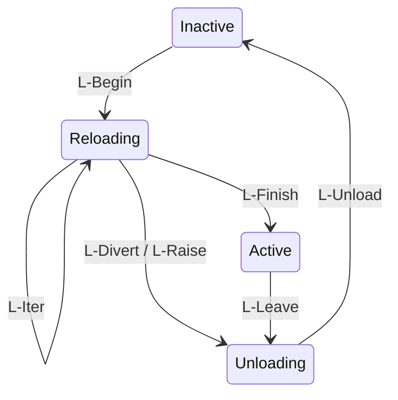

## 这篇文章在回答什么

插件系统里最古老的承诺是「装得上就卸得掉」，最普遍的现实是卸载靠重启。2026-08-13，DeepSeek 与北京大学联合发布 88 页预印本[《A Programming Paradigm for Spatiotemporal Composability》](https://github.com/cordiverse/paper)（时空可组合性编程范式），同一天 DeepSeek 开源了 [DeepSeek Harness（DSH）](https://github.com/deepseek-ai/deepseek-harness)。DSH 主仓 README 开篇原话：「It uses an architecture where everything is a plugin, and is powered by Cordis, whose design is described in A Programming Paradigm for Spatiotemporal Composability.」——但 DSH 的工程文档从不正面解释**为什么**这么设计。这篇论文就是那个「为什么」。

论文的核心主张一句话能讲完：

> 现代软件（从 plugin 系统到 self-evolving agent harnesses）越来越需要**动态组合（dynamic composition）**，但形式化基础一直缺位。问题可以拆成两个正交维度——**temporal composability**（移除组件时 side effects 必须完全可逆）和 **spatial composability**（组件间依赖必须声明式 + 反应式管理）。本文把经典 effect systems 和 coeffect systems 从编译期静态分析抬升为运行时机制，用单一 context type 统一，配套 calculus of dynamic composition 的形式化微积分，并在 metatheory 层证明时空可组合性可以从单个组件扩展到整个系统。

这不是一篇 agent 论文，甚至几乎不谈模型。它是一篇编程语言理论论文：全文 88 页，散布着二十多个定理与证明（发布当日媒体通稿的统计口径），工程实现是 Cordis 元框架。它的贡献分两层：

**理论层**：把经典 effect systems（形式化「计算如何改变环境」，Plotkin & Power 2003 / Plotkin & Pretnar 2009）和 coeffect systems（形式化「计算对环境提出什么要求」，Petricek, Orchard & Mycroft 2014）的「静态 + 词法作用域」模型扩展成「动态 + 运行时」模型。三个关键机制：

- **revertible effects**（§3.1）——每个 context transformation 携带显式 inverse，runtime 自动追踪，组件移除时恢复
- **reactive coeffects**（§3.2）——组件声明依赖规格，context 每次变化按 activating / deactivating / neutral 三态通知
- **unified context type**（§3.3）——效应上下文与共效应上下文统一为单一递归上下文类型，通过共效应上的观测等价性为效应提供独立性保障

**工程层**：Cordis 是这个范式的实例化。core library 提供 effect tracking + coeffect resolution；声明式 component loader 提供 configuration reconciliation + hot module replacement；生产验证案例是 Koishi 聊天机器人框架（4 年迭代、4000+ 社区插件），DSH 则是它在自演化 agent 场景的新实例。

学习目标：读完本文，应该能回答五件事——

1. 为什么 effect systems 和 coeffect systems 的静态模型不够用——它们只在词法作用域上做 compile-time 分析，处理不了运行时动态到达和离开的组件
2. 「side effects 完全可逆」在运行时怎么实现——revertible effect functions + disposable 追踪，以及 LIFO 逆序回收为什么是幺半群结构逼出来的
3. 「依赖声明式 + 反应式」怎么落地——coeffect specification + activating / deactivating / neutral 三态通知
4. calculus of dynamic composition 的 5 条 metatheorem 各证明什么——Preservation / Temporal Composability / Spatial Composability / Progress / Confluence
5. Cordis 实现里 effect tracking、coeffect operations、loader、HMR 的工程细节，以及 DSH 主仓 vendored Cordis 源码如何对应论文概念

## 全景对照：两个维度、一个上下文

进入细节之前先看一张地图。论文的全部内容围绕两个正交维度展开，后面每一节都能在这张表里找到落点：

| 维度 | 回答的问题 | 理论机制 | 论文章节 | Cordis 实现 | DSH 工程落点 |
|---|---|---|---|---|---|
| temporal composability | 我走之后，世界恢复原样了吗 | revertible effects（显式 inverse + 自动追踪） | §3.1 | `ctx.effect()` + disposable 累加器 | plugin 卸载零残留，`agent/pre-step` 监听随装随卸 |
| spatial composability | 我进来之后，需要的东西会自动出现吗 | reactive coeffects（声明式依赖 + 三态通知） | §3.2 | `inject` 声明 + service registry | `ctx.settings` / `ctx.tools` 声明即注入 |
| 两者统一 | 一套类型同时管两个维度 | unified recursive context Γ∞ | §3.3 | 单一 `ctx` 对象 | fiber 树只有一个维度，无 effect-tree / coeffect-tree 分裂 |
| 系统级保证 | 组件交错运行，全局仍然一致 | calculus of dynamic composition + 5 条 metatheorem | §4 | fiber 生命周期状态机 | `packages/core/invariants/` 运行时自检 |

## 背景：从 Koishi 的插件生态到 88 页证明

先交代作者，这篇论文的来历不寻常。

一作 Yifan Shi（网名 Shigma），北京大学与 DeepSeek-AI 双属，是聊天机器人框架 [Koishi](https://koishi.chat/zh-CN/) 的创始人。Koishi 2020 年发布，社区沉淀了 4000 多个插件；Cordis 就是 2022 年从 Koishi 里抽出来的插件微内核，Koishi 至今是它最大的实战验证场。2023 年 Shigma 写过一篇《可逆的插件系统》设计文章，基本是这篇论文的雏形——也就是说，这套理论是从多年插件生态运营里长出来的，再回头补上数学证明。二作 Wei Zhang 来自北京大学，与 Yifan Shi 自 ASE 2021 起有合作；三作 Tianyi Cui 来自 DeepSeek-AI，今年 3 月加入 DeepSeek 带 Harness 团队。

论文 §1 的动机部分给了一组扎心的数据，以 VSCode 插件生态为例：

- 热门插件中 87% 包含可执行代码，卸载时只能重启整个插件宿主进程，丢掉全部运行时状态；即便提供了 deactivate 回调，也只用于进程终止前的优雅关闭，无法保证副作用清理干净
- 热门插件中只有 7% 声明了非内置依赖，跨插件交互没有结构化契约，返回值无类型保障，依赖变化全靠开发者手动处理

现有方案不是没有，但都是粗粒度 workaround：操作系统在进程粒度提供时间可组合性（杀掉进程 = 副作用消失），容器编排在服务粒度提供空间可组合性（服务发现 = 依赖管理）。代价是进程内所有缓存、连接、中间计算结果全部丢弃，重启重建要几秒到几分钟，跨进程通信还引入额外网络开销——和组件本身的粒度严重不匹配。论文要的就是细粒度解：组件级别的装载、卸载、替换，不重启、不丢状态、可证明。

论文的相关工作章节把现有方案逐个摆上台面，每家都缺一角：

| 方案 | temporal 现状 | spatial 现状 | 代价 |
|---|---|---|---|
| VSCode 插件系统 | deactivate 回调只管优雅关闭 | 7% 声明依赖，无类型契约 | 卸载要重启宿主进程 |
| Spring / Guice 依赖注入 | 无运行时生命周期管理 | 只在启动时注入一次 | 运行时依赖变化不反应 |
| Erlang 热升级 / DSU | 手写状态迁移函数 | 不提供 | 只支持版本替换，不能任意卸载 |
| 进程 / 容器编排 | 杀进程 = 副作用消失 | 服务发现 | 丢掉全部进程内状态，秒到分钟级 |
| Cordis | 显式逆操作 + 自动追踪 | 声明式依赖 + 三态通知 | 逆操作要人写（见「边界」） |

这张表就是论文的存在理由：没有一家同时解决两个维度，而细粒度场景下两者都不可缺。

## 两个维度的直觉

论文 §1.1「Dimensions of Composability」把动态组件组合切成两个正交维度。

**Temporal composability**：组件有生命周期——装载、激活、卸载。卸载时所有 side effects 必须完全消失。组件在 `effect()` 里注册了 listener，卸载时必须反注册；组件写了临时文件，卸载时必须删掉（或者显式声明这是泄漏）；组件起了子进程，卸载时必须 kill。任何一条做不到，整个上下文状态就被污染。

**Spatial composability**：组件有依赖——需要其他组件的服务、配置、数据。依赖必须声明式（不直接 import 具体实现）且反应式（依赖变化时本组件能感知）。组件 A 要用 logger，不应该 `import { ConsoleLogger }`，而是声明 `inject: ['logger']` 由 runtime 注入；logger 实现从 ConsoleLogger 换成 OtelLogger，A 自动拿到新实例；logger 被卸载，A 收到「依赖没了」的通知。

这两件事为什么正交？因为它们回答的问题不同：temporal 问「我走了之后世界长什么样」（离场的清理），spatial 问「我进来之后世界长什么样」（入场的依赖）。但它们又互相咬合：一个组件卸载（temporal 事件）会触发依赖它的组件收到通知（spatial 事件）；一个组件注入新服务（spatial 事件）会改变当前激活集合（temporal 状态）。

现有的理论工具各管一半。effect systems 跟踪 effect 的执行，但不管「谁需要我」；coeffect systems 跟踪「我需要谁」，但不管「我离开后世界怎么办」。论文的工作就是把两半合在一起——标题里的 Spatiotemporal Composability 由此而来。

## 可逆效应：把「卸载」写成逆运算

§3 是论文的技术核心。这一节把 §3.1 的形式化讲透，数学骨架其实不复杂。

**效应上下文（Effect Context）**。把上下文 Γ 上的变换写成 (f, g) 对：f 是正向变换，g 是对应的逆变换。两对变换的组合定义为「扭曲组合」：

```text
(f₁, g₁) ∘ (f₂, g₂) := (f₁ ∘ f₂, g₂ ∘ g₁)
```

正向按顺序组合，逆向反序组合。直觉上就是穿袜穿鞋：先穿袜再穿鞋，脱的时候必须先脱鞋再脱袜——论文把这个常识写成了代数。注意这个反序，它是后面一切 LIFO 行为的数学来源。这些变换对构成幺半群 𝔗_Γ（幺半群：带组合运算的集合，任意两次组合的结果仍在集合内），单位元是 (id, id)。

效应上下文定义为 ∂Γ := Γ × (Γ → Γ)，由两部分组成：当前状态 γ，和一个逆操作累加器 φ——所有已执行效应的逆操作的组合。核心操作只有两个：

```text
track(f, g)(γ, φ) = (f(γ), φ ∘ g)     // 执行正向变换，把逆操作追加进累加器
recover(γ, φ)     = (φ(γ), id)        // 应用累加器，恢复到初始状态
```

定理 1（恢复不变性）：只要 g(f(γ)) = γ，就有 recover(track(f,g)(γ,φ)) = recover(γ,φ)。执行一个效应再恢复，得到的状态和执行前完全一致。

**可逆效应函数（Revertible Effect Functions）**。上面的模型里逆操作是固定的，撑不住两类现实场景：逆操作依赖执行时的状态（先读旧值才能恢复），以及需要单独撤销某一个效应。于是论文升了一阶：

```text
𝔈_Γ := Γ → Γ × (Γ → Γ)
```

效应函数接收当前上下文，返回新状态加上本次效应对应的逆操作。带见证的版本 𝔈*_Γ 进一步要求返回的逆操作 g 满足 g(δ) = γ（δ 是执行后状态），保证逆操作精确恢复本次效应。多个可逆效应函数用组合算子 ⋄ 串起来时，逆操作自动按反序组合——又是扭曲幺半群。

**效应独立性（Independence of Effects）**。要支持任意顺序卸载交错运行的多个组件，不同组件的效应必须独立：两者的所有正向、逆变换两两交换，且一方的变换不影响对方返回的逆操作。独立的效应可以按任意顺序撤销，都能正确恢复。

这三段形式化直接解释了 Cordis / DSH 的三个工程决策：

1. **没有隐式 cleanup**。所有 effect 必须显式给出 inverse。这就是为什么 DSH 的 `ctx.effect()` 接受「返回 disposable 的函数」而不是普通 async 函数——返回值本身就是逆操作。
2. **effect stack 是 LIFO**。后注册先反注册。DSH 主仓的 agent-scope plugin 卸载必须严格按注册的逆序进行：先卸子 plugin 再卸父 plugin，否则子 plugin 的 disposable 会在父 plugin 状态已被破坏的前提下执行，回滚不再正确。
3. **dispose 互不干涉**。单个 effect 的 dispose 失败不能级联到其他 effect，这就是为什么 DSH 主仓 `ctx.effect()` 的实现里每个 disposable 都包了 try-catch——一个清理失败不能让整个组件卸载失败。

## 反应性共效应：把「依赖」写成声明

§3.2 处理 spatial 维度。共效应上下文是依赖键到值的有限部分函数：

```text
Σ := (k : K) ⇀ V_k
```

键 k 对应类型 V_k，依赖访问因此是类型安全的。两个基本操作：get(k) 要求键存在；set(k, v) 要求键此前不存在，且它本身就是一个可逆效应函数——逆操作是删除键 k：

```text
set(k, v) = σ ↦ (σ[k ↦ v], λσ′. σ′ ∖ k)
```

这个细节值得停一下：**依赖的注册和注销本身就是效应**，自动被效应系统追踪和恢复。这是全篇最深的伏笔——temporal 和 spatial 不是两套机制拼起来的，spatial 的每一次依赖变更本来就是一种 temporal 事件，两个维度的统一只需要做一次。

组件通过共效应规范（specification）声明需要的依赖集合 d ⊆ K，系统按「所有键都在 dom(σ) 里」判断满足：σ ⊨ d。上下文从 σ 变到 σ′ 时，对每个组件的规范做一次通知分类：

```text
notify_d(σ, σ′) = activating    若 σ ⊭ d 且 σ′ ⊨ d     // 依赖从不满足变为满足
                  deactivating  若 σ ⊨ d 且 σ′ ⊭ d     // 依赖从满足变为不满足
                  neutral       其他                    // 变化与我不相干
```

激活通知触发组件加载并执行效应，失活通知触发组件卸载并恢复效应，中性通知不处理。三态划分看似朴素，关键在它把「依赖变化」变成了可枚举、可证明的离散事件，而不是靠组件自己轮询。

**隔离与拦截（Isolation and Interception）**。§3.2.3 给了两个扩展机制。隔离引入 realm（领域）：同一个逻辑依赖键在不同上下文中解析到不同领域，绑定不同的值，适用于多租户、测试环境、组件沙箱。DSH 的 agent live registry 就是用隔离把「agent A 的工具集」和「agent B 的工具集」分开——同一个 `ctx.tools` 键在不同 agent scope 指向不同的 service 实现。拦截则给依赖访问附加元数据：元数据可由上下文携带或组件声明，访问时合并后传给依赖提供者，实现权限控制、访问审计这类横切功能，不用改组件或依赖的代码。DSH 主仓 `cordis.patch.yml` 的 patch 语义就是拦截——按 row id 定位 service，替换或叠加 config。

## 统一上下文：一棵树管两个维度

§3.3 是论文形式化的收束：把效应上下文和共效应上下文统一成单一的递归上下文类型：

```text
Γ∞ := μΓ. Γ × (Γ → Γ) × Σ
```

每一层包含三件东西：递归的上下文状态 Γ、本层的逆操作累加器 Γ → Γ、共效应上下文 Σ。μΓ 是递归类型的不动点记号：上下文的定义里嵌套着上下文本身，嵌套多深由 fiber 树的深度决定。递归结构支持层级组合：父上下文聚合多个子上下文的效应，形成树状控制结构，每个组件对应树上的一个节点，独立装载、独立卸载。

统一之后的关键一步是**观测等价（observational equivalence）**。理论模型里的「状态恢复」是理想要求，工程上不需要物理状态完全一致，只需要观测上不可区分——内存分配不必恢复到原来的地址，只要后续操作分不出差别。两个共效应上下文等价，当且仅当键域相同且每个键的值在该键的等价关系下等价；两个上下文等价，当且仅当它们的共效应投影等价。

观测等价让「observational equivalence on coeffects supplies effects with independence」这句论文摘要里的话落地：如果两个组件的效应操作不同的共效应键，它们天然满足独立性，可以单独测试任一组件的 dispose 序列，不用管 coeffect 变化怎么触发它。§3.3.3「Situating the Context Paradigm」把这个 unified context 与 effect system、coeffect system、actor model、reactive programming、capability system 逐一对照，给出的定位是：第一个把 effect 和 coeffect 同时作为 runtime 一等公民的元框架。

## 动态组合演算：fiber 的一生

§4 把 §3 的机制整合成组件模型，给出动态组合的操作语义。三个基本概念：

- **组件（Component）**：三元组 (d, p, e)——共效应规范 d（需要什么）、提供键集合 p（能提供什么）、带见证的可逆效应函数 e（激活时执行的逻辑）
- **纤维（Fiber）**：组件的运行时实例，携带组件定义、父纤维指针、自己的共效应表、退休标记和生命周期状态（非活跃 / 加载中 / 活跃 / 卸载中）
- **注册中心（Registry）**：所有纤维的注册表，共效应上下文由全部活跃纤维提供的键联合生成

操作语义分两组规则。编排规则由编排者（orchestrator）触发：

| 规则 | 作用 | 前提 |
|---|---|---|
| O-Insert | 插入新组件实例 | 名称未被占用，父纤维存在，提供键不冲突 |
| O-Retire | 标记纤维退休 | 纤维存在 |
| O-Remove | 移除退休且非活跃、无子纤维的纤维 | 已退休、非活跃、无子女 |

生命周期规则由系统自动触发：

| 规则 | 作用 |
|---|---|
| L-Begin | 纤维非活跃且依赖满足（目标视图非空），开始加载 |
| L-Iter | 加载中执行效应的下一个迭代 |
| L-Finish | 所有效应迭代完成，进入活跃 |
| L-Divert | 加载过程中依赖视图变化，转入卸载 |
| L-Raise | 加载过程中效应抛错，转入卸载 |
| L-Leave | 活跃纤维的依赖视图变化，转入卸载中 |
| L-Unload | 执行全部逆操作，回到非活跃 |

七个规则听起来多，其实就是四个状态之间的转换（对应论文 Figure 2）：



关键在两条「岔路」：加载中依赖变了（L-Divert）或抛错了（L-Raise），纤维不会带病进入 Active，而是直接转入卸载。

在这个基础演算之上，论文再逐一处理四类现实复杂性：**Withdrawal**——组件主动或被动卸载，所有 effect dispose、依赖方收到 deactivating；**Iteration**——同一组件反复装载卸载，这是 HMR 的理论基础；**Asynchrony**——涉及 IO 的 effect / coeffect 操作是异步的，transition 不会立即完成；**Failure**——装载或运行失败时，runtime 处理失败并保持 context 一致性。

然后是论文的 metatheory 核心，5 条定理：

| 定理 | 证明内容 | 工程含义 |
|---|---|---|
| **Preservation** | 所有规则保持注册表良构（父指针合法、提供键不冲突、已安装组件的依赖提供者都已安装） | runtime 不会进入非法状态 |
| **Temporal Composability** | 组件卸载时，累加的逆操作精确撤回其全部效应，不影响其他组件，无论效应如何交错 | 我走之后，世界恢复 |
| **Spatial Composability** | 组件仅在依赖全部满足时开始加载；提供者生命周期长于所有消费者（先启动、最后退出）；加载过程中依赖解析一致，不会半新半旧 | 我进来后，自动获得我需要的世界 |
| **Progress** | 系统不会死锁，最终一定到达静止状态 | runtime 总会推进 |
| **Confluence** | 无论装载卸载的调度顺序如何，最终静止状态与静态组装所有活跃组件的结果一致 | 并发插件操作是确定的 |

5 条合起来就是标题的承诺：时空可组合性从单个组件扩展到整个系统。Spatial Composability 里「提供者先启动、等所有消费者卸载后再退出」这条尤其值钱——它把插件系统里最常见的竞态（依赖方还在用，提供方先没了）直接排除在合法执行之外。Confluence 的价值在工程上更隐蔽：最终状态与调度顺序无关，意味着并发装载卸载不用靠测试碰顺序——任何交错都收敛到「把所有活跃组件静态组装」的那一个状态，线上事故因此可复现、可推理。

工程视角的呼应：DSH 主仓的 `packages/core/invariants/` 是 runtime 对部分定理的自检实现，`InvariantInstaller` 在运行时跑断言，违反即抛错。

## 一次任务流过系统：卸载一个 plugin 会发生什么

论文 §1.2 把 self-evolving agent harness 列为动态可组合性要求最高的场景，原文值得直接读：

> A self-evolving agent harness allows an agent to inspect, mount, and unmount its own plugins at runtime. Such harnesses are particularly demanding for dynamic composability: the set of capabilities an agent exposes to its model changes during execution, while the runtime is expected to remain in a coherent state.

译：「自演化 agent harness 让 agent 在运行时检查、装载、卸载它自己的 plugin。这类 harness 对动态可组合性的要求最高：agent 暴露给模型的能力集合在执行期间持续变化，而 runtime 必须保持连贯状态。」

下面构造一个最小场景把规则走一遍（`weather-tool` 是构造的示例插件，流程按论文规则推演，不是某次真实运行的 trace）。设 agent 正在运行，model 依赖工具插件 `weather-tool`（提供键 `weather`），agent-loop 通过 `inject: ['weather']` 消费它。agent 决定卸载 `weather-tool`：

1. 编排者执行 **O-Retire**，`weather-tool` 纤维被标记退休，refresh 重算目标视图，纤维从 Active 转入 Unloading（**L-Leave**）
2. dispose 累加器按 LIFO 逆序执行：先反注册 `agent/pre-step` 监听，再关闭缓存句柄，最后清理临时资源——每一步都是独立的 disposable，单步失败被 try-catch 拦住，不级联
3. 注册中心重算共效应上下文：`weather` 键从 Σ 中消失
4. notify 扫描所有组件的规范：agent-loop 声明了 `inject: ['weather']`，σ ⊨ d 变为 σ ⊭ d，收到 **deactivating** 通知，随之进入自己的卸载或降级流程
5. **L-Unload** 的守卫生效：`weather-tool` 作为提供者，要等所有依赖它的消费者处理完才真正退出——提供者后于消费者离场，这是 Spatial Composability 定理在代码里的样子
6. 纤维非活跃、无子女后，**O-Remove** 把它从注册表移除，uid 清空；Preservation 保证此刻注册表仍然良构

整个过程没有重启进程，其他会话状态原封不动，下一个 turn 照常开始。装载是对称的：O-Insert 之后纤维不会立刻加载，只有依赖全部满足（σ ⊨ d）才触发 L-Begin；加载到一半依赖变了走 L-Divert 转入卸载，效应抛错走 L-Raise——半途而废的组件永远到不了 Active，不存在「装了一半」的状态。

## 实现：理论到代码的对应

§5 把形式化模型实现为 Cordis。论文 Table 2 给出了理论与实现的完整对应，挑主干列在这里：

| 理论概念 | Cordis 实现 |
|---|---|
| Γ∞ 统一上下文 | `ctx`，一等上下文对象 |
| 可逆效应函数 𝔈_Γ / 𝔈*_Γ | 效应回调，返回或产出逆操作 |
| effect_Γ(e) | `ctx.effect(callback)` |
| Σ / Σ_iso / Σ_inter | `ctx[@@store]` / `ctx[@@isolate]` / `ctx[@@intercept]` |
| get(k) / set(k, v) | `ctx.get(key)` / `ctx.set(key, value)` |

生命周期与规则侧的对应：

| 理论概念 | Cordis 实现 |
|---|---|
| 组件 ⟨d, p, e, …⟩ | fiber，组件的运行时实例 |
| 生命周期状态 θ | `fiber.state`（LOADING 对应 Reloading，FAILED 对应带错误的 Inactive） |
| recover 累加器 | `fiber.dispose` |
| d（依赖规范）/ e（效应函数） | `fiber.inject` / `fiber.apply` |
| O-Insert / O-Retire | `ctx.use` 及其回调的逆 |
| L-Begin / L-Iter / L-Finish | execute 的迭代循环 |
| L-Leave / L-Unload | refresh 标记纤维为 UNLOADING；unload 及其惯性（inertia）链式处理 |

实现分三层：核心库负责 effect tracking、coeffect 操作、组件生命周期；组件加载器负责声明式配置、configuration reconciliation、HMR；应用框架层基于 Cordis 构建领域功能，Koishi 和 DSH 都属于这一层。

核心库内部是 `FiberState` 状态机加 `DisposableList` LIFO 栈：`packages/core/src/fiber.ts` 是整个框架的心脏，effect stack + lifecycle state machine 两件事撑起 §3.1 的全部语义。coeffect 侧是 `ctx.isolate(name, label?)` / `ctx.intercept(name, config)` 加 service registry 三件套：RegistryService（注册表）、ReflectService（Proxy 反射 + service store 路径解析）、EventsService（typed events + 四种 dispatch mode）。

§5.2 的 declarative component loader 从 `cordis.yml` 读入 plugin 树，解析 `!!js` 表达式，做 configuration reconciliation（按 id patch），再 apply 到空 context。DSH 主仓的 `cordis.patch.yml` 工作流就是这条链。§5.3 是 HMR：监听文件变化，卸载旧 fiber，装载新 fiber，effect 重新 reconcile，coeffect 重新满足——开发体验因此变成「改 plugin 源码，runtime 自动 reload，会话状态不丢」。

生产验证案例是 Koishi。按论文案例章节的说法：4 年开发，4000+ 社区插件，覆盖 IM 适配器、数据库驱动、管理控制台等场景，服务器端机器人和浏览器端 Web 控制台是两个独立的 Cordis 应用，共享同一套动态组合语义。这个案例验证了三件事：元框架的通用性（不绑定业务场景）、时间可组合性（热卸载不重启、HMR 保留缓存和长连接）、空间可组合性（跨独立开发者的插件能声明和解析依赖，依赖变化自动触发重加载）。

## 工程取舍：哪些决策是钉死的

**Effect 必须有显式 disposable**。论文 §3.1 加上 Cordis 源码里 `Service[symbols.init]?.()` 的强制约定——没有隐式 cleanup。runtime 在组件卸载时不依赖任何外部状态，所有清理路径都已注册。这是 DSH 主仓 `packages/core/invariants/` 能做 invariant assertion 的前提：effect 系统的 spec 是形式化的，断言才有对象。

**Coeffect 是声明式的**。coeffect spec 通过 zod / schemastery 这类 schema 定义，runtime 自动 reconcile，不接受 free-form 的运行时数据。所以 DSH 主仓 `ctx.settings.register(NS, AtFileSettingsSchema)` 必须配 schema。

**Unified context type**。effect 和 coeffect 共享同一个 Context 对象（`Context[symbols.isolate]` + `Context[symbols.intercept]`），fiber 树管理只有一个维度。如果 effect 和 coeffect 各自一棵树，装载卸载就要协调两棵树的一致性——单一上下文把这类问题在类型层面消灭了。

**Declarative component loader**。plugin 配置写在 `cordis.yml` 里声明，runtime 装配。plugin 作者不写 boot 顺序，`inject: ['logger', 'config']` 就够了。落到 plugin 代码，组件的骨架就两件事（示意，API 形状以 Cordis 源码为准）：

```ts
// d：声明我需要谁（共效应规范）
export const inject = ['logger', 'config']

// e：激活时做什么——返回的函数就是逆变换
export function apply(ctx: Context) {
  return ctx.effect(() => {
    const sub = subscribe(ctx)          // 正向变换：改变上下文
    return () => sub.dispose()          // 逆变换：卸载时自动执行
  })
}
```

**HMR 不丢状态**。热重载时 effect stack 重新 reconcile，coeffect 重新满足，用户态会话状态保留。

还有一条元决策：这篇论文是 preprint（draft 2026-08-13），首页明确写着「content may change substantially; please cite the latest version」；DSH 主仓 AGENTS.md 也有同款表述「Remove this section at the first tagged release」。两边同一条原则：地基正确优先于兼容性垫片。

## 边界：论文自己承认做不到的事

**系统边界外的效应不可回滚**。可逆性的适用范围由系统边界决定：内存状态、进程内资源、临时文件这类系统能独占修改的位置，可以自动追踪回滚；已经发出的网络数据包、已经写入持久存储的用户可见数据，收不回来，只能用提交前 withhold、补偿操作等方式处理。任何宣称「副作用完全可逆」的系统都要先回答边界画在哪，这篇论文回答了。

**依赖循环永不激活**。相互依赖的组件永远无法满足对方的规范，只能拆成更细粒度的组件消除循环——组件数量增加，认知负担也增加。

**依赖匹配只按键名**。当前不处理接口漂移、键名冲突，没有版本和类型兼容性检查，论文把结构子类型、语义版本检查列进了 future work。

**逆操作要人写**。原子效应的 inverse 必须由开发者提供，这是范式的入场费。论文也承认这条对开发者有要求，并展望编译器插桩、操作系统资源追踪自动生成常见操作的逆操作。

**静态类型保证消失**。把 effect / coeffect 从 compile-time 抬升到 runtime，意味着「这个函数会做文件 IO」不再是 type-level fact，而是 runtime 的 disposable chain。这和 OCaml / Koka / Eff 的路线是相反的——后者要静态保证，Cordis 要动态可组合，两者服务不同场景（见下文维护指引）。

**跨进程没有现成解**。fiber tree 是单进程内的树，跨进程 reconciling effect / coeffect 需要分布式协议层。另外 §4 的 5 条 metatheorem 证明的是 correctness 不是 complexity：一个 O(n²) 的 lifecycle 操作在 worst case 合法，只是实际不可用。

## 这件事为什么重要

动态可组合性长期是经验工程：plugin 装卸不漏状态，靠的是作者仔细、测试碰巧覆盖到了。这篇论文把它换成了另一种东西——整个系统的 effect 可逆性和 coeffect 反应性可以形式化证明，工程层的验证从「跑测试祈祷」变成「runtime invariant assertion」。DSH 主仓 `packages/core/invariants/` 那个几乎空的不变式文件本身就是一句声明：这个包不需要事件流断言，因为 5 条 metatheorem 由 effect + coeffect 系统在结构上保证。把「怎么验证 plugin 系统的正确性」从经验问题变成结构问题，是这篇论文在工程层最值钱的副产品。

收益三条：副作用可逆性有证明，不用经验测试覆盖所有 path；依赖声明是声明式加反应式的，不用手动 wire；unified context 让 fiber 树只有一个维度。

代价也摆在台面上：runtime 机制比 compile-time 类型检查贵，每次 effect 操作都要进 disposable stack；coeffect spec 写得对不对，runtime 事先不知道；跨进程动态组合还没有解。「工程取舍」一节列的五个决策，每一个都是这个范式的承重钉，缺一颗就会分别退化成：plugin 卸不干净、依赖不自动满足、fiber 树失控、配置硬编码、改源码要重启。

## 反写矩阵：四篇文章的共同地基

这篇论文是本系列「DSH 反写矩阵」的学术根。之前四篇文章拆解的对象都在用 Cordis 范式，但都没解释为什么这么设计：

| 文章 | Cordis 范式落点 |
|---|---|
| [dsh-at-file 深度解析](/posts/ai-coding/dsh-at-file-deepseek-harness-at-file-mentions/) | `ctx.effect()` 注册 `agent/pre-step` 监听（revertible effect）+ `ctx.settings` coeffect 声明（reactive coeffect）+ `at-file-mention` source declaration（spatial composability 的 spec） |
| [dsh-genui 深度解析](/posts/ai-coding/dsh-genui-deepseek-harness-genui-fence-architecture/) | `ctx.tools` 注册 `render_ui` tool（coeffect spec）+ `ctx.effect()` 注册 panel 状态管理（revertible effect）+ local-first 原则是 temporal composability 的工程表达 |
| [Model Discovery Agent 解读（arXiv 2608.09696）](/posts/tech/arxiv-2608-09696-model-discovery-agent-murphy-llm-bayesian/) | Murphy MDA 隐式同构：design step 的 VoI 对应 spatial 维度的依赖编排，execute experiment 的 retract 对应 temporal 维度的可逆回滚——论文没提它，但范式形状一致 |
| [DeepSeek Harness 主仓深度解析](/posts/tech/deepseek-harness-everything-is-a-plugin-cordis-architecture/) | 整套主仓就是 Cordis 的 vendored 实例：`packages/core/session` 用 append-only log 实现「Model-visible means logged」，`packages/core/agent` 用 `agent/*` events 实现 coeffect notification |

四篇加起来正好覆盖论文的四个核心机制：revertible effects、reactive coeffects、unified context、calculus of dynamic composition。本文是这个矩阵的理论顶层——读完再回头看四篇，每个 `ctx.effect()` / `ctx.on()` / `ctx.tools` 调用都能对回 §3 的哪条机制。

## 怎么读这篇论文：分角色的阅读路径

88 页不好啃，不同角色的读法不一样：

- **PL 研究者**：§1.3 相关工作定位 → §3 三个形式化（重点看 §3.3 统一上下文与观测等价）→ §4 演算与 5 条 metatheorem 的证明。跳过 §5 实现
- **framework 工程师**：§1 动机 → §3.1 / §3.2 的机制直觉 → §5 实现与 Table 2 对应表，然后直接读 Cordis 源码，从 `packages/core/src/fiber.ts` 的状态机开始
- **plugin 作者 / DSH 用户**：读本文和 [DSH 主仓解析](/posts/tech/deepseek-harness-everything-is-a-plugin-cordis-architecture/) 就够，论文按需查 §3.2 的 notification 语义

进阶路径按顺序：DSH 仓库内 `docs/cordis-primer.md`（官方导读）→ `docs/cordis-tutorial/` 16 篇教程 → [Koishi 文档](https://koishi.chat/zh-CN/) 看最大规模的实战形态 → 想补理论源头再读 Plotkin & Power 2003（algebraic effects）、Plotkin & Pretnar 2009（handlers）、Petricek & Orchard 2014（coeffect calculus）。

## 自测与练习

自测题，检验是否读懂了机制而不是记住了名词（每题后标注了对应章节，卡住时回看）：

1. 为什么 disposable 必须按 LIFO 逆序执行？用扭曲幺半群的定义 (f₁,g₁)∘(f₂,g₂) = (f₁∘f₂, g₂∘g₁) 解释。（对应「可逆效应」一节）
2. `set(k, v)` 为什么本身是一个可逆效应函数？这个设计让哪两个维度的机制开始咬合？（对应「反应性共效应」一节）
3. 一个组件的依赖从满足变为不满足，它收到哪种通知？从收到通知到完全离场，会经过哪几条 L 规则？（对应「动态组合演算」与状态图）
4. 「提供者生命周期长于所有消费者」排除了插件系统里的哪类竞态？它是哪条 metatheorem 的推论？（对应 5 条定理表）
5. 为什么 HMR 在理论上是 Iteration 规则的直接应用，而不需要新机制？（对应四类现实复杂性中的 Iteration）

练习：

1. 跑 `npx @deepseek-ai/dsh web` 起一个 DSH 实例（或装一个 Koishi 实例），运行时卸载一个插件，观察哪些资源被回收；对照本文的卸载流程案例，逐步确认 L-Leave → dispose → notify → O-Remove 的顺序。
2. 打开 DSH 主仓 vendored 的 `vendor/cordis/packages/core/src/fiber.ts`，对照本文的 Table 2 对应表，找到 `fiber.state`、`fiber.dispose`、`fiber.inject` 各自的实现位置。
3. 排查练习：故意写一个 disposable 里抛错的 effect，观察单个 dispose 失败时其他 effect 是否仍被回收——验证独立性在实现层的兜底方式。

## 常见问题

**Q：Cordis 和 Koishi 是什么关系？**
Cordis 2022 年从 Koishi 中抽离，两者作者都是 Shigma。Koishi 是基于 Cordis 构建的聊天机器人框架，也是论文的生产验证案例；Cordis 是语言无关的元框架，不绑定任何业务场景。

**Q：和 Spring / Guice 这类依赖注入框架有什么区别？**
DI 框架只在初始化时完成注入，运行时依赖变化不会自动更新，也没有生命周期管理。Cordis 的 coeffect 是反应式的：依赖出现、消失、替换都会触发组件的生命周期转换，且装载和卸载都有形式化保证。

**Q：比 VSCode 的插件系统强在哪？**
VSCode 卸载插件要重启宿主进程，deactivate 回调只保证优雅关闭；依赖声明在热门插件里使用率只有 7%。Cordis 的卸载是 fiber 级的逆操作回放，不重启、不丢其他状态，依赖是强制声明的 inject 规范。

**Q：preprint 能引用吗？**
能，但要带版本和检索日期。论文首页自己提醒 content may change substantially。建议格式：Shi, Zhang, Cui. *A Programming Paradigm for Spatiotemporal Composability*. Draft of August 13, 2026. https://github.com/cordiverse/paper （检索日期填引用当天）

**Q：想在生产里依赖 Cordis，现在合适吗？**
先看再用。Cordis README 明说 API 尚未稳定、may change without notice；DSH 自己的 README 也标注 developer preview、「THERE WILL BE COMPATIBILITY-BREAKING CHANGES」。DSH 的做法是 vendoring 进自己的仓库并锁定版本，不依赖外部 registry。做平台可以跟进，做产品依赖等第一个 tagged release。

## 维护指引

**和 Koishi cordis 的关系**。早期草稿曾写「Cordis paper 没有明说和 Koishi 的关系」，这是误读，已修正：论文 §5.2 明确以 Koishi 为生产验证案例（两者作者同为 Shigma，Cordis 2022 年从 Koishi 抽离）。区别在定位：Koishi 是生态应用（聊天机器人平台），Cordis 是范式实例化（meta-framework）。DSH 用 Cordis 是因为它在 Node 生态独立可嵌，`packages/core/` 全部 `import from '@deepseek-ai/cordis'`。

**和静态 effect / coeffect 系统的关系**。论文 §1.3 与 §3.3.3 的定位是继承而非替代：compile-time 静态分析（OCaml / Koka / Eff）做 type-level guarantee，适合编译期就知道所有 effect 的纯函数式语言；runtime 动态机制（Cordis）做 dynamic composability，适合运行时装卸 plugin 的应用框架。

**Metatheorem 在工程层的验证**。DSH 主仓 `packages/core/invariants/` 的空不变式文件是一条声明而非遗漏：时空可组合性由 effect + coeffect 系统结构性保证，不需要事件流断言。后续若新增 invariant 断言，先确认它是否真的无法由 5 条 metatheorem 覆盖。

**和 DSH 主仓 vendored Cordis 的关系**。DSH 主仓 `vendor/cordis/` 是源码级 vendored 版本，所有 DSH 包把 `@deepseek-ai/cordis` 列为 peerDependency。vendoring 让框架依赖跟着仓库走，不依赖外部 npm registry 的可用性；代价是升级 vendored package 时 PR 体积大。

**理论 vs 源码**。论文是理论（5 条 metatheorem 的形式化证明），Cordis 源码是工程（core + hmr + loader + group + include + utils + logger-console + timer + create 共 9 个 packages）。PL 研究者读论文，framework 工程师读源码，两边对照 Table 2 互相印证。

**对比 DSH 主仓的扩展点**。architecture.md 的「Where new behavior goes」给出 18 个扩展点，每一个都是 Cordis 范式的工程映射：`ctx.tools`（coeffect spec）、`ctx.effect()`（revertible effect）、`ctx.agents.isolate`（spatial composability）、`cordis.patch.yml`（declarative loader）。读论文后回看那张表，能指出每行挂在 §3 / §4 的哪条机制上。

**Future work**。论文给出的方向有三条：语言与操作系统协同设计（原生支持上下文范式的一等公民、自动推导逆操作、操作系统级资源追踪回滚）、自演化智能体框架应用（agent 生成的插件可安全卸载、自我修改出错可安全回滚）、依赖版本与类型系统增强（结构类型、语义版本检查）。跨进程时空可组合性、probabilistic coeffects 目前是本文作者的推测方向，论文未列入。

## 参考

- Shi, Y., Zhang, W., Cui, T. *A Programming Paradigm for Spatiotemporal Composability*. Draft of August 13, 2026. https://github.com/cordiverse/paper
- Cordis 仓库：https://github.com/cordiverse/cordis （Meta-Framework of Spatiotemporal Composability）
- DeepSeek Harness：https://github.com/deepseek-ai/deepseek-harness
- Koishi 聊天机器人框架：https://koishi.chat/zh-CN/
- Plotkin, G., Power, J. *Algebraic Operations and Generic Effects*. 2003
- Plotkin, G., Pretnar, M. *Handlers of Algebraic Effects*. 2009
- Petricek, T., Orchard, D., Mycroft, A. *Coeffects: Unified Static Analysis of Context-Dependence*. 2014
- 本系列：[DeepSeek Harness 主仓深度解析](/posts/tech/deepseek-harness-everything-is-a-plugin-cordis-architecture/) / [dsh-at-file 解析](/posts/ai-coding/dsh-at-file-deepseek-harness-at-file-mentions/) / [dsh-genui 解析](/posts/ai-coding/dsh-genui-deepseek-harness-genui-fence-architecture/) / [Model Discovery Agent 解读](/posts/tech/arxiv-2608-09696-model-discovery-agent-murphy-llm-bayesian/)
