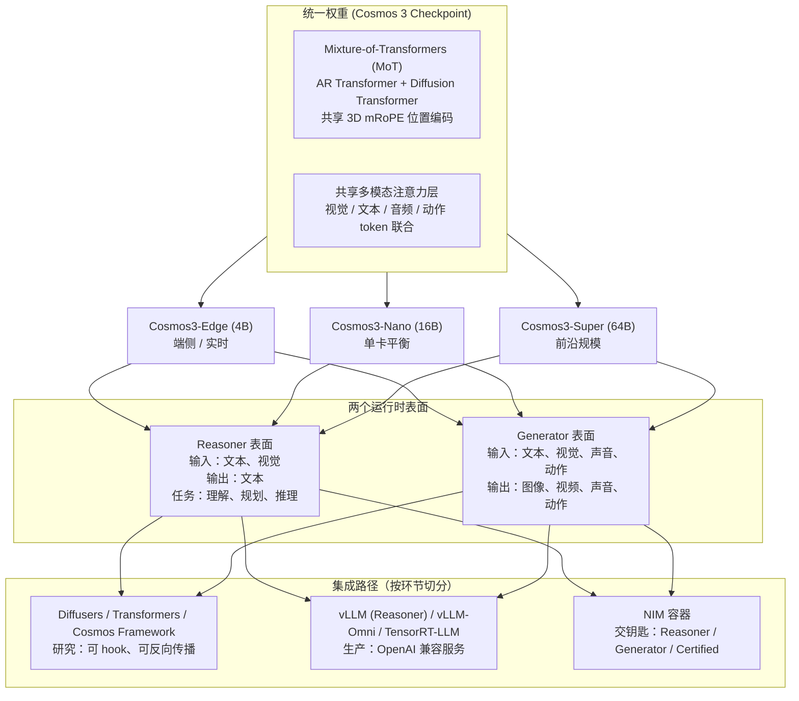

NVIDIA Cosmos（[github.com/NVIDIA/cosmos](https://github.com/NVIDIA/cosmos)）是 NVIDIA 的 Physical AI 开放平台，Cosmos 3 模型族于 2026 年 5 月发布，仓库目前约 12,000 颗星，源码和权重都走 OpenMDW-1.1 许可（GitHub API 2026-10-03 核实，stars 波动以仓库实时为准）。如果只把 Cosmos 当成"另一个视频生成模型"来看，会丢掉它真正想解决的问题——这件事既不是 Sora 那种纯文生视频，也不是 Qwen-VL 那种纯视觉理解，而是把"理解世界"和"生成世界"塞进**同一套 transformer 权重**，由同一组多模态注意力层和统一的 3D mRoPE 位置编码承载。

本文回答的不是"Cosmos 3 能做什么"（README 里有完整 feature list），而是三个工程问题：

- 统一的 Mixture-of-Transformers（MoT）架构到底统一了什么、又把什么留作两路分支
- 同一个权重如何向上暴露成 Reasoner 和 Generator 两个完全不同的运行时表面
- 从 Diffusers 到 NIM 的多种集成路径是按什么维度切分的，各自卡在哪个环节

---

## 一句话判断

Cosmos 3 的核心不是"更大的视频模型"，而是**同一组权重同时跑两种 attention 模式**：

- **Reasoner 模式**：自回归 causal self-attention，next-token prediction，负责理解、推理、规划、动作预测
- **Generator 模式**：full attention + diffusion，对噪声化的图像/视频/音频/动作 token 做去噪，联合多模态输出

两种模式共享 transformer 架构、多模态注意力层和 mRoPE 位置编码。区别只在于 attention mask（causal vs full）和 token 化方式（离散语言 token vs 连续扩散 token）。这是它能同时承担世界理解、世界生成、动作预测的物理基础。

## 系统地图：统一架构，三档模型，多条集成路径

```mermaid
flowchart TB
  subgraph Weights["统一权重 (Cosmos 3 Checkpoint)"]
    MoT["Mixture-of-Transformers (MoT)<br/>AR Transformer + Diffusion Transformer<br/>共享 3D mRoPE 位置编码"]
    SharedMM["共享多模态注意力层<br/>视觉 / 文本 / 音频 / 动作 token 联合"]
  end

  Weights --> Edge["Cosmos3-Edge (4B)<br/>端侧 / 实时"]
  Weights --> Nano["Cosmos3-Nano (16B)<br/>单卡平衡"]
  Weights --> Super["Cosmos3-Super (64B)<br/>前沿规模"]

  subgraph Surfaces["两个运行时表面"]
    Reasoner["Reasoner 表面<br/>输入：文本、视觉<br/>输出：文本<br/>任务：理解、规划、推理"]
    Generator["Generator 表面<br/>输入：文本、视觉、声音、动作<br/>输出：图像、视频、声音、动作"]
  end

  Edge --> Reasoner
  Edge --> Generator
  Nano --> Reasoner
  Nano --> Generator
  Super --> Reasoner
  Super --> Generator

  subgraph Deploy["集成路径（按环节切分）"]
    Py["Diffusers / Transformers / Cosmos Framework<br/>研究：可 hook、可反向传播"]
    Serve["vLLM (Reasoner) / vLLM-Omni / TensorRT-LLM<br/>生产：OpenAI 兼容服务"]
    NIM["NIM 容器<br/>交钥匙：Reasoner / Generator / Certified"]
  end

  Reasoner --> Py
  Generator --> Py
  Reasoner --> Serve
  Generator --> Serve
  Reasoner --> NIM
  Generator --> NIM
```

| 维度 | Reasoner | Generator |
|------|----------|-----------|
| 输入 | 文本、图像、视频 | 文本、图像、视频、声音、动作 |
| 输出 | 文本 | 图像、视频（MP4）、声音（MP4 内 AAC 立体声 48 kHz）、动作（JSON） |
| 注意力 | Causal self-attention（AR） | Full attention + diffusion 步进 |
| 研究（Python） | Transformers（v5.11.0 起） | Diffusers、Cosmos Framework |
| 生产（服务） | vLLM、TensorRT-LLM、NIM | vLLM-Omni、TensorRT-LLM、NIM |
| 代表任务 | Caption、时序定位、2D grounding、动作 CoT、situation understanding | T2V、I2V、V2V（transfer/predict）、V2V+Sound、policy、forward dynamics、inverse dynamics |

## MoT 架构到底统一了什么

Cosmos 3 的 MoT 不是简单的"两套模型拼起来"。它真正统一的是三件事：

1. **Transformer 主干**：同一组参数同时承担 AR 推理和 diffusion 去噪。Reasoner 模式走 causal mask，Generator 模式走 full attention 加扩散步进
2. **多模态注意力层**：视觉 token、文本 token、音频 token、动作 token 走同一套 attention 层，而不是各模态各一个 encoder
3. **3D mRoPE 位置编码**：把空间（高/宽）和时间（帧/采样点）维度统一编码到位置表示里，让模型能对图像、视频、音频流、动作轨迹做一致的位置推理

这套设计的工程含义是：模型不是"先看视频再生成视频"的串联，而是一次训练出来的权重同时具备**感知**和**想象**两种能力。下游任务可以混着用——比如先让 Reasoner 给一段机器人视频做时序定位，输出"第 3.2 秒抓取物体"，再让 Generator 从这一刻往后做 forward dynamics 滚动出未来帧。两步用同一组权重，不需要外挂一个 video VLM。

## 模型族：三档基础模型，示例 checkpoint 不算产品

按仓库当前的说法（`docs/reference/models.md`），**产品线只有三个基础模型**：

| 模型 | 参数量 | 跑在哪 | 定位 |
|------|--------|--------|------|
| Cosmos3-Edge | 4B | Jetson AGX Orin / Thor / RTX Pro 6000 | 端侧、实时部署；机器人 policy 和视觉推理 |
| Cosmos3-Nano | 16B | RTX Pro 6000 / H100 / B200 | 单卡平衡档，后训练的常用底座 |
| Cosmos3-Super | 64B | H200 / B200 / GB200 | 前沿规模，质量优先，蒸馏用的 teacher |

Edge 是 2026 年 7 月补上的第三档，能力有明确裁剪：只支持 256p/480p 两档分辨率，帧数 50–150，没有音频塔——t2sv、i2sv、v2v 这些带声音或视频转移的工作流都不支持。

仓库另有一组 **post-trained 示例 checkpoint**（`cosmos3-examples` collection），README 明确说它们是"能力演示，不属于产品线"：

| 示例 checkpoint | 底座 | 演示什么 |
|------|--------|----------|
| Cosmos3-Super-Text2Image / -4Step | Super | 高保真文生图；4Step 蒸馏版快 17–25 倍 |
| Cosmos3-Super-Image2Video / -4Step | Super | 高保真图生视频；4Step 蒸馏版快 17–25 倍 |
| Cosmos3-Nano-Policy-DROID | Nano | DROID 机器人操作 policy，单张 RTX Pro 6000 可跑 |
| Cosmos3-Edge-Policy-DROID | Edge | 端侧规模的可部署 DROID policy |

读模型卡时值得把这两张表分开看：基础模型决定你拿到什么能力，示例 checkpoint 决定你看到什么演示效果。拿 Text2Image 的输出质量去推断整个 Cosmos 3 的生成上限，会高估基础模型；反过来，只看 Edge 的 4B 参数量去推断部署门槛，又会低估 Nano/Super 的显存需求。

## 运行时表面与输入输出契约

### 支持的生成设置（Generator，Edge 除外）

| 项 | 取值 |
|----|------|
| 分辨率 | 256p / 480p / 720p（默认 480p；720p = 1280×720，480p = 832×480，256p = 320×192） |
| 宽高比 | 16:9 / 4:3 / 1:1 / 3:4 / 9:16（默认 16:9） |
| 帧率 | 10 / 16 / 24 / 30 FPS（默认 24） |
| 帧数 | 5–300 帧（默认 189） |
| 精度 | BF16（已测） |
| OS / GPU | Linux；Ampere / Hopper / Blackwell |

### 输入输出契约

| 项 | 详情 |
|----|------|
| 输入类型 | 文本、文本+图、文本+视频、文本+图+动作 |
| 输入格式 | 文本字符串、JPG/PNG/JPEG/WEBP 图、MP4 视频、JSON 动作数组 |
| 视觉 conditioning | 视频条件用匹配分辨率的 5 帧（约 3 秒） |
| 动作 conditioning | 维度按 embodiment 走：camera motion 9D、autonomous vehicle 9D、egocentric 57D、单臂机器人 10D（DROID/UR/Fractal/Bridge/UMI）、双臂 20D、humanoid 29D（AgiBot） |
| 输出类型 | 图像、视频、声音、动作状态、文本 |
| 输出格式 | JPG、MP4、MP4 内的 AAC 立体声（48 kHz）、JSON 动作、文本 |
| 提示词长度 | 世界生成 prompt 建议 < 300 词 |

采样参数也有官方默认值可直接抄：Generator 的 prompt upsampling 用 `max_tokens=20000, temperature=0.7, top_p=0.8, top_k=20, presence_penalty=1.5, seed=3407`；Reasoner 不开推理链时 `temperature=0.7, top_p=0.8`，开推理链时 `temperature=0.6, top_p=0.95`，两者 `top_k=20`、`presence_penalty` 分别为 1.5 和 0.0。

动作维度的设计暴露了一个判断：Cosmos 3 不是把"机器人动作"当成一种通用语言，而是承认**不同 embodiment 的动作空间本质不同**。这跟把一切硬塞进自然语言指令的方案是反着来的。

## 任务流案例：一次完整的 forward dynamics 推理

以"机器人从当前帧预测未来数秒"为例，看任务如何流过统一架构：

1. **输入组装**：一段 5 帧的 MP4 视频 + 一段 JSON 动作数组（10 维 DROID 动作） + 文本 prompt
2. **请求构造**：`POST /v1/videos/sync`，在 `extra_params` 里传 `action_mode=forward_dynamics` 和 `domain_name=bridge_orig_lerobot`（或 `av`、`camera_pose`；policy 任务走 `droid_lerobot` 配专用 checkpoint），动作以 JSON 数组直接传入
3. **服务侧加载**：`vllm serve nvidia/Cosmos3-Nano --omni --model-class-name Cosmos3OmniDiffusersPipeline`，官方示例还带 `--init-timeout 1800`——Cosmos checkpoint 超过 vLLM 默认初始化超时，这个参数不能省
4. **模型侧流转**：动作 conditioning + 视觉 conditioning 进入同一组多模态注意力层，当前帧 + 动作序列经多步去噪，滚动输出未来视频帧
5. **结果返回**：MP4 bytes 直接返回（可含同步声音）

整个流程只用一组权重，没有"先调 VLM 解释，再调 VDM 生成"的串接。Diffusers 路径在科研场景下做相同事情，但需要把 checkpoint 全部加载到 Python 进程里，便于在 attention 层 hook、做 activation patching、或者跑反向传播做 fine-tune。

有一个前置条件容易踩坑：vLLM-Omni 服务器**启动时默认加载 gated 的 [nvidia/Cosmos-1.0-Guardrail](https://huggingface.co/nvidia/Cosmos-1.0-Guardrail)**，当前账号没有这个仓库的访问权限，服务器会在服务请求之前直接退出；请求级传 `guardrails: false` 不能绕过启动检查。要么先去 Hugging Face 申请访问，要么启动命令加 `--no-guardrails` 全局关闭（此时安全合规责任在你）。Diffusers 的 quickstart 也一样，需要先对 Guardrail 仓库授过权才能下载。

## 集成路径：按环节切分，不是四选一

README 的说法是"Cosmos 3 runs on Diffusers, Transformers, vLLM, vLLM-Omni, SGLang, TensorRT-LLM, and NIM"，再加上原生 PyTorch 的 Cosmos Framework，后端已经覆盖了推理栈的每一层。选型的依据是你在哪一环：

| 目标 | 路径 | 形态 |
|------|------|------|
| Generator 研究 / 模型开发 | Diffusers（`Cosmos3OmniPipeline`） | Python-first，可改 attention、可反向传播 |
| Reasoner 研究 / 本地推理 | Transformers（`Cosmos3OmniForConditionalGeneration`，v5.11.0 起） | 只加载 Reasoner 塔；Edge 用单独的 `Cosmos3EdgeForConditionalGeneration` |
| 训练后推理 / 后训练 | Cosmos Framework | 原生 PyTorch（torchrun），SFT/LoRA/蒸馏/RL 的入口，也用于推理 |
| Reasoner 生产推理 | vLLM | OpenAI 兼容 chat-completions 端点 |
| Generator 生产推理 | vLLM-Omni | OpenAI 兼容生成服务，覆盖图像/视频/声音/动作/transfer，官方镜像 `vllm/vllm-omni:cosmos3` |
| 双表面优化部署 | TensorRT-LLM | OpenAI 兼容 VisualGen / reasoning server；Cosmos3 支持经 #14824（初始）、#14827（同步音频）、#16155（v2v）、#16394（transfer）、#17325（action）合入 main |
| 交钥匙部署 | NIM | 预构建 NGC 容器：Reasoner NIM（`nvcr.io/nim/nvidia/cosmos3-reasoner:1.7.0`）、Generator NIM（`nvcr.io/nim/nvidia/cosmos3-generator:1.0.0`，只覆盖 T2V/I2V 音视频）、Certified NIM（单镜像服务双表面） |

**vLLM-Omni 的当前支持状态**：text-to-image / text-to-video / image-to-video（[#3454](https://github.com/vllm-project/vllm-omni/pull/3454)）、video-with-sound（[#4073](https://github.com/vllm-project/vllm-omni/pull/4073)）、action 模态（[#4102](https://github.com/vllm-project/vllm-omni/pull/4102)）都已合入主分支，v2v transfer 也已支持。早期文档里"action 还在评审、video-to-video 计划中"的状态已经翻篇，现在只有 Generator NIM 仍不支持 action 和 transfer——需要这两个模式时走 vLLM-Omni 或 Cosmos Framework。

**vLLM 和 CUDA 的配对**：cu130（CUDA 13 驱动）是 notebook 默认，CUDA 12.x 驱动用 cu128。vLLM 不为每个 CUDA minor 都出 wheel，`--torch-backend=auto` 在这里不可靠，必须按 driver 显式选 backend tag。

**NIM 的两个实用细节**：`NIM_MODEL_SIZE=nano` 服务名为 `nvidia/cosmos3-nano-reasoner`，`super` 对应 `nvidia/cosmos3-super-reasoner`；NIM 不需要 Hugging Face 访问权限，但要 NGC API key——在 build.nvidia.com 生成后 `docker login nvcr.io`（用户名固定为 `$oauthtoken`，密码填 key）。

## Benchmark 解读

Cosmos 3 的 benchmark 数据在仓库 `inference_benchmarks.md` 里，**不要当成"模型质量分数"读**——文档开头就写明它测的是**推理性能**，不是生成质量。

| 模型 | Generator 测什么 | Reasoner 测什么 |
|------|------------------|-----------------|
| Cosmos3-Edge | i2v 延迟（vLLM-Omni / PyTorch） | vLLM 服务指标；另有端侧平台的 eager Transformers 数据 |
| Cosmos3-Nano | T2V / I2V / T2I 延迟（PyTorch / vLLM-Omni / Diffusers） | TTFT、请求延迟、并发 1/64/128/256 下的吞吐（vLLM，AIPerf 客户端） |
| Cosmos3-Super | 同上，更大 checkpoint | 同上，覆盖的 GPU 型号比 Nano 稀疏 |

读表前有三个约定：视频 benchmark 默认 480p、121 帧；**空格表示"这个组合还没测"，不是"不支持"**；每个 GPU 段按输入长度、输出长度、视频帧率分成四张工作负载表，对应 caption、VQA、视频理解等典型请求画像。

这些数字回答的是：在某个具体 GPU、某个具体引擎、某个具体分辨率下，Cosmos 3 跑一次需要多少秒、能撑多少并发。它们不能推出：生成视频的画面质量、动作预测的物理一致性、Reasoner 推理的准确率。质量要看仓库 `evaluation/` 目录的 PAIBench、Physics-IQ、RBench、UniGenBench、VLMEvalKit 套件，或独立仓库 Cosmos Evaluator。把延迟 benchmark 当成"模型好不好"的代理，是误读。

## Limitations：仓库自己写的失效模式

模型参考文档直接列了 Cosmos 3 在长序列、高分辨率、复杂物理输出下的失效模式：

- 时间不一致
- 相机或物体运动不稳定
- 声音-视频对齐不准确
- 动作-状态一致性不完美
- 物体形变
- 3D 结构不准确
- 物理动力学不可信

文档的明确判断：需要物理可信仿真、安全关键控制、复杂多智能体行为的应用，**需要额外的验证、guardrails 和系统级安全分析**才能部署。生成默认带 guardrails（要关见前文 vLLM-Omni 一节的代价说明）。Cosmos 3 不是一个"开箱即用"的物理仿真器，它是世界模型能力的基座，物理保真度需要在上层补。

## 适用边界与采用顺序

### 谁该先用

- **机器人 / 自动驾驶团队，正在做 sim-to-real 或 synthetic data generation**：policy / forward-dynamics / inverse-dynamics 路径直接对应这些场景，Cosmos Framework（`NVIDIA/cosmos-framework`）提供训练和评测入口
- **做 Physical AI 数据集构建的团队**：Cosmos Curator（`NVIDIA/cosmos-curator`）是配套的分布式数据策划系统
- **要在端侧跑世界模型 / 实时 policy 的团队**：Edge 4B + Edge-Policy-DROID 是目前唯一能在 Jetson 档硬件上落地的组合
- **已经在用外挂 VLM 做机器人视频理解的研究团队**：可以先用 Reasoner（NIM 或 Transformers）替换外挂 VLM，享受同一组权重带来的多模态一致性
- **想做视频生成后端而不是产品**：vLLM-Omni 提供了 OpenAI 兼容的服务接口，可以直接接到现有应用

### 谁可以等等

- **需要物理可信的工业仿真**：Limitations 列表写得很清楚，它不是 Ansys / MuJoCo 的替代品
- **对成本敏感的 5 秒短视频生成**：自持 GPU 的摊销成本很难和商业 API 竞争
- **没有 NVIDIA GPU 的团队**：所有集成路径假设 Ampere / Hopper / Blackwell 硬件，没有 CPU 推理路径
- **需要中文场景多模态理解保障的团队**：Reasoner 走标准 OpenAI 兼容 chat-completions 约定，对非英语场景的支持程度文档没有给出承诺，先测再上

### 采用顺序

1. **先跑 NIM 容器**（Reasoner 表面）：`nvcr.io/nim/nvidia/cosmos3-reasoner:1.7.0` 是最快验证能力的路径，NGC 拿 key + docker login 一次就能拉起来，OpenAI 兼容 API 直接 curl 测；想同时验证 Generator，用 Certified NIM 或 Generator NIM（后者只有音视频）
2. **再用 Diffusers 跑 Generator**（研究侧）：加载 `Cosmos3OmniPipeline`，逐个试 text-to-image / text-to-video / image-to-video 模式；别忘了先给 Guardrail 仓库授权
3. **生产部署按表面选 vLLM-Omni 或 vLLM**：Generator 走 vLLM-Omni（action 已合入），Reasoner 走 vLLM，两条路径不冲突可以同时跑
4. **fine-tune 用 Cosmos Framework**：SFT、LoRA、蒸馏、RL 的完整入口，包含数据准备、配置、启动命令；仓库 `evaluation/` 的五套质量 benchmark 用来验收训练效果

---

## 结尾：回到系统层

Cosmos 3 的价值不在"又多了一个视频生成模型"，而在它把"理解世界"和"生成世界"塞进同一组多模态 transformer 权重——机器人策略学习、自动驾驶数据增强、端侧实时 policy 这些方向共用一份基础设施。发布后的五个月里，模型族从 Nano/Super 两档扩到 Edge/Nano/Super 三档，集成路径从 Diffusers/vLLM-Omni/vLLM/NIM 四条扩到覆盖研究、生产、交钥匙的完整矩阵。对"世界基础模型"这件事，NVIDIA 给出的工程答案不是单个模型赢，而是一组权重、多种 attention 模式、多种部署形态构成的平台。

最后说许可，因为决定你能不能用：OpenMDW-1.1 是 [openmdw.ai](https://openmdw.ai/license/1-1/) 发布的开放模型许可，不是 NVIDIA 私有协议——它允许不受限制地使用、复制、分发模型材料（含专利与数据库权利），条件是分发时保留协议副本和版权声明，并对许可方发起专利/版权诉讼会终止授权。需要自定义商业条款才联系 `cosmos-license@nvidia.com`。

- 仓库：[github.com/NVIDIA/cosmos](https://github.com/NVIDIA/cosmos)
- HF 模型集合：[NVIDIA Cosmos 3 collection](https://huggingface.co/collections/nvidia/cosmos3)
- 框架：[NVIDIA/cosmos-framework](https://github.com/NVIDIA/cosmos-framework)
- 技术报告：[Cosmos 3 Technical Report](https://research.nvidia.com/labs/cosmos-lab/cosmos3/technical-report.pdf)
- vLLM-Omni 配方：[Cosmos3-Nano recipe](https://github.com/vllm-project/vllm-omni/blob/main/recipes/cosmos3/Cosmos3-Nano.md)
