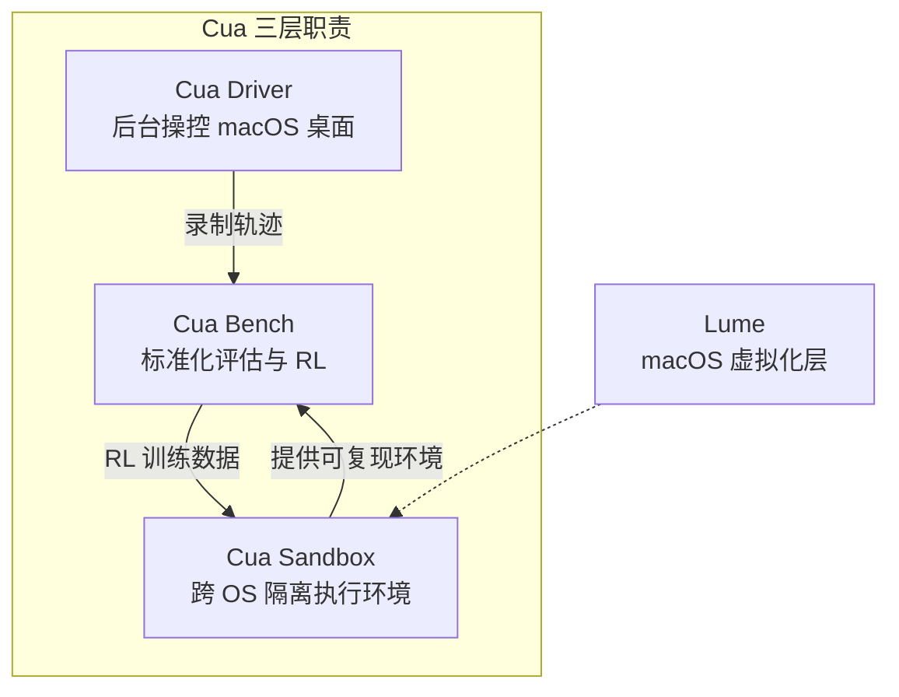
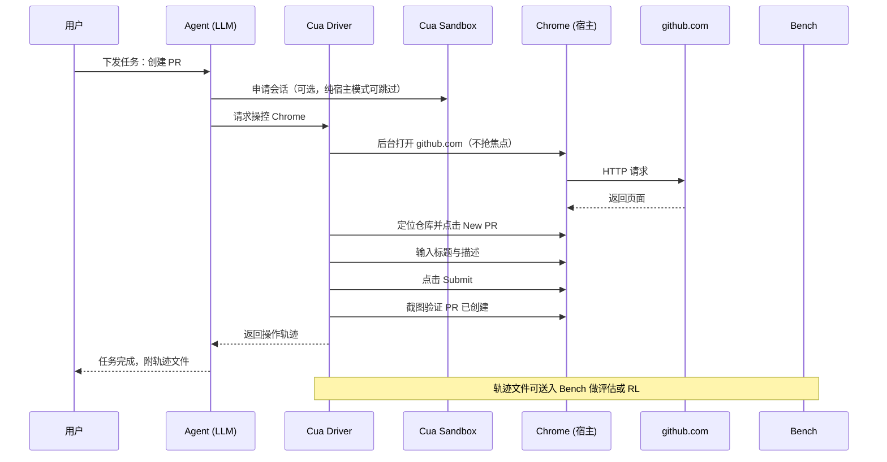

# Cua：开源计算机控制 Agent 基础设施完全指南

Cua 把"让 AI 操控完整桌面"这件事拆成了三层可以独立使用的工程能力：后台控制、隔离执行、标准化评估。这三层对应 **Cua Driver**、**Cua Sandbox**、**Cua Bench** 三个组件，由 trycua 团队维护，可以单独接入现有 Agent，也可以串成完整的训练-评估链路。

Browser Use、Skyvern 这类方案把 Agent 关在浏览器标签页里，靠 DOM 或 accessibility tree 间接驱动页面。一旦任务跳出浏览器——打开 Blender 改模型、在 Figma 里调图层、操作非 AX 标准的 Chromium 内嵌内容——这套思路就够不到。Cua 的判断是：桌面级控制必须从操作系统层切入，Web 层往下够不到的地方，正是 Cua 要补的。

## 这篇文章怎么看

- 想快速判断 Cua 是否适合自己的场景，看「总览」和「什么时候该用 Cua」两节。
- 想理解三层组件如何配合，看「任务如何流过系统」。
- 想直接上手，跳到「安装与快速上手」。
- 关心评估结果怎么读，看「Cua Bench」一节关于测量边界的讨论。

## 总览：三层职责如何分工

Cua 的三层不是垂直堆叠，而是可以独立替换的并行机制。Driver 解决"怎么操控"，Sandbox 解决"在哪里跑"，Bench 解决"跑得好不好"。三者通过轨迹（trajectory）文件串联：Driver 录制操作轨迹，Sandbox 提供可复现的执行环境，Bench 用同一份轨迹格式做评估和 RL 训练。



| 组件 | 解决的问题 | 边界 |
|------|-----------|------|
| Cua Driver | 如何在不抢焦点的情况下操控 macOS 原生应用 | 目前仅 macOS；Windows/Linux 桌面控制未覆盖 |
| Cua Sandbox | Agent 在哪里跑才不污染宿主 | 提供镜像与生命周期管理，不负责操控逻辑 |
| Cua Bench | 怎么衡量 Agent 操控能力 | 评估的是端到端任务完成度，不单独测模型推理能力 |

Lume 是 Sandbox 在 macOS 上的虚拟化底座，本身不直接面向用户，但理解它的存在有助于解释为什么 Sandbox 能在 Mac 上跑 Mac 镜像。

## Cua Driver：让 Agent 在后台操控 macOS

Driver 要回答的问题是：当用户正在用电脑时，Agent 能不能同时在同一个桌面里完成自己的任务，而不是把鼠标抢走、把窗口顶到前台。

常见的辅助功能 API（macOS AXUIElement）能解决标准原生应用，但有两类表面它够不到：Chromium 内嵌的 Web 内容（不走系统 AX 树）、Canvas 或 GPU 渲染的工具（Blender、Figma、DAW、游戏引擎）。Driver 在 AX 之上补了这两条路径，让 Agent 的点击和输入可以落到这些表面上。

Driver 的几个能力点：

- **后台操控**：Agent 的点击、输入、验证在后台完成，用户当前窗口焦点不被抢占。
- **非 AX 表面**：覆盖 Chromium Web 内容与 Canvas 渲染工具，不依赖标准无障碍 API。
- **MCP Server**：提供 Claude Code、Cursor 等支持 MCP 的 Agent 直接接入的 Server。
- **轨迹录制**：每个会话自动产出可回放的轨迹文件，供 Bench 评估或 RL 训练复用。

安装 Driver：

```bash
# 一键安装
/bin/bash -c "$(curl -fsSL https://raw.githubusercontent.com/trycua/cua/main/libs/cua-driver/scripts/install.sh)"
```

安装后得到三样东西：`cua-driver` 命令行工具、Claude Code Skill（位于 `libs/cua-driver/skills/claude-code-skill.md`）、可配置端口的 MCP Server。

## Cua Sandbox：跨 OS 的 Agent 隔离环境

Sandbox 要回答的问题是：Agent 跑任务时如果出错、误删文件、装了奇怪依赖，怎么保证不污染宿主，并且能复现。

它提供跨 OS 的标准化镜像和生命周期管理。Agent 在沙箱内完成"看屏幕 → 决策 → 操作 → 验证"的完整循环，宿主只看到沙箱的进程和磁盘占用。

```python
from cua import Sandbox, Image

# 定义任务镜像（预装 OS + 应用）
sandbox = Sandbox(
    image=Image("ubuntu:22.04"),  # 或 macOS
    os="linux"
)

# 启动 Agent 会话
session = sandbox.session()

# Agent 自动完成：看屏幕→点击按钮→验证结果
result = session.run("在浏览器中打开 github.com 并登录")
```

支持平台与底层实现：

- **macOS**：通过 Lume 虚拟化，可以在 Mac 上跑 Mac 镜像。
- **Linux**：Docker 或 KVM，镜像走标准容器或虚拟机流程。
- **Windows**：路线图中，尚未发布。

Sandbox 本身不负责"怎么操控"——那是 Driver 的职责。Sandbox 提供的是"在哪里跑"和"跑完怎么收"。

## Cua Bench：评估与 RL 训练

Bench 要回答的问题是：怎么衡量一个 Agent 的桌面操控能力，并且让这个衡量结果能反过来训练模型。

Bench 的任务集覆盖文件操作、浏览器操作、文档编辑等真实 GUI 场景，每个任务有明确的成功条件。Agent 跑完后，Bench 自动评分操作的准确性与效率，并把轨迹整理成可用于 RL 训练的格式。

关于 Bench 的数字，有几件事需要先说清楚：

- **测的是端到端任务完成度**：Agent 能不能在真实桌面里把任务做完，而不是单测模型推理或 API 调用准确率。
- **数字反映的是"操控+决策+验证"整条链路**：一个任务失败，可能是模型决策错、可能是 Driver 操控错、也可能是 Sandbox 环境问题。Bench 给的是链路总分，不直接归因到某一层。
- **不能直接推出模型能力对比**：不同模型在 Bench 上的差异，受 Driver 实现细节、Sandbox 镜像版本、任务集构成影响。把 Bench 分数当作"模型 A 比模型 B 强 X%"的依据，会忽略掉这些混淆变量。

如果要做模型对比，需要先固定 Driver 和 Sandbox 版本，再在同一份任务子集上跑，并标注置信区间。

## 任务如何流过系统：一个 GitHub PR 案例

把三层串起来看一次完整任务。假设目标是：让 Agent 在后台为 `trycua/cua` 仓库创建一个标题为 "fix: update driver" 的 PR，期间用户继续在另一个窗口写代码。



这次任务里，三层各司其职：Driver 负责把 Agent 的决策落到 Chrome 上而不打扰用户；Sandbox 在需要隔离时提供环境（本例走宿主 Chrome，可以不用 Sandbox）；Bench 在任务结束后接收轨迹，用于评估或训练。

对应的代码骨架：

```python
# 完整示例：让 Agent 在后台完成 GitHub PR 创建
from cua import Driver

driver = Driver()  # 自动连接 macOS 辅助功能 API

# 让 Agent 独立完成 GitHub PR 创建流程
task = """
在 Chrome 中打开 github.com，
使用当前登录的 GitHub 账号，
为仓库 trycua/cua 创建一个 PR，标题为 "fix: update driver"
"""
driver.run(task)
```

`driver.run` 内部会循环执行"截图 → 模型决策 → Driver 操控 → 验证"，直到任务完成或触发停止条件。每一步都会写入轨迹文件。

## 安装与快速上手

Cua 的 Python SDK 和 Driver 是两个独立包，按需安装。

安装 Python SDK（依赖 Python 3.11+）：

```bash
pip install cua
```

安装 Driver（仅 macOS）：

```bash
curl -fsSL https://raw.githubusercontent.com/trycua/cua/main/libs/cua-driver/scripts/install.sh | bash
```

Driver 首次运行需要授予 macOS 辅助功能权限。在「系统设置 → 隐私与安全性 → 辅助功能」里把 `cua-driver` 加入白名单，否则点击和键盘事件会被系统拦截。

## 与 Browser Use 的边界对照

| 维度 | Browser Use | Cua |
|------|-------------|-----|
| 操控对象 | 浏览器标签页 | 原生桌面应用 |
| 后台运行 | 需占用标签页，无法完全后台 | 完全后台，不抢焦点 |
| 非 AX 表面 | 不支持 | 支持 Chromium Web 内容与 Canvas |
| Canvas/游戏引擎 | 不支持 | 支持 |
| 轨迹录制 | 基础 | 完整生命周期，可直接喂给 Bench |
| RL 训练数据 | 有限 | 原生支持 |

这张表不是"谁更好"的对比，而是"谁解决哪类问题"。Browser Use 适合纯 Web 流程自动化，Cua 适合需要跳出浏览器的桌面级任务。两者并不互斥——一个完整的 RPA 流程可能同时用 Browser Use 处理 Web 部分，用 Cua 处理本地应用部分。

## 什么时候该用 Cua，什么时候不必

**建议先上的场景**：

- 团队已经在做 macOS 桌面 RPA 或 E2E 测试，受够了传统 RPA 工具的脚本维护成本。
- 研究方向是 CUA（Computer-Use Agent）模型训练，需要标准化的轨迹数据和评估环境。
- Agent 任务必须操控非 AX 表面（Blender、Figma、DAW、游戏引擎）。

**可以等等的场景**：

- 只做 Web 自动化，没有跳出浏览器的需求——Browser Use 或 Skyvern 更轻。
- 主要工作环境是 Windows 或 Linux 桌面——Driver 目前仅覆盖 macOS，Sandbox 的 Windows 支持还在路线图。
- 团队还没有 Agent 框架，先解决"用什么跑 Agent"再考虑"在哪里跑"。

**采用顺序建议**：

1. 先用 Driver 单独接入现有 Agent（Claude Code、Cursor 等），验证后台操控是否满足需求。
2. 如果需要隔离或复现，引入 Sandbox，把任务从宿主迁到沙箱镜像。
3. 当 Agent 数量或任务复杂度上来后，再用 Bench 做评估和 RL 训练。

## 常见问题

**Driver 装完后点击没反应？**
检查 macOS 辅助功能权限是否已授予 `cua-driver`。权限被撤销后不会自动恢复，需要重新勾选。

**Sandbox 在 macOS 上能跑 macOS 镜像吗？**
可以，通过 Lume 虚拟化层实现。这是 Cua 与其他容器方案的一个差异点。

**Bench 的分数能直接用来对比不同模型吗？**
不能直接对比。需要先固定 Driver、Sandbox 版本和任务子集，再在同一环境下跑，并标注置信区间。详见「Cua Bench」一节关于测量边界的讨论。

**Driver 支持 Windows/Linux 桌面控制吗？**
目前不支持。Driver 仅覆盖 macOS。Sandbox 可以跑 Linux 镜像，但 Sandbox 内的操控逻辑仍需要对应的 Driver 实现。

**轨迹文件格式是什么？**
轨迹文件由 Driver 自动录制，包含每一步的截图、决策、操作和验证结果，可直接送入 Bench 做评估或 RL 训练。

## 资源链接

- 官网：[https://cua.ai](https://cua.ai)
- 文档：[https://cua.ai/docs](https://cua.ai/docs)
- GitHub：[https://github.com/trycua/cua](https://github.com/trycua/cua)
