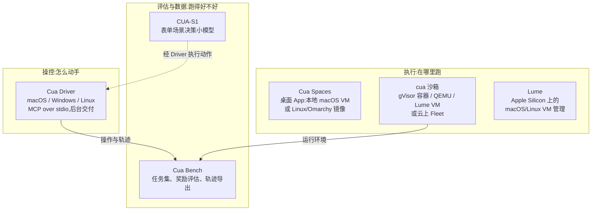
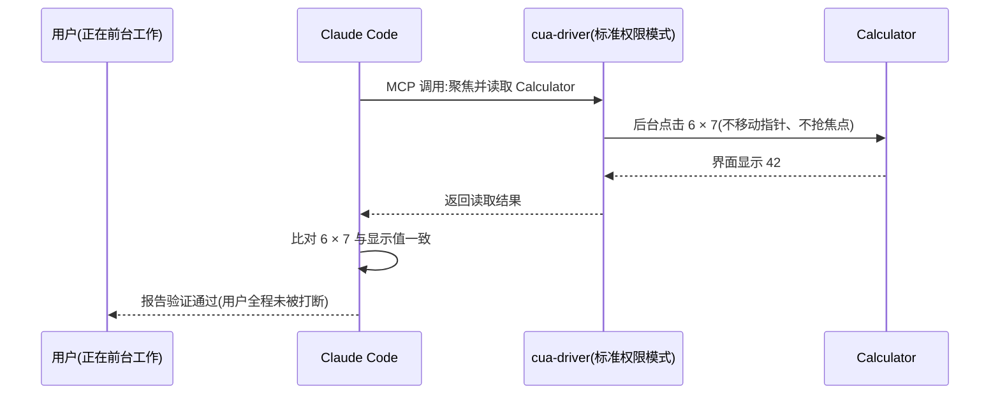

# Cua:给 AI Agent 一台能用的电脑——操控、沙箱与基准的开源基础设施

让 Agent 操作图形界面,难点从来不在「截一张图给模型看」,而在三件工程事:点击和输入怎么在后台落到正确的窗口上、任务跑在哪个可复现的环境里、做得好不好用什么标准衡量。trycua/cua(2026-10-04 读数:27.9k stars,MIT 为主)把这三件事拆成了可以单独接入的组件:Cua Driver 管操控,cua 沙箱与 Cua Spaces 管执行环境,Cua Bench 管评估与训练数据,另有 CUA-S1 探索计算机使用专用的决策小模型。

README 把这背后的理念称为 Computer-Use 2.0:Agent 在同一个任务里自由穿行于写代码、调 API、点图形界面之间,图形界面只是出口之一。Cua 提供的就是那个「电脑」层——你带自己的 Agent 和模型,它负责输入、捕获、隔离和度量。

本文 2026-05-14 首发,2026-10-04 按仓库当前状态全文重写核对。这五个月里项目变化很大:Driver 从仅支持 macOS 扩展到三平台,新增了 Spaces 桌面应用和 CUA-S1 模型,仓库主语言目前是 Rust。发版节奏接近每天多个,具体 API 以官方文档为准,本文只对引用时点的状态负责。

## 总览:六个组件,各管一段

先看全局,再进细节。六个组件不是垂直堆叠,而是按「怎么动手、在哪里跑、跑得好不好」三段职责切开的:


```mermaid
flowchart TB
    subgraph control["操控:怎么动手"]
        Driver["Cua Driver<br/>macOS / Windows / Linux<br/>MCP over stdio,后台交付"]
    end

    subgraph runtime["执行:在哪里跑"]
        Spaces["Cua Spaces<br/>桌面 App:本地 macOS VM<br/>或 Linux/Omarchy 镜像"]
        SB["cua 沙箱<br/>gVisor 容器 / QEMU / Lume VM<br/>或云上 Fleet"]
        Lume["Lume<br/>Apple Silicon 上的<br/>macOS/Linux VM 管理"]
    end

    subgraph eval["评估与数据:跑得好不好"]
        Bench["Cua Bench<br/>任务集、奖励评估、轨迹导出"]
        S1["CUA-S1<br/>表单场景决策小模型"]
    end

    Driver -- "操作与轨迹" --> Bench
    SB -- "运行环境" --> Bench
    S1 -. "经 Driver 执行动作" .-> Driver
```

| 组件 | 解决的问题 | 边界 | 许可 |
|------|-----------|------|------|
| Cua Driver | 检查并操控原生应用与浏览器,平台支持时后台交付 | 按平台有明确的拒绝边界,不支持的操作返回结构化拒绝 | MIT(可选感知扩展含 AGPL 组件) |
| Cua Spaces | 给 Agent 一台完整桌面,支持 Teleport 与多人协作 | 桌面 App 要求 macOS 26+ 宿主 | FSL-1.1-MIT,每个发布两年后转 MIT |
| cua SDK & CLI | 一个 `cua` 命令加 Python/TypeScript/Swift/Kotlin 四语言 SDK,管沙箱、镜像、Spaces 连接 | 沙箱内不需要也不内置 Agent | MIT |
| Lume | 在 Apple Silicon 上创建和管理 macOS/Linux 虚拟机 | 只管虚拟化,不管操控 | MIT |
| CUA-S1 | 计算机使用场景的快速、有界决策模型 | 早期仅源码的研究发布,权重单独放在 Hugging Face | 源码 MIT |
| Cua Bench | 构建任务、评估 Agent、导出训练轨迹 | 测端到端任务完成度,不对单层归因 | MIT |

主 README 明确写了依赖关系:「MIT 部分从不依赖 FSL 部分」。也就是说,不装 Spaces 应用,Driver、SDK、Lume、Bench 的全部能力照常可用;反过来用 Spaces 则要接受 FSL 许可条款。做技术选型时,这条比任何功能清单都重要。

## Cua Driver:不抢焦点的桌面操控

Driver 的定位是一句话:给任何 Agent 提供操控电脑的工具,经 stdio 说 MCP 协议。它不是又一个截图-点按循环的 Agent 框架,而是运行在你桌面会话里的原生层,Agent 通过三种方式接入:

- **MCP**:支持 MCP 的 Agent(Claude Code、Codex、Cursor、OpenClaw 等)直接连 `cua-driver mcp`;
- **CLI**:脚本类自动化走 `cua-driver call`;
- **应用 SDK**:Python 导入 `cua_driver`,TypeScript 导入 `@trycua/cua-driver`,两者都是 Rust 核心经 UniFFI 生成的绑定,应用内直连,不需要守护进程。

### 三平台,边界各不相同

Driver 现已支持 macOS、Windows 和 Linux(X11 与 Wayland),但官方平台支持文档没有停留在「支持」两个字上,而是逐平台写清了后台交付的边界:

- **macOS**:走 AppKit、辅助功能(Accessibility)、Quartz/HID 与 ScreenCaptureKit,需要授予辅助功能和屏幕录制两项权限。部分后台滚动、拖拽手势会拒绝执行;离屏 Space 的 SwiftUI 树、向最小化窗口提交键盘、只接受 HID-tap 输入的应用都在覆盖之外。
- **Windows**:走 Win32、UI Automation 和原生输入,覆盖 Electron、Tauri、WPF、WinUI 3、WebView2。部分后台 Chromium 手势和提权目标会拒绝;低完整性进程不能向高完整性(提权)应用注入输入,这是系统规则,Driver 不绕过。
- **Linux X11**:X11/EWMH、XTest、AT-SPI。拒绝合成后台事件的工具包会得到显式拒绝,裸后台投递取决于具体工具包。
- **Linux Wayland**:核心规则是普通客户端不能向未聚焦、被遮挡的窗口发送裸输入;AT-SPI 语义动作仍可后台执行。GNOME/Mutter 需要 Shell 助手并重启,KDE/KWin 实验性且助手只读,Hyprland/Omarchy 走选装插件、覆盖面窄。

贯穿其中的是一条工程纪律:一种能力只有当 Rust 测试工具「在应用或桌面拥有的状态里观察到结果」才算支持;不支持的路径返回结构化拒绝,而不是猜测执行结果。落到使用上,Driver 的失败是可判定的:Agent 拿到明确的错误信息就能换路径重试,不必对着一次超时干等。

### 权限与授权

权限模式在启动时固定,改动需重启守护进程,三档递进:`standard` 是默认档,正常自动化不弹提示;`bounded` 只放行经审阅的清单里的工具和资源;`unrestricted` 必须显式加 `--dangerously-bypass-approvals`。附加已登录的 Chromium 配置文件也是显式动作:`cua-driver mcp --grant existing-profile`。Driver 自己不渲染任何授权弹窗——审批权在你手上,不在界面上。

### 可选的视觉感知扩展

默认的 MIT 版 Driver 不带模型产物。选装 `cua-perception` 扩展后,可以把一帧原生窗口或桌面截图解析成模型中立的文字与图标区域;由区域推导出的像素点击必须携带与观察时相同的一次性 `capture_id`,防止拿旧截图点新界面。注意许可:该扩展的 OmniParser 图标检测是 AGPL-3.0-only,安装不改变 Driver 的 MIT 许可,但再分发扩展或通过网络向用户提供,可能触发 AGPL 提供源码的义务。官方建议很直接:组织不接受 AGPL 组件就别装。

macOS 每夜构建还有一个选用的 Computer History 预览:把经 Driver 执行的动作记成加密的本地历史,只存严格的元数据白名单,不存截图、键入文本、剪贴板内容、原始参数或 URL,Agent 只能通过只读的查询工具访问。

## 沙箱与 Spaces:Agent 在哪里跑

操控解决了「怎么动手」,第二段职责是「在哪里跑」。Cua 给出的不是一个沙箱,而是一条从轻到重的执行环境谱系:

| 环境 | 形态 | 典型命令 | 适用 |
|------|------|----------|------|
| 本地容器 | gVisor(默认)或 runc | `cua sb create ubuntu --name dev` | 轻量隔离,首次使用时初始化 |
| 本地虚拟机 | QEMU 或 Lume | Bench 传 `--kind vm --runtime lume` | 需要 Windows/macOS/Android 等 VM-only 镜像 |
| 云上 Fleet | gVisor 容器或 KubeVirt 虚拟机 | `cb run ... --on cloud` | 并行评估、批量数据生成 |
| Spaces 桌面 | 本地 macOS VM 或 Linux/Omarchy 镜像 | Cua Spaces 应用 | Agent 需要完整桌面与已登录会话 |

一条容易误解的设计:沙箱里不需要装 Agent。就绪判定来自运行时本身和可选的端口探针;镜像若自带 `cua-spacesd` 守护进程(3211 端口),才额外提供进程、文件、截图、输入和低延迟音视频流。沙箱提供环境,操控仍归 Driver,两层各管各的。

Python 侧,`pip install cua` 装的是 Rust 核心的 SDK 绑定(0.3.0,要求 Python 3.10+);高层 `Sandbox` API 走可选依赖,要 Python 3.11+:

```bash
pip install "cua[sandbox]"   # cua-sandbox:Sandbox、Image、Pool 等
```

```python
from cua import Sandbox, Image

async with Sandbox.ephemeral(Image.linux(), local=True) as sb:
    print((await sb.shell.run("uname -a")).stdout)
```

同样的沙箱在命令行里四步走完生命周期:

```bash
cua sb create ubuntu --name dev   # gVisor 容器,首次使用时初始化
cua sb exec dev uname -a
cua sb screenshot dev
cua sb rm dev
```

镜像引用统一走 OCI:OS 别名(`linux`、`windows`、`macos:tahoe`)或 `ghcr.io/trycua/<os>`,云与本地同一套选项;把 `on` 从 `local` 换成 `cloud`,剩下的参数不变。`cua host setup` 还能把你自己的一台机器经 cua.ai 中继暴露给 Agent,不需要端口转发。

### Spaces:带 Teleport 的完整桌面

Spaces 是 2026 年秋季新出现的旗舰形态,值得单独说。它是一个驻留在菜单栏的 macOS 应用,每个桌面是一个 Space:在你 Mac 上本地构建的 macOS 虚拟机,或者一个 Linux/Omarchy 镜像。Space 可以跑在你自己的 Mac、你拥有的其他机器,或你自己的云账户(AWS、Google Cloud、Modal)里。

两个能力把它和普通 VM 管理区分开:

- **Teleport**:把一个已登录的应用(比如 Chrome 或 Slack)移进 Space,它在那边打开时仍是登录态。会话凭据存在本机加密的 Cua Keyvault 里,经你批准后才进入 Space。
- **Multiplayer**:你和 Agent 在同一个桌面上各有一个光标。Agent 卡住时你介入点一下选择,再把桌面交还给它。

Spaces 对个人免费,Pro 和 Teams 版本即将推出;源码以 FSL-1.1-MIT 提供——可自由使用、自托管、二次开发,唯一限制是不能拿它做竞争性的托管服务,且每个发布版本在两年后自动转 MIT。

## Cua Bench:评估与训练数据

Bench 要回答的是第三段职责:Agent 的桌面操控能力怎么衡量,衡量结果怎么变成训练数据。它的形态是一个叫 `cb` 的命令行工具,加一个任务集注册表。

入门不需要虚拟机、Docker,甚至不需要模型 API Key——先从模拟任务跑通流程:

```bash
uv tool install 'cua-bench[browser]'                          # 要求 Python 3.12 或 3.13 + uv
uv tool run --from 'cua-bench[browser]' playwright install chromium
cb run example_tasks/hello_file_env                           # 默认在本地 gVisor 容器执行
```

官方建议的第一个结果是:创建一个小任务,跑它的参考解,确认评估器给出 `1.0` 的奖励。跑通之后再接真实 Agent:

```bash
cb dataset list                                               # 注册表里的任务集与版本
cb run cua-bench-basic --task-filter click-button             # 指定单个任务,本地桌面
cb run datasets/cua-bench-basic -j 8 --on cloud               # 云上 8 并行
cb run my_task --agent cua-agent --model anthropic/claude-sonnet-4-20250514
```

读 Bench 的数字之前,有三个问题要先答:

**它测什么?** 端到端任务完成度。评估器检查任务的最终状态给出奖励,`--attempts N` 让每个变体跑 N 次(每次全新沙箱),`summary.json` 报告 pass@k。它不单独测模型推理,也不单独测操控。

**数字变化反映什么?** 「模型决策 + Agent 框架 + Driver 操控 + 沙箱环境」整条链路。并行度、镜像版本、任务变体构成都会进入分数。注册表的每个任务集版本固定到一个 git commit,拉取后缓存在本地;`result.json` 还会记录后端(如 `local-gvisor`、`cloud-kubevirt`)与钉死的 `image_digest`。

**不能推出什么?** 换个模型跑一遍就宣布「A 比 B 强」,是这份数据最容易被误用的读法。模型对比要先固定运行时、镜像和任务版本,用 `--attempts` 拿到 pass@k,再谈差异;否则你量到的是整条链路,不是模型。

评估产生的每条轨迹是一个 ATIF-v1.8 格式的 `trajectory.json`(Harbor 规范,截图存于 `imgs/`),`cb dataset build` 能把运行目录导出成 aguvis-stage-1、gui-r1 等训练格式。同一次评估既产出分数,也产出可复现的 RL 训练数据——这是 Bench 和纯榜单最大的不同。

## 任务流案例:一次后台计算器验证

官方 Driver 快速上手给的场景很适合当解剖样本:让 Agent 在 Calculator 里计算 6 × 7,并验证应用显示 42。以 Claude Code 通过 MCP 接入为例,整条链路是这样走的:


```mermaid
sequenceDiagram
    participant User as 用户(正在前台工作)
    participant CC as Claude Code
    participant DRV as cua-driver(标准权限模式)
    participant Calc as Calculator

    CC->>DRV: MCP 调用:聚焦并读取 Calculator
    DRV->>Calc: 后台点击 6 × 7(不移动指针、不抢焦点)
    Calc-->>DRV: 界面显示 42
    DRV-->>CC: 返回读取结果
    CC->>CC: 比对 6 × 7 与显示值一致
    CC-->>User: 报告验证通过(用户全程未被打断)
```

几个细节值得注意。权限层面,标准模式不弹审批,但 Driver 不会渲染自己的授权弹窗,边界在启动参数里已经锁定。失败层面,如果这个场景换成 macOS 后台拖拽或 Wayland 下向被遮挡窗口发裸输入,Driver 会返回结构化拒绝而不是硬执行,Agent 拿到明确错误后可以改走前台或换 AT-SPI 语义动作。隔离层面,如果任务会改动环境——装依赖、改文件——把同一个任务放进 `cua sb create` 的 gVisor 容器或一个 Space 里跑,宿主只看到容器的进程和磁盘占用。

这个例子展示的分层正是 Computer-Use 2.0 的要点:Agent 在代码、API 和图形界面之间自由切换,每一层失败都有明确的信号,每一层都可以单独替换。

## 安装与上手路径

统一安装器一条命令,清单式勾选要装的东西(`cua` CLI、Cua Spaces 应用、cua-driver 的 MCP 与 skill、把本机变成可托管机器),最后执行 `cua auth login`,并可选把 cua skill 和 MCP server 装进 Claude Code、Codex、Cursor 等 Agent:

```bash
# macOS 26+(默认选中 Spaces 应用;--only cua-driver 可跳过清单)
curl -fsSL https://cua.ai/install.sh | sh
```

只要 Driver 的话:

```bash
# macOS / Linux
/bin/bash -c "$(curl -fsSL https://cua.ai/driver/install.sh)"
```

```powershell
# Windows(PowerShell)
irm https://cua.ai/driver/install.ps1 | iex
```

macOS 上 Driver 首次使用需在「系统设置 → 隐私与安全性」里授予辅助功能和屏幕录制权限,缺一项,捕获和输入都会被系统拦截。想单独管理虚拟机,Lume 另有一键脚本(`curl -fsSL https://cua.ai/lume/install.sh`),建好 Tahoe VM 后可经 SSH 连入。涉及安装命令与 API 的段落集中在 Driver、沙箱、Bench 和本节四处,仓库发版后按这四节更新即可。

## 什么时候用 Cua,什么时候不急

**值得先接入的**:

- Agent 任务要碰本地原生应用——自动化 macOS/Windows 上的桌面软件、驱动非标准渲染界面,Driver 的三平台覆盖加结构化拒绝是现成答案;
- 任务会改环境或要求可复现——gVisor 容器在本地即开即用,镜像 digest 钉死,云上 Fleet 批量并行;
- 你在做计算机使用方向的模型训练或评估——Bench 的 pass@k 加 ATIF 轨迹导出,把评估和数据生成合成一条流水线。

**可以等等的**:

- 纯 Web 页面自动化,browser-use 这类浏览器内方案更轻,不需要桌面层;
- 主要痛点是「Agent 框架本身」——Cua 定位在电脑层,模型编排仍由你的 Agent(Claude Code、OpenClaw 等)或 `cua-agent` 承担;
- 团队不接受 AGPL 或 FSL 条款——先绕开 `cua-perception` 扩展和 Spaces 应用,MIT 部分自成体系。

建议的采用顺序:第一步,装 Driver 并把现有 Agent 经 MCP 接上,拿计算器验证流确认你的目标应用在平台支持范围内;第二步,任务涉及环境变更时引入沙箱或 Spaces,固化镜像引用;第三步,要量化效果再上 Bench,从模拟任务开始,固定版本后做对比。三步都可以独立停下来,前一步的投入不会被后一步作废。

## 常见问题

**Driver 支持哪些系统?**

macOS、Windows、Linux(X11 与 Wayland)。各平台的后台交付边界不同,Wayland 下裸输入受合成器限制,AT-SPI 语义动作不受影响;细节以官方平台支持页为准。

**装完 Driver 点了没反应?**

先查 macOS 的辅助功能和屏幕录制权限是否都已授予;再确认操作类型是否落在平台边界内——部分后台滚动、拖拽、提权目标是明确拒绝的,拒绝会以结构化错误返回,而不是静默失败。

**沙箱里要装 Agent 吗?**

不需要。就绪判定来自运行时和端口探针;镜像自带 `cua-spacesd` 时才额外提供进程、文件、截图、输入与音视频流。

**Bench 分数能直接比较两个模型吗?**

不能直接比。先固定运行时、镜像与任务集版本,用 `--attempts` 取 pass@k;Bench 量的是端到端链路,不是模型能力。

**想拿轨迹训练自己的模型?**

`trajectory.json` 是 ATIF-v1.8 格式,`cb dataset build` 导出 aguvis-stage-1、gui-r1 训练格式;表单类决策可以参考 CUA-S1 的模型卡与数据集(权重在 Hugging Face,源码 MIT)。

**Spaces 免费吗?商用要注意什么?**

个人免费,Pro/Teams 计划在计划中。Spaces 应用与相关组件按 FSL-1.1-MIT 提供,把它做成托管或管理服务对外提供前,先读仓库的 COMMERCIAL.md;仓库其余部分(含 Driver、SDK、Bench)是 MIT。

## 资源链接

| 资源 | 链接 |
|------|------|
| GitHub 仓库 | [github.com/trycua/cua](https://github.com/trycua/cua) |
| 官网与文档 | [cua.ai](https://cua.ai) / [cua.ai/docs](https://cua.ai/docs) |
| Driver 平台支持 | [cua.ai/docs/cua-driver/concepts/platform-support](https://cua.ai/docs/cua-driver/concepts/platform-support) |
| Bench 注册表 | [cua.ai/cuabench/registry](https://cua.ai/cuabench/registry) |
| CUA-S1 模型权重 | [huggingface.co/cua-ai/cua-s1-forms](https://huggingface.co/cua-ai/cua-s1-forms) |
| 社区 | [Discord](https://discord.gg/mVnXXpdE85) |
