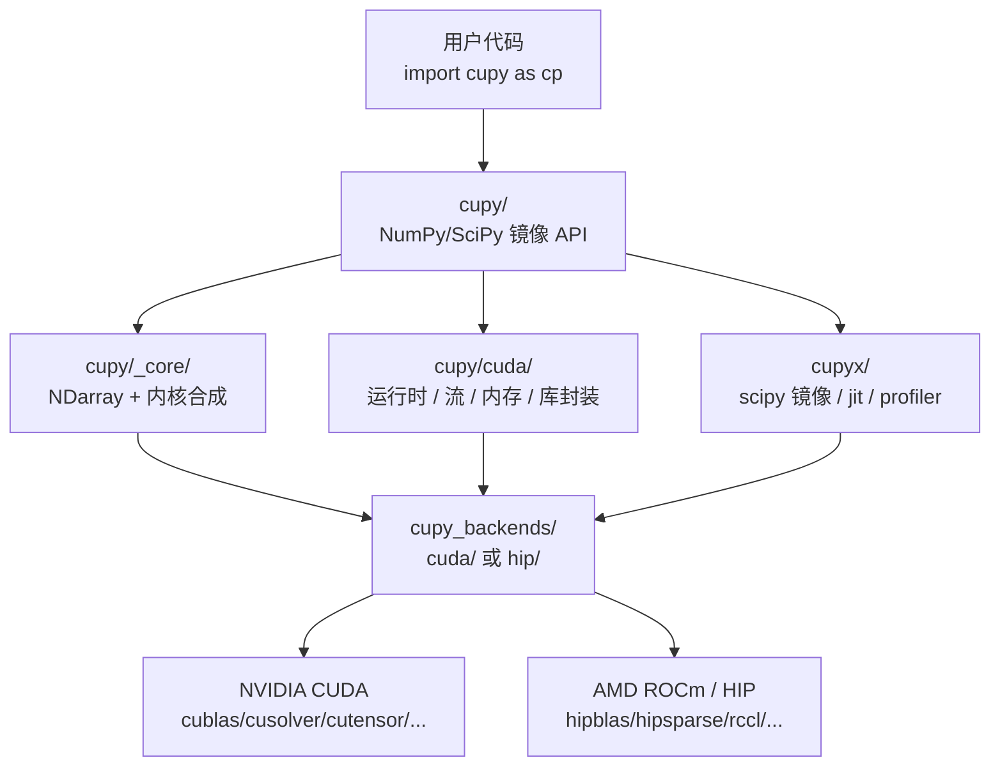

## 开场判断

CuPy 想做的事，是把 NumPy/SciPy 这套 Python 数值计算体系，从 CPU 生态端到端搬到 GPU 生态，同时让上层 API 几乎不变。它不是「把某个算子加速」，而是「生态平移」。判断它值不值得用，看的是代码里有没有两块同时成立的东西：已经写好的 NumPy/SciPy 资产，以及明确想用 GPU 的意图。

它有约 1.2 万 Stars、1.1k Forks（shields.io 实时），MIT 协议，由 Preferred Networks 和社区维护。之所以有这种地位，靠的是三件事：

1. 用 `cupy.ndarray` 镜像 `numpy.ndarray`，多数场景改个 import 名就能跑；
2. 用 `cupy_backends/` 把 CUDA 和 ROCm（HIP）收敛在同一套 C-API 后面，上层 Cython 代码不需要为不同厂商各写一份；
3. 用运行时 NVRTC（NVIDIA Runtime Compilation，CUDA 动态编译库）即时合成 kernel，并把 cuBLAS、cuSOLVER、cuTENSOR、cuSPARSE、NCCL 这些厂商库包装成 `cupyx.linalg`、`cupy.cuda.*` 等用户 API。

和另外两条 GPU 路线分清楚有帮助：PyTorch 面向深度学习 tensor 与自动求导；Numba CUDA 是 Python 子集 + 手写 kernel；CuPy 则是把既有 NumPy/SciPy 生态用 GPU 重做一遍，重头戏在「不动业务代码，只换底层」。HPC（High Performance Computing，高性能计算）、信号处理、计算化学、辐射成像这些领域，正需要既有 NumPy 代码又想吃 GPU 红利，CuPy 是顺手的入口。

## 系统地图：CuPy 的四层结构

进细节前，先把仓库摊开。下面这张表对齐顶层目录与职责：

| 目录 / 文件 | 职责 | 关键内容 |
|---|---|---|
| `cupy/` | 用户面 Python API（NumPy/SciPy 镜像） | `__init__.py`、`_core/`、`creation/`、`linalg/`、`fft/`、`random/`、`polynomial/` 等 |
| `cupy/_core/` | NDarray 实现 + 内核合成（核心 Cython） | `core.pyx`、`_kernel.pyx`、`_reduction.pyx`、`_fusion_*.pyx`、`_ufuncs.py` |
| `cupy/cuda/` | CUDA 运行时包装 | `memory.pyx`、`stream.pyx`、`runtime.py`、`cublas.py`、`cusolver.pyx`、`cusparse.py`、`cutensor.pyx`、`nccl.py`、`graph.pyx`、`nvtx.py` |
| `cupyx/` | 扩展与互操作层 | `scipy/`（镜像 SciPy）、`jit/`（Python 语法 kernel 装饰器）、`profiler/`、`scatter_add`、`distributed/` |
| `cupy_backends/cuda/` | NVIDIA CUDA 后端 C-API 绑定 | `api/runtime/`、`cublas/`、`cusparse/`、`cutensor/`、`nccl/` 等 |
| `cupy_backends/hip/` | AMD ROCm/HIP 后端 C-API 绑定 | `cupy_hip.h`、`cupy_hipblas.h`、`cupy_hiprand.h`、`cupy_hipsparse.h`、`cupy_rccl.h` |
| `cupy_backends/stub/` | 桩后端（编译验证、无 GPU 环境） | 仅类型声明 |
| `tests/`、`examples/`、`docs/` | 测试 / 示例 / 文档 | 标准仓库三件套 |

很容易把 `cupy/cuda/` 和 `cupy_backends/cuda/` 搞混。前者是给用户调用的一层，`cp.cuda.Stream`、`cp.cuda.Event`、`cp.cuda.memory.MemoryPool` 都在这；后者是 C-API 的薄声明层，`runtime.pyx`、`cublas.pyx` 这类直接对着 NVIDIA 头文件。两者用 `cimport` 串起来。看懂这一层，后面 kernel 合成的路径才接得上。


```mermaid
graph TB
    A[用户代码<br/>import cupy as cp] --> B[cupy/<br/>NumPy/SciPy 镜像 API]
    B --> C[cupy/_core/<br/>NDarray + 内核合成]
    B --> D[cupy/cuda/<br/>运行时 / 流 / 内存 / 库封装]
    B --> E[cupyx/<br/>scipy 镜像 / jit / profiler]
    C --> F[cupy_backends/<br/>cuda/ 或 hip/]
    D --> F
    E --> F
    F --> G[NVIDIA CUDA<br/>cublas/cusolver/cutensor/...]
    F --> H[AMD ROCm / HIP<br/>hipblas/hipsparse/rccl/...]
```

多后端是一种「在 cupy_backends 这个 C 层做后端选择」的设计，上面 `cupy/`、`cupyx/` 全部复用。结果就是 CUDA 侧跑得厚实（cuBLAS、cuTENSOR、cuSPARSE 都齐），ROCm 侧「可用但有差」。README 里把 ROCm 7.0 明确标为 experimental，安装包是 `cupy-rocm-7-0`。

## 边界拆分：四类用法互不替代

读 CuPy 文档时容易把下面四类用法当成一回事，先拆开。

### A. Drop-in replacement：换 import 就跑

```python
import cupy as cp
x = cp.arange(6).reshape(2, 3).astype('f')
x.sum(axis=1)
```

这是最浅的一层。`cupy/__init__.py` 把 `_core.ndarray`、各类子模块、NumPy 的 `e/pi/inf` 常量都重新导出。这一层真正的问题是「NumPy 全部 API 的 GPU 子集覆盖到哪」。权威口径看 `docs/source/reference/comparison_table.rst.inc` 的对照表，仓库没有承诺对任何 NumPy 版本 100% 兼容。

### B. 与 NumPy/Numba/PyTorch 互操作

`cupy.ndarray` 同时实现了 `__array_ufunc__`、`__array_function__` 和 `__cuda_array_interface__` 三套协议：

- `numpy.sum(cupy_array)` 返回 `cupy.ndarray`（而不是拷回 `numpy.ndarray`），避免无谓的主机-设备拷贝；
- `cupy.asarray(numba_cuda_array)` 可零拷贝转回 CuPy；
- `torch.from_dlpack(cupy_array)` 用 DLPack（跨框架 tensor 内存共享协议）打通 PyTorch。

互操作立足的是协议而非数据。所有互操作都建立在零拷贝或显式 `cp.asnumpy()` / `cp.asarray()` 之上，不存在「自动同步到主机」的隐藏调用。

### C. 用户自定义 kernel：三种写法

仓库同时提供三种 kernel 写法，对应三套机制：

1. **`cupy.ElementwiseKernel` / `ReductionKernel`**：用 Python 字符串写「类 C」的 kernel 体，CuPy 在运行时拼成完整 CUDA 源码、走 NVRTC 编译；
2. **`cupy.RawKernel` / `cupy.RawModule`**：直接写 CUDA C++ 源码字符串，NVRTC 编译后加载到设备；
3. **`cupyx.jit.rawkernel` 装饰器**：用 Python 语法写 kernel 体，第一次调用时把 Python AST 翻译成 CUDA C++，再走 NVRTC 编译。

第三种是后来加的，目标是吸收 Numba CUDA 的写法，同时保留 CuPy 自己的 NDarray 内存模型。`cupyx/jit/` 子目录（`__init__.py`、`_builtin_funcs.py`、`_compile.py`、`_cuda_types.py`、`_interface.py`）就是这条线的实现。

三条的取舍：**`ElementwiseKernel` 最省事**——自动处理广播、索引与 dtype，适合规整的元素级运算；**`RawKernel` 给你完整的 C++ 控制**，但广播与边界要自己写；**`cupyx.jit.rawkernel`** 用 Python 语法兼顾可读性，代价是首次调用要先做一次 AST 翻译。大多数场景从 `ElementwiseKernel` 起步就够，不必一上来就上 `RawKernel`。

### D. 厂商库直调与底层 CUDA

`cupy.cuda.runtime`、`cupy.cuda.cublas`、`cupy.cuda.cusolver`、`cupy.cuda.cutensor`、`cupy.cuda.cusparse`、`cupy.cuda.nccl`、`cupy.cuda.graph` 这一批，是对 NVIDIA 库的 Python 直通封装，给那些要绕开 NumPy API 直接调 GPU 库的场景，比如稀疏求解、批量 einsum、跨 GPU 通信。

四层的差异落在两点：A 与 B 的区别是「有没有在用户代码里把 import 换掉」，C 与 D 的区别是「写不写 CUDA C++」。A 不需要写 C++，B 不需要 GPU 知识，C 需要 CUDA 入门，D 是 CUDA 工程师的工具箱。下面重点讲 A 和 C。

## 核心机制：内核是如何被合成出来的

CuPy 表面是 NumPy 镜像，底层最值得看的是 `cupy/_core/core.pyx`——它定义 `ndarray` 和几乎所有元素级、规约级运算的入口。但更关键的是 `_kernel.pyx`、`_reduction.pyx`、`_ufuncs.py` 三个文件组成的内核合成流水线。

### 一次 `cp.sum(x)` 走过哪些文件

用一个最小例子，把「一次简单求和」经过的系统路径串起来。

```python
import cupy as cp
x = cp.arange(1024 * 1024, dtype=cp.float32)
s = x.sum(axis=0)
```

执行流：

1. **`cupy/__init__.py`**：加载 `_core`，导出 `ndarray`、`ufunc`，把 `sum` 路由到 `_core` 里的 `_routines_statistics`。
2. **`_core/core.pyx`**：Python 端 `ndarray.sum` 是 `_routines_statistics` 模块的封装（参见 `cupy/_core/_routines_statistics.pyx`）。
3. **`_core/_reduction.pyx`**：把求和写成一个规约 kernel。Reduction（规约）指把大数组归纳成小数组（甚至一个标量）的并行操作，如 `sum`、`max`。
4. **`_core/_kernel.pyx`**：根据 dtype、轴、形状生成 CUDA C++ 源码字符串，交给 `cupy.cuda.compiler` 走 NVRTC 编译。
5. **`cupy_backends/cuda/api/runtime.pyx`**：编译产物通过 `cuLaunchKernel` 加载到 GPU，规约分 block 级 + grid 级两段走，用原子操作或两遍 kernel 合并。
6. **`cupy/cuda/memory.pyx`**：输出 `s` 的存储从 memory pool 分配，不直接走 `cudaMalloc`。

第一次调用这段代码是「冷路径」：CUDA 上下文初始化（几秒量级，见 `docs/source/user_guide/performance.rst` 的 Context Initialization 段）+ NVRTC 编译 + 第一次 kernel launch。后续调用走 `~/.cupy/kernel_cache` 里的二进制缓存，warm path 通常毫秒级。

### 内存池与流：被忽视但关键的两条线

`cupy/cuda/memory.pyx` 实现了 memory pool，默认开启。它预分配大块 GPU 内存并按需分给 `ndarray`，避免每次 `cp.zeros` 都触发 `cudaMalloc`。`cupy.cuda.MemoryPool` / `cp.cuda.set_allocator` 是给高级用户调优的。

流（stream）是另一条线。CuPy 在每个 thread 维护一个 `current_stream`，用 `with cp.cuda.Stream():` 切换。kernel launch 默认排到当前流上；GPU 之间或 CPU/GPU 之间的拷贝会用 pinned memory（页锁定内存，操作系统无法换出，主机↔GPU 拷贝明显快于普通内存）+ 独立拷贝流。如果不主动用多流，单卡上的同步点就是 kernel launch 队列本身的隐式顺序——这点和 PyTorch 一致。

### 内核融合：一个未充分文档化的能力

仓库里有一整套 `_fusion_*.pyx` / `_fusion_*.py`，以及用户面的 `@cupy.fuse` 装饰器。它把多个 NumPy 表达式合并成单个 CUDA kernel 一次执行，避免中间结果落显存，设计哲学类似 Numba 的 `@njit(parallel=True)`，但保持 NumPy 语义。

`@cupy.fuse` 不是「自动优化」开关。它只对被装饰函数里出现的那一组表达式起作用，不是全局 JIT，也不替换 `cupy.ndarray` 的常规操作。和 `cupy.ElementwiseKernel` 配合用，往往比单独开 fusion 更稳。

## 一个具体任务流：自定义 ElementwiseKernel 怎么从 Python 走到 GPU

用一个最小但完整的例子，把前面四层抽象串起来。

```python
import cupy as cp

squared_diff = cp.ElementwiseKernel(
    'float32 x, float32 y',
    'float32 z',
    'z = (x - y) * (x - y)',
    'squared_diff',
)

x = cp.arange(10, dtype=cp.float32).reshape(2, 5)
y = cp.arange(5, dtype=cp.float32)
print(squared_diff(x, y))   # 自动广播，对齐不同形状的数组
```

走过的路径：

1. **入口**：`cupy.ElementwiseKernel` 在 `cupy/_core/_kernel.pyx` 里实现。构造期把参数签名 `'float32 x, float32 y'`、输出签名 `'float32 z'`、body `'z = (x - y) * (x - y)'` 收下来，但不立即编译；
2. **首次调用**：`__call__` 走到内部 `_get_ufunc` / `_get_kernel`，根据实际 dtype、shape（这里是 `float32`、`(2,5)` 和 `(5,)`）生成完整 CUDA C++ 源码——包括 `#include`、`extern "C"` 入口、自动索引代码、广播逻辑；
3. **编译**：走 `cupy/cuda/compiler.py` 的 `_compile`，调 NVRTC 的 `nvrtcCreateProgram` / `nvrtcCompileProgram` / `cuModuleLoadData`，把 PTX（Parallel Thread Execution，CUDA 的虚拟指令集，介于源码和机器码之间）加载到设备；
4. **缓存**：编译产物按 (kernel 名、dtype、参数签名) 三元组写入 `~/.cupy/kernel_cache/`（可用 `CUPY_CACHE_DIR` 覆盖），下次同组合直接走 PTX 缓存跳过 NVRTC；
5. **执行**：`cuLaunchKernel` 填 block/grid 参数，默认 block size 由 CuPy 自动算，可用 `size=` 覆盖；
6. **返回**：输出 `z` 的存储来自 memory pool，返回的 `cupy.ndarray` 和 NumPy 一样支持链式调用。

这次完整流过的文件：`cupy/__init__.py` → `cupy/_core/_kernel.pyx` → `cupy/cuda/compiler.py` → `cupy/cuda/function.pyx` → `cupy_backends/cuda/api/driver.pyx` → `cupy_backends/cuda/api/runtime.pyx`。这条链上任何一环出问题（环境变量、CUDA 版本不匹配、NVRTC 找不到、kernel cache 损坏），用户看到的都是类似的 import error 或 launch error——这也是 CuPy 安装问题排查绕不开 `pip install cupy-cuda12x` 选型的原因。

## benchmark 解读：这些数字到底在测什么

CuPy 在 `docs/source/user_guide/performance.rst` 给出官方 benchmark 工具 `cupyx.profiler.benchmark` 和 `%gpu_timeit` / `%%gpu_timeit` 魔法命令。文档示例：

```python
>>> from cupyx.profiler import benchmark
>>> def my_func(a):
...     return cp.sqrt(cp.sum(a**2, axis=-1))
>>> a = cp.random.random((256, 1024))
>>> print(benchmark(my_func, (a,), n_repeat=20))  # doctest: +SKIP
my_func             :    CPU:   44.407 us   +/- 2.428 (min:   42.516 / max:   53.098) us     GPU-0:  181.565 us   +/- 1.853 (min:  180.288 / max:  188.608) us
```

先看这段输出能读出什么：

1. `GPU-0` 后面的数字是 CUDA Event 测的真实设备端耗时——`start_gpu.record()` 在当前流插事件、`end_gpu.record()` 结束后再插一个、`end_gpu.synchronize()` 等到 GPU 执行完，再用 `cp.cuda.get_elapsed_time` 读差值。这是 GPU 上唯一可信的计时方式。
2. `CPU` 后面的数字是 `time.perf_counter` 测的 Python 端 wall clock，一定 ≥ GPU 时间，因为 Python 调用栈本身有开销。用 `time.perf_counter` 单测 GPU 是不准的——这正是 `cupyx.profiler.benchmark` 默认同时输出两组数字的原因。
3. `n_repeat=20` 触发 20 次重复 + 默认 warm-up，目的是跳过「冷路径」（context init、首次 kernel 编译）。

再提醒自己别从它推什么：

1. **推不出「CuPy 一定比 NumPy 快」**。在 `(256, 1024)` 这种小规模输入下，GPU-0 端 181.565 μs 反而比 CPU 端 44.407 μs 慢——这是 GPU launch overhead 主导，不是算得慢。判断 GPU 值不值，必须看 problem size。
2. **推不出「A100 一定比 RTX 3090 更快」**。benchmark 没声明硬件，跨设备比较必须固定 GPU 型号、CUDA 版本、显存带宽三个变量。
3. **推不出「warm-up 后的数字就是稳态性能」**。内存池状态、其他进程占用、GPU 降频都会让数字波动。

官方建议是：性能异常时，先用 `cupyx.profiler.benchmark` 隔离冷路径，再决定要不要开 `@cupy.fuse`、调大 block size、或换 `cupy.RawKernel`。不要在没 warm-up 的情况下做 benchmark。

## 与 NumPy 的兼容性边界

`docs/source/reference/comparison_table.rst.inc` 是兼容性权威对照表，由 `docs/source/reference/comparison.py` 自动生成。读法：

- 函数标记 `OK` 表示已实现，参数与 NumPy 一致；
- 标记 `OK (diff)` 表示实现但参数子集或语义略有差异，典型如 `np.linalg.solve` 在奇异矩阵下 CuPy 走 cuSOLVER 而 NumPy 走 LAPACK；
- `-` 表示未实现；
- 标记自定义（如 `OWN_IMPLEMENT`）表示 CuPy 自己实现而不是调 cuBLAS。

工程里常踩的几处：

1. **dtype 强转**：CuPy 与 NumPy 的混合 dtype 提升并非处处一致，遇到结果和你预期不符时，显式 `.astype(np.float64)` 比猜规则省事。
2. **稀疏数组**：`cupyx.scipy.sparse` 镜像 SciPy 稀疏，但 COO（COOrdinate，坐标格式）/CSR（Compressed Sparse Row，压缩稀疏行）/CSC（Compressed Sparse Column，压缩稀疏列）之间的转换开销不同；调 cuSPARSE 的稀疏-稠密乘积与 SciPy 调 MKL 的行为不完全一致。
3. **NCCL 集合通信**：`cupy.cuda.nccl` 提供 GPU 间直接通信，只在多卡 + NCCL 可用时生效，单卡不会自动 fallback。
4. **流同步**：`cupy.cuda.Stream.null` 是默认流，跨流数据依赖要显式 `event.wait()`，不靠隐式 sync。

## 采用顺序：什么时候用、什么时候不用

把前面拆的层次翻译成决策。

**先用 CuPy 的场景**：

- 已经有一份 NumPy/SciPy 代码，profile 出 CPU 端慢，希望最小改动搬到 GPU；
- 用 Numba/Triton 写自定义 kernel 觉得工程量大，需要 NumPy 风格 API；
- 想用 cuBLAS、cuSOLVER、cuTENSOR 这类厂商库但不想写 C++；
- 多卡计算，需要 NCCL 集合通信；
- 信号处理、计算化学、辐射成像等领域，需要 SciPy 信号/稀疏/特殊函数替代。

**暂时不用 CuPy 的场景**：

- 主要是深度学习训练 + 推理——直接用 PyTorch / JAX / TensorFlow，自动求导、分布式、kernel 调优都做过了；
- 已经在用 Numba CUDA 写高定制化 kernel——迁到 `cupyx.jit.rawkernel` 不一定有收益；
- 需要 ROCm 上与 CUDA 完全一致的能力矩阵——ROCm 7.0 仍标 experimental，部分 `cupyx.scipy.signal` 子模块覆盖不全；
- 在意启动延迟——首次 import 触发 CUDA context 初始化，几秒到十几秒，冷启动容器或 serverless 场景要预热。

**落地顺序**：

1. 选匹配 CUDA 版本的安装包：CUDA 12.x 用 `pip install cupy-cuda12x`，CUDA 13.x 用 `pip install cupy-cuda13x`，AMD ROCm 7.0 用 `cupy-rocm-7-0`（experimental），或用 `conda install -c conda-forge cupy`；
2. 用 `cupy.cuda.is_available()` 和 `cupy.cuda.runtime.getDeviceCount()` 探明环境；
3. 把现有 NumPy 代码的 `import numpy as np` 改成 `import cupy as cp`，跑一遍测试；
4. 跑 `cupyx.profiler.benchmark` 对比 CPU/GPU 耗时，确认小规模输入下不会反而变慢；
5. 在热点路径上用 `cupy.ElementwiseKernel` 或 `@cupy.fuse` 替换 Python 循环；
6. 性能仍有缺口时再考虑 `cupy.RawKernel` 或 `cupyx.jit.rawkernel`。

## 结尾判断

CuPy 不是把某个算子榨到最快的库，也不是最容易上手的 CUDA 工具。它的价值是把 NumPy/SciPy 生态整体铺到 GPU 上，值钱在生态完整性，不在单点峰值。要不要上它，不看 star 数，只看手里的代码是不是「已存在的 NumPy/SciPy 资产」和「明确想用 GPU」同时成立。

读这份仓库，关键不是逐文件看完，而是抓三件事：

1. `cupy_backends/cuda` 与 `cupy_backends/hip` 的对称结构，决定了多后端能力的真实边界；
2. `_core/core.pyx` + `_kernel.pyx` + `_reduction.pyx` + `cupy/cuda/compiler.py` 这条链，是 kernel 合成与缓存的命门；
3. `cupyx.profiler.benchmark` + `%gpu_timeit` 是性能判断的最低基线工具，没有它就别下结论。

剩下的目录——`cupy/fft`、`cupy/random`、`cupy/polynomial`、`cupyx/scipy/*`、`cupyx/distributed`——都是沿同一条思路展开的子能力。理解上面三层之后，按需翻这些子模块才不会迷路。

## 仓库链接

- 仓库主页：<https://github.com/cupy/cupy>
- 官方文档：<https://docs.cupy.dev/en/stable/>
- NumPy 兼容性对照表：<https://docs.cupy.dev/en/stable/reference/comparison.html>
- cuSignal 自 v13.0.0 起并入 CuPy（README 脚注）：<https://github.com/cupy/cupy/releases/tag/v13.0.0>
- v14.0.0 release notes（NumPy v2 语义、bfloat16、CUDA 13.1 支持、`%gpu_timeit`）：<https://github.com/cupy/cupy/releases/tag/v14.0.0>
- 引用论文：Okuta et al., *CuPy: A NumPy-Compatible Library for NVIDIA GPU Calculations*, NIPS LearningSys 2017，<http://learningsys.org/nips17/assets/papers/paper_16.pdf>