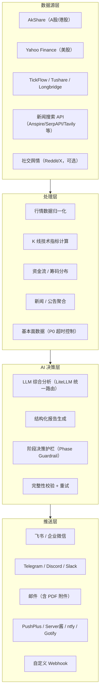

## 目录

- [这套系统真正解决的问题](#这套系统真正解决的问题)
- [系统地图：四层架构与一条分析流水线](#系统地图四层架构与一条分析流水线)
- [为什么不用自己搭](#为什么不用自己搭)
- [数据层：多源并行获取与降级链路](#数据层多源并行获取与降级链路)
- [AI 决策层：从 Prompt 到结构化报告](#ai-决策层从-prompt-到结构化报告)
- [GitHub Actions 零成本部署](#github-actions-零成本部署)
- [Web 工作台：不止是手动分析](#web-工作台不止是手动分析)
- [15 种策略 Agent：裁决逻辑与实战案例](#15-种策略-agent裁决逻辑与实战案例)
- [推送体系：渠道、路由与降噪](#推送体系渠道路由与降噪)
- [LLM 选型与成本](#llm-选型与成本)
- [什么时候该用，什么时候不该用](#什么时候该用什么时候不该用)
- [常见问题排查](#常见问题排查)
- [结语](#结语)

---

## 这套系统真正解决的问题

[daily_stock_analysis](https://github.com/ZhuLinsen/daily_stock_analysis) 解决的不是「AI 能不能分析股票」——这件事单个 Prompt 就能做到。它解决的是另一个问题：

**把数据采集、多源行情聚合、LLM 综合研判、策略裁决、多渠道推送这一整条链路，跑成一条无需人工干预、可复现、可审计的定时流水线。**

拆开看，这背后有几件事在工程上并不简单：

1. 不同市场（A 股 / 港股 / 美股）的数据源接口、交易日历、字段语义各不相同，需要一套统一的适配层。
2. LLM 输出的分析结论天然不稳定——同一只股票，两次 Prompt 可能给出相反的评分。系统需要把 LLM 输出约束到结构化字段上，并在推送前做完整性校验。
3. 多条策略线（均线、缠论、资金流、事件驱动）同时跑，结果需要合并成一份「决策仪表盘」，而不是各说各话。
4. 推送渠道超过 10 种，每种渠道的消息格式、长度限制、Markdown 支持程度都不一样——飞书支持 Markdown 卡片，Telegram 需要 MarkdownV2 转义，企业微信只认纯文本。

这套系统用 3.6 万+ Star 证明了一件事：**个人投资者确实需要这么一个东西，而且它跑得通。**

---

## 系统地图：四层架构与一条分析流水线

先看整体结构，再看一条分析任务从头到尾是怎么跑的——这两件事搞清楚了，后面的模块细节才有上下文。

### 四层架构



### 一次分析任务如何流过系统

以「用户配置了 3 只 A 股 + 1 只美股，每日 18:00 自动执行」为例：

1. **定时触发** → GitHub Actions 在 UTC 10:00（北京时间 18:00）启动 workflow。
2. **交易日检查** → 系统按股票代码所属市场分别查询交易日历，自动跳过休市股票。A 股和美股之间的交易日期不同步，这个检查是逐市场做的。
3. **数据并行获取** → 4 只股票的数据同时拉取。A 股走 AkShare / TickFlow，美股走 Yahoo Finance。每只股票同时拉行情、K 线、资金流、新闻、基本面——基本面数据设了 P0 超时（默认 30 秒），超时自动跳过，不阻塞其他数据。
4. **LLM 综合研判** → 每只股票的数据拼成一份结构化 Prompt，通过 LiteLLM 统一路由到配置的模型（DeepSeek / Gemini / Claude / Anspire 等），输出约束为 JSON 格式：评分、趋势、买卖点位、风险警报、催化因素。
5. **阶段决策护栏** → 大盘复盘结果（涨跌停比例、板块轮动方向）注入到个股分析结论中，对极端市场环境下的评分做修正。比如熊市环境下，即使个股技术面好看，评分也会被压低。
6. **完整性校验** → 检查 JSON 输出是否包含所有必填字段。缺失字段触发重试（默认重试 1 次），重试失败则用占位值补全，确保推送不会因为 LLM 的一次异常输出而中断。
7. **多渠道推送** → 按配置的推送渠道，将报告渲染为对应格式。飞书走 Markdown 卡片，企业微信走纯文本，Telegram 走 MarkdownV2。如果开了 Markdown 转图片，超过 15000 字符的报告会跳过转图，避免超大图片。

---

## 为什么不用自己搭

市面上能跑股票分析的脚本很多——一个 Python 脚本调 AkShare 拿数据，拼个 Prompt 扔给 DeepSeek，输出粘到飞书机器人，2 小时就能搭出来。

但问题是，这种「搭出来」和「跑得稳」之间的距离，比看起来大得多：

| 自己搭的脚本 | daily_stock_analysis 的处理方式 |
|---|---|
| 数据源挂了就报错退出 | 多数据源降级：AkShare 挂了自动切 Baostock，Yahoo Finance 超时切 Longbridge。单数据源失败不影响其他股票 |
| 非交易日也跑，输出空报告 | 逐市场交易日历检查，自动跳过休市股票。A/H/US 三市场混配时，各自独立判断 |
| Prompt 输出不稳定，偶尔丢字段 | 结构化 JSON 约束 + 完整性校验 + 重试机制。缺失字段用占位值补全，保证推送不中断 |
| 推送渠道各自适配，格式混乱 | 统一消息抽象层，飞书/企微/Telegram/Discord/Slack/邮件/PushPlus/Server 酱/ntfy/Gotify/自定义 Webhook 共享同一套渲染管线 |
| 没有历史记录，无法复盘 | 每次分析结果写入 SQLite 数据库，Web 工作台可回溯历史报告、比较信号变化 |
| 回测靠 Excel 手动拉 | 内建回测框架，对历史分析结果做评估，输出胜率、盈亏比、最大回撤 |

这些不是「高级功能」——对一条每天自动跑的流水线来说，它们是**能否在无人值守状态下连续跑 3 个月不出事的底线**。

---

## 数据层：多源并行获取与降级链路

系统在数据获取上做了两层设计：**并行获取**保证速度，**多源降级**保证可靠性。

### 行情数据源矩阵

| 数据源 | 覆盖市场 | 数据内容 | 降级优先级 |
|---|---|---|---|
| TickFlow | A 股、港股 | 实时行情、K 线 | 主力源 |
| AkShare | A 股、港股 | 行情、财务、资金流 | 主力源 |
| Tushare | A 股 | 行情、基本面（需 Token） | 可选 |
| Baostock | A 股 | 历史行情 | 降级兜底 |
| Yahoo Finance | 美股、港股 | 实时行情、K 线 | 主力源 |
| Longbridge | 港股、美股 | 实时行情、K 线 | 可选 / 降级 |
| Pytdx | A 股 | 通达信协议行情 | 可选 |

每个市场至少有两套数据源可用。A 股的主力路径是 TickFlow → AkShare → Baostock 三级降级，美股的主力路径是 Yahoo Finance → Longbridge 两级降级。降级是自动的，不需要用户感知。

### 新闻搜索源矩阵

新闻质量直接影响 AI 分析中「舆情情绪」「利好催化」「风险警报」这三个模块的准确性。系统支持 7 种搜索源，推荐至少配置一个：

| 搜索源 | 特点 | 适用场景 |
|---|---|---|
| Anspire AI Search | 中文优化，搜索结果含 AI 摘要 | A 股新闻、舆情（推荐） |
| SerpAPI | 调用百度/Google 搜索引擎 | 实时金融新闻补强 |
| Tavily | 通用新闻搜索 | 多语言覆盖 |
| 博查 (Bocha) | 中文搜索优化 | A 股资讯 |
| Brave Search | 隐私优先 | 美股资讯 |
| MiniMax | 结构化搜索结果 | 互补来源 |
| SearXNG | 自建实例，零配额 | 私有部署兜底 |

### 基本面数据的 P0 超时机制

基本面数据（PE、PB、ROE、营收增速等）对分析质量有提升，但接口响应慢、不稳定。系统给基本面数据设了 P0 超时（默认 30 秒），超时后自动跳过基本面阶段，不阻塞行情和新闻数据的处理——一根慢查询不该拖垮整个分析流水线。

---

## AI 决策层：从 Prompt 到结构化报告

### LiteLLM 统一路由

系统底层通过 [LiteLLM](https://docs.litellm.ai/) 统一路由到不同 LLM 提供商。这意味着你可以用同一套代码切换 OpenAI、DeepSeek、Gemini、Claude、通义千问、Anspire、AIHubMix 或本地 Ollama，不需要改任何 Prompt 或调用逻辑。

LLM 配置支持三层优先级：

1. **极简模式**：只填一个 API Key 和模型名，如 `ANSPIRE_API_KEYS=sk-xxx`。
2. **渠道模式**：配置多个模型渠道，系统按优先级自动切换。主模型挂了或超时，自动切到备用模型。
3. **YAML 高级模式**：通过 LiteLLM 的 YAML 配置做负载均衡、请求路由、跨平台高可用。

### Prompt 的结构化约束

每只股票的分析 Prompt 包含以下数据块：

- 行情快照（最新价、涨跌幅、成交量、换手率）
- K 线技术指标（MA5/MA10/MA20、MACD、RSI、布林带、K 线形态）
- 资金流向（主力净流入/流出、北向资金）
- 筹码分布（持仓成本区间、集中度）
- 新闻聚合（最新公告、舆情摘要、研报观点）
- 大盘阶段摘要（涨跌停统计、板块轮动、市场情绪）

Prompt 要求 LLM 输出严格 JSON，字段包括：

```json
{
  "score": 65,
  "trend": "看多",
  "decision": "观望",
  "support_level": "18.50",
  "resistance_level": "22.30",
  "risk_alerts": ["主力资金流出", "筹码分散"],
  "catalysts": ["AI 概念催化", "业绩预增"],
  "operation_checklist": ["关注 20 日线支撑", "等缩量回踩再考虑"]
}
```

### 阶段决策护栏

单独看一只股票的 K 线和技术指标，LLM 容易给出偏乐观的结论。系统在个股分析之前先跑一次「大盘复盘」——统计当日涨跌停数量、领涨/领跌板块、市场整体情绪，然后将大盘阶段信息注入到每一只个股的 Prompt 中。

在熊市环境下，这个护栏会把个股评分压低 5-15 分；在极端行情（如千股跌停）时，系统会直接给出「观望」或「卖出」的强制建议，避免 LLM 在恐慌市场中给出不合理的「买入」信号。

---

## GitHub Actions 零成本部署

### 完整步骤

**第 1 步：Fork 仓库**

进入 [ZhuLinsen/daily_stock_analysis](https://github.com/ZhuLinsen/daily_stock_analysis)，点击 Fork。

**第 2 步：配置 Secrets（最少 4 项）**

进入 `Settings → Secrets and variables → Actions → New repository secret`，添加：

| Secret | 值 | 说明 |
|---|---|---|
| `ANSPIRE_API_KEYS` | `sk-xxx` | 一 Key 同时启用大模型和搜索，推荐 |
| `STOCK_LIST` | `600519,000858,AAPL` | 自选股，逗号分隔 |
| `WECHAT_WEBHOOK_URL` | `https://qyapi.weixin.qq.com/...` | 企业微信机器人 |
| 或 `FEISHU_WEBHOOK_URL` | `https://open.feishu.cn/...` | 飞书机器人 |

这 4 项填完就能跑。其他数据源、搜索源、推送渠道全部可选，按需追加。

**第 3 步：启用 Actions 并手动触发**

`Actions` → `每日股票分析` → `Run workflow` → 等待 2-3 分钟，推送消息到达。

**第 4 步：确认定时**

默认 `cron: '0 10 * * 1-5'`（工作日北京时间 18:00）。修改 `.github/workflows/00-daily-analysis.yml` 中的 cron 表达式即可调整时间。

### GitHub Actions 免费额度

GitHub 免费计划每月提供 2000 分钟 Actions 运行时间。一次全量分析（10 只股票 + 新闻搜索 + LLM 调用）约耗时 3-5 分钟，每月 22 个交易日，总消耗约 66-110 分钟——远在免费额度之内。

### 注意事项

- Fork 后的仓库默认是 Public 的。如果 `STOCK_LIST` 涉及个人持仓信息，建议在仓库 Settings 中开 Private，或将自选股列表编码为不易识别的格式。Private 仓库的 Actions 免费额度为每月 2000 分钟，足够使用。
- 首次手动触发时，建议先用 `--stocks 600519` 指定单只股票测试，确认推送正常后再放开全量。

---

## Web 工作台：不止是手动分析

除了 GitHub Actions 定时运行，系统还提供了完整的 Web 工作台（React 前端 + FastAPI 后端）。启动方式：

```bash
python main.py --webui        # 启动 Web 界面 + 自动分析
python main.py --webui-only   # 仅启动 Web 界面
docker compose up -d          # Docker 部署
```

访问 `http://127.0.0.1:8000` 后，你能用的功能远不止「输入股票代码然后点分析」：

- **手动分析**：逐股分析，实时查看进度，每完成一只立即展示结果。
- **历史报告**：所有分析记录存 SQLite 数据库，按日期回溯。能看到同一只股票不同日期的评分变化趋势。
- **完整 Markdown 报告**：比推送消息更详细，包含完整的 Prompt 原文、原始 JSON 输出、中间处理步骤。
- **回测**：对历史分析结果做评估，输出胜率、盈亏比、最大回撤。可以按股票、策略、时间段分别回测。
- **持仓管理**：录入持仓成本，系统在分析报告中给出「持仓盈亏」「是否该加仓/减仓」的针对性建议。
- **智能导入**：支持图片、CSV/Excel、剪贴板导入股票列表。截图保存的股票代码表可以直接拖进去识别。
- **主题切换**：浅色/深色主题，夜间盯盘友好。

---

## 15 种策略 Agent：裁决逻辑与实战案例

策略 Agent 容易被当成「Prompt 模板合集」——15 个策略，每个策略对应一段 Prompt，输入股票代码，输出分析结论。实际上它比模板复杂得多：**Agent 底层是一个有状态的多轮对话系统**，LLM 可以调用行情数据、技术指标和新闻搜索作为工具，在对话中逐步深入分析，而不是一次性输出结论。

### 策略一览

| 策略 | 主要逻辑 | 适合场景 |
|---|---|---|
| 均线策略 | MA5/MA10/MA20 多空排列，金叉死叉 | 趋势跟踪，右侧交易 |
| 缠论策略 | 中枢、笔、线段识别 | 技术分析深度用户 |
| 波浪策略 | 艾略特波浪数浪 | 中长线趋势判断 |
| 趋势策略 | 多周期均线方向一致性 | 大方向确认 |
| 热点策略 | 板块热度 + 资金流入排名 | 短线题材跟踪 |
| 事件策略 | 财报、政策、公告事件驱动 | 财报季、政策窗口期 |
| 成长策略 | 营收/利润增速 + PEG | 成长股筛选 |
| 预期策略 | 一致预期 vs 实际数据 | 业绩兑现判断 |
| 资金流策略 | 主力资金净流入/流出 | 资金面跟踪 |
| 筹码策略 | 持仓成本分布 + 集中度 | 判断主力动向 |
| 北向资金策略 | 外资净买入/卖出 | 外资动向跟踪 |
| 期权策略 | 隐含波动率 + Put/Call 比率 | 美股期权市场情绪 |
| 指数增强策略 | 跑赢基准指数的配置 | 指数化投资优化 |
| 可转债策略 | 转股溢价 + 正股联动 | 可转债套利 |
| ETF 轮动策略 | 行业/宽基 ETF 轮动信号 | 指数化轮动 |

### 实战案例：多策略并行分析

在 Web 工作台的 `/chat` 页面输入：

> 「用均线策略和资金流策略同时分析贵州茅台，再用缠论策略分析宁德时代，最后汇总」

系统会并行执行：

1. **均线策略**（贵州茅台）→ 拉取 MA5/MA10/MA20 数据，判断多空排列，给出金叉/死叉信号。
2. **资金流策略**（贵州茅台）→ 拉取主力资金净流入，对比 5 日/20 日资金趋势，判断资金面方向。
3. **缠论策略**（宁德时代）→ 拉取更长时间跨度的 K 线数据，识别中枢、笔、线段，判断当前处于哪个级别走势。

三组分析完成后，Agent 自动合并结果，给出跨策略对比结论——比如「均线看多但资金流偏空，建议观望等资金面确认」。

### 背后的设计

Agent 的底层是一个有状态的多轮对话系统：

- 每轮对话有 `max_steps` 上限和 `orchestrator_timeout_s` 超时，防止 LLM 在无限追问中烧 token。
- 支持会话导出，可以把整个分析过程导出为 Markdown 文件，方便复盘。
- 支持把分析结果通过通知渠道发送——在 Web 界面点一个按钮，分析结论就推到飞书群。
- 实验性支持自定义策略文件和 Agent 编排，允许用户写自己的分析策略并注册到系统中。

---

## 推送体系：渠道、路由与降噪

推送这块，系统做了三层设计：渠道适配（飞书/企微/Telegram 各自的消息格式差异）、路由与去重（哪类消息走哪个渠道、同一内容不重复推送）、格式转换（Markdown 转图片，适应纯文本渠道）。

### 渠道矩阵

支持 11 种推送渠道，每种渠道的适配细节不同：

| 渠道 | 消息格式 | 注意事项 |
|---|---|---|
| 飞书 | Markdown 卡片 | 支持签名校验、关键词 |
| 企业微信 | 纯文本 | 消息长度限制，长报告自动截断 |
| Telegram | MarkdownV2 | 支持子话题（Topic） |
| Discord | Embed / 纯文本 | Bot 和 Webhook 两种方式 |
| Slack | Bot / Webhook | Bot 模式支持图片上传 |
| 邮件 | HTML + PDF 附件 | 支持分组邮箱、合并推送 |
| PushPlus | 纯文本 | 国内推送服务 |
| Server 酱³ | 纯文本 | 手机 APP 推送 |
| AstrBot | Webhook | 带 Bearer Token 认证 |
| ntfy | HTTP | 自建推送服务 |
| Gotify | HTTP | 自建推送服务 |
| 自定义 Webhook | JSON | 支持自定义 body 模板 |

### 路由与去重

如果所有渠道都配了，每条分析报告会被推送到所有渠道——这会产生大量重复消息。系统提供了通知路由能力：

- **报告路由**（`NOTIFICATION_REPORT_CHANNELS`）：分析报告只推送到指定渠道，如 `wechat,telegram`。
- **告警路由**（`NOTIFICATION_ALERT_CHANNELS`）：EventMonitor 触发的告警走独立渠道，如 `wechat`。
- **去重 TTL**（`NOTIFICATION_DEDUP_TTL_SECONDS`）：同一内容在 TTL 内只发一次，避免重复推送。
- **冷却窗口**（`NOTIFICATION_COOLDOWN_SECONDS`）：同一渠道在冷却期内限频。
- **静默时段**（`NOTIFICATION_QUIET_HOURS`）：如 `23:00-07:00`，夜间不推送，支持跨午夜。

### Markdown 转图片

部分渠道（如企业微信）对 Markdown 支持有限。系统支持将 Markdown 报告转为图片发送，引擎可选 `wkhtmltoimage` 或 `markdown-to-file`。超过 15000 字符的报告自动跳过转图，避免图片过大。

---

## LLM 选型与成本

### 模型选择建议

| 模型 | 推荐场景 | 月成本估算（10 股/日） |
|---|---|---|
| DeepSeek-V3 | 性价比首选，中文分析质量高 | ¥5-10 |
| Gemini 2.5 Flash | 免费额度大，适合测试 | 免费（1500 次/天） |
| GPT-4o | 分析深度最好，但贵 | ¥30-50 |
| Claude 3.5 Sonnet | 复杂分析场景，推理能力强 | ¥20-40 |
| 通义千问 | 国内访问稳定 | ¥5-15 |
| Ollama 本地 | 完全免费，需本地 GPU | 0（电费除外） |

### 实际 Token 消耗

一次完整分析（1 只股票 + 新闻搜索 + LLM 研判）约消耗 20k-40k token。10 只股票约 200k-400k token/天。以 DeepSeek-V3 的定价（¥1/百万 token）计算，每月 22 个交易日约 ¥4.4-8.8，加上 GitHub Actions 免费、数据源免费，总成本几乎为零。

### 不建议的用法

- 不要用 GPT-4.5 做每日分析——单次 200k token 的消耗在 GPT-4.5 上可能达到 ¥20-30，一个月就是 ¥400-600。
- 不要同时配 5 个 LLM 渠道——每个渠道都会独立调用，token 消耗翻倍。
- Ollama 本地部署虽然免费，但需要至少 16GB 显存跑 7B 模型，且分析质量不及云端大模型。

---

## 什么时候该用，什么时候不该用

### 适用的场景

- **个人投资者每日复盘**：每天 18:00 自动收到一份决策仪表盘，不用逐只股票翻行情软件、手动拼新闻。
- **量化策略的数据整合层**：系统采集的多源数据（行情、资金流、筹码、新闻）可以作为量化策略的输入，不需要自己写数据管道。
- **盯盘辅助**：配置 EventMonitor 后，系统会在触发条件（如股价突破关键位、主力资金异动）时主动推送告警。
- **学习 AI + 金融交叉领域**：项目代码结构清晰，模块分离度高，适合作为 LLM Agent 在金融场景落地的参考实现。

### 不适用的情况

- **机构级高频交易**：数据延迟在秒级到分钟级，不适用于毫秒级策略。GitHub Actions 的定时精度是分钟级，不是秒级。
- **单一股票的重仓决策**：AI 分析基于公开数据和历史模式，不能替代对公司的深度研究。重仓决策之前，AI 报告最多只能作为交叉验证的参考之一。
- **完全依赖 AI 信号跟单**：不验证信号直接下单，结果大概率是亏钱。系统的回测功能就是用来验证信号有效性的——先用回测跑一遍历史数据，再决定是否跟单。

### 推荐采用顺序

1. **Fork + 单股测试**：用 1 只股票跑通全流程，确认推送正常。这一步花 5 分钟，但能验证你的 LLM Key、推送渠道、数据源三件事都通。
2. **加到 5 只，跑一周**：观察每日报告质量，重点看评分是否稳定、推送是否准时、风险警报是否合理。如果某只股票连续 3 天评分波动超过 20 分，去 Web 工作台看原始 Prompt 和 JSON 输出，定位是哪个数据块出了问题。
3. **配置回测**：对过去 30 天的分析结果做回测，确认信号有效性。回测输出的胜率低于 50%，说明当前策略组合不适合你的股票池，需要调整。
4. **根据回测结果调整策略组合**：不同策略在不同市场环境下的表现差异很大，不要 15 种全开。A 股和美股适用的策略不同——A 股更适合资金流和筹码策略，美股更适合期权和成长策略。
5. **考虑 AlphaSift + AlphaEvo 联动**：如果需要选股和策略进化，项目作者还有两个同系列项目——AlphaSift（多因子选股）和 AlphaEvo（策略回测与自我进化），可以组合使用。

---

## 常见问题排查

**Q: Actions 日志报 `No valid AI model key configured`**

检查是否至少配置了一个模型 API Key（`ANSPIRE_API_KEYS`、`AIHUBMIX_KEY`、`GEMINI_API_KEY`、`ANTHROPIC_API_KEY`、`OPENAI_API_KEY` 之一）。如果配了 `OPENAI_API_KEY`，确认 `OPENAI_BASE_URL` 和 `OPENAI_MODEL` 也同时配置了。

**Q: 飞书收不到推送，但 Actions 显示成功**

飞书 Webhook 有两种额外校验：签名校验和关键词。如果开启了签名校验，需要同时配置 `FEISHU_WEBHOOK_SECRET`；如果开启了关键词，消息内容必须包含指定关键词。另一个常见原因是 Webhook URL 过期——飞书机器人 Webhook 有时效性，需要重新生成。

**Q: 非交易日也收到了空报告**

检查 `STOCK_LIST` 中的股票代码格式是否正确。港股代码需要 `hk` 前缀（如 `hk00700`），A 股代码是 6 位数字（如 `600519`），美股代码是原始 ticker（如 `AAPL`）。代码格式不对会导致交易日检查模块无法正确识别所属市场。

**Q: 分析结果中评分忽高忽低**

LLM 输出的天然波动是正常的。如果波动幅度过大（同一只股票两天评分差 30 分以上），可能是以下原因之一：新闻搜索源当天返回了异常数据、大盘阶段护栏被触发、网络问题导致部分数据缺失。可以在 Web 工作台中查看完整的 Prompt 原文和 JSON 输出，定位是哪个数据块出了问题。

**Q: Docker 部署后日志报权限错误**

官方 Docker 镜像默认以非 root 用户运行，如果挂载了宿主机目录，需要确保目录权限正确。推荐在 `docker-compose.yml` 中添加 `user: "1000:1000"` 或调整宿主机目录权限为 `chmod 777`。

---

## 结语

[daily_stock_analysis](https://github.com/ZhuLinsen/daily_stock_analysis) 值得仔细读一遍源码，不是因为 Star 数多，而是因为它把「AI 辅助股票分析」从概念验证做到了工程落地。数据层、AI 决策层、推送层之间的边界清晰，每个模块都有独立的降级和兜底机制——这在一个主要由个人维护的开源项目中并不常见。

想上手，最快的路径是 Fork → 手动触发一次 → 看推送效果 → 读 Pipeline 和 Agent 源码。中间如果遇到问题，往回翻「常见问题排查」一节，大部分坑都有现成的答案。

项目地址：[github.com/ZhuLinsen/daily_stock_analysis](https://github.com/ZhuLinsen/daily_stock_analysis)

---

*本文不构成任何投资建议。AI 分析基于公开数据和历史模式，不保证准确性。股市有风险，入市需谨慎。*