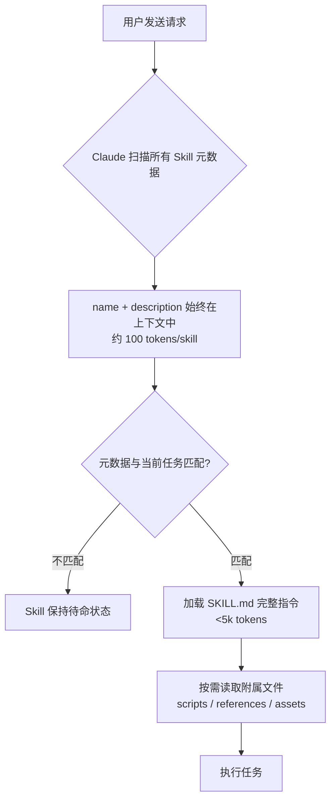
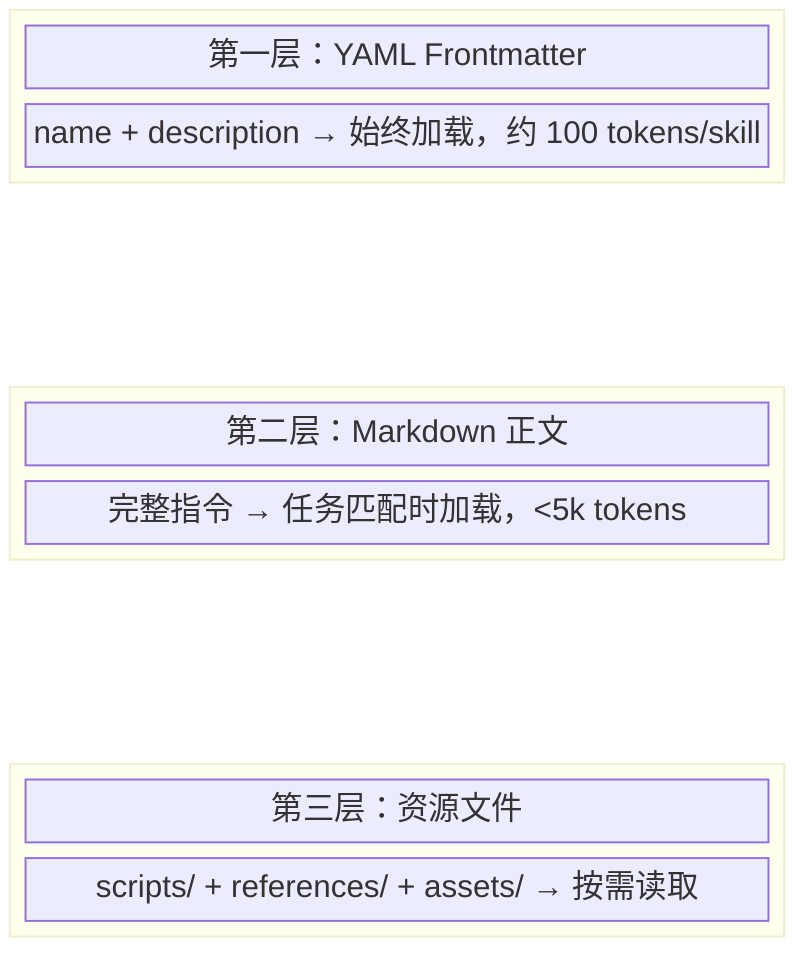
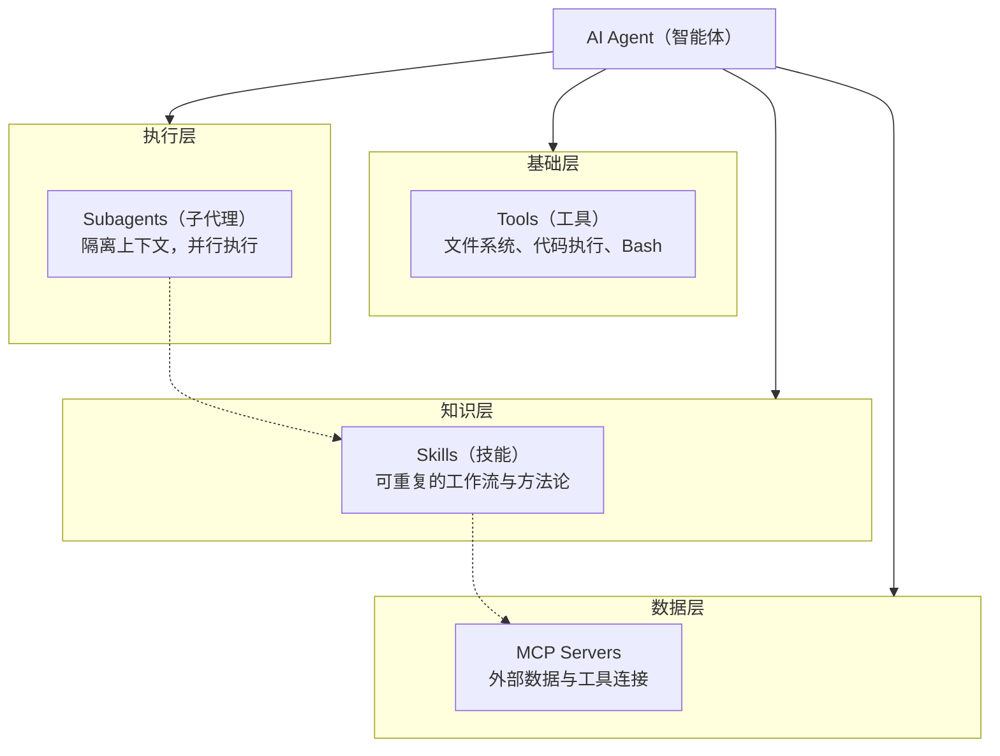
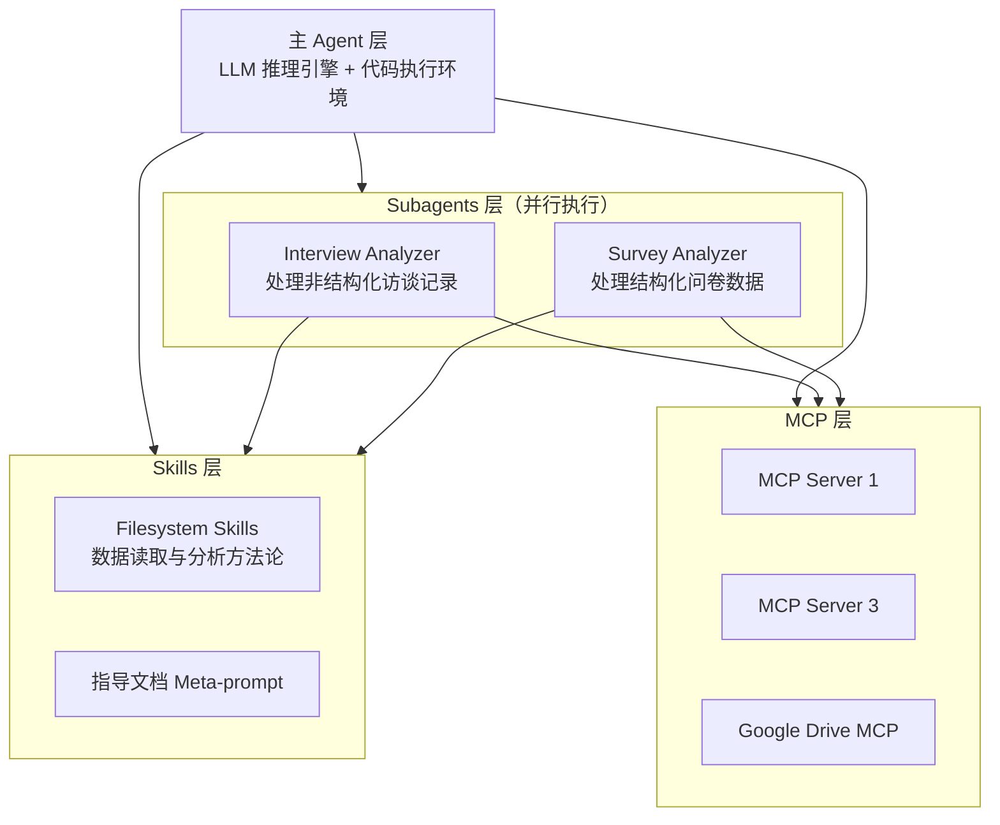

# Datawhale Agent Skills 完全指南：吴恩达课程深度解读

## 项目背景

2025 年 10 月，Anthropic 正式发布 Agent Skills 系统——一套通过文件夹组织指令、脚本和资源来扩展 Claude 能力的开放标准。同年 12 月，Agent Skills 被发布为跨平台开放标准（[agentskills.io](https://agentskills.io)），这意味着为 Claude 构建的 Skill 原则上可以在任何兼容该标准的平台上运行。

吴恩达的 DeepLearning.AI 平台随即与 Anthropic 联合推出了 **agent-skills-with-anthropic** 系列课程。Datawhale 社区将该课程完整翻译为中文，并进行了系统化的知识点梳理与代码示例补充，让中文用户能够无障碍地系统学习 Agent Skills。

| 项目 | 信息 |
|------|------|
| 课程来源 | DeepLearning.AI × Anthropic |
| 主讲讲师 | Elie Schoppik |
| 官方仓库 | [sc-agent-skills-files](https://github.com/https-deeplearning-ai/sc-agent-skills-files) |
| 视频课程 | [DeepLearning.AI Short Courses](https://www.deeplearning.ai/short-courses/agent-skills-with-anthropic/) |
| 中文整理 | Datawhale |
| Stars | 494 |
| Forks | 64 |

## 什么是 Agent Skills

Agent Skills 的核心思想非常简单：**Skills 是你为 Claude 编写的"岗位培训手册"**。你把业务规范、操作流程、品牌风格指南、代码模板等打包进一个文件夹，Claude 在遇到相关任务时自动加载这本手册，按照里面定义的规程工作。

每个 Skill 是一个独立的文件夹，包含一个必须的 `SKILL.md` 文件，以及可选的脚本、参考文档和模板资源。Skill 通过 **渐进式披露** 机制分三个阶段加载信息：元数据始终在上下文中（约 100 tokens），触发时加载完整指令，只有实际需要时才读取资源文件。这种设计让数十个 Skills 可以同时处于待命状态而不撑爆上下文窗口。

### 三大核心特性

**开放标准**。Agent Skills 采用标准化格式，已发布为开放规范。任何兼容的智能体产品都可以消费和加载 Skill，不局限于 Claude 生态。

**一次构建，多处部署**。同一个 Skill 文件夹可以在 Claude.ai、Claude Code、API 和 Agent SDK 中无修改使用。

**渐进式披露**。Skill 的名称和描述始终存在于智能体的上下文窗口中，但只有当用户请求与 Skill 的描述匹配时，才会加载完整的 Markdown 指令正文。附属资源（脚本、参考文档）仅在实际需要时按需读取。



### 三大应用场景

| 场景 | 典型实例 |
|------|---------|
| 领域专业知识 | 品牌视觉规范、法务审核流程、数据分析方法论 |
| 可重复的工作流 | 每周营销数据复盘、客户电话准备清单、季度业务回顾 |
| 全新能力扩展 | 生成 PPT/Excel/PDF 报告、搭建 MCP 服务器 |

没有 Skills 的痛点很明确：每次都要重新描述指令、重新打包参考资料、难以保证流程和产出的一致性。Skills 解决的就是"可复用的领域知识"问题。

## Skills 架构深度解析

### SKILL.md 文件格式

一个 `SKILL.md` 文件由 YAML Frontmatter 和 Markdown 正文组成。Frontmatter 中 `name` 和 `description` 是两个必填字段，也是渐进式披露的第一层——Claude 在启动时扫描所有可用 Skill 的这两个字段来判断何时激活它们。

以下是 Datawhale 课程中"分析营销活动"Skill 的示例：

```yaml
---
name: analyzing-marketing-campaign
description: 分析多渠道数字营销数据，计算转化漏斗、效率指标，并给出预算调整建议。
inputs:
  - file: Excel/CSV，包含Date, Campaign_Name, Channel, Impressions, Clicks, Conversions, Spend, Revenue, Orders等字段
outputs:
  - Markdown/Excel表格，含各项指标与建议
---
```

Markdown 正文部分定义具体的任务流程和计算规则：

```markdown
## 任务流程

1. 读取Excel/CSV数据
2. 计算各渠道CTR（点击率）、CVR（转化率）
3. 计算ROAS（广告回报率）、CPA（获客成本）、净利润等效率指标
4. 输出对比表格，生成分析解读与预算建议

## 公式示例

- CTR% = Clicks / Impressions × 100
- CVR% = Conversions / Clicks × 100
- ROAS = Revenue / Spend
- CPA = Spend / Conversions
- Net Profit = Revenue - (Spend + 其它成本)
```

### 目录结构

一个完整的 Skill 目录组织如下：

```
analyzing-marketing-campaign/
├── SKILL.md
├── scripts/
│   ├── process_data.py
│   └── recalc.py
└── references/
    ├── example_input.xlsx
    ├── output_template.xlsx
    └── budget_relocation_rules.md
```

`scripts/` 中放置可执行代码（Python、Bash 等），`references/` 中放置参考文档和模板，均按需加载，不会常驻上下文。



## Skills 与其他组件的区别

理解 Skills 的定位，关键是厘清它与 Prompts、Tools、MCP 和 Subagents 之间的关系。这些组件不是竞争关系，而是不同抽象层次的互补工具。



### Skills vs MCP

| 维度 | MCP | Skills |
|------|-----|--------|
| 核心功能 | 连接智能体与外部系统和数据 | 定义可重复的工作流与方法论 |
| 数据来源 | 外部数据库、API、文件系统 | 利用 MCP 提供的工具和数据 |
| 使用场景 | 获取模型训练截止后产生的外部数据 | 教智能体如何处理这些数据 |
| 加载方式 | 按需建立连接 | 渐进式披露 |

一个直观的类比：MCP 是带来所有原材料和厨具的**供应商**，Skills 是用这些原料做菜的**菜谱**。

### Skills vs Tools

| 维度 | Tools | Skills |
|------|-------|--------|
| 本质 | 底层原子能力（读写文件、执行代码） | 组合能力（专业知识 + 操作流程） |
| 每次加载 | 始终在上下文窗口 | 元数据常驻，正文触发时加载 |
| 类比 | 锤子、锯子、钉子 | 如何建造一个书架 |

### Skills vs Subagents

Subagents 是拥有独立上下文窗口的子代理，可以被主代理委派任务并并行执行。每个 Subagent 可以访问特定的 Skills，从而实现"隔离上下文 + 专业能力"的组合。Skills 提供的是**可复用的知识**，Subagents 提供的是**可隔离的执行环境**。

### 完整对比表

| 组件 | 定义 | 持久性 | 加载策略 |
|------|------|--------|---------|
| Prompts | 与模型通信的最小单元 | 单次对话 | 用户每次手写 |
| Skills | 通过文件夹打包的领域知识 | 跨对话持久 | 渐进式自动加载 |
| Subagents | 被委派任务的独立智能体 | 任务级 | 按需创建 |
| MCP | 外部工具与数据的连接协议 | 持久连接 | 按需调用 |

## 综合案例：客户洞察分析器

Datawhale 课程中以"客户洞察分析器"为综合案例，展示了多层 Agent 系统中各组件的协作关系。



**Agent 层**是大脑和指挥中心。LLM 作为推理引擎理解复杂指令、进行多步思考和决策规划，配备代码执行环境来动态调用工具和执行脚本。主要职责是将高层任务目标拆解为可执行的子任务，协调下方的两个子分析器并行工作。

**Subagents 层**是两个独立的执行单元。Interview Analyzer 处理非结构化的客户访谈记录，运用 NLP 技术提取关键观点、情感倾向和深层需求；Survey Analyzer 针对结构化问卷数据进行统计分析、模式识别和趋势归纳。两者相互独立，可并行运行。

**Skills 层**封装了可复用的 Skill 模块，定义了系统处理数据的标准方法论，实现了"知识即配置"的理念。

**MCP 层**通过三个 MCP 服务器提供外部数据连接，Agent 以统一方式调用不同来源的数据。

### 自定义 Skill 开发实战

以 Excel Skill 为例，技术选型上 `pandas` 适合批量数据处理、分析和导出，`openpyxl` 适合复杂格式、公式和 Excel 特性操作。

开发流程遵循六个步骤：

1. **选择工具**：根据需求选择 pandas 或 openpyxl
2. **创建/加载文件**：新建或读取工作簿
3. **数据处理**：增删改查、公式计算、格式化
4. **保存文件**：写回 Excel
5. **公式重算**：openpyxl 只写入公式字符串不计算结果，涉及公式时需用独立脚本重算
6. **错误校验与修复**：Skill 返回 JSON 格式的错误报告，标明类型和位置，便于自动修复

实践建议总结：

- 输入输出样例文件放在 `references/` 目录中
- 所有脚本包含异常处理与错误报告能力，便于 Agent 自动修复
- 复杂逻辑分模块实现，主流程在 `SKILL.md` 中清晰描述
- Excel 公式操作分离为独立脚本处理
- 输出中间结果与最终数据，便于二次校验

## Claude Code 中的 Skills 实操

Skills 在 Claude Code 中的使用最为灵活，也是大多数开发者日常接触 Skills 的主要场景。以下是在 Claude Code 中使用 Skills 的关键操作细节。

### 安装位置

Skills 有三个安装层级，优先级从高到低为：

```
~/.claude/skills/              # 个人全局：所有项目可用
.claude/skills/                # 项目专有：仅当前项目，最高优先级
插件 skills/ 目录               # 随插件分发
```

项目专有 Skills 优先级最高，适合团队共享的编码规范、代码审查清单等。个人全局 Skills 适合通用工作流。两者的 `SKILL.md` 格式完全相同。

### 安装官方 Skills

从 Anthropic 官方仓库安装：

```bash
claude plugins install anthropic-agent-skills@anthropic
```

或手动克隆后复制到技能目录：

```bash
git clone https://github.com/anthropics/skills.git
cp -r skills/skills/xlsx ~/.claude/skills/
```

### 创建项目专属 Skill

最典型的场景是团队代码规范 Skill。在项目根目录下：

```bash
mkdir -p .claude/skills/code-standards
```

然后编写 `.claude/skills/code-standards/SKILL.md`：

```yaml
---
name: code-standards
description: 强制执行团队代码规范：函数不超过30行、禁止console.log、要求TypeScript类型标注、React组件必须使用函数式写法
allowed-tools: Read, Grep, Glob
---

审查代码时遵循以下规则：

1. 函数体不超过 30 行（不含注释和空行）
2. 禁止使用 console.log，统一使用项目 logger 工具
3. 所有函数参数和返回值必须有 TypeScript 类型标注
4. React 组件必须使用函数式组件写法，禁止 class component
5. 文件命名统一使用 kebab-case
```

`allowed-tools` 字段可以限制 Skill 执行期间的工具访问权限，创建只读的审查类 Skill 时尤其有用。

### 常见 Excel 自动化任务

在日常使用中，Skills 擅长处理以下 Excel 场景：

| 任务类型 | 示例 |
|---------|------|
| 数据汇总与统计 | 销售总额、最大单笔交易、环比增长率 |
| 条件格式化 | 根据状态列标记行颜色、高亮异常值 |
| 多表合并 | 客户表与订单表按 ID 合并、多月份数据纵向拼接 |
| 批量文件生成 | 根据模板自动生成邀请函、产品规格文档 |
| 数据过滤与导出 | 按条件筛选数据，导出为新工作表或 CSV |

### Skills 的 frontmatter 高级字段

除了 `name` 和 `description` 两个必填字段外，Skills 支持以下可选字段来控制执行行为：

| 字段 | 类型 | 说明 |
|------|------|------|
| `allowed-tools` | 逗号分隔列表 | 限制可用的工具（如 `Read, Grep, Glob` 用于只读审查） |
| `disallowedTools` | 数组 | 禁止使用的工具名称列表 |
| `effort` | `low` / `medium` / `high` | 覆盖模型推理深度 |
| `maxTurns` | 数字 | 限制对话轮数上限 |
| `model` | `opus` / `sonnet` / `haiku` | 覆盖使用的模型 |

这些字段在 Claude Code 场景中尤其重要。例如，一个代码审查 Skill 可以设置 `effort: high` + `model: opus` 来保证深度分析，同时用 `allowed-tools: Read, Grep, Glob` 确保只读安全。

## 与 anthropics/skills 官方仓库的对照

Anthropic 官方维护的 [anthropics/skills](https://github.com/anthropics/skills) 仓库（87K+ stars）是目前最权威的 Skills 参考实现。截至 2026 年初，该仓库包含 **17 个官方 Skill**，分为文档类和示例类两大类别。

### 官方 Skills 完整列表

**文档类 Skills**（source-available，非开源）：

| Skill | 用途 |
|-------|------|
| docx | Word 文档生成与编辑，支持修订、批注、完整格式保留 |
| pdf | PDF 提取（文本、表格、元数据）、创建、合并拆分、表单处理 |
| pptx | PowerPoint 生成与编辑，布局、模板、图表、自动幻灯片生成 |
| xlsx | Excel 创建、编辑与分析，公式计算、格式化、数据可视化 |

这四个文档 Skills 正是 Claude.ai 中"创建文档"能力的底层驱动，它们以 source-available 形式公开供参考学习。

**示例类 Skills**（Apache 2.0 开源）：

| Skill | 用途 |
|-------|------|
| algorithmic-art | 使用 p5.js 创建算法艺术，支持种子随机、流场、粒子系统 |
| brand-guidelines | 品牌视觉规范管理与一致性检查 |
| canvas-design | 使用结构化设计哲学创建 PNG/PDF 视觉作品 |
| claude-api | Claude API 多语言集成（Python、TypeScript、Java、Go 等） |
| doc-coauthoring | 文档协作编写工作流，支持 Subagent 驱动的读者测试 |
| frontend-design | 最热门的 Skill（277K+ 安装），强制大胆设计方向，覆盖排版、配色、动画、空间构成 |
| internal-comms | 企业内部通讯管理 |
| mcp-builder | MCP 服务器构建指南：脚手架、工具定义、认证、限流、缓存 |
| skill-creator | 元 Skill——引导式创建新 Skill 的交互式向导 |
| slack-gif-creator | Slack GIF 生成器 |
| theme-factory | 主题工厂，生成设计令牌和管理应用主题 |
| web-artifacts-builder | 使用 React + Tailwind CSS + shadcn/ui 构建复杂 Web 工件 |
| webapp-testing | 使用 Playwright 测试本地 Web 应用 |

### 与 Datawhale 课程的差异

Datawhale 课程侧重**概念教学**和**自定义 Skill 开发流程**，以 Excel Skill 为主线贯穿始终；官方仓库则是**生产级参考实现**，覆盖文档处理、创意设计、开发工具等多个领域。两者的关系是互补的——课程教方法论和基础原理，官方仓库提供可供直接使用和学习的成熟范例。

### 社区生态概览

截至 2026 年，skills.sh 上已索引超过 85,000 个 Skills，社区生态呈爆炸式增长。热门社区项目包括：

- **obra/superpowers**（29K stars）：提供 TDD + YAGNI + DRY 方法论框架和内建命令（/brainstorm、/write-plan、/execute-plan）
- **nextlevelbuilder/ui-ux-pro-max**：包含 7 个专业 UI/UX 设计 Skill，50+ 设计风格、161 色调色板、57 组字体配对
- **OpenSkills**：社区维护的 Skill 安装器，支持 `npx openskills install` 命令

## 课程章节速览

| 章节 | 核心内容 |
|------|---------|
| 1. Introduction | Skills 定义、三大特性、组合使用模式 |
| 2. Why Use Skills I | 三大应用场景、渐进式披露机制、Excel Skill 演示 |
| 3. Why Use Skills II | 从 Agent 视角理解 Skills、协作模式 |
| 4. Skills vs Tools/MCP/Subagents | 生态系统全景、各组件对比与协作 |
| 5. Exploring Pre-Built Skills | 官方预置 Skills 的探索与使用 |
| 6. Creating Custom Skills | 自定义 Skill 创建流程与实践建议 |
| 7. Skills with Claude API | 在 Messages API 中使用 Skills |
| 8. Skills with Claude Code | Claude Code 中 Skills 的安装、配置、调试 |
| 9. Skills with Agent SDK | 在 Claude Agent SDK 中集成 Skills |
| 10. Conclusion | 课程回顾与后续学习方向 |

## 常见问题

**Q1：Skills 和 System Prompt 有什么区别？什么时候用 Skills 而不是直接写 Prompt？**

System Prompt 是单次对话级别的指令，每次新建对话都需要重新提供。Skills 是持久化的知识包，安装一次后 Claude 在所有对话中自动识别和加载。当你的工作流需要跨对话复用、多人共享、或者需要附带脚本和参考文档时，应该使用 Skills。临时性的一次性任务用 Prompt 即可。

**Q2：一个 Skill 能有多大？会不会超出上下文窗口？**

由于渐进式披露机制，Skill 的大小理论上没有硬性上限。元数据（约 100 tokens/skill）始终加载，正文在触发时加载（建议控制在 5K tokens 以内），附属文件仅按需读取。你可以将大量细节放在 `references/` 中，Claude 只在实际需要时读取，不会占用上下文。

**Q3：Skills 可以在 Claude Code 之外使用吗？**

可以。Agent Skills 是开放标准（agentskills.io），已在 GitHub Copilot、Cursor 等平台得到支持。同一个 Skill 文件夹无需修改即可跨平台使用，前提是目标平台支持 Skill 所依赖的环境（如 Python 脚本执行）。

**Q4：如何调试一个 Skill 是否被正确触发？**

在 Claude Code 中，你可以在对话开头明确提及 Skill 的名称或描述关键词来触发。也可以观察 Claude 的思维链输出（chain of thought），它会显示正在加载哪些 Skill。如果 Skill 没有被触发，检查 `description` 字段是否足够具体且包含触发关键词——这是最常见的失败原因。

**Q5：多个 Skills 可以同时激活吗？它们之间会冲突吗？**

可以同时激活多个 Skills。Claude 会自动根据任务需求加载所有相关的 Skills，并协调它们的执行。Skills 之间可能产生冲突——例如两个 Skill 给出了矛盾的操作指令。实践建议是将每个 Skill 保持专注且单一职责，避免功能重叠。

**Q6：Skills 中的脚本安全吗？如何审核第三方 Skill？**

Skills 中的脚本可以执行任意代码，安全风险等同于运行任何第三方代码。Anthropic 建议只安装来自可信来源的 Skill——自己创建、官方提供或经过充分审核的社区 Skill。对于社区 Skill，建议在安装前阅读 `SKILL.md` 和脚本源码，确认没有可疑的网络请求或文件操作。

**Q7：如何在团队中共享 Skills？**

项目专有 Skills 放在 `.claude/skills/` 目录中，随 Git 仓库一起版本管理，团队成员 clone 后自动生效。对于组织级别的共享，可以通过 Git 子模块或专用仓库来管理，也可以使用 Claude Code 的插件分发机制。

## 自检测试

学习完本文后，用以下检查项验证自己的掌握程度：

1. 能否用自己的语言解释"渐进式披露"的三层加载机制，并说明每一层分别加载什么内容、消耗多少 token？

2. 能否画出 Agent 生态系统中 Prompts → Skills → Subagents → MCP 的层次关系图，并准确描述各组件的职责边界？

3. 给定一个业务场景（如"每周自动生成销售数据报表并发送邮件"），能否设计对应的 Skill 目录结构、SKILL.md 内容和大致的脚本划分？

4. 能否说出 `allowed-tools` 和 `effort` 这两个 frontmatter 字段的作用，并举例说明什么场景下需要使用它们？

5. 能否将 anthropics/skills 官方仓库中的 17 个 Skill 按照功能分类（文档处理、创意设计、开发工具、协作通讯），并说出每个分类中至少 2 个 Skill 的名称和用途？

6. 在 Claude Code 中，能否独立完成一个 Skill 的创建、安装、测试和调试全流程？能否判断一个 Skill 是否被正确触发？

7. 能否准确区分 Skills 与 MCP 的职责：什么情况下需要开发 MCP Server，什么情况下只需要写一个 Skill？

---

*本文基于 [Datawhale/agent-skills-with-anthropic](https://github.com/datawhalechina/agent-skills-with-anthropic) 项目撰写，原始课程来自 DeepLearning.AI × Anthropic。*