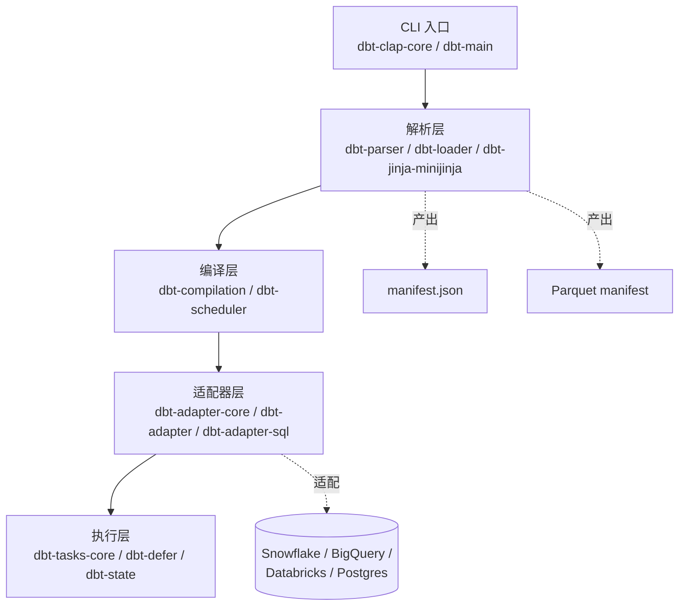
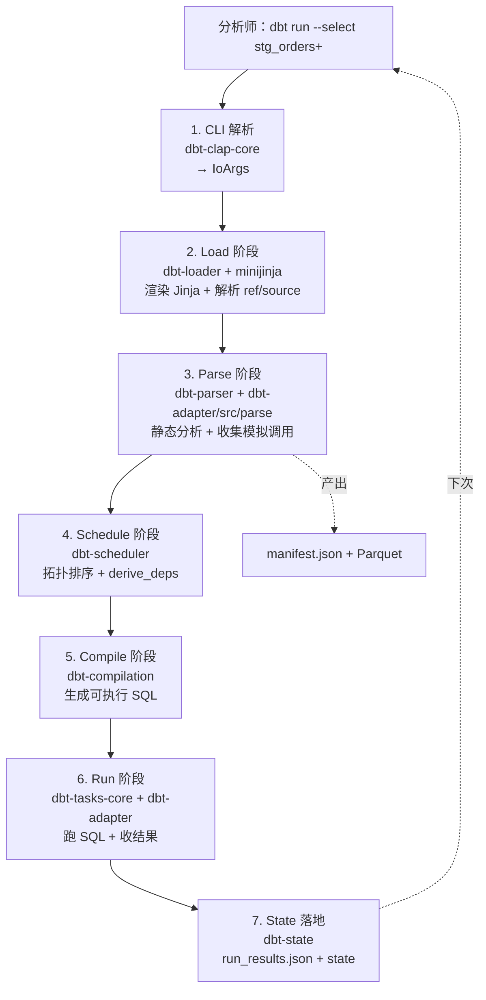

## 学习目标

完成本文阅读后，你将能够：

1. 说出 dbt-core 在 ELT（Extract-Load-Transform，提取-加载-转换）链路里的位置，以及它与传统 ETL 工具和 SQLMesh 等同类项目的本质差异。
2. 解释 dbt-core 的 SQL + Jinja 转换机制如何把 `select` 语句变成可追溯、可测试、可版本化的数据模型。
3. 区分 dbt-core v1（Python）与 v2.0（Rust，Fusion 引擎）的差异，识别升级路径与兼容性边界。
4. 掌握 dbt-core 的 materialization 体系（view、table、incremental、ephemeral、snapshot）在不同场景下的取舍。
5. 判断在引入 dbt-core 之前需要满足的工程前提（数据已在仓库里、有合适的适配器），以及不适合用 dbt-core 的场景。

## 目录

1. [项目定位：数据仓库里的"转换层"](#项目定位数据仓库里的转换层)
2. [核心机制：SQL + Jinja 怎么变成可追溯模型](#核心机制sql--jinja-怎么变成可追溯模型)
3. [v1 到 v2.0：从 Python 解释器到 Rust 自包含二进制](#v1-到-v20从-python-解释器到-rust-自包含二进制)
4. [系统地图：parser、scheduler、adapter 与 Fusion 引擎](#系统地图parser-scheduler-adapter-与-fusion-引擎)
5. [materialization 体系与适用取舍](#materialization-体系与适用取舍)
6. [任务流案例：dbt run 如何走完整条管线](#任务流案例dbt-run-如何走完整条管线)
7. [dbt-core vs SQLMesh：同一片市场的两条路线](#dbt-core-vs-sqlmesh同一片市场的两条路线)
8. [适用边界与采用顺序](#适用边界与采用顺序)
9. [决策清单](#决策清单)
10. [动手练习](#动手练习)
11. [自测清单](#自测清单)
12. [进阶路径](#进阶路径)

## 项目定位：数据仓库里的"转换层"

dbt-core 是 dbt-labs 维护的开源数据转换框架。仓库描述只有一句话：`dbt enables data analysts and engineers to transform their data using the same practices that software engineers use to build applications.`。这句话的关键不是"transform"，而是"same practices"——它把软件工程里成熟的模块化、版本控制、测试、CI 流水线思路，平移到 SQL 转换工作里。

它在 ELT 链路里的位置非常具体：负责 Extract 与 Load 已经完成之后、T 那一段。Fivetran / Airbyte 之类的工具把数据抽进 Snowflake / BigQuery / Databricks / Postgres 之后，dbt-core 接手做"转换"，把所有 `select` 语句组织成 dbt project，输出可重跑、可追溯、可测试的模型层。`README.md` 把这一点写成了一句话：`Analysts using dbt can transform their data by simply writing select statements, while dbt handles turning these statements into tables and views in a data warehouse.`。

截至 2026 年 6 月，dbt-core 仓库的统计数据如下：

| 指标 | 数值 |
|------|------|
| GitHub Stars | 13,268 |
| Forks | 2,440 |
| 主语言 | Rust（v2.0 / main 分支） |
| License | Apache 2.0 |
| 当前 main 分支 | dbt-core v2.0 alpha（Rust 重写，Fusion 引擎） |
| 当前最新 v1 系列 | v1.12.0b3（2026-06-15），稳定版 v1.11.11（2026-05-20） |
| 持续维护分支 | `main`（v2）、`1.latest`（v1，Python 实现） |

主分支从 Python 切到 Rust 是一个分水岭：v1 时代的 dbt-core 仍是 Python 包，需要用户自己维护 Python 运行时与适配器依赖；v2.0 的 Fusion 引擎以单一自包含二进制分发，不需要 Python 运行时、不需要依赖管理。这是 README "Easier to install" 项的实际落地。

## 核心机制：SQL + Jinja 怎么变成可追溯模型

dbt-core 的转换机制建立在三个支柱上：SQL 作为"中间产物"、Jinja 作为"模板引擎"、manifest 作为"可追溯产物"。这三者把分析师写的单个 `.sql` 文件，编译成数据仓库里可以被引用的、有元数据的关系。

### 模型（model）

每个模型对应一个 `.sql` 文件。最朴素的写法就是一条 `select`：

```sql
-- models/staging/stg_orders.sql
select
    id,
    customer_id,
    order_date,
    total_amount
from {{ source('raw', 'orders') }}
```

`{{ source('raw', 'orders') }}` 是 Jinja 模板，dbt-core 在编译阶段把它替换成数据仓库里的实际表名。这个替换过程是 dbt-core 与普通 SQL 文件最大的区别：分析师写的是"逻辑引用"，dbt-core 在 parse 阶段把逻辑引用解析成物理表名，并把解析结果记录到 `manifest.json` 里。

### 引用（ref）与源（source）

`{{ ref('stg_customers') }}` 引用同一个 dbt project 里的另一个模型。`{{ source('raw', 'orders') }}` 引用外部的源数据。这两种引用方式合在一起构成了 dbt project 的 DAG（有向无环图，Directed Acyclic Graph）：

```
sources/raw/orders  ─┐
                     ├─> stg_orders ─┐
sources/raw/customers ─┐            ├─> fct_orders
                      ├─> stg_customers
                      ...
```

`ref` 的关键副作用是它让 dbt-core 知道模型的依赖关系，从而决定 build 顺序。没有 `ref`，dbt-core 就不知道先建哪张表。`source` 的关键副作用是它让 dbt-core 知道哪些外部表需要 freshness 检查。

### schema.yml：声明式元数据

`schema.yml` 文件提供测试与文档：

```yaml
models:
  - name: stg_orders
    columns:
      - name: id
        tests:
          - unique
          - not_null
      - name: customer_id
        tests:
          - relationships:
              to: ref('stg_customers')
              field: id
```

每条 `tests` 都对应一个 Jinja 模板，在 `dbt test` 阶段被实例化成 SQL 查询，跑出来不通过就视为测试失败。这就是"测试"在 dbt-core 里的形态——它不是单元测试框架，而是把数据约束翻译成 SQL 查询。

### manifest.json：可追溯的产物

`dbt parse` 产出 `manifest.json`，记录了所有模型的依赖、配置、编译后 SQL、引用关系。`manifest.json` 是 dbt-docs、dbt-cloud、IDE 插件、CIP 系统的共同语言。它让"谁依赖谁、上次 build 是什么时候、某列是否被测试覆盖"变成可以查询的事实，而不是藏在分析师脑子里的隐式知识。

## v1 到 v2.0：从 Python 解释器到 Rust 自包含二进制

README 在 2026 年 6 月明确写了一行迁移警告：`dbt Core v1 development has moved to the 1.latest branch. The main branch now hosts dbt Core v2.0 (alpha) — a ground-up rewrite in Rust that is the foundation of the Fusion engine.`。这一行背后是四件事：

1. **更快**。v2.0 在 parse 与 compile 阶段做了重写，特别在大规模 dbt project 上（数千模型量级）把启动时间压缩到 v1 的零头。`crates/dbt-parser` 与 `crates/dbt-compilation` 是这次重写的核心。
2. **更严格**。v2.0 引入了一个明确规定的 dbt 语言规范，错误在 parse 阶段就报，而不是延迟到 run 阶段。
3. **可扩展的产物**。v2.0 默认产出 Parquet 格式的 manifest 工件（`crates/dbt-metadata-parquet`），保留 JSON manifest 作为兼容。Parquet 格式让 manifest 本身可以被 DuckDB、Spark、Polars 直接查询。
4. **更易安装**。v2.0 以单一自包含二进制分发，不再依赖 Python 运行时，也不需要管理 `dbt-core` + `dbt-snowflake` + `dbt-bigquery` 这一长串包。

主分支目前的语言统计已经显示 Rust 占据了绝对主导：

```
Language: Rust (~95% 仓库行数, 含 minijinja 子模块)
```

仓库根目录的 `Cargo.toml` 是一个 673 行的 workspace manifest，列出 70+ 个 crates，从 `dbt-parser` 到 `dbt-docs-server` 各司其职。

## 系统地图：parser、scheduler、adapter 与 Fusion 引擎

dbt-core v2.0 的 crates 大致分成四个层级。下图是仓库根目录观察得到的事实，不是文档承诺：

```
┌────────────────────────────────────────────────────────────────┐
│                       入口与 CLI (dbt-clap-core, dbt-main)       │
│   kc.sh start-dev → 解析命令行 → 选择 IoArgs → 调度编译/执行任务   │
└────────────────────────────────────────────────────────────────┘
                                │
                                ▼
┌────────────────────────────────────────────────────────────────┐
│  解析层 (dbt-parser, dbt-loader, dbt-jinja/minijinja)            │
│   扫描源文件 → 渲染 Jinja → 收集 ref/source/macro → 产出 manifest  │
│   ★ Fusion 引擎在 parse 阶段就把 SQL 静态分析做完                   │
└────────────────────────────────────────────────────────────────┘
                                │
                                ▼
┌────────────────────────────────────────────────────────────────┐
│  编译层 (dbt-compilation, dbt-scheduler)                          │
│   生成 DAG → 拓扑排序 → 按依赖顺序调度节点 → 产出 Schedule         │
│   ★ Scheduler 把"哪些节点要跑"与"按什么顺序跑"显式建模               │
└────────────────────────────────────────────────────────────────┘
                                │
                                ▼
┌────────────────────────────────────────────────────────────────┐
│  适配器层 (dbt-adapter-core, dbt-adapter, dbt-adapter-sql)        │
│   抽象 Adapter / Connection / Relation → 落地到具体数据仓库        │
│   Snowflake / BigQuery / Databricks / Postgres / Redshift …     │
└────────────────────────────────────────────────────────────────┘
                                │
                                ▼
┌────────────────────────────────────────────────────────────────┐
│  执行层 (dbt-tasks-core, dbt-defer, dbt-state)                    │
│   真实执行 SQL → 收集 run_results → 写入 state / Parquet manifest  │
└────────────────────────────────────────────────────────────────┘
```

dbt-core v2.0 的 crates 大致分成四个层级。下图是仓库根目录观察得到的事实，不是文档承诺：



下面这几条是 v2.0 与 v1 在结构上的关键差异：

- **minijinja 替代 jinja2**。`crates/dbt-jinja` 目录里嵌入的是 minijinja（基于 `serde` 的 Rust 模板引擎），不再走 Python 的 `jinja2`。这让 parse 阶段可以直接在 Rust 里渲染 Jinja，避免跨语言调用的开销。
- **Parse 阶段跑 SQL 静态分析**。`crates/dbt-adapter/src/parse/adapter.rs` 里有一个 `ParseAdapterState`，里面收集了 `call_get_relation`、`call_get_columns_in_relation` 这种解析期对 adapter 的"模拟调用"。Fusion 引擎在 parse 阶段就把这些调用记下来，run 阶段才真正去打数据仓库，节省了大量冷启动时间。
- **Parquet metadata 副产物**。`crates/dbt-metadata-parquet` 与 `dbt-metadata` 平级存在。Parquet 文件既能 join 也能查询，是"把 dbt project 自身当成一个可分析的数据集"的入口。

## materialization 体系与适用取舍

dbt-core 的"materialization"是把逻辑模型变成物理表的过程。同一个 `select` 语句可以按不同策略落地，五种内置策略对应五种典型场景：

| 策略 | 落地方式 | 适用场景 | 代价 |
|------|----------|----------|------|
| `view` | 每次查询实时执行 | 轻量模型、需要"实时看到最新源数据" | 查询性能受源表影响 |
| `table` | build 时落地为物理表 | 中间层与最终指标层，需要稳定查询性能 | 每次 build 全量重算 |
| `incremental` | 只处理新增/变更行 | 大表、append-only 或近 append-only | 需要 unique key 与过滤条件；merge 时需要数据库支持 |
| `ephemeral` | 不落地，被引用时 inline 成 CTE | 共用逻辑片段、不希望污染 schema | 不能直接 select；调试困难 |
| `snapshot` | 用 Type-2 SCD（缓慢变化维）记录历史变更 | 需要追踪"昨天的状态" | 增加存储与查询复杂度 |

一个常见但容易出错的认知是"先 table 再 incremental"。正确的顺序是反过来：先用 `view` 验证逻辑，再切 `table` 验证数据规模，最后在确认源数据支持增量模式后再切 `incremental`。`incremental` 看起来像性能银弹，但一旦源数据不支持时间戳分区或 unique key 不稳定，回填成本远高于一次性 `table`。

## 任务流案例：dbt run 如何走完整条管线

下面以"分析师跑一次 `dbt run --select stg_orders+`"为例，按仓库内 crates 的真实职责把流程拆开：



这条流水线里，parse 阶段是 v2.0 最大的优化点。在 v1 里，parse 阶段要等 Python 解释器启动 + 加载所有 Python 适配器；v2.0 用 minijinja + Rust adapter parse 状态把这一步压到秒级。

## dbt-core vs SQLMesh：同一片市场的两条路线

把 dbt-core 单独介绍很难讲清楚它的市场定位。SQLMesh 是这条赛道里另一个值得对比的项目，二者面向同一类用户（数据分析师 + 数据工程师），但工程思路完全不同。

| 维度 | dbt-core | SQLMesh |
|------|----------|---------|
| 模板层 | Jinja / minijinja | 原生 Python |
| 元数据 | manifest.json + Parquet (v2) | 内置 catalog 与 audit log |
| 虚拟环境（dev / prod 隔离） | 通过 target schema 模拟 | 一等公民，每个 environment 独立 catalog |
| 增量策略 | 写在 materialization config 里 | 显式 `INCREMENTAL BY` DSL |
| 主语言 | Python (v1) → Rust (v2) | Python |
| License | Apache 2.0 | Apache 2.0 |
| 适配器生态 | 极其丰富（Snowflake / BigQuery / Databricks / Redshift / Postgres / Spark / …） | 略少，覆盖主流仓库 |

如果团队已经在用 dbt，迁移到 SQLMesh 的成本几乎为零；如果团队从零开始做数据建模，需要在"更成熟的生态与文档（dbt）"和"更现代的工程模型（SQLMesh）"之间做选择。两者都是 Apache 2.0，都不会被锁死，但模型层与生态层的迁移成本不同。

## 适用边界与采用顺序

dbt-core 解决的是数据已经在仓库里、需要可追溯转换的场景。它不解决：把数据搬进仓库（这是 Fivetran / Airbyte 的工作）、跑流式任务（这是 Flink / Spark Streaming 的工作）、做机器学习特征工程（这是 Featureform / Tecton 的工作）。下面把"什么时候用 dbt-core"和"什么时候不要用"列出来：

**适合 dbt-core 的场景**

- 数据已经进入数据仓库，需要把它组织成可重跑、可测试、可版本化的模型层。
- 分析师团队需要自助写 SQL，又需要这些 SQL 能被 review、CI、测试。
- 工程团队已经把 source / ref 这样的依赖关系当成"一等公民"来治理。
- 数据规模在 single warehouse 集群可承载的范围内（dbt-core 不做跨仓 join）。

**不适合 dbt-core 的场景**

- 数据还没进仓库——需要先解决抽取与加载。
- 需要做实时/流式转换——dbt-core 的设计假设是 batch schedule。
- 一个 SQL 就要扫 50+ 张源表——dbt-core 的 ref / source 抽象在这种"巨型单文件模型"里会变成负担。
- 没有工程团队能维护 adapter / profile / CI——dbt-core 的收益完全建立在"工程实践"上，没有工程实践 dbt-core 只是一个跑 SQL 的脚本。

**采用顺序建议**

1. 先在一个小型数据仓库上跑通 `dbt init` + `dbt run` + `dbt test` 的最小闭环。
2. 把 source / ref / schema.yml 这些"治理类"配置补齐，再开始堆模型。
3. 引入 `dbt docs` 与 CI（GitHub Actions 跑 `dbt build`），让 PR 强制过测试。
4. 在 v1.11 / v1.12 上验证适配器稳定性；如果规模到了数千模型，再考虑迁到 v2.0 Fusion 引擎。

## 决策清单

把"是否在项目里引入 dbt-core"压缩成五问：

- [ ] 数据已经进数据仓库（ELT 中的 L 已经完成）？
- [ ] 有适配器覆盖目标仓库（Snowflake / BigQuery / Databricks / Postgres …）？
- [ ] 分析师愿意把 SQL 写进 `.sql` 文件并接受 Jinja 模板？
- [ ] 工程团队愿意维护 `profiles.yml`、`dbt_project.yml` 与 CI 配置？
- [ ] 团队没有把 dbt-core 当成"实时流式转换"工具的预期？

五个全勾，再决定采用 dbt-core。任意一项打勾不到，意味着先要补齐前置条件。

## 动手练习

下面三条练习覆盖 dbt-core 的核心机制，从最小可运行到接近生产配置：

1. **最小 dbt project**。在本地用 DuckDB profile 起一个 dbt project，写一个 `stg_orders.sql` 包含 `{{ source('raw', 'orders') }}`，跑通 `dbt parse` 与 `dbt run`，检查 `target/manifest.json` 里的 `sources` 与 `models` 节点。
2. **DAG 与依赖**。在 project 里加 `stg_customers` 与 `fct_orders`，让后者 `ref` 前两者；跑 `dbt ls --select +fct_orders` 与 `dbt run --select +fct_orders`，观察拓扑顺序。
3. **incremental 策略对比**。对同一张大表，分别写 `materialized='table'` 与 `materialized='incremental'`，比较 `dbt run` 第二次执行的耗时与 `target/run_results.json` 里的执行时间字段。

## 自测清单

完成上述练习后，对照下列检查点自查：

- [ ] 能解释 `ref` 与 `source` 在 DAG 里分别承担什么角色。
- [ ] 能说出 v1 与 v2.0 在 parse 阶段的三条核心差异。
- [ ] 能区分 `view` / `table` / `incremental` / `ephemeral` / `snapshot` 的适用场景。
- [ ] 能解释 `manifest.json` 在 dbt project 里承担的可追溯职责。
- [ ] 能说出 dbt-core 与 SQLMesh 的两条工程路线差异。

## 进阶路径

完成基础学习后，按下列顺序深入：

1. **dbt-utils 与 dbt-expectations**。包管理是 dbt 生态的核心扩展机制，官方包与社区包是日常生产的标配。
2. **state:modified+ 与 defer**。理解 dbt-core 的增量构建与跨环境复用 state，是把 CI 时间压下来的关键。
3. **自定义 materialization**。在 `macros/` 里写自己的 materialization 是 dbt-core 留给团队的最大灵活性出口。
4. **迁移到 v2.0 Fusion**。先在 dev project 上把 v2.0 alpha 跑起来，验证 adapter 兼容性与 manifest Parquet 副产物的下游消费者是否就绪。
5. **dbt-cloud 与 dbt-metricflow**。一旦模型层稳定，下一步是指标语义层（MetricFlow）与 CI/CD 编排（dbt Cloud / dbt-airflow 等）。