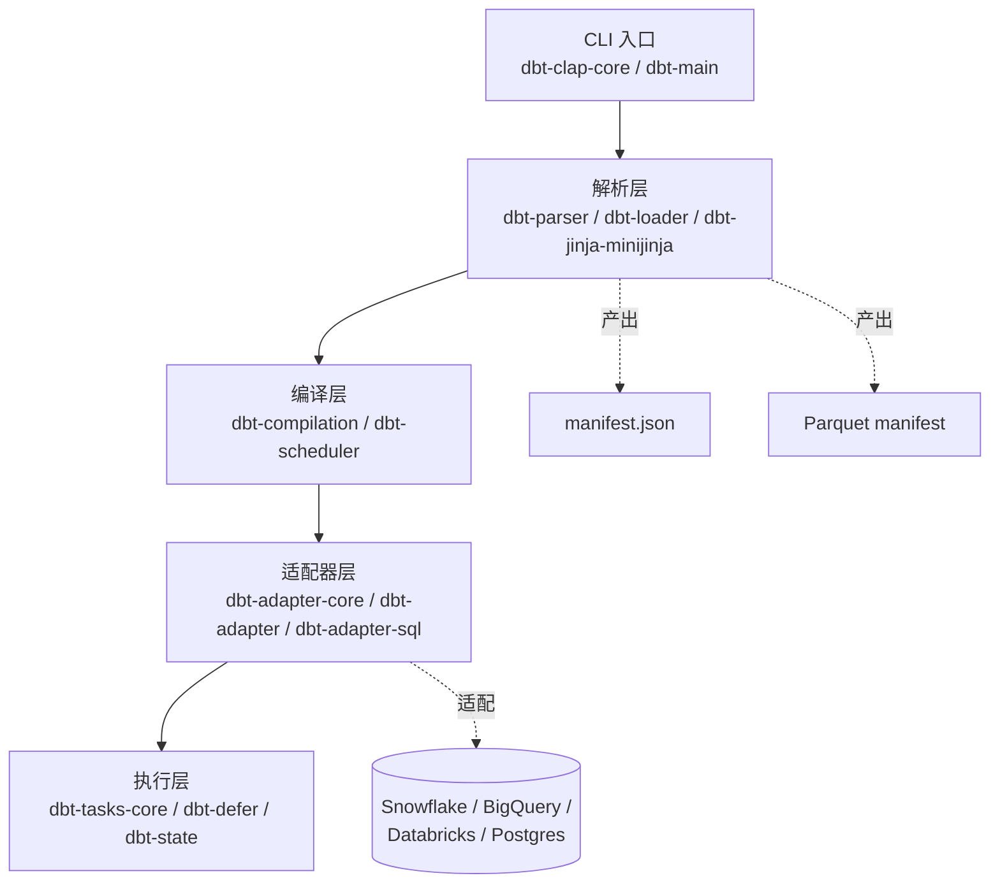
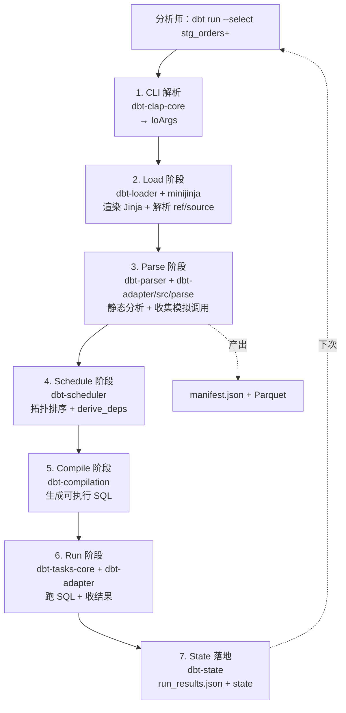

## 项目定位：数据仓库里的"转换层"

dbt-core 的仓库描述只有一句话：dbt enables data analysts and engineers to transform their data using the same practices that software engineers use to build applications。它把软件工程里成熟的模块化、版本控制、测试、CI 流水线做法，搬进 SQL 转换工作里。

它在 ELT 链路里占的是 T 这一段。Fivetran / Airbyte 把数据抽进 Snowflake / BigQuery / Databricks / Postgres 之后，dbt-core 接手把一堆 select 语句组织成一个 dbt project，输出可重跑、可测试、可版本化的模型层。README 把它写成一句话：Analysts using dbt can transform their data by simply writing select statements, while dbt handles turning these statements into tables and views in a data warehouse。

GitHub API 2026-08-05 验证的仓库基本数据：

| 指标 | 数值 |
|------|------|
| GitHub Stars | 13,569 |
| Forks | 2,489 |
| 主语言 | Rust（v2.0 / main 分支） |
| License | Apache 2.0 |
| 默认分支 | main（v2.0 alpha） |
| 持续维护分支 | main（v2）、1.latest（v1，Python 实现） |

main 分支已经从 Python 切到 Rust。v1 时代的 dbt-core 是 Python 包，要自己维护 Python 运行时和适配器依赖；v2.0 的 Fusion 引擎以单一自包含二进制分发，不依赖 Python 运行时，也不用管 dbt-snowflake 那一串包。这就是 README "Easier to install" 那条的实际落地。

## SQL + Jinja 怎么变成可追溯模型

dbt-core 的转换建立在三根支柱上：SQL 作为中间产物、Jinja 作为模板引擎、manifest 作为可追溯产物。

### 模型（model）

每个模型对应一个 `.sql` 文件。最朴素的形式就是一条 select：

```sql
-- models/staging/stg_orders.sql
select
    id,
    customer_id,
    order_date,
    total_amount
from {{ source('raw', 'orders') }}
```

`{{ source('raw', 'orders') }}` 是 Jinja 模板，编译阶段被替换成数据仓库里的实际表名。这是 dbt-core 和普通 SQL 文件的区别：分析师写的是逻辑引用，dbt-core 在 parse 阶段把逻辑引用解析成物理表名，把结果记进 manifest.json。

### 引用（ref）与源（source）

`{{ ref('stg_customers') }}` 指同一个 dbt project 里的另一个模型，`{{ source('raw', 'orders') }}` 指外部的源数据。两种引用合起来构成 dbt project 的 DAG：

```
sources/raw/orders  ─┐
                     ├─> stg_orders ─┐
sources/raw/customers ─┐            ├─> fct_orders
                      ├─> stg_customers
                      ...
```

ref 的作用是让 dbt-core 知道模型之间的依赖，从而决定 build 顺序；没有 ref，它就不知道先建哪张表。source 的作用是让 dbt-core 知道哪些外部表需要 freshness 检查。

### schema.yml：声明式元数据

schema.yml 提供测试与文档：

```yaml
models:
  - name: stg_orders
    columns:
      - name: id
        tests:
          - unique
          - not_null
      - name: customer_id
        tests:
          - relationships:
              to: ref('stg_customers')
              field: id
```

每条 tests 都对应一个 Jinja 模板，在 dbt test 阶段被实例化成 SQL 查询，跑不通过就是测试失败。这里的"测试"不是单元测试框架，而是把数据约束翻译成 SQL 查询。

### manifest.json：可追溯的产物

dbt parse 产出 manifest.json，记录所有模型的依赖、配置、编译后 SQL、引用关系。它是 dbt-docs、dbt-cloud、IDE 插件、CI 系统的共同语言。谁依赖谁、上次 build 是什么时候、某列有没有被测试覆盖，都变成可查询的事实，而不是藏在分析师脑子里的隐式知识。

## v1 到 v2.0：从 Python 包到 Rust 自包含二进制

README 顶部挂着一条迁移警告：dbt Core v1 development has moved to the 1.latest branch. The main branch now hosts dbt Core v2.0 (alpha) — a ground-up rewrite in Rust that is the foundation of the Fusion engine。它背后是四件事：

1. **更快**。v2.0 重写了 parse 与 compile 阶段，在数千模型量级的大 project 上把启动时间压到 v1 的零头。crates/dbt-parser 与 crates/dbt-compilation 是这次重写的核心。
2. **更严格**。v2.0 引入了一个定义明确的 dbt 语言规范，错误在 parse 阶段就报，不拖到 run 阶段。
3. **可扩展的产物**。v2.0 默认产出 Parquet 格式的 manifest（crates/dbt-metadata-parquet），保留 JSON manifest 做向后兼容。Parquet 让 manifest 本身可以被 DuckDB、Spark、Polars 直接查询。
4. **更易安装**。v2.0 以单一自包含二进制分发，不再依赖 Python 运行时，也不用管理 dbt-core + dbt-snowflake + dbt-bigquery 这一长串包。

main 分支的语言统计里 Rust 占绝对主导，仓库根目录的 Cargo.toml 是一个大型 workspace manifest，列出 70+ 个 crates。

## 系统地图：四条 crates 层级

以下是按仓库当前结构观察的分层，是结构事实，不是文档承诺：


```mermaid
flowchart TB
    A[CLI 入口<br/>dbt-clap-core / dbt-main] --> B[解析层<br/>dbt-parser / dbt-loader / dbt-jinja-minijinja]
    B --> C[编译层<br/>dbt-compilation / dbt-scheduler]
    C --> D[适配器层<br/>dbt-adapter-core / dbt-adapter / dbt-adapter-sql]
    D --> E[执行层<br/>dbt-tasks-core / dbt-defer / dbt-state]

    B -.产出.-> M1[manifest.json]
    B -.产出.-> M2[Parquet manifest]
    D -.适配.-> DW[(Snowflake / BigQuery /<br/>Databricks / Postgres)]
```

v2.0 和 v1 在结构上的关键差异：

- **minijinja 替代 jinja2**。crates/dbt-jinja 里嵌入的是 minijinja（基于 serde 的 Rust 模板引擎），parse 阶段可以直接在 Rust 里渲染 Jinja，省掉跨语言调用。
- **parse 阶段跑 SQL 静态分析**。crates/dbt-adapter/src/parse/adapter.rs 里有一个 ParseAdapterState，收集 call_get_relation、call_get_columns_in_relation 这类解析期对 adapter 的"模拟调用"。Fusion 引擎在 parse 阶段记下这些调用，run 阶段才真正去打数据仓库，省下大量冷启动时间。
- **Parquet metadata 副产物**。crates/dbt-metadata-parquet 与 dbt-metadata 平级。Parquet 文件能 join 也能查询，是"把 dbt project 自身当一个可分析数据集"的入口。

## materialization 五种策略

materialization 是把逻辑模型变成物理表的过程。同一个 select 可以按不同策略落地：

| 策略 | 落地方式 | 适用场景 | 代价 |
|------|----------|----------|------|
| view | 每次查询实时执行 | 轻量模型、需要实时看到最新源数据 | 查询性能受源表影响 |
| table | build 时落地为物理表 | 中间层与最终指标层，需要稳定查询性能 | 每次 build 全量重算 |
| incremental | 只处理新增/变更行 | 大表、append-only 或接近 append-only | 需要 unique key 与过滤条件；merge 依赖数据库支持 |
| ephemeral | 不落地，被引用时 inline 成 CTE | 共用逻辑片段、不希望污染 schema | 不能直接 select；调试困难 |
| snapshot | 用 Type-2 SCD（缓慢变化维）记录历史变更 | 需要追踪昨天的状态 | 增加存储与查询复杂度 |

先用 view 验证逻辑，再切 table 看数据规模，最后确认源数据支持增量模式后再切 incremental，这个顺序更稳。incremental 一旦遇到源数据不支持时间戳分区、unique key 不稳定，回填成本远高于一次性 table。

## 任务流案例：dbt run 走完整条管线

以跑一次 `dbt run --select stg_orders+` 为例，按 crates 的真实职责拆开：


```mermaid
flowchart TD
    S0["分析师：dbt run --select stg_orders+"]
    S0 --> S1["1. CLI 解析<br/>dbt-clap-core<br/>→ IoArgs"]
    S1 --> S2["2. Load 阶段<br/>dbt-loader + minijinja<br/>渲染 Jinja + 解析 ref/source"]
    S2 --> S3["3. Parse 阶段<br/>dbt-parser + dbt-adapter/src/parse<br/>静态分析 + 收集模拟调用"]
    S3 --> S4["4. Schedule 阶段<br/>dbt-scheduler<br/>拓扑排序 + derive_deps"]
    S4 --> S5["5. Compile 阶段<br/>dbt-compilation<br/>生成可执行 SQL"]
    S5 --> S6["6. Run 阶段<br/>dbt-tasks-core + dbt-adapter<br/>跑 SQL + 收结果"]
    S6 --> S7["7. State 落地<br/>dbt-state<br/>run_results.json + state"]

    S3 -.产出.-> M["manifest.json + Parquet"]
    S7 -.下次.-> S0
```

这条流水线里 parse 阶段是 v2.0 最大的优化点。v1 的 parse 要等 Python 解释器启动、加载所有 Python 适配器；v2.0 用 minijinja 加 Rust 的 adapter parse 状态把这一步压到秒级。

## dbt-core vs SQLMesh

SQLMesh 是这条赛道里值得对比的另一个项目，面向同一类用户，工程思路完全不同。

| 维度 | dbt-core | SQLMesh |
|------|----------|---------|
| 模板层 | Jinja / minijinja | 原生 Python |
| 元数据 | manifest.json + Parquet (v2) | 内置 catalog 与 audit log |
| 虚拟环境（dev / prod 隔离） | 通过 target schema 模拟 | 一等公民，每个 environment 独立 catalog |
| 增量策略 | 写在 materialization config 里 | 显式 INCREMENTAL BY DSL |
| 主语言 | Python (v1) → Rust (v2) | Python |
| License | Apache 2.0 | Apache 2.0 |
| 适配器生态 | 丰富（Snowflake / BigQuery / Databricks / Redshift / Postgres / Spark / …） | 略少，覆盖主流仓库 |

已经在用 dbt 的团队，迁到 SQLMesh 的成本几乎为零；从零开始做数据建模的团队，要在更成熟的生态与文档（dbt）和更现代的工程模型（SQLMesh）之间做选择。两者都是 Apache 2.0，都不会被锁死，但模型层与生态层的迁移成本不同。

## 什么时候用、什么时候别用

dbt-core 解决的是数据已经在仓库里、需要可追溯转换的场景。它不解决：把数据搬进仓库（那是 Fivetran / Airbyte 的工作）、跑流式任务（那是 Flink / Spark Streaming 的工作）、做机器学习特征工程（那是 Featureform / Tecton 的工作）。

适合用 dbt-core：

- 数据已经进入数据仓库，需要组织成可重跑、可测试、可版本化的模型层。
- 分析师团队要自助写 SQL，又希望这些 SQL 能被 review、CI、测试。
- 工程团队把 source / ref 这类依赖关系当成治理对象。
- 数据规模在 single warehouse 集群可承载的范围内（dbt-core 不做跨仓 join）。

不适合用 dbt-core：

- 数据还没进仓库——得先解决抽取与加载。
- 需要实时/流式转换——它的设计假设是 batch schedule。
- 一个 SQL 就要扫 50+ 张源表——ref / source 抽象在这种巨型单文件模型里会变成负担。
- 没有工程团队维护 adapter / profile / CI——它的收益完全建立在工程实践上，没有这套实践它只是一个跑 SQL 的脚本。

## 采用顺序

1. 先在一个小型数据仓库上跑通 dbt init + dbt run + dbt test 的最小闭环。
2. 把 source / ref / schema.yml 这些治理类配置补齐，再开始堆模型。
3. 引入 dbt docs 与 CI（GitHub Actions 跑 dbt build），让 PR 强制过测试。
4. 在 v1.11 / v1.12 上验证适配器稳定性；规模到了数千模型，再考虑迁 v2.0 Fusion 引擎。

## 常见问题 FAQ

**Q1：dbt-core v2.0 稳定吗？能上生产吗？**

A：截至 2026 年 6 月，v2.0 仍是 alpha，main 分支就是 v2.0 alpha。生产建议用 v1.11 或 v1.12 稳定版。如果规模到了数千模型、parse 阶段成为瓶颈，可以在 dev project 上先测 v2.0，确认适配器兼容性与 manifest Parquet 副产物的下游消费者就绪，再决定要不要迁。

**Q2：incremental 为什么需要 unique key？源数据没有 unique key 怎么办？**

A：incremental 只处理新增/变更行，需要一种方式判断哪些行是新的，unique key 就是判断依据。源数据没有 unique key，有几种做法：用 merge 策略加时间戳分区字段；在 source 层加自增 ID；如果确实没有任何唯一标识，只能退回 table 策略每次全量重算。

**Q3：dbt parse 和 dbt run 的区别？为什么 v2.0 的 parse 阶段这么重要？**

A：dbt parse 只做解析和 DAG 构建，不执行 SQL；dbt run 先 parse 再执行 SQL。v2.0 的 parse 阶段被重写，做 SQL 静态分析、收集 call_get_relation 这类解析期对 adapter 的模拟调用，记进 manifest。run 阶段才真正打数据仓库。这样 parse 可以纯本地完成（不连数据仓库），冷启动时间大幅压缩。

**Q4：dbt-core 能处理实时流数据吗？比如 Kafka 流？**

A：不能。它的设计假设是 batch schedule。实时流数据要用 Flink、Spark Streaming、Kafka Streams 这类工具。dbt-core 适合的场景是：流处理的结果落到数据仓库后，把它组织成可重跑、可测试、可版本化的模型层。

**Q5：manifest.json 越来越大，CI 越来越慢，怎么办？**

A：v2.0 的 Parquet manifest 就是为这个问题准备的。Parquet 让 manifest 可以被 DuckDB、Spark、Polars 直接查询，不用全量加载进内存。另外可以配置 dbt parse --select ... 只 parse 受影响的 spec。CI 上推荐用 state:modified+ 策略，只 parse 和 run 被修改过的模型。