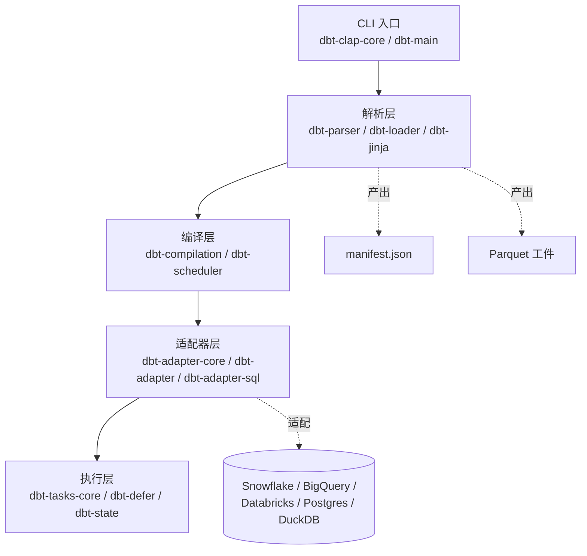
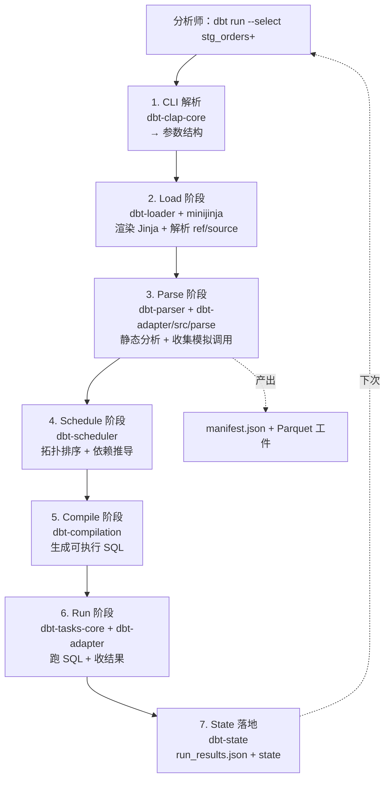

## 项目定位：数据仓库里的"转换层"

dbt 的仓库描述只有一句话：dbt enables data analysts and engineers to transform their data using the same practices that software engineers use to build applications。它把软件工程里成熟的模块化、版本控制、测试、CI 流水线做法，搬进 SQL 转换工作里。

它在 ELT（抽取-加载-转换）链路里占的是 T 这一段。Fivetran / Airbyte 把数据抽进 Snowflake / BigQuery / Databricks / Postgres 之后，dbt 接手把一堆 select 语句组织成一个 dbt project，输出可重跑、可测试、可版本化的模型层。README 把它写成一句话：Analysts using dbt can transform their data by simply writing select statements, while dbt handles turning these statements into tables and views in a data warehouse。

2026 年 9 月，这个项目完成了一次大换血，有三件事同时发生：

- **v2.0 正式发布**。main 分支是 Rust 从零重写的 v2.0，2026-09-14 发布 v2.0.0（代号 Benjamin Franklin），四天后跟进到 v2.0.5；v1 的 Python 实现挪到 1.latest 分支继续维护，最新为 v1.12.5。
- **仓库改名**。dbt-labs/dbt-core 现在是 dbt-labs/dbt，旧链接 301 重定向。
- **品牌拆分**。v2.0.0 的 changelog 记录了 CLI 品牌调整：专有发行版叫 dbt（采用 dbt 产品许可，含 dbt 专属定制），开源运行时叫 dbt-oss（Apache 2.0）。GitHub 仓库里的源码属于后者。

GitHub API 2026-10-02 验证的仓库基本数据：

| 指标 | 数值 |
|------|------|
| 仓库 | dbt-labs/dbt（原 dbt-core，旧链接 301 重定向） |
| GitHub Stars | 13,956 |
| Forks | 2,605 |
| 主语言 | Rust（占比 88.8%，main 分支） |
| License | Apache 2.0（仓库源码） |
| 默认分支 | main（v2.0，Rust 实现） |
| v1 维护分支 | 1.latest（Python 实现，最新 v1.12.5） |
| 最新 release | v2.0.5（2026-09-18） |

main 分支从 Python 切到 Rust 改变的不只是性能，还有安装和分发方式：v1 时代的 dbt Core 是 Python 包，要自己维护 Python 运行时和 dbt-snowflake 那一串适配器依赖；v2.0 以单一自包含二进制分发，不依赖 Python 运行时。

## SQL + Jinja 怎么变成可追溯模型

dbt 的转换建立在三根支柱上：SQL 作为中间产物、Jinja 作为模板引擎、manifest 作为可追溯工件。

### 模型（model）

每个模型对应一个 `.sql` 文件。最朴素的形式就是一条 select：

```sql
-- models/staging/stg_orders.sql
select
    id,
    customer_id,
    order_date,
    total_amount
from {{ source('raw', 'orders') }}
```

`{{ source('raw', 'orders') }}` 是 Jinja 模板，编译阶段被替换成数据仓库里的实际表名。这是 dbt 和普通 SQL 文件的区别：分析师写的是逻辑引用，dbt 在 parse 阶段把逻辑引用解析成物理表名，把结果记进 manifest.json。

### 引用（ref）与源（source）

`{{ ref('stg_customers') }}` 指同一个 dbt project 里的另一个模型，`{{ source('raw', 'orders') }}` 指外部源数据。两种引用合起来构成 dbt project 的 DAG（有向无环图）：

```text
sources/raw/orders ─────> stg_orders ────┐
                                         ├──> fct_orders
sources/raw/customers ──> stg_customers ─┘
```

ref 的作用是让 dbt 知道模型之间的依赖，从而决定 build 顺序；没有 ref，它就不知道先建哪张表。source 的作用是让 dbt 知道哪些外部表需要 freshness 检查。

### schema.yml：声明式元数据

schema.yml 提供测试与文档：

```yaml
models:
  - name: stg_orders
    columns:
      - name: id
        tests:
          - unique
          - not_null
      - name: customer_id
        tests:
          - relationships:
              to: ref('stg_customers')
              field: id
```

每条 tests 都对应一个 Jinja 模板，在 dbt test 阶段被实例化成 SQL 查询，跑不通过就是测试失败。这里的"测试"不是单元测试框架，而是把数据约束翻译成 SQL 查询。

### manifest.json：可追溯的工件

dbt parse 产出 manifest.json（元数据清单），记录所有模型的依赖、配置、编译后 SQL、引用关系。它是 dbt-docs、dbt-cloud、IDE 插件、CI 系统的共同语言。谁依赖谁、上次 build 是什么时候、某列有没有被测试覆盖，都变成可查询的事实，而不是藏在分析师脑子里的隐式知识。

## v1 到 v2.0：Rust 重写到底改了什么

README 顶部挂着一条迁移说明：dbt v1 development has moved to the 1.latest branch. The main branch now contains all the Apache 2.0 source code of dbt v2.0 — a ground-up rewrite of dbt in Rust。README 列出的变化有五条，前四条是性能与分发，第五条最容易被忽略：

1. **更快**。v2.0 重写 parse 与 compile 阶段，项目越大改善越明显；README 顶部的说法是 v2.0 解析、编译、运行整个 project 的时间都只是 v1 的零头。crates/dbt-parser 与 crates/dbt-compilation 是这次重写的核心。
2. **更严格**。v2.0 引入了定义明确的 dbt 语言规范，错误在 parse 阶段就报，不拖到 run 阶段。
3. **可扩展的工件**。v2.0 默认产出 Parquet 格式的工件（crates/dbt-metadata-parquet），涵盖 JSON 工件（如 manifest.json）的全部内容；JSON 工件继续产出，向后兼容。Parquet 让工件本身可以被 DuckDB、Spark、Polars 直接查询。
4. **更易安装**。v2.0 以单一自包含二进制分发，不再依赖 Python 运行时。安装走 pip（`python -m pip install dbt`）、Homebrew（`brew tap dbt-labs/dbt && brew install dbt-labs/dbt/dbt`）、curl 脚本、Windows winget / PowerShell 五条路，装完 `dbt --version` 验证，`dbt login` 登录后可解锁 VS Code 扩展的补全与行内报错。
5. **本地文档体验翻新**。dbt docs 由新工件驱动，能扩展到大型项目——crates/dbt-docs-server 的自述是"下一代 dbt docs"：`dbt docs generate` 产出纯静态站点，托管到 GitHub Pages、S3 之类的文件服务器即可，浏览器端用 DuckDB-WASM 直接查询 Parquet 工件，不再需要常驻进程。

第五条背后是一个许可结构，值得单独说清：仓库里的源码是 Apache 2.0；getdbt.com 分发的 dbt 二进制是"仓库代码 + dbt 专属定制"，采用 dbt 产品许可。Cargo.toml 里的 workspace 也印证了这一点——members 先列 Source Available 区块，私有 crate 走 COPYBARA 区块，不进开源构建。对使用者的影响是：自建、审计、二次开发看这个仓库就够；要官方支持的完整产品，装的是另一个许可的发行版。

v2.0 的 SQL 引擎还有一个底层事实：它不是从零手写的解释器，而是基于 DataFusion 的 fork（Cargo.toml 里 patch 段指向 sdf-labs/datafusion）。这解释了它为什么能跨方言理解 SQL、在查询发出前抓住无效列引用。

## 系统地图：crates 分层

main 分支的 crates 目录下有 85 个 crate，以下是按仓库当前结构观察的分层，是结构事实，不是文档承诺：


```mermaid
flowchart TB
    A[CLI 入口<br/>dbt-clap-core / dbt-main] --> B[解析层<br/>dbt-parser / dbt-loader / dbt-jinja]
    B --> C[编译层<br/>dbt-compilation / dbt-scheduler]
    C --> D[适配器层<br/>dbt-adapter-core / dbt-adapter / dbt-adapter-sql]
    D --> E[执行层<br/>dbt-tasks-core / dbt-defer / dbt-state]

    B -.产出.-> M1[manifest.json]
    B -.产出.-> M2[Parquet 工件]
    D -.适配.-> DW[(Snowflake / BigQuery /<br/>Databricks / Postgres / DuckDB)]
```

v2.0 和 v1 在结构上的三处关键差异：

- **minijinja 替代 jinja2**。crates/dbt-jinja 里嵌入的是 minijinja（基于 serde 的 Rust 模板引擎），parse 阶段直接在 Rust 里渲染 Jinja，省掉跨语言调用。
- **parse 阶段跑 SQL 静态分析**。crates/dbt-adapter/src/parse/adapter.rs 里有一个 ParseAdapterState，收集 call_get_relation、call_get_columns_in_relation 这类解析期对 adapter 的"模拟调用"。引擎在 parse 阶段记下这些调用，run 阶段才真正去打数据仓库，省下大量冷启动时间。
- **Parquet 工件是平级产物**。crates/dbt-metadata-parquet 与 dbt-metadata 平级。Parquet 文件能 join 也能查询，等于把 dbt project 自身变成一个可分析的数据集。

## 任务流案例：dbt run 走完整条管线

以跑一次 `dbt run --select stg_orders+` 为例，按 crates 的真实职责拆开：


```mermaid
flowchart TD
    S0["分析师：dbt run --select stg_orders+"]
    S0 --> S1["1. CLI 解析<br/>dbt-clap-core<br/>→ 参数结构"]
    S1 --> S2["2. Load 阶段<br/>dbt-loader + minijinja<br/>渲染 Jinja + 解析 ref/source"]
    S2 --> S3["3. Parse 阶段<br/>dbt-parser + dbt-adapter/src/parse<br/>静态分析 + 收集模拟调用"]
    S3 --> S4["4. Schedule 阶段<br/>dbt-scheduler<br/>拓扑排序 + 依赖推导"]
    S4 --> S5["5. Compile 阶段<br/>dbt-compilation<br/>生成可执行 SQL"]
    S5 --> S6["6. Run 阶段<br/>dbt-tasks-core + dbt-adapter<br/>跑 SQL + 收结果"]
    S6 --> S7["7. State 落地<br/>dbt-state<br/>run_results.json + state"]

    S3 -.产出.-> M["manifest.json + Parquet 工件"]
    S7 -.下次.-> S0
```

这条流水线里 parse 阶段是 v2.0 最大的优化点。v1 的 parse 要等 Python 解释器启动、加载所有 Python 适配器；v2.0 用 minijinja 加 Rust 的 adapter parse 状态把这一步压到秒级。

## materialization：四种内置策略加一种折中

materialization 是把逻辑模型变成物理表的过程。同一个 select 可以按不同策略落地。dbt 内置五种：

| 策略 | 落地方式 | 适用场景 | 代价 |
|------|----------|----------|------|
| view（默认） | 每次运行 `create view as` 重建视图 | 轻量模型、逻辑验证阶段，总要看到源数据最新状态 | 查询性能受源表影响，复杂逻辑反复重算 |
| table | 每次运行 `create table as` 全量重建 | 中间层与最终指标层，需要稳定查询性能 | 每次 build 全量重算 |
| incremental | 只插入或更新自上次运行以来的新行 | 大表、事件型数据 | 需要 unique key 与过滤条件；merge 依赖数据库支持 |
| ephemeral | 不落地，被引用时以 CTE（公共表表达式）内联进下游模型 | 共用逻辑片段、不希望污染 schema | 不能直接 select，调试困难 |
| materialized_view | 表与视图的折中，通常可由数据库刷新 | 查询性能与数据新鲜度都要 | 各仓库支持程度不一，dbt-snowflake 不支持 |

两个容易混淆的边界：snapshot 不是 materialization，而是独立资源类型——`dbt snapshot` 命令用 Type-2 SCD（缓慢变化维）记录源表的历史变更，配置写在 snapshots 目录而不是模型的 config 里。Python 模型（`.py`）只支持 table 和 incremental 两种策略。

策略切换的顺序一般是：先用 view 验证逻辑，数据量上来后切 table，确认源数据带可靠的时间戳或自增标识后再切 incremental。incremental 一旦遇到源数据不支持增量过滤、unique key 不稳定，回填成本远高于一次性 table。

## v2.0 的新工件生态：内置 DuckDB 与列级血缘

README 的"文档体验翻新"只是其中一项，v2.0 围绕 Parquet 工件多了一批新能力：

- **内置 DuckDB 适配器**。v2.0 自带 DuckDB 驱动（自动下载并缓存），profile 里写 `type: duckdb` 加数据库路径，就能在没有服务器、没有数据仓库的笔记本上跑通整个 project。catalogs.yml 还支持 DuckLake 与 Iceberg REST 目录，dbt 自动生成 ATTACH 语句——这是 v1 的 Python 适配器没有的能力。
- **`dbt parse --generate-info-schema`**。把项目元数据写成 `target/info_schema/v1/` 下的 Parquet 文件，用 DuckDB 就能直接列出模型、物化方式和 schema，不必启动 dbt 或连上仓库。CI 检查、审计脚本可以直接读这些文件。
- **列级血缘**。配合 `--static-analysis strict` 生成 dbt.column_lineage 文件，列与列之间的依赖关系变成可查询的表。数据血缘过去靠 manifest 里的 dependency 图近似，现在能落到列这一层。
- **静态分析前置**。引擎基于 DataFusion 跨方言理解 SQL，无效列引用、类型不匹配这类错误在查询打到数据仓库之前就报出来；VS Code 扩展把同样的分析搬进编辑器，补全和报错都是引擎级的。

这套能力的共同前提是 Parquet 工件。JSON manifest 要整块加载进内存，Parquet 可以按列读、按谓词过滤，项目元数据大到几百 MB 时差异会非常明显。

## dbt vs SQLMesh

SQLMesh 是这条赛道里值得对比的另一个项目，面向同一类用户，工程思路不同。它在 2026 年把 GitHub 组织从 TobikoData 改名为 SQLMesh，仓库现在的地址是 SQLMesh/sqlmesh，官方定位一句话是 backwards compatible with dbt。

| 维度 | dbt v2.0 | SQLMesh |
|------|----------|---------|
| 模板层 | Jinja / minijinja | 自有宏语法 + Python 模型，不用 Jinja |
| 元数据 | manifest.json + Parquet 工件 | 内置 state 与 audit log |
| 虚拟环境（dev / prod 隔离） | 通过 target schema 模拟 | 一等公民，每个 environment 独立 catalog |
| 增量策略 | 写在 materialization config 里 | 显式 model kind（INCREMENTAL_BY_TIME_RANGE 等） |
| 主语言 | Rust | Python |
| License | Apache 2.0（源码） | Apache 2.0 |
| 适配器生态 | 丰富（Snowflake / BigQuery / Databricks / Redshift / Postgres / DuckDB / …） | 略少，覆盖主流仓库 |

两个选择都不至于被锁死：都是 Apache 2.0，SQLMesh 又宣称向后兼容 dbt。差别在工程模型——dbt 的 Jinja + manifest 是"SQL 模板 + 元数据清单"的路线，SQLMesh 的虚拟环境和 plan 是"把 schema 变更当版本管理"的路线。已在用 dbt 的团队迁移成本主要在自定义 materialization 和复杂宏上；从零开始的团队要权衡的是 dbt 更成熟的生态与文档，和 SQLMesh 更彻底的环境隔离。

## 什么时候用、什么时候别用

dbt 解决的是数据已经在仓库里、需要可追溯转换的场景。它不解决：把数据搬进仓库（那是 Fivetran / Airbyte 的工作）、跑流式任务（那是 Flink / Spark Streaming 的工作）、做机器学习特征工程（那是 Featureform / Tecton 的工作）。

适合用 dbt：

- 数据已经进入数据仓库，需要一套能重跑、能测试、能纳入版本控制的模型组织方式。
- 分析师团队要自助写 SQL，又希望这些 SQL 能被 review、CI、测试。
- 工程团队把 source / ref 这类依赖关系当成治理对象。
- 数据规模在 single warehouse 集群可承载的范围内（dbt 不做跨仓 join）。

不适合用 dbt：

- 数据还没进仓库——得先解决抽取与加载。
- 需要实时/流式转换——它的设计假设是 batch schedule。
- 一个 SQL 就要扫 50+ 张源表——ref / source 抽象在这种巨型单文件模型里会变成负担。
- 没有工程团队维护 adapter / profile / CI——它的收益完全建立在工程实践上，没有这套实践它只是一个跑 SQL 的脚本。

## 采用顺序

1. 新项目直接从 v2.0.5 开始：装二进制，`dbt init` 建项目，跑通 `dbt run` + `dbt test` 的最小闭环。想零依赖试水，profile 用 `type: duckdb`，笔记本上就能跑。
2. 把 source / ref / schema.yml 这些治理类配置补齐，再开始堆模型。
3. 引入 dbt docs（v2 是静态站点，扔到对象存储即可）与 CI：`dbt build --select state:modified+ --state <上次工件的目录> --defer`，PR 只构建改动节点及其下游。
4. 存量 v1 project 不用急。v1.12 提供 `dbt parse --use-v2-parser`，可以先在 CI 里并行跑 v2 解析器验证兼容性，再配合 dbt-autofix 做迁移；v1.12.5 在 1.latest 分支持续维护，短期留在 v1 没有风险。

## 常见问题 FAQ

**Q1：v2.0 稳定吗？能上生产吗？**

A：v2.0.0 已于 2026-09-14 正式发布（代号 Benjamin Franklin），到 9 月 18 日已连发 5 个 patch（最新 v2.0.5）。新项目直接从 v2.0.x 开始。存量 v1 大项目的迁移路径见"采用顺序"第 4 条：先用 `dbt parse --use-v2-parser` 验证解析兼容性，确认适配器与下游消费者（读 manifest.json 的脚本、BI 工具）就绪后再切。

**Q2：incremental 为什么需要 unique key？源数据没有 unique key 怎么办？**

A：incremental 只处理新增/变更行，需要一种方式判断哪些行是新的，unique key 就是判断依据。源数据没有 unique key，有几种做法：用 merge 策略加时间戳分区字段；在 source 层加自增 ID；如果确实没有任何唯一标识，只能退回 table 策略每次全量重算。

**Q3：dbt parse 和 dbt run 的区别？为什么 v2.0 的 parse 阶段这么重要？**

A：dbt parse 只做解析和 DAG 构建，不执行 SQL；dbt run 先 parse 再执行 SQL。v2.0 的 parse 阶段被重写，做 SQL 静态分析、收集 call_get_relation 这类解析期对 adapter 的模拟调用，记进工件。run 阶段才真正打数据仓库。这样 parse 可以纯本地完成（不连数据仓库），冷启动时间大幅压缩。

**Q4：dbt 能处理实时流数据吗？比如 Kafka 流？**

A：不能。它的设计假设是 batch schedule。实时流数据要用 Flink、Spark Streaming、Kafka Streams 这类工具。dbt 适合的场景是：流处理的结果落到数据仓库后，把它组织成可重跑、可测试、可版本化的模型层。

**Q5：manifest.json 越来越大，CI 越来越慢，怎么办？**

A：三条路，按项目规模递进。第一，v2.0 的 Parquet 工件就是为这个问题准备的：`dbt parse --generate-info-schema` 把元数据写成 `target/info_schema/v1/` 下的 Parquet，审计和检查脚本用 DuckDB 按列读取，不用全量加载 JSON。第二，CI 上用 slim CI（只构建改动部分）模式：`dbt build --select state:modified+ --state <上次工件> --defer`，只构建改动节点及其下游，上游引用 defer 到生产环境。第三，dbt docs generate 产出的静态站点同样基于 Parquet 工件，浏览器端 DuckDB-WASM 按需查询，服务端不再需要维护大 JSON 的加载。
