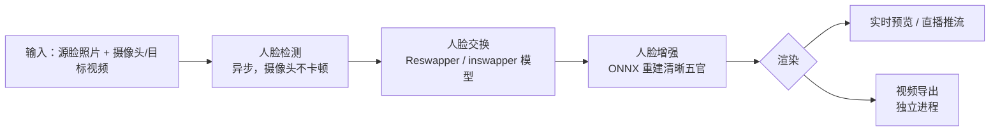

## 判断：它把「深度伪造」压成了「一张照片 + 三步」

[Deep-Live-Cam](https://github.com/hacksider/Deep-Live-Cam) 真正解决的不是换脸本身——换脸模型早已存在。它解决的是**上手成本**：不需要针对目标人物训练、不需要跑几小时批处理，一张人脸照片、选个摄像头、点一下 Live，就能在实时画面里换脸。这个「实时」和「零训练」是它和其他换脸项目分野的地方。

| 指标 | 数值 |
|------|------|
| GitHub Stars | 95,780 |
| Forks | 13,976 |
| 最新版本 | 2.7 Ultimate（2026-08-01） |
| License | AGPL-3.0 |
| 语言 | Python |
| 默认分支 | main |
| 官网 | https://deeplivecam.net/ |

> Real-time face swap and video deepfake with a single click and only a single image.

项目官方定位是「面向 AI 生成媒体产业的生产工具」，同时内置了内容审核和人脸授权要求。这一点在文末道德边界部分展开。

## 系统地图：一层检测，一层交换，一层增强

Deep-Live-Cam 的实时管线是四段接力，这里先给全貌，再逐段拆：



理解这条链路的关键在前两段：**检测负责找到画面里的人脸在哪，交换负责把源脸贴上去**。增强是可选的收尾，让贴上去的脸在光线、清晰度上更接近目标画面。2.7 重写把这四段里最重的依赖全部换掉了，后面单独讲。

## 零训练的代价与原理

「零训练」不是没有模型，而是没有**针对目标人物的训练**。Deep-Live-Cam 依赖预训练的通用人脸交换模型（`inswapper_128`，2.7 新增了 `Reswapper`），它已经学会「把一张脸的人脸特征迁移到另一张脸上」这件事，运行时只需要输入源脸和目标画面，不需要为某个特定的人重新拟合。

代价有两处，值得知道：

- **相似度上限**：通用模型对「源脸照片清晰、目标画面光照接近」的输入效果最好。角度、光线、遮挡差太多时，交换结果会露怯。
- **它不是身份克隆**：它换的是「脸的特征」，不是「照片级身份重建」。电影级换脸靠的是另一套逐帧精修的流程，不是这个工具的定位。

## 2.7 Ultimate：一次把重依赖清空的彻底重写

2026-08-01 发布的 2.7 Ultimate 是项目历史上最大的更新，官方称新增约 35,000 行代码，核心方向是**去掉笨重的训练框架，让安装更小、启动更快、内存更低**：

- 移除了 **PyTorch、TensorFlow、InsightFace、GFPGAN** 这些重依赖。
- NVIDIA 集成 **TensorRT** 加速，官方称最高 3 倍提速、无画质损失。
- 人脸增强（Face Enhancer）完全重构到 **ONNX** 上。
- 支持**批量多脸推理**（一次换多张脸）和**异步人脸检测**（摄像头不因检测阻塞）。
- 新增 **Flux Live**（用文字提示编辑人脸）、**RTX Upscaler**（GPU 锐化）、实时帧插值。
- UI 换成 **PyQt6**，支持 5 种语言（英、阿、法、日、中），保留 Classic View 给老用户。

值得强调的取舍：**重写换来的不是效果质的飞跃，而是分发和部署的省心**。把 TensorRT 和 ONNX 做进预构建包后，用户不用再手动装 CUDA、配 PyTorch。官方也顺势把下载入口集中到了官网（[deeplivecam.net quickstart](https://deeplivecam.net/index.php/quickstart)），Ultimate 版带 30+ 独有功能。

### 版本状态要分开看

一个容易混淆的点：**README 手动安装流程仍标注 2.1.6**，而 GitHub 最新 Release 是 2.7 Ultimate。这意味着：

- **预构建包**（Lite / Ultimate）走的是 2.7 新管线，从官网下载，零手动配置。
- **源码手动安装**（`git clone` + `pip install`，下文详解）对应的是 README 里较旧的 2.1.6 流程，仍依赖 InsightFace 这条老链路。

如果你要的是「开箱即用」，直接走预构建；如果你要的是「能改源码、能看清内部」，才值得走手动安装那条较旧路径。

## 一次实时换脸怎么流过系统

以最常见的 Webcam 场景为例，整个流程是：

```text
1. 选一张源脸照片（人脸清晰、正对镜头效果最好）
2. 选摄像头设备
3. 点 Live，等待预览出现（官方口径 10-30 秒，主要是首次加载模型）
4. 检测层异步追踪画面里的每一张脸
5. 交换层把源脸贴到检测到的人脸上
6. 增强层可选地重建五官清晰度
7. 预览画面实时显示，用 OBS 等屏幕捕获工具推流
```

换一张源脸，只需再选新的源照片，不需要重新加载整套环境。这就是「一张照片」能持续复用、而成本不随时长增长的原因——模型只加载一次，交换逐帧复用。

## 安装与运行：两条路各适合谁

### 预构建版（推荐大多数人）

从 [deeplivecam.net quickstart](https://deeplivecam.net/index.php/quickstart) 下载与硬件匹配的包：

| 平台 | 说明 |
|------|------|
| Windows | 一键安装包，含 NVIDIA / AMD（DirectML） |
| Mac Silicon | Apple Silicon 专用 |
| CPU | 无需显卡，纯 CPU 跑 |
| NVIDIA | 含 RTX 50 系，2.7 走 TensorRT |

官方对「有 GPU」和「没 GPU」做了区分：Ultimate 预构建针对硬件优化，CPU 版也能跑但慢。

### 源码手动安装（适合要改源码的人）

环境要求：Python 3.11–3.14（README 推荐 3.14）、pip、git、ffmpeg。

```bash
git clone --depth 1 https://github.com/hacksider/Deep-Live-Cam.git
cd Deep-Live-Cam
python -m venv venv && source venv/bin/activate
pip install -r requirements.txt
```

模型文件需要手动放入 `models/` 文件夹，从 HuggingFace 下载：

- `GFPGANv1.4.onnx`
- `inswapper_128_fp16.onnx`

首次运行会下载模型（约 300 MB）。GPU 加速按硬件选执行 Provider：

```bash
python run.py --execution-provider cuda        # NVIDIA
python run.py --execution-provider coreml      # Apple Silicon
python run.py --execution-provider directml    # Windows AMD
python run.py --execution-provider openvino    # Intel
```

命令行参数（`-s/--source`、`-t/--target`、`-o/--output`、`--keep-fps`、`--keep-audio`、`--many-faces`、`--mouth-mask` 等）在 README 中被标注为 **Unmaintained**——官方明确 GUI 是主入口，CLI 只保证能用，不保证持续维护。依赖这个做自动化的人应当预期它可能随版本变化。

## 性能：能读出的和不能推出的

2.7 官方给出的是定性口径，没有完整 benchmark 表：TensorRT 加速「最高 3 倍、无画质损失」，异步人脸检测解决「摄像头卡顿」，批量推理让「一次换多张脸」更快。

这里要提醒两点：

- **「最高 3 倍」是官方 release notes 的声明，不是第三方基准**。它没有说明在什么显卡、什么分辨率、什么帧率下测得，不能直接推出「我的机器一定快 3 倍」。
- **「实时」是个体验词，不是硬指标**。新手在低端核显 CPU 上首次加载模型要等，帧率也可能掉到不流畅。它对「能不能实时」的判断，取决于你的硬件和画面复杂度。

一个更稳的预期：**这台工具的价值在「输入到结果的时间差」，而不是「单帧画质」**。它面向创作流程里的即时反馈，不面向需要逐帧精修、光线合成的专业后期。

## 与常见换脸方案的分界

| 方案 | 针对人物训练 | 实时 | 上手成本 |
|------|------------|------|---------|
| Deep-Live-Cam | 否，零训练 | 是 | 低（预构建包） |
| 传统训练式换脸 | 是，需大量数据 | 否，批处理 | 高 |
| 电影级逐帧精修 | 视流程而定 | 否 | 很高 |

这个分界解释了它的热度来源：它把原本需要「训练 + 批处理」的重活，压缩成了「一张照片 + 实时预览」。代价是上限不如逐帧精修，但大幅拉低了准入门槛。

## 功能与应用场景

项目内置的能力集中在实时创作上：

| 功能 | 说明 |
|------|------|
| Mouth Mask | 保留原始嘴型，唱歌、说话时口型更准 |
| Face Mapping | 多个人物分别用不同的人脸 |
| Many Faces | 替换画面中出现的所有人脸 |
| Movie Mode | 实时看电影，替换主角脸 |
| Live Show | 结合 OBS 做直播表演 |

典型用法覆盖：Meme 创作、虚拟主播实时换脸、Zoom/Teams 视频通话、电影角色扮演、虚拟形象生成。所有场景都建立在那条「实时 + 零训练」的管线上。

## 道德边界：内置审核与使用责任

作为深度伪造工具，它的合规边界是文章绕不开的部分，官方在 README 开头明确写了三件事：

- **内置内容审核**：程序自带检查，拦截裸体、暴力画面、战争 footage 等不当素材。
- **真人授权**：使用真人的脸必须获得其同意，线上分享深度伪造内容必须明确标注。
- **合规立场**：项目遵循法律与伦理，若法律要求，可能关闭项目或给输出加水印。

> We are aware of the potential for unethical applications and are committed to preventative measures. We may shut down the project or add watermarks if legally required.

需要说清楚：**内置审核防的是明显违禁内容，防不住「用某个熟人的脸做恶作剧」这类灰色用途**。工具本身是中性的，但真人授权和标注义务要靠使用者自己遵守。这也是为什么它在 2024 年走红后引发过媒体对 fraud 风险的讨论。

## 一手材料与延伸阅读

上面「零训练」「2.7 重写」「性能」三节的判断，都建立在原始仓库的公开材料上。想核实数字或深入源码，可以直接读这些一手来源，而不是转述：

- 仓库与 README：[github.com/hacksider/Deep-Live-Cam](https://github.com/hacksider/Deep-Live-Cam)——零训练定位、道德声明、手工安装流程都在这里
- Release Notes：[仓库 Releases 页](https://github.com/hacksider/Deep-Live-Cam/releases)——2.7 Ultimate「约 35,000 行」「TensorRT 最高 3 倍」等口径的原文出处
- Quickstart：[deeplivecam.net quickstart](https://deeplivecam.net/index.php/quickstart)——预构建包（Lite / Ultimate）的官方下载入口
- 面向真实用户的实操与合规讨论：社区论坛与各视频平台上的部署记录（来源混杂，需自行核对硬件与版本）

其中「最高 3 倍」「35,000 行」「30+ 独有功能」都是官方 release notes 的自述口径，本文据此转述，未做独立基准复测。要用于决策时，建议先在自己硬件上跑一遍官方 Quickstart，再下结论。

## 谁该先上，谁可以等

**值得先试的**：内容创作者、虚拟主播、想做实时换脸 demo 的 AI 开发者。用预构建包，从下载到第一次 Live 的投入很低，能快速验证「实时换脸」到底适不适合你的场景。

**可以等的**：要漂亮单帧画质的专业后期、要在严格生产环境里做身份级换脸的团队——这条工具链的定位不在那里，硬靠它反而会失望。

**开始建议**：先下载 Lite 预构建包跑通 Webcam，确认你的硬件帧率可接受；确认真人授权和标注流程没问题，再决定要不要上 Ultimate 或走源码手动安装。