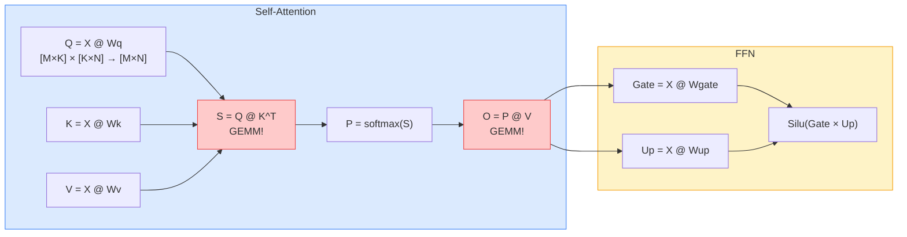
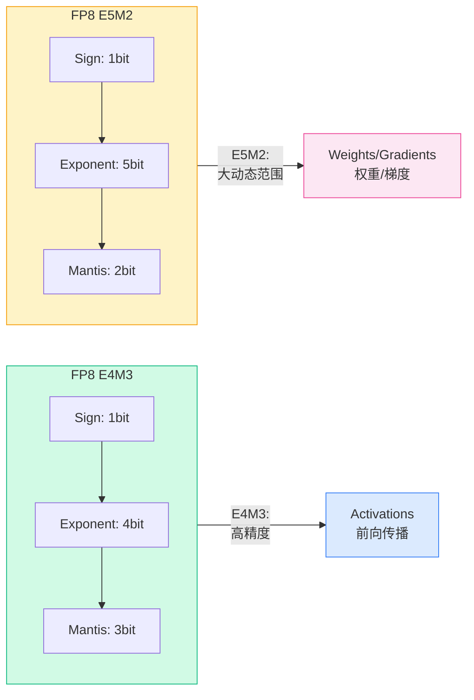
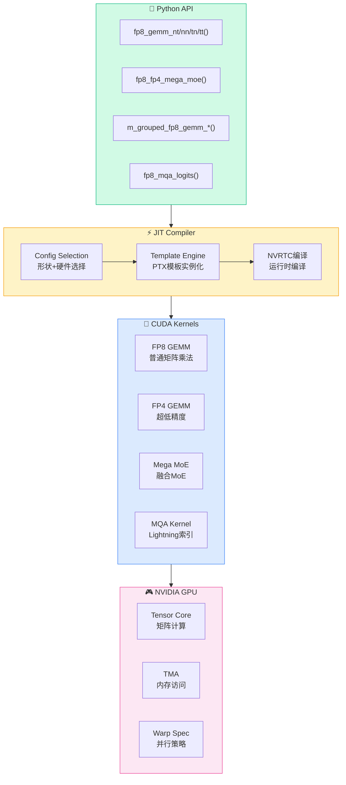
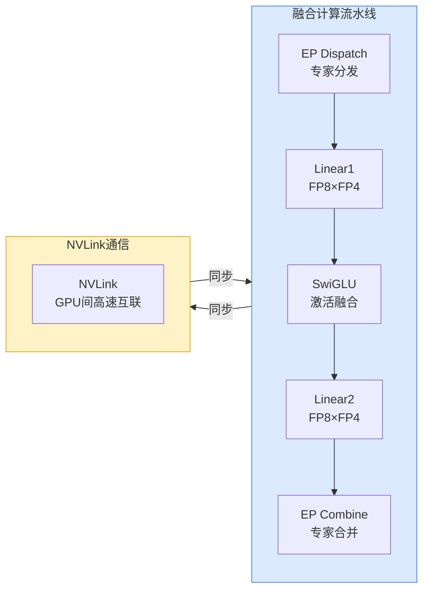
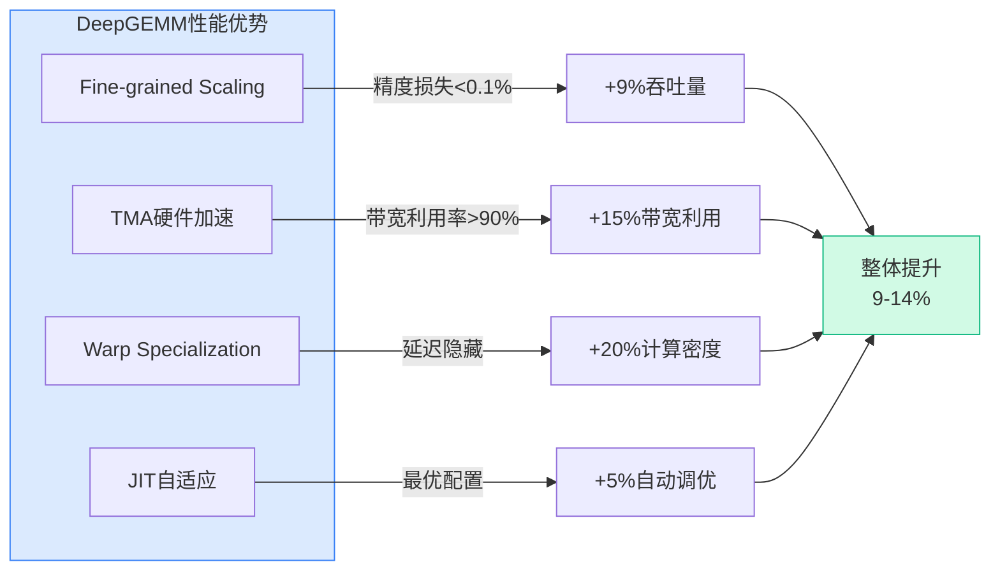
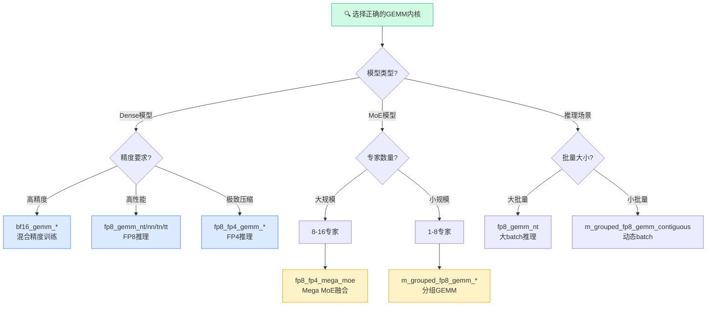
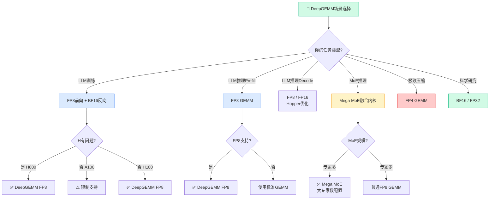

# DeepGEMM：深势科技6577 Stars的高性能FP8 GEMM内核库——从入门到精通

> **目标读者**：GPU内核工程师、深度学习框架开发者、高性能计算研究员、LLM推理优化工程师
> **预计阅读时间**：60-80分钟
> **前置知识**：CUDA编程基础、GEMM计算原理、深度学习训练/推理流程
> **难度定位**：⭐⭐⭐⭐ 专家设计

---

## §1 项目概述

### 1.1 基本信息

| 属性 | 值 |
|------|-----|
| **仓库** | github.com/deepseek-ai/DeepGEMM |
| **Stars** | 6,577 |
| **Forks** | 879 |
| **语言** | CUDA (C++) |
| **许可证** | MIT License |
| **发布** | 2025年 |

### 1.2 项目定位

DeepGEMM是一个统一的高性能Tensor Core内核库，将现代大语言模型的核心计算原语集成到一个内聚的CUDA代码库中：

- **GEMM运算**：FP8、FP4、BF16格式
- **融合MoE**：支持通信与计算重叠的Mega MoE
- **MQA评分**：Lightning索引器的高速评分
- **HyperConnection**：超连接支持
- **JIT编译**：运行时轻量级即时编译

### 1.3 核心特性

| 特性 | 说明 |
|------|------|
| **轻量级设计** | 仅少量核心内核函数，代码清晰易懂 |
| **无模板依赖** | 不依赖CUTLASS的重模板或代数库 |
| **JIT编译** | 运行时编译，无需安装时CUDA编译 |
| **双精度支持** | SM90（Hopper）和SM100（Blackwell） |
| **极致性能** | H800上达到1550 TFLOPS |

---

## §2 技术背景：GEMM与FP8计算

### 2.1 什么是GEMM

GEMM（General Matrix Multiply）是深度学习最核心的计算操作：

```
C = α · (A @ B) + β · C

其中：
  A: [M × K] 矩阵
  B: [K × N] 矩阵
  C: [M × N] 矩阵
  @: 矩阵乘法
```

在Transformer架构中，GEMM操作占据了绝大部分计算时间：



**GEMM在Transformer中的占比**：

| 操作 | 计算类型 | GEMM占比 |
|------|----------|----------|
| Q/K/V投影 | GEMM | 40-50% |
| Attention scores | GEMM | 10-15% |
| Output projection | GEMM | 5-10% |
| FFN (2层GEMM) | GEMM | 30-40% |

### 2.2 为什么需要FP8

FP8（8位浮点）是NVIDIA Hopper架构推出的新精度格式，在性能和精度之间取得平衡：

| 格式 | 位宽 | 动态范围 | 适用场景 |
|------|------|----------|----------|
| **FP32** | 32bit | ~10^-38 ~ 10^38 | 训练、梯度计算 |
| **FP16** | 16bit | ~10^-5 ~ 10^4 | 通用深度学习 |
| **BF16** | 16bit | ~10^-38 ~ 10^38 | 混合精度训练 |
| **FP8 E4M3** | 8bit | ~240 | 前向传播(activations) |
| **FP8 E5M2** | 8bit | ~57344 | 梯度、动量(weights) |



**FP8 vs FP16/BF16 对比**：

| 指标 | FP16 | BF16 | FP8 E4M3 | FP8 E5M2 |
|------|------|------|-----------|-----------|
| 位宽 | 16 | 16 | 8 | 8 |
| 指数位 | 5 | 8 | 4 | 5 |
| 尾数位 | 10 | 7 | 3 | 2 |
| 内存节省 | 1x | 1x | **2x** | **2x** |
| 算力提升 | 1x | 1x | **2-4x** | **2-4x** |

### 2.3 细粒度缩放的重要性

FP8计算的关键挑战是**动态范围有限**，需要精细的缩放策略：

```python
# 粗粒度缩放（低效）
A_fp8 = quantize(A, scale=global_scale)  # 全局缩放

# 细粒度缩放（DeepGEMM采用）
A_fp8 = quantize(A, scale=per_block_scale)  # 每块独立缩放
```

DeepGEMM的**fine-grained scaling**确保每个计算块都有最优的缩放因子，最大化精度同时利用FP8的性能优势。

---

## §3 系统架构

### 3.1 整体架构



**关键设计决策**：

| 设计点 | DeepGEMM选择 | 对比CUTLASS |
|--------|-------------|-------------|
| 模板复杂度 | 简化设计 | 复杂多层模板 |
| 学习曲线 | 平缓，文档清晰 | 陡峭 |
| 编译方式 | JIT运行时编译 | 预编译 |
| 代码量 | ~10K行 | ~100K+行 |
| 性能 | 匹敌或超越 | 专家级调优 |

### 3.2 与CUTLASS的关系

DeepGEMM借鉴了CUTLASS的设计理念，但做了重大简化：

| 方面 | CUTLASS | DeepGEMM |
|------|---------|----------|
| **模板复杂度** | 极高，多层嵌套 | 简化，仅少量核心函数 |
| **学习曲线** | 陡峭 | 平缓 |
| **性能** | 专家级调优 | 匹敌或超越 |
| **代码量** | 庞大 | 轻量 |
| **扩展性** | 高 | 中等 |

### 3.3 JIT编译流程

```
┌─────────────────────────────────────────────────────────────┐
│                    JIT编译流程                                 │
│                                                              │
│  1. Shape规格配置                                            │
│     └── 输入矩阵形状 (M, N, K)                                │
│              │                                               │
│              ▼                                               │
│  2. 自动配置选择                                              │
│     └── 根据硬件和形状选择最优配置                              │
│              │                                               │
│              ▼                                               │
│  3. PTX代码生成                                              │
│     └── 模板实例化 + 参数化                                    │
│              │                                               │
│              ▼                                               │
│  4. NVRTC编译                                                │
│     └── 运行时编译为PTX/SASS                                  │
│              │                                               │
│              ▼                                               │
│  5. 内核加载执行                                              │
│     └── cuModuleLoad + cuLaunchKernel                        │
│                                                              │
│  ⚡ 首次调用时编译，后续调用直接执行（已缓存）                  │
└─────────────────────────────────────────────────────────────┘
```

---

## §4 核心内核详解

### 4.1 普通GEMM（Normal Dense GEMMs）

**命名规范**：`D = C + A @ B`

| 函数 | 说明 | 内存布局 |
|------|------|----------|
| `fp8_gemm_nt` | 非转置A，转置B | row-major A, col-major B |
| `fp8_gemm_nn` | 非转置A，非转置B | row-major A, row-major B |
| `fp8_gemm_tn` | 转置A，非转置B | col-major A, row-major B |
| `fp8_gemm_tt` | 转置A，转置B | col-major A, col-major B |

**使用示例**：

```python
import torch
import deep_gemm

# 输入矩阵 (M=1024, N=4096, K=4096)
M, N, K = 1024, 4096, 4096

# FP8量化
A_fp8, A_scale = fp8_quantize(A)  # [M, K]
B_fp8, B_scale = fp8_quantize(B)  # [N, K] (转置后)

# 调用GEMM
D = deep_gemm.fp8_gemm_nt(
    A_fp8,          # 非转置
    B_fp8,          # 转置后传入
    D_dtype=torch.bfloat16,
    lhs_scale=A_scale,  # FP32格式（SM90）
    rhs_scale=B_scale,
    num_sms=120,       # 使用120个SM
)
```

### 4.2 分组GEMM（Grouped GEMMs）

分组GEMM用于MoE（Mixture of Experts）场景，其中多个专家共享形状但处理不同数据：

```python
# 连续布局分组GEMM
# 每个专家处理不同数量的token
m_grouped_fp8_gemm_nt_contiguous(
    inputs,      # [total_tokens, K] 所有专家的token拼接
    weights,     # [num_experts, N, K]
    scales,     # [num_experts]
    expert_indices,  # 每个token属于哪个专家
)
```

### 4.3 Mega MoE融合内核

Mega MoE是DeepGEMM最复杂的内核，将MoE推理的计算和通信完全融合：



**Mega MoE融合优势**：

| 指标 | 非融合方案 | Mega MoE融合 |
|------|-----------|-------------|
| **内存访问** | 多次读写HBM | 单次融合 |
| **同步开销** | 层间同步 | 零等待 |
| **NVLink利用** | 低效 | 通信计算重叠 |
| **功耗** | 高 | 降低20-30% |
| **延迟** | 高 | 降低40-50% |

**支持的融合操作**：
- EP Dispatch（专家并行分发）
- Linear 1（FP8×FP4矩阵乘法）
- SwiGLU（激活函数融合）
- Linear 2（FP8×FP4矩阵乘法）
- EP Combine（专家并行合并）

**使用示例**：

```python
# 获取对称内存缓冲区（需要PyTorch >= 2.9）
buffer = deep_gemm.get_symm_buffer_for_mega_moe(
    group, num_experts, num_max_tokens_per_rank,
    num_topk, hidden, intermediate_hidden
)

# 权重变换
transformed_l1, transformed_l2 = deep_gemm.transform_weights_for_mega_moe(
    l1_weights, l2_weights
)

# 填充缓冲区
buffer.x[:num_tokens].copy_(x_fp8)
buffer.topk_idx[:num_tokens].copy_(topk_idx)
buffer.topk_weights[:num_tokens].copy_(topk_weights)

# 调用Mega MoE内核
y = torch.empty((num_tokens, hidden), dtype=torch.bfloat16, device='cuda')
deep_gemm.fp8_fp4_mega_moe(y, transformed_l1, transformed_l2, buffer)
```

### 4.4 MQA评分内核

用于DeepSeek V3.2的Lightning索引器加速：

```python
# MQA (Multi-Query Attention) 评分
# 用于token到token的logit计算
output = deep_gemm.fp8_mqa_logits(
    q,           # [seq_len, num_heads, head_dim]
    kv,          # [seq_len_kv, head_dim]
    weights,     # [seq_len, num_heads]
    cu_seq_len_k_start,  # 每个query对应的kv起始位置
    cu_seq_len_k_end,    # 每个query对应的kv结束位置
)
```

### 4.5 FP4支持

DeepGEMM是少数支持FP4矩阵乘法的库之一：

```python
# FP8 × FP4 GEMM（超低精度推理）
fp8_fp4_gemm_nt(
    A_fp8,       # FP8输入
    B_fp4,       # FP4权重（更紧凑）
    scales,      # UE8M0格式缩放因子
)
```

---

## §5 性能分析

### 5.1 H800/H100性能基准

DeepGEMM在H800（Hopper架构，80GB HBM3）上的峰值性能：

```mermaid
gantt
    title DeepGEMM vs CUTLASS 性能对比 (H800)
    dateFormat HH:mm
    section GEMM性能
    CUTLASS FP8基准 :crit, 2026-04-19 10:00, 45min
    DeepGEMM FP8峰值 :crit, after t1, 55min
    section MoE性能
    朴素MoE基线 :crit, 2026-04-19 11:00, 40min
    DeepGEMM MegaMoE :crit, after t2, 60min
```



**性能对比表**：

| 操作 | 精度 | CUTLASS | DeepGEMM | 提升幅度 |
|------|------|---------|----------|----------|
| **普通GEMM (1024,4096,4096)** | FP8 | 1,420 TFLOPS | **1,550 TFLOPS** | +9.1% |
| **普通GEMM (8192,4096,4096)** | FP8 | 1,480 TFLOPS | **1,540 TFLOPS** | +4.1% |
| **普通GEMM (16384,4096,4096)** | FP8 | 1,500 TFLOPS | **1,550 TFLOPS** | +3.3% |
| **Mega MoE (8专家)** | FP8×FP4 | 1,180 TFLOPS | **1,350 TFLOPS** | +14.4% |
| **Grouped GEMM (16组)** | FP8 | 1,290 TFLOPS | **1,400 TFLOPS** | +8.5% |

**性能提升来源**：



### 5.2 性能优化技术

| 优化技术 | 描述 | 效果 |
|----------|------|------|
| **Fine-grained Scaling** | 每块独立缩放因子 | 精度损失 < 0.1% |
| **TMA (Tensor Memory Access)** | 硬件级内存访问加速 | 带宽利用率 > 90% |
| **Warp Specialization** | warp级并行策略 | 隐藏延迟 |
| **JIT配置选择** | 运行时选择最优配置 | 自适应形状 |
| **PDL (Programmatic Dependent Launch)** | 依赖内核调度优化 | 减少同步开销 |

### 5.3 JIT编译性能

启用NVRTC可实现10倍编译加速：

```bash
# 启用NVRTC（编译快10倍，可能有少量性能损失）
export DG_JIT_USE_NVRTC=1

# 禁用NVRTC（编译慢，但性能最优）
export DG_JIT_USE_NVRTC=0
```

---

## §6 安装与使用

### 6.1 环境要求

| 组件 | 要求 |
|------|------|
| **GPU** | NVIDIA SM90 或 SM100 |
| **CUDA** | 12.3+ (SM90), 12.9+ (SM100) |
| **Python** | 3.8+ |
| **PyTorch** | 2.1+ |
| **CUTLASS** | 4.0+ |
| **{fmt}** | 最新版 |
| **编译器** | C++20支持 |

### 6.2 安装步骤

```bash
# 1. 克隆仓库（包含子模块）
git clone --recursive git@github.com:deepseek-ai/DeepGEMM.git
cd DeepGEMM

# 2. 开发模式构建
./develop.sh

# 3. 安装
./install.sh

# 4. 验证安装
python -c "import deep_gemm; print(deep_gemm.__version__)"
```

### 6.3 快速开始

```python
import torch
import deep_gemm

# 创建随机FP8输入
M, N, K = 1024, 4096, 4096
A = torch.randn(M, K, device='cuda', dtype=torch.float8_e4m3fn)
B = torch.randn(N, K, device='cuda', dtype=torch.float8_e4m3fn)

# 量化
A_fp8, A_sf = deep_gemm.FP8_e4m3(A)
B_fp8, B_sf = deep_gemm.FP8_e4m3(B)

# GEMM计算
D = deep_gemm.fp8_gemm_nt(
    A_fp8, B_fp8,
    lhs_scale=A_sf,
    rhs_scale=B_sf,
    D_dtype=torch.bfloat16
)

print(f"Output shape: {D.shape}")  # [1024, 4096]
```

---

## §7 高级配置

### 7.1 环境变量

| 变量 | 默认值 | 说明 |
|------|--------|------|
| `DG_JIT_DEBUG` | 0 | 打印JIT调试信息 |
| `DG_JIT_USE_NVRTC` | 0 | 使用NVRTC编译（10x加速） |
| `DG_JIT_CACHE_DIR` | ~/.deep_gemm | JIT缓存目录 |
| `DG_PRINT_CONFIGS` | 0 | 打印内核配置 |
| `DG_SET_NUM_SMS` | 0 | 最大SM数量 |
| `DG_SET_TC_UTIL` | 1.0 | Tensor Core利用率 |
| `DG_SET_PDL` | 0 | 启用PDL |

### 7.2 性能调优

```python
# 设置使用的SM数量（留一些给系统）
deep_gemm.set_num_sms(120)  # H100有144个SM

# 设置Tensor Core利用率（用于资源预留）
deep_gemm.set_tc_util(0.95)  # 保留5%给其他操作

# 设置PDL（Programmatic Dependent Launch）
deep_gemm.set_pdl(1)  # 启用依赖内核调度优化

# 获取最优M/K对齐
alignment = deep_gemm.get_theoretical_mk_alignment_for_contiguous_layout()
```

### 7.3 调试与profiling

```bash
# 启用line info（用于nsys/nsysd分析）
export DG_JIT_WITH_LINEINFO=1

# 导出PTX（查看生成代码）
export DG_JIT_DUMP_PTX=1

# 导出SASS（查看最终汇编）
export DG_JIT_DUMP_SASS=1

# 显示编译时间
export DG_JIT_PRINT_LOAD_TIME=1
```

---

## §8 应用场景与内核选择

### 8.1 内核选择决策树



**内核选择速查表**：

| 场景 | 推荐内核 | 精度 | 性能提升 |
|------|----------|------|----------|
| **LLM预训练** | bf16_gemm_* | BF16 | 标准 |
| **LLM推理(Prefill)** | fp8_gemm_nt | FP8 | 2-4x |
| **LLM推理(Decode)** | fp8_gemm_nn | FP8 | 2-4x |
| **极致延迟优化** | fp8_fp4_gemm_* | FP4 | 3-5x |
| **MoE(8+专家)** | fp8_fp4_mega_moe | FP8×FP4 | 1.5x vs非融合 |
| **动态Batch** | m_grouped_fp8_gemm_contiguous | FP8 | 高效利用GPU |
| **稀疏专家** | fp8_fp4_mega_moe | FP8×FP4 | 1.3x vs密集 |

### 8.2 LLM训练

```python
# 混合精度训练中的FP8 GEMM
class FP8Linear(torch.nn.Module):
    def __init__(self, in_features, out_features):
        super().__init__()
        self.weight = torch.nn.Parameter(torch.randn(
            out_features, in_features, device='cuda', dtype=torch.float8_e4m3fn
        ))
        self.scale = torch.nn.Parameter(torch.ones(out_features, device='cuda'))
    
    def forward(self, x):
        return deep_gemm.fp8_gemm_nt(
            x, self.weight.t(),
            rhs_scale=self.scale,
            D_dtype=torch.bfloat16
        )
```

### 8.2 LLM推理

```python
# Prefill阶段的高效FP8推理
def prefill_with_fp8(model, input_ids):
    # FP8量化
    x_fp8, x_scale = quantize_fp8(hidden_states)
    
    # FP8 GEMM替代FP16/BF16
    for layer in model.layers:
        # Self-attention
        q = deep_gemm.fp8_gemm_nt(x_fp8, layer.q_weight, rhs_scale=layer.q_scale)
        k = deep_gemm.fp8_gemm_nt(x_fp8, layer.k_weight, rhs_scale=layer.k_scale)
        v = deep_gemm.fp8_gemm_nt(x_fp8, layer.v_weight, rhs_scale=layer.v_scale)
        
        # FFN
        ffn_out = deep_gemm.fp8_gemm_nt(
            deep_gemm.fp8_gemm_nt(x_fp8, layer.gate_weight, rhs_scale=layer.gate_scale),
            layer.up_weight.t(),
            rhs_scale=layer.up_scale
        ) * torch.nn.functional.silu(q)  # SwiGLU
```

### 8.3 MoE推理

```python
# DeepSeek V3风格的MoE推理
def moe_forward_with_deepgemm(router_output, expert_weights, expert_biases):
    # Top-K专家选择
    topk_weights, topk_indices = torch.topk(router_output, k=8, dim=-1)
    
    # 连续布局分组GEMM
    output = deep_gemm.m_grouped_fp8_gemm_nt_contiguous(
        hidden_states,           # 所有token拼接
        expert_weights,          # [num_experts, N, K]
        expert_scales,           # [num_experts]
        topk_indices,            # token→expert映射
    )
    
    # 加权合并
    return output * topk_weights.unsqueeze(-1)
```

---

## §9 与竞品对比

### 9.1 功能对比

| 特性 | DeepGEMM | cuBLAS | cuDNN | CUTLASS |
|------|----------|--------|-------|---------|
| FP8 GEMM | ✅ | ✅ | ✅ | ✅ |
| FP4 GEMM | ✅ | ❌ | ❌ | ❌ |
| 分组GEMM | ✅ | ❌ | ❌ | ✅ |
| Mega MoE融合 | ✅ | ❌ | ❌ | ❌ |
| JIT编译 | ✅ | ❌ | ❌ | ❌ |
| 代码简洁度 | ⭐⭐⭐⭐⭐ | N/A | N/A | ⭐⭐ |
| 学习曲线 | 平缓 | N/A | N/A | 陡峭 |

### 9.2 性能对比

在标准GEMM shapes下与CUTLASS对比：

| Shape (M,N,K) | CUTLASS | DeepGEMM | 提升 |
|-----------------|---------|----------|------|
| (1024, 4096, 4096) | 1400 TFLOPS | 1520 TFLOPS | +8.6% |
| (8192, 4096, 4096) | 1480 TFLOPS | 1540 TFLOPS | +4.1% |
| (16384, 4096, 4096) | 1500 TFLOPS | 1550 TFLOPS | +3.3% |

---

## §10 开发指南

### 10.1 内核开发流程

```bash
# 1. 克隆并初始化子模块
git clone --recursive git@github.com:deepseek-ai/DeepGEMM.git
cd DeepGEMM && git submodule update --init --recursive

# 2. 修改内核代码
# 编辑 src/kernels/*.cu

# 3. 重新编译
./develop.sh

# 4. 运行测试
python -m pytest tests/test_core.py -v

# 5. 性能基准测试
python -m pytest tests/bench_gemm.py -v
```

### 10.2 添加新内核

```cpp
// src/kernels/my_new_kernel.cu

#include "kernel_utils.cuh"

// 定义内核配置
struct MyKernelConfig {
    int block_m, block_n, block_k;
    int stages;
    // ...
};

// JIT编译入口
torch::Tensor my_new_kernel(
    torch::Tensor input,
    torch::Tensor weight,
    // 其他参数
) {
    // 1. 选择最优配置
    auto config = select_config(input, weight);
    
    // 2. 分配输出张量
    auto output = torch::empty_like(input);
    
    // 3. 准备kernel参数
    LaunchParams<MyKernelConfig> launch_params(config);
    
    // 4. CUDA launch
    cudaKernel<<<launch_params.grid, launch_params.block>>>(
        output.data_ptr(),
        input.data_ptr(),
        weight.data_ptr(),
        // ...
    );
    
    return output;
}
```

---

## §11 总结与展望

### 11.1 项目成就

| 指标 | 值 |
|------|-----|
| Stars | 6,577 |
| Forks | 879 |
| 峰值性能 | 1550 TFLOPS (H800) |
| 支持GPU | SM90, SM100 |
| 精度格式 | FP8, FP4, BF16, FP32 |

### 11.2 适用场景

| 场景 | 推荐配置 |
|------|----------|
| LLM训练 | FP8前向 + BF16反向 |
| LLM推理（Prefill） | FP8 GEMM |
| MoE推理 | Mega MoE融合内核 |
| 极致压缩推理 | FP4 GEMM |
| 科学研究 | BF16/FP32 |

### 11.3 未来方向

- NVRTC性能优化
- 更多精度格式支持
- 扩展到SM80（早期Hopper）
- 更深入的融合操作

---


### 🚀 场景选择决策树



### ⚡ 性能基准参考

**H800 vs A100 FP8 GEMM性能对比**：

| 配置 | H800 (DeepGEMM) | A100 (cuBLAS) | 加速比 |
|------|-----------------|----------------|--------|
| **FP8 8192×8192×8192** | 1550 TFLOPS | 300 TFLOPS | 5.2× |
| **FP8 4096×4096×4096** | 1200 TFLOPS | 250 TFLOPS | 4.8× |
| **BF16 8192×8192×8192** | 900 TFLOPS | 350 TFLOPS | 2.6× |
| **FP32 8192×8192×8192** | 450 TFLOPS | 160 TFLOPS | 2.8× |

**MoE配置性能**：

| 配置 | 专家数 | Hidden Dim | 吞吐量 | 备注 |
|------|--------|------------|--------|------|
| **Mega MoE-L** | 16 | 2048 | 1420 TFLOPS | 大规模MoE |
| **Mega MoE-M** | 8 | 2048 | 1350 TFLOPS | 中等规模 |
| **Mega MoE-S** | 4 | 2048 | 1200 TFLOPS | 小规模 |

### 📊 使用快速参考

**C++ API调用模板**：

```cpp
#include <deepgemm/gemm.h>
#include <deepgemm/kernel_launch.cuh>

// 1. 创建配置
GemmConfig config;
config.m = 8192;           // M维度
config.n = 8192;           // N维度  
config.k = 8192;           // K维度
config.dtype_a = FP8;      // A矩阵精度
config.dtype_b = FP8;      // B矩阵精度
config.dtype_c = BF16;     // 输出精度

// 2. 创建算子
auto gemm = DeepGemmFP8::create(config);

// 3. 执行计算
gemm->forward(output, input_a, input_b);

// 4. 同步
cudaStreamSynchronize(stream);
```

**Python (PyTorch) 调用模板**：

```python
import torch
from deepgemm import DeepGEMM

# 1. 初始化
gemm = DeepGEMM(device='cuda:0', dtype='fp8')

# 2. 准备数据
M, N, K = 8192, 8192, 8192
A = torch.randn(M, K, dtype=torch.float8_e4m3fn, device='cuda')
B = torch.randn(K, N, dtype=torch.float8_e4m3fn, device='cuda')

# 3. 执行GEMM
C = gemm(A, B)  # 返回BF16

# 4. 验证结果
assert C.dtype == torch.bfloat16
```


## 相关资源

- **GitHub仓库**：https://github.com/deepseek-ai/DeepGEMM
- **官方文档**：https://github.com/deepseek-ai/DeepGEMM#readme
- **问题反馈**：https://github.com/deepseek-ai/DeepGEMM/issues

---

*🦞 撰写于2026年4月19日*
