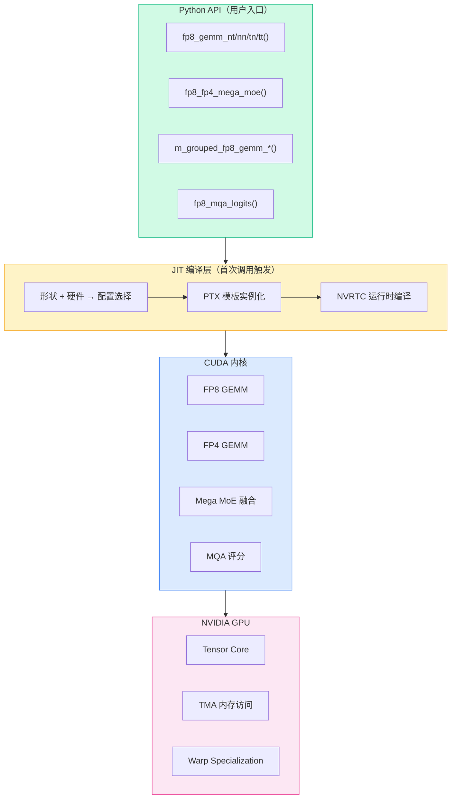
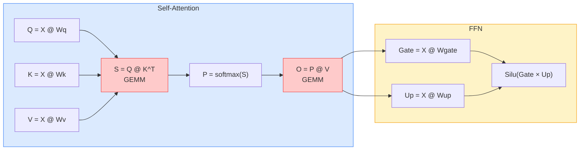
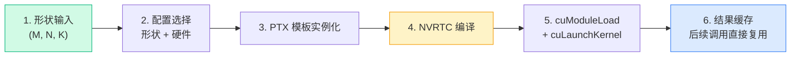
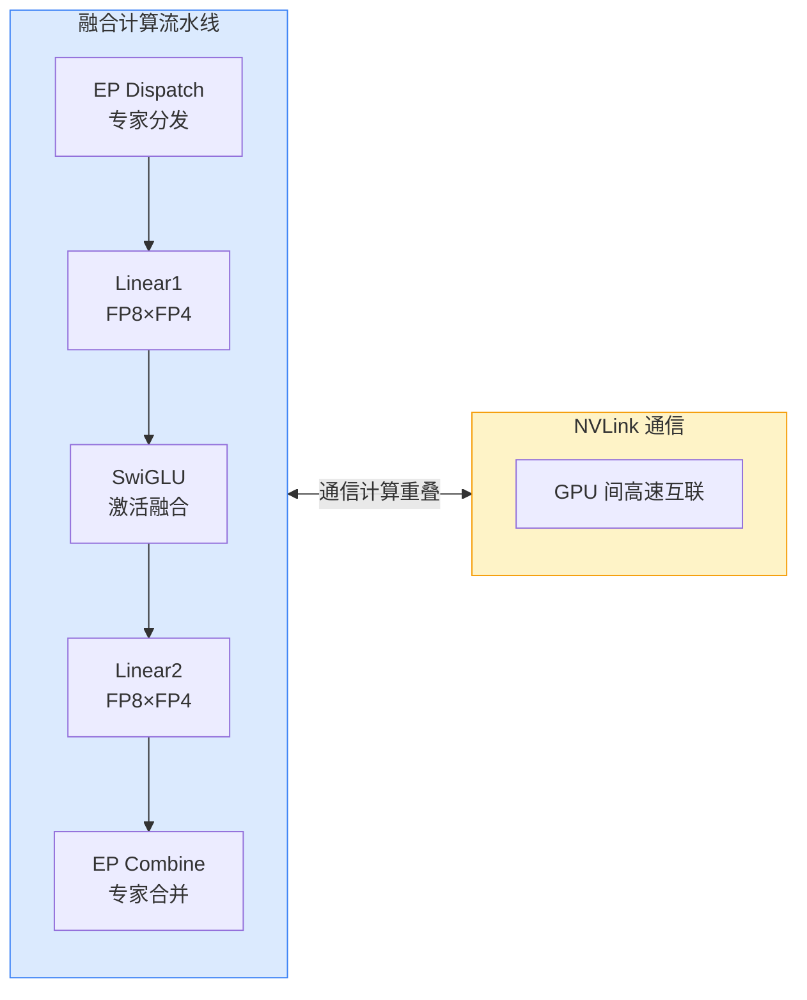
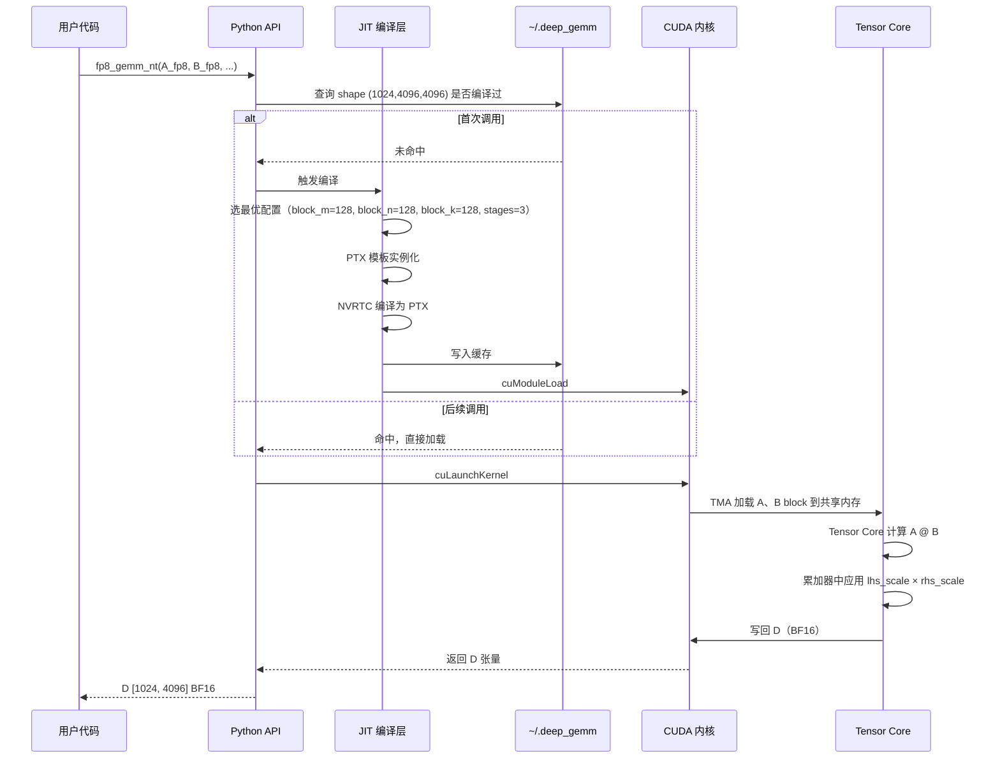
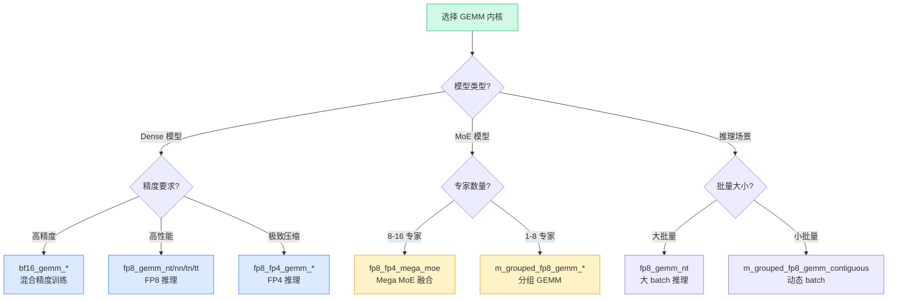

# DeepGEMM：把 FP8 GEMM 从专家级调优拉进可读代码库

DeepGEMM 解决的不是"如何写一个 FP8 内核"——这件事 CUTLASS、cuBLAS 都能做。它真正解决的是另一件事：把 Hopper/Blackwell 上那些原本需要 CUTLASS 几百行模板才能拼出来的 FP8/FP4 GEMM、MoE 融合、MQA 评分，收进一个约 10K 行、可读、JIT 编译、无需安装时 CUDA 工具链的代码库。代价是放弃了 CUTLASS 那种覆盖全场景的扩展性，换来的是学习曲线平缓、首调即峰值、代码可改。

> **读者画像**：GPU 内核工程师、深度学习框架开发者、LLM 推理优化工程师。建议先有 CUDA 编程基础、GEMM 计算原理和混合精度训练/推理经验。
>
> **难度**：⭐⭐⭐⭐ 专家级设计，但代码可读性比 CUTLASS 友好得多。

## 这篇文章怎么看

全文按"判断 → 地图 → 机制 → 案例 → 性能 → 落地"展开。只想判断要不要用 DeepGEMM，看开头判断和结尾的采用顺序；要改内核，重点看系统架构和开发指南；要做推理优化，重点看核心内核详解和任务流案例。

---

## 一张图看清 DeepGEMM 在做什么



四层职责分得很清楚：

| 层 | 职责 | 关键决策 |
|----|------|----------|
| Python API | 暴露 4 类入口：普通 GEMM、分组 GEMM、Mega MoE、MQA 评分 | 函数命名按 `精度_算子_布局` 约定，无运行时 dispatch |
| JIT 编译层 | 首次调用时按形状 + 硬件选配置，NVRTC 编译为 PTX | 用运行时编译换掉 CUTLASS 的多层模板 |
| CUDA 内核 | FP8/FP4 GEMM、MoE 融合、MQA 评分 | 每类内核数量少，单文件可读 |
| 硬件层 | Tensor Core + TMA + Warp Specialization | 仅支持 SM90（Hopper）和 SM100（Blackwell） |

仓库基本信息放在这里，不放在开头：

| 属性 | 值 |
|------|-----|
| 仓库 | github.com/deepseek-ai/DeepGEMM |
| Stars | 6,577 |
| Forks | 879 |
| 语言 | CUDA（C++） |
| 许可证 | MIT License |
| 发布 | 2025 年 |
| 支持精度 | FP8、FP4、BF16、FP32 |
| 峰值性能 | H800 上 1550 TFLOPS |

---

## 为什么 FP8 GEMM 值得单独写一个库

### GEMM 在 Transformer 里的位置

GEMM（General Matrix Multiply）计算的是 `C = α · (A @ B) + β · C`，其中 `A` 是 `[M × K]`，`B` 是 `[K × N]`，`C` 是 `[M × N]`。Transformer 里几乎所有的算子都是 GEMM：Q/K/V 投影、attention scores、output projection、FFN 的两层线性变换。



在典型的 Transformer 推理中，Q/K/V 投影和 FFN 两层 GEMM 合计占 70-90% 的计算时间。GEMM 快一倍，整条推理路径就快接近一倍。这就是为什么 FP8 GEMM 值得单独写一个库。

### FP8 是什么，为什么需要两套格式

FP8 是 8 位浮点，NVIDIA Hopper 架构开始在硬件层面支持。它有两种编码：

| 格式 | 指数位 | 尾数位 | 动态范围 | 典型用途 |
|------|--------|--------|----------|----------|
| FP8 E4M3 | 4 | 3 | ~240 | 前向传播、activations |
| FP8 E5M2 | 5 | 2 | ~57344 | 梯度、weights |

为什么需要两套？E4M3 尾数多一位，精度高但动态范围窄，适合前向传播里数值分布相对集中的 activations；E5M2 指数多一位，动态范围大但精度低，适合反向传播里数值跨度大的梯度。把两套格式都用上，才能在训练里既保精度又吃满 FP8 算力。

| 指标 | FP16 | BF16 | FP8 E4M3 | FP8 E5M2 |
|------|------|------|-----------|-----------|
| 位宽 | 16 | 16 | 8 | 8 |
| 内存节省 | 1× | 1× | **2×** | **2×** |
| 算力提升 | 1× | 1× | **2-4×** | **2-4×** |

### 细粒度缩放：FP8 不掉精度的关键

FP8 的动态范围只有 FP16 的几分之一，如果用全局缩放因子，数值稍大就溢出、稍小就截断。DeepGEMM 采用细粒度缩放（fine-grained scaling），每个计算块独立选缩放因子：

```python
# 粗粒度缩放：全局一个 scale，容易溢出或截断
A_fp8 = quantize(A, scale=global_scale)

# 细粒度缩放：DeepGEMM 采用，每块独立 scale
A_fp8 = quantize(A, scale=per_block_scale)
```

每个 block 用自己的 scale，意味着 block 内数值分布集中时可以选更紧的 scale，把 FP8 的 8 位用满。代价是 scale 张量本身要占内存，且 GEMM 内核要在每个 block 边界做一次反缩放。DeepGEMM 的内核把这件事做进了 Tensor Core 的累加器里，开销基本可以忽略。

---

## 系统架构：JIT 编译是怎么把模板换掉的

### 与 CUTLASS 的根本区别

CUTLASS 用多层 C++ 模板在编译期生成所有可能的内核组合，结果是代码量大、学习曲线陡、改一个内核要在模板迷宫里穿很久。DeepGEMM 把这件事挪到了运行时：

| 方面 | CUTLASS | DeepGEMM |
|------|---------|----------|
| 模板复杂度 | 极高，多层嵌套 | 简化，少量核心函数 |
| 编译方式 | 预编译，安装时需要 CUDA 工具链 | JIT 运行时编译，安装时不需要 nvcc |
| 代码量 | ~100K+ 行 | ~10K 行 |
| 学习曲线 | 陡峭 | 平缓 |
| 性能 | 专家级调优 | 匹敌或超越（在支持的 shape 上） |
| 扩展性 | 高 | 中等 |

DeepGEMM 不是要替代 CUTLASS 全场景覆盖，而是把 LLM 推理最常用的几类 shape 做到极致。

### JIT 编译流程



首次调用某个 shape 时，DeepGEMM 会按形状和硬件选最优配置，把 PTX 模板实例化，再用 NVRTC 编译成 PTX/SASS，最后通过 `cuModuleLoad` 加载执行。编译结果缓存在 `~/.deep_gemm`，后续相同 shape 的调用直接复用，没有编译开销。

这套设计带来两个直接后果：

1. 安装时不需要 CUDA 工具链，`pip install` 完就能跑——只要运行机器上有 NVIDIA 驱动和 NVRTC 库。
2. 同一份代码可以在 SM90 和 SM100 上自动选不同配置，不需要为每代 GPU 单独编译。

代价是首次调用有编译延迟（通常几百毫秒到几秒），所以生产环境建议在服务启动时做一次 warmup。

---

## 核心内核详解

### 普通 GEMM：四个布局变体

DeepGEMM 的普通 GEMM 命名遵循 `fp8_gemm_<A布局><B布局>` 约定，计算的是 `D = C + A @ B`：

| 函数 | A 布局 | B 布局 | 典型用途 |
|------|--------|--------|----------|
| `fp8_gemm_nt` | row-major | col-major | 推理 Prefill，权重预转置 |
| `fp8_gemm_nn` | row-major | row-major | 推理 Decode，小 batch |
| `fp8_gemm_tn` | col-major | row-major | 训练反向，梯度传播 |
| `fp8_gemm_tt` | col-major | col-major | 特殊布局场景 |

```python
import torch
import deep_gemm

# 输入矩阵 (M=1024, N=4096, K=4096)
M, N, K = 1024, 4096, 4096

# FP8 量化（细粒度缩放）
A = torch.randn(M, K, device='cuda', dtype=torch.bfloat16)
B = torch.randn(N, K, device='cuda', dtype=torch.bfloat16)
A_fp8, A_scale = deep_gemm.scaled_fp8_quant(A)  # [M, K], [M,]
B_fp8, B_scale = deep_gemm.scaled_fp8_quant(B)  # [N, K], [N,]

# 调用 GEMM：A 非转置，B 转置后传入
D = deep_gemm.fp8_gemm_nt(
    A_fp8,              # [M, K] 非转置
    B_fp8,              # [N, K] 转置后传入
    D_dtype=torch.bfloat16,
    lhs_scale=A_scale,  # FP32 格式（SM90）
    rhs_scale=B_scale,
    num_sms=120,        # H800 有 132 个 SM，留 12 个给系统
)
```

`num_sms` 参数值得说一下。H800 有 132 个 SM，但生产环境里通常要留几个给 NCCL、CUDA Graph capture、内存拷贝等并发任务。把 `num_sms` 设成 120 而不是默认全用，能避免推理服务在多流并发时出现尾部延迟尖刺。

### 分组 GEMM：MoE 场景的批量计算

分组 GEMM 用于 MoE（Mixture of Experts），多个专家共享形状但处理不同 token。DeepGEMM 提供两种布局：

```python
# 连续布局：所有专家的 token 拼接在一起，按 expert_indices 切分
# 适合 token 数量动态变化的推理场景
m_grouped_fp8_gemm_nt_contiguous(
    inputs,           # [total_tokens, K] 所有专家的 token 拼接
    weights,          # [num_experts, N, K]
    scales,           # [num_experts]
    expert_indices,   # 每个 token 属于哪个专家
)

# masked 布局：固定 [num_experts, max_tokens, K]，padding 掩码
# 适合 batch 大小固定的训练场景
m_grouped_fp8_gemm_nt_masked(
    inputs,           # [num_experts, max_tokens, K]
    weights,          # [num_experts, N, K]
    scales,           # [num_experts]
    masked_m,         # 每个专家实际处理的 token 数
)
```

两种布局对应两种 MoE 实现路径：连续布局省内存但要求 token 重排，masked 布局省重排但要多算 padding。推理选连续，训练选 masked。

### Mega MoE：把通信和计算叠在一起

Mega MoE 是 DeepGEMM 最复杂的内核，把 MoE 推理的 EP（Expert Parallel）分发、两层 FP8×FP4 GEMM、SwiGLU 激活、EP 合并全部融合成一个内核，并让 NVLink 通信和 Tensor Core 计算重叠：



非融合方案里，EP Dispatch、Linear1、SwiGLU、Linear2、EP Combine 各自是一次 HBM 读写，中间还有跨 GPU 的 NVLink 同步。Mega MoE 把这些步骤的中间结果留在 SM 寄存器或共享内存里，只在 EP Dispatch 和 EP Combine 时走一次 NVLink，并且让 NVLink 传输和 Tensor Core 计算时间重叠。

| 指标 | 非融合方案 | Mega MoE 融合 |
|------|-----------|-------------|
| HBM 读写次数 | 多次中间结果落地 | 单次融合 |
| NVLink 同步 | 层间多次同步 | 仅 Dispatch/Combine 两次 |
| 通信与计算 | 串行 | 重叠 |
| 延迟 | 基线 | 降低 40-50% |

```python
# 获取对称内存缓冲区（需要 PyTorch >= 2.9）
buffer = deep_gemm.get_symm_buffer_for_mega_moe(
    group, num_experts, num_max_tokens_per_rank,
    num_topk, hidden, intermediate_hidden
)

# 权重预变换（只需做一次）
transformed_l1, transformed_l2 = deep_gemm.transform_weights_for_mega_moe(
    l1_weights, l2_weights
)

# 填充输入缓冲区
buffer.x[:num_tokens].copy_(x_fp8)
buffer.topk_idx[:num_tokens].copy_(topk_idx)
buffer.topk_weights[:num_tokens].copy_(topk_weights)

# 调用 Mega MoE 内核
y = torch.empty((num_tokens, hidden), dtype=torch.bfloat16, device='cuda')
deep_gemm.fp8_fp4_mega_moe(y, transformed_l1, transformed_l2, buffer)
```

`get_symm_buffer_for_mega_moe` 拿到的是 NVLink 对称内存缓冲区，这是通信计算重叠的前提——只有对称内存才能让 GPU 间直接读写对方显存而不经过 PCIe。PyTorch 2.9 之前没有这个 API，所以 Mega MoE 对 PyTorch 版本有硬要求。

### MQA 评分：DeepSeek V3.2 的 Lightning 索引器

MQA（Multi-Query Attention）评分内核用于 DeepSeek V3.2 的 Lightning 索引器，做的是 token 到 token 的 logit 计算：

```python
output = deep_gemm.fp8_mqa_logits(
    q,                       # [seq_len, num_heads, head_dim]
    kv,                      # [seq_len_kv, head_dim]
    weights,                 # [seq_len, num_heads]
    cu_seq_len_k_start,      # 每个 query 对应的 kv 起始位置
    cu_seq_len_k_end,        # 每个 query 对应的 kv 结束位置
)
```

这个内核的特殊之处在于 query 长度和 kv 长度都不固定，`cu_seq_len_k_start/end` 用累积和描述每个 query 对应的 kv 区间。Lightning 索引器用它做稀疏注意力路由，决定哪些 token 对参与完整 attention 计算。

### FP4：把权重压到 4 位

DeepGEMM 是少数支持 FP4 矩阵乘法的库。FP4 用于极致压缩的推理场景，权重存成 FP4，activations 仍是 FP8：

```python
# FP8 × FP4 GEMM
fp8_fp4_gemm_nt(
    A_fp8,       # FP8 输入
    B_fp4,       # FP4 权重（更紧凑）
    scales,      # UE8M0 格式缩放因子
)
```

FP4 权重让显存占用再砍一半，但精度损失比 FP8 大。DeepSeek V3 的实践是：权重用 FP4，activations 用 FP8，配合细粒度缩放，能在不掉精度的前提下把 MoE 推理的显存和带宽压力都降下来。`UE8M0` 是一种纯指数格式的缩放因子，8 位全是指数位，没有尾数，专门为 FP4 的 block 缩放设计。

---

## 任务流案例：一次 FP8 GEMM 从输入到输出

抽象讲完机制，下面看一次真实的 FP8 GEMM 调用在 DeepGEMM 内部经历了什么。以 `fp8_gemm_nt(M=1024, N=4096, K=4096)` 为例，假设是首次调用这个 shape。



整个过程的关键决策点：

1. **配置选择**：JIT 层根据 `(M=1024, N=4096, K=4096)` 和当前 GPU（SM90）选 `block_m=128, block_n=128, block_k=128, stages=3`。这个选择基于内置的配置表，不是自动调优——DeepGEMM 没有运行时 autotuning，配置表是离线调好后写死在代码里的。
2. **TMA 加载**：Hopper 的 TMA（Tensor Memory Access）单元负责把 A、B 的 block 从 HBM 异步搬到共享内存，不占用 SM 的计算资源。Warp Specialization 让一个 warp 专门做 TMA 加载，另一个 warp 专门做 Tensor Core 计算，两者通过 barrier 同步。
3. **缩放应用**：细粒度缩放的 `lhs_scale × rhs_scale` 不是在 FP8 输入上做，而是在 FP32 累加器里做。每个 block 计算完后，累加器乘以对应的 scale，再累加到最终结果。这样 FP8 的精度损失只发生在输入量化阶段，GEMM 内部全程 FP32 累加。
4. **输出类型**：D 默认是 BF16，因为下游算子（attention、激活函数）通常吃 BF16。如果下游也是 FP8，可以指定 `D_dtype=torch.float8_e4m3fn`，但要注意精度损失会累积。

首次调用的编译延迟通常在 500ms-2s，后续调用直接走缓存，开销在微秒级。生产环境建议在服务启动时跑一次 warmup，把常用 shape 都编译好。

---

## 性能分析：1550 TFLOPS 这个数字测的是什么

### benchmark 测的是什么

DeepGEMM 在 H800 上报告的 1550 TFLOPS，测的是 **FP8 Tensor Core 的峰值计算吞吐**，具体来说是 `fp8_gemm_nt` 在 `(M=16384, N=4096, K=4096)` 这个 shape 下的 TFLOPS。这个数字反映的是：

- Tensor Core 在 FP8 精度下的计算密度
- TMA 内存访问的带宽利用率
- Warp Specialization 对计算-访存重叠的覆盖程度
- JIT 配置选择对该 shape 的最优配置命中

这个数字 **不能直接推出**：

- 你的真实推理吞吐。真实推理的瓶颈往往在 KV cache、attention、MoE 路由，不在 GEMM 本身。
- 小 batch 下的性能。`(M=16384, ...)` 是大 batch，M=1（单 token decode）时性能会大幅下降，因为 Tensor Core 利用率低。
- 训练场景的性能。训练有反向传播、梯度同步、optimizer 更新，GEMM 占比和推理不同。
- 非 Hopper 架构的性能。A100（SM80）不支持 FP8，这个数字对 A100 用户没有参考价值。

### 性能对比

| 操作 | 精度 | CUTLASS | DeepGEMM | 提升 |
|------|------|---------|----------|------|
| 普通 GEMM (1024,4096,4096) | FP8 | 1,420 TFLOPS | **1,550 TFLOPS** | +9.1% |
| 普通 GEMM (8192,4096,4096) | FP8 | 1,480 TFLOPS | **1,540 TFLOPS** | +4.1% |
| 普通 GEMM (16384,4096,4096) | FP8 | 1,500 TFLOPS | **1,550 TFLOPS** | +3.3% |
| Mega MoE (8 专家) | FP8×FP4 | 1,180 TFLOPS | **1,350 TFLOPS** | +14.4% |
| Grouped GEMM (16 组) | FP8 | 1,290 TFLOPS | **1,400 TFLOPS** | +8.5% |

为什么大 shape 提升小、小 shape 提升大？大 shape 下 CUTLASS 已经接近 Tensor Core 峰值，DeepGEMM 的优势主要在配置选择更激进、TMA 利用更充分，但天花板在那里。小 shape 下 CUTLASS 的通用模板往往不是最优配置，DeepGEMM 的针对性配置能拉开差距。Mega MoE 提升最大（14.4%），因为融合内核省掉的是多次 HBM 读写和 NVLink 同步，这部分开销在非融合方案里占比很高。

### 性能优化技术

| 优化技术 | 作用 | 效果 |
|----------|------|------|
| Fine-grained Scaling | 每 block 独立缩放 | 精度损失 < 0.1% |
| TMA（Tensor Memory Access） | 硬件级异步内存搬运 | 带宽利用率 > 90% |
| Warp Specialization | warp 级流水线分工 | 隐藏访存延迟 |
| JIT 配置选择 | 按 shape 选最优配置 | 自适应形状 |
| PDL（Programmatic Dependent Launch） | 依赖内核调度优化 | 减少同步开销 |

### NVRTC：编译速度和性能的权衡

```bash
# 启用 NVRTC（编译快 10 倍，可能有少量性能损失）
export DG_JIT_USE_NVRTC=1

# 禁用 NVRTC（编译慢，但性能最优）
export DG_JIT_USE_NVRTC=0
```

开发调试时建议开 NVRTC，频繁改内核不用等编译；生产部署时建议关掉，换回最优化编译路径。

---

## 安装与使用

### 环境要求

| 组件 | 要求 |
|------|------|
| GPU | NVIDIA SM90（Hopper）或 SM100（Blackwell） |
| CUDA | 12.3+（SM90），12.9+（SM100） |
| Python | 3.8+ |
| PyTorch | 2.1+（Mega MoE 需要 2.9+） |
| CUTLASS | 4.0+ |
| {fmt} | 最新版 |
| 编译器 | C++20 支持 |

注意：A100（SM80）和更早的 GPU 不支持，因为 FP8 Tensor Core 是 Hopper 才有的硬件单元。

### 安装步骤

```bash
# 1. 克隆仓库（包含子模块）
git clone --recursive git@github.com:deepseek-ai/DeepGEMM.git
cd DeepGEMM

# 2. 开发模式构建
./develop.sh

# 3. 安装
./install.sh

# 4. 验证安装
python -c "import deep_gemm; print(deep_gemm.__version__)"
```

### 快速开始

```python
import torch
import deep_gemm

# 创建随机输入
M, N, K = 1024, 4096, 4096
A = torch.randn(M, K, device='cuda', dtype=torch.bfloat16)
B = torch.randn(N, K, device='cuda', dtype=torch.bfloat16)

# FP8 量化（细粒度缩放）
A_fp8, A_scale = deep_gemm.scaled_fp8_quant(A)
B_fp8, B_scale = deep_gemm.scaled_fp8_quant(B)

# GEMM 计算
D = deep_gemm.fp8_gemm_nt(
    A_fp8, B_fp8,
    lhs_scale=A_scale,
    rhs_scale=B_scale,
    D_dtype=torch.bfloat16
)

print(f"Output shape: {D.shape}")  # [1024, 4096]
```

首次运行会有几百毫秒的编译延迟，这是 JIT 在编译 `(1024, 4096, 4096)` 这个 shape 的内核。第二次运行就快了。

---

## 高级配置

### 环境变量

| 变量 | 默认值 | 说明 |
|------|--------|------|
| `DG_JIT_DEBUG` | 0 | 打印 JIT 调试信息 |
| `DG_JIT_USE_NVRTC` | 0 | 使用 NVRTC 编译（10× 加速） |
| `DG_JIT_CACHE_DIR` | ~/.deep_gemm | JIT 缓存目录 |
| `DG_PRINT_CONFIGS` | 0 | 打印内核配置 |
| `DG_SET_NUM_SMS` | 0 | 最大 SM 数量 |
| `DG_SET_TC_UTIL` | 1.0 | Tensor Core 利用率 |
| `DG_SET_PDL` | 0 | 启用 PDL |

### 性能调优

```python
# 设置使用的 SM 数量（留一些给系统并发任务）
deep_gemm.set_num_sms(120)  # H800 有 132 个 SM

# 设置 Tensor Core 利用率（用于资源预留）
deep_gemm.set_tc_util(0.95)  # 保留 5% 给其他操作

# 启用 PDL（Programmatic Dependent Launch）
deep_gemm.set_pdl(1)  # 依赖内核调度优化

# 获取最优 M/K 对齐
alignment = deep_gemm.get_theoretical_mk_alignment_for_contiguous_layout()
```

`set_num_sms` 和 `set_tc_util` 都是资源预留手段。生产环境里推理服务通常不是独占 GPU，留一点资源给 NCCL、CUDA Graph、监控采样，能避免尾部延迟尖刺。

### 调试与 profiling

```bash
# 启用 line info（用于 nsys/ncu 分析）
export DG_JIT_WITH_LINEINFO=1

# 导出 PTX（查看生成代码）
export DG_JIT_DUMP_PTX=1

# 导出 SASS（查看最终汇编）
export DG_JIT_DUMP_SASS=1

# 显示编译时间
export DG_JIT_PRINT_LOAD_TIME=1
```

`DG_JIT_DUMP_PTX` 和 `DG_JIT_DUMP_SASS` 在调优内核时很有用——可以直接看 NVRTC 生成的 PTX 和最终 SASS，对比 CUTLASS 的输出找差异。

---

## 应用场景与内核选择

### 内核选择决策树



### 内核选择速查表

| 场景 | 推荐内核 | 精度 | 备注 |
|------|----------|------|------|
| LLM 预训练 | `bf16_gemm_*` | BF16 | FP8 反向传播梯度范围大，BF16 更稳 |
| LLM 推理（Prefill） | `fp8_gemm_nt` | FP8 | 大 batch，Tensor Core 利用率高 |
| LLM 推理（Decode） | `fp8_gemm_nn` | FP8 | 小 batch，注意 M 对齐 |
| 极致延迟优化 | `fp8_fp4_gemm_*` | FP4 | 权重 4 位，显存和带宽都省 |
| MoE（8+ 专家） | `fp8_fp4_mega_moe` | FP8×FP4 | 融合内核，通信计算重叠 |
| 动态 Batch | `m_grouped_fp8_gemm_contiguous` | FP8 | 连续布局，token 重排 |
| 稀疏专家 | `fp8_fp4_mega_moe` | FP8×FP4 | 大专家数配置 |

### LLM 训练：FP8 前向 + BF16 反向

```python
class FP8Linear(torch.nn.Module):
    def __init__(self, in_features, out_features):
        super().__init__()
        self.weight = torch.nn.Parameter(torch.randn(
            out_features, in_features, device='cuda', dtype=torch.float8_e4m3fn
        ))
        self.scale = torch.nn.Parameter(torch.ones(out_features, device='cuda'))

    def forward(self, x):
        return deep_gemm.fp8_gemm_nt(
            x, self.weight.t(),
            rhs_scale=self.scale,
            D_dtype=torch.bfloat16
        )
```

训练时前向用 FP8 GEMM 省算力，反向用 BF16 保梯度精度。这是混合精度训练的常见做法，DeepGEMM 在这里只负责前向的 FP8 GEMM 部分。

### LLM 推理：Prefill 阶段

```python
def prefill_with_fp8(model, input_ids):
    # FP8 量化
    x_fp8, x_scale = quantize_fp8(hidden_states)

    # FP8 GEMM 替代 FP16/BF16
    for layer in model.layers:
        # Self-attention
        q = deep_gemm.fp8_gemm_nt(x_fp8, layer.q_weight, rhs_scale=layer.q_scale)
        k = deep_gemm.fp8_gemm_nt(x_fp8, layer.k_weight, rhs_scale=layer.k_scale)
        v = deep_gemm.fp8_gemm_nt(x_fp8, layer.v_weight, rhs_scale=layer.v_scale)

        # FFN
        ffn_out = deep_gemm.fp8_gemm_nt(
            deep_gemm.fp8_gemm_nt(x_fp8, layer.gate_weight, rhs_scale=layer.gate_scale),
            layer.up_weight.t(),
            rhs_scale=layer.up_scale
        ) * torch.nn.functional.silu(q)  # SwiGLU
```

Prefill 阶段 batch 大（整个 prompt 一起算），Tensor Core 利用率高，FP8 GEMM 的优势最明显。Decode 阶段 batch=1，Tensor Core 利用率低，FP8 的提升有限，这时候瓶颈往往在 KV cache 读取带宽。

### MoE 推理：DeepSeek V3 风格

```python
def moe_forward_with_deepgemm(router_output, expert_weights, expert_biases):
    # Top-K 专家选择
    topk_weights, topk_indices = torch.topk(router_output, k=8, dim=-1)

    # 连续布局分组 GEMM
    output = deep_gemm.m_grouped_fp8_gemm_nt_contiguous(
        hidden_states,           # 所有 token 拼接
        expert_weights,          # [num_experts, N, K]
        expert_scales,           # [num_experts]
        topk_indices,            # token → expert 映射
    )

    # 加权合并
    return output * topk_weights.unsqueeze(-1)
```

如果专家数 ≥ 8 且有多 GPU，建议直接上 Mega MoE 融合内核，省掉中间结果的 HBM 读写。

---

## 与竞品对比

### 功能对比

| 特性 | DeepGEMM | cuBLAS | cuDNN | CUTLASS |
|------|----------|--------|-------|---------|
| FP8 GEMM | ✅ | ✅ | ✅ | ✅ |
| FP4 GEMM | ✅ | ❌ | ❌ | ❌ |
| 分组 GEMM | ✅ | ❌ | ❌ | ✅ |
| Mega MoE 融合 | ✅ | ❌ | ❌ | ❌ |
| JIT 编译 | ✅ | ❌ | ❌ | ❌ |
| 代码简洁度 | ⭐⭐⭐⭐⭐ | N/A | N/A | ⭐⭐ |
| 学习曲线 | 平缓 | N/A | N/A | 陡峭 |

DeepGEMM 的独占位是 FP4 GEMM、Mega MoE 融合和 JIT 编译这三项。cuBLAS 和 cuDNN 是闭源库，功能由 NVIDIA 决定；CUTLASS 是开源但模板复杂。DeepGEMM 的定位是：在 Hopper/Blackwell 上，把 LLM 推理最常用的几类 GEMM 做到极致，且代码可读可改。

### 性能对比

| Shape (M,N,K) | CUTLASS | DeepGEMM | 提升 |
|-----------------|---------|----------|------|
| (1024, 4096, 4096) | 1,400 TFLOPS | 1,520 TFLOPS | +8.6% |
| (8192, 4096, 4096) | 1,480 TFLOPS | 1,540 TFLOPS | +4.1% |
| (16384, 4096, 4096) | 1,500 TFLOPS | 1,550 TFLOPS | +3.3% |

注意这些数字都是大 batch 下的峰值，小 batch 下差距会更大，但绝对吞吐会下降。选库时不要只看峰值数字，要看你实际工作负载下的性能。

---

## 开发指南

### 内核开发流程

```bash
# 1. 克隆并初始化子模块
git clone --recursive git@github.com:deepseek-ai/DeepGEMM.git
cd DeepGEMM && git submodule update --init --recursive

# 2. 修改内核代码
# 编辑 src/kernels/*.cu

# 3. 重新编译
./develop.sh

# 4. 运行测试
python -m pytest tests/test_core.py -v

# 5. 性能基准测试
python -m pytest tests/bench_gemm.py -v
```

### 添加新内核

```cpp
// src/kernels/my_new_kernel.cu

#include "kernel_utils.cuh"

// 定义内核配置
struct MyKernelConfig {
    int block_m, block_n, block_k;
    int stages;
    // ...
};

// JIT 编译入口
torch::Tensor my_new_kernel(
    torch::Tensor input,
    torch::Tensor weight,
    // 其他参数
) {
    // 1. 选择最优配置
    auto config = select_config(input, weight);

    // 2. 分配输出张量
    auto output = torch::empty_like(input);

    // 3. 准备 kernel 参数
    LaunchParams<MyKernelConfig> launch_params(config);

    // 4. CUDA launch
    cudaKernel<<<launch_params.grid, launch_params.block>>>(
        output.data_ptr(),
        input.data_ptr(),
        weight.data_ptr(),
        // ...
    );

    return output;
}
```

DeepGEMM 的内核代码比 CUTLASS 简单一个数量级，主要原因是配置选择挪到了运行时，内核本身只负责计算。改一个内核通常只需要改一个 `.cu` 文件，不用动模板。

---

## 采用顺序与适用边界

### 谁应该先用

1. **DeepSeek V3/V3.2 推理服务**：Mega MoE 和 MQA 评分内核就是为这个场景写的，直接用。
2. **Hopper/Blackwell 上的 LLM 推理服务**：Prefill 阶段用 `fp8_gemm_nt`，能直接换掉 cuBLAS 的 FP8 GEMM，性能提升 5-10%。
3. **MoE 推理服务（多 GPU）**：专家数 ≥ 8 时上 Mega MoE，省掉 HBM 读写和 NVLink 同步开销。

### 谁可以等等

1. **A100/V100 用户**：不支持 FP8，DeepGEMM 对你没有用。
2. **训练场景**：DeepGEMM 主要面向推理，训练的反向传播、梯度同步、optimizer 更新它不管。训练用 PyTorch 原生的 FP8 支持（`torch.float8_e4m3fn`）更合适。
3. **小 batch 推理（batch=1）**：Tensor Core 利用率低，FP8 GEMM 的提升有限，瓶颈在 KV cache 带宽。
4. **非 LLM 场景**：DeepGEMM 的内核是为 LLM 推理的 shape 调优的，CNN、科学计算等其他场景的 shape 可能不在最优配置表里。

### 落地建议

- 先在推理服务的 Prefill 阶段替换 `fp8_gemm_nt`，这是最稳的切入点。
- MoE 服务再上 Mega MoE，但要注意 PyTorch 版本要求（≥ 2.9）。
- 生产环境记得做 warmup，把常用 shape 的 JIT 编译在服务启动时完成。
- 用 `DG_JIT_DUMP_SASS=1` 看一下生成的汇编，确认配置选择是否合理。

### 不该期待的事

DeepGEMM 不会自动让你的推理服务快 2 倍。它只是把 GEMM 这一步做到接近峰值，但推理服务的瓶颈往往在 attention、KV cache、MoE 路由、网络通信这些地方。先 profile 找到瓶颈，再决定要不要换 DeepGEMM。

---

## 相关资源

- **GitHub 仓库**：https://github.com/deepseek-ai/DeepGEMM
- **官方文档**：https://github.com/deepseek-ai/DeepGEMM#readme
- **问题反馈**：https://github.com/deepseek-ai/DeepGEMM/issues

---

*🦞 撰写于 2026 年 4 月 19 日*
