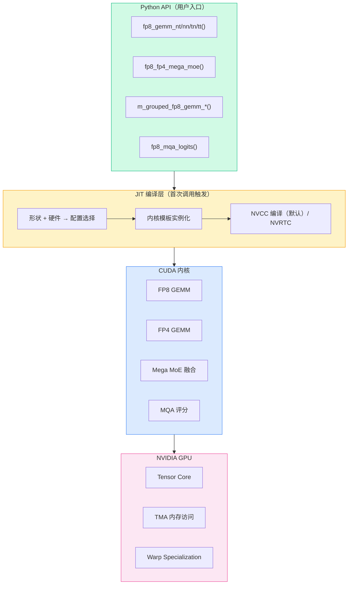
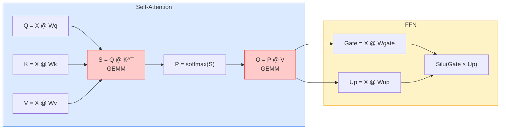
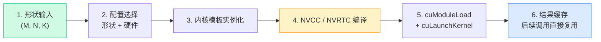
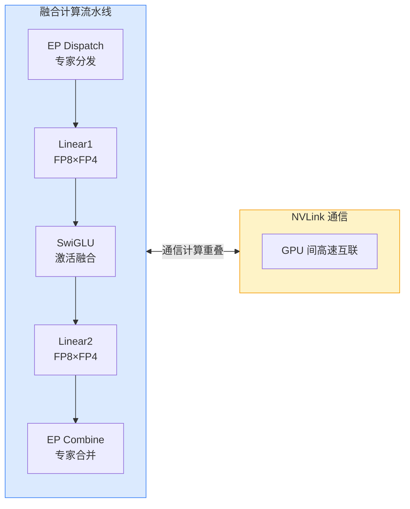
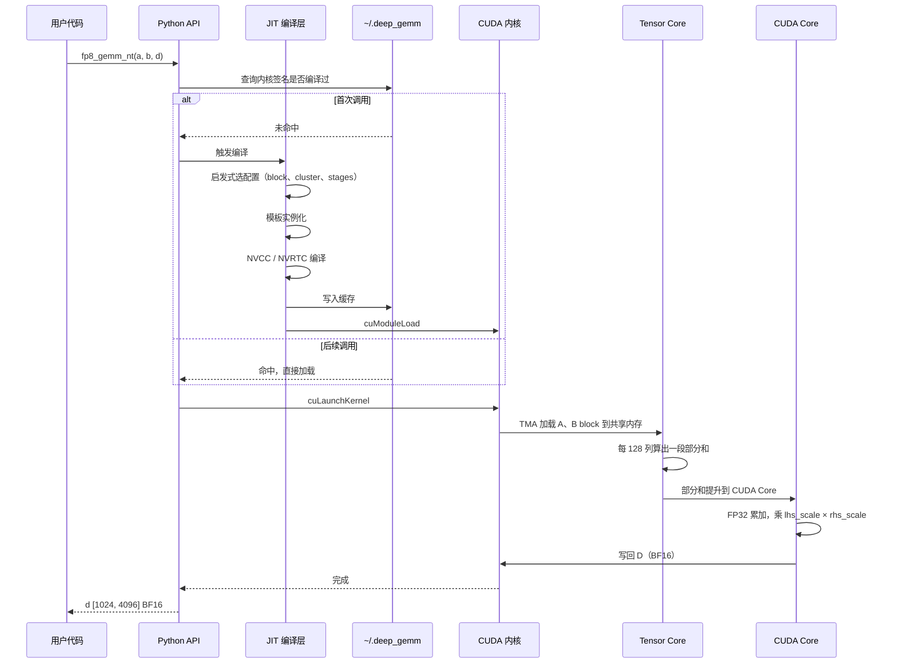

CUTLASS、cuBLAS 都能写出 FP8 内核，DeepGEMM 换了一种做法。它不追求 CUTLASS 那种覆盖全场景的模板扩展性，而是把 Hopper（SM90）/ Blackwell（SM100）上 LLM 计算最常用的那几类原语——FP8/FP4/BF16 的 GEMM、融合 MoE（Mega MoE）、MQA 评分、HyperConnection——收进一个运行时 JIT 编译的代码库。内核实现在一个 include 目录里，单文件 74–1460 行，风格直白。代价是形状覆盖比 CUTLASS 窄，换来的是安装时不编译内核、代码可读可改、常用形状首调即峰值。

面向 GPU 内核工程师、深度学习框架开发者、LLM 推理优化工程师。读这篇需要 CUDA 编程基础、GEMM 计算原理和混合精度训练/推理的经验。

## 目录

- [一张图看清 DeepGEMM 在做什么](#一张图看清-deepgemm-在做什么)
- [FP8 GEMM 为什么值得单独做一个库](#fp8-gemm-为什么值得单独做一个库)
- [系统架构：JIT 编译怎么把模板换掉](#系统架构jit-编译怎么把模板换掉)
- [核心内核详解](#核心内核详解)
- [任务流案例：一次 FP8 GEMM 从输入到输出](#任务流案例一次-fp8-gemm-从输入到输出)
- [性能：1550 TFLOPS 这个数字测的是什么](#性能1550-tflops-这个数字测的是什么)
- [安装与使用](#安装与使用)
- [高级配置](#高级配置)
- [应用场景与内核选择](#应用场景与内核选择)
- [与 CUTLASS、cuBLAS 的取舍](#与-cutlasscublas-的取舍)
- [采用顺序与适用边界](#采用顺序与适用边界)
- [常见疑问](#常见疑问)
- [相关资源](#相关资源)

---

## 一张图看清 DeepGEMM 在做什么


```mermaid
flowchart TB
    subgraph Python["Python API（用户入口）"]
        GEMM["fp8_gemm_nt/nn/tn/tt()"]
        MOE["fp8_fp4_mega_moe()"]
        GROUP["m_grouped_fp8_gemm_*()"]
        MQA["fp8_mqa_logits()"]
    end

    subgraph JIT["JIT 编译层（首次调用触发）"]
        CONFIG["形状 + 硬件 → 配置选择"]
        TEMPLATE["内核模板实例化"]
        NVRTC["NVCC 编译（默认）/ NVRTC"]
        CONFIG --> TEMPLATE --> NVRTC
    end

    subgraph Kernels["CUDA 内核"]
        FP8G["FP8 GEMM"]
        FP4G["FP4 GEMM"]
        MEGA["Mega MoE 融合"]
        MQAK["MQA 评分"]
    end

    subgraph Hardware["NVIDIA GPU"]
        TC["Tensor Core"]
        TMA["TMA 内存访问"]
        WARP["Warp Specialization"]
    end

    Python --> JIT
    JIT --> Kernels
    Kernels --> Hardware

    style Python fill:#d1fae5,stroke:#10b981
    style JIT fill:#fef3c7,stroke:#f59e0b
    style Kernels fill:#dbeafe,stroke:#3b82f6
    style Hardware fill:#fce7f3,stroke:#ec4899
```

四层各管一段：

| 层 | 职责 | 关键决策 |
|----|------|----------|
| Python API | GEMM 为主，另有分组 GEMM、Mega MoE、MQA 评分、HyperConnection 等入口 | 函数命名按 `精度_算子_布局` 约定，接口面小 |
| JIT 编译层 | 首次调用时按形状 + 硬件选配置，NVCC（或 NVRTC）编译 | 用运行时编译换掉 CUTLASS 的多层模板 |
| CUDA 内核 | FP8/FP4/BF16 GEMM、MoE 融合、MQA 评分、HC prenorm | 每类内核数量少，单文件可读 |
| 硬件层 | Tensor Core + TMA + Warp Specialization | 主线内核只支持 SM90（Hopper）和 SM100（Blackwell） |

仓库信息放在这里，不放在开头（GitHub API 2026-09-08 验证）：

| 属性 | 值 |
|------|-----|
| 仓库 | [github.com/deepseek-ai/DeepGEMM](https://github.com/deepseek-ai/DeepGEMM) |
| 描述 | clean and efficient BLAS kernel library on GPU |
| Stars | 7,785 |
| Forks | 1,236 |
| 语言 | Cuda |
| 许可证 | MIT License |
| 创建 | 2025-02-13 |
| 最近推送 | 2026-08-27 |
| 当前版本 | 2.6.1（main 分支 `deep_gemm/__init__.py`，2026-07-15 "Public release 26/07"） |
| 支持精度 | FP8、FP4、BF16 的 GEMM；FP32 输出/累加；TF32（HC prenorm 内核） |
| 官方峰值 | H800 上最高 1550 TFLOPS（2025-04 News 口径） |

---

## FP8 GEMM 为什么值得单独做一个库

### GEMM 在 Transformer 里的位置

GEMM（General Matrix Multiply，通用矩阵乘）算的是 `C = α · (A @ B) + β · C`，其中 `A` 是 `[M × K]`，`B` 是 `[K × N]`，`C` 是 `[M × N]`。Transformer 里计算量最大的几类算子都是 GEMM：Q/K/V 投影、attention scores、output projection、FFN 的两层线性变换。


```mermaid
flowchart LR
    subgraph SelfAttention["Self-Attention"]
        direction TB
        Q["Q = X @ Wq"]
        K["K = X @ Wk"]
        V["V = X @ Wv"]
        QK["S = Q @ K^T<br/>GEMM"]
        SOFTMAX["P = softmax(S)"]
        OV["O = P @ V<br/>GEMM"]
        Q & K & V --> QK
        QK --> SOFTMAX
        SOFTMAX --> OV
    end

    subgraph FFN["FFN"]
        direction TB
        GATE["Gate = X @ Wgate"]
        UP["Up = X @ Wup"]
        SILU["Silu(Gate × Up)"]
        GATE & UP --> SILU
    end

    OV --> GATE
    OV --> UP

    style SelfAttention fill:#dbeafe,stroke:#3b82f6
    style FFN fill:#fef3c7,stroke:#f59e0b
    style QK fill:#fecaca,stroke:#ef4444
    style OV fill:#fecaca,stroke:#ef4444
```

在 prefill（预填充，整个 prompt 一次前向）这类大批量场景下，这些 GEMM 构成计算时间的大头，GEMM 这一环的提速会直接传导到整条推理路径。这是 FP8 GEMM 值得单独做一个库的直接原因。

### FP8 的两套格式

FP8 是 8 位浮点，NVIDIA 从 Hopper 架构开始在 Tensor Core 硬件层支持。它有两种编码：

| 格式 | 指数位 | 尾数位 | 最大值 | 传统分工 |
|------|--------|--------|--------|----------|
| FP8 E4M3 | 4 | 3 | 448 | 前向传播（数值分布集中，要多留精度） |
| FP8 E5M2 | 5 | 2 | 57344 | 反向传播的梯度（跨度大，要多留动态范围） |

E4M3 尾数多一位、动态范围窄；E5M2 指数多一位、动态范围大但精度低。传统混合方案（NVIDIA Transformer Engine 等）前向用 E4M3、反向用 E5M2。DeepSeek-V3 的做法不同——凭细粒度缩放压住了数值跨度，训练的所有张量统一用 E4M3（论文 "Mantissa over Exponents" 一节），所以 DeepGEMM 的输入也全是 E4M3。想用 FP8，选哪套格式、什么粒度做缩放，是要一起设计的事。

### 细粒度缩放：FP8 不掉精度的关键

FP8 的动态范围只有 FP16 的几分之一，全局一个缩放因子时，数值稍大就溢出、稍小就截断。DeepGEMM 沿用 DeepSeek-V3 论文的细粒度缩放（fine-grained scaling）：每个计算块独立选一个缩放因子。

```python
# 粗粒度：全局一个 scale，容易溢出或截断
A_fp8 = quantize(A, scale=global_scale)

# 细粒度：每块独立 scale，块内分布集中时能选更紧的 scale
A_fp8 = quantize(A, scale=per_block_scale)
```

两侧的缩放粒度不一样：activations 按 1×128 的 tile 缩放（每 token 每 128 通道），weights 按 128×128 的 block 缩放（每 128 输入通道 × 128 输出通道）。分布更分散的 activation 拿到更细的 scale，weight 的 scale 表也更紧凑。代价有两点：scale 张量本身占内存，内核要在 CUDA Core 上多做一次 scale 乘法。

### 累加精度：两级累加的取舍

FP8 真正难的不只是输入量化，还有累加。DeepSeek-V3 论文实测：H800 上 FP8 GEMM 的 Tensor Core 累加只保留每个尾数乘积的最高约 14 位，高位截断，内维 K 一大误差就积累。DeepGEMM 的处理是把精度控制拆成两层：

1. **Tensor Core 先算一段**：每推进 128 列（论文实验里这相当于 4 次 WGMMA 指令，是不明显增加开销的最小累加间隔），让 Tensor Core 在自己的累加器里算出一小段部分和。
2. **CUDA Core 兜底累加**：把这小段部分和搬进 CUDA Core 的 FP32 寄存器做完整精度累加，scale 因子的乘法也在这里顺带完成（相当于反量化）。

这样 FP8 算力照常由 Tensor Core 提供，精度由 CUDA Core 的 FP32 累加接管，两级的投入都只花在刀刃上。到了 Blackwell（SM100），`tcgen05.mma` 指令配合 TMEM 原生支持 block 缩放，走的是另一条更省心的路径，不再需要显式做 CUDA Core 提升。

---

## 系统架构：JIT 编译怎么把模板换掉

### 和 CUTLASS 的区别

CUTLASS 用多层 C++ 模板在编译期生成内核组合，覆盖面广，但代码量大、学习曲线陡，改一个内核要在模板层里穿很久。DeepGEMM 把这块挪到运行时：

| 方面 | CUTLASS | DeepGEMM |
|------|---------|----------|
| 模板复杂度 | 极高，多层嵌套 | 有限数量的核心函数 |
| 编译方式 | 编译期实例化，安装需要 CUDA 工具链 | JIT 运行时编译，安装不编译内核 |
| 单个内核实现 | 万行级模板体系 | 小文件直读（当前 impls 目录 74–1460 行/文件） |
| 学习曲线 | 陡峭 | 平缓 |
| 形状覆盖 | 高 | 中等 |

第三行需要交代来历：2025 年 2 月刚开源时，README 的说法是"只有一个核心内核函数，约 300 行代码"；两年来内核演进到 FP4、Mega MoE、HC 等一族，如今 SM90 FP8 GEMM 的主实现约 450 行，最复杂的 SM100 FP8×FP4 Mega MoE 约 1460 行。"几百行读一个内核"仍然成立，"300 行"已经只对早期版本成立。

DeepGEMM 借鉴了 CUTLASS / CuTe 的一些概念，依赖它们做编译期基础设施（仓库以 Git submodule 挂 CUTLASS 4.2），但没有重度依赖它们的模板和代数。它不做全场景覆盖，而是把 LLM 推理常用的几类形状做到接近峰值。

### JIT 编译流程


```mermaid
flowchart LR
    S1["1. 形状输入<br/>(M, N, K)"] --> S2["2. 配置选择<br/>形状 + 硬件"]
    S2 --> S3["3. 内核模板实例化"]
    S3 --> S4["4. NVCC / NVRTC 编译"]
    S4 --> S5["5. cuModuleLoad<br/>+ cuLaunchKernel"]
    S5 --> S6["6. 结果缓存<br/>后续调用直接复用"]

    style S1 fill:#d1fae5,stroke:#10b981
    style S4 fill:#fef3c7,stroke:#f59e0b
    style S6 fill:#dbeafe,stroke:#3b82f6
```

首次调用某个形状时，DeepGEMM 按启发式规则枚举候选配置（block 大小、cluster 形状、pipeline 深度等）并比较排序，选出最优者，实例化内核模板，编译成 CUBIN，通过 `cuModuleLoad` 加载执行。这一步是确定性启发式，不是运行时 autotuning，所以同一形状每次都得到同一个内核；`DG_PRINT_CONFIGS=1` 可以打印每个形状选中的配置。编译产物按内核签名哈希缓存到 `~/.deep_gemm/cache`（可用 `DG_JIT_CACHE_DIR` 覆盖），后续相同形状直接复用。

编译器有两条路径，默认走 NVCC：

- **NVCC（默认）**：性能最优。2025-07 的重构把 NVRTC 和编译后 SASS 优化默认关掉，理由是 NVCC 12.9 起自动做 FFMA 交错，后处理已无必要。
- **NVRTC（可选）**：`DG_JIT_USE_NVRTC=1` 打开，编译快最多 10 倍，个别形状可能变慢，适合开发期频繁改内核时减少等待。源码要求 NVRTC 版本不低于 12.3。

这套设计带来两个结果：

1. 安装时不编译内核，`pip install` 完就能装上——但运行时 JIT 仍需要机器上有 CUDA 工具链（NVCC）或 NVRTC 库。
2. 同一份代码在 SM90 和 SM100 上自动选不同实现，不用为每代 GPU 单独编译。

代价是首次调用有编译延迟（秒级），生产环境建议在服务启动时 warmup 常用形状。

---

## 核心内核详解

### 普通 GEMM：SM90 只有 NT 布局

DeepGEMM 的普通 GEMM 命名遵循 `fp8_gemm_<A布局><B布局>`，计算约定是 `D = C + A @ B`（`C` 可选，省略即 `D = A @ B`）。注意一个前提：SM90 实现只支持 NT 布局（A 行主、B 列主），SM100 才同时支持 NT/TN/NN/TT 四种。

| 函数 | A 布局 | B 布局 | 说明 |
|------|--------|--------|------|
| `fp8_gemm_nt` | row-major | col-major | SM90 唯一支持，算 `D = C + A @ B.T` |
| `fp8_gemm_nn` | row-major | row-major | 仅 SM100 |
| `fp8_gemm_tn` | col-major | row-major | 仅 SM100 |
| `fp8_gemm_tt` | col-major | col-major | 仅 SM100 |

真实的函数签名是 `fp8_gemm_nt(a, b, d, c=None)`：`a`、`b` 各是 `(fp8 张量, scale 张量)` 二元组，`d` 是调用方预分配的输出张量，输出类型由 `d` 的 dtype 决定（BF16 或 FP32），要累加就把 `c` 传成 `d`。完整可运行的调用放在「安装与使用 → 快速开始」，这里集中看缩放因子的布局约束：

```python
# SM90（Hopper）：
#   LHS 缩放因子要求 FP32、TMA 对齐且转置布局（per-token 1x128）
#   RHS 缩放因子 FP32（per-block 128x128）
# SM100（Blackwell）：
#   缩放因子要求打包 UE8M0（4 个 UE8M0 打进一个 int32），
#   直接传 FP32 时接口内部自动取整并打包（disable_ue8m0_cast=False 默认行为）
d = deep_gemm.fp8_gemm_nt(a, b, d)   # a=(A_fp8, A_scale), b=(B_fp8, B_scale)
```

输入转置、FP8 转型这类操作内核不替你做，需要在前面的内核里自己处理或融合。库提供了一组 PyTorch 工具函数（`deep_gemm.utils.math` 里的 `per_token_cast_to_fp8`、`per_block_cast_to_fp8`，`transform_sf_into_required_layout`、`get_mn_major_tma_aligned_tensor` 等）辅助量化和布局转换，官方也说明这些纯 Python 实现有额外开销，生产路径建议把量化融合进前序内核——库的主攻方向是 GEMM 内核本身。

GPU 上同时跑推理服务时，多留一个心眼：用 `deep_gemm.set_num_sms(120)` 把 SM 数量限定在可用范围（H100/H800 共 132 个 SM），给 NCCL、CUDA Graph capture、内存拷贝留出空间，能避免多流并发时的尾部延迟尖刺。

### 分组 GEMM：MoE 场景的批量计算

分组 GEMM 服务 MoE（Mixture of Experts）：多个专家共享形状但处理不同 token。与 CUTLASS 的分组不同，DeepGEMM 只沿 M 轴分组，N 和 K 必须固定，适合专家形状一致的场景。有两种布局：

```python
# 连续布局（contiguous）：所有专家的 token 拼接成一个 [total_tokens, K]，
# grouped_layout 标记每个 token 属于哪个专家。训练前向 / 推理 prefill 用。
deep_gemm.m_grouped_fp8_gemm_nt_contiguous(
    a,               # (fp8 张量 [total_tokens, K], scale 张量)
    b,               # (fp8 张量 [num_experts, N, K], scale 张量)
    d,               # 预分配输出 [total_tokens, N]，BF16
    grouped_layout,  # int32 [total_tokens]，token → 专家映射
)

# masked 布局：给一个 [num_experts] 的实际 token 数向量，
# 内核只算有效部分。decode（逐 token 生成）阶段配合 CUDA graph 用。
deep_gemm.m_grouped_fp8_gemm_nt_masked(
    a,               # (fp8 张量 [num_experts, max_tokens, K], scale 张量)
    b,               # (fp8 张量 [num_experts, N, K], scale 张量)
    d,               # 预分配输出 [num_experts, max_tokens, N]
    masked_m,        # int [num_experts]，每个专家实际要算的 token 数
    expected_m,      # 预期的每专家 token 数（供内核选配置）
)
```

连续布局要求每个专家段对齐到 GEMM 的 M block 大小，对齐值用 `get_mk_alignment_for_contiguous_layout()` 查询（默认 128；SM100 上可先取 `get_theoretical_mk_alignment_for_contiguous_layout()` 的按形状缩小值，32–224，再用 `set_mk_alignment_for_contiguous_layout()` 生效，官方测试即此用法）。masked 布局用在 decode 阶段 CUDA graph 开启、CPU 不知道每个专家收多少 token 的场合，官方给的典型输入是 [DeepEP](https://github.com/deepseek-ai/DeepEP) 低延迟内核的输出。v26.04 起连续布局还有 psum 变体（`use_psum_layout` 参数），Mega MoE 的基线对比用的就是它。

MoE 的反向（weight gradient）走另一个按 K 轴分组的 `k_grouped_fp8_gemm_tn_contiguous`，此时 M、N 固定。2025-05 加入，是主线里少数明确面向训练的内核。

### Mega MoE：把通信和计算叠在一起

Mega MoE 是 DeepGEMM 最复杂的内核，把 MoE 推理的 EP（Expert Parallel）分发、Linear1（FP8×FP4）、SwiGLU 激活、Linear2（FP8×FP4）、EP 合并全部融合进一个 mega-kernel，让 NVLink 通信和 Tensor Core 计算重叠：


```mermaid
flowchart LR
    subgraph Compute["融合计算流水线"]
        EP1["EP Dispatch<br/>专家分发"] --> L1["Linear1<br/>FP8×FP4"]
        L1 --> SWI["SwiGLU<br/>激活融合"]
        SWI --> L2["Linear2<br/>FP8×FP4"]
        L2 --> EPC["EP Combine<br/>专家合并"]
    end

    subgraph Communication["NVLink 通信"]
        NV["GPU 间高速互联"]
    end

    Compute <-->|通信计算重叠| Communication

    style Compute fill:#dbeafe,stroke:#3b82f6
    style Communication fill:#fef3c7,stroke:#f59e0b
```

非融合方案里，EP Dispatch、Linear1、SwiGLU、Linear2、EP Combine 各自的中间结果都要落一次 HBM，中间夹着跨 GPU 的 NVLink 同步。Mega MoE 把中间结果留在 SM 寄存器或共享内存，只在 EP Dispatch 和 EP Combine 时走 NVLink，并让 NVLink 传输与 Tensor Core 计算重叠。它还顺带支持共享专家（`num_shared_experts` 参数）和 BF16×BF16 的 `bf16_mega_moe` 变体。

```python
# 需要多进程启动 + 对称内存，PyTorch >= 2.9
buffer = deep_gemm.get_symm_buffer_for_mega_moe(
    group, num_experts, num_max_tokens_per_rank,
    num_topk, hidden, intermediate_hidden
)

# 权重预变换（FP4 + UE8M0 scale 布局，一次即可）
transformed_l1, transformed_l2 = deep_gemm.transform_weights_for_mega_moe(
    l1_weights, l2_weights
)

# 每次调用前填充缓冲
buffer.x[:num_tokens].copy_(x_fp8)
buffer.x_sf[:num_tokens].copy_(x_sf)
buffer.topk_idx[:num_tokens].copy_(topk_idx)
buffer.topk_weights[:num_tokens].copy_(topk_weights)

y = torch.empty((num_tokens, hidden), dtype=torch.bfloat16, device='cuda')
deep_gemm.fp8_fp4_mega_moe(y, transformed_l1, transformed_l2, buffer)
```

`get_symm_buffer_for_mega_moe` 拿到的是对称内存缓冲区，这是通信计算重叠的前提——对称内存让 GPU 之间直接读写对方显存，不必逐次拷贝。PyTorch 2.9 之前没有对称内存 API，所以 Mega MoE 对 PyTorch 版本有硬要求。多进程完整示例和 benchmark 脚本在 `tests/test_mega_moe.py`。

### MQA 评分：DeepSeek V3.2 的 Lightning 索引器

MQA（Multi-Query Attention）评分内核服务 DeepSeek V3.2 的 Lightning 索引器（lightning indexer），做 token 到 token 的 logit 计算。2025-09 加入主线，2026-04 的 v26.04 又补了 FP4 版本（`fp8_fp4_mqa_logits`，原 FP8 接口保留为兼容别名）。它有非分页 `fp8_mqa_logits`（prefill 用）和分页 `fp8_paged_mqa_logits`（decode 用）两个版本。以非分页版为例，主要输入有 6 个：

```python
output = deep_gemm.fp8_mqa_logits(
    q,                    # [seq_len, num_heads, head_dim]，E4M3
    kv,                   # ([seq_len_kv, head_dim] E4M3, [seq_len_kv] float scale)
    weights,              # [seq_len, num_heads]，float
    cu_seq_len_k_start,   # int [seq_len]，每个 query 对应 kv 区间的起点
    cu_seq_len_k_end,     # int [seq_len]，对应终点
    clean_logits,         # 是否把未填充的 logit 清成 -inf
)                         # 另有可选 max_seqlen_k=0
```

对每个 query `i`，它遍历 `[cu_seq_len_k_start[i], cu_seq_len_k_end[i])` 里的 token `j`，算 `q[i] @ kv[j]` 后过 ReLU、乘上权重、按头求和：

```python
kv_j = kv[0][j, :] * kv[1][j].unsqueeze(1)  # [head_dim]
out_ij = q[i, :, :] @ kv_j  # [num_heads]
out_ij = out_ij.relu() * weights[i, :]  # [num_heads]
out_ij = out_ij.sum()  # 标量，即 out[i, j]
```

query 和 kv 的长度都不固定，靠累积和描述的区间决定每个 query 看哪些 kv。在 DeepSeek V3.2 的推理里，这套 logit 内核负责稀疏注意力的路由打分，选出参与完整 attention 计算的 token 对，完整注意力内核则在 [FlashMLA](https://github.com/deepseek-ai/FlashMLA)。

### FP4 与 HyperConnection

DeepGEMM 是少数支持 FP4 矩阵乘法的库。FP4 编码用 E2M1（1 位符号、2 位指数、1 位尾数），权重存 4 位、activations 仍是 FP8，通过 `fp8_fp4_gemm_*` 一族入口调用（实际上 `fp8_gemm_nt` 等就是它的别名，任一侧都可以是 E4M3 或打包 FP4；SM90 上额外要求两侧 K 主序）。FP4 的块缩放因子用 UE8M0 格式——8 位全是指数位、没有尾数，专为 block 缩放设计；SM100 上 4 个 UE8M0 打包进一个 int32。哪一侧放 FP4 由量化方案决定，内核按输入 dtype 走对应的 MX 路径。

另一个新原语是 HyperConnection（HC）。README 把它列进"现代 LLM 的关键计算原语"但没给论文出处，具体到 DeepGEMM 里是一个叫 `tf32_hc_prenorm_gemm` 的内核：一次算出 `a @ b.T`（TF32 精度，a 为 BF16、b 为 FP32）和每行的平方和 `sqr_sum`（prenorm 归一化要用），并支持 `num_splits` 分片求和。连接方式怎么进模型权重，超出这篇的范围，读者可以到 `tests/test_hyperconnection.py` 看行为定义。

---

## 任务流案例：一次 FP8 GEMM 从输入到输出

以 `fp8_gemm_nt(M=1024, N=4096, K=4096)` 为例，看一次首次调用的 FP8 GEMM 在 DeepGEMM 内部经历了什么。


```mermaid
sequenceDiagram
    participant User as 用户代码
    participant API as Python API
    participant JIT as JIT 编译层
    participant Cache as ~/.deep_gemm
    participant Kernel as CUDA 内核
    participant TC as Tensor Core
    participant CC as CUDA Core

    User->>API: fp8_gemm_nt(a, b, d)
    API->>Cache: 查询内核签名是否编译过
    alt 首次调用
        Cache-->>API: 未命中
        API->>JIT: 触发编译
        JIT->>JIT: 启发式选配置（block、cluster、stages）
        JIT->>JIT: 模板实例化
        JIT->>JIT: NVCC / NVRTC 编译
        JIT->>Cache: 写入缓存
        JIT->>Kernel: cuModuleLoad
    else 后续调用
        Cache-->>API: 命中，直接加载
    end
    API->>Kernel: cuLaunchKernel
    Kernel->>TC: TMA 加载 A、B block 到共享内存
    TC->>TC: 每 128 列算出一段部分和
    TC->>CC: 部分和提升到 CUDA Core
    CC->>CC: FP32 累加，乘 lhs_scale × rhs_scale
    CC->>Kernel: 写回 D（BF16）
    Kernel-->>API: 完成
    API-->>User: d [1024, 4096] BF16
```

几个关键点：

1. **配置选择**：JIT 层按 `(M, N, K)` 和当前 GPU 用启发式规则（单波优先、多播优先、波数少优先）枚举候选并排序，同一形状结果确定，没有运行时 autotuning。
2. **TMA 加载**：Hopper 的 TMA 单元把 A、B block 从 HBM 异步搬到共享内存。Warp Specialization 让一部分 warp 专职 TMA 加载、另一部分做 Tensor Core 计算，靠 barrier 同步。
3. **缩放应用**：`lhs_scale × rhs_scale` 在 CUDA Core 的 FP32 累加阶段乘上，不在 FP8 输入上乘。FP8 的精度损失只发生在输入量化阶段，GEMM 内部累加是 FP32。
4. **输出类型**：`d` 支持 BF16 和 FP32 两种，下游算子通常吃 BF16。没有 FP8 输出选项。

首次调用编译延迟在秒级，后续走缓存、开销微秒级。生产环境在服务启动时 warmup 常用形状。

---

## 性能：1550 TFLOPS 这个数字测的是什么

### 这个数字从哪来

DeepGEMM 官方在 H800 上报告的最高 1550 TFLOPS，出自 2025-04 的一批优化（News 2025.04.18，对应 PR #74/#78/#81/#86 和提交 340d988）。README 对整体性能的定位是一句话：在一系列矩阵形状上，性能匹配或超过专家手工调优的库。

**能推出和不能推出的**：

- 它反映的是 FP8 Tensor Core 在高利用率、大批量形状下的计算吞吐，说明配置选择、TMA 带宽利用、Warp Specialization 覆盖这些环节做到位了。
- 它不代表你的真实推理吞吐。推理瓶颈常在 KV cache、attention、MoE 路由，不在 GEMM。
- 它不代表小 batch 性能。峰值数字对应的大批量形状，M=1 时 Tensor Core 利用率低，性能会明显下降。
- 它不代表训练场景。训练有反向、梯度同步、optimizer 更新，GEMM 占比不同。
- 它只对支持 FP8 的 Hopper/Blackwell 成立。

拿这个数字评估自己项目时，先 profile 找到瓶颈，再决定要不要换，别拿峰值当自己的吞吐。

### NVRTC：编译速度和性能的权衡

```bash
# 默认 0，用 NVCC 编译，性能最优
# 设 1 用 NVRTC，编译最多快 10 倍，个别形状可能有性能损失
export DG_JIT_USE_NVRTC=1
```

开发时频繁改内核，可以临时开 NVRTC 减少等待；生产部署保持默认的 NVCC 路径。

---

## 安装与使用

### 环境要求

| 组件 | 要求 |
|------|------|
| GPU | NVIDIA SM90（Hopper）或 SM100（Blackwell） |
| CUDA | 12.3+（SM90，官方建议 12.9+ 以获得最佳性能），12.9+（SM100） |
| Python | 3.8+ |
| PyTorch | 2.1+（Mega MoE 需要 2.9+） |
| CUTLASS | 4.0+（Git submodule，当前锁 4.2） |
| {fmt} | Git submodule（当前 11.2.1） |
| 编译器 | C++20 支持 |

A100（SM80）跑不了主线 CUDA 内核——FP8 Tensor Core 是 Hopper 才有的硬件单元。仓库另带一套 `deep_gemm.legacy` 的 Triton 分组 GEMM 内核，按源码注释只面向 Ampere，属兼容性质而非优化重点。

### 安装步骤

```bash
# 1. 克隆仓库（含子模块）
git clone --recursive git@github.com:deepseek-ai/DeepGEMM.git
cd DeepGEMM

# 2. 链接 CUTLASS 头文件、构建 CPP JIT 模块
./develop.sh

# 3. 安装（优先下载匹配环境的预编译 wheel，
#    下载不到才本地构建；DG_FORCE_BUILD=1 强制本地构建）
./install.sh

# 4. 验证
python -c "import deep_gemm; print(deep_gemm.__version__)"
```

`install.sh` 内部跑 `setup.py bdist_wheel`，`bdist_wheel` 被替换成 `CachedWheelsCommand`：先按 CUDA/torch/Python/ABI 组合从 GitHub Releases 拉预编译 wheel，失败则回退本地构建。装上的包不含编译好的内核——内核在运行时由 JIT 编译。

### 快速开始

下面是一段在 SM90 上可跑通的完整流程（SM100 需要把 scale 转成打包 UE8M0，见注释）：

```python
import torch
import deep_gemm

M, N, K = 1024, 4096, 4096
a = torch.randn(M, K, device='cuda', dtype=torch.bfloat16)
b = torch.randn(N, K, device='cuda', dtype=torch.bfloat16)

# 量化：activation per-token 1x128，weight per-block 128x128
# 库自带 Python 工具函数（生产路径建议融合进前序内核）
a_fp8, a_sf = deep_gemm.per_token_cast_to_fp8(a, use_ue8m0=False)
b_fp8, b_sf = deep_gemm.per_block_cast_to_fp8(b, use_ue8m0=False)

# NT 布局：a [M, K] 行主，b [N, K]（内核按 B.T 用）
# SM100 上直接传 FP32 scale 也行：接口内部会取整并打包成 UE8M0 int32
d = torch.empty(M, N, device='cuda', dtype=torch.bfloat16)
deep_gemm.fp8_gemm_nt((a_fp8, a_sf), (b_fp8, b_sf), d)

print(d.shape)   # torch.Size([1024, 4096])
print(d.dtype)   # torch.bfloat16，输出类型由 d 的 dtype 决定（BF16/FP32）
```

首次运行有编译延迟——JIT 在编译 `(1024, 4096, 4096)` 形状的内核——第二次起直接走缓存。

---

## 高级配置

### 环境变量

README 列出的全部变量，按用途分组：

| 变量 | 默认值 | 说明 |
|------|--------|------|
| `DG_JIT_DEBUG` | 0 | 打印 JIT 调试信息 |
| `DG_PRINT_CONFIGS` | 0 | 打印每个形状选中的配置 |
| `DG_JIT_CACHE_DIR` | `~/.deep_gemm` | JIT 缓存目录 |
| `DG_JIT_USE_NVRTC` | 0 | 用 NVRTC 代替 NVCC（编译更快，个别形状可能更慢） |
| `DG_JIT_NVCC_COMPILER` | CUDA_HOME 下的 nvcc | NVCC 编译器路径 |
| `DG_JIT_CPP_STANDARD` | 20 | C++ 标准版本 |
| `DG_JIT_PRINT_COMPILER_COMMAND` | 0 | 打印编译命令 |
| `DG_JIT_PTXAS_VERBOSE` | 0 | 显示详细 PTXAS 输出 |
| `DG_JIT_PTXAS_CHECK` | 0 | 断言编译出的内核不使用 local memory |
| `DG_JIT_PRINT_LOAD_TIME` | 0 | 打印内核加载耗时 |
| `DG_JIT_WITH_LINEINFO` | 0 | 嵌入源码行号，供 nsys/ncu 分析 |
| `DG_JIT_DUMP_PTX` | 0 | 导出 PTX |
| `DG_JIT_DUMP_SASS` | 0 | 导出 SASS |
| `DG_JIT_DUMP_ASM` | 0 | 同时导出 PTX 和 SASS |
| `DG_COMM_KERNEL_DEBUG` | 0 | 每次 Mega MoE 调用前清零对称缓冲（调试用） |
| `DG_USE_NVIDIA_TOOLS` | 0 | 在外部 NVIDIA 工具下运行时跳过内部 profiling |
| `DG_SKIP_CUDA_BUILD` | 0 | 安装时跳过 CUDA 扩展构建 |
| `DG_FORCE_BUILD` | 0 | 强制本地构建而非下载预编译 wheel |
| `DG_JIT_USE_RUNTIME_API` | 0 | 用 CUDA Runtime API 加载内核（需 CUDA ≥ 12.8） |

### 性能调优

```python
# 限制使用的 SM 数量（H100/H800 共 132 个），给并发任务留资源
deep_gemm.set_num_sms(120)

# 设置近似的 Tensor Core 利用率上限（整数百分比，默认 100）
deep_gemm.set_tc_util(95)

# 启用 Programmatic Dependent Launch（PDL），让依赖内核提前启动
deep_gemm.set_pdl(1)

# 查看分组 GEMM 连续布局的理论最小 M/K 对齐（SM90 固定 128，SM100 为 32–224）
alignment = deep_gemm.get_theoretical_mk_alignment_for_contiguous_layout()
```

`set_num_sms` 和 `set_tc_util` 都是资源预留手段：前者限制内核占用的 SM 数；后者按 README 的说法设置一个近似的 Tensor Core 利用率（整数百分比，默认 100，随形状描述一起传递）。生产环境里推理服务通常不独占 GPU，留一点资源给 NCCL、CUDA Graph、监控采样，能避免尾部延迟尖刺。

### 调试与 profiling

```bash
# 启用行号（供 nsys/ncu 分析）
export DG_JIT_WITH_LINEINFO=1

# 导出 PTX / SASS，看编译器生成的代码
export DG_JIT_DUMP_PTX=1
export DG_JIT_DUMP_SASS=1

# 打印内核加载耗时
export DG_JIT_PRINT_LOAD_TIME=1
```

`DG_JIT_DUMP_PTX`、`DG_JIT_DUMP_SASS` 在调内核时有用——直接看 NVCC/NVRTC 生成的 PTX 和最终 SASS，判断配置和指令选择是否合理。

---

## 应用场景与内核选择

### 内核选择速查表

| 场景 | 推荐内核 | 精度 | 备注 |
|------|----------|------|------|
| LLM 推理（Prefill） | `fp8_gemm_nt` | FP8 | 大批量，Tensor Core 利用率高 |
| LLM 推理（Decode） | `m_grouped_fp8_gemm_nt_masked` | FP8 | 配合 CUDA graph |
| MoE 训练前向 / 推理 prefill | `m_grouped_fp8_gemm_nt_contiguous` | FP8 | 连续布局，token 重排 |
| MoE 反向（weight gradient） | `k_grouped_fp8_gemm_tn_contiguous` | FP8 | 按 K 轴分组 |
| FP4 权重推理 | `fp8_fp4_gemm_*` | FP8×FP4 | 权重 4 位，省显存省带宽 |
| 多 GPU MoE 推理（EP） | `fp8_fp4_mega_moe` | FP8×FP4 | 融合内核，通信计算重叠，PyTorch ≥ 2.9 |
| 稀疏 attention 路由 | `fp8_mqa_logits` / `fp8_paged_mqa_logits` | FP8 | Lightning 索引器 |

普通 GEMM 在 SM90 上只认 NT 布局，其余布局只在 SM100 可用，选内核前先确认目标卡。

### LLM 推理：Prefill 阶段

```python
def prefill_with_fp8(model, hidden_states):
    # FP8 量化在调用方完成（这里用库的测试工具函数示意）
    x_fp8, x_sf = deep_gemm.per_token_cast_to_fp8(hidden_states, use_ue8m0=False)

    for layer in model.layers:
        # 权重需预先量化为 (fp8, scale) 二元组，以 q 投影 [n_q, K] 为例
        d_q = torch.empty(hidden_states.shape[0], layer.n_q,
                          device='cuda', dtype=torch.bfloat16)
        deep_gemm.fp8_gemm_nt((x_fp8, x_sf), layer.q_weight_fp8, d_q)
        # k、v 投影与 FFN 两层同理
```

Prefill 阶段 batch 大（整个 prompt 一起算），Tensor Core 利用率高，FP8 GEMM 优势最明显。Decode 阶段 batch 小、M 维度掉到个位数，利用率低，瓶颈通常落在 KV cache 读取带宽。

### MoE 推理：DeepSeek V3 风格

```python
# Top-K 专家路由（router 输出 [num_tokens, num_experts]）
topk_weights, topk_idx = torch.topk(router_output, k=8, dim=-1)

# 每 (token, expert) 对占一行：按专家聚合排序、每段 pad 到
# get_mk_alignment_for_contiguous_layout() 的整数倍，得到 total_m 行；
# grouped_layout 记录每行归属的专家（int32，[total_m]）
rows = topk_idx.flatten().to(torch.int32)   # 简化示意，生产路径需重排 + 对齐
d = torch.empty(total_m, n, device='cuda', dtype=torch.bfloat16)
deep_gemm.m_grouped_fp8_gemm_nt_contiguous(
    (hidden_fp8, hidden_sf),   # (fp8, scale)，[total_m, K]
    (expert_fp8, expert_sf),   # (fp8, scale)，[num_experts, N, K]
    d,
    rows,
)

# 加权合并：按 expert 段乘对应 topk 权重并 scatter 回 token 位置（示意）
return d * topk_weights.reshape(-1, 1)
```

如果专家数多、且是多 GPU 推理，直接上 Mega MoE 融合内核，省掉中间结果的 HBM 读写和多次 NVLink 同步。

---

## 与 CUTLASS、cuBLAS 的取舍

| 特性 | DeepGEMM | CUTLASS | cuBLAS |
|------|----------|---------|--------|
| FP8 GEMM | ✅ | ✅ | ✅ |
| FP4 / FP8×FP4 | ✅ | ✅（block 缩放模板） | 无 |
| 分组 GEMM（M 轴，MoE 形状） | ✅ | ✅ | 逐组循环调用 |
| Mega MoE 融合 | ✅ | ❌ | ❌ |
| JIT 编译 | ✅ | ❌ | ❌ |
| 代码可读性 | 高 | 中低 | 闭源 |
| 形状覆盖 | 中等 | 高 | 高 |

DeepGEMM 的独占点落在 Mega MoE 融合和 JIT 编译上。cuBLAS 闭源、覆盖广但不可改，单次 GEMM 之外没有按 MoE 连续布局设计的分组接口；CUTLASS 开源、覆盖最广，代价是模板复杂度。DeepGEMM 的定位是：在 Hopper/Blackwell 上把 LLM 推理最常用的几类 GEMM 做到接近峰值，代码可读可改。顺带一提，它内置了 `cublaslt_gemm_nt/nn/tn/tt` 封装，测试脚本就是用它来对比 FP8 GEMM 对 cuBLASLt 的加速比的。选型时别只看峰值数字，要看你实际工作负载的形状是否在它覆盖的范围内。

---

## 采用顺序与适用边界

### 值得先试的

1. **DeepSeek V3/V3.2 系推理服务**：Mega MoE、MQA 评分这几个内核就是为这个场景写的。
2. **Hopper/Blackwell 上的 LLM 推理服务**：Prefill 阶段用 `fp8_gemm_nt` 换掉手写的 FP8 GEMM。
3. **多 GPU 的 MoE 推理服务**：专家数多时上 Mega MoE，注意 PyTorch ≥ 2.9、多进程 + 对称内存。

### 可以先等的

1. **A100/V100 用户**：主线 CUDA 内核不支持（V100 连 FP8 都没有）；A100 只有 legacy Triton 兼容实现。
2. **训练场景**：除 weight gradient 分组内核外，DeepGEMM 主要面向推理，训练主路径用 PyTorch 原生 FP8 支持更顺。
3. **小 batch 推理（batch=1）**：Tensor Core 利用率低，瓶颈在 KV cache 带宽。
4. **非 LLM 场景**：内核按 LLM 推理的形状调优，其他形状可能不在启发式的最优区间。

### 落地

- 先在推理服务 Prefill 阶段替换 `fp8_gemm_nt`，跑通后再考虑 MoE 服务上 Mega MoE。
- 生产环境做 warmup，把常用形状的 JIT 编译在服务启动时完成。
- 用 `DG_JIT_DUMP_SASS=1` 看生成的汇编，确认配置选择是否合理。

DeepGEMM 不会自动让推理服务快一倍。它只把 GEMM 这一环做到接近峰值，attention、KV cache、MoE 路由、网络通信这些瓶颈它管不到。先 profile 找到瓶颈，再决定要不要换。

---

## 常见疑问

**Q：装了之后 import 报错，说我缺 CUDA，可我明明装了驱动？**

驱动和 CUDA 工具链是两回事。DeepGEMM 安装时不编译内核，但运行时 JIT 要调用 NVCC 或 NVRTC 库，机器上得有完整的 CUDA Toolkit（不只是驱动）。先确认 `nvidia-smi` 能列出 GPU，再确认 `nvcc --version` 有输出，最后看 Python 里 `torch.cuda.is_available()`。

**Q：第一次调用等了好几秒，是不是卡死了？**

不是。那是 JIT 在按当前形状编译内核，秒级延迟正常；编译产物写进 `~/.deep_gemm`，后续同形状调用直接复用。生产环境务必在服务启动时 warmup。

**Q：scale 参数为什么这么麻烦？**

缩放因子和输入张量的布局是绑定的。SM90 要求 LHS 的 scale 是 FP32、TMA 对齐且转置的布局；SM100 则要求打包成 UE8M0——直接传 FP32 时，接口内部会自动取整、打包（`disable_ue8m0_cast=False` 的默认行为）。工具函数 `per_token_cast_to_fp8` / `per_block_cast_to_fp8` / `get_mn_major_tma_aligned_tensor` 都能辅助布局，生产路径建议把这一步融合进前序内核。

**Q：输出能不能直接给 FP8？**

不能。输出张量 `d` 只支持 BF16 和 FP32 两种 dtype（源码里对 `d.scalar_type()` 有断言）。需要 FP8 输入的下游算子，通常紧接着用 `per_token_cast_to_fp8` 再量化一次。

---

## 相关资源

- **GitHub 仓库**：https://github.com/deepseek-ai/DeepGEMM
- **官方文档（README）**：https://github.com/deepseek-ai/DeepGEMM#readme
- **问题反馈**：https://github.com/deepseek-ai/DeepGEMM/issues
- **DeepSeek-V3 技术报告（FP8 训练框架出处）**：https://arxiv.org/abs/2412.19437
- **DeepSeek-V3.2（Lightning 索引器）**：https://github.com/deepseek-ai/DeepSeek-V3.2-Exp
- **FlashMLA（稀疏注意力内核）**：https://github.com/deepseek-ai/FlashMLA
- **DeepEP（EP 通信库）**：https://github.com/deepseek-ai/DeepEP

> 本文数据与源码行为核实自 2026-09-08 的 main 分支（commit 559d79f，版本 2.6.1）与 GitHub API 快照；后续版本可能变动，接口以当时官方 README 为准。
