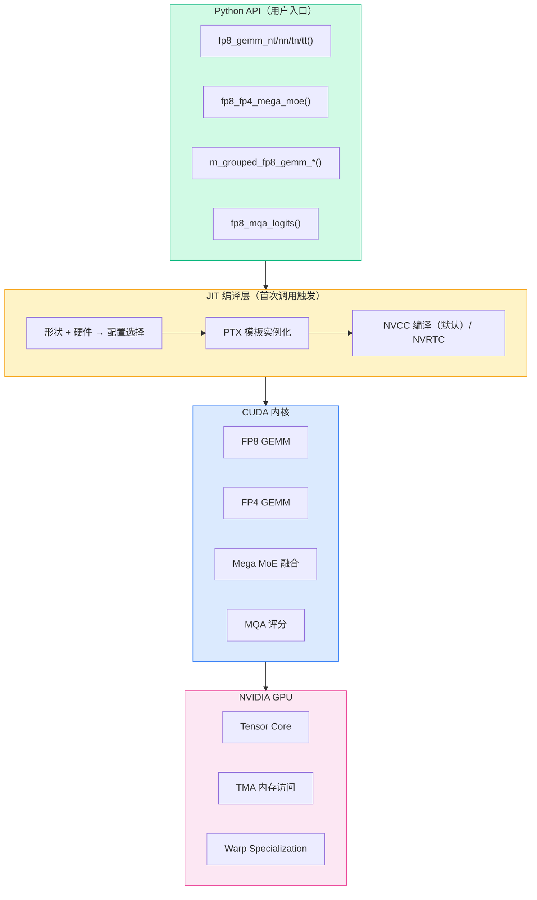
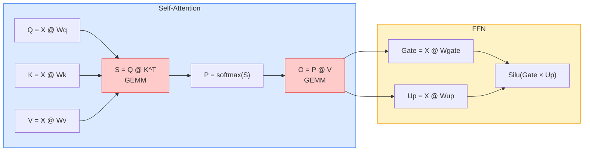
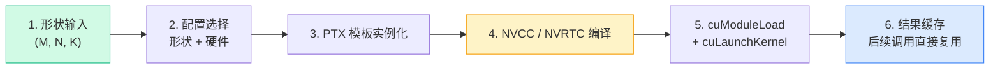
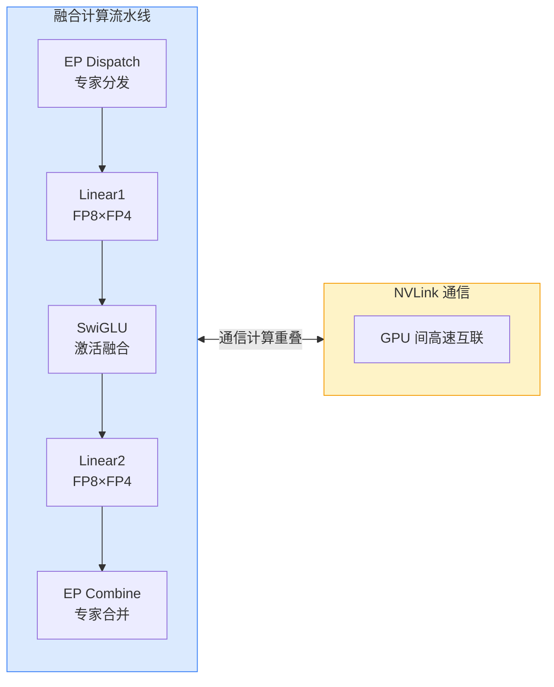
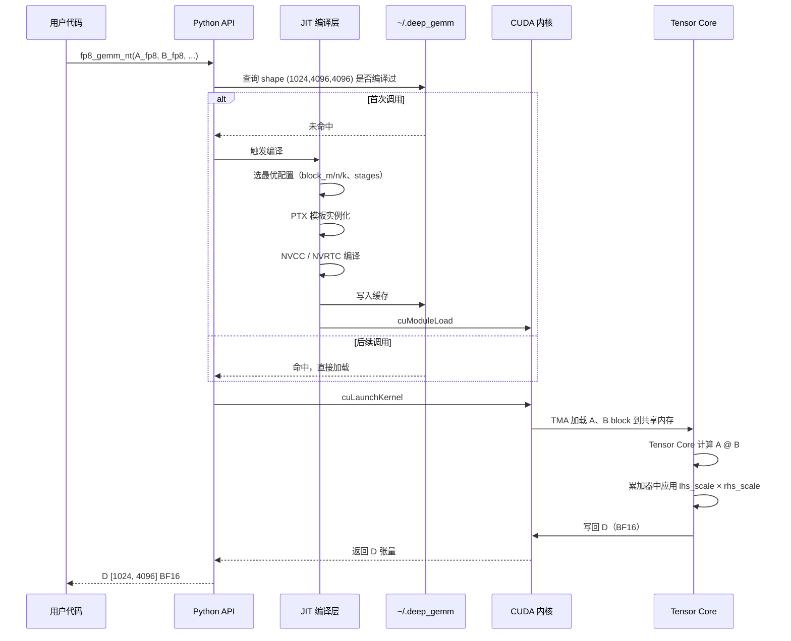

CUTLASS、cuBLAS 都能写出 FP8 内核，DeepGEMM 换了一种做法。它不追求 CUTLASS 那种覆盖全场景的模板扩展性，而是把 Hopper（SM90）/ Blackwell（SM100）上 LLM 计算最常用的那几类 GEMM——FP8/FP4/BF16 的普通 GEMM、融合 MoE（Mega MoE）、MQA 评分、HyperConnection——收进一个核心内核约 300 行、整体风格简洁、运行时 JIT 编译的代码库。代价是形状覆盖会比 CUTLASS 窄，换来的是安装时不需要 CUDA 编译、代码可改、支持的形状上首调即峰值。

面向 GPU 内核工程师、深度学习框架开发者、LLM 推理优化工程师。读这篇需要 CUDA 编程基础、GEMM 计算原理和混合精度训练/推理的经验。

---

## 一张图看清 DeepGEMM 在做什么


```mermaid
flowchart TB
    subgraph Python["Python API（用户入口）"]
        GEMM["fp8_gemm_nt/nn/tn/tt()"]
        MOE["fp8_fp4_mega_moe()"]
        GROUP["m_grouped_fp8_gemm_*()"]
        MQA["fp8_mqa_logits()"]
    end

    subgraph JIT["JIT 编译层（首次调用触发）"]
        CONFIG["形状 + 硬件 → 配置选择"]
        TEMPLATE["PTX 模板实例化"]
        NVRTC["NVCC 编译（默认）/ NVRTC"]
        CONFIG --> TEMPLATE --> NVRTC
    end

    subgraph Kernels["CUDA 内核"]
        FP8G["FP8 GEMM"]
        FP4G["FP4 GEMM"]
        MEGA["Mega MoE 融合"]
        MQAK["MQA 评分"]
    end

    subgraph Hardware["NVIDIA GPU"]
        TC["Tensor Core"]
        TMA["TMA 内存访问"]
        WARP["Warp Specialization"]
    end

    Python --> JIT
    JIT --> Kernels
    Kernels --> Hardware

    style Python fill:#d1fae5,stroke:#10b981
    style JIT fill:#fef3c7,stroke:#f59e0b
    style Kernels fill:#dbeafe,stroke:#3b82f6
    style Hardware fill:#fce7f3,stroke:#ec4899
```

四层各管一段：

| 层 | 职责 | 关键决策 |
|----|------|----------|
| Python API | 暴露 4 类入口：普通 GEMM、分组 GEMM、Mega MoE、MQA 评分 | 函数命名按 `精度_算子_布局` 约定，没有运行时 dispatch |
| JIT 编译层 | 首次调用时按形状 + 硬件选配置，NVCC（或 NVRTC）编译成 PTX | 用运行时编译换掉 CUTLASS 的多层模板 |
| CUDA 内核 | FP8/FP4 GEMM、MoE 融合、MQA 评分 | 每类内核数量少，单文件可读 |
| 硬件层 | Tensor Core + TMA + Warp Specialization | 只支持 SM90（Hopper）和 SM100（Blackwell） |

仓库信息放在这里，不放在开头（GitHub API 2026-08-05 验证）：

| 属性 | 值 |
|------|-----|
| 仓库 | github.com/deepseek-ai/DeepGEMM |
| 描述 | clean and efficient BLAS kernel library on GPU |
| Stars | 7,627 |
| Forks | 1,154 |
| 语言 | Cuda |
| 许可证 | MIT License |
| 创建 | 2025-02-13 |
| 最近推送 | 2026-07-20 |
| 支持精度 | FP8、FP4、BF16、FP32 |
| 官方峰值 | H800 上 1550 TFLOPS（2025-04） |

---

## FP8 GEMM 为什么值得单独做一个库

### GEMM 在 Transformer 里的位置

GEMM（General Matrix Multiply）算的是 `C = α · (A @ B) + β · C`，其中 `A` 是 `[M × K]`，`B` 是 `[K × N]`，`C` 是 `[M × N]`。Transformer 里几乎所有算子都是 GEMM：Q/K/V 投影、attention scores、output projection、FFN 的两层线性变换。


```mermaid
flowchart LR
    subgraph SelfAttention["Self-Attention"]
        direction TB
        Q["Q = X @ Wq"]
        K["K = X @ Wk"]
        V["V = X @ Wv"]
        QK["S = Q @ K^T<br/>GEMM"]
        SOFTMAX["P = softmax(S)"]
        OV["O = P @ V<br/>GEMM"]
        Q & K & V --> QK
        QK --> SOFTMAX
        SOFTMAX --> OV
    end

    subgraph FFN["FFN"]
        direction TB
        GATE["Gate = X @ Wgate"]
        UP["Up = X @ Wup"]
        SILU["Silu(Gate × Up)"]
        GATE & UP --> SILU
    end

    OV --> GATE
    OV --> UP

    style SelfAttention fill:#dbeafe,stroke:#3b82f6
    style FFN fill:#fef3c7,stroke:#f59e0b
    style QK fill:#fecaca,stroke:#ef4444
    style OV fill:#fecaca,stroke:#ef4444
```

在典型 Transformer 推理里，Q/K/V 投影和 FFN 两层 GEMM 合计占到 70-90% 的计算时间。GEMM 快一倍，推理这条路径就快接近一倍。这是 FP8 GEMM 值得单独做一个库的直接原因。

### FP8 的两套格式

FP8 是 8 位浮点，NVIDIA Hopper 架构开始在硬件层支持。它有两种编码：

| 格式 | 指数位 | 尾数位 | 动态范围 | 典型用途 |
|------|--------|--------|----------|----------|
| FP8 E4M3 | 4 | 3 | ~240 | 前向传播、activations |
| FP8 E5M2 | 5 | 2 | ~57344 | 梯度、weights |

E4M3 尾数多一位，精度高但动态范围窄，适合前向传播里数值分布相对集中的 activations；E5M2 指数多一位、动态范围大但精度低，适合反向传播里跨度大的梯度。两套格式都用上，才能在训练里既保精度又吃满 FP8 算力。

| 指标 | FP16 | BF16 | FP8 E4M3 | FP8 E5M2 |
|------|------|------|-----------|-----------|
| 位宽 | 16 | 16 | 8 | 8 |
| 内存节省 | 1× | 1× | **2×** | **2×** |
| 算力提升 | 1× | 1× | **2-4×** | **2-4×** |

### 细粒度缩放：FP8 不掉精度的关键

FP8 的动态范围只有 FP16 的几分之一。全局单一缩放因子下，数值稍大就溢出、稍小就截断。DeepGEMM 用细粒度缩放（fine-grained scaling），每个计算块独立选一个缩放因子：

```python
# 粗粒度：全局一个 scale，容易溢出或截断
A_fp8 = quantize(A, scale=global_scale)

# 细粒度：每块独立 scale，块内分布集中时能选更紧的 scale
A_fp8 = quantize(A, scale=per_block_scale)
```

不同端的缩放粒度还不一样：activations 按 1×128 的 tile 缩放，weights 按 128×128 的 block 缩放。这样分布更分散的 activation 拿到更细的 scale，weight 的 scale 表又能做得紧凑。每个 block 用自己的 scale，能把 FP8 的 8 位用满；额外代价是 scale 张量本身占内存，且内核要在 block 边界做一次反缩放。

### 累加精度：两级累加的取舍

FP8 真正难的不只是输入量化，还有累加。Hopper 的 Tensor Core 累加器精度有限（约相当于 FP22），全程在它里面累加很快就会被误差吃掉。DeepGEMM 的处理是把精度控制的责任拆成两层：

1. **Tensor Core 先算一段**：每推进约 128 列（对应若干次 WGMMA 指令），让 Tensor Core 在自己的累加器里算一小段部分和。
2. **CUDA Core 兜底累加**：把这小段部分和提出来，在 CUDA Core 的 FP32 累加器里做最终求和，同时乘上两侧的 scale 因子。

这样 FP8 的算力照常由 Tensor Core 提供，精度由 CUDA Core 的 FP32 累加器接管，两级的投入都只花在刀刃上。到了 Blackwell（SM100），`tcgen05.mma` 指令 + TMEM 原生支持 block 缩放，走了更省心的另一条路径，不再需要显式做 CUDA Core 提升。

---

## 系统架构：JIT 编译怎么把模板换掉

### 和 CUTLASS 的区别

CUTLASS 用多层 C++ 模板在编译期生成所有可能的内核组合，代码量大、学习曲线陡，改一个内核要在模板迷宫里穿很久。DeepGEMM 把这块挪到运行时：

| 方面 | CUTLASS | DeepGEMM |
|------|---------|----------|
| 模板复杂度 | 极高，多层嵌套 | 有限数量的核心函数 |
| 编译方式 | 预编译，安装时需要 CUDA 工具链 | JIT 运行时编译，安装时不需要 nvcc |
| 核心内核代码量 | 万行级模板 | 约 300 行 |
| 学习曲线 | 陡峭 | 平缓 |
| 扩展性 | 高 | 中等 |

DeepGEMM 从 CUTLASS / CuTe 借鉴了一些概念，但没有重度依赖它们的模板和代数。它不做 CUTLASS 的全场景覆盖，而是把 LLM 推理常用的几类形状做到接近峰值。

### JIT 编译流程


```mermaid
flowchart LR
    S1["1. 形状输入<br/>(M, N, K)"] --> S2["2. 配置选择<br/>形状 + 硬件"]
    S2 --> S3["3. PTX 模板实例化"]
    S3 --> S4["4. NVCC / NVRTC 编译"]
    S4 --> S5["5. cuModuleLoad<br/>+ cuLaunchKernel"]
    S5 --> S6["6. 结果缓存<br/>后续调用直接复用"]

    style S1 fill:#d1fae5,stroke:#10b981
    style S4 fill:#fef3c7,stroke:#f59e0b
    style S6 fill:#dbeafe,stroke:#3b82f6
```

首次调用某个形状时，DeepGEMM 按形状和硬件选最优配置，实例化 PTX 模板，再编译成 PTX/SASS，通过 `cuModuleLoad` 加载执行。编译结果缓存在 `~/.deep_gemm`，后续相同形状的调用直接复用，没有编译开销。

默认编译路径用 NVCC。2025-07 的重构把 NVRTC 和后处理 SASS 优化默认关掉了，需要更快编译时可显式开 NVRTC（编译快约 10 倍，个别形状可能有性能损失）。这套设计带来两个结果：

1. 安装时不需要 CUDA 工具链，`pip install` 完就能跑——只要机器上有 NVIDIA 驱动和 NVRTC/NVCC 运行库。
2. 同一份代码在 SM90 和 SM100 上自动选不同配置，不用为每代 GPU 单独编译。

代价是首次调用有编译延迟（秒级），生产环境建议在服务启动时 warmup。

---

## 核心内核详解

### 普通 GEMM：SM90 只有 NT 布局

DeepGEMM 的普通 GEMM 命名遵循 `fp8_gemm_<A布局><B布局>`，算的是 `D = C + A @ B`。注意一个前提：SM90 实现只支持 NT 布局（A 行主、B 列主），SM100 才同时支持 NT/TN/NN/TT 四种。所以下面这张表在 SM90 上大部分不适用，只有 `nt` 是主力：

| 函数 | A 布局 | B 布局 | 说明 |
|------|--------|--------|------|
| `fp8_gemm_nt` | row-major | col-major | SM90 唯一支持，算 `D = C + A @ B.T` |
| `fp8_gemm_nn` | row-major | row-major | 仅 SM100 |
| `fp8_gemm_tn` | col-major | row-major | 仅 SM100 |
| `fp8_gemm_tt` | col-major | col-major | 仅 SM100 |

```python
import torch
import deep_gemm

M, N, K = 1024, 4096, 4096
device = "cuda"

# FP8 输入 A、B 的量化与缩放因子布局需要由调用方完成
# SM90 上 LHS 缩放因子要求 FP32 格式，且 TMA 对齐、转置布局
A_fp8, A_scale = quantize_fp8(A)   # A_fp8 [M, K] E4M3，A_scale 见上
B_fp8, B_scale = quantize_fp8(B)

D = deep_gemm.fp8_gemm_nt(
    A_fp8, B_fp8,
    lhs_scale=A_scale,
    rhs_scale=B_scale,
    D_dtype=torch.bfloat16,
)
```

`fp8_gemm_nt` 对应 `D = C + A @ B.T`，所以 B 按 `[N, K]` 传入即可。输入转置、FP8 转型这类操作 DeepGEMM 不替你包办，需要在前面的内核里自己处理或融合；库提供了一些 PyTorch 工具函数（如 `get_mn_major_tma_aligned_tensor`、`transform_sf_into_required_layout`）辅助布局，但主打的是 GEMM 内核本身。

GPU 上同时跑推理服务时，多留一个心眼：用 `deep_gemm.set_num_sms(120)` 之类把 SM 数量限定在可用范围，别把全部 132 个 SM 都占满，给 NCCL、CUDA Graph capture、内存拷贝留出空间，能避免多流并发时的尾部延迟尖刺。

### 分组 GEMM：MoE 场景的批量计算

分组 GEMM 服务 MoE（Mixture of Experts），多个专家共享形状但处理不同 token。DeepGEMM 的分组只沿 M 轴分组，N 和 K 必须固定，适合专家形状都一样的场景。有两种布局：

```python
# 连续布局：所有专家 token 拼接，按索引切分，训练前向 / 推理 prefill 用
deep_gemm.m_grouped_fp8_gemm_nt_contiguous(
    inputs,          # [total_tokens, K] 所有专家 token 拼接
    weights,         # [num_experts, N, K]
    scales,          # [num_experts]
    expert_indices,  # 每个 token 属于哪个专家
)

# masked 布局：给一个 mask 张量，内核只算有效部分，decode 阶段配合 CUDA graph 用
deep_gemm.m_grouped_fp8_gemm_nt_masked(
    inputs,          # [num_experts, max_tokens, K]
    weights,         # [num_experts, N, K]
    scales,          # [num_experts]
    mask,            # 掩码，标记每个专家实际要算的 token
)
```

连续布局要求每个专家段对齐到 GEMM 的 M block 大小（`get_mk_alignment_for_contiguous_layout()`）；masked 布局在 decode 阶段 CUDA graph 开启、CPU 不知道每个专家收多少 token 时用。MoE 的反向（weight gradient）则走另一个按 K 轴分组的 `k_grouped_fp8_gemm_tn_contiguous`，此时 M、N 固定。

### Mega MoE：把通信和计算叠在一起

Mega MoE 是 DeepGEMM 最复杂的内核，把 MoE 推理的 EP（Expert Parallel）分发、Linear1（FP8×FP4）、SwiGLU 激活、Linear2（FP8×FP4）、EP 合并全部融合进一个 mega-kernel，让 NVLink 通信和 Tensor Core 计算重叠：


```mermaid
flowchart LR
    subgraph Compute["融合计算流水线"]
        EP1["EP Dispatch<br/>专家分发"] --> L1["Linear1<br/>FP8×FP4"]
        L1 --> SWI["SwiGLU<br/>激活融合"]
        SWI --> L2["Linear2<br/>FP8×FP4"]
        L2 --> EPC["EP Combine<br/>专家合并"]
    end

    subgraph Communication["NVLink 通信"]
        NV["GPU 间高速互联"]
    end

    Compute <-->|通信计算重叠| Communication

    style Compute fill:#dbeafe,stroke:#3b82f6
    style Communication fill:#fef3c7,stroke:#f59e0b
```

非融合方案里，EP Dispatch、Linear1、SwiGLU、Linear2、EP Combine 各自的中间结果都要落一次 HBM，中间还夹着跨 GPU 的 NVLink 同步。Mega MoE 把这些中间结果留在 SM 寄存器或共享内存，只在 EP Dispatch 和 EP Combine 时走 NVLink，并让 NVLink 传输和 Tensor Core 计算重叠。

```python
# 需要多进程启动 + 对称内存，PyTorch >= 2.9
buffer = deep_gemm.get_symm_buffer_for_mega_moe(
    group, num_experts, num_max_tokens_per_rank,
    num_topk, hidden, intermediate_hidden
)

# 权重预变换（一次即可）
transformed_l1, transformed_l2 = deep_gemm.transform_weights_for_mega_moe(
    l1_weights, l2_weights
)

# 每次调用前填充缓冲
buffer.x[:num_tokens].copy_(x_fp8)
buffer.x_sf[:num_tokens].copy_(x_sf)
buffer.topk_idx[:num_tokens].copy_(topk_idx)
buffer.topk_weights[:num_tokens].copy_(topk_weights)

y = torch.empty((num_tokens, hidden), dtype=torch.bfloat16, device='cuda')
deep_gemm.fp8_fp4_mega_moe(y, transformed_l1, transformed_l2, buffer)
```

`get_symm_buffer_for_mega_moe` 拿到的是 NVLink 对称内存缓冲区，这是通信计算重叠的前提——只有对称内存才能让 GPU 间直接读写对方显存而不经过 PCIe。PyTorch 2.9 之前没有这个 API，所以 Mega MoE 对 PyTorch 版本有硬要求。

### MQA 评分：DeepSeek V3.2 的 Lightning 索引器

MQA（Multi-Query Attention）评分内核服务 DeepSeek V3.2 的 Lightning 索引器，做 token 到 token 的 logit 计算。它有两个版本：非分页 `fp8_mqa_logits`（prefill 用）和分页 `fp8_paged_mqa_logits`（decode 用）。以非分页版为例，有 6 个输入：

```python
output = deep_gemm.fp8_mqa_logits(
    q,                    # [seq_len, num_heads, head_dim]，E4M3
    kv,                   # [kv_tensor, kv_scale]，kv E4M3 [seq_len_kv, head_dim]，scale float [seq_len_kv]
    weights,              # [seq_len, num_heads]，float
    cu_seq_len_k_start,   # int [seq_len]，每个 query 对应 kv 区间的起点
    cu_seq_len_k_end,     # int [seq_len]，对应终点
    clean_logits,         # 是否把未填充的 logit 清成 -inf
)
```

对每个 query `i`，它遍历 `[cu_seq_len_k_start[i], cu_seq_len_k_end[i])` 里的 token `j`，算 `q[i] @ kv[j]` 后过 ReLU、乘上权重、求和。query 和 kv 的长度都不固定，靠累积和描述的区间来决定每个 query 看哪些 kv。Lightning 索引器用它做稀疏注意力路由，决定哪些 token 对进入完整 attention 计算。

### FP4 与 HyperConnection

DeepGEMM 是少数支持 FP4 矩阵乘法的库。FP4 用于极致压缩的推理场景，权重存 FP4、activations 仍是 FP8，通过 `fp8_fp4_gemm_*` 一族的入口调用。官方实践是 DeepSeek V3 权重用 FP4、activations 用 FP8，配合细粒度缩放，把 MoE 推理的显存和带宽压力一起降下来。FP4 的块缩放因子用 UE8M0 格式——8 位全是指数位、没有尾数，专门为 block 缩放设计。

另外，README 还提到一个新原语 HyperConnection（HC），DeepSeek 在权重里引入的跳跃连接，DeepGEMM 把它也做成了内核，和普通 GEMM 一族并列。HyperConnection 具体到数值上如何嵌入权重，超出这篇的范围，读者可以到仓库的对应内核和论文里查。

---

## 任务流案例：一次 FP8 GEMM 从输入到输出

以 `fp8_gemm_nt(M=1024, N=4096, K=4096)` 为例，看一次首次调用的 FP8 GEMM 在 DeepGEMM 内部经历了什么。


```mermaid
sequenceDiagram
    participant User as 用户代码
    participant API as Python API
    participant JIT as JIT 编译层
    participant Cache as ~/.deep_gemm
    participant Kernel as CUDA 内核
    participant TC as Tensor Core

    User->>API: fp8_gemm_nt(A_fp8, B_fp8, ...)
    API->>Cache: 查询 shape (1024,4096,4096) 是否编译过
    alt 首次调用
        Cache-->>API: 未命中
        API->>JIT: 触发编译
        JIT->>JIT: 选最优配置（block_m/n/k、stages）
        JIT->>JIT: PTX 模板实例化
        JIT->>JIT: NVCC / NVRTC 编译
        JIT->>Cache: 写入缓存
        JIT->>Kernel: cuModuleLoad
    else 后续调用
        Cache-->>API: 命中，直接加载
    end
    API->>Kernel: cuLaunchKernel
    Kernel->>TC: TMA 加载 A、B block 到共享内存
    TC->>TC: Tensor Core 计算 A @ B
    TC->>TC: 累加器中应用 lhs_scale × rhs_scale
    TC->>Kernel: 写回 D（BF16）
    Kernel-->>API: 返回 D 张量
    API-->>User: D [1024, 4096] BF16
```

几个关键点：

1. **配置选择**：JIT 层根据 `(M, N, K)` 和当前 GPU 在内置配置表里选配置，没有运行时 autotuning。
2. **TMA 加载**：Hopper 的 TMA 单元把 A、B block 从 HBM 异步搬到共享内存，不占 SM 计算资源。Warp Specialization 让一部分 warp 做 TMA 加载、另一部分做 Tensor Core 计算，用 barrier 同步。
3. **缩放应用**：`lhs_scale × rhs_scale` 在 FP32 累加器里做，而不是在 FP8 输入上。FP8 的精度损失只发生在输入量化阶段，GEMM 内部全程 FP32 累加。
4. **输出类型**：D 默认 BF16，下游算子通常吃 BF16。若下游也是 FP8，可指定 FP8 输出类型，但精度损失会累积。

首次调用编译延迟在秒级，后续走缓存、开销微秒级。生产环境在服务启动时 warmup。

---

## 性能：1550 TFLOPS 这个数字测的是什么

### 这个数字从哪来

DeepGEMM 官方在 H800 上报告的 1550 TFLOPS，是在 2025-04 一批优化里达到的峰值（见仓库 News 与对应 PR）。README 对它的整体定位是：在一系列矩阵形状上，性能匹配或超过专家手工调优的库。

**能推出和不能推出的**：

- 它反映的是 FP8 Tensor Core 在高利用率、大批量形状下的计算吞吐，说明配置选择、TMA 带宽利用、Warp Specialization 覆盖这些环节做到位了。
- 它不代表你的真实推理吞吐。推理瓶颈常在 KV cache、attention、MoE 路由，不在 GEMM。
- 它不代表小 batch 性能。峰值数字对应的大批量形状，M=1 时 Tensor Core 利用率低，性能会明显下降。
- 它不代表训练场景。训练有反向、梯度同步、optimizer 更新，GEMM 占比不同。
- 它只对支持 FP8 的 Hopper/Blackwell 成立，A100（SM80）没有 FP8 Tensor Core。

拿这个数字评估自己项目时，先 profile 找到瓶颈，再决定要不要用，别拿峰值当自己的吞吐。

### NVRTC：编译速度和性能的权衡

```bash
# 默认 0，用 NVCC 编译，性能最优
# 设 1 用 NVRTC，编译快约 10 倍，个别形状可能有性能损失
export DG_JIT_USE_NVRTC=1
```

开发时频繁改内核，可以临时开 NVRTC 减少等待；生产部署保持默认的 NVCC 路径。

---

## 安装与使用

### 环境要求

| 组件 | 要求 |
|------|------|
| GPU | NVIDIA SM90（Hopper）或 SM100（Blackwell） |
| CUDA | 12.3+（SM90，官方建议 12.8+ 以获得最佳性能），12.9+（SM100） |
| Python | 3.8+ |
| PyTorch | 2.1+（Mega MoE 需要 2.9+） |
| CUTLASS | 3.6+（Git submodule 拉取） |
| {fmt} | 最新版 |
| 编译器 | C++20 支持 |

A100（SM80）和更早的 GPU 不支持，因为 FP8 Tensor Core 是 Hopper 才有的硬件单元。

### 安装步骤

```bash
# 1. 克隆仓库（含子模块）
git clone --recursive git@github.com:deepseek-ai/DeepGEMM.git
cd DeepGEMM

# 2. 链接依赖、构建 CPP JIT 模块
./develop.sh

# 3. 安装（默认下载预编译 wheel，可用 DG_FORCE_BUILD=1 强制本地构建）
./install.sh

# 4. 验证
python -c "import deep_gemm; print(deep_gemm.__version__)"
```

安装时不需要 nvcc 编译内核——内核安装后由 JIT 在运行时编译。但机器上仍需 NVIDIA 驱动和运行 CUDA 库。

### 快速开始

```python
import torch
import deep_gemm

M, N, K = 1024, 4096, 4096
A = torch.randn(M, K, device='cuda', dtype=torch.bfloat16)
B = torch.randn(N, K, device='cuda', dtype=torch.bfloat16)

# 量化与缩放因子布局由调用方完成
A_fp8, A_scale = quantize_fp8(A)
B_fp8, B_scale = quantize_fp8(B)

D = deep_gemm.fp8_gemm_nt(
    A_fp8, B_fp8,
    lhs_scale=A_scale,
    rhs_scale=B_scale,
    D_dtype=torch.bfloat16,
)
print(D.shape)  # [1024, 4096]
```

首次运行有编译延迟，JIT 在编译 `(1024, 4096, 4096)` 的内核，第二次运行就快了。

---

## 高级配置

### 环境变量

| 变量 | 默认值 | 说明 |
|------|--------|------|
| `DG_JIT_DEBUG` | 0 | 打印 JIT 调试信息 |
| `DG_JIT_USE_NVRTC` | 0 | 用 NVRTC 代替 NVCC（编译更快，个别形状可能更慢） |
| `DG_JIT_CACHE_DIR` | ~/.deep_gemm | JIT 缓存目录 |
| `DG_PRINT_CONFIGS` | 0 | 打印每个形状选中的配置 |
| `DG_JIT_DUMP_PTX` | 0 | 导出 PTX |
| `DG_JIT_DUMP_SASS` | 0 | 导出 SASS |
| `DG_JIT_DUMP_ASM` | 0 | 同时导出 PTX 和 SASS |
| `DG_JIT_WITH_LINEINFO` | 0 | 嵌入源码行号，供 nsys/ncu 分析 |
| `DG_JIT_PRINT_LOAD_TIME` | 0 | 打印内核加载耗时 |
| `DG_SKIP_CUDA_BUILD` | 0 | 安装时跳过 CUDA 扩展构建 |
| `DG_FORCE_BUILD` | 0 | 强制本地构建而非下载预编译 wheel |

### 性能调优

```python
# 限制使用的 SM 数量，给并发任务留资源
deep_gemm.set_num_sms(120)

# 设置近似 Tensor Core 利用率（用于资源预留）
deep_gemm.set_tc_util(0.95)

# 启用 Programmatic Dependent Launch（PDL）
deep_gemm.set_pdl(1)

# 查看分组 GEMM 连续布局的理论 M/K 对齐最小值
alignment = deep_gemm.get_theoretical_mk_alignment_for_contiguous_layout()
```

`set_num_sms` 和 `set_tc_util` 都是资源预留手段。生产环境里推理服务通常不独占 GPU，留一点资源给 NCCL、CUDA Graph、监控采样，能避免尾部延迟尖刺。

### 调试与 profiling

```bash
# 启用行号（供 nsys/ncu 分析）
export DG_JIT_WITH_LINEINFO=1

# 导出 PTX / SASS，看编译器生成的代码
export DG_JIT_DUMP_PTX=1
export DG_JIT_DUMP_SASS=1

# 打印内核加载耗时
export DG_JIT_PRINT_LOAD_TIME=1
```

`DG_JIT_DUMP_PTX`、`DG_JIT_DUMP_SASS` 在调内核时有用——直接看 NVCC/NVRTC 生成的 PTX 和最终 SASS，判断配置和指令选择是否合理。

---

## 应用场景与内核选择

### 内核选择速查表

| 场景 | 推荐内核 | 精度 | 备注 |
|------|----------|------|------|
| LLM 推理（Prefill） | `fp8_gemm_nt` | FP8 | 大批量，Tensor Core 利用率高 |
| LLM 推理（Decode） | `m_grouped_fp8_gemm_nt_masked` | FP8 | 小批量，配合 CUDA graph |
| MoE 训练前向 / 推理 prefill | `m_grouped_fp8_gemm_nt_contiguous` | FP8 | 连续布局，token 重排 |
| MoE 反向（weight gradient） | `k_grouped_fp8_gemm_tn_contiguous` | FP8 | 按 K 轴分组 |
| 极致延迟优化 | `fp8_fp4_gemm_*` | FP8×FP4 | 权重 4 位 |
| MoE（多 GPU，8+ 专家） | `fp8_fp4_mega_moe` | FP8×FP4 | 融合内核，通信计算重叠 |
| 稀疏 attention 路由 | `fp8_mqa_logits` / `fp8_paged_mqa_logits` | FP8 | Lightning 索引器 |

普通 GEMM 在 SM90 上只认 NT 布局，其余布局只在 SM100 可用，选内核前先确认目标卡。

### LLM 推理：Prefill 阶段

```python
def prefill_with_fp8(model, hidden_states):
    # FP8 量化在调用方完成
    x_fp8, x_scale = quantize_fp8(hidden_states)

    for layer in model.layers:
        q = deep_gemm.fp8_gemm_nt(x_fp8, layer.q_weight, rhs_scale=layer.q_scale)
        k = deep_gemm.fp8_gemm_nt(x_fp8, layer.k_weight, rhs_scale=layer.k_scale)
        v = deep_gemm.fp8_gemm_nt(x_fp8, layer.v_weight, rhs_scale=layer.v_scale)
        # FFN 的两层线性变换同理
```

Prefill 阶段 batch 大（整个 prompt 一起算），Tensor Core 利用率高，FP8 GEMM 优势最明显。Decode 阶段 batch=1，利用率低，瓶颈通常落在 KV cache 读取带宽。

### MoE 推理：DeepSeek V3 风格

```python
# Top-K 专家选择
topk_weights, topk_indices = torch.topk(router_output, k=8, dim=-1)

# 连续布局分组 GEMM
output = deep_gemm.m_grouped_fp8_gemm_nt_contiguous(
    hidden_states,     # 所有 token 拼接
    expert_weights,    # [num_experts, N, K]
    expert_scales,     # [num_experts]
    topk_indices,      # token → expert 映射
)

# 加权合并
return output * topk_weights.unsqueeze(-1)
```

如果专家数多、且是多 GPU 推理，建议直接上 Mega MoE 融合内核，省掉中间结果的 HBM 读写和多次 NVLink 同步。

---

## 与 CUTLASS、cuBLAS 的取舍

| 特性 | DeepGEMM | CUTLASS | cuBLAS |
|------|----------|---------|--------|
| FP8 GEMM | ✅ | ✅ | ✅ |
| FP4 / FP8×FP4 | ✅ | 需自行拼装 | 无 |
| 分组 GEMM | ✅ | ✅ | 无 |
| Mega MoE 融合 | ✅ | ❌ | ❌ |
| JIT 编译 | ✅ | ❌ | ❌ |
| 代码可读性 | 高 | 中低 | 闭源 |
| 形状覆盖 | 中等 | 高 | 高 |

DeepGEMM 的独占点落在 FP4/FP8×FP4、Mega MoE 融合和 JIT 编译上。cuBLAS 是闭源库，形状覆盖广但不可改；CUTLASS 开源但在模板复杂度上付出代价。DeepGEMM 的定位是：在 Hopper/Blackwell 上把 LLM 推理最常用的几类 GEMM 做到接近峰值，代码可读可改。选型时别只看峰值数字，要看你实际工作负载的形状是不是在它覆盖的范围内。

---

## 采用顺序与适用边界

### 值得先试的

1. **DeepSeek V3/V3.2 系推理服务**：Mega MoE、MQA 评分这几个内核就是为这个场景写的。
2. **Hopper/Blackwell 上的 LLM 推理服务**：Prefill 阶段用 `fp8_gemm_nt` 换掉手写的 FP8 GEMM。
3. **多 GPU 的 MoE 推理服务**：专家数多时上 Mega MoE，注意 PyTorch ≥ 2.9、多进程 + 对称内存。

### 可以先等的

1. **A100/V100 用户**：不支持 FP8，DeepGEMM 用不上。
2. **训练场景**：DeepGEMM 主要面向推理，训练用 PyTorch 原生的 FP8 支持更顺。
3. **小 batch 推理（batch=1）**：Tensor Core 利用率低，瓶颈在 KV cache 带宽。
4. **非 LLM 场景**：内核按 LLM 推理的形状调优，其他形状可能不在最优配置表里。

### 落地

- 先在推理服务 Prefill 阶段替换 `fp8_gemm_nt`，跑通后再考虑 MoE 服务上 Mega MoE。
- 生产环境做 warmup，把常用形状的 JIT 编译在服务启动时完成。
- 用 `DG_JIT_DUMP_SASS=1` 看生成的汇编，确认配置选择是否合理。

DeepGEMM 不会自动让推理服务快 2 倍。它只把 GEMM 这一环做到接近峰值，attention、KV cache、MoE 路由、网络通信这些瓶颈它管不到。先 profile 找到瓶颈，再决定要不要换。

---

## 常见疑问

**Q：装了之后 import 报错，说我缺 CUDA，可我明明装了驱动？**

驱动和 CUDA 运行库是两回事。DeepGEMM 安装时不用 nvcc，但运行时 JIT 编译仍需机器上有 NVIDIA 驱动和运行 CUDA 库（NVRTC/NVCC）。先确认 `nvidia-smi` 能列出 GPU，再看 Python 里 `torch.cuda.is_available()`。

**Q：第一次调用等了好几秒，是不是卡死了？**

不是。那是 JIT 在按当前形状编译内核，秒级延迟正常；编译结果写进 `~/.deep_gemm`，后续同形状调用直接复用。生产环境务必在服务启动时 warmup。

**Q：为什么我只加了一个 scale 参数？**

缩放因子和输入张量的布局、转置是绑定的，光给张量不够。SM90 要求 LHS 的 scale 是 TMA 对齐且转置的 FP32 布局，SM100 则是打包的 UE8M0。用 `transform_sf_into_required_layout` / `get_mn_major_tma_aligned_tensor` 这类工具函数转换后再传入。

**Q：输出我选 FP8 行不行？**

可以，但精度损失会累积，通常只有下游算子也是 FP8 时才值得。默认输出 BF16，大多数下游算子直接吃，优先级更高。

---

## 相关资源

- **GitHub 仓库**：https://github.com/deepseek-ai/DeepGEMM
- **官方文档**：https://github.com/deepseek-ai/DeepGEMM#readme
- **问题反馈**：https://github.com/deepseek-ai/DeepGEMM/issues