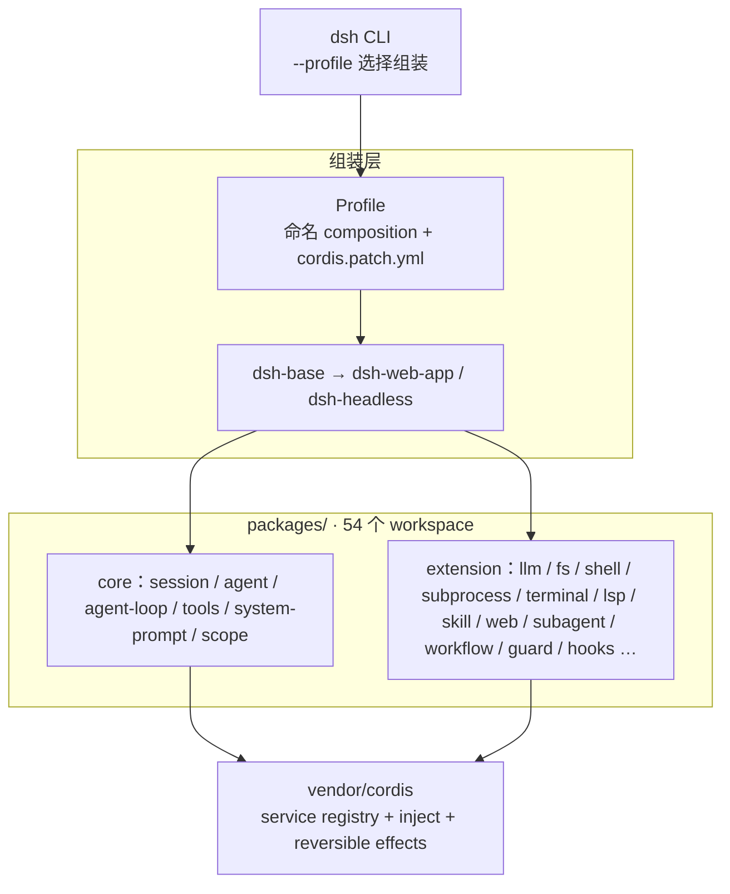

## 这篇文章在回答什么

大多数 agent 框架都有一条不许碰的脊柱：模型调用、工具注册表、会话存储焊在主程序里，想换掉其中任何一块，出路通常是 fork 整个仓库。`deepseek-ai/deepseek-harness`（下文简称 DSH，CLI 命令是 `dsh`）把这个默认设定反过来：不存在一个需要 fork 的主程序，平台本体就是插件的组合，连 agent loop 自己也是插件——默认实现 `packages/core/agent-loop` 只有 713 行，挂在任何人都能用的扩展点上，理论上可以被另一个 driver 整个换掉。

规模数据先摊开：93,077 stars，2026-08-13 创建并开源，7,412 个文件，`packages/` 下 54 个 workspace（承担 core / extension 角色的 30 多个），`docs/` 62 篇文档，当前 v0.x developer preview。

README 第一句话就把定位说得很重：

> DeepSeek Harness (`dsh`) is an open-source agent harness developed by DeepSeek AI. It uses an architecture where **everything is a plugin**, and is powered by [Cordis](https://github.com/cordiverse/cordis), whose design is described in [_A Programming Paradigm for Spatiotemporal Composability_](https://github.com/cordiverse/paper).

三个词决定整篇文章的走向：everything is a plugin（平台本体是插件组合）、Cordis（vendor 进仓库的插件框架，不是 Koishi 生态里那个 cordis）、Spatiotemporal Composability（Cordis 论文标题，时空可组合性）。

此前三篇反写练习（对源码逐行逆向、再重写成文）拆的是：

- [dsh-at-file](/posts/ai-coding/dsh-at-file-deepseek-harness-at-file-mentions/)（8-12，v0.4.0，1742 行）：DSH 的 `@path` 提及插件，out-of-tree plugin（主仓之外的插件）
- [dsh-genui](/posts/ai-coding/dsh-genui-deepseek-harness-genui-fence-architecture/)（8-13，v0.8.1，5860 行）：DSH 的 GenUI 渲染层插件，另一个 out-of-tree plugin
- arXiv 2608.09696（Murphy 论文）：与 DSH 没有直接关系的独立第三方论文，不展开

前两个插件调用的 `ctx.typert`、`ctx.tools`、`ctx.session.event`、`ctx.settings`、`ctx.agents` 全部来自主仓库的 core packages——它们是主仓的子集切片，本文拆的是母体。

文章回答五个问题：

1. everything is a plugin 具体意味着什么——model adapter 是插件、tool registry 是插件、session log 是插件，agent loop 本体也是插件
2. 「Model-visible means logged」这条不变式（invariant）如何工作——任何进模型的东西，必须能从一条 append-only（只追加）session log 重构
3. 一个 turn 的事件全链路——pre-step waterfall → llm/stream → tools/execute → step/end，主链上 16 种事件类型
4. capability seam 的三角色——Service Definition / Service Provider / Consumer，换一个 provider，整个产品跟着变
5. 「我想加 X，去哪里挂」——18 行映射表全覆盖

## 系统地图：7,412 个文件怎么分

主仓库布局：

```text
vendor/      vendored Cordis 框架源码 + cosmokit/group/hmr/loader 等
packages/    @deepseek-ai/dsh-<pkg> workspaces（54 个）
  core/        product API 脊柱
    session          append-only SessionEvent log (1157 行)
    agent            Agent interface + live registry (706 行)
    agent-loop       默认 driver (713 行)
    tools            tool registry + JSON schema (1946 行，最大)
    system-prompt    prompt section + tool schema assembly (545 行)
    scope            per-agent scoped-registration primitive
    agent-default-model   默认模型适配
    agent-tool-presentation  tool 展示策略
  api/         Remote BFF assembly + Typert RPC gateway
  typert/      type graph generator + loader + runtime registry
  llm/         LLM capability + DeepSeek providers + replay
  e2b/         E2B POC: sandbox + FS/subprocess adapters
  shell/       bash capability + local/pwsh providers
  subprocess/  subprocess capability + local process-tree provider
  terminal/    persistent terminal sessions
  fs/          filesystem capability + policy
  lsp/         language-server capability
  skill/       skill provider registry + catalog/loader
  web/         web capability (search/fetch providers)
  compaction/  compaction capability + basic provider
  context/     request-context plugins
  subagent/    subagent capability + delegation
  bundle/      installable dsh --profile patch-layer bundles
  workflow/    workflow capability + worker-thread provider
  todo/        todo_write tool
  plan/        plan mode as logged state
  preset/      per-session agent composition
  guard/       loop-hygiene + tool-timeout
  self-modification/   the agent inspects/mounts its own plugins
  hooks/       Claude Code/Codex hook bridges + wire-protocol
  session/     durable session data: persistence, projection, titles, telemetry
  identity/    anonymous identity
  settings/    user-settings capability
  credentials/ credential-reference capability
  acp/         automation-only Agent Client Protocol server
  interaction/ approval/interaction/permission/commands/ask-user
  boot/        shared app-bin glue
  sdk/         JSON-RPC protocol + server + TS client
  examples/    demo bundles
  support/     dev/test infrastructure
  util/        zero-dependency utilities
python/       Python SDK + bundled runtime
native/       @deepseek-ai/node-addon-landlock-run source of record
examples/     runnable cordis.yml leaves
.agents/      Agent workflows + Agent Notes
docs/         62 个文档（architecture, generated catalogs, postmortems, cookbook）
scripts/      repo gates + generators
website/      VitePress projection of selected bilingual docs/
```

`dsh` 命令在顶上选 profile，profile 叠 bundles，bundles 由 capability packages 组成，所有 package 踩在 vendored Cordis 上：



`vendor/cordis`、`vendor/cosmokit` 是 vendored 源码而非 npm 依赖，manifest 和同步流程在 `vendor/README.md`——好处是仓库不依赖外部 npm registry 的可用性，代价是一旦升级 vendored 包，PR 体积会很大。数字上也容易看岔：「54 个 workspace」和「30+ packages」并不矛盾：54 是 `packages/` 下的 workspace 总数，其中 30 多个承担 core / extension 角色，其余是 sdk、support、examples、util、boot 这类配套。

体量对比：

| 项目 | 文件数 | 源码规模 | 角色 |
|---|---|---|---|
| deepseek-harness（本文） | 7,412 | core 五包约 5.1K 行；全仓未做完整统计 | 平台本体 |
| dsh-genui | 32 | 5,860 行 | 主仓外插件：GenUI 渲染层 |
| dsh-at-file | 17 | 1,742 行 | 主仓外插件：`@path` 提及 |

表里的 5.1K 是 core 中有行数可查的五个包之和（session 1157 + agent 706 + agent-loop 713 + tools 1946 + system-prompt 545 = 5067），另外三个 core 包（scope、agent-default-model、agent-tool-presentation）没有公开行数。按文件数算，dsh-at-file 是主仓的 0.23%，dsh-genui 是 0.43%，两个插件加起来不到主仓的 1%。

## Cordis：everything is a plugin 的机制

DSH 整个平台立在两条不变式上：第一条是 everything is a plugin，本节讲它怎么实现；第二条是 Model-visible means logged，下一节讲。两条都不只是口号——各自带着 runtime 级的强制手段。

`docs/cordis-primer.md` 用五个 idea 把「插件化」讲到了可操作的程度：

```text
1. A plugin is a object that implements Service.
   - 它是带 inject + apply(ctx) 的函数，或者是 Service 子类

2. A context is a repository of services.
   - 服务声明 ctx.<key>（如 ctx.tools / ctx.llm / ctx.sessions）

3. Declare service dependency via inject.
   - 插件命名依赖的服务后才装载——不靠手写 boot 顺序

4. Typed Events for communication.
   - TypeScript declaration merging 声明事件名
   - 四种 dispatch mode: emit / waterfall / parallel / serial

5. Registrations are reversible effects.
   - 所有注册都通过 ctx.effect() 或 ctx.on()
   - 卸载/重载时 unwinding 可预测
```

第五条最值得展开。注册即 effect，意味着任何插件挂上去的东西——一个 tool、一个事件监听、一个 service row——在插件卸载时都会被回滚。DSH 敢让 agent 自己改自己的运行时（后文 self-modification 一节），靠的就是这一点：所有挂载天然可逆，不存在「装上去就摘不干净」的状态。

第一个结构性后果写在 architecture.md 里：

> There is no privileged core to patch: you extend dsh by mounting a plugin beside the others, and registrations are effects that unwind when their plugin unloads.

没有特权核可供 hot-patch；加能力的方式是往其他插件旁边再挂一个插件。model adapter 是插件、tool registry 是插件、session log 是插件，`packages/core/agent-loop` 的 713 行只是「默认 driver」这个身份，不是「核心循环」这个身份。

第二个结构性后果是 service key 充当稳定契约。`ctx.llm` 的契约是「`chat()` + `stream()` + 注册 model provider」，至于背后是 DeepSeek、Anthropic、OpenAI 还是本地 Ollama 的 provider，消费者不关心。capability seam 的雏形就在这里：接口钉死在 key 上，实现随时可换——换 provider 等于换实现、换部署目标、换权限边界，所有消费者自动跟上。

### Profile 与 Bundle：插件树的分层组装

架构文档把运行时组成描述成「plugin tree composed at boot from ordered layers」：

```text
Profile
  - 命名 composition，存在 Harness home 里
  - 列出要叠的 bundles
  - 持有用户的 cordis.patch.yml
  - web / headless 是模板

Bundle
  - Cordis config rows + 代码的 distribution 格式
  - 每个 bundle 在自己的 package.json 里声明 dsh.bundle: <patch-file>
  - 上面 layers 可以 patch 它

dsh-base     所有 profile 的第一层（model adapters / tools / persistence / sandbox / approval / settings / credentials / telemetry）
dsh-web-app  Web 应用（在 base 之上）
dsh-headless one-shot runner（无 server）
```

加载顺序是：profile 列出的 bundles 按序 apply 到空 entry list，然后是 profile 的 `cordis.patch.yml`，再是 home 级别的 `cordis.patch.yml`，最后是任何 `--patch` overlay。layer 之间的 patch 语义是「按 id 定位一行、整行替换配置，或插入新行」——不是模糊的字符串替换，这让插件配置可版本化、可追溯、可回滚。

想看当前组装结果，跑一条命令：

```sh
dsh --profile web --dump-config
```

输出的任何一行都能被自己的 patch 替换。`packages/bundle/` 是 bundles 的实现仓库，`base` / `web-app` / `headless` 三种 bundle 是发行版入口。

## Session log：Model-visible means logged

第二条不变式出自 architecture.md 的「Session log」段，是整个平台另一半的根基：

> **Model-visible means logged.** Anything that reaches a model request must be reconstructable from the log, and a runtime invariant asserts it. This is why a new model-visible input requires a new session event: extend `SessionEventMap` and render from the log.

进模型的东西必须能从一条 append-only session log 重构，且有 runtime 断言盯着这条线。推论是：想加一种新的 model-visible 输入，必须先加一种新的 session event——扩展 `SessionEventMap`，然后从 log render。到这一步，「先设计事件、再写功能」就不再是建议，而是硬约束。

落到工程上，这条不变式分四层。

**状态管理是事件溯源的，不是可变状态的。** `packages/core/session/src/index.ts`（1157 行）实现 `SessionStore`：append-only 的 `SessionEvent` 流，加上内存 store，再从 log 派生出 LLM message history。`SurfaceManager`（surface.ts，460 行）负责「事件到派生历史」的投影。任何需要重建历史的 feature——fork、resume、transcript、telemetry——都不需要重新实现，订阅同一组事件即可。

**持久化是插件的事，不是 store 的事。** session 模块的 docstring 说得直接：

> Persistence is a plugin concern (subscribe to `session/event`, drain on `session/flush`).

`SessionStore` 只管内存；落盘由专门的 persistence plugins（`session-persistence-jsonl` / `session-persistence-sqlite`）订阅 `session/event`、在 `session/flush` 时写出。

**chunk 级别的保真。** `assistant/chunk` 事件保留原始 token 序列，不只是拼好的 `assistant/message`。每个 chunk 都进 log，「进模型的每一个字节都进 log」才严格成立——如果只存最终消息，流式过程中的中间态就丢了。

**两个插件都踩在这条不变式上。** dsh-at-file 的 `<workspace-reference path="docs/spec.pdf" />` 不往对话里塞私货，而是走正路：每条引用是一条新事件 `at-file-mention`，进 log、可从 log 重构、模型可见。dsh-genui 的 panel 持久化同理——panel 状态通过事件投影，不另存 mutable state。

## Turn flow：一个 turn 有多少事件

`docs/agent-lifecycle.md` 给出完整的 sequenceDiagram。driver 实现 Agent 接口（`packages/core/agent-loop/src/agent.ts` 496 行 + `index.ts` 713 行），把主链上的 16 种事件类型串成一条线——其中 9 种是进 log 的 session 事件（turn/start、user/message、step/start、assistant/chunk、assistant/message、tool/call、tool/result、step/end、turn/end），7 种是负责协调的瞬态事件（agent/pre-step、agent/request、llm/stream、tools/pre-execute、tools/execute、tools/post-execute、agent/turn-stopping）。外围还有 `agent/status`、`agent/inbox/claimed` 这类状态广播。

```text
turn/start (durable)
  ↓ claim next-step input + one queued message
  ↓
agent/pre-step  (waterfall：listeners wrap (messages, signal, next))
  - reject | enter(messages)
  - reject / 空 enter → close turn with no step
  ↓
step/start (durable)
  ↓ append entered messages as user/message
  ↓
agent/request (waterfall) → llm/stream (waterfall)
  ↓ StreamChunk* → assistant/chunk* → assistant/message (durable)
  ↓
tool/call (durable) → tools/pre-execute (waterfall) → tools/execute (parallel) → tools/post-execute (waterfall) → tool/result (durable)
  ↓ loop barriers and bounded rolling pool, reclassify before start
  ↓
step/end (durable)
  ↓
agent/turn-stopping (serial terminal checkpoint，无 next())
  ↓
turn/end (durable)
```

画成时序图，参与者和事件流向更直观：

```mermaid
sequenceDiagram
  autonumber
  participant D as agent-loop driver
  participant L as ctx.llm provider
  participant T as tool backends
  D->>D: turn/start（durable）
  D->>D: claim next-step input + queued messages
  D->>D: agent/pre-step（waterfall）reject 或 enter(messages)
  D->>D: step/start（durable）+ append user/message
  D->>L: agent/request（waterfall）→ llm/stream（waterfall）
  loop 每个 StreamChunk
    L-->>D: assistant/chunk*
  end
  L-->>D: assistant/message（durable）
  loop 直到模型 end_turn
    D->>T: tool/call（durable）
    T->>T: tools/pre-execute → tools/execute（parallel）→ tools/post-execute
    T-->>D: tool/result（durable）
  end
  D->>D: step/end（durable）
  D->>D: agent/turn-stopping（serial，无 next()）
  D->>D: turn/end（durable）
```



每种事件都有明确的 dispatch mode（waterfall 瀑布式传递 / parallel 并行 / serial 串行 / emit 广播），这决定了监听者能做什么：

| 事件 | dispatch mode | 谁能做什么 |
|---|---|---|
| `session/event` | emit | 任意插件做持久化 / SDK / telemetry |
| `agent/pre-step` | waterfall | 改 messages，或直接 reject |
| `agent/request` | waterfall | 改 request body |
| `llm/stream` | waterfall | 拦截 stream chunks |
| `tools/pre-execute` | waterfall | 改 argv，或拒绝执行 |
| `tools/execute` | parallel | 实际执行 backend |
| `tools/post-execute` | waterfall | 改 result |
| `agent/turn-stopping` | serial | 决定 turn 是否提前关闭 |

两类事件的分工至此分明。Session events（durable）进 log、能 replay、能 fork、能 resume，`session/event` 是它们的总线；capability events 挂在 seam 上（`fs/*` / `tools/*` / `telemetry/*`），不 import 主 loop。dsh-at-file 监听 `agent/pre-step` 是后者的典型用法——挂在 waterfall 上、读 messages、注入引用消息、`next()` 交还控制权；dsh-genui 的 panel 持久化则挂在 `session/event` 的 emit 链上。

## Capability seams：三角色

`docs/capability-seams.md` 是 `scripts/gen-docs-graphs.ts` 生成的 mermaid 图，把 50+ packages 和 30+ services 的依赖关系画了出来。它对 seam 的定义是：

```text
A seam = swappable capability with three roles
  - Service Definition (声明接口)
  - Service Provider (实现接口)
  - Consumer (使用接口)
```

一个 package 可以同时承担多个角色，但只承担一个角色不算 seam——加 capability 必须把三角色设计完整。以 filesystem seam 为例：

```text
Service Definition:  packages/fs        声明 ctx.fs 接口
Service Providers:  packages/fs-local  本地 fs 实现
                    e2b (sandbox backend)
Consumers:          packages/tool-fs    Read / Write tool
                    packages/shell      bash redirect 到 ctx.fs
```

三角色齐了，换 provider 的杠杆才真正出现：把 `fs-local` 换成 `e2b`（云端 sandbox），`Read` / `Write` / `Bash` / `PTY` / `LSP` 全部跟着去远程，因为它们共享同一个 execution world。subagent 的 provider 是同构设计——同一个判断对 fs、sandbox、subagent 都成立。

## 「我想加 X，去哪里挂」：18 个扩展点

architecture.md 有一张叫「Where new behavior goes」的表，把 18 种「想加新行为」的情况全部映射到具体机制上：

| 目标 | 机制 |
|---|---|
| 加 model provider | 在 `ctx.llm` 注册 adapter |
| 加 model-facing capability | 在 `ctx.tools` 注册，schema 加入 prompt assembly |
| 给一个 session 不同的能力集 | 组合 agent preset；service row 需要 `isolate` realm |
| 加 shell execution | 注册 `ctx.shell` backend；local 后端 spawn 通过 `ctx.subprocess` |
| 加 persistent terminal execution | 注册 `ctx.terminals` backend + `dsh-tool-terminal` |
| 加 human command | 注册 `ctx.commands`；不触发模型 turn 直接 dispatch |
| 加 background work | 注册 `ctx.jobs`；`job_*` tools collect or stop it |
| 加 filesystem access or policy | 注册 `ctx.fs` provider 或监听 `fs/*` events |
| Confine spawned processes | 用 `ctx.sandbox` backend；consumer wrap argv 后 spawn |
| 拦截 request / tool / turn | 用对应 `agent/*` 或 `tools/*` event；`agent/turn-stopping` 停 turn |
| 加 model-facing context | 调 `agent.inject()`；进入下一个 admitted request |
| 加 UI / editor integration | drive `ctx.agents` 并从 `session/event` render |
| 加 Web Client Chat node | 注册 `ConversationNodeDefinition` + keyed renderer |
| 加 durable session state | 扩展 `SessionEventMap`；从 log render 和 replay |
| Generate session titles | 注册唯一的 `ctx.sessionTitle` provider |
| 管理同 session 的 objective | 用 `ctx.goals`；通过 `agent/*` 继续 |
| Fork a live session | `ctx.sessions.fork(source, boundary?, childSessionId?)` |
| Scope 注册到一个 agent | 用那个 agent 的 `agent.ctx` |

这张表是「query → action」的映射：读一遍半分钟，回答的却是插件开发者最常卡住的问题——我的代码该出现在系统的哪个位置。两个已拆过的插件都能在表里对号入座：

- dsh-at-file：「拦截 request」→ `agent/pre-step` 监听；不需要 durable state，因为它是无状态的 reference marker
- dsh-genui：「加 model-facing capability」→ 在 `ctx.tools` 注册 `render_ui` 和 `validate_dsh_ui` 两个 tool；「加 durable session state」→ 扩展 `SessionEventMap`，让 panel 状态从 log 投影

## 一个具体的 turn：用户输入 review @docs/spec.pdf

抽象的事件流，落到一段具体对话里才好检验。看数据在 14 跳里怎么走：

**跳 1**：用户输入 `review @docs/spec.pdf`，输入进 inbox。

**跳 2**：driver 收到 wake signal，`agent/status = running`，`turn/start` 进 log。

**跳 3**：driver claim pending next-step input 和 queued messages，`agent/inbox/claimed` 广播。

**跳 4**：`agent/pre-step` waterfall 触发。dsh-at-file 的 mention 监听扫描 `<user-message>` 里的 `@[^\s@]+`，`expandMentions` 验证路径，注入 `<workspace-reference path="docs/spec.pdf" />` 消息；listener 调 `next()` 把权威决定传下去。

**跳 5**：决定是 `enter`（带新消息）。driver 写 `step/start` 进 log，append `user/message`（原文 + 注入的 reference 标记）。

**跳 6**：driver 拉所有 prompt sections 和 tool schemas，触发 `agent/request` waterfall，然后调 `ctx.llm.stream()`，走 `llm/stream` waterfall。

**跳 7**：模型开始返回 stream。driver 把每个 chunk 写成 `assistant/chunk` 进 log，最终写 `assistant/message`（含 usage 和 sourceEventSeqs）。

**跳 8**：模型调用 `read_file("docs/spec.pdf")`，`tool/call` 进 log。

**跳 9**：`tools/pre-execute` waterfall → `tools/execute`（parallel，local fs provider 执行读取）→ `tools/post-execute` waterfall → `tool/result` 进 log。

**跳 10**：loop 判断「模型还要不要 next step」。这里模型要继续（基于 PDF 内容分析），claim 下一个 input，回到跳 4。

**跳 11**：第二轮重复跳 4-9，直到模型 `end_turn`。

**跳 12**：`step/end` 进 log。

**跳 13**：`agent/turn-stopping` serial checkpoint（无 `next()`，决定 turn 是否提前关）——通过。

**跳 14**：`turn/end` 进 log，`agent/status = idle`。

到这里，这个 session 的全部事实都在 log 里了：用户输入、dsh-at-file 注入的 reference、每一个 stream chunk、工具调用与结果、step 边界、turn 边界。后续的 fork / resume / transcript / telemetry 全部从这条流派生，不需要额外通道。

## 钉死的决策与各自的代价

把上面的机制倒过来看，能看到六处「宁可承受代价也要钉死」的决策。

**没有特权核。** 加能力等于挂插件，hot-patch 在这个体系里没有意义。代价是某些「本想直接改 agent loop 内部状态」的需求只能绕道事件——比如想在 turn 收尾时做点什么，能挂的点只有 `agent/turn-stopping`。

**进模型即进 log，且 runtime assert 兜底。** replay / fork / resume 全靠这条。代价是每个新的 model-visible 输入都要先扩 `SessionEventMap`——先设计事件，再写功能，功能迭代的速度被事件设计约束住。

**`dsh-base` 是所有 profile 的第一层。** model adapters、tools、persistence、sandbox、approval、settings、credentials、telemetry 都在 base 里，profile 无法做到「完全空」，最小集就是 base。

**seam 三角色必须齐。** 只有 definition 和 provider、没有 consumer，不算 seam。这条逼着一些「纯内部能力」外露为可消费接口，API surface 因此变大。

**Pre-release 立场：foundation over blast radius。** AGENTS.md 第一条：

> With no external consumers, prefer the correct foundation over compatibility shims: rename or repackage freely and update every reference together. Backends reject old on-disk formats. SQLite uses monotonic `SCHEMA_VERSION`; `dsh-session` keeps `SESSION_FORMAT_VERSION` at `0` with no compatibility promise.

还没正式 release，优先正确地基而不是兼容垫片；SQLite 用单调 `SCHEMA_VERSION`，`dsh-session` 的 `SESSION_FORMAT_VERSION` 停在 `0`，不承诺兼容。早期版本之间切换要重置数据——这是明说的代价。

**Snapshot 测试加 per-file 100% coverage。** `pnpm run test:snapshot` 是 keyless 的 ACP / headless replay 对比期望输出，任何 replay 差异都是测试失败；`pnpm run test:coverage` 在 CI 里对 `packages/*/*/src` 做 per-file 100% 覆盖——比 per-package 100% 更严一档。整套测试类别有 38 个，从 unit 到 real-API e2e 再到 duplication detection。代价是每加一段代码都要配齐测试，snapshot 的维护负担也不小。

## 它故意没做的事

边界和功能一样值得记录。有五件事明确不做，而且不做的原因大多能从架构本身推出来。

跨 session 状态共享不在设计里。每个 session 一条独立 log，fork 是「复制到子 session」，不是共享 mutable state——这是事件溯源的本质；代价是「两个 session 协作」要靠 fork / merge / external sync 自己搭。

多模态输入没有内建进事件系统。session event types 是文本流的扩展，图像 / 音频 / 视频走 attachment 路径（`pkg_attachment_local` / `pkg_host_runtime` 提供服务），或作为 binary blob 进 user message。

user-facing auth 只到 anonymous identity 为止。`packages/identity/` 负责的是 session 间身份标识；企业级 SSO / OAuth / RBAC 留给 deployment，也就是走 plugin 路径。

billing / metering 不进运行时。`ctx.tokenMeter` 测的是 replay 的 token 消耗，不是运行时计费；quota 和限流同样在部署侧。

multi-tenant 隔离是部署侧责任。service row 可以指定 `isolate` realm，但数据层面的多租户隔离，框架不承诺。

## 两个信号灯：self-modification 与 hooks

有两个 package 单独拎出来看，因为它们指示的是这个项目的方向，不只是某个功能。

`packages/self-modification/` 让 agent 检查并挂载它自己的插件。结合 Cordis 的 reversible effects——所有 effect 都有 disposer——agent 改自己运行时的动作也是干净可回滚的。「运行时可被居住者修改」，在大多数框架里是事故，在这里是设计出来的能力。

`packages/hooks/` 提供 Claude Code / Codex 的 hook bridges 加 wire-protocol library，把两家的 hooks 模型映射到 Cordis 事件系统上。仓库里 `CLAUDE.md → AGENTS.md` 是真实的符号链接，Claude Code 直接读 `AGENTS.md`。放在一起读，意图很清楚：别人生态里的插件可以低摩擦迁进来，自己的运行时可以被 agent 自己改——DSH 想做的是插件生态的汇合点，不是又一个孤岛。

## 谁该现在上手，谁该再等等

DSH 回答的根本问题是：

> AI agent 应用的运行时应该是可插拔的——没有 privileged core，没有热补丁，只有 plugin 组合。

工程上的兑现是三件事：换一个 provider（fs / sandbox / subagent），所有 consumer 自动跟上；turn flow 每一步都能拦截（pre-step 改 messages、llm/stream 改 chunks、tools/pre-execute 改 argv、turn-stopping 停 turn）；任何 model-visible 的东西都从 log 派生，fork / resume / transcript / telemetry 不需要重新实现。代价同样明确：plugin 边界严格，核心 loop 的改动要跨多个 package 协同；pre-release 阶段无兼容承诺，升级要重置数据；per-file 100% coverage 是高门槛。

据此分人群：

- **做 agent 产品或平台的团队**：现在就值得读，但先读再依赖。建议顺序是 `docs/architecture.md` → `docs/cordis-primer.md` → `packages/core/session` → `packages/core/agent-loop` → `packages/core/tools` → `docs/capability-seams.md`，读完这六个位置，18 行扩展点表里的每一行都能对应上。pre-release 无兼容承诺，当生产依赖要慎重。
- **要开箱即用编码助手的终端用户**：Claude Code / Codex CLI 更合适。dsh 的 ergonomic 面向构建者——要写 cordis.yml、要知道 service key 和 event dispatch mode，这些对终端用户是负担，对构建团队是共用协议。
- **想参与生态的开发者**：从 out-of-tree plugin 起步，dsh-at-file 和 dsh-genui 是两个现成范本（`dsh plugin --profile web add` 安装），挂点查 18 行表。
- **Python 团队**：留意 `python/` SDK 是 RPC client 模式——Cordis 是 Node 框架，Python 侧通过 `packages/sdk/` 的 JSON-RPC 调 Node runtime，不是 in-process Python。

`Cordis service registry + append-only session log + agent pre-step waterfall + capability seam 三角色`，是这个范式能工程化落地的四根钉子。少一根，要么 plugin 边界失效，要么 replay 失败，要么模型看到 log 看不到的东西，要么换 provider 不能传播。v0.x 阶段的 7,412 个文件是这件事的当前解；下一版本会是什么——multi-tenant 隔离进 core、`dsh-bundle-cloud` 做 SaaS、Python SDK 转 GA、typed streaming 替换部分 webhook 路径——都属于猜测，但按「foundation over blast radius」的原则，继续修地基比堆 feature 的概率大。无论后续怎么走，everything is a plugin 和 Model-visible means logged 这两条不变式，大概率会留下。

## 延伸阅读

- [dsh-at-file 深度解析](/posts/ai-coding/dsh-at-file-deepseek-harness-at-file-mentions/)：`@path` 提及插件，为什么故意不读文件
- [dsh-genui 深度解析](/posts/ai-coding/dsh-genui-deepseek-harness-genui-fence-architecture/)：GenUI 渲染层，dsh-ui fence 与双渲染通道
- [Cordis 论文导读](/posts/tech/cordiverse-paper-spatiotemporal-composability-translation/)：_A Programming Paradigm for Spatiotemporal Composability_。时空可组合性里的「时间」指生命周期（plugin 何时装载卸载），「空间」指作用域（注册落在哪个 scope）；`packages/core/scope/` 是 scoped-registration primitive，`agent.ctx` 是这个 scope 的物理载体——读完论文再回看 scope 包，很多设计选择会显得顺理成章
- 仓库内的 `docs/postmortems/`：62 篇文档里的 postmortem 部分，是理解「哪些地基修过」的最快入口

术语约定：DSH 指平台，`dsh` 指 CLI 命令；waterfall / parallel / serial / emit 四种 dispatch mode 全文保留英文，含义见 Turn flow 一节的表格。
