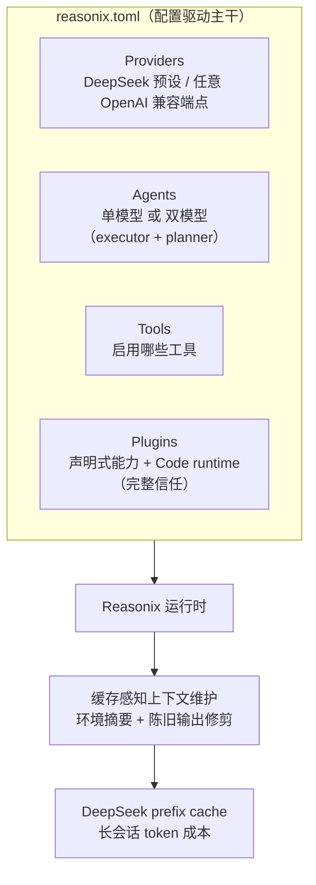

## 一句话判断

Reasonix 是围绕 DeepSeek prefix cache（前缀缓存）设计的终端 AI 编码 Agent。它的配置、双模型协作、上下文修剪、插件协议，都在回答同一个问题：怎么让一个反复迭代的长会话，token 成本尽量低。通用 Agent 在琢磨怎么让模型更能干，Reasonix 在琢磨怎么让 DeepSeek 缓存更稳。

如果你已经在用 DeepSeek 做编码，并且会在一个会话里反复改同一个仓库，Reasonix 值得替换掉终端里的 `aider` 或 `cline`。如果你的默认模型是 Claude 或 GPT，收益会打折——这套设计锚定在 DeepSeek 的缓存实现上。判断的边界就在这里：它省的是"会话变长后的复利"，不是"单次请求变快"。

## 项目速览

| 项 | 值 |
|---|---|
| GitHub | `esengine/DeepSeek-Reasonix` |
| Stars | 31,779 |
| Forks | 2,046 |
| 许可证 | MIT |
| 主力语言 | Go |
| 默认分支 | main-v2 |
| 最新版本 | CLI（npm）reasonix@1.19.1；桌面端 v1.21.0（2026-08-07） |
| 定位 | DeepSeek 原生、配置和插件驱动的编码 Agent harness |
| 官网 | <https://reasonix.io/> |
| 安装 | `npm i -g reasonix` / `brew install esengine/reasonix/reasonix` |

> 数据验证于 2026-08-08（GitHub API）。最近一次推送在 2026-08-06；MIT 协议允许商用与二次分发。

## 系统地图

Reasonix 的代码不按"模型 / 工具 / UI"这种通用 Agent 框架分层，而是把**配置驱动**当主干，让多模型、插件、缓存维护长在它上面：



读这张图时注意一点：从配置向外伸的每一层，都不是孤立模块，而是对 prefix cache 命中条件的某种承诺。配置不动字节、单模型会话稳定字节、插件声明式减少 prompt 抖动、缓存维护主动修剪陈旧内容。这四件事合起来，才让"长时间会话低成本"成立。

下面按这个顺序拆。

## 问题拆分：为什么"长会话便宜"这么难

DeepSeek 的 prefix cache 按字节命中：只要请求前缀和缓存过的一致，命中的部分就只按较少的价格计费。所以省 token 的本质是**让每个新请求的前缀尽量和上一个一样**。

难点在 Agent 这种用法。Agent 会反复调用工具，`cat` 一个长文件、`grep` 出一大段结果，这些输出会进上下文。如果某一轮多了大段临时输出、几轮后又没了，前缀字节就变了，缓存 miss，成本立刻涨回去。所以"低成本"不是一个模型选择问题，而是一个"如何让会话字节稳稳收敛"的工程问题。Reasonix 的五个机制都指向这个目标。

## 机制一：配置驱动（Config-driven）——把"什么可变"和"什么稳定"分开

Reasonix 第一条特性写得很直接：Providers、agent、启用的工具和插件都在 `reasonix.toml` 里声明，无硬编码模型。

这带来三件事：

1. **模型选择权交给用户**。DeepSeek 是预设，但任何 OpenAI 兼容端点（OpenRouter、Azure、本地 Ollama 等）都能作为 provider 写进 TOML。
2. **行为声明化**。`reasonix.toml` 是单一事实来源，不会出现"代码里临时塞了个 prompt"导致缓存 miss 的情况。
3. **可复现**。同一份 TOML 配出来的会话，prompt 字节一致，这是 prefix cache 命中的前提。

和 Claude Code、Cursor 的差别在这里：后者的 system prompt、可用工具集在内部代码里相对固定（升级即变），用户只能在有限选项里切换；Reasonix 把整套配置外置后，"什么样的 prompt 进第一轮"完全可审计、可版本化。

## 机制二：多模型可组合（Multi-model & composable）——双模型是缓存的延伸

双模型是 Reasonix 里最值得单独停下来的设计。

单模型场景下，DeepSeek 的 prefix cache 表现已经不错——只要 system prompt、工具列表和前几轮对话稳定，命中率就能保持。可如果 Agent 在长会话中途要处理高难度规划（比如重写整个模块、设计 schema），常见的做法是把"当前对话全文"塞进 planning prompt，这会破坏缓存边界。

Reasonix 的解法是**双模型 + 双会话**：

- **Executor（执行器）**：在主会话里跑，承担代码生成、工具调用、迭代修复。system prompt 和工具列表稳定，缓存命中率高。
- **Planner（规划器）**：在**独立会话**里跑，专门接"我现在要做什么"这类高难推理。它的 system prompt、上下文结构可以和 Executor 完全不同，不污染主会话的前缀。

两者通过结构化契约通信（任务描述 → 计划 → 拆分的执行步骤），而不是把 Executor 的对话历史全文塞给 Planner。

代价是 Planner 的输入也是独立的缓存前缀，规划轮次得从头算 token。但因为规划通常只是会话里少数节点，Planner 的额外成本会被 Executor 命中省下来的钱覆盖。不打开双模型配置，Reasonix 就退化成单 executor 的普通 Agent；打开的话，Planner 用的模型最好也选支持 prefix cache 的端点（例如 DeepSeek 系列），否则规划会话从零起步，单次规划可能比纯 Executor 还贵。

## 机制三：插件与扩展——声明式能力 + 完整信任的 Code runtime

Reasonix 的插件分两类，能力边界很清晰：

1. **声明式（Declarative）**：skills、agents、commands、prompts、hooks、MCP（Model Context Protocol，模型上下文协议）服务器、themes。这些是文件和配置，以宿主的普通权限运行。
2. **Code runtime（代码运行时）**：插件清单 Manifest v1 里的 `runtime` 块，会拉起一个 sidecar（边车进程），通过 Extension Protocol 与宿主通信。它能拦截事件、替换 system prompt、贡献流式 provider、发布结构化 UI。这类扩展是**完整信任**——能绕过权限和沙箱，所以安装前要看清楚它声明了哪些拦截点。

Code runtime 能做的事，文档里写得很具体：

- **拦截器（Interceptors）**：在 17 个钩子点上观察并裁决（输入、工具调用、权限决定、provider 请求/响应、压缩、会话生命周期、前端事件）。拦截器可以 `continue`、带理由地 `block`，或 `replace` 载荷，宿主会对每个替换反复校验。
- **替换策略（Replacement strategies）**：`system_prompt`、`context`、`provider_request`、`permission` 等都是单属主槽位。一个槽位同时只允许一个插件拥有，冲突会让运行时构建失败并点名双方来源。
- **流式 provider**：新模型以 `plugin/<plugin>/<provider>/<model>` 出现在模型选择器里，语义和内置 provider 一致，也支持会话中途切换。
- **结构化 UI**：状态条目、卡片、表单、通知，原生渲染在 CLI、桌面端和 ACP 客户端里。

扩展和缓存的关系，文档单独讲了一段：观察型扩展不改变 provider 可见的缓存前缀；一个稳定的 system prompt 或工具替换，在安装/重载后产生一次有意的冷前缀，之后仍可缓存；但如果策略往 system prompt、工具 schema 或上下文前缀里注入时间戳、随机值、会话 ID 这类每轮都变的数据，就会破坏缓存复用。动态数据应尽量留在当前轮次的尾部。

## 机制四：缓存感知的上下文维护（Cache-aware context maintenance）

这是把前面所有机制变现的一层。运行时做两件事：

1. **启动时注入小的稳定环境摘要**：仓库根目录路径、当前 git 分支、shell 类型、用户偏好的命名风格。这些不随 Agent 跑几轮而变的信息被打包成 system prompt 开头一段，每次会话字节一致。
2. **陈旧工具输出在摘要压缩前被修剪**：某个工具的输出（比如 `cat` 了一个长文件）在一两轮内不再被引用时，Reasonix 先把它压成摘要、再删掉原始内容，而不是简单截断或丢弃。

第二点直击 DeepSeek prefix cache 的一类典型 miss：某一轮突然多了一大段临时输出，几轮后这大段没了，前缀字节变了，缓存 miss。Reasonix 的修剪策略让"会话字节变化"在大多数轮次是收敛的，而不是来回蹦跳。

和 Claude Code 的差异：Claude Code 也有上下文压缩（如 `/compact`），但更多是用户手动触发或长上下文时的处理。Reasonix 是主动按语义判断"陈旧度"来修剪，修剪目标不是单单省 token，而是让前缀字节稳定。

## 机制五：零摩擦分发（Zero-friction distribution）——单二进制 + 六目标交叉编译

为了让上面这些能跑在 Linux 服务器、macOS 工作站、Windows 笔记本上，Reasonix 选了一个朴素但对的方案：`CGO_ENABLED=0` 单静态二进制。

- `CGO_ENABLED=0` 不依赖任何 C 库的 glibc/musl，不会出现"在我机器能跑、在你机器不行"的链接地狱。
- 一次命令交叉编译六个目标（darwin / linux / windows × amd64 / arm64），以预编译归档和 `SHA256SUMS` 挂在每个 release 上。
- `npm i -g reasonix` 背后是 npm 按平台拉对应的预编译二进制，用户不需要本地装 Go 工具链。

强调这一点是因为：配置驱动 + 插件系统的可玩性很高，而分发摩擦会直接劝退普通用户。"装得上、跑得起来"才是让"在 `reasonix.toml` 里改配置"变成习惯的前提。

## 一次长会话怎么流过系统

用一个三小时的 refactor 会话把机制串起来。

会话开始，`reasonix setup` 配好 provider，`reasonix` 进入交互模式。运行时注入环境摘要（仓库路径、分支、命名风格），这一段字节固定，是缓存前缀的锚点。你让它把 `main.go` 里一个接口的实现顺手重构——这是高难度规划，Reasonix 把任务描述交给 Planner 的独立会话，Planner 给出拆好的执行步骤，主会话的 Executor 只收到"改哪几个函数"这种指令，不接收规划用的整段上下文。

Executor 一轮轮改代码、跑工具。中间 `grep` 出 200 行结果，两轮后这 200 行不再被引用，缓存维护先把它压成摘要再删掉原始内容，前缀不会因为这段临时输出来回变。system prompt 和工具列表从头到尾一致，所以每轮请求前缀和上一轮高度重合，DeepSeek 缓存持续命中。

如果中途你装了带 runtime 的扩展，重载只发生在当前轮结束后，且只产生一次有意的冷前缀；只要该扩展不在前缀里注入每轮变化的数据，下一轮起前缀又回稳。

## 数据怎么读

项目速览里的 Stars 31,779、Forks 2,046 只反映关注度，推不出"它一定帮你省钱"。README 对缓存收益只有定性描述——"tuned around DeepSeek's prefix cache so token costs stay low across long sessions"——没有给出"比其他工具省百分之多少"的官方 benchmark。

所以读它时注意三点：

- **它在测什么**：这个仓库的卖点是长会话下的 token 成本，不是单次请求延迟或生成质量。
- **数字反映哪一部分**：Stars 反映的是工程话题（prefix cache 优化）的吸引力，不是实测成本优势。
- **不能推出什么**：不能从 Star 数推出"换到 Reasonix 一定省钱"。prefix cache 的收益取决于会话形态，短任务、单轮问答几乎碰不到缓存收益。

## 安装与快速上手

| 路径 | 命令 |
|---|---|
| npm（任何 OS） | `npm i -g reasonix` |
| Homebrew（macOS） | `brew install esengine/reasonix/reasonix` |
| 桌面应用 | 官网下载页按平台安装 |
| VS Code 扩展 | 扩展 ID：`SivanLiu.reasonix-agent` |
| 从源码 | 克隆后 `make build`（→ `bin/reasonix`）；`make cross` 交叉编译 |

第一次使用只需三步：

```bash
reasonix setup   # 配置 provider 和 model（DeepSeek 预设走起最省事）
reasonix         # 启动交互式会话
reasonix run "implement the TODOs in main.go"   # 或直接给个一次性任务
```

在交互会话里，想生成项目级指令时执行 `/init`。桌面端和 VS Code 扩展共用同一个本地 Reasonix 引擎；VS Code 扩展不内置 CLI，它先启动你本机的 `reasonix acp` 后端，再提供聊天、编辑器上下文、工具调用审批和模型选择。

## 与 Claude Code、Cursor、Aider 的对比

放到 2026 年 AI 编码工具里看：

| 维度 | Reasonix | Claude Code | Cursor | Aider |
|---|---|---|---|---|
| 默认后端 | DeepSeek（缓存优化核心） | Claude | 多模型 | 多模型 |
| 交互形态 | CLI / TUI + 桌面 + VS Code | CLI | 编辑器（IDE） | CLI |
| 配置外置 | 强（`reasonix.toml`） | 弱（少量开关） | 中（settings.json） | 弱（`.aider.conf.yml`） |
| 插件协议 | MCP + Extension Protocol | MCP | 有限工具协议 | 有限 hook |
| 上下文修剪 | 自动、基于陈旧度 | 手动 `/compact` | 自动但策略粗 | 手动 |
| 长会话成本 | 低（命中 DeepSeek 缓存） | 中（依赖 Anthropic 端） | 中 | 中–高 |
| License | MIT | 闭源 | 闭源 | Apache 2.0 |

"长会话 token 成本低"这一行是 Reasonix 最值得看的，但它的编辑器深度集成、IDE UX 目前落后于 Cursor，赛道不完全重合。

## 什么时候值得用，什么时候不必用

**值得用**

- 默认模型是 DeepSeek，且在乎成本。缓存优化锚定在 DeepSeek 的字节命中实现上，切到别家端点收益明显衰减。
- 长时间会话、反复迭代同一个仓库。会话越长，缓存收益的复利越大。
- 以 CLI / TUI 工作流为主。桌面端和 VS Code 插件是加分项，不是核心。
- 愿意写 `reasonix.toml`。配置驱动既是优势也是学习成本；只想要"开箱即用 + IDE 内集成"，Cursor 更顺。

**不必用**

- 主力模型是 Claude 或 GPT。缓存优化收益会衰减。
- 极短任务、一次性脚本。单轮问答根本碰不到缓存收益，直接用 DeepSeek 网页版更轻。
- 核心体验在编辑器里。VS Code 插件存在但生态仍在早期，Cursor 仍占优。

## 文档导航

Reasonix 的文档按问题域切，而不是一篇巨型 README：

- **Guide / CLI reference / Configuration paths**——起步路径、子命令语义、`reasonix.toml` 字段与环境变量覆盖。
- **ACP editor integration**——编辑器侧接入点（ACP 是 Reasonix 自己的编辑器协议）。
- **Subagent profiles / Context Engine v2**——子 Agent 角色定义与上下文维护引擎。
- **Capability diagnostics**——排查"为什么缓存 miss 了"。
- **Recovery / Checkpoints & rewind**——长任务的回滚与恢复。
- **Spec / Task contract / Tool contract / Extensions / Plugin packages**——形式化规约与扩展接口。

这种按问题域切的写法，本身就在说明：这是一个把"可理解性"当产品特性做的项目，而不只是堆功能。