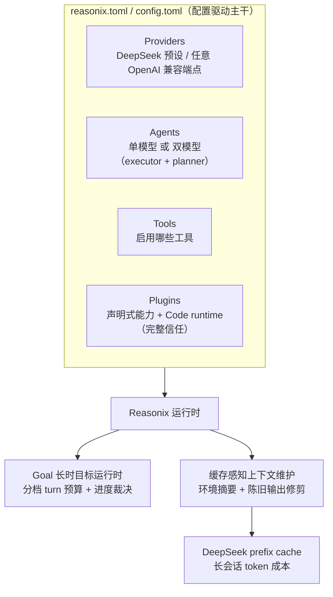

## 一句话判断

Reasonix 是一个把 DeepSeek prefix cache（前缀缓存）当设计底色的终端 AI 编码 Agent：配置、双模型协作、上下文修剪、插件协议，都在回答同一个问题——怎么让一个反复迭代的长会话，token 成本尽量低。通用 Agent 在琢磨怎么让模型更能干，Reasonix 在琢磨怎么让 DeepSeek 缓存更稳。

这篇文章首发于 2026 年 8 月初，当时它还是单一产品线。两个月后重读，更值得说的反而是它的分线：2026 年 9 月 25 日，作者在 [版本路线公告](https://github.com/esengine/DeepSeek-Reasonix/discussions/10748) 里宣布 1.x（`main-v2` 分支）进入维护、2.x Reasonix Studio（`studio` 分支，现为默认分支）以 pre-release 状态接棒开发。README 的定位语也随之换了三次——发表时点是 "A DeepSeek-native AI coding agent for your terminal"，两天后改成 "A coding agent you can leave running"，现在是 "A reliable coding agent for complex software engineering tasks"。从"DeepSeek 原生"到"可以挂机"再到"可靠交付"，官方叙事的重心在两个月内挪了两次，但 npm 包描述至今还是 "Cache-first DeepSeek coding agent for the terminal"。

缓存这条设计底色没有丢：2.x 公告把 "Context / cache semantics" 列进新架构方向，现行的 Features 列表里 "Cache-aware context maintenance" 原样保留。要判断的是：缓存优化在哪个版本里兑现，以及你该上哪条线。

## 项目速览

| 项 | 值 |
|---|---|
| GitHub | `esengine/DeepSeek-Reasonix` |
| Stars / Forks | 35,741 / 2,439（2026-10-04） |
| 许可证 | MIT |
| 主力语言 | Go（2.x 前端另需 Node 24+ / pnpm 10 构建） |
| 版本线 | **1.x**：`main-v2` 分支，维护/稳定，npm latest `1.39.7`（2026-10-02），桌面端 `desktop-v1.39.7`；**2.x**：`studio` 分支（默认），active pre-release，最新 `studio-v2.27.0`（2026-10-04） |
| 定位 | 1.x：可以挂机运行的 DeepSeek 原生编码 Agent；2.x：面向复杂工程任务的新架构（Studio 桌面端 + TUI） |
| 官网 | <https://reasonix.io/> |
| 安装 | 1.x：`npm i -g reasonix` / `brew install esengine/reasonix/reasonix`；2.x：Studio release 页下载，自更新 |

> 发文时点读数验证于 2026-08-08，本文复核于 2026-10-04（GitHub API）。两个月内 Stars 从 31,779 涨到 35,741，默认分支从 `main-v2` 切到 `studio`。

## 两个月里的三段定位语

把三次 README 改版排成时间线，比任何评测都更能说明这个项目处在什么阶段：

| 时点 | README 定位语 | 叙事重心 |
|---|---|---|
| 2026-08-06（本文发表时点） | "A DeepSeek-native AI coding agent for your terminal" + "tuned around DeepSeek's prefix cache so token costs stay low across long sessions" | DeepSeek 原生、缓存优化 |
| 2026-08-08 | "A coding agent you can leave running" | Goal 长时目标、可挂机 |
| 2026-10-04（复核时点） | "A reliable coding agent for complex software engineering tasks"（2.x Studio） | 可靠交付复杂任务 |

口径收紧有个明确的动作：那句 "tuned around DeepSeek's prefix cache" 的营销定位语在 8 月 8 日的改版里被删掉了，但 npm 包描述和 Features 列表里的缓存表述都还在。这不是放弃缓存卖点，而是把"缓存优先"从 headline 降到底层设计——本文发表时引用的那句引语，如今在 README 里已经找不到了，读者可以用 npm 包描述 "Cache-first DeepSeek coding agent for the terminal" 作为这个卖点的现行出处。

## 系统地图

Reasonix 的代码不按"模型 / 工具 / UI"这种通用 Agent 框架分层，而是把**配置驱动**当主干，让多模型、插件、缓存维护长在它上面：


```mermaid
flowchart TB
    subgraph Config["reasonix.toml / config.toml（配置驱动主干）"]
        P["Providers<br/>DeepSeek 预设 / 任意 OpenAI 兼容端点"]
        A["Agents<br/>单模型 或 双模型（executor + planner）"]
        T["Tools<br/>启用哪些工具"]
        PL["Plugins<br/>声明式能力 + Code runtime（完整信任）"]
    end
    Config --> Runtime["Reasonix 运行时"]
    Runtime --> Goal["Goal 长时目标运行时<br/>分档 turn 预算 + 进度裁决"]
    Runtime --> Maint["缓存感知上下文维护<br/>环境摘要 + 陈旧输出修剪"]
    Maint --> DS["DeepSeek prefix cache<br/>长会话 token 成本"]
```

读这张图时注意一点：从配置向外伸的每一层，都不是孤立模块，而是对 prefix cache 命中条件的某种承诺。配置不动字节、单模型会话稳定字节、插件声明式减少 prompt 抖动、缓存维护主动修剪陈旧内容。这四件事合起来，才让"长时间会话低成本"成立。

下面按这个顺序拆，最后单独讲 Goal——它是"leave running"叙事的实体，也是首发病文漏掉的一块。

## 问题拆分：为什么"长会话便宜"这么难

DeepSeek 的 prefix cache 按字节命中：只要请求前缀和缓存过的一致，命中的部分就只按较低的价格计费。所以省 token 的本质是**让每个新请求的前缀尽量和上一个一样**。

难点在 Agent 这种用法。Agent 会反复调用工具，`cat` 一个长文件、`grep` 出一大段结果，这些输出会进上下文。如果某一轮多了大段临时输出、几轮后又没了，前缀字节就变了，缓存 miss，成本立刻涨回去。所以"低成本"不是一个模型选择问题，而是一个"如何让会话字节稳稳收敛"的工程问题。Reasonix 的五个 Features 都指向这个目标。

## 机制一：配置驱动——把"什么可变"和"什么稳定"分开

README Features 第一条写得很直接：Providers、agent、启用的工具和插件都在 `reasonix.toml` 里声明，无硬编码模型。

实际落地的配置体系是两层的，解析顺序为 **flag > `./reasonix.toml`（项目级）> 用户全局配置 > 内置默认**。v1.8.1 起用户配置在 `~/.reasonix/config.toml`（Windows 在 `%AppData%\reasonix\config.toml`）；`[remote]` 主机和 `[secrets]` 这类敏感段是 user-global only，项目级 `reasonix.toml` 不允许注入或覆盖。Provider 条目只写 `api_key_env` 引用环境变量名，密钥值放在 Reasonix 全局 `.env` 里，CLI 和桌面端共享——密钥从头到尾不进 toml。

这带来三件事：

1. **模型选择权交给用户**。DeepSeek 是预设（`deepseek-flash` / `deepseek-pro`，指向 `api.deepseek.com`），任何 OpenAI 兼容端点（OpenRouter、Azure、本地 Ollama 等）都能作为 provider 写进配置。
2. **行为声明化**。配置是单一事实来源，不会出现"代码里临时塞了个 prompt"导致缓存 miss 的情况。
3. **可复现**。同一份配置配出来的会话，prompt 字节一致，这是 prefix cache 命中的前提。

和 Claude Code、Cursor 的差别在这里：后者的 system prompt、可用工具集在内部代码里相对固定（升级即变），用户只能在有限选项里切换；Reasonix 把整套配置外置后，"什么样的 prompt 进第一轮"完全可审计、可版本化。

## 机制二：双模型协作——规划不污染执行缓存

双模型是 Reasonix 里最值得单独停下来的设计。

单模型场景下，DeepSeek 的 prefix cache 表现已经不错——只要 system prompt、工具列表和前几轮对话稳定，命中率就能保持。可如果 Agent 在长会话中途要处理高难度规划（比如重写整个模块、设计 schema），规划用的长上下文塞进主会话就会破坏缓存边界。

Reasonix 的解法是**双模型 + 双会话**，配置上就是一行：

```toml
[agent]
planner_model = "deepseek-pro"   # 低频规划器
```

- **Executor（执行器）**：由 `default_model` 指定，在主会话里跑，承担代码生成、工具调用、迭代修复。system prompt 和工具列表稳定，缓存命中率高。
- **Planner（规划器）**：在**独立会话**里跑，官方称 separate cache-stable sessions。它能看到已加载的 `REASONIX.md` / `AGENTS.md` 项目记忆，配一套小型只读研究工具集，可以在交出计划前翻相关文件；写入类和工作流类工具只有 Executor 能用。

两个会话各有各的缓存前缀，规划轮次从头算 token。但规划通常只是会话里少数节点，Planner 的额外成本会被 Executor 命中省下来的钱覆盖。Planner 用的模型最好也选支持 prefix cache 的端点（比如 DeepSeek 系列），否则规划会话从零起步，单次规划可能比纯 Executor 还贵。

一个容易被忽略的细节：逐轮路由是确定性的，没有第二个分类器模型。问题、短跟进、原子编辑直达 Executor；模糊、跨界面、高风险或活跃 Goal 的请求才走完整规划。关键词双语可用——`plan first` / `先规划` 强制规划，`just do it` / `直接改` 直达执行，`plan only` / `不要执行` 到规划为止。

## 机制三：插件与扩展——声明式能力 + 完整信任的 Code runtime

Reasonix 的插件分两类，能力边界很清晰：

1. **声明式（Declarative）**：skills、agents、commands、prompts、hooks、MCP（Model Context Protocol，模型上下文协议）服务器、themes。这些是文件和配置，以宿主的普通权限运行。
2. **Code runtime（代码运行时）**：插件清单里的 `runtime` 块，会拉起一个 sidecar（边车进程），通过 Extension Protocol 与宿主通信。它能拦截事件、替换 system prompt、贡献流式 provider、发布结构化 UI。这类扩展是**完整信任**——运行在沙箱外、可以绕过权限，所以安装前预览会显示 FULL TRUST 块，列出它拦截的事件、持有的槽位和能力。

这里有一条两个月内的时间线值得注意：本文发表时插件清单是 Manifest v1（`apiVersion: "reasonix.io/plugin/v1"`），协议是 Extension Protocol v1。两天后（8 月 8 日）仓库里的文档已切成 Manifest v2 + 协议 v2，且 v2 文档明确写着 "extension manifests were not publicly released on v1"——v1 从未正式发布过，只存活了两天。今天：2.x 用 v2，1.x 冻结在 v1。如果你在旧资料里看到 "Manifest v1"，它指的是这段过渡期。

Code runtime 能做的事，文档写得很具体：

- **拦截器（Interceptors）**：在 17 个冻结钩子点上观察并裁决（输入、工具调用、权限决定、provider 请求/响应、压缩、会话生命周期、前端事件）。拦截器可以 `continue`、带用户可见理由地 `block`，或 `replace` 载荷——宿主对每个替换重新校验 DTO 和 schema。
- **替换策略（Replacement strategies）**：`system_prompt`、`context`、`provider_request`、`provider_response`、`compaction`、`session_policy`、`permission`、`frontend_events`、`tool:<name>`、`provider:<ref>` 都是单属主槽位。一个槽位同时只允许一个插件拥有，冲突会让运行时构建失败并点名双方来源。
- **流式 provider**：新模型以 `plugin/<plugin>/<provider>/<model>` 出现在模型选择器里，语义和内置 provider 一致，`default_model`、`--model`、CLI/桌面/ACP（Agent Client Protocol，编辑器接入协议）选择器和会话中途切换全都能用。
- **结构化 UI**：状态条目、卡片、表单、通知，原生渲染在 CLI、桌面端和 ACP 客户端里；只传结构不传 HTML/CSS/JS。

资源开销有明确上限：安装了 runtime 时，宿主最多并行初始化 4 个 sidecar，共享一个 30 秒启动预算，超时按 `runtime.required` 降级或失败。没有装 runtime 时走 nil-dispatcher 路径，完全没有 sidecar 进程和 RPC 开销。

扩展和缓存的关系，文档单独讲了一段：观察型扩展不改变 provider 可见的缓存前缀；一个稳定的 system prompt 或工具替换，在安装/重载后产生一次有意的冷前缀，之后仍可缓存；但如果策略往 system prompt、工具 schema 或上下文前缀里注入时间戳、随机值、会话 ID 这类每轮都变的数据，就会破坏缓存复用。动态数据应尽量留在当前轮次的尾部。

## 机制四：缓存感知的上下文维护

这是把前面所有机制变现的一层。运行时做两件事：

1. **启动时注入稳定的环境摘要**：`[environment]` 配置节开启后（默认开），注入的是 OS、shell 和常用工具的摘要——这段字节固定，成为缓存前缀的锚点。网络不可达的环境还可以设 `offline = true` 避免无谓重试。
2. **陈旧工具输出在摘要压缩前被修剪**：`[agent]` 的 `tool_result_snip_ratio = 0.6` 控制在摘要压缩前对陈旧工具输出的裁剪比例。某个工具的输出（比如 `cat` 了一个长文件）在一两轮内不再被引用时，Reasonix 先把它裁短、再随摘要压缩收掉原始内容，而不是简单截断或丢弃。

第二点直击 DeepSeek prefix cache 的一类典型 miss：某一轮突然多了一大段临时输出，几轮后这大段没了，前缀字节变了，缓存 miss。修剪策略让"会话字节变化"在大多数轮次是收敛的，而不是来回蹦跳。

和 Claude Code 的差异：Claude Code 也有上下文压缩（如 `/compact`），但更多是用户手动触发或长上下文时的处理。Reasonix 是主动按语义判断"陈旧度"来修剪，修剪目标不是单单省 token，而是让前缀字节稳定。

## 机制五：零摩擦分发——单二进制 + 六目标交叉编译

为了让上面这些能跑在 Linux 服务器、macOS 工作站、Windows 笔记本上，Reasonix 选了一个朴素但对的方案：`CGO_ENABLED=0` 单静态二进制。

- `CGO_ENABLED=0` 不依赖任何 C 库的 glibc/musl，不会出现"在我机器能跑、在你机器不行"的链接地狱。
- 一次命令交叉编译六个目标（darwin / linux / windows × amd64 / arm64），以预编译归档和 `SHA256SUMS` 挂在每个 release 上。
- `npm i -g reasonix` 背后是 npm 按平台拉对应的预编译二进制，用户不需要本地装 Go 工具链。

强调这一点是因为：配置驱动 + 插件系统的可玩性很高，而分发摩擦会直接劝退普通用户。"装得上、跑得起来"才是让"在配置文件里改配置"变成习惯的前提。

2.x 在这条路上走得更远，但形态变了：Studio 桌面端的安装包带 `.minisig` 签名和 `SHA256SUMS`，装完之后自更新；CLI 归档挂在同一个 `studio-v2.*` release 下。按官方 ROADMAP 的规划，npm 和 Homebrew 渠道要等 2.x 正式 GA 的那个稳定版才从 1.x 切过去——在那之前，`npm i -g reasonix` 装到的始终是 1.x。

## Goal：可以挂机跑的目标运行时

首发病文漏掉了一块：发表当天的文档里，Goal 已经是完整的一节，两天后的 README 改版更是把它写进了 headline（"A coding agent you can leave running"）。如果你只读缓存分析，会错过这个项目后来最想卖的东西。

Goal 是长时目标的统一运行时：`/goal <objective>` 启动后，Reasonix 持续工作直到目标完成、受阻、被暂停或被清除。机制上有四个值得看的点：

- **分档 turn 预算**：simple 目标 10 轮、write 目标 20 轮、research 目标 40 轮。裸写一句"修这个 bug"默认按 write 档处理，除非你只要分析。连续四轮没有宿主可验证的进展，目标自动暂停。
- **结构化汇报**：每轮结束模型通过 `update_goal` 工具上报处置（continue / complete / blocked）；没上报时由一个独立的有界评估器裁决一次，评估器失败就暂停目标，而不是静默继续。
- **暂停可续**：`/goal status` 看完整运行摘要（已用轮次/上限、token、无进展计数、扩展），`/goal pause` 手动暂停，`/goal resume` 接着跑；预算耗尽后的 resume 会追加同档的一段时间。
- **任务契约**：复杂目标建议写成任务契约——Context、Request、Output format、Constraints、Pause policy 五段，Goal 把这些段当作执行边界。

prefix cache 解决"每一轮便宜"，Goal 解决"人不在场时停得下来、也不至于跑飞"。两者合起来才是 README 那句 "leave running" 的完整含义。

## 一次长会话怎么流过系统

用一个真实感强一点的场景把机制串起来：你让它重构 `main.go` 里一个臃肿的接口实现，然后离开键盘。

会话开始，`reasonix setup` 配好 provider（`deepseek-flash` 做执行器），`reasonix` 进入交互模式。运行时注入 OS/shell/常用工具的环境摘要，这一段字节固定，是缓存前缀的锚点。你敲下 `/goal 重构 main.go 里的 PaymentNotifier 实现，跑通测试`——write 档，20 轮预算。

Goal 第一轮先派规划活：Planner（`deepseek-pro`）在自己的独立会话里读 `REASONIX.md` 和相关文件，交回拆好的步骤；主会话的 Executor 只收到"改哪几个函数"这种指令，规划用的长上下文从头到尾没进主会话前缀。

Executor 一轮轮改代码、跑工具。中间 `grep` 出 200 行结果，两轮后这 200 行不再被引用，`tool_result_snip_ratio` 的修剪逻辑先把它裁短，随摘要压缩收掉，前缀不会因为这段临时输出来回变。system prompt 和工具列表从头到尾一致，每轮请求前缀和上一轮高度重合，DeepSeek 缓存持续命中。

第 9 轮起模型连续四轮只是在重试同一个失败的测试，没有宿主可验证的进展——Goal 自动暂停，todo 和运行历史保留。你回来后 `/goal status` 看到卡在哪，改了一行配置，`/goal resume` 又追加 20 轮。

如果中途你装了带 runtime 的扩展，重载只发生在当前轮结束后（一次 fail-atomic 的原子切换），且只产生一次有意的冷前缀；只要该扩展不在前缀里注入每轮变化的数据，下一轮起前缀又回稳。

## 数据怎么读

项目速览里的 Stars 35,741、Forks 2,439 只反映关注度，推不出"它一定帮你省钱"。官方对缓存收益至今只有定性描述——现行 README 里连发表时那句 "token costs stay low" 的定位语都删了，没有给出"比其他工具省百分之多少"的 benchmark。

所以读它时注意三点：

- **它在测什么**：这个仓库的卖点是长会话下的 token 成本，不是单次请求延迟或生成质量。
- **数字反映哪一部分**：Stars 反映的是工程话题（缓存优化、可挂机运行）的吸引力，不是实测成本优势。两个月 4,000 星的涨幅里有多少来自"可以挂机"的新叙事，无从拆分。
- **不能推出什么**：不能从 Star 数推出"换到 Reasonix 一定省钱"。prefix cache 的收益取决于会话形态，短任务、单轮问答几乎碰不到缓存收益。

另一个值得盯的数字是发版节奏：npm 线从 8 月初的 1.21.x 到 10 月初的 1.39.7，两个月约 130 个补丁版本，接近日更；2.x 的 `studio-v2.*` pre-release 从 9 月底的 v2.22.0 到 10 月 4 日的 v2.27.0，六天六个。官方 ROADMAP 里"1.39.0 是 1.x 线最后的 npm CLI"这句话在评审（9 月 25 日）之后一周就被 1.39.1–1.39.7 打脸——1.x 的功能冻结（M1）和停维时间（M2，2.x GA 后三个月）目前都还是 Proposed 状态，没有和 1.x 维护者们最终敲定。选型时要自己看 releases 页确认最新状态，别只信文档里的快照。

## 安装与快速上手

| 路径 | 命令 / 入口 | 线 |
|---|---|---|
| npm（任何 OS） | `npm i -g reasonix` | 1.x（GA 前不变） |
| Homebrew（macOS） | `brew install esengine/reasonix/reasonix` | 1.x |
| 桌面应用 | 官网下载页按平台安装 | 1.x |
| Reasonix Studio | GitHub releases 的 `studio-v2.*` 标签下载，装后自更新 | 2.x（pre-release） |
| VS Code 扩展 | 扩展 ID：`SivanLiu.reasonix-agent`（Marketplace / Open VSX） | 跟随 PATH 上的 CLI |
| 从源码 | 克隆后 `git switch studio`（2.x）或 `main-v2`（1.x）；`make build` / `make cross` | 均可 |

第一次使用三步（1.x CLI）：

```bash
reasonix setup   # 配置 provider 和 model（DeepSeek 预设走起最省事）
reasonix         # 启动交互式会话
reasonix run "implement the TODOs in main.go"   # 或直接给个一次性任务
```

在交互会话里，`/init` 生成项目级指令，`/goal <目标>` 启动挂机式长任务。桌面端和 VS Code 扩展共用同一个本地 Reasonix 引擎；VS Code 扩展不内置 CLI，它启动你本机 `PATH` 上的 `reasonix acp` 后端，再提供聊天、编辑器上下文、工具调用审批和模型选择——装了 2.x 还是 1.x，取决于 PATH 里排前面的是哪个。

还有一个采用决策该知道的边界：CLI 有遥测——每天一次的匿名活跃安装 ping 和无内容的计数事件发到 `crash.reasonix.io`，`reasonix config telemetry` 可查询和设置，默认 `auto` 档只在本地交互式 TTY 会话启用。介意的话显式关掉。

## 与 Claude Code、Cursor、Aider 的对比

| 维度 | Reasonix | Claude Code | Cursor | Aider |
|---|---|---|---|---|
| 默认后端 | DeepSeek（缓存优先预设） | Claude | 多模型 | 多模型 |
| 交互形态 | CLI/TUI + 桌面 + 浏览器（serve/web） + VS Code/ACP | CLI | 编辑器（IDE） | CLI |
| 配置文件 | `reasonix.toml` + 全局 `config.toml` | `settings.json` + `CLAUDE.md` | `settings.json` | `.aider.conf.yml` |
| 插件协议 | MCP + Extension Protocol（sidecar） | MCP | MCP | – |
| 上下文修剪 | 自动、基于陈旧度 | 手动 `/compact` | – | – |
| 长会话成本 | DeepSeek 缓存命中（官方定性） | – | – | – |
| License | MIT | 闭源 | 闭源 | Apache 2.0 |

表里标 "–" 的格子是没有可靠出处的，不做断言。Reasonix 的差异化仍然是那两条：缓存优先的成本设计，和 Goal 带来的挂机运行。编辑器深度集成、IDE UX 与 Cursor 不在一条赛道上，不必硬比。

## 什么时候用哪条线

**选 1.x（npm / 现桌面端），如果你**

- 默认模型是 DeepSeek，且在乎成本。缓存优化锚定在 DeepSeek 的字节命中实现上，切到别家端点收益明显衰减。
- 要稳定。1.x 是官方钦定的维护/稳定线，只收 bug 修复、安全和 provider 兼容性，核心架构不再扩展——对生产使用这反而是加分项。
- 以 CLI / TUI 工作流为主，且已有一套自己调好的 `reasonix.toml`。1.x 和 2.x 共享 `~/.reasonix` 下的配置、密钥、skills 和记忆，两边可以同时跑，会话各有归属。

**等 2.x / 现在就尝鲜 Studio，如果你**

- 想跟新架构：host、agent runtime、session/resume/recovery、memory/skills、cache 语义全部重做，桌面端整个换成 Reasonix Studio。
- 能接受 pre-release。GA 门槛（格式冻结、连续两周无 P0/P1、终端接管收尾）大多还没过，官方明说"It is still moving quickly"。
- 注意迁移语义：2.x 没有 read-only 权限模式（最接近的是 Ask），`--yolo` 的含义从 1.x 的 workspace-write 变成了跳过审批，`reasonix bot` 不在 2.x。从 1.x 挪过去之前读一遍官方 MIGRATING 文档。

**不必用，如果**

- 主力模型是 Claude 或 GPT。缓存优化的收益会衰减，同类工具里有更顺手的。
- 极短任务、一次性脚本。单轮问答碰不到缓存收益，直接用 DeepSeek 网页版更轻。
- 核心体验在编辑器里且不能换引擎。VS Code 插件只是宿主，引擎还是本机的 Reasonix。

一句话收束：这是一个把"会话字节稳定性"当第一性原理做的项目，两个月内它把这个原理从 DeepSeek 的缓存账单，推广到了"人不在场时的长任务可靠性"。1.x 让你便宜地跑，2.x 想让你放心地跑。要便宜，现在就上 1.x；要"放心"，盯住 GA 门槛再切。

## 文档导航

Reasonix 的文档按问题域切，而不是一篇巨型 README：

- **Guide / CLI reference / Configuration paths**——起步路径、子命令语义、配置字段与环境变量覆盖。
- **ACP editor integration**——编辑器侧接入点（ACP 是 Reasonix 的编辑器协议）。
- **Subagent profiles / Context Engine v2**——子 Agent 角色定义与上下文维护引擎。
- **Capability diagnostics**——排查"技能/命令/hook/MCP 插件装没装对"的只读诊断（`reasonix doctor capabilities`）；缓存命中观测在 Guide 的 token/cache telemetry 部分，别把这两件事混为一谈。
- **Recovery / Checkpoints & rewind**——长任务的回滚与恢复。
- **Spec / Task contract / Tool contract / Extensions / Plugin packages**——形式化规约与扩展接口。
- **2.x 专属**：MIGRATING（1.x → 2.x 双线共存与会话规则）、ROADMAP（GA 门槛与发布节奏）、SKILLS。

这种按问题域切的写法，本身就在说明：这是一个把"可理解性"当产品特性做的项目，而不只是堆功能。
