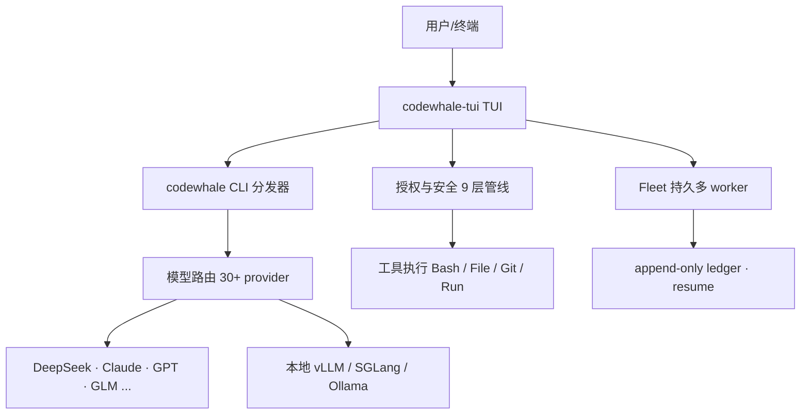

# Codewhale：Rust 终端里的多模型编程 Agent，从 DeepSeek 一路长成社区项目

这个项目一开始叫 DeepSeek-TUI，做的是"在终端里用 DeepSeek 写代码"。从 v0.8.41 起它改名为 Codewhale，定位也变了：不再只是 DeepSeek 的终端壳，而是一个**社区驱动的 agent harness**——你给它一个 provider、一个模型、一个任务，它读代码、改文件、跑命令、自查结果，做完就停，需要你的时候再找你。DeepSeek 是第一个 provider，也是默认 provider，但不再是被绑死的那个。

[项目地址：Hmbown/CodeWhale](https://github.com/Hmbown/CodeWhale)，Rust 编写，MIT 协议，GitHub API 于 2026-08-07 验证：40,520 Stars、3,504 Forks，最新发布 v0.9.1（2026-07-25）。

> 常在终端写代码、通过 SSH 连服务器、或者想用一个 harness 接多家的模型（DeepSeek、Claude、GLM、本地 Ollama）而不是每家用一个工具的人，这篇文章对你有用。习惯 GUI IDE 且不打算离开 Cursor/Copilot 的，可以直接看末尾的适用边界。

---

## 1. 系统总览：三条主线各管一段

Codewhale 不是单一的主程序，而是三个二进制协同：`codewhale`（CLI 分发器）、`codewhale-tui`（TUI 运行时）、`codew`（便捷命令）。它真正值得拆的是三条逻辑主线——模型怎么选、工具怎么被授权、多任务怎么编排。



三条主线互不越界：

| 主线 | 谁负责 | 关键概念 |
|------|--------|----------|
| 模型路由 | `codewhale-tui` + provider 注册表 | `/model` 切换 provider 与模型，`--model auto` 逐轮路由 |
| 授权与安全 | 授权管线 | Plan/Act/Operate 模式、Ask/Auto-Review/Full Access 姿势、constitution |
| 编排 | Fleet + Workflow | 持久 worker、ledger、`fleet resume` |

## 2. 模型路由：一个 harness，30 多个 provider

Codewhale 的卖点不是"又一个壳"，而是**一个 runtime、一套工具，接尽量多的模型**。README 的说法是：hosted、gateway、local 都接，open models 优先，谁都不特权。

打开 TUI 后，`/model` 一次切换 provider 和模型；`--model auto` / `/model auto` 让系统逐轮把一个 turn 路由到具体模型和推理强度。provider 列表很宽，包括 DeepSeek、Anthropic、OpenAI、GLM（zai / wanjie-ark）、Kimi（moonshot）、硅基流动（siliconflow）、智谱（bigmodel 相关）、以及 openrouter 这类网关。本地跑 vLLM、SGLang 或 Ollama 时，可以把 base URL 指过去，模型不需要 key。

DeepSeek 仍是默认 provider，模型 ID 是 `deepseek-v4-pro`、`deepseek-v4-flash`，旧的 `deepseek-chat`、`deepseek-reasoner` 作为别名保留。环境变量 `DEEPSEEK_API_KEY`、`DEEPSEEK_BASE_URL`、`DEEPSEEK_MODEL` 在改名后继续生效——改名只动了品牌，没动 DeepSeek 的接入面。

一个值得注意的细节：价格和上下文上限来自真实路由。未知的价格显示为 unknown，而不是默认给个 0 美元，避免让你误判成本。

## 3. 授权与安全：模式、姿势、constitution 三层

这是 Codewhale 最用心的地方，也是和"终端里跑个模型问答"类工具拉开差距的地方。它把"该不该做这个操作"拆成了几个独立概念。

**模式（mode）** 决定你处于什么交互状态，用 `Tab` 在 Plan → Act → Operate 之间循环：

- **Plan**：只读。可以做调查、读文件、出方案，但 shell 和 patch 执行是关的。适合想边想边说、产出一份给人看的计划。
- **Act**（Agent）：多步工具调用。默认有 `Bash` 工具，但每次调用都要过审批。
- **Operate**：多任务指挥姿势。父会话当 operator，派后台 worker 做独立的长任务，自己留着做汇总和纠偏。

**权限姿势（permission posture）** 用 `Shift+Tab` 在 Ask → Auto-Review → Full Access 之间循环，决定 UI 多频繁地在你执行工具前打断你：

- **Ask**（默认）：工具审批可能打断，遇到会实质改变权限、成本、范围或结果的选择会问你。
- **Auto-Review**：完全自主，不弹用户问题，模型从上下文里做安全可逆的判断，或报告它无法安全继续。
- **Full Access**：普通工具调用不弹审批，但**不可绕过的安全 holds**（constitution、repository law）会作为硬阻断开在深处，而不是弹一个矛盾的框。

**constitution**（章程）是更深的一层。它分三层：编译进二进制的全局底层、`~/.codewhale/constitution.json` 的用户全局层、仓库里的 `.codewhale/constitution.json` 的 repo 层。repo 层的 `protected_invariants` 可以写成带 `paths` 的对象，这会**编译成机械的写保护**——工具门禁在写入前评估它，Full Access 也绕不过。章程只能收紧，不能授权，所以构造一个 constitution 无法削弱某个门禁。

这套授权是九层管线（`AUTHORIZATION_ORDER.md`），从配置与姿势、模式与工具准入、hooks、注册工具基线、`permissions.toml` 类型化规则、自动审查与安全底线、repository law、人工审批，到工具执行与沙箱。最后落地的沙箱按平台做系统级隔离：Linux 用 landlock、macOS 用 seatbelt、Windows 用 AppContainer，Windows 原生没有等价机制，要走 WSL2。关键是它**单调收紧**：后面的层可以加提示或阻断，但不能把前面的阻断或提示变成未审查的执行。

## 4. 编排：Fleet 与 Workflow

当一个任务需要多个 worker 并行，或者要跨机器、跨 sleep/重启存活时，Codewhale 用 Fleet。Fleet **不是一个独立的执行引擎**——一个 worker 就是一个 headless 的 `codewhale exec` 运行，由 fleet 启动并持久跟踪。它把每一步写进 `.codewhale/fleet.jsonl` 这个 append-only ledger，所以 `codewhale fleet resume <run-id>` 可以在 manager 退出、笔记本休眠或进程重启后安全地重放 ledger、续上未完成的工作。

```sh
codewhale fleet init
codewhale fleet run tasks.json --max-workers 4
codewhale fleet status
codewhale fleet resume <run-id>
```

Workflow 是另一个面：决定一组 worker **按什么顺序**跑——阶段、门禁、预算、回放、确定性 fan-in。简记：**Fleet = 谁来做**（worker、角色、模型、主机、信任边界），**Workflow = 按什么顺序做**（阶段、门禁、预算、fan-in）。并行 fan-in 采用 manager-owned 模式：一个 manager 派发、等待、聚合、验证，才合成一个结果。

## 5. 一次修 bug 流过系统

把上面三条主线串起来。假设你在维护一个 Rust 项目，编译报了个类型不匹配。

1. 在项目目录启动 `codewhale`，TUI 打开。默认是 Plan 模式，先只读调查——让模型读 `src/handler.rs` 相关代码段，定位到 `parse_input` 返回 `Result<String, ParseError>` 而调用方期望 `Result<Vec<u8>, ParseError>`。
2. 确认方案后 `Tab` 切到 Act。模型提出把返回值改成 `Result<Vec<u8>, ParseError>`，理由是 `parse_input` 内部已经能把解析结果转成字节。
3. 模型调用 `File` 工具写文件时，审批层按当前姿势（Ask 或 Auto-Review）决定是否打断你。这一步是**门禁**：不是模型说了算，是权限管线说了算。
4. 改完，模型跑 `cargo check` 验证。如果项目 `.codewhale/constitution.json` 里把 `crates/protocol/**` 设成了 `block`，那么任何对受保护路径的写入都会被机械阻断——模型改不到那。
5. 如果这个 bug 牵涉多个文件、需要并行排查，可以派 background worker 或走 Fleet。每个写 worker 都要返回验证证据（真实跑过的命令或 PASS/FAIL），父会话负责汇总。
6. 改错了想回退？`/restore` 从 side-git 快照恢复工作区文件，不会重写对话历史；`codewhale fork <id>` 则把某个会话复制成新会话，方便换一条答案路径而不覆盖原会话。

这个流程的重点在于：**确认不是模型的自选动作，而是模式、姿势、constitution、审批、沙箱多层的共同结果**。模型只负责提方案，门禁决定它能不能落地。

## 6. 安装与迁移：从 deepseek-tui 到 codewhale

改名带来的实际影响主要是命令和包名变了。旧状态不会被删：`~/.deepseek/config.toml`、sessions、skills、tasks、mcp.json 都保留，新的 Codewhale 优先读 `~/.codewhale/`，读不到时回退到旧的 `~/.deepseek/`。

最直接的安装方式是 npm（macOS / Linux）：

```bash
npm install -g codewhale
codewhale --version
```

macOS、Linux 和 Windows 都可以从 GitHub Releases 页面下载平台归档，解压出 `codewhale`、`codew`、`codewhale-tui` 三个二进制和 `install.sh` / `install.bat`，归档自带 sha256 校验清单。认准官方渠道：GitHub 的 [Hmbown/CodeWhale](https://github.com/Hmbown/CodeWhale) 与 npm 包 `codewhale`。`codewhale.*` 这类域名变体并不是作者维护的，`curl | sh` 运行任何非官方脚本都存在风险，应避免。

也可以用 Cargo（建议使用较新的稳定版 Rust 工具链）：

```bash
cargo install codewhale-cli --locked    # 提供 codewhale 和 codew
cargo install codewhale-tui --locked    # 提供 codewhale-tui
```

初次认证：

```bash
codewhale auth set --provider deepseek   # 或 export ANTHROPIC_API_KEY 等
```

常用入口：

```bash
codewhale                                # 打开 TUI
codewhale exec "fix the failing test"    # 无头一次跑
codewhale web                            # 本地浏览器客户端，绑定 127.0.0.1
```

从旧版迁移时，`codewhale doctor` 会对比两个目录的会话文件，告诉你要不要跑 `codewhale sessions` 做增量迁移。改名是为了更短的终端手柄，也是产品方向的表达：做一个面向开源和 open-weight 编码模型的 agentic 终端，DeepSeek 保持一等公民，但旁边是其他所有 provider。

## 7. 适用边界与采用建议

**什么时候值得装**

| 场景 | 为什么适合 |
|------|-----------|
| 常年 SSH 远程开发 | 不需要 GUI，终端里一家工具接多模型 |
| 想在一个 harness 里切 DeepSeek / Claude / GLM / 本地 Ollama | `/model` 一次切 provider 和模型，不用每个模型装一个 CLI |
| 重视"AI 改代码之前的门禁" | Plan 只读、审批姿势、constitution 硬保护，比纯自动 agent 更可控 |
| 需要可恢复的多 worker 并行 | Fleet 的 ledger 和 resume 让长任务在重启后能续上 |

**什么时候先用别的**

- `constitution`、授权管线、Fleet 这些是认真做安全的设计，但如果你本来就不打算让 agent 自动改代码，可能用不到一半的功能，一个轻量的问答工具更省事。
- 团队如果已经统一在 Cursor / Copilot 生态且完全不考虑命令行，迁移成本高于收益。
- 想要一个"自动读文件、改文件、跑命令"的全自动 agent，且信任模型直接落地，Codewhale 的默认门禁会比 Claude Code 这类工具多几步确认——这是安全换来的交互成本。

**渐进采用路径**：先在个人项目里跑一周，用 `codewhale` 的 Plan 模式做只读调查、`exec` 跑一两次无头任务，感受门禁节奏；再逐步放开到 Ask、Auto-Review；确认 constitution 和信任边界后，再让团队里已经在用终端 agent 的 1-2 个人在非关键项目上试 Fleet。不建议一上来就把团队现有的 AI 编码工具整个替换掉。

## 8. 常见问题与排查

**npm 或 cargo 安装失败**

先分清楚是哪一环：`npm install -g codewhale` 失败多与 registry 连通性有关；`cargo install ... --locked` 失败则常见于 Rust 工具链版本偏旧。网络受限时，官网安装脚本和 README 里提到的 CNB 镜像通常是更稳的路径。

**认证配了还是提示缺 key**

`codewhale auth set --provider deepseek` 和 `export DEEPSEEK_API_KEY=...` 是两条独立路径，先确认你用的是哪一条。换 provider 时环境变量名跟着变：DeepSeek 用 `DEEPSEEK_API_KEY`，Anthropic 用 `ANTHROPIC_API_KEY`。

**本地模型切不过去**

本地 vLLM / SGLang / Ollama 不需要 key，但要把 base URL 指向你的服务，并确认端口可达。`/model` 一次切 provider 和模型，切完先确认当前落在本地这条路由上。

**`fleet resume` 没续上**

ledger 是追加式的 `.codewhale/fleet.jsonl`，resume 依赖它还在同一项目目录里、run-id 正确。manager 退出、休眠或重启后，回到原目录再跑 `codewhale fleet status` 看状态。

**从 deepseek-tui 迁移后会话看不到**

改名只动品牌，不动数据。先跑 `codewhale doctor` 对比新旧目录的会话文件，需要时再用 `codewhale sessions` 做增量迁移。

**价格显示 unknown**

这不是报错。未知价格如实显示为 unknown，而不是记成 0 美元，是为了避免你按错误成本做判断。

## 9. 结尾回到系统层

Codewhale 值得看的不是"又一个 RAII 写得很好的 Rust 终端工具"，而是它把三件通常被混在一起的事分开了：模型路由（想用哪个模型）、权限授权（能不能落地）、多任务编排（怎么并行）。分开了，每一层都能独立收紧或放开，这是它从"DeepSeek 的终端壳"变成"社区驱动的 agent harness"的根本原因。

如果你想在终端里用一个工具接多家模型，并且在意 agent 动代码之前那层门禁，Codewhale 值得花一个晚上试。它现在还在高速迭代（v0.9.1，2026-07-25），社区规模也已经不小——40k Stars 意味着边缘问题有人提、有人修，生态支持比早期成熟多了。

---

**项目信息**（GitHub API 2026-08-07 验证）

- GitHub：[Hmbown/CodeWhale](https://github.com/Hmbown/CodeWhale)（原名 Hmbown/DeepSeek-TUI）
- Stars：40,520 | Forks：3,504
- 语言：Rust | License：MIT
- 创建时间：2026-01-19 | 最新推送：2026-08-06 | 最新发布：v0.9.1（2026-07-25）
- 定位：Open-source, community-driven agent harness

---

## 附录：术语速览

| 术语 | 含义 |
|------|------|
| harness | 把模型、工具、权限、编排打包在一起的框架，Codewhale 的自我定位 |
| provider | 模型服务商，如 DeepSeek、Anthropic、OpenAI，或本地 vLLM / Ollama |
| mode（模式） | Plan / Act / Operate 三种交互状态 |
| posture（权限姿势） | Ask / Auto-Review / Full Access，决定审批打断的频率 |
| constitution（章程） | 分层写保护，只能收紧、不能授权，Full Access 也绕不过 |
| ledger | 追加式任务日志 `.codewhale/fleet.jsonl`，支撑 `fleet resume` |
| Fleet | 多 worker 编排，回答"谁来做" |
| Workflow | 执行顺序编排，回答"按什么顺序做" |