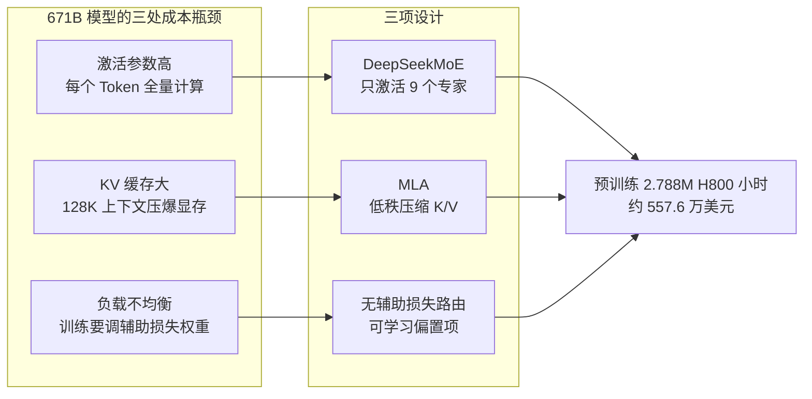

# DeepSeek-V3 的工程取舍：671B 参数的算力账本

DeepSeek-V3 671B 参数，每次前向只激活 37B。Llama 3.1 405B 算满 405B，它只算 37B，差了 11 倍。

这个差距来自 MoE。但 MoE 只是起点，剩下两处成本同样要压：MLA 让 128K 上下文不撑爆显存，无辅助损失路由让训练少一个要调的权重。三项设计各管一段，叠加起来才把预训练压到 2.788M H800 GPU 小时。

| 指标 | 数值 |
|------|------|
| 总参数量 | 671B |
| 激活参数量 | 37B |
| 上下文长度 | 128K |
| 预训练语料 | 14.8T tokens |
| 训练成本 | 2.788M H800 GPU 小时（约 $5.576M） |
| 代码许可 | MIT License |

这张图把三处成本瓶颈和对应的设计对起来，后面逐个展开：



---

## 一、算力约束下的工程取舍

### 1.1 为什么是 MoE

Scaling Law 在稠密架构下意味着算力随参数线性增长。GPT-3（175B）、PaLM（540B）、Llama 3.1（405B）都是稠密 Transformer，每个 Token 流经每一层的每个 FFN 块。405B 稠密模型每次前向都要计算 405B 参数，不管 Token 是否需要那么大的计算量。405B 之后的稠密模型训练成本会突破多数团队的预算。

MoE（Mixture of Experts）把 FFN 层替换为多个并行的专家网络，配合路由器决定每个 Token 交给哪些专家。一个 N 专家的 MoE 层输出为：

```
y = Σ(g_i(x) · E_i(x))
```

`E_i(x)` 是第 i 个专家网络，`g_i(x)` 是路由给出的门控权重（通常是稀疏的 top-k 选择）。每个 Token 只激活 top-k 个专家，其余专家不参与计算。

DeepSeek-V3 的 DeepSeekMoE 配置（来自技术报告 Table 1）：

- 路由专家：256 个
- 共享专家：1 个（始终激活）
- 每次激活：1 个共享专家 + top-8 路由专家，共 9 个
- 专家激活比例：9/257 ≈ 3.5%

共享专家承载通用模式，路由专家承载专业化模式。每次前向只有 9 个专家计算，其余 247 个专家的参数不参与本次计算，但仍占用显存——这是 MoE 用显存换算力的基本取舍。

### 1.2 Multi-Token Prediction 的训练信号

传统语言模型预测下一个 Token（NTP）。DeepSeek-V3 引入 Multi-Token Prediction（MTP），同时预测接下来的多个 Token。MTP 在训练阶段作为辅助任务提供额外监督信号，同一个上下文可以同时产生多个预测损失。推理阶段可以不用 MTP 头，按标准 NTP 解码；如果启用 MTP 头做投机解码，可以一次前向产出多个候选 Token 加速推理。

MTP 的代价是训练时需要额外的前向计算和更复杂的实现，DeepSeek 在技术报告中将其作为可选项，推理时不强制使用。

---

## 二、三项关键设计

### 2.1 整体结构

DeepSeek-V3 采用 Pre-Norm + 残差连接的 Transformer 堆叠，共 61 层，每层包含 1 个 MLA 注意力模块和 1 个 DeepSeekMoE 模块：

```
输入 Token
    ↓
[MLA Layer] ← Multi-head Latent Attention
    ↓
[MoE Layer] ← DeepSeekMoE（1 共享专家 + 256 路由专家，top-8）
    ↓
...（堆叠 61 层）...
    ↓
输出
```

### 2.2 一个 Token 如何流过系统

以推理阶段处理"解释 MoE 架构"这个输入为例，一个 Token 的完整流程：

1. **Embedding**：Token 转为向量，进入第 1 层
2. **MLA 注意力**：当前 Token 的 Query 与 KV Cache 中的 latent vector 做注意力计算。KV Cache 存的是压缩后的 latent vector，不是完整 K/V，解码时通过投影矩阵恢复
3. **MoE 路由**：路由器计算当前 Token 与 256 个路由专家的亲和度分数，选 top-8。被选中的 8 个路由专家 + 1 个共享专家并行计算，其余 247 个路由专家跳过
4. **聚合**：路由器输出的门控权重对 9 个专家的输出加权求和
5. **残差与归一化**：聚合结果加上残差，进入下一层
6. **重复 2-5**：经过 61 层后，最后一层输出经过 LM Head 得到下一个 Token 的概率分布

每层只有 9 个专家在算，但 257 个专家的参数都得驻留在显存里。671B 总参数、37B 激活参数就是这个来源：模型容量大，单次计算量小。

### 2.3 Multi-Head Latent Attention（MLA）

标准 MHA 每个 Token 都要缓存所有头的 K/V 向量。128K 上下文、多头模型下，KV Cache 体积会撑爆显存。MQA 和 GQA 通过共享 K/V 头来缓解，但会损失注意力质量。

MLA 的做法是对 K/V 做低秩压缩：

- 训练时，K/V 通过低秩投影矩阵压缩到 latent space
- 推理时只缓存压缩后的 latent vector
- 解码时，Q/K/V 通过投影矩阵从 latent vector 恢复

```python
# MLA 投影逻辑（伪代码）
# latent_kv: [batch, seq, rank]  ← 推理时缓存这个
# 推理时：q = q_proj(x) 恢复到 [batch, seq, heads, head_dim]
# k, v = kv_proj(latent_kv) 恢复到 [batch, seq, heads, head_dim]
```

MLA 相比 MQA/GQA 的优势在于保留多头注意力的表达能力，压缩发生在低秩空间而非靠共享头。按技术报告，V3 的 KV 缓存能压到约 GQA 的 1/3，注意力质量仍接近 MHA——这是 128K 上下文能塞进显存的关键。

### 2.4 辅助损失-free 负载均衡

MoE 的老问题是负载均衡：如果路由器总是把 Token 送给少数专家，其他专家训练不到，模型容量浪费。传统解法是加辅助损失强制均匀分配，但辅助损失的权重是超参数——太小没用，太大干扰主训练目标。

DeepSeek-V3 的做法是给每个专家引入可学习的偏置项，路由时直接加到亲和度分数上：

```
score_i = dot(W_g · x, W_i · x) + bias_i
top-k = argmax(score_i)
```

训练过程中，被过度选中的专家 bias 自动下降，被低估的专家 bias 自动上升，无需显式惩罚项。这个机制去掉了辅助损失权重这个超参数，代价是引入了 bias 项的额外训练动态，需要验证收敛性。

DeepSeekMoE 还采用细粒度专家分割：把每个专家拆成更小的子单元，增加调度灵活性。粒度越细，路由选择空间越大，但路由决策的计算开销也越高。

### 2.5 FP8 混合精度与通信优化

2.788M H800 GPU 小时完成 671B 训练，依赖两项工程优化：

**FP8 混合精度**：大部分计算用 FP8（8 位浮点）进行，关键梯度用 BF16 存储。FP8 的动态范围比 BF16 小，需要在框架层面做细致的数值稳定性处理，包括缩放因子调整和溢出检测。DeepSeek 在技术报告中给出了 FP8 训练的稳定性验证数据。

**通信-计算重叠**：MoE 的路由机制引入跨节点通信（专家分布在不同 GPU 上）。DeepSeek 用自研的 DualPipe 算法把前一批的计算和下一批的传输重叠起来，配合自定义的 all-to-all 通信，让通信基本被计算掩盖。这对 MoE 训练的扩展性至关重要——如果通信不能被掩盖，跨节点训练的效率会随节点数下降。

**成本口径**：2.788M 小时不是单一数字。按技术报告拆开：预训练阶段 2.05M 小时（其中 4K 上下文 0.32M、128K 上下文 1.73M），后训练阶段 0.74M 小时。预训练是主体，后训练（SFT、RL 等）占了剩下的四分之一。这套数字只覆盖 DeepSeek-V3 自己的路线，不含数据清洗和多次实验的全部开销，也不能直接外推到其他模型架构。

---

## 三、推理与部署

### 3.1 获取模型

代码 MIT 许可，权重托管在 HuggingFace：

- **GitHub**：[deepseek-ai/DeepSeek-V3](https://github.com/deepseek-ai/DeepSeek-V3)
- **HuggingFace**：[deepseek-ai/DeepSeek-V3](https://huggingface.co/deepseek-ai/DeepSeek-V3)

```bash
huggingface-cli download deepseek-ai/DeepSeek-V3 --repo-type model --local-dir ./models/DeepSeek-V3
```

### 3.2 推理示例

**使用 vLLM 部署（推荐）**：

```bash
vllm serve deepseek-ai/DeepSeek-V3 \
    --dtype bf16 \
    --tensor-parallel-size 8 \
    --max-model-len 131072
```

```python
from vllm import LLM, SamplingParams
llm = LLM(model="deepseek-ai/DeepSeek-V3", tensor_parallel_size=8)
params = SamplingParams(temperature=0.7, max_tokens=512)
outputs = llm.generate(["MoE 架构的核心思想是什么？"], params)
print(outputs[0].outputs[0].text)
```

**使用 transformers 加载**（需多卡分片，单卡显存装不下完整权重）：

```python
from transformers import AutoModelForCausalLM, AutoTokenizer

model_name = "deepseek-ai/DeepSeek-V3"
tokenizer = AutoTokenizer.from_pretrained(model_name)
model = AutoModelForCausalLM.from_pretrained(
    model_name,
    torch_dtype="bfloat16",
    device_map="auto",   # 在多卡上按剩余显存自动分片
)

messages = [{"role": "user", "content": "解释一下 MoE 架构的核心思想"}]
input_ids = tokenizer.apply_chat_template(messages, add_generation_prompt=True)
outputs = model.generate(input_ids, max_new_tokens=512, temperature=0.7)
print(tokenizer.decode(outputs[0], skip_special_tokens=True))
```

### 3.3 量化部署

DeepSeek-V3 完整 BF16 权重约 1.4TB，单卡无法加载。量化方案对比：

| 方案 | 精度 | 显存需求（估算） | 推荐场景 |
|------|------|-----------------|---------|
| BF16 | 16-bit | ~1400GB | H100 集群 |
| FP8 | 8-bit | ~700GB | H100/H800 |
| INT4 + AQ | 4-bit | ~350GB | 高端单机（8×80G） |
| GGUF | 4-bit | ~350GB | 个人开发测试 |

以 llama.cpp 量化（INT4）为例：

```bash
llama-cli -m ./DeepSeek-V3-Q4_K_M.gguf \
    -n 512 \
    -p "MoE架构的核心思想是" \
    --temp 0.7
```

### 3.4 API 调用

通过兼容 OpenAI API 格式的接口调用：

```python
from openai import OpenAI

client = OpenAI(
    api_key="YOUR_API_KEY",
    base_url="https://api.deepseek.com"
)

response = client.chat.completions.create(
    model="deepseek-chat",
    messages=[{"role": "user", "content": "用一句话解释 MoE"}],
    max_tokens=128,
    temperature=0.7,
)
print(response.choices[0].message.content)
```

---

## 四、采用建议与边界

**采用顺序**：

1. **先试 API**：通过 DeepSeek 官方 API 或 OpenAI 兼容接口验证模型能力是否满足业务需求，成本最低
2. **再试量化部署**：如果需要数据私有或低延迟，用 FP8 或 INT4 量化在 H100/H800 上部署，验证吞吐和延迟
3. **最后考虑微调**：基座模型能力确认后，用 LoRA 在领域数据上微调，注意评估微调后是否损失通用能力

**适用边界**：

- **适合**：长上下文处理（128K 原生支持）、通用对话与问答、代码生成、中文场景（预训练语料中文占比高）
- **谨慎**：实时性要求极高的场景（MoE 路由有额外开销）、显存受限的单卡环境（671B 参数即使量化也需要多卡）
- **不适合**：需要在端侧或消费级 GPU 上运行的场景（参数量太大）、对推理延迟极其敏感的实时系统

**与稠密模型的取舍**：如果业务场景下推理算力充足、不需要 128K 上下文，72B 级别的稠密模型（如 Qwen 2.5 72B）部署更简单，单次推理延迟更可控。DeepSeek-V3 的优势在参数容量大但激活算力小，适合需要大模型能力但推理预算有限的场景。

### 常见部署问题

**显存不足，无法加载完整模型怎么办？**

使用量化方案。INT4 量化后显存需求约 350GB，可以在 8×48GB 或 4×80GB 的 GPU 上运行：

```bash
vllm serve deepseek-ai/DeepSeek-V3 \
    --dtype half \
    --quantization awq \
    --tensor-parallel-size 4
```

**推理速度太慢怎么办？**

MoE 模型的推理速度受限于路由机制和专家并行。优化方向：
- 使用 vLLM 的 PagedAttention 和 Continuous Batching 提高吞吐
- 增大 `--tensor-parallel-size` 利用多卡并行分摊计算
- 启用 MTP 头进行投机解码，一次前向产出多个候选 Token

**128K 上下文无法正常使用？**

确认使用的推理框架支持 128K 上下文。transformers 库需要设置 `max_position_embeddings`，vLLM 需要设置 `--max-model-len 131072`。如果显存不足，可以使用 YaRN 进行上下文外推。

---

## 参考链接

- GitHub：[deepseek-ai/DeepSeek-V3](https://github.com/deepseek-ai/DeepSeek-V3)
- HuggingFace：[deepseek-ai/DeepSeek-V3](https://huggingface.co/deepseek-ai/DeepSeek-V3)
- DeepSeek-V3 技术报告：[arXiv:2412.19437](https://arxiv.org/abs/2412.19437)