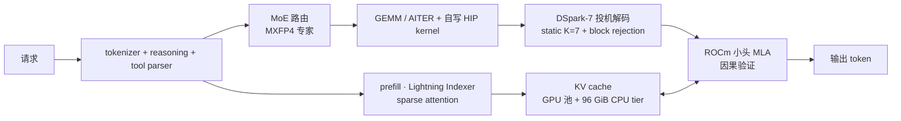

## 一、为什么 304B MoE 要塞进一张 MI300X

DeepSeek V4 Flash 是 304B 参数的稠密 + MoE 混合模型（checkpoint `deepseek-ai/DeepSeek-V4-Flash-0731`，MIT 许可，MoE 形状 256 专家取 top-6）。官方 vLLM recipe 只覆盖 NVIDIA 和 MI325X（4K 上下文）/MI355X，MI300X 不在其列——单卡跑生产，靠的是一整套补丁栈：把一个 vLLM ROCm nightly 的镜像 digest 锁死（`0.26.1rc1.dev229+g124154a88.rocm723`，AITER 0.1.19），再往上逐字节打 overlay。

先交代时点。这套仓库有两个状态，本文全部数字按此分开标注：

| 时点 | 仓库状态 | 栈形态 | 代表数字 |
|---|---|---|---|
| **发表时**（2026-08-04，commit `7c06e57e`，文章首发 08-05） | 首个公开版本 | 10 个 overlay `.py` | 单流 168.6 tok/s、64 流 830 tok/s、prefill 7.9–8.5K tok/s、256K 上下文 |
| **现行**（2026-08-15 起，commit `012b9945`；2026-10-04 复核） | 一轮 prefill/decode tuning 大换血 | 17 个 overlay `.py` + 自写 gfx942 HIP kernel | 单流 158.8 tok/s（static K=7）、64 流 1,278 tok/s、prefill 11.69K tok/s、384K 上下文 |

两个时点的机制主线不变，变的是 overlay 数量和数字。读过旧版本文的读者请以现行数字为准；发表时的数字保留作演进轨迹，也是第八节那张对照表的左列。

再交代 overlay 这个全文核心词：一个运行时真正生效的 patch 文件，整文件替换 pinned image 里的同名文件（`compose.yaml` 里以只读方式挂载）。它和 diff 的分工写在仓库里——diff 只作文档，overlay 才是跑在线上的那一份。这套仓库的原则是生产二进制与上游 commit 同时锁死：`patches/README.md` 登记每个 overlay 的 base commit，`SHA256SUMS` 校验每个运行时产物，任何一处 hash 对不上就停。

为什么硬上 MI300X？三项硬指标：

- **192 GB HBM3**，是 H100 SXM5 80 GB 的 2.4×
- **5.3 TB/s** 内存带宽
- 单卡清单价约为 H100 的一半（Doubleword 估算）

304B 模型 BF16 权重 ≈ 608 GB，FP8 后 ≈ 304 GB，哪个都塞不进 80 GB 的 H100。MI300X 单卡也装不下 FP8 全量：实际加载态 156.67 GiB，是专家权重再走 MXFP4（4 位）量化压出来的体积。扣掉权重，HBM 只剩几十 GB 给 KV cache、graph capture 和 kernel workspace——发表时给 GPU KV 池配了 20 GB，现行降到 16 GB、换来 384K 上下文验证。这就是 304B 上单卡 MI300X 的全部空间账，第十三节会回来逐项对一遍。

所以选 MI300X 不是预算问题，是容量问题：H100 只能 2 卡 TP（tensor parallel，张量并行）或更激进的量化；MI300X 单卡装下了。上下文发表时验证 256K，现行验证 384K（架构上支持 1M）。

整条推理链路与 overlay 的落点：



发表时 10 个 overlay 对号入座（每个文件的 base commit 逐条登记在 `patches/README.md`）：

| # | overlay（`patches/`） | 修什么 | 备注 |
|---|---|---|---|
| 1 | `fused_compress_quant_cache.fnuz-shuffle.py` | Lightning Indexer FP8 缓存写成 FNUZ + 16×16 preshuffle | MI300X（FNUZ）专用 |
| 2 | `gpt_oss_triton_kernels_moe.pack128-fused-silu-fast-routing.py` | MXFP4 padding mask + fused SiLU + fast routing | 取自 Doubleword `c32932bb9`，not yet upstream |
| 3 | `mxfp4.fused-silu.py` | fused-SiLU kernel 的 gate/up interleave 布局 | 配合 #2 |
| 4 | `triton-kernels-matmul-ogs-opt-flags.dsv4-mi300x.py` | gfx942 GEMM tile 几何，21 个 shape | 本仓库 tuning |
| 5 | `aiter_pa_mqa_logits.i64.py` | paged-MQA logits kernel 偏移升 64 位 | base：ROCm/aiter `4db400a` |
| 6 | `rocm_aiter_mla_sparse.prefill-bh64.py` | `BLOCK_H=64` + 确定性 topk | 确定性 + 性能 |
| 7 | `rocm_aiter_mla.dspark-causal.py` | 投机验证的 causal mask | 已 upstream（vLLM `77469c9`） |
| 8 | `dspark-speculator.independent-draft-gumbel.py` | draft 侧 Gumbel 噪声独立 | probabilistic 路径需要 |
| 9 | `spec-decode-utils.independent-draft-gumbel.py` | verify 侧 Gumbel 噪声独立 | probabilistic 路径需要 |
| 10 | `kv_offload_cpu_gpu_worker.load-war.py` | CPU↔GPU KV 回写加 fence | PR #47291 未合并 |

①②③⑤⑥ 修「结果对不对」；④ 一半修确定性一半修速度；⑦ 纯修速度。现行版本里这张表已经变了：#2 换成 `gpt_oss_triton_kernels_moe.row-i8asym-candidate.py`（mask 修复保留，叠加 row-asymmetric INT8 激活并调度自写 W1/W2 kernel），#6 换成 `rocm_aiter_mla_sparse.decode-h32-k16.py`，另加 7 个新 overlay 和一个编译版 top-k 扩展——演变细节见第八、九节。下面先按类拆开发表时的每一处修正。

### 一次请求怎么穿过这条链路

把 overlay 放进一次真实请求，顺序是：

1. 请求先过 tokenizer、reasoning 和 tool parser（都是 `deepseek_v4` 系），进 prefill。
2. prefill 由 Lightning Indexer 做 sparse attention，发表时 tile 尺寸是 #6 的 `BLOCK_H=64`。KV 写缓存走 #1 的 FNUZ 写入——字节序一错，后续 attention 的 logits 全错位，DSpark 的 acceptance 直接崩。
3. KV 分两层：GPU 池（发表时 20 GB，现行 16 GB）加 96 GiB CPU 层（`/dev/shm` mmap）。CPU 层与 GPU 之间的搬运靠 #10 的 fence，保证不与 in-flight compute 互相踩踏。
4. 每个 token 经 MoE 路由挑专家，#2 的 padding 修复保证长 prompt 下路由权重不被「不存在的专家索引」扰动。
5. 选中的 expert 交给 AITER GEMM（现行版本还多了自写 HIP kernel），#4 的 tile 几何决定这批 shape 能吃多少带宽。
6. DSpark-7 对 draft token 做投机验证：#5 保证大 KV 池下偏移不溢出，#7 保证 future token 看不到不该看的 earlier position；验证通过才输出，同时更新 KV。

---

## 二、FNUZ vs OCP FP8：错一个字节，scale 域差一倍

模型能塞进单卡，前提是低比特；而 FP8 在 AMD 生态里有互不兼容的两个变体。MI300X（CDNA3）用 AMD 自家的 **FNUZ E4M3**（`torch.float8_e4m3fnuz`），NVIDIA 和 MI355X（CDNA4）用 **OCP 标准的 E4M3FN**。两者都叫 E4M3，编码空间的分配却不一样：FNUZ 消掉了负零，把负零的位型（符号位为 1、其余全 0）挪去表示 NaN——ROCm HIP 文档对 FNUZ NaN 的定义正是这一句——指数偏置 8，最大有限值 240.0（用 PyTorch 对 `torch.float8_e4m3fnuz` 实测 `finfo().max` 即得）；OCP 保留负零、偏置 7，最大有限值 448.0。偏置差 1 意味着同一个字节按错误方言解读，数值恰好差 2 倍——Doubleword 博客的原话是 "off by exactly a factor of two"。

Lightning Indexer 缓存是 DeepSeek V4 的关键路径，FP8 写入。stock vLLM writer 按 OCP 写。下面两段是示意写法，只保留字节序差异，完整实现以 `patches/fused_compress_quant_cache.fnuz-shuffle.py` 为准：

```python
# stock writer: OCP E4M3 bytes, row-major
quantized = weight.to(dtype=torch.float8_e4m3fn)         # OCP E4M3
cache[offsets] = quantized.view(torch.uint8)             # row-major
```

AITER 在 MI300X 上吃的是 **FNUZ E4M3 + 16×16 preshuffled tile 布局**。OCP 字节被当 FNUZ 解读，Lightning Indexer 输出直接错位——后面 DSpark 投机解码拿到的 logits 全错，acceptance rate 暴跌。

修复（`fused_compress_quant_cache.fnuz-shuffle.py`）两件事一起改：选 FNUZ 类型写入，并按 AITER 消费端的 tile 顺序重排。仓库 README 对它的描述有一处值得留意的细节：overlay 选用 `float8e4b8` 类型并把量化上限设成 `FP8_MAX=224.0`——这是这份实现自选的保守 clamp 值，不是 FNUZ 格式本身的属性（格式最大有限值是 240.0），写依赖代码时不要把两者混用。

```python
# overlay: FNUZ + 16×16 preshuffle（示意）
quantized = weight.to(dtype=torch.float8_e4m3fnuz)       # FNUZ
shuffled = preshuffle_16x16(quantized)                    # tile-order reorder
write_with_shuffled_offsets(cache, shuffled, offs)        # match AITER consumer
```

FNUZ 是 CDNA2/CDNA3 这代（MI200/MI300/MI325X）的格式，AMD 从 CDNA4（MI355X）起改用 OCP。这条 patch 换到 MI355X 上必须拿掉；MI325X 虽然同为 FNUZ，tile 调优又不通用——README 专门写明其它 AMD GPU 须保持 stock 字节，两头都对不上是根因。

---

## 三、MXFP4 MoE 的 bitmatrix padding：长 prompt 把 tool name 改名的隐藏 bug

MoE 路由那关也藏着一个 bit 级 bug。DeepSeek V4 Flash 的专家权重是 MXFP4（4 位尾数 + E8M0 共享 scale），vLLM 里这条代码路径叫 `gpt_oss_triton_kernels_moe`——MXFP4 的 Triton kernel 最初为 gpt-oss 写，DeepSeek V4 Flash 复用同一实现。算 bitmatrix 时，padding lane 的屏蔽条件写错了（diff 里的真实代码行）：

```python
# 原代码（错的）
mask = offs_global < nonzero_indx_size
```

padding lane 应当按 **logical block size** 屏蔽（padding 是 block 对齐用的，不该参与路由），原代码却按全局 tensor size 屏蔽。长 prompt 下 global bound 大于 logical block，部分 padding lane 混进实际计算——**这些 lane 携带的是「不存在的专家索引」**，悄悄扰动路由权重。

后果很隐蔽：prompt 越长，越容易把工具调用路由到相似的别的 expert，输出跟 schema 几乎匹配、但 tool name 错位。README 里那句「near-match tool names and forgotten schemas on long prompts」说的就是它。

修复一行（发表时的 overlay `gpt_oss_triton_kernels_moe.pack128-fused-silu-fast-routing.py`，现行由 `row-i8asym-candidate.py` 承接），diff 逐字：

```python
mask = (offs_local < BLOCK_SIZE) & (offs_global < nonzero_indx_size)
```

取自 Doubleword 的 commit `c32932bb9`（commit message 就是 "mask MXFP4 bitmatrix padding lanes by logical block size"），README 标注 **not yet upstream**——目前只有这个仓库在用。同一个发表时 overlay 顺手做了 fused-SiLU 和 fast DeepSeek routing（配套的 `mxfp4.fused-silu.py` 补 gate/up interleave 布局），routing kernel 从 42.6 降到 11.9 µs/layer，-72%。现行版本在这条 overlay 里叠了更多东西——row-asymmetric INT8 激活、adaptive BM16/BM64+BM48 tile、N-split 低并发变体，W1/W2 直接调度到自写 HIP kernel——那些是第八节 tuning 换血的内容。

---

## 四、DSpark-7 投机解码在 ROCm 小头 MLA 上的因果验证

投机解码的因果验证是 ROCm 特有的坑。DeepSeek V4 Flash 自带投机解码草稿模块 DSpark（启动日志 `DSpark draft model loaded: 96 params`），用 static K=7 + probabilistic drafting + block rejection。NVIDIA 上游 vLLM 假设 MLA（Multi-head Latent Attention）注意力路径满足 causal flatten——ROCm 上小头 MLA 的 AITER 后端不保证这一点。

后果：投机验证阶段算 attention 时，future token 看到了本不该看到的 earlier position，speculative acceptance 虚高，输出串味。修复已进上游（vLLM commit `77469c9`，即 PR #50476），仓库保留的 overlay **与 upstream 在该 commit 处逐字节一致**——`patches/README.md` 原话是 "This file is identical to the upstream file at that commit; the diff shows the change the commit itself made"，对应 `patches/diffs/07-rocm_aiter_mla.dspark-causal.patch`。

为什么 upstream 已合并还要留 overlay？pinned nightly 不一定包含那个 commit。Base image 升级时，这类 overlay 才有机会按需摘掉。

DSpark-7 还有两条精细补丁（`dspark-speculator.independent-draft-gumbel.py` + `spec-decode-utils.independent-draft-gumbel.py`）：`draft_sample_method=probabilistic` 时，draft 提议的 Gumbel 噪声必须与 rejection/recovery 噪声独立，否则投机解码在长上下文里会偏向某些 token。greedy 路径用不上这两条。

现行版本给 K=7 又补了一条硬理由：checkpoint 自己声明 `dspark_block_size: 5`，低于 5 个 token 的动态 band 是不支持的 Markov-head 布局，会产出乱码——所以 static K=7 现在是每个并发档位都必须的，不是可选优化。

---

## 五、sparse attention 的 tile 之争：从 BLOCK_H=64 到 decode-h32-k16

sparse prefill 的 tile 尺寸，决定 512 head 下还能不能跑。stock `gfx942`（MI300X 的 GPU 架构代号）实现默认 `block_h = 16`，head=512 时 routed rows 过 768 后急剧劣化。发表时的修复 `rocm_aiter_mla_sparse.prefill-bh64.py` 改两处（diff 真实行）：

```python
block_h = 16  →  block_h = 64
# topk 改走 torch.topk + 显式 sort，保证相同 prompt 走完全一样的 token 路径
```

两条各管一头。确定性 topk 让 tool call 可复现，回归测试才有抓手；`BLOCK_H=64` 纯管性能，sparse attention trace 从 317 ms 砍到 142 ms，-55%（发表时读数）。

现行版本把这条 overlay 整个换掉：`prefill-bh64` 退场，新 overlay `rocm_aiter_mla_sparse.decode-h32-k16.py` 把 decode tile 定成 32 heads × 16 KV、top-512 规范排序，并挂上 OPUS prefill 钩子；确定性 top-k 另走编译路线——`sampler.topk-tiebreak-sanitize.cu` 编译成 `_C_stable_libtorch` 扩展，由 `prepare-artifacts.sh` 解压挂载（M64 graph 单步从 32.62 降到 27.76 ms，少 508 个 GPU 操作）。旧的纯 Python 变体 `rocm_aiter_mla_sparse.topk-tiebreak.py` 留在仓库里但不再挂载，README 标注 superseded，为的是两个最终形态都可审计。

---

## 六、int32 溢出：大 KV 池把偏移顶过 4 GiB

又一个字节级的坑，在 attention kernel 内部。AITER 的 paged-MQA logits kernel（ChunkK=256）默认用 32 位偏移寻址 KV，而无符号 32 位的寻址上限就是 4 GiB。这套部署的 GPU KV 池有 16–20 GB，偏移越过 4 GiB 后 int32 回绕，读写直接指到别的页上。

`aiter_pa_mqa_logits.i64.py`（base：ROCm/aiter `4db400a`）把偏移换成 64 位。它不改变任何数值语义，但没有它，KV 池开大之后出错的位置毫无规律——这类溢出 bug 的典型症状就是「偶尔错、难复现」。

---

## 七、CPU KV 那条 fence：vLLM #47282 的双向同步缺口

最微妙的一处，在 KV 搬运。`vllm/v1/kv_offload/cpu/gpu_worker.py` 的 transfer 路径负责 GPU KV 与 CPU 内存（`/dev/shm`，~103 GB mmap）之间的双向搬运：store 是驱逐时写回 CPU，load 是命中时恢复回 GPU。两个方向都会碰 compute 还在用的活跃 KV 块——store 会读到 compute 还没写完的块，load 会覆盖 compute 还在读的块。stock 代码只在一个方向上等 compute：

```python
# stock（diffs/10 真实行）：
if self.gpu_to_cpu:
    # wait for model computation to finish before offloading
    stream.wait_stream(current_platform.current_stream())
```

overlay 的修复是把这行 `wait_stream` 从条件执行改成无条件——两个方向都先等 compute 流（diffs/10 真实行）：

```python
# Both directions touch live GPU KV blocks: stores read blocks compute may
# still write, while loads may overwrite blocks compute may still read.
stream.wait_stream(current_platform.current_stream())
```

vLLM issue #47282 记录了这个 bug（标题里的说法是 load path lacks cross-stream sync with compute），PR #47291 提出 fence 修复，至今未合并——2026-10-04 复核时 PR 已关闭但 merged 为 False（overlay 的 base 是 #46278 合并后的状态，patches/README.md 登记在案）。仓库把 fence 逻辑挂在自己的 overlay 里。

这条 fix 只有 `--kv-offloading-backend native` 时需要；CPU KV tier 开到 96 GiB 的代价，就是这条 fence 必须在。现行 README 把话说得更重：unfenced restore 会覆盖 in-flight compute 还在读的 KV，所以这条 overlay 必须一直挂着。

---

## 八、性能：发表时的基线，与十一天后的换血

### 发表时的账（2026-08-04 栈，10 个 overlay）

README 贴的最终 sweep 数据（每流 ~400-word 真实 prompt，`temperature=1.0, top_p=0.95`，C1–C8 各 512 输出 token，C64 256）：

| Streams | Aggregate tok/s | Median per-stream | TTFT p50 |
|---:|---:|---:|---:|
| 1 | 126.2 | **168.6 tok/s** | 1.026 s |
| 2 | 145.4 | 152.7 | 0.939 s |
| 4 | 316.8 | 108.6 | 0.369 s |
| 8 | 542.3 | 90.3 | 1.027 s |
| 64 | 830.2 | 16.4 | 2.190 s |

两列口径不同：Aggregate 是整个并发跑批的总吞吐，Median per-stream 是单个请求稳态 decode 的中位数。单流那行两个数对不上（126.2 vs 168.6），单流能力取后者。

当时的优化收益汇总：

| 优化 | 效果 |
|---|---|
| 21 个 A8W8 GEMM shape 调优 | 单/双流 decode +42–62%，8–64 流 +10–35% |
| Fused SiLU + fast DeepSeek routing + batch-sensitive expert tile | Native C1 decode 34.5 → 56.6 tok/s（+64%） |
| `BLOCK_H=64` sparse prefill | Prefill 7.9–8.5K tok/s；sparse-attn trace -55% |
| Static K=7 + 概率 drafting + causal verify | 119.5 tok/s 单流（正确输出） |
| 2,048 token budget + 1,024 long-prefill cap | 短请求 TTFT（time to first token，首 token 延迟）在 52K cold prefill 后从 8.2 s → 0.5 s |
| 20 GB GPU KV + 96 GiB CPU tier | 1.93M token 长度等效容量；7 个 256K 请求同时接 |

Prefill 侧：tuned kernel 让 uncached prefill 跑到 7.9–8.5K tok/s（8,192 budget 下 C1 7.90–7.99K，C4 8.46–8.51K）；生产配置用 2,048-token budget 换延迟隔离，fresh prompt 实测 6,988–7,019 tok/s，带 1,024 cap 的 8.9K prompt 是 5.20–5.29K tok/s——记住 5.26K 这个数，它是现行 README 里「原始部署」的基准线。

### 换血后（2026-08-15 栈，17 个 overlay + HIP kernel）

8 月 8 日到 15 日，作者连发 7 份带日期的 tuning report（prefill 两份、decode 三份、MoE 重写一份、正确性一份），整个 README 的数字跟着重写了一遍。现行顶部表：

| 指标 | 现行读数 |
|---|---|
| Uncached C1 prefill | **11.69K tok/s** steady（11.53K median；**2.19×** 原始 5.26K） |
| 单流 decode（static DSpark-7） | 152.6 aggregate / **158.8 tok/s** 每流 median |
| Native（非投机）C1 decode | 67.3 aggregate（发表时 56.6） |
| 64 流 burst | K7 **1,278 tok/s** aggregate；Native 1,649.8 tok/s（发表时 830） |
| 上下文 | **384K 验证通过**（393,216 tokens；架构支持 1M） |
| GPU KV 池 | 16 GB `fp8_ds_mla`（1.95M-token 长度等效）+ 96 GiB CPU tier |

完整并发表从 5 行扩到 7 行，native 与 K7 双引擎并列，多了一列 accepted/draft（每 draft 平均被接受的 token 数，直接反映投机效率）：

| 并发 | Native aggregate | Native tok/s/user | K7 aggregate | K7 tok/s/user | K7 accepted/draft |
|---:|---:|---:|---:|---:|---:|
| 1 | 67.28 | 68.31 | 152.56 | 158.75 | 2.167 |
| 2 | 123.48 | 63.45 | 207.00 | 132.86 | 1.703 |
| 4 | 223.32 | 58.33 | 327.72 | 95.22 | 1.532 |
| 8 | 393.02 | 53.83 | 510.46 | 79.80 | 1.558 |
| 16 | 571.37 | 46.78 | 728.01 | 53.77 | 1.530 |
| 32 | 1,079.08 | 37.91 | 975.62 | 36.98 | 1.485 |
| 64 | 1,649.80 | 29.64 | 1,278.23 | 25.14 | 1.563 |

这张表的口径和发表时不同，不能直接对行比较：workload 换成了 synthetic random-word（acceptance 低于生产流量），per-stream 也改叫 tok/s/user。README 自己的措辞是「当作这份 image 的 gates，不是通用 model benchmark」。

Prefill 的十一步里程碑链（每步都有 A/B 报告，出自 `PREFILL-EXPERIMENT-LOG-20260808-09.md`）：

```text
5.26K（原始部署）→ 6.96K（contention-aware scheduler）→ ~7.9K（自写 HIP MoE）
→ 8.30K（attention/support 栈）→ 8.99K（asymmetric row-INT8 W1）
→ ~9.36K（OPUS prefill）→ 9.57K（BM64/delta-scale W1）→ 10.97K（batch 4,096 + M=3,712 tuning）
→ 11.09K（exact W2）→ 11.24K（graph buckets + A8W8 ASM）→ 11.39K（OPUS no-padding）
→ 11.53K（deterministic top-k）
```

并发 prefill 也测了：C1 11.66K、C2 10.19K、C4 11.20K、C8 11.36K tok/s。调度配置跟着变了——budget 从 2,048 提到 4,096（384 个 token 留给 DSpark 草稿槽，普通 prefill 可用 3,712），long-prefill cap 改成 contention-aware：没有别的请求会被延误时给满 3,712 quantum，有竞争时切 1,024。52K 冷 prefill 落在活跃 decode 身后的短请求 TTFT 从发表时的 0.5 s 再压到 ~0.3 s，背景 decode 最大间隔 ~0.16 s。

上下文延长是换血后最实用的增量：384K 请求实测跑通，379K-token 冷召回 native 51–53 s / DSpark 120–125 s，热召回 379,904 个缓存 token 只要 0.64–2.65 s 且输出逐字节一致；一条 393,051 total token 的请求（距上限差 165）所有 needle 全中。

### 这些数字该怎么读

1. **单流 decode 是 memory-bound 的**——每生成一个 token 都要读一遍激活参数的权重，单流速度基本就是带宽除以每 token 读取量，DSpark 的作用是把多个 draft token 摊进一次权重读取。
2. **Aggregate 吞吐不随流数线性翻倍**——batch 让多个请求共享一次权重读取，同时 routing kernel 延迟、KV fence 的同步开销和 CU（compute unit，MI300X 有 304 个）调度争抢都在吃余量。K7 的 accepted/draft 从 C1 的 2.167 掉到 C32 的 1.485 再回到 C64 的 1.563，说明投机收益在高并发下被摊薄但没消失。
3. **Native 与 K7 的交叉点在 32–64 流**——C32 时 native aggregate（1,079）已经反超 K7（975.6），C64 差距更大（1,649.8 vs 1,278.2）。投机解码的验证开销在高并发下不再划算，如果你的负载长年跑在 32 流以上，native 配置反而更快。
4. **不能推出的事**：这些数字只对这份 pinned image、这个 workload 成立。DSpark acceptance 随 prompt 变化，synthetic random-word 的 acceptance 又低于真实流量——换 prompt 分布、换并发形态，数字都会动。

---

## 九、换血插曲：一次差点上生产的 clamp 缺失

十一天里最惊险的不是性能，是正确性。作者重写自写 W1 kernel 时漏掉了 checkpoint 要求的两个激活 clamp：`gate=min(gate, 10)`、`up=clamp(up, -10, 10)`（checkpoint 的 `swiglu_limit=10`，作用在专家 SwiGLU 相乘之前）。outlier activation 悄悄改了 logits，症状是反复出现 `)Skip` token、罕见的无关 CJK 字符和 code-token 错误。

定位靠的是 raw `/v1/completions` 回归：61,440 token 的原始补全测试（120 个 seed × 512 token，native 与 DSpark-7 双路径）下，坏 kernel 在 3/120 个响应里出错，修复后 0 错。完整复现步骤在 `CORRECTNESS-20260815.md`。现行 overlay 清单里，`activation.rocm-exact-swiglu.py`（exact BF16 SwiGLU + clamp，经 `swiglu_clamp.hip`）就是这次事故的产物，README 把它列为 shared-expert 输出的 **Required** 项。

这事的教训写在仓库的 production notes 里：吞吐对了不等于输出对了，raw completions 测试能把 serving 层和 chat 编码层隔开——正式抓住这个 bug 的正是 raw 路径的 gate。任何动数值路径的 patch（FP8 写入、路由、clamp、投机解码），验收标准都应该是逐字节对拍，不是看跑分。

---

## 十、MI300X 单卡 vs H100 双卡：算一笔总账

H100 装不下 304B FP8（80 GB HBM），必须 2 卡 tensor parallel。下面是一张估算对比（价格基于 2026 年公开 list price 和 Doubleword 的成本估算，**所有价格均为估算**）：

| 维度 | MI300X 单卡 | H100 SXM5 双卡（TP=2） |
|---|---|---|
| HBM 容量 | 192 GB | 160 GB（2× 80 GB） |
| HBM 带宽 | 5.3 TB/s | 6.7 TB/s（2× 3.35 TB/s） |
| FP8 峰值算力 | 2.61 PFLOPS | ~3.95 PFLOPS（2× 1.975） |
| 304B FP8 部署 | ✅ 单卡装下 | ✅ 需 TP 切分 |
| 单流 decode | 158.8 tok/s（现行实测，static K=7） | ~120 tok/s（估算，TP all-reduce 开销 ~30%） |
| GPU 采购价（估算） | ~$15–20K | ~$60–80K（$30–40K/张） |
| 部署复杂度 | 17 个 overlay + 自写 HIP kernel（发表时 10 个） | 标准 vLLM TP，无 patch |
| 长期维护 | 需跟 vLLM upstream 合并进度 | 主线支持 |

三个要点：

1. **显存账是决定性的**：MI300X 单卡 192 GB 装下 304B FP8 + 16 GB KV + workspace；H100 单卡 80 GB 连模型都放不下，必须 TP=2。TP all-reduce 每步引入 ~0.3 ms 延迟（估算），单流 decode 降到 ~120 tok/s。
2. **采购价差 3–5×**：单卡 MI300X 清单价约为 H100 的一半（~$15–20K vs ~$30–40K/张），双卡 H100 总价 $60–80K。对 304B MoE 场景，MI300X 单卡性价比碾压。
3. **维护成本是 MI300X 的短板，且换血后更重了**：overlay 数量从 10 涨到 17，还多了一套自写 HIP kernel 要跟 image 一起 revalidate。PR #47291（KV fence）一旦合并，overlay 可摘；FNUZ patch 在迁到 MI355X（OCP FP8）后也可摘。但在 MI300X（gfx942）上，这些 patch 是生产必需。

长期看三个变量：vLLM 0.27+ 是否合并 PR #47291（影响 overlay 数量）、MI355X 量产时间（FNUZ patch 可摘、OCP 原生支持）、ROCm 7.3/7.5 的 AITER 兼容性（tuning table 是否需要重做）。

---

## 十一、首次部署要踩的坑

以下步骤出自仓库 `README.md` 的部署段和 `compose.yaml` 的实际配置，发表时和现行的差异单独标出。

**1. 拉 vLLM ROCm nightly image**

image digest 必须完全一致（`vllm/vllm-openai-rocm@sha256:e68d18b2...`），不可改成 `latest` tag。overlay 是按 pinned image 里的 base revision 整文件制作的，换了 image 就要换 image 引用并重新验证整个栈——README 原话 "upgrades require changing the image reference and revalidating the stack"。pull 下来用 `docker images --digests | grep vllm` 确认 sha256。

**2. 拉 model snapshot（revision pin 死）**

`REVISION='7872f01b1d1fe23eabc4c98b48bffcef5a386062'`，`compose.yaml` 里启动参数直接写死了这个 snapshot 路径。不要拉 `main`：FP8 scale table 和 AITER GEMM tuning table 是针对特定 revision 调的，换了就 mismatch。

**3. `sha256sum -c SHA256SUMS` 校验全部 overlay 和 diff 文件**

任何一个 hash 对不上就停。常见原因：git pull 时 line ending 被 CRLF 污染（Windows clone）、或者编辑器自动加了 BOM。用 `git config core.autocrlf input` 然后 re-clone。现行版本多一步：**每次启动前先跑 `./prepare-artifacts.sh`**——它解压编译好的 top-k 扩展并校验 SHA-256，`SHA256SUMS` 管其余所有产物。

**4. `mkdir -p aiter-cache crash-dumps`（现行再加 `profiles-current`）**

这两个目录被 `compose.yaml` bind mount 进容器（`aiter-cache` 挂到 `/root/.aiter`，`crash-dumps` 挂到 `/var/crash/vllm`，后者接 `HSA_COREDUMP_PATTERN` 的 GPU core dump）。提前建好，避免 compose 自动创建时把目录 owner 搞得不符合你的使用习惯。

**5. `chmod +x vllm-entrypoint.sh`（现行再加 `prepare-artifacts.sh`）**

这个脚本做一件关键的事：清理 stale `/dev/shm` mapping。脚本注释原话是 "A dead EngineCore cannot unlink its CPU-KV mmap"——上一次容器非正常退出时，`/dev/shm/vllm_offload_*.mmap`（103 GB CPU KV pool 的 mmap 文件）会残留，entrypoint 用一行 `find /dev/shm -maxdepth 1 -type f -name 'vllm_offload_*.mmap' -delete` 清掉，再 `exec vllm serve`。现行版本还多一步：把 OPUS prefill 的 `.so` 拷进 aiter 的 jit 目录。

**6. `cp Caddyfile.example Caddyfile`**

改三个值：`hostname`（你的域名）、`email`（Let's Encrypt 注册邮箱）、`remote_ip`（允许访问的 CIDR 白名单，示例文件里是 `203.0.113.0/24` 占位）。Caddyfile 还把路径白名单限定在 `/v1/chat/completions`、`/v1/completions`、`/v1/models`、`/health`、`/metrics`、`/generate`，白名单外的请求一律 403；`reverse_proxy` 里那行 `flush_interval -1` 是保流式响应不断流的。

**7. `docker compose config -q`**

校验 yaml 语法。注意这只检查 yaml 能不能解析，不检查 image digest 对不对、volume 路径存不存在、环境变量是否完整。过了这步不等于能 `up -d`。

**8. `docker compose up -d` 然后 `docker compose logs -f inference`**

发表时健康启动约 5 分钟；现行版本首次启动要 JIT 编译 gfx942 kernel，README 让你预留约 10 分钟，健康检查要容忍这个窗口。AITER 的 GEMM tuning table 不是启动时算出来的——仓库 `tuning/` 目录下的 csv 以只读方式挂载进容器（环境变量 `AITER_CONFIG_GEMM_A8W8_BLOCKSCALE_BPRESHUFFLE` 指路），启动阶段只是加载它们。

**9. 健康信号逐条出现**

发表时 7 条，现行 8 条（多了 `Graph capturing finished ... took 6.47 GiB`）。在 `docker compose logs` 里按顺序等：

- `Model loading took 156.67 GiB`
- `DSpark draft model loaded: 96 params`
- `GPU KV cache size: 1,927,444 tokens`（现行：`1,945,846 tokens`）
- `Maximum concurrency for 262,144 tokens per request: 7.35x`（现行：`for 393,216 tokens per request: 4.95x`）
- `Created mmap file /dev/shm/vllm_offload_...mmap (103.08 GB)`
- `Capturing CUDA graphs (FULL)`
- `Graph capturing finished ... took 6.47 GiB`（现行新增）
- `Application startup complete`

现行 README 还提醒两条日志语义：AITER 的 `shape ... not found tuned config ... will use default config` 是**信息性**的（任意 prompt 长度会产生表外 shape，良性）；`HSA_STATUS_ERROR`、OOM、traceback、HTTP 5xx 才是真问题。

**10. 烟测两条 curl 后，先跑一个 uncached prefill**

```bash
curl -fsS "https://your-host/v1/models"
curl -sS "https://your-host/v1/completions" -H 'Content-Type: application/json' \
  -d '{"model":"deepseek-ai/DeepSeek-V4-Flash-0731","prompt":"Calculate 17 * 23. Answer with the number only.","temperature":0,"max_tokens":32}'
```

第一条验证 API 活着，第二条验证 inference 能出结果。但第二条的 prompt 很短，走的是 cached prefill 路径。在 admit 生产流量之前，手动发一条长 prompt（>4000 token）触发 uncached prefill，把 kernel 暖开——发表时读数：8.9K token 的首次 prefill 5.3 s，warm 后同长度 1.7 s。不跑这一步，第一个真实用户会替你撞上那 5 秒。

**11. 上线前把输出质量基线跑一遍**

overlay 栈改了路由、KV 缓存和投机解码，吞吐对了不等于输出对了。仓库自带的验收面：BFCL 工具调用基准 74–76/90 exact match、两轮 tool-calling fixtures、OpenCode tool-schema 检查、380K token 长文 needle 检索（native 与 DSpark 双路径），外加 raw completions 回归——第九节那次 clamp 事故正是被 raw 路径抓出来的。升级 image 或 overlay 后都该重跑，尤其 FP8 写入、路由、clamp 这类动数值路径的 patch，跑分看不出错，逐字节对拍才看得出来。

---

## 十二、HBM 的剩余空间账

最后对一遍第一节欠下的空间账。暖态高水位里，占 HBM 的是三块：**Model 156.67 GiB + GPU KV 池 + AITER kernel 与 CUDA graph**。发表时（20 GB KV 池）合计 204.5 GB；现行（16 GB 池、384K 上下文 + C64 门禁之后）验证态高水位 **199.9 GB**，剩 5.9 GB。96 GiB CPU KV tier 住在系统内存（`/dev/shm` mmap），不占 HBM。

README 写得很直白：

> A 30 GB KV pool loads but fails during graph capture with `HSA_STATUS_ERROR_OUT_OF_RESOURCES`. Do not raise `--kv-cache-memory-bytes`; monitor HBM usage for growth.

结论是 **KV cache 池不能随手开大**：你以为 30 GB 留给 KV，启动在 graph capture 时报 `HSA_STATUS_ERROR_OUT_OF_RESOURCES`。现行措辞更进一步——要动池子大小，必须把整组 memory gates 重跑一遍。`rocm-smi --showmeminfo vram` 是生产必备监控，任何多几百 MB 都要警觉。

CPU KV 96 GiB 不是备份。现行 README 把它的定位说得很准：opportunistic cache，不是 scheduler capacity——它把 380K 级请求的热召回压到秒级，让 384K 上下文真正可用，但不改变调度器能同时接多少请求。

---

## 十三、工程含义与采用建议

ryanzhou 这个仓库值得借鉴的，是三件事：

1. **pinned image + byte-for-byte overlay + SHA-256 校验**——把「生产用的二进制」和「上游的某个 commit」同时锁定。overlay 是运行时真正生效的文件，diff 只作文档。GitHub Actions 自动化部署可以照这个模式做。
2. **每一处 patch 都对应一个上游 issue / commit / PR**——overlay 不是随手改的，都能回溯到来源。`patches/README.md` 把每个 overlay 的 base SHA 列得一清二楚，连「已 upstream 但 nightly 还没带上」和「superseded 但保留审计」这两种情况都单独交代。
3. **正确性回归是这套栈的保险丝**——十一天里抓出 clamp 缺失的，是 61,440 token 的 raw completions 对拍，不是任何跑分。性能可以慢慢调，输出错了是事故。

照不照搬，看你的处境：

- **该上的**：手头有 MI300X 存量、要跑 304B 级 MoE 单卡推理、且能接受跟 vLLM upstream 同步 overlay 的团队。HBM 容量是唯一硬门槛，MI300X 单卡装得下，H100 得双卡或更激进的量化。
- **不必急的**：只有 H100 且能接受 TP=2、或并发长期在 32 流以上（native 更划算，见第八节）、或想等 vLLM 主线合并 PR #47291 后再入场的团队。这套 overlay 栈不是通用配方，是特定 image + 特定 revision 的定制方案，抄作业必须整套搬。
- **从哪开始**：照附录的最短路径跑通一遍，先确认健康信号逐条齐全、烟测通过，再谈调 KV pool 和并发曲线。
- **想跟进 tuning 换血的**：7 份带日期的 report（`PREFILL-OPTIMIZATION-20260809.md` 起头）是完整的实验日志，连被否掉的路径都留了——先读它再决定哪些优化对你的负载值得复刻。

单卡 MI300X 跑 304B MoE，决定因素就是 **HBM 容量**：NV H100 要双卡或更激进的量化，AMD MI300X 单卡装下。对 304B 这类 MoE checkpoint，route 的取舍在这里，不在性价比。

---

## 附录：跑起来的最短路径

```bash
# 1. 主机:一张 MI300X(gfx942,304 CUs,~192 GiB HBM),~235 GiB RAM,~500 GB 磁盘(模型缓存 ~156 GB)
# 2. 拉固定 image 和模型
VLLM_IMAGE='vllm/vllm-openai-rocm@sha256:e68d18b2ba50298661bfc49baf01158fbf036645c2362cccf3e8a7a79fe6c69a'
MODEL='deepseek-ai/DeepSeek-V4-Flash-0731'
REVISION='7872f01b1d1fe23eabc4c98b48bffcef5a386062'

docker pull "$VLLM_IMAGE"
docker run --rm --entrypoint hf -v /root/.cache/huggingface:/root/.cache/huggingface \
  "$VLLM_IMAGE" download "$MODEL" --revision "$REVISION"

# 3. 准备文件(现行版多 prepare-artifacts.sh 这步)
cp Caddyfile.example Caddyfile  # 改 hostname + email + remote_ip CIDR
mkdir -p aiter-cache crash-dumps profiles-current
chmod +x vllm-entrypoint.sh prepare-artifacts.sh
./prepare-artifacts.sh          # 解压编译版 top-k 扩展并校验 SHA-256
sha256sum -c SHA256SUMS         # 首次启动前必校全部产物

# 4. 起栈
docker compose config -q
docker compose up -d
docker compose logs -f inference

# 健康信号(逐条出现才算 healthy;现行首启 JIT 编译 kernel,预留 ~10 分钟):
# Model loading took 156.67 GiB
# DSpark draft model loaded: 96 params
# GPU KV cache size: 1,945,846 tokens
# Maximum concurrency for 393,216 tokens per request: 4.95x
# Created mmap file /dev/shm/vllm_offload_...mmap (103.08 GB)
# Capturing CUDA graphs (FULL)
# Graph capturing finished ... took 6.47 GiB
# Application startup complete

# 5. 烟测
curl -fsS "https://your-host/v1/models"
curl -sS "https://your-host/v1/completions" -H 'Content-Type: application/json' \
  -d '{"model":"deepseek-ai/DeepSeek-V4-Flash-0731","prompt":"Calculate 17 * 23. Answer with the number only.","temperature":0,"max_tokens":32}'
```

---

## 参考

- 仓库：[github.com/ryanzhou/deepseek-v4-flash-mi300x](https://github.com/ryanzhou/deepseek-v4-flash-mi300x)（Apache-2.0；AITER 派生 overlay 带 MIT 头；157★，2026-10-04 读数）
- 模型：[deepseek-ai/DeepSeek-V4-Flash-0731](https://huggingface.co/deepseek-ai/DeepSeek-V4-Flash-0731)（MIT，304B，fused DSpark 模块，推荐 `temperature=1.0, top_p=0.95`）
- 上游 vLLM recipe：[recipes.vllm.ai/deepseek-ai/DeepSeek-V4-Flash](https://recipes.vllm.ai/deepseek-ai/DeepSeek-V4-Flash)（覆盖 NVIDIA 与 MI325X@4K/MI355X）
- Bring-up worklog：Fergus Finn / Doubleword 的 [Bringing up DeepSeek-V4-Flash on AMD MI300X](https://fergusfinn.com/blog/deepseek-v4-flash-mi300x/)（2026-06）
- Demo PRs：[doublewordai/vllm-amd-blog-doubleword](https://github.com/doublewordai/vllm-amd-blog-doubleword)
- 关键 upstream commit：[vLLM `77469c9`](https://github.com/vllm-project/vllm/commit/77469c9057bec3212a64877dbbf3b9c48c22d786)（PR #50476）、[Doubleword `c32932bb9`](https://github.com/doublewordai/vllm-amd-blog-doubleword/commit/c32932bb9ff6ad30b942e4835dd8b41601e7569e)
- 未合并的 PR：[vLLM PR #47291（CPU KV fence WAR）](https://github.com/vllm-project/vllm/pull/47291)（已关闭未合并，2026-10-04 复核）与 [issue #47282](https://github.com/vllm-project/vllm/issues/47282)
- 硬件：[AMD Instinct MI300X](https://www.amd.com/en/products/accelerators/instinct/mi300/mi300x.html)（192 GB HBM3，5.3 TB/s，2.61 PFLOPS FP8）
- FP8 编码：[ROCm HIP 文档 · FP8 Numbers](https://rocm.docs.amd.com/projects/HIP/en/docs-6.2.0/reference/fp8_numbers.html)（FNUZ NaN 定义；两种格式的 bias/max 另见 PyTorch `torch.float8_e4m3fnuz` / `torch.float8_e4m3fn` 的 `finfo`）
- AITER：[ROCm/aiter](https://github.com/ROCm/aiter)（MIT）
- 换血后的 tuning 报告：`PREFILL-OPTIMIZATION-20260809.md`、`DECODE-OPTIMIZATION-20260812/14/15.md`、`MOE-REWRITE-20260812.md`、`CORRECTNESS-20260815.md`（仓库根目录，链接见现行 README 的 Tuning reports 表）
