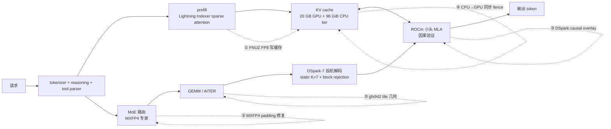

## 一、为什么 304B MoE 要塞进一张 MI300X

DeepSeek V4 Flash 是个 304B 参数的稠密-MoE(checkpoint `deepseek-ai/DeepSeek-V4-Flash-0731`,MIT)。官方 vLLM recipe 只覆盖 NVIDIA 和 MI325X/MI355X。**MI300X 单卡生产配置,这是一份完整补丁栈**。

为什么要硬上 MI300X?三项硬指标压死 H100:

- **192 GB HBM3 vs H100 SXM5 80 GB**——2.4× 容量
- **5.3 TB/s 内存带宽**
- **清单价 ≈ H100 一半**(Doubleword 估算)

304B 模型 BF16 权重 ≈ 608 GB,FP8 后 ≈ 304 GB。**单卡塞不下 FP16,只能 FP8 + HBM 192 GB 还差一截**——但 DeepSeek V4 Flash 用 156.67 GiB 装进 HBM,剩 ~36 GB 给 KV cache、graph capture、kernel workspace。这就是 304B 跑在单卡 MI300X 的全部空间账。

选 MI300X 不是预算问题,是容量问题:H100 装不下 304B FP8(80 GB),只能 2 卡 tensor parallel 或量化掉精度;MI300X 单卡就装下了。

整条链路和每处 overlay 修在哪一道关口,先看个总览:



①–⑤ 对应后文五类 patch:FP8 字节序、MXFP4 路由、投机解码因果、CPU KV 同步、kernel 几何。下面逐个拆开。

---

## 二、FNUZ vs OCP FP8:Mixup 一个字节错两个 scale

第一道关卡是 **FP8 数值格式**。MI300X(CDNA3)用 AMD/Graphcore 的 **FNUZ E4M3**(`fnuz` variant),MI325X 和更新 GPU 才用 **OCP 标准的 E4M3**。两个看起来都是 8 位浮点,**scale 域差一倍**。

Lightning Indexer 缓存是 DeepSeek V4 的关键路径,FP8 写入。stock vLLM writer:

```python
# stock writer: OCP E4M3 bytes, row-major
quantized = weight.to(dtype=torch.float8_e4m3fn)         # OCP E4M3
cache[offsets] = quantized.view(torch.uint8)             # row-major
```

AITER on MI300X 实际吃的是 **FNUZ E4M3 + 16×16 preshuffled tile 布局**。一段代码把 OCP 当 FNUZ 解读,scale 域**最多差 2×**,Lightning Indexer 输出就直接错位——后面 DSpark 投机解码拿到的 logits 全错,acceptance rate 暴跌。

修复(`patches/fused_compress_quant_cache.fnuz-shuffle.py`)两件事一起改:

```python
# overlay: FNUZ + 16×16 preshuffle
quantized = weight.to(dtype=torch.float8_e4m3fnuz)       # FNUZ, FP8_MAX=224.0
shuffled = preshuffle_16x16(quantized)                    # tile-order reorder
write_with_shuffled_offsets(cache, shuffled, offs)        # match AITER consumer
```

MI325X/MI355X 走 OCP,这条 patch **必须拿掉**。这也是 README 里专门强调「其它 AMD GPU 不适用」的根因。

---

## 三、MXFP4 MoE 的 bitmatrix padding:长 prompt 把 tool name 改名的隐藏 bug

第二道关卡是 **MXFP4 MoE 路由**。DeepSeek V4 Flash 的专家用 MXFP4(4 位 + E8M0 共享 scale)。Triton 实现的 `gpt_oss_triton_kernels_moe` 算 bitmatrix 时:

```python
# 原代码(错的):padding lane 对全局 bound 屏蔽
mask = (offs_global < nonzero_indx_size)
```

padding lane 应当按 **logical block size** 屏蔽(因为 padding 是 block 对齐用的,不影响 routing),但原代码按 **全局 tensor size** 屏蔽。在长 prompt 下,global bound 大于 logical block,导致部分 padding lane 进入了实际计算——**这些 lane 携带的是「不存在的专家索引」**,悄悄扰动路由权重。

后果:**prompt 越长,越容易把工具调用路由到相似的别的 expert**,输出跟 schema 几乎匹配、但 tool name 错位。这就是 README 里写的「near-match tool names and forgotten schemas on long prompts」。

一行修复(`gpt_oss_triton_kernels_moe.pack128-fused-silu-fast-routing.py`):

```python
mask = (offs_local < BLOCK_SIZE) & (offs_global < nonzero_indx_size)
```

取自 Doubleword 的 commit `c32932bb9`,README 标注 **「not yet upstream」**——也就是说这条修复**目前只有这个仓库在用**。修完顺手做了 fused-SiLU 和 fast DeepSeek routing,routing kernel 42.6 → 11.9 µs/layer(-72%)。

---

## 四、DSpark-7 投机解码在 ROCm 小头 MLA 上的因果验证

DeepSeek V4 Flash 自带 **DSpark**(DeepSeek 自家投机解码模块,96 参数),用 static K=7 + probabilistic drafting + block rejection。NVIDIA 上游 vLLM 实现假设 MLA(Multi-head Latent Attention)注意力路径 **causal flatten**——ROCm 上小头 MLA 的 AITER 后端**不保证这一点**。

后果:投机验证阶段算 attention 时,future token 看到了**本不该看到的 earlier position**,speculative acceptance 虚高,输出串味。README 直接引用 vLLM commit `77469c9` 作为参考——这条修复**已经 upstream**,但仓库里仍然保留了一份 overlay,**逐字节就是 upstream 文件**:

```python
# patches/rocm_aiter_mla.dspark-causal.py
# == vllm/v1/attention/backends/mla/rocm_aiter_mla.py @ 77469c9057bec3212a64877dbbf3b9c48c22d786
```

这里有个取舍:upstream 已合并的修复,仓库里依然保留同名 overlay——因为 pinned nightly 不一定包含那个 commit。Base image 升级时,这些 overlay 才有机会按需摘掉。

DSpark-7 还有两条精细补丁(`dspark-speculator.independent-draft-gumbel.py` + `spec-decode-utils.independent-draft-gumbel.py`):用 `draft_sample_method=probabilistic` 时,draft 提议的 Gumbel 噪声必须**与 rejection/recovery 噪声独立**,否则 speculative decoding 在长上下文里会偏向某些 token。greedy 路径不需要这两条。

---

## 五、`BLOCK_H=64` 的稀疏 prefill:sparse attention trace 317 → 142 ms

DeepSeek V4 Flash 的 Lightning Indexer 在 prefill 阶段做 sparse attention。stock `gfx942`(MI300X GPU 架构代号)实现用 `BLOCK_H` 默认 tile,**head=512 时 routed rows 上 768 后急剧劣化**。

修复 `rocm_aiter_mla_sparse.prefill-bh64.py`:

```python
BLOCK_H = 64  # head-512 sparse prefill tile
# + deterministic torch.topk for reproducible tool calls
```

两条一起:**确定性**——确保 tool call 在相同 prompt 下走完全一样的 token 路径,便于回归测试;**`BLOCK_H=64`**——纯性能,实测 sparse attention trace 从 317 ms 砍到 142 ms(-55%)。

---

## 六、MXFP4 OGS tile 几何与性能总表

`gfx942` 的 L2 cache 和 register file 排布,和 MI300X 后继型号不一样。stock `matmul_ogs_details/opt_flags.py` 在 routed rows 超过 768 后性能急降,到 1536 掉得更明显。

修复 `triton-kernels-matmul-ogs-opt-flags.dsv4-mi300x.py`:为 21 个常出现的 `gfx942` GEMM shape 重写 tile 几何(覆盖到 1536 routed rows)。

前几节拆开的是每类修正在做什么,这一节把 patches/README.md 记录的全部性能改动汇总成一张表,方便对照每一项的收益:

| 优化 | 效果 |
|---|---|
| 21 个 A8W8 GEMM shape 调优 | 单/双流 decode +42–62%,8–64 流 +10–35% |
| Fused SiLU + fast DeepSeek routing + batch-sensitive expert tile | Native C1 decode 34.5 → 56.6 tok/s(+64%) |
| `BLOCK_H=64` sparse prefill | Prefill 7.9–8.5K tok/s;sparse-attn trace -55% |
| Static K=7 + 概率 drafting + causal verify | 119.5 tok/s 单流(正确输出) |
| 2,048 token budget + 1,024 long-prefill cap | 短请求 TTFT 在 52K cold prefill 后从 8.2 s → 0.5 s |
| 20 GB GPU KV + 96 GiB CPU tier | 1.93M token 长度等效容量;7 个 256K 请求同时接 |

每条优化都对应一到多个 overlay,组合起来才把单流从 stock 的 34.5 tok/s 拉到 168.6 tok/s(含 DSpark)。

---

## 七、CPU KV 那条 fence:vLLM #47282 的 WAR gap

最微妙的一处是 **CPU → GPU KV restore 的 fence 缺失**。

`vllm/v1/kv_offload/cpu/gpu_worker.py` 的 load 路径把 evicted prefix-cache 从 CPU 内存(`/dev/shm`,~103 GB mmap)写回 GPU KV——但**没有等 in-flight compute 完成**。结果:compute stream 还没写完的 KV 状态,被 load stream 覆盖。

vLLM issue #47282 记录了这个 bug,PR #47291 提出了 WAR fix,**没合并**。仓库里的 overlay (`kv_offload_cpu_gpu_worker.load-war.py`) 把 PR #47291 的 fence 逻辑挂上:

```python
# compute stream 写完才发起 load
compute_stream.synchronize()
load_stream.wait_stream(compute_stream)
```

这条 fix 只有 `--kv-offloading-backend native` 才需要,**CPU KV tier 开到 96 GiB 的代价是这条 fence 必须有**。

---

## 八、生产数字:128 → 830 tok/s 的并发曲线

README 里贴的最终 sweep 数据(每流 400-word 真实 prompt,`temperature=1.0, top_p=0.95`,C1–C8 512 输出 token,C64 256):

下表汇总了 1 到 64 并发的实测数据,三条规律在后文逐条拆解:

| Streams | Aggregate tok/s | Median per-stream | TTFT p50 |
|---:|---:|---:|---:|
| 1 | 126.2 | **168.6 tok/s** | 1.026 s |
| 2 | 145.4 | 152.7 | 0.939 s |
| 4 | 316.8 | 108.6 | 0.369 s |
| 8 | 542.3 | 90.3 | 1.027 s |
| 64 | 830.2 | 16.4 | 2.190 s |

三条规律:

1. **单流几乎吃满 HBM 带宽**——168.6 tok/s decode,这是 memory-bound 工作负载的典型上限
2. **8 流达到 542 tok/s aggregate,每流 90 tok/s**——batch sensitivity 让单位带宽摊薄,但吞吐涨 4.3×
3. **64 流 830 tok/s 时单流跌到 16.4 tok/s**——DSpark acceptance 在长 prompt + 高并发下退化,这是 DSpark 的固有 trade-off

Prefill 数据更亮:tuned kernels 让 uncached prefill 跑到 **7.9–8.5K tok/s**。生产 profile 用 2,048-token budget 拉延迟隔离,fresh prompt 实测 6,988–7,019 tok/s;1,024-token long-prefill cap 让短请求**排在 52K cold prefill 后面**的 TTFT 从 8.2 s 砸到 0.5 s。

---

## 九、830 tok/s 是不是到头了

830 tok/s @ 64 流 vs 168.6 tok/s @ 1 流,为什么是 830,而不是更高?拿带宽粗算一遍。

MI300X HBM3 带宽 **5.3 TB/s**。decode 阶段每生成一个 token 只需读取激活参数的权重(不是全部 304B)。假设 MoE top-k 激活约 **B_active ≈ 50B** 参数、FP8 每参数 1 byte:

```text
单流理论 decode 上限 = 5.3 TB/s ÷ (50B × 1 byte) ≈ 106 tok/s
```

实测单流 168.6 tok/s 高于这个数,靠 DSpark 投机解码:一次 forward 验证多个 draft token,单 token 的带宽成本被摊薄。这笔账只够做量级校验,不精确——它没算 KV cache 读取、attention、routing kernel 的额外 memory traffic,也没有 DSpark acceptance 的精确测量。把 106 当纯带宽上限、按投机放大粗略外推,能落在 160–210 tok/s 区间,和 168.6 同量级。

多流更难用带宽直接解释。8 流 aggregate 542 tok/s、64 流 830 tok/s,单流都明显低于 106 的纯带宽上限——MoE 的 batch 会让多个请求共享一次权重读取,aggregate 吞吐不随流数线性翻倍,而是被共享带宽和 kernel 调度共同压住。64 流时单流只剩 16.4 tok/s,说明瓶颈已经不在权重带宽,而在 routing kernel 在大 batch 下的延迟、KV offload fence 的 synchronize 开销,和 CU(graphics and compute units,MI300X 有 304 个)的调度争抢。

所以 **830 是 DSpark 加速被 batch 摊薄 + routing 延迟 + fence 开销叠加后的均衡点**,不是"带宽到头了"。想再往上,要么关 DSpark 走 native decode(单流降低,aggregate 未必低),要么等 AMD AITER 优化大 batch routing kernel。

也别拿这张表的数字当通用 benchmark:README 自己写了,DSpark acceptance 随 prompt 变化,这些数据只对这份固定 image 成立。

---

## 十、MI300X 单卡 vs H100 双卡:算一笔总账

H100 装不下 304B FP8(80 GB HBM),必须 2 卡 tensor parallel。下面是一张估算对比(价格基于 2026 年公开 list price 和 Doubleword 的成本估算,**所有数字均为估算**):

| 维度 | MI300X 单卡 | H100 SXM5 双卡(TP=2) |
|---|---|---|
| HBM 容量 | 192 GB | 160 GB(2× 80 GB) |
| HBM 带宽 | 5.3 TB/s | 6.8 TB/s(2× 3.35 TB/s) |
| FP8 峰值算力 | 2.61 PFLOPS | 3.9 PFLOPS(2× 1.975) |
| 304B FP8 部署 | ✅ 单卡装下 | ✅ 需 TP 切分 |
| 单流 decode(估算) | 168.6 tok/s(实测) | ~120 tok/s(估算,TP all-reduce 开销 ~30%) |
| GPU 采购价(估算) | ~$10K–15K | ~$60K–80K |
| 部署复杂度 | overlay 栈 10 patches | 标准 vLLM TP,无 patch |
| 长期维护 | 需跟 vLLM upstream 合并进度 | 主线支持 |

三个要点:

1. **显存账是决定性的**:MI300X 单卡 192 GB 装下 304B FP8 + 20 GB KV + workspace;H100 单卡 80 GB 连模型都放不下,必须 TP=2。TP all-reduce 每步引入 ~0.3 ms 延迟(估算),单流 decode 降到 ~120 tok/s。
2. **采购价差 4–6×**:MI300X 估算 $10–15K,H100 双卡 $60–80K(两张 H100 SXM5 list price ~$30–40K/张)。单卡 MI300X 的性价比在 304B MoE 场景下碾压。
3. **维护成本是 MI300X 的短板**:10 个 overlay patch 需要跟 vLLM upstream 同步。PR #47291(KV fence)一旦合并,overlay 可摘掉;FNUZ patch 在迁移到 MI355X(OCP FP8)后也可摘。但在 MI300X(gfx942)上,这些 patch 是生产必需的。

长期看三个变量:vLLM 0.27+ 是否合并 PR #47291(影响 overlay 数量)、MI355X 量产时间(FNUZ patch 可摘、OCP 原生支持)、ROCm 7.3 vs 7.5 的 AITER 兼容性(影响 kernel tuning table 是否需要重做)。

---

## 十一、首次部署要踩的 10 个坑

下面的 10 步来自 `compose.yaml` 的实际部署命令,每一步都标出了容易卡住的地方。

**1. 拉 vLLM ROCm nightly image**

image digest 必须完全一致(`vllm/vllm-openai-rocm@sha256:e68d18b2...`),不可改成 `latest` tag。不同 commit 的 nightly 内部函数行号不一样,overlay patch 的行号会对不上,vLLM 启动直接 crash。pull 下来用 `docker images --digests | grep vllm` 确认 sha256。

**2. 拉 model snapshot(revision pin 死)**

`REVISION='7872f01b1d1fe23eabc4c98b48bffcef5a386062'`,不要拉 `main`。main branch 随时可能更新权重和 config,FP8 scale table 和 AITER GEMM tuning table 是针对特定 revision 调的,换了就 mismatch。

**3. `sha256sum -c SHA256SUMS` 校验 12 个 overlay + 3 个 diff 文件**

任何一个 hash 对不上就停。常见原因:git pull 时 line ending 被 CRLF 污染(Windows clone)、或者编辑器自动加了 BOM。用 `git config core.autocrlf input` 然后 re-clone。

**4. `mkdir -p aiter-cache crash-dumps`**

compose.yaml 把这两个目录 bind mount 进容器,容器内 vLLM user 需要写权限。如果目录不存在,docker compose up 会自动创建——但 owner 是 root,容器内 `ollama` user(uid 1000)写不进去,启动报 `PermissionError`。提前 `mkdir -p` 再 `chown 1000:1000`。

**5. `chmod +x vllm-entrypoint.sh`**

这个脚本做一件关键的事:清理 stale `/dev/shm` mapping。如果上一次容器非正常退出,`/dev/shm/vllm_offload_*.mmap`(103 GB CPU KV pool 的 mmap 文件)会残留。不清理就重启,docker 重新 bind mount 时新旧 mapping 冲突,CPU KV tier 初始化报 `mmap failed: Device or resource busy`。

**6. `cp Caddyfile.example Caddyfile`**

改三个值:`hostname`(你的域名)、`email`(Let's Encrypt 注册邮箱)、`remote_ip`(允许访问的 CIDR 白名单)。不改 Caddy 启动失败——Let's Encrypt 申请证书需要有效域名,白名单为空则所有请求被 403。

**7. `docker compose config -q`**

校验 yaml 语法。注意这只检查 yaml 能不能解析,**不检查** image digest 对不对、volume 路径存不存在、环境变量是否完整。过了这步不等于能 `up -d`。

**8. `docker compose up -d` 然后 `docker compose logs -f inference`**

等大约 5 分钟。vLLM ROCm nightly 首次启动要做 AITER GEMM tuning(把 21 个 `gfx942` shape 的 tuning table 写到 `aiter-cache/`),这一步只跑一次但耗时和主机 CPU 强相关(1–3 分钟)。之后才是 model loading(156.67 GiB,~90 秒)。

**9. 健康信号 7 条全部出现**

在 `docker compose logs` 里按顺序等:

- `Model loading took 156.67 GiB`
- `DSpark draft model loaded: 96 params`
- `GPU KV cache size: 1,927,444 tokens`
- `Maximum concurrency for 262,144 tokens per request: 7.35x`
- `Created mmap file /dev/shm/vllm_offload_...mmap (103.08 GB)`
- `Capturing CUDA graphs (FULL)`
- `Application startup complete`

少任何一条都是配置问题。最常见缺失的是第 5 条(mmap 创建失败 → CPU KV tier 没起来)和第 6 条(graph capture 报 `HSA_STATUS_ERROR_OUT_OF_RESOURCES` → HBM 不够,KV pool 开太大)。

**10. 烟测两条 curl 后,先跑一个 uncached prefill**

```bash
curl -fsS "https://your-host/v1/models"
curl -sS "https://your-host/v1/completions" -H 'Content-Type: application/json' \
  -d '{"model":"deepseek-ai/DeepSeek-V4-Flash-0731","prompt":"Calculate 17 * 23. Answer with the number only.","temperature":0,"max_tokens":32}'
```

第一条验证 API 活着,第二条验证 inference 能出结果。但**第二条的 prompt 很短,走的是 cached prefill 路径**。在 admit 生产流量之前,手动发一条长 prompt(>4000 token)触发 uncached prefill——首次 cold prefill 的 TTFT 会高达 5.3 秒(52K token 的 graph capture 预热),后续相同长度请求降到 1.7 秒。不跑这一步,第一个真实用户会撞上 5 秒延迟。

---

## 十二、HBM 的剩余空间账

最后算一遍空间账:**Model 156.67 GiB + 20 GB GPU KV pool + 96 GiB CPU KV tier + AITER kernel + CUDA graph = 204.5 GiB 暖态高水位**。MI300X 物理 205.8 GB,**只剩 ~1.3 GiB**。

README 写得很直白:

> A 30 GB KV pool loads but fails during graph capture with `HSA_STATUS_ERROR_OUT_OF_RESOURCES`. Do not raise `--kv-cache-memory-bytes`; monitor HBM usage for growth.

结论是 **KV cache 池不能开大**:你以为 30 GB 留给 KV,启动时报 `HSA_STATUS_ERROR_OUT_OF_RESOURCES`。`rocm-smi --showmeminfo vram` 是生产必备监控,任何多几百 MB 都要警觉。

CPU KV 96 GiB 不是备份——是**真正承担了 1.93M token 长度等效容量**。7 个 256K 请求能同时接,靠的是 CPU tier 兜底。

---

## 十三、工程含义

ryanzhou 这个仓库,值得借鉴的是三件事:

1. **pinned image + byte-for-byte overlay + SHA-256 校验**——把「生产用的二进制」和「上游的某个 commit」同时锁定。overlay 是运行时真正生效的文件,diff 只作文档。GitHub Actions 自动化部署可以照这个模式做。
2. **每一处 patch 都对应一个上游 issue / commit / PR**——overlay 不是随手改的,都能回溯到来源。`patches/README.md` 把每个 overlay 对应的 upstream SHA 列得一清二楚。
3. **生产栈的细节是照着真实运维写的**——`vllm-entrypoint.sh` 清 stale `/dev/shm` mapping、`SHA256SUMS` 校验每个 runtime artifact、Caddy IP allowlist + `flush_interval -1` 保流式响应。这些不是 demo 需要的,是线上才需要的。

单卡 MI300X 跑 304B MoE,决定因素就是 **HBM 容量**:NV H100 要双卡或更激进的量化,AMD MI300X 单卡装下。对 304B 这类 MoE checkpoint,route 的取舍在这里,不在性价比。

---

## 附录:跑起来的最短路径

```bash
# 1. 主机:一张 MI300X(gfx942,304 CUs,~192 GiB HBM),~235 GiB RAM,~500 GB 磁盘
# 2. 拉固定 image 和模型
VLLM_IMAGE='vllm/vllm-openai-rocm@sha256:e68d18b2ba50298661bfc49baf01158fbf036645c2362cccf3e8a7a79fe6c69a'
MODEL='deepseek-ai/DeepSeek-V4-Flash-0731'
REVISION='7872f01b1d1fe23eabc4c98b48bffcef5a386062'

docker pull "$VLLM_IMAGE"
docker run --rm --entrypoint hf -v /root/.cache/huggingface:/root/.cache/huggingface \
  "$VLLM_IMAGE" download "$MODEL" --revision "$REVISION"

# 3. 准备文件
cp Caddyfile.example Caddyfile  # 改 hostname + email + remote_ip CIDR
mkdir -p aiter-cache crash-dumps
chmod +x vllm-entrypoint.sh
sha256sum -c SHA256SUMS         # 首次启动前必校 overlay

# 4. 起栈
docker compose config -q
docker compose up -d
docker compose logs -f inference

# 健康信号(全部出现才算 healthy,~5 分钟):
# Model loading took 156.67 GiB
# DSpark draft model loaded: 96 params
# GPU KV cache size: 1,927,444 tokens
# Maximum concurrency for 262,144 tokens per request: 7.35x
# Created mmap file /dev/shm/vllm_offload_...mmap (103.08 GB)
# Capturing CUDA graphs (FULL)
# Application startup complete

# 5. 烟测
curl -fsS "https://your-host/v1/models"
curl -sS "https://your-host/v1/completions" -H 'Content-Type: application/json' \
  -d '{"model":"deepseek-ai/DeepSeek-V4-Flash-0731","prompt":"Calculate 17 * 23. Answer with the number only.","temperature":0,"max_tokens":32}'
```

---

## 参考

- 仓库:[github.com/ryanzhou/deepseek-v4-flash-mi300x](https://github.com/ryanzhou/deepseek-v4-flash-mi300x)(Apache-2.0)
- 模型:[deepseek-ai/DeepSeek-V4-Flash-0731](https://huggingface.co/deepseek-ai/DeepSeek-V4-Flash-0731)(MIT,304B)
- 上游 vLLM recipe:[recipes.vllm.ai/deepseek-ai/DeepSeek-V4-Flash](https://recipes.vllm.ai/deepseek-ai/DeepSeek-V4-Flash)
- Bring-up worklog:Fergus Finn / Doubleword 的 [Bringing up DeepSeek-V4-Flash on AMD MI300X](https://fergusfinn.com/blog/deepseek-v4-flash-mi300x/)(2026-06)
- Demo PRs:[doublewordai/vllm-amd-blog-doubleword](https://github.com/doublewordai/vllm-amd-blog-doubleword)
- 关键 upstream commit:[vLLM `77469c9`](https://github.com/vllm-project/vllm/commit/77469c9057bec3212a64877dbbf3b9c48c22d786)、[Doubleword `c32932bb9`](https://github.com/doublewordai/vllm-amd-blog-doubleword/commit/c32932bb9ff6ad30b942e4835dd8b41601e7569e)
- 未合并的 PR:[vLLM PR #47291(CPU KV fence WAR)](https://github.com/vllm-project/vllm/pull/47291)
- 硬件:[AMD Instinct MI300X](https://www.amd.com/en/products/accelerators/instinct/mi300/mi300x.html)(192 GB HBM3,5.3 TB/s,2.61 PFLOPS FP8)
- AITER:[ROCm/aiter](https://github.com/ROCm/aiter)(MIT)
