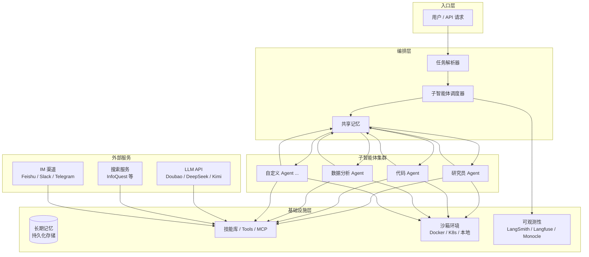

## 学习目标

读完本文应能：

1. 解释 DeerFlow 2.0 的核心定位与 1.x 版本的本质差异
2. 理解 DeerFlow 的架构设计，包括子智能体、技能库、沙箱环境和长期记忆四大组件
3. 在本地开发环境或 Docker 环境完成一次完整部署，包括配置引导、服务启动与连通性检查
4. 使用 DeerFlow 完成一个端到端的技术调研报告生成任务
5. 识别 DeerFlow 的适用边界——它不适合哪些生产场景，以及遇到这些场景时的替代方案

---

## 目录

- [学习目标](#学习目标)
- [架构总览](#架构总览)
- [组件拆解](#组件拆解)
  - [子智能体（Sub-Agents）](#子智能体sub-agents)
  - [技能库与工具链](#技能库与工具链)
  - [Claude Code 集成](#claude-code-集成)
  - [沙箱环境](#沙箱环境)
  - [长期记忆](#长期记忆)
- [实战案例](#实战案例)
  - [案例一：端到端技术调研报告](#案例一端到端技术调研报告)
  - [案例二：自动化代码审查流水线](#案例二自动化代码审查流水线)
  - [案例三：多源新闻摘要](#案例三多源新闻摘要)
- [部署](#部署)
  - [环境要求](#环境要求)
  - [Docker 部署（推荐）](#docker-部署推荐)
  - [本地开发](#本地开发)
  - [一键引导（适用于 AI 编程助手）](#一键引导适用于-ai-编程助手)
- [DeerFlow 1.x vs 2.0](#deerflow-1x-vs-20)
- [推荐模型](#推荐模型)
- [FAQ](#faq)
- [部署后检查项](#部署后检查项)
- [安全提示](#安全提示)
- [官方资源](#官方资源)
- [自测题](#自测题)
- [练习](#练习)
- [进阶路径](#进阶路径)

---

DeerFlow（**D**eep **E**xploration and **E**fficient **R**esearch **Flow**）是字节跳动开源的一个超级智能体框架，2026 年 2 月 28 日 2.0 版本发布后登顶 GitHub Trending 第一。2.0 版本为完全重写，与 1.x 无任何共享代码。仓库地址：[github.com/bytedance/deer-flow](https://github.com/bytedance/deer-flow)。

把它看成「AI 工头」比看成「AI 员工」更准确：它不亲自执行每个任务，而是把复杂问题拆解，分派给一群子智能体，用共享记忆协调它们，最后汇总结果。看一座智能体框架的成色，关键是三条线索——它怎么在子智能体之间切分边界、怎么跨子智能体传递状态、又在哪里切断外部代码带来的风险。下文对 DeerFlow 的拆解就沿着这三条线走。

## 架构总览

DeerFlow 2.0 采用前后端分离的单仓架构：后端是嵌入 LangGraph 运行时（language-graph 兼容的 API）的 FastAPI Gateway，前端是 Next.js 聊天界面，统一由 Nginx 反向代理对外提供服务。官方部署模型给出的服务拓扑如下：

| 服务 | 端口 | 角色 |
|------|------|------|
| Nginx | 2026 | 统一入口，浏览器访问地址 |
| Gateway API | 8001 | FastAPI REST API + 嵌入的 LangGraph 兼容 Agent 运行时 |
| Frontend | 3000 | Next.js Web 界面 |
| Provisioner | 8002 | 可选，仅沙箱配置为 Kubernetes 模式时启动 |

下图展示了组件关系和数据流向：


```mermaid
graph TB
    subgraph Input["入口层"]
        A[用户 / API 请求]
    end

    subgraph Orchestrator["编排层"]
        B[任务解析器]
        C[子智能体调度器]
        D[共享记忆]
    end

    subgraph Agents["子智能体集群"]
        E1[研究员 Agent]
        E2[代码 Agent]
        E3[数据分析 Agent]
        E4[自定义 Agent ...]
    end

    subgraph Infrastructure["基础设施层"]
        F[(长期记忆<br/>持久化存储)]
        G[技能库 / Tools / MCP]
        H[沙箱环境<br/>Docker / K8s / 本地]
        I[可观测性<br/>LangSmith / Langfuse / Monocle]
    end

    subgraph External["外部服务"]
        J[LLM API<br/>Doubao / DeepSeek / Kimi]
        K[搜索服务<br/>InfoQuest 等]
        L[IM 渠道<br/>Feishu / Slack / Telegram]
    end

    A --> B
    B --> C
    C --> D
    D --> E1 & E2 & E3 & E4
    E1 & E2 & E3 & E4 --> D
    E1 & E2 & E3 & E4 --> G
    E1 & E2 & E3 & E4 --> H
    C --> I
    J & K & L --> G
```

整个系统的设计约束是：**每个组件只做一件事，通过 Harness 层的调度器串联**。新增一个子智能体、技能或工具不需要改动已有代码，注册到配置中即可生效。

## 组件拆解

前面三条线索对应到具体组件：

- **任务边界怎么切** → 子智能体 + 技能库
- **状态怎么跨智能体传递** → 长期记忆
- **外部代码风险在哪切断** → 沙箱环境

DeerFlow 不算大，却常常被误解成「又一个多 Agent 框架」。把这三件事对上号，后面读配置和使用都顺。

### 子智能体（Sub-Agents）

子智能体是 DeerFlow 的执行单元。每个子智能体有独立的系统提示词、工具集和记忆视图。在执行过程中，调度器根据任务类型委派对应的子智能体，通过共享记忆传递上下文。

一个典型的研究任务可能涉及三个子智能体：

- **研究员 Agent**：调用 InfoQuest 等搜索服务收集资料，提取关键信息
- **分析师 Agent**：对收集到的信息进行交叉验证和结构化整理
- **写作者 Agent**：基于分析结果生成最终报告

子智能体间共享一份长期记忆，因此即使研究员和分析师是先后启动的不同子智能体，分析师也能直接读取研究员写入记忆的结果，不需要重复传递。

### 技能库与工具链

DeerFlow 2.0 的能力扩展核心从"工具列表"变成了 **Skills**——一个标准 Agent Skill 是一个结构化的能力模块：一份 `SKILL.md` 定义工作流、最佳实践，并引用支撑它的脚本和资源。官方在仓库的 `skills/public/` 目录内置了深度研究、GitHub 深度研究、数据分析、简报与报告生成、幻灯片制作、图像与视频生成等技能，也支持完全替换或组合成复合工作流。

两个设计点值得注意：

- **按需加载**：技能只在任务需要时渐进加载，不一次性塞进上下文，这让 DeerFlow 对上下文窗口敏感的模型也能跑得稳。
- **斜杠激活**：用户可以在单轮请求里用 `/skill-name` 显式激活某个已启用的技能，例如 `/data-analysis analyze uploads/foo.csv`。

工具层面同时支持：

| 能力 | 说明 |
|------|------|
| InfoQuest | BytePlus 自研的智能搜索与网页爬取工具集，支持免费在线体验；安装向导可选配 web 搜索工具 |
| MCP 协议工具 | 通过 MCP Server 接入任意第三方工具，支持 HTTP/SSE 与 OAuth 凭证流 |
| 文件系统与代码执行 | 沙箱感知的文件读写、Shell 与代码执行 |
| 研究类技能 | `deep-research` 等内置技能串联搜索、抓取与整理，构成完整调研链路 |

添加自定义能力时，优先考虑两条官方路径：写一个带 `SKILL.md` 的技能包放入 `skills/` 目录，或者通过 `extensions_config.json` 注册 MCP Server。模型配置则在 `config.yaml` 的 `models` 段里按 provider 逐条声明。

### Claude Code 集成

DeerFlow 支持让 Claude Code 作为子智能体在沙箱中自主编程。官方 README 的推荐用法之一是：把本地引导任务（clone 仓库、按 Install.md 初始化开发环境）直接交给 Claude Code、Codex、Cursor 或 Windsurf 等编程助手执行。

更完整的工作流是：

1. DeerFlow 将任务描述和代码库上下文传给 Claude Code Agent
2. Claude Code Agent 在沙箱中读取文件、编辑代码、运行测试
3. 完成后将结果（代码 diff、测试报告）写入共享记忆
4. 其他子智能体（如代码审查 Agent）读取结果进行下一步处理

这个能力让 DeerFlow 可以胜任「从需求分析到代码提交」的端到端开发流程，而不只是生成代码片段。

### 沙箱环境

每个子智能体的代码执行和数据操作都在沙箱中隔离。DeerFlow 支持三种沙箱执行方式：

- **本地执行**：直接在宿主机上运行，适合快速调试，但任意代码直接触碰宿主环境
- **Docker 执行**：在隔离的 Docker 容器中运行，生产推荐
- **Docker + Kubernetes 执行**：通过 provisioner 服务在 Kubernetes Pod 中运行，适合需要弹性扩缩的共享环境

Docker 开发模式下，服务启动行为会自动遵循 `config.yaml` 里配置的沙箱模式；本地 / Docker 模式不会启动 provisioner。

### 长期记忆

DeerFlow 的长期记忆把跨会话、跨子智能体的上下文持久化下来。每个子智能体可以在执行过程中写入记忆，后续的任何子智能体都能读取；同一个对话线程的多次执行共享上下文，不同项目互不干扰。对于长周期研究任务（如持续数天的行业跟踪），昨天的分析结果今天仍然可以直接被新一轮任务使用。

记忆与对话上下文工程配合工作：DeerFlow 会在长对话中自动压缩较早的消息摘要，防止 Agent 在数十轮对话后"忘记"最初目标——这是它跑得完超长任务的关键机制之一。

## 实战案例

以下案例用来展示 DeerFlow 能承载的任务形态。配置片段以官方 `config.yaml` 的结构为基准，字段以仓库里的 `config.example.yaml` 为准。

### 案例一：端到端技术调研报告

**场景**：某团队需要调研「WebAssembly 在浏览器之外的应用现状」，输出一份 Markdown 格式技术报告。

**配置**：通过安装向导选择研究型模型（如 DeepSeek v3.2）、启用 InfoQuest 搜索，再在 `config.yaml` 中按需调整模型与搜索 provider。

**执行过程**：

1. **研究员 Agent** 通过 InfoQuest 检索相关文章（包括 GitHub 仓库、技术博客、论文摘要），过滤出高质量来源，提取关键信息写入记忆
2. **分析师 Agent** 读取研究员的结果，使用 Python 执行环境统计 Wasm 运行时（WasmEdge、Wasmtime、WAMR）的社区活跃度数据，生成对比数据，写入记忆
3. **写作者 Agent** 读取前两个阶段的所有中间结果，生成一份结构化报告，包含引言、运行时对比、应用案例（边缘计算、插件系统、区块链智能合约）、趋势预测四个章节

**最终产出**：一份结构化的技术调研报告。成本取决于任务复杂度、模型选择和调用次数，可在工作台界面直接查看 token 用量统计（`token_usage` 默认开启）。

### 案例二：自动化代码审查流水线

**场景**：每次代码变更提交后，自动运行 DeerFlow 进行代码审查，检查安全漏洞和代码质量。

**配置**：在 `config.yaml` 中配置代码类模型（如 Doubao-Seed-2.0-Code），为审查任务挂载 GitHub 相关的 MCP 工具和文件读写、Shell 能力；通过定时任务（Scheduled Tasks）或外部 CI 调用 Gateway API 触发。

**审查关注点**（写在审查子智能体的系统提示词里）：

- SQL 注入、XSS、CSRF
- 硬编码的密钥和 Token
- 不安全的依赖版本
- 缺失的输入校验
- 高圈复杂度函数、超长文件、重复代码块

审查结果由汇总子智能体写入 PR 评论或指定文件。注意：依赖版本的安全公告（CVE）结论应以 NVD 或官方公告为准，不要让模型自行推断具体编号。

### 案例三：多源新闻摘要

**场景**：每天早上 8:00 自动抓取指定 RSS 源的最新内容，生成一份中文早报。

**配置**：DeerFlow 原生支持定时任务（Scheduled Tasks）。任务里配置收集子智能体（读取 RSS 源）和摘要子智能体（生成中文摘要），输出到指定路径。企业微信、钉钉、Telegram、飞书等 IM 渠道可以绑定到同一个 Gateway，摘要生成后直接推送到团队群聊。

## 部署

### 环境要求

| 组件 | 版本要求 |
|------|----------|
| Python | ≥ 3.12 |
| Node.js | ≥ 22 |
| Docker Compose | ≥ v2.24（Docker 部署时必需） |
| uv / pnpm | Python 与前端依赖管理 |

资源规划参考官方建议：本地体验至少 4 vCPU / 8 GB 内存，长期运行的生产服务建议 8 vCPU / 16 GB 起步；如果还要在本机部署本地大模型，需要单独为其预留资源。

### Docker 部署（推荐）

```bash
git clone https://github.com/bytedance/deer-flow.git
cd deer-flow

# 1. 运行安装向导：选择 LLM provider、搜索工具、沙箱模式等，生成 config.yaml 和 .env
make setup

# 2. 预拉取沙箱镜像（首次运行或镜像更新时）
make docker-init

# 3. 启动服务（自动按 config.yaml 判断沙箱模式）
make docker-start
```

浏览器访问 http://localhost:2026 即可打开工作台界面。

生产模式（本地构建镜像并挂载运行期配置与数据）使用 `make up`，停止并移除容器用 `make down`。

如果处于受限网络环境，构建前可先导出镜像源：

```bash
export UV_INDEX_URL=https://pypi.tuna.tsinghua.edu.cn/simple
export NPM_REGISTRY=https://registry.npmmirror.com
```

### 本地开发

```bash
cd deer-flow

# 1. 校验环境：Node.js 22+、pnpm、uv、nginx
make check

# 2. 安装 backend + frontend 依赖
make install

# 3. 可选：预拉取沙箱镜像
make setup-sandbox

# 4. 启动服务
make dev
```

同样访问 http://localhost:2026。`make doctor` 可随时检查配置与环境，并给出可执行的修复建议。

### 一键引导（适用于 AI 编程助手）

如果你使用 Claude Code、Codex、Cursor 或 Windsurf，直接把下面这句话发给助手即可完成本地引导：

> Help me clone DeerFlow if needed, then bootstrap it for local development by following https://raw.githubusercontent.com/bytedance/deer-flow/main/Install.md

这条提示词面向编程助手：需要时先 clone 仓库，优先选择 Docker，完成初始化后告诉你下一条启动命令，以及还缺哪些配置需要你补充。

## DeerFlow 1.x vs 2.0

| 维度 | 1.x | 2.0 |
|------|-----|-----|
| 代码关系 | 原始版本 | 完全重写，无共享代码（1.x 仍在 `main-1.x` 分支维护） |
| 定位 | Deep Research 框架 | Super Agent Harness |
| 架构 | 5 个固定角色组成流水线（Coordinator → Planner → Researcher/Coder → Reporter） | 模块化 Harness，角色可自由编排 |
| 技能 | 无 | Skills 机制，内置研究、报告、幻灯片、图像视频等技能 |
| 记忆系统 | 有限 | 长期持久化记忆 |
| 沙箱 | 无 | 本地 / Docker / Kubernetes 三种模式 |
| 部署 | 复杂 | `make setup` + Docker 一键启动 |

1.x 的问题在于角色固化：想加一个「设计师 Agent」得改图、加节点、调边——本质上是在改框架。2.0 把这一层抽象成可插拔的 Harness，社区在 1.x 上沉淀的深挖能力（数据分析流水线、PPT 批量生成、内容工厂、运维巡检）都能在 2.0 上以更灵活的方式重新搭建。

## 推荐模型

官方 README 明确推荐使用以下三个模型运行 DeerFlow：

- **Doubao-Seed-2.0-Code**（火山引擎）：代码生成和工具调用能力强，延迟低
- **DeepSeek v3.2**：性价比优，长文本理解和多轮推理表现好
- **Kimi 2.5**（Moonshot）：中文写作和结构化输出质量高

DeerFlow 支持在 `config.yaml` 中为不同子智能体配置不同模型（研究用性价比模型、写作用中文输出强的模型、代码用编程能力强的模型），Setup Wizard 也内置了 Z.AI GLM 等更多模型的配置模板。

这组推荐测的是**工具调用和多轮编排**这一路，不是模型在聊天、写作等通用任务上的强弱。DeerFlow 的瓶颈通常落在「子智能体能否按格式把参数塞进工具、长链路里意图会不会漂」，所以模型差异在这里比在单轮问答里更明显。它不能推出「某某模型在所有场景都更强」，也不能替代你在自己任务上跑一次小样本对比——尤其是公司内网或私有 API 这类来源差异很大的场景。

## FAQ

### 1. DeerFlow 和 LangChain / CrewAI 有什么区别？

LangChain / LangGraph 是通用的 LLM 应用框架，提供工具链、图编排和链式调用基础设施。CrewAI 专注于多 Agent 角色扮演。DeerFlow 在 LangGraph / LangChain 之上构建了完整的子智能体调度、沙箱隔离、长期记忆和 Skills 体系——LangChain / LangGraph 是地基，DeerFlow 是在地基上建好的、可入住的房子。

### 2. 没有 Docker 能用吗？

可以。`config.yaml` 里把沙箱模式配置为本地执行即可，安装向导会引导你选择。但生产环境建议启用 Docker 沙箱，否则子智能体执行的任意代码会直接在你的宿主机上运行。

### 3. 子智能体之间如何通信？会不会出现消息丢失或重复？

子智能体通过「委派 + 共享记忆」两层机制协作。调度器负责任务委派，共享记忆负责持久化上下文。如果一个子智能体的中间结果丢失，后续子智能体可以从共享记忆中读取最新状态作为兜底。

### 4. 一次任务的成本大概是多少？

取决于任务复杂度、使用的模型和子智能体数量。DeerFlow 默认开启 token 用量统计，工作台界面可直接看到每次运行的输入/输出 token 数；`config.yaml` 里还可以启用 token budget 预算，在超限时先警告、再强制收尾，防止跑飞。

### 5. 可以只用一部分功能吗？比如只用子智能体编排，不用沙箱？

可以。DeerFlow 的组件是松耦合的。不配置沙箱（本地模式）就能跳过容器隔离，不配置可观测性后端也不会影响主要功能，模型、技能、IM 渠道都能按需启用。

### 6. 子智能体可以调用不同的 LLM 模型吗？

可以，且这是推荐做法。研究员用 DeepSeek（性价比高，适合大量检索调用），写作者用 Kimi（中文输出质量好），代码 Agent 用 Doubao-Seed-Code（编程能力强）。每个模型在 `config.yaml` 的 `models` 段独立声明，子智能体按需选择。

### 7. 长期记忆存在哪里？数据安全吗？

长期记忆由运行期状态目录（默认项目根下的 `.deer-flow`，可用 `DEER_FLOW_HOME` 覆盖）持久化，数据完全由你掌控。处理敏感数据时，注意沙箱与凭据管理：API Key 走环境变量或 `.env`，不要写入提交到 Git 的配置；具体后端与加密选项以官方配置文档为准。

## 部署后检查项

部署完成不等于配置正确。下面六项检查覆盖从服务健康、环境校验到任务执行的完整链路，逐条跑一遍再验收。

### 检查项 1：服务健康状态

```bash
make doctor
```

预期输出环境校验结果与配置检查结论，若发现问题会给出可执行的修复建议。

### 检查项 2：Web 界面可访问

浏览器打开 http://localhost:2026，预期看到 DeerFlow 工作台界面。若打不开，先确认 Docker 容器都在运行（`docker compose ps`），再看 nginx 是否正常监听 2026 端口。

### 检查项 3：LLM 连接测试

在工作台新建一个会话，输入一句简单的指令（如「回复 pong」）。预期模型正常回复；若报错，检查 `config.yaml` 里的模型配置和 `.env` 中的 API Key 是否正确。

### 检查项 4：运行最小测试任务

在会话中下达一个可验证的任务，例如「计算 123 × 456 的结果，并用一句话描述计算过程」。预期输出 `56088` 和对计算过程的简要描述。这一步同时验证了工具调用链路。

### 检查项 5：可观测性连通性

如果你配置了 Langfuse 或 LangSmith，打开对应平台确认是否出现 DeerFlow 的 Trace 记录。如果 30 秒内没有出现，检查 `.env` 中对应的 `LANGFUSE_TRACING` / `LANGSMITH_TRACING` 开关与 Key 是否正确。DeerFlow 也支持 Monocle（基于 OpenTelemetry），启用后每个 run 会写入一份 trace 文件到 `.monocle/` 目录。

### 检查项 6：记忆持久化验证

在会话中让模型写入一段信息（例如「记住：本周会议改为周三下午」），另开一个会话询问相同内容。若新会话能正确复述，说明记忆持久化链路正常。

## 安全提示

- **生产环境必须使用容器沙箱**。本地模式下子智能体执行的代码直接在宿主机上运行
- **API Key 不要明文写入提交到 Git 的文件**。使用 `.env`（已在 .gitignore 中）或环境变量注入；MCP 的每请求凭证只通过 `config.context.secrets` 传递，不要放进运行元数据
- **限制沙箱网络访问**。为沙箱容器配置最小网络权限，只放行必要的出口
- **设置资源与预算上限**。`token_budget` 硬上限 + 沙箱超时，防止子智能体陷入循环消耗大量 Token
- **定期清理记忆数据**。长期记忆和 `.monocle/` trace 文件会持续增长，按需设置过期策略或手动清理
- **公网部署前先读安全说明**。官方 README 的 Security Notice 章节专门讲错误部署带来的风险，部署到公网前必须对照检查

## 官方资源

- **官网**：https://deerflow.tech（含真实演示案例）
- **GitHub**：https://github.com/bytedance/deer-flow
- **中文 README**：https://github.com/bytedance/deer-flow/blob/main/README_zh.md
- **安装文档**：https://raw.githubusercontent.com/bytedance/deer-flow/main/Install.md
- **InfoQuest 文档**：https://docs.byteplus.com（搜索 InfoQuest）
- **姐妹项目 LLM Space**：https://github.com/deer-flow/llm-space（桌面调试工具，可回放失败用例与基准测试）

---

## 自测题

### 题 1：DeerFlow 2.0 的核心定位

DeerFlow 2.0 与 1.x 版本的本质差异是什么？它解决了什么核心问题？

<details>
<summary>参考答案</summary>

DeerFlow 2.0 是完全重写的版本，与 1.x 无任何共享代码。它的核心定位是"AI 工头"而不是"AI 员工"——不亲自执行每个任务，而是把复杂问题拆解后分派给一群子智能体，协调它们通过共享记忆协作，最后汇总结果。

它解决的核心问题是：传统 AI 助手在处理复杂任务时，要么一次性生成不完整的结果，要么在长对话中丢失上下文。DeerFlow 通过子智能体编排、长期记忆、上下文压缩和沙箱隔离，让 AI 能够完成需要多步协作、长时间运行的复杂任务。
</details>

### 题 2：架构组件理解

DeerFlow 的四大组件（子智能体、技能库、沙箱环境、长期记忆）各自解决了什么工程问题？

<details>
<summary>参考答案</summary>

1. **子智能体**：解决任务拆解和并行执行问题。每个子智能体有独立的系统提示词、工具集和记忆视图，可以专注于特定类型的任务。
2. **技能库与工具链**：解决能力扩展问题。Skills 按需加载、MCP 接入任意工具，让 DeerFlow 能够调用各种外部 API 和工具，且不撑爆上下文。
3. **沙箱环境**：解决安全性问题。每个子智能体的代码执行和数据操作都在沙箱中隔离，防止恶意代码或错误操作影响宿主机。
4. **长期记忆**：解决上下文丢失问题。子智能体可以把中间结果写入记忆，后续的任何子智能体都能读取，配合上下文压缩实现跨会话的知识传递。
</details>

### 题 3：部署流程

从克隆代码到接收第一个任务结果，中间有哪些关键步骤？哪一步最经常出错？

<details>
<summary>参考答案</summary>

关键步骤：
1. 克隆代码：`git clone https://github.com/bytedance/deer-flow.git`
2. 运行安装向导：`make setup`，选择 LLM provider、搜索工具和沙箱模式，生成 `config.yaml` 与 `.env`
3. 启动服务：Docker 用 `make docker-init` + `make docker-start`，本地开发用 `make dev`
4. 访问工作台：http://localhost:2026
5. 创建任务：在工作台发起第一个会话
6. 查看结果：等待子智能体执行完成，查看最终结果

最常出错的步骤是模型配置：API Key 无效、模型名写错或模型不支持工具调用，都会让子智能体无法正常工作。出错先跑 `make doctor`。
</details>

### 题 4：适用边界

什么场景下不应该用 DeerFlow？列出至少三个具体场景。

<details>
<summary>参考答案</summary>

1. **简单的单次任务**：如果任务只需要一次 LLM 调用就能完成，使用 DeerFlow 反而会增加复杂度和成本。
2. **实时性要求高的场景**：DeerFlow 的任务执行可能需要较长时间（几分钟到几小时），不适合需要即时响应的场景。
3. **预算有限的个人项目**：DeerFlow 的任务执行可能涉及多次 LLM API 调用，成本可能较高，不适合预算有限的个人项目。
4. **对 AI 生成结果可信度要求极高的场景**：虽然 DeerFlow 通过子智能体协作可以提高结果质量，但仍然可能存在错误，不适合对准确性要求极高的关键业务场景。
</details>

### 题 5：故障排查

Docker 部署时，任务执行报模型调用错误，应该如何排查？

<details>
<summary>参考答案</summary>

可能原因：
1. API Key 配置错误或已过期
2. 模型名与 provider 不匹配
3. 网络连接问题（尤其受限网络环境）
4. 请求频率超过 API 限制

解决步骤：
1. 先跑 `make doctor`，检查配置与环境
2. 检查 `config.yaml` 中 `models` 段的模型名、`api_key` 和 `base_url` 是否正确
3. 检查网络连接：在容器内测试 API 端点是否可访问；受限网络先导出镜像源变量
4. 查看 API 文档，确认请求频率限制，必要时降低并发
5. 查看容器日志中的详细错误信息，根据错误信息进一步排查
</details>

---

## 练习

如果你手边有 Docker 环境，可以跟着做一遍：

1. **基础部署**：按照本文的 Docker 部署步骤，在你的机器上部署 DeerFlow，并成功访问工作台。
2. **配置 LLM API**：申请一个 Doubao 或 DeepSeek 的 API Key，在 `make setup` 向导中完成配置，测试 DeerFlow 是否能正常调用 LLM。
3. **运行示例任务**：在工作台创建一个简单的任务（如"搜索最新的 AI Agent 相关论文"），查看执行过程和最终结果。
4. **接入 MCP 工具**：按官方文档在 `extensions_config.json` 中注册一个 MCP Server，观察任务中能否调用到该工具。
5. **查看记忆数据**：任务执行完成后，检查运行期状态目录，理解子智能体是如何共享知识的。

---

## 进阶路径

完成基础部署后，可以按以下三个方向深入：

### 方向一：生产部署优化

- 配置 HTTPS（使用反向代理 + Let's Encrypt 或 Cloudflare）
- 设置自动备份（记忆数据、任务执行记录）
- 配置监控与告警（任务失败告警、成本超预算告警，`token_budget` 硬上限）
- 优化资源（按官方 sizing 建议调整并发会话与沙箱负载）

### 方向二：二次开发与定制

- 编写自定义 Skill（`SKILL.md` 定义工作流 + 支撑脚本）
- 开发自定义子智能体类型（实现特定的任务处理逻辑）
- 通过 Gateway API + Personal Access Token 集成到现有系统（CI 流水线、脚本、服务间调用）
- 接入 IM 渠道（Feishu、Slack、Telegram、企业微信等）把任务入口搬到聊天工具里

### 方向三：可观测性与治理

- 接入 LangSmith / Langfuse / Monocle，跟踪每次运行的 LLM 调用、工具调用和 token 消耗
- 用官方姐妹项目 LLM Space 回放失败用例、基准测试性能
- 设置记忆过期与清理策略，管理长期运行的状态目录
- 用 token budget 与沙箱资源上限建立成本护栏
