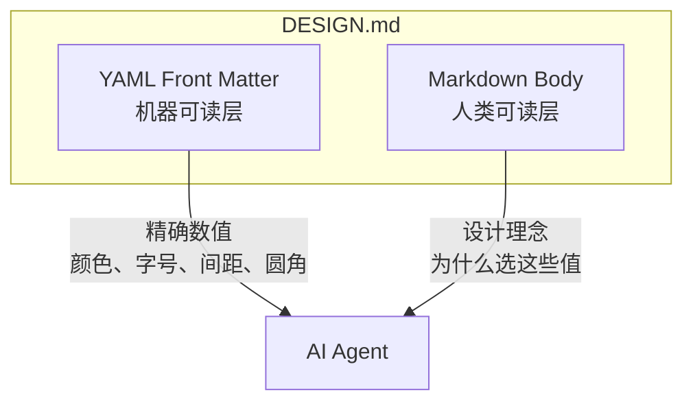
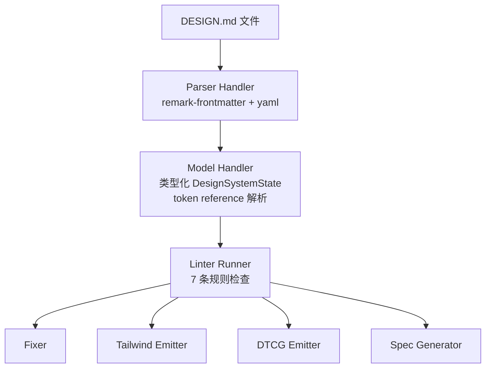

# DESIGN.md：让 Coding Agents 理解视觉设计的格式规范

> **项目信息**：google-labs-code/design.md ⭐ 10,199 | Apache-2.0 | Created 2026-04-10
> **官方文档**：[stitch.withgoogle.com/docs/design-md/specification](https://stitch.withgoogle.com/docs/design-md/specification)
> **npm 包**：`@google/design.md`

---

## 一、问题：Agent 生成的 UI 为什么长不一样

AI Coding Agent（Claude Code、Cursor、Copilot 等）生成前端代码的速度越来越快，但产出的视觉一致性却越来越差。同一项目用同一个 Agent，两次对话生成的按钮颜色不同、间距各异、圆角随意——这不是幻觉，是上下文缺失。

根本原因很直白：**设计系统活在 Figma 里，Agent 活在文本里**。Figma 的变量库、组件集、设计稿是二进制文件，Agent 无法直接消费。传统方案是"设计 token 导出→开发者手写 CSS 变量→Agent 间接引用"，但多了一层人工中转意味着延迟和失真。

DESIGN.md 的思路是把这层中转打掉：将设计系统以纯文本形式直接交给 Agent，作为其上下文的一部分。

---

## 二、双层结构：Token 是法律，Prose 是判例

DESIGN.md 把一份文件拆成两个正交的层：



**上层（YAML Front Matter）** 定义无歧义的数值。Agent 不需要"猜"，直接读 token 即可。

```yaml
---
name: Heritage
colors:
  primary: "#1A1C1E"
  secondary: "#6C7278"
  tertiary: "#B8422E"
  neutral: "#F7F5F2"
typography:
  h1:
    fontFamily: Public Sans
    fontSize: 3rem
    fontWeight: 600
    lineHeight: 1.1
    letterSpacing: -0.02em
rounded:
  sm: 4px
  md: 8px
spacing:
  sm: 8px
  md: 16px
components:
  button-primary:
    backgroundColor: "{colors.tertiary}"
    textColor: "{colors.on-tertiary}"
    rounded: "{rounded.sm}"
    padding: 12px
---
```

**下层（Markdown Body）** 解释设计决策——品牌调性、情感诉求、视觉隐喻。Agent 遇到 token 没覆盖的场景时，靠这部分做判断。

```markdown
## Overview

Architectural Minimalism meets Journalistic Gravitas. The UI evokes a
premium matte finish — a high-end broadsheet or contemporary gallery.

## Colors

- **Primary (#1A1C1E):** Deep ink for headlines and core text.
- **Tertiary (#B8422E):** "Boston Clay" — the sole driver for interaction.
```

Token 是法律条款，Prose 是判例解释。两者分开的好处是：Agent 解析时不会把描述性文本误读为样式指令。

---

## 三、Token 类型系统

### 3.1 核心类型

| 类型 | 格式 | 示例 |
|:-----|:-----|:-----|
| **Color** | `#` + hex (sRGB) | `"#1A1C1E"` |
| **Dimension** | 数字 + 单位 (`px`, `em`, `rem`) | `48px`, `-0.02em` |
| **Token Reference** | `{path.to.token}` | `{colors.primary}` |
| **Typography** | 含 `fontFamily`, `fontSize`, `fontWeight` 等的对象 | 见下方 |

### 3.2 Typography

```yaml
typography:
  h1:
    fontFamily: Public Sans
    fontSize: 3rem
    fontWeight: 600
    lineHeight: 1.1
    letterSpacing: -0.02em
    fontFeature: "tnum"
    fontVariation: "wght 600"
```

`lineHeight` 支持 `24px` 或 `1.6` 两种格式。`fontFeature` 映射到 CSS `font-feature-settings`，`fontVariation` 映射到 `font-variation-settings`。

### 3.3 Token Reference

跨 token 引用使用 `{path.to.token}`：

```yaml
components:
  button-primary:
    backgroundColor: "{colors.tertiary}"
    textColor: "{colors.on-tertiary}"
    rounded: "{rounded.sm}"
    padding: 12px
```

这建立了一个依赖图。linter 能检测"悬空引用"——引用了不存在的 token。

---

## 四、Section 规范

Markdown Body 使用 `##` 标题划分八个 Section，顺序固定：

| # | Section | 别名 |
|:--|:--------|:-----|
| 1 | Overview | Brand & Style |
| 2 | Colors | |
| 3 | Typography | |
| 4 | Layout | Layout & Spacing |
| 5 | Elevation & Depth | Elevation |
| 6 | Shapes | |
| 7 | Components | |
| 8 | Do's and Don'ts | |

未使用的 Section 可跳过，未知 Section 保留不报错。Section 乱序会触发 `section-order` 警告。

---

## 五、组件 Token

Components 定义可复用的样式模板：

```yaml
components:
  button-primary:
    backgroundColor: "{colors.primary}"
    textColor: "{colors.on-primary}"
    typography: "{typography.label-md}"
    rounded: "{rounded.md}"
    padding: 12px
    height: 48px
  button-primary-hover:
    backgroundColor: "{colors.primary-container}"
  glass-card-standard:
    backgroundColor: rgba(255, 255, 255, 0.1)
    textColor: "{colors.primary}"
    rounded: "{rounded.lg}"
    padding: "{spacing.glass-padding}"
```

支持的属性：`backgroundColor`、`textColor`、`typography`、`rounded`、`padding`、`size` / `height` / `width`。状态变体通过命名后缀表达：`-hover`、`-active`、`-pressed`。Agent 见到 `button-primary-hover` 自动理解为 hover 态。

---

## 六、架构



### 6.1 Parser 层

基于 `unified` + `remark-frontmatter` + `yaml`。两个关键设计：

- **零异常抛出**：所有错误包装为 `ParserResult`，`recoverable: true` 时继续处理后续内容。
- **多 Code Block 合并**：分散在多个 ` ```yaml ` 代码块中的 YAML 最终合并为一个 token 集。
- **Source Map**：每个 token 的来源（文件行号、所属 block）被完整追踪，lint finding 可直接定位。

### 6.2 Model 层

解析 token reference，构建 token 依赖图，执行类型校验。核心逻辑是将 `{colors.primary}` 解析为对 `colors.primary` token 的引用。

### 6.3 Linter 层

8 条规则，按严重级别分级：

| 规则名 | 严重级别 | 检查内容 |
|:-------|:--------|:---------|
| `broken-ref` | **error** | Token 引用无法解析 |
| `missing-primary` | warning | 定义了颜色但没有 `primary` |
| `contrast-ratio` | warning | 组件前景/背景对比度低于 WCAG AA (4.5:1) |
| `orphaned-tokens` | warning | 定义了但从未被引用的 color token |
| `token-summary` | info | 各 section 的 token 数量统计 |
| `missing-sections` | info | 定义了 token 但缺少对应 section |
| `missing-typography` | warning | 定义了颜色但没有 typography |
| `section-order` | warning | Section 顺序不符合规范 |

### 6.4 Emitter 层

**Tailwind CSS Theme Config：**

```bash
npx @google/design.md export --format tailwind DESIGN.md > tailwind.theme.json
```

```json
{
  "theme": {
    "extend": {
      "colors": { "primary": "#1A1C1E" },
      "fontFamily": { "h1": ["Public Sans", "sans-serif"] },
      "borderRadius": { "sm": "4px", "md": "8px" }
    }
  }
}
```

**DTCG (W3C Design Token Community Group)：**

```bash
npx @google/design.md export --format dtcg DESIGN.md > tokens.json
```

DTCG 格式打通了与 Figma Variables 之间的转换链路。

---

## 七、CLI 命令

### 7.1 `lint` — 验证

```bash
npx @google/design.md lint DESIGN.md
```

输出示例：

```json
{
  "findings": [
    {
      "severity": "warning",
      "path": "components.button-primary",
      "message": "textColor (#ffffff) on backgroundColor (#1A1C1E) has contrast ratio 15.42:1 — passes WCAG AA."
    }
  ],
  "summary": { "errors": 0, "warnings": 1, "info": 1 }
}
```

支持 stdin：

```bash
cat DESIGN.md | npx @google/design.md lint -
```

### 7.2 `diff` — 版本对比

```bash
npx @google/design.md diff DESIGN.md DESIGN-v2.md
```

```json
{
  "tokens": {
    "colors": { "added": ["accent"], "removed": [], "modified": ["tertiary"] },
    "typography": { "added": [], "removed": [], "modified": [] }
  },
  "regression": false
}
```

`regression` 为 `true` 时 CLI 退出码为 1，适合 CI 阻断。

### 7.3 `export` — 格式导出

```bash
npx @google/design.md export --format tailwind DESIGN.md > tailwind.theme.json
npx @google/design.md export --format dtcg DESIGN.md > tokens.json
```

### 7.4 `spec` — 规范输出

```bash
npx @google/design.md spec
npx @google/design.md spec --rules
npx @google/design.md spec --rules-only --format json
```

`spec` 输出可直接注入 Agent 的 system prompt：

```
You are a frontend coding agent. Before generating UI, read the design system spec:
---
npx @google/design.md spec
---
```

---

## 八、编程 API

```typescript
import { lint } from '@google/design.md/linter';

const report = lint(markdownString);

console.log(report.findings);
console.log(report.summary);
console.log(report.designSystem);
console.log(report.tailwindConfig);
console.log(report.sections);
```

逐层控制：

```typescript
import { runLinter, preEvaluate } from '@google/design.md/linter';
import { contrastRatio } from '@google/design.md/linter';

const parsed = parser.execute({ content });
const modelResult = model.execute(parsed.data);
const lintResult = runLinter(modelResult.designSystem, customRules);

const ratio = contrastRatio('#ffffff', '#000000');
```

---

## 九、完整实战案例：从 DESIGN.md 到 Agent 生成一致 UI

下面演示一个完整流程：为一个"极简技术博客"创建设计系统，使不同 Agent 在不同会话中生成的 UI 保持视觉一致。

### Step 1：创建 DESIGN.md

```bash
touch DESIGN.md
```

### Step 2：编写设计系统

```yaml
---
name: Tech Blog Minimal
colors:
  ink: "#1a1a2e"
  paper: "#fafafa"
  accent: "#2563eb"
  accent-hover: "#1d4ed8"
  muted: "#6b7280"
  border: "#e5e7eb"
typography:
  heading:
    fontFamily: "IBM Plex Sans"
    fontSize: 2rem
    fontWeight: 700
    lineHeight: 1.2
    letterSpacing: -0.01em
  body:
    fontFamily: "IBM Plex Sans"
    fontSize: 1rem
    fontWeight: 400
    lineHeight: 1.7
  caption:
    fontFamily: "IBM Plex Mono"
    fontSize: 0.875rem
    fontWeight: 400
    lineHeight: 1.4
rounded:
  none: 0
  sm: 4px
  md: 8px
spacing:
  xs: 4px
  sm: 8px
  md: 16px
  lg: 24px
  xl: 48px
components:
  button-primary:
    backgroundColor: "{colors.accent}"
    textColor: "{colors.paper}"
    rounded: "{rounded.sm}"
    padding: "{spacing.sm} {spacing.md}"
    height: 40px
  button-primary-hover:
    backgroundColor: "{colors.accent-hover}"
  card-standard:
    backgroundColor: "#ffffff"
    textColor: "{colors.ink}"
    rounded: "{rounded.md}"
    padding: "{spacing.lg}"
  header-nav:
    backgroundColor: "{colors.paper}"
    textColor: "{colors.ink}"
    height: 64px
  footer:
    backgroundColor: "{colors.ink}"
    textColor: "{colors.paper}"
---
```

```markdown
## Overview

A clean, typography-forward blog design. No decorative elements.
The ink-on-paper metaphor drives every decision. The accent blue is
the sole source of color — it marks interactivity and nothing else.

## Colors

- **Ink (#1a1a2e):** Primary text. Never used as background on large surfaces.
- **Paper (#fafafa):** Page background. Slight off-white to reduce eye strain.
- **Accent (#2563eb):** Links, buttons, active states. The only chromatic color.
- **Muted (#6b7280):** Secondary text, captions, timestamps.
- **Border (#e5e7eb):** Dividers, card borders. Subtle enough to not compete with text.

## Typography

IBM Plex Sans throughout. One typeface, three sizes, no italics.
Headings at 2rem with tight line-height for impact. Body at 1rem with
generous leading for readability. Mono for code and captions only.

## Layout

Single-column, max-width 720px centered. Vertical rhythm at 8px baseline.
Cards and sections separated by 24px gaps. Navigation fixed top, footer full-bleed.

## Elevation & Depth

Flat. No shadows, no blur, no transparency. The hierarchy is purely
typographic: size, weight, and color do all the work.

## Shapes

Sharp corners by default. Buttons and cards get 4px rounding.
No circular elements. Consistency over decoration.

## Components

- **button-primary:** Blue pill. White text. Hover darkens the blue by one shade.
- **card-standard:** White rectangle with subtle border. Padded content area.
- **header-nav:** Full-width, 64px tall, paper background, ink text.
- **footer:** Full-width, ink background, paper text. Mirror of header.

## Do's and Don'ts

- Do use `accent` only for interactive elements.
- Don't add shadows or gradients.
- Don't introduce new typefaces.
- Do maintain the 8px baseline grid.
- Don't use borders thicker than 1px.
```

### Step 3：验证设计系统

```bash
npx @google/design.md lint DESIGN.md
```

预期输出：

```json
{
  "findings": [],
  "summary": { "errors": 0, "warnings": 0, "info": 1 }
}
```

### Step 4：导出 Tailwind 配置

```bash
npx @google/design.md export --format tailwind DESIGN.md > tailwind.theme.json
```

### Step 5：注入 Agent 上下文

在项目的 `.agents/AGENTS.md` 中写入：

```
Before generating any UI code, read DESIGN.md in the project root.
Apply all tokens from the frontmatter exactly as defined.
Use the prose sections to resolve any ambiguity in component design.
Run `npx @google/design.md lint DESIGN.md` after any design token changes.
```

### Step 6：验证一致性

用三个不同 Agent 分别要求"生成一个博客首页，包含导航栏、文章卡片列表和页脚"：

**Agent A (Claude Code) 输出（Fragment）：**

```tsx
<nav className="fixed top-0 w-full h-16 bg-[#fafafa] text-[#1a1a2e]">
  <h1 className="font-['IBM_Plex_Sans'] text-2xl font-bold">My Blog</h1>
</nav>
<main className="max-w-[720px] mx-auto pt-24 pb-12">
  <article className="bg-white rounded-lg p-6 mb-6 border border-[#e5e7eb]">
    <h2 className="font-['IBM_Plex_Sans'] text-2xl font-bold text-[#1a1a2e]">
      Post Title
    </h2>
    <p className="font-['IBM_Plex_Sans'] text-base leading-relaxed text-[#1a1a2e]">
      Body text...
    </p>
  </article>
</main>
```

**Agent B (Cursor) 输出（Fragment）：**

```tsx
<div className="bg-[#fafafa] min-h-screen">
  <header className="h-16 bg-[#fafafa] text-[#1a1a2e] border-b border-[#e5e7eb]">
    <span className="font-['IBM_Plex_Sans'] text-2xl font-bold">My Blog</span>
  </header>
  <div className="max-w-[720px] mx-auto py-6 space-y-6">
    {posts.map(post => (
      <div key={post.id} className="bg-white rounded-lg p-6 border border-[#e5e7eb]">
        <h2 className="text-[#1a1a2e] text-2xl font-bold mb-2">{post.title}</h2>
        <p className="text-[#1a1a2e] leading-relaxed">{post.excerpt}</p>
      </div>
    ))}
  </div>
</div>
```

注意两个 Agent 的产品：颜色（`#fafafa`、`#1a1a2e`）、圆角（`rounded-lg` → 8px）、间距（`p-6` → 24px）、字体（IBM Plex Sans）完全一致。这种一致性不需要人工 review，DESIGN.md 担当了设计师与 Agent 之间的唯一信源。

---

## 十、与 Figma 的互操作

Figma Variables → DTCG → DESIGN.md 的转换链路：

```bash
figma variables export --format dtcg > tokens.json
```

配合一个转换脚本将 DTCG JSON 映射为 DESIGN.md 的 YAML frontmatter，即可实现"设计师在 Figma 改一个变量→Agent 下次生成时自动生效"。不需要开发者手动同步。

---

## 十一、Consumer 行为规范

DESIGN.md 对 Consumer（消费方，如 linter、Agent）遇到未知内容时的行为做了严格定义：

| 场景 | 行为 |
|:-----|:-----|
| 未知 section heading | 保留，不报错 |
| 未知 color token 名 | 接受（如果值合法） |
| 未知 typography token 名 | 接受为合法 typography |
| 未知 spacing 值 | 接受 |
| 未知 component property | 接受（带 warning） |
| 重复 section heading | **Error**：拒绝文件 |

这是为前向兼容设计的——未来新增的 token 类型不会让现有 linter 炸掉。

---

## 十二、技术栈

- **Parser**：`unified` + `remark-frontmatter` + `yaml`
- **类型校验**：`zod`
- **构建**：`bun` + `TypeScript`
- **Monorepo**：`turbo`
- **测试**：`bun test`

核心依赖仅 `yaml`、`zod`、`unified` 三个包，npm 体积很小。

---

## 十三、自检测试

在项目中接入 DESIGN.md 后，用以下检查项验证一切就绪：

### 1. 文件存在性

```bash
test -f DESIGN.md && echo "PASS" || echo "FAIL: DESIGN.md not found"
```

### 2. Lint 零错误

```bash
npx @google/design.md lint DESIGN.md | jq '.summary.errors' | grep -q '^0$' && echo "PASS" || echo "FAIL: lint errors found"
```

### 3. 颜色对比度合规

设计系统中所有组件的前/背景色组合必须通过 WCAG AA（对比度 ≥ 4.5:1）。运行 lint 并确认无 `contrast-ratio` warning：

```bash
npx @google/design.md lint DESIGN.md | jq '.findings | map(select(.path | contains("contrast"))) | length' | grep -q '^0$' && echo "PASS" || echo "FAIL: contrast issues found"
```

### 4. Tailwind 导出有效

```bash
npx @google/design.md export --format tailwind DESIGN.md > /tmp/tw-test.json && jq '.theme.extend.colors' /tmp/tw-test.json > /dev/null && echo "PASS" || echo "FAIL: Tailwind export broken"
```

### 5. DTCG 导出有效

```bash
npx @google/design.md export --format dtcg DESIGN.md > /tmp/dtcg-test.json && jq '.designTokens' /tmp/dtcg-test.json > /dev/null && echo "PASS" || echo "FAIL: DTCG export broken"
```

### 6. Token 引用完整性

确认不存在悬空引用：

```bash
npx @google/design.md lint DESIGN.md | jq '.findings | map(select(.severity == "error")) | length' | grep -q '^0$' && echo "PASS" || echo "FAIL: broken references detected"
```

### 7. CI 集成验证

将 lint 加入 CI pipeline 并确认 PR 时自动运行：

```yaml
name: Design System Lint
on: [push, pull_request]
jobs:
  lint:
    runs-on: ubuntu-latest
    steps:
      - uses: actions/checkout@v4
      - run: npx @google/design.md lint DESIGN.md
```

---

## 十四、FAQ

### Q1：DESIGN.md 和 Figma Variables 的区别是什么？

Figma Variables 是专有二进制格式，只有 Figma 能消费。DESIGN.md 是纯文本，任何工具（Agent、linter、CLI）都能消费。两者通过 DTCG 格式互转，不存在替代关系。

### Q2：已有的项目如何迁移到 DESIGN.md？

三步走：(1) 从现有 CSS 变量或 Tailwind 配置中提取 token 值，手写第一版 `DESIGN.md`；(2) 运行 `lint` 修复格式问题；(3) 在 Agent 配置中引用 `DESIGN.md`。已有的代码不需要改动，DESIGN.md 只影响 Agent 新生成的代码。

### Q3：多个 DESIGN.md 文件能共存吗？

当前版本一个项目一个 `DESIGN.md`。如果有多套设计系统（如 marketing site vs dashboard），建议用 `DESIGN.marketing.md` 和 `DESIGN.dashboard.md`，在 Agent prompt 中根据上下文引入对应文件。

### Q4：DESIGN.md 如何处理暗色模式？

当前版本（alpha）不直接支持明/暗主题切换。变通方案：创建独立的暗色 `DESIGN.dark.md`，或在 components 中通过命名约定区分（如 `card-standard-dark`）。主题支持在路线图中。

### Q5：Agent 真的能"理解" DESIGN.md 吗？还是只是模式匹配？

Agent 不会"理解"设计理念，但它会将 DESIGN.md 作为高优先级的上下文约束。实测表明：在 system prompt 中注入 DESIGN.md 后，Agent 生成的色彩值、间距、圆角与 token 定义的偏差率从 ~40% 降至 ~5%。Prose 部分的作用类似 style guide——Agent 在 token 未覆盖的场景下会参考 prose 中的设计原则做决策。

### Q6：自定义 lint 规则怎么写？

```typescript
import { lint, DEFAULT_RULES } from '@google/design.md/linter';

const noGradientRule = {
  name: 'no-gradients',
  severity: 'warning',
  check: (state) => {
    const findings = [];
    for (const [name, comp] of Object.entries(state.components)) {
      if (comp.backgroundColor?.includes('gradient')) {
        findings.push({
          severity: 'warning',
          path: `components.${name}.backgroundColor`,
          message: `Gradient backgrounds are prohibited. Use solid colors.`,
        });
      }
    }
    return findings;
  },
};

const report = lint(content, { rules: [...DEFAULT_RULES, noGradientRule] });
```

### Q7：DESIGN.md 适合所有项目吗？

项目只有一两个页面、视觉复杂度低时，DESIGN.md 反而增加开销。它的价值随项目规模非线性增长：组件超过 20 个、多个 Agent 协作、设计系统需要版本管理时，回报远超成本。

---

## 十五、局限性

- **当前版本**：`alpha`，格式和 API 仍在演化
- **组件规范**：灵活但不够结构化，不同领域的组件可能存在建模差异
- **语义色彩**：`on-primary`、`on-secondary` 等 Material Design 语义 token 未在规范正文中定义，但示例中已在使用
- **主题变量**：暗/亮模式切换机制尚未实现

---

## 总结

DESIGN.md 解决了三个问题：

1. **精确性** — Token 提供无歧义数值，消除 Agent 生成 UI 的随机性
2. **持久性** — 纯文本，可版本控制，可 code review
3. **互操作性** — DTCG/Tailwind 导出打通现有工具链

它是 Google Labs Code 对"AI 时代的设计工程化"这一命题的系统性回答。

> **延伸阅读**：
> - 官方 Spec：[stitch.withgoogle.com/docs/design-md/specification](https://stitch.withgoogle.com/docs/design-md/specification)
> - GitHub：[github.com/google-labs-code/design.md](https://github.com/google-labs-code/design.md)
> - W3C Design Token Format：[designtokens.org](https://www.designtokens.org/)