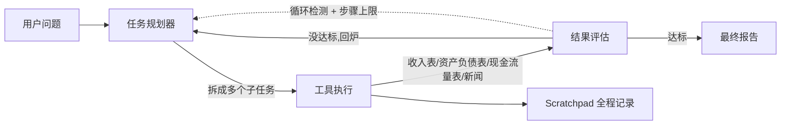

# Dexter：把 Claude Code 的自主执行搬进金融研究

金融研究真正难的不是"找到数据"，而是把"拿到数据、做对分析、确认结论可靠"这整条链跑通。传统做法是靠研究员手动拆问题、逐项查数据、来回交叉验证，过程枯燥还容易漏。Dexter 把这个流程交给了一个自主 Agent：你丢一个金融问题进去，它自己规划步骤、调用数据源、验证结果、迭代到可信再输出结论。它没有引入新的金融数据能力，而是把 Claude Code 那种"接收复杂任务、拆解、执行、验证"的 agent 范式，套在了金融研究这件事上。

| 项目 | 数据 |
|------|------|
| 仓库 | [virattt/dexter](https://github.com/virattt/dexter) |
| 定位 | 面向深度金融研究的自主智能体 |
| Stars | 27,499（2026-08-07 验证） |
| Forks | 3,415 |
| 语言 | TypeScript |
| 运行时 | Bun v1.0+ |
| 分支 | main |
| 协议 | README 声明 MIT（仓库未附独立 LICENSE 文件） |

## 系统怎么分层

Dexter 的处理链路可以拆成四段，中间靠一条自我验证回路盯着：



## 金融研究卡在哪

金融问题的麻烦在于它天然是多步骤的。问一句"苹果未来 12 个月的营收预期"，背后至少涉及历史财务数据、分析师预期、市场消息，最后还要把几类信息合起来给一个判断。每一步都简单，但组合起来就变成研究员脑内的一串状态：现在查到哪了、还缺什么、结果可不可信。

Dexter 把这几件事拆成了三条独立机制，各自负责一段：

**任务规划**把复杂问题自动拆成结构化研究步骤，等价于把研究员脑内的工作清单显式写出来。**自主执行**根据步骤选择并调用合适的工具去拿数据。**自我验证**在每轮检查工作质量，配合内置的循环检测和步骤上限，防止 Agent 在一个问题上兜圈子或无限跑下去。

这三条机制不是并列的功能点，而是一条闭环：规划产生步骤，执行消费步骤，验证决定是否回到规划。这也是它区别于普通"一问一答"金融查询工具的地方——普通工具给的是单次结果，Dexter 给的是一个被反复校正过的过程。

## 工具与数据源

Dexter 本身不持有金融数据，它靠几个外部 API 现取：

- **Financial Datasets API**（[financialdatasets.ai](https://financialdatasets.ai)）：机构级市场数据，覆盖收入表、资产负债表、现金流量表，是核心数据源。
- **Exa API**（可选）：网络搜索，用来补新闻、研报和公开信息。
- **Tavily API**（备选）：Exa 不可用时的降级搜索方案。

环境变量里两组搜索 key（Exa 优先、Tavily 兜底）对应上面的降级逻辑。模型方面不锁死一家，OpenAI 是默认，Anthropic、Google、xAI、OpenRouter 都能切，也支持通过 Ollama 跑本地模型。

## 一次研究怎么流过系统

以 README 里最常见的苹果营收问题为例，走一遍完整链路：

1. 用户输入"苹果公司未来 12 个月的营收预期如何"。
2. 任务规划器把它拆成几个子任务：拉历史营收、查分析师预期、补相关新闻。
3. 工具执行按子任务逐一调用 Financial Datasets API 取收入表。README 自带示例里，`get_income_statements` 拿到 AAPL 近 5 年年报，LLM 把它概括成"营收从 2740 亿美元涨到 3940 亿美元"。
4. 结果评估核对每一步是否完成、数据是否支撑结论，不达标就送回规划器重跑。
5. 达标后汇总成一份带置信度评估的数据驱动结论。

这个案例是示意性的，把 README 明示的机制串起来看，不代表每一步固定如此——具体拆出几个子任务、调哪些工具，由模型当次决定。

## 调试与评估

### Scratchpad：过程可回放

每次查询都会在 `.dexter/scratchpad/` 生成一个 JSONL 文件，记录三类条目：`init`（原始查询）、`tool_result`（每个工具调用的参数、原始返回和 LLM 摘要）、`thinking`（推理步骤）。调试路径很直接——打开 JSONL，看它调了什么工具、拿到什么数据、怎么解读的：

```json
{"type":"tool_result","timestamp":"2026-01-30T11:14:05.123Z","toolName":"get_income_statements","args":{"ticker":"AAPL","period":"annual","limit":5},"result":{...},"llmSummary":"Retrieved 5 years of Apple annual income statements showing revenue growth from $274B to $394B"}
```

### 评估套件：测什么要看清楚

仓库带一套评估套件，用 LangSmith 追踪、LLM-as-judge 打分，对一组金融问题跑正确率：

```bash
# 跑全部评估问题
bun run src/evals/run.ts

# 随机抽样 10 个问题
bun run src/evals/run.ts --sample 10
```

评估 runner 会显示实时 UI：进度、当前问题、实时准确率。读这套评估要分清两层：它测的是"Agent 对封闭问题集的回答正确率"，数字变化反映的是整个规划+执行+验证链路的整体质量，而不是单个环节的贡献。它不能推出"对任意真实金融问题都可靠"——评估集是固定的，真实问题会引入评估集里没有的开放性。

## 安装与运行

前提是 Bun v1.0+、OpenAI 和 Financial Datasets 两把 key，Exa 可选。安装三步走：

```bash
git clone https://github.com/virattt/dexter.git
cd dexter
bun install
cp env.example .env
```

`.env` 里必填 `OPENAI_API_KEY` 和 `FINANCIAL_DATASETS_API_KEY`；Anthropic、Google、xAI、OpenRouter 可选，`OLLAMA_BASE_URL` 指向本地模型，两组搜索 key 按 Exa→Tavily 顺序降级。运行用 `bun start`（交互模式）或 `bun dev`（热重载）。

WhatsApp 集成走网关：`bun run gateway:login` 扫码关联手机号，然后 `bun run gateway`。之后给自己发消息即可被处理，结果从同一频道返回。详细配置见 [WhatsApp Gateway README](src/gateway/channels/whatsapp/README.md)。

## 适用边界

Dexter 适合这三类人：要快速做基本面初筛的投资者，想系统走一遍"问题规划—数据获取—结论验证"流程的学习者，以及想在金融 agent 上做二次开发的工程师（工具接口、评估套件都是现成的）。

要看清几个边界：

- **不是投资工具**。README 开头就声明项目仅用于教育、娱乐和信息用途，不用于真实交易，输出可能错误、过时或不完整，关键决策前要人工核实。
- **验证不是保正确**。自我验证基于模型自身判断，高置信度不等于事实正确。
- **每次调用都有成本**。OpenAI + Financial Datasets 是必须的，每次查询都产生 API 费用。
- **运行时锁定在 Bun**。项目用 TypeScript + Bun，不直接用 Node 跑。
- **WhatsApp 网关依赖手机在线**。断线后消息不会自动补发。

和 Bloomberg、Wind 这类专业终端相比，Dexter 定位是研究辅助：它擅长把一次多步骤的初探性研究跑顺、跑可追溯，但机构级的实时行情、合规数据和解盘能力都不在它的范围内。它不会替代专业终端，但能替代"研究员手动把问题拆开、逐个查表、再交叉核对"那段重复劳动。对经常做基本面研究的人，这是一个工程化程度够高的开源起点。