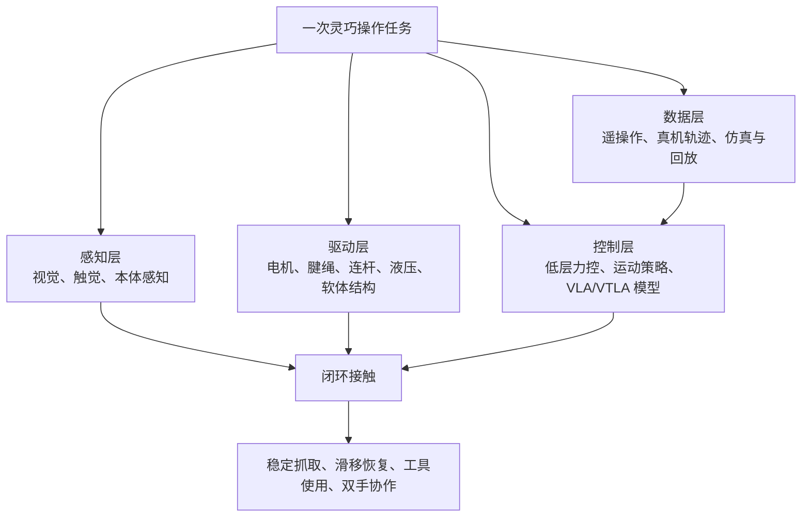

# 灵巧手不可能三角：300 美元级开源手，改写了什么

> **目标读者**：机器人研究者、具身智能工程师、硬件创业者
> **核心问题**：300 美元级开源手真的能颠覆高端灵巧手市场吗？
> **预计时间**：约 25 分钟
> **前置知识**：了解机器人学基础、电机控制、传感器融合

---

## §1 学习目标

完成本文阅读后，你将能够：

- [ ] 解释灵巧手"不可能三角"的工程含义
- [ ] 区分 6 条技术路线的优先级与代价`
- [ ] 理解"开可乐"比后空翻更难的工程原因`
- [ ] 评估 VLA 模型与硬件的关系边界`
- [ ] 根据团队类型选择适合的灵巧手方案"`
- [ ] 判断 2026 年灵巧手行业的真实进展"

---

## §2 文章结构主线

- 灵巧手不是"夹爪升级版"——它解决的是接触过程中的持续交互
- "六大门派"是 6 种工程取舍，不是单选题`
- 不可能三角：性能、成本、可靠性无法同时拿到`
- 五个坐标对比：Shadow、Tesla、TetherIA、Gaia、Sharpa`
- 300 美元级开源手改写了"谁能参与迭代"`
- VLA 与 Sim2Real：软件能补硬件，但补不了物理`
- 一次"开可乐"任务如何流过系统`
- 2026 年是突破年还是瓶颈年？`
- 不同团队的采用顺序建议`

---

## §3 一张地图：灵巧手不是"夹爪升级版"

工业夹爪解决的是"拿住一个东西"。灵巧手解决的是"在接触过程中持续改变手与物体的关系"。这就是为什么看似日常的开瓶、拿手机、拧螺丝，会比一次漂亮的全身动作更难商业化。

---

## §4 "六大门派"更像 6 种工程取舍

| 路线 | 典型代表 | 优先解决 | 付出的代价 |
|---|---|---|---|
| 直驱 / 准直驱 | 一些电机内置式原型、模块化关节手 | 控制简单、响应直接、维护路径短 | 手指空间太小，电机扭矩密度和散热容易卡住 |
| 谐波 / 精密减速 | DLR-HIT Hand II、部分高端实验手 | 精度、刚度、可控性 | 成本、重量、装配复杂度上升 |
| 腱绳 / 线缆 | Shadow Dexterous Hand、Tesla Optimus 新手部、TetherIA Aero Hand Open | 把执行器移出手指，换来更轻的末端和更像人手的布局 | 线缆摩擦、松弛、标定漂移和维护成本 |
| 液压 / 气动 / 软体 | Boston Dynamics 早期液压系统、软体抓取手 | 高功率密度、顺应性、安全接触 | 噪音、泄漏、维护、精细控制一致性 |
| 连杆 / 欠驱动 | 工业抓取手、低成本五指手 | 可靠、便宜、容易量产 | 单关节独立控制少，复杂在手操作受限 |
| 开源 / 模块化生态 | LEAP Hand、Aero Hand Open、GaiaHand | 降低复现和维修成本，让数据采集规模变大 | 质量一致性、售后、标定和长期可靠性需要社区或供应链补课 |

---

## §5 不可能三角：哪条边都不能白拿

> 想要更多自由度、更大指尖力、更细触觉和更高可靠性，就会同时增加零件数、标定成本、故障点和供应链难度。

| 目标 | 工程上通常怎么做 | 随之出现的问题 |
|---|---|---|
| 高性能 | 增加主动自由度、触觉阵列、力矩控制和高速通信 | BOM 上升，调参和标定变复杂，坏点更多 |
| 低成本 | 使用 3D 打印件、标准舵机、欠驱动和开源 PCB | 精度、寿命和批次一致性难与高端方案相比 |
| 高可靠性 | 减少自由度、做模块化快换、降低接触复杂度 | 灵巧性下降，任务范围收窄 |

---

## §6 五个坐标：Shadow、Tesla、TetherIA、Gaia、Sharpa

| 产品 / 项目 | 可核验规格 | 适合怎么看 |
|---|---|---|
| [Shadow Dexterous Hand](https://shadowrobot.com/dexterous-hand-series/) | 官方页面写明：20 个电机、腱绳驱动、20 个主动 DOF 加 4 个欠驱动运动 / 24 关节、100+ 传感器，控制和传感最高到 1 kHz，旗舰手重约 4.3 kg | 高端研究工具。它代表"性能和传感密度"这一端，不代表消费级成本 |
| Tesla Optimus 新手 / 前臂 | 2024-11-28 公开演示中，Optimus 工程负责人 Milan Kovac 提到手部 22 DOF、腕 / 前臂 3 DOF；报道同时注明演示为实时遥操作 | 量产意图强，但公开资料仍有限。可以讨论路线，不能把未公开精度和成本当事实 |
| [TetherIA Aero Hand Open](https://tetherria.github.io/aero-hand-open/) | 官方项目页写明：314 美元级、<400 g；GitHub README 写明 7 DOF、16 joints、389 g、开源硬件与固件；商店页写明约 10 N 指尖力、开合约 1 Hz | 低成本、可复现、适合研究和教育的数据底座 |
| GaiaHand 开源仓库强调五指、模块化、低成本、MIT；星际光年产品页给出 Gaia Hand 20 的 20 DOF、基础版 9,998 元早鸟价 / 16,999 元日常价；媒体报道提到单关节模组 999 元 | 中国供应链把"可维修、模块化、低成本"推向产品化 |
| Sharpa Wave 官方页写明 22 DOF，强调人手尺寸、结构和触觉敏感度；Wave 页面强调单指 >20 N 与 >4 Hz 手势速度的组合 | 触觉和高动态操作路线，适合观察"触觉 + VLA/VTLA"如何进入整机参考设计 |

---

## §7 300 美元级开源手到底改写了什么

TetherIA Aero Hand Open 的公开 Demo 包括从平面拿起 iPhone、抓 M5 螺丝、扣动电钻扳机、打开汽水罐。它们分别测到不同能力：

| Demo | 主要测试 | 不能推出什么 |
|---|---|---|
| 拿 iPhone | 平面拾取、接触顺应性、抓握姿态 | 不能说明能长期处理所有薄片物体 |
| 抓 M5 螺丝 | 指尖定位、欠驱动手指的可控性 | 不能说明具备工业装配级重复精度 |
| 扣动电钻扳机 | 指尖力、单指动作幅度、工具交互 | 不能说明能稳定完成复杂工具任务 |
| 开汽水 / 可乐 | 多指协同、滑移处理、腕部配合 | 不能说明家庭环境里的通用开盖能力已经解决 |

这些 Demo 的价值在于证明一件事：低成本手不再只能"摆姿势"。它已经能参与真实物体操作，足够用于采集数据、测试控制策略、训练学生和快速验证算法。

---

## §8 VLA 与 Sim2Real：软件能补硬件，但补不了物理

VLA（Vision-Language-Action）模型让机器人把视觉、语言和动作放进同一个策略接口里。Google 的 [RT-2](https://arxiv.org/abs/2307.15818) 证明了视觉语言模型可以和机器人轨迹一起训练，把动作也表示成模型可输出的 token；[OpenVLA](https://arxiv.org/abs/2406.09246) 进一步开源了 7B 参数 VLA，并使用 97 万条真实机器人演示训练。AgiBot World 这类数据集则把规模推到 [100 台机器人、100 万+ 轨迹、100+ 场景](https://arxiv.org/html/2503.06669v2)。

对灵巧手来说，VLA 的意义不是让一个大模型每 10 毫秒直接控制每个电机。更合理的分层是：

| 层级 | 频率 | 做什么 | 典型失败 |
|---|---|---|---|
| 语义 / 任务层 | 低频 | 理解"拿起手机""开瓶盖""递给人" | 目标理解错、场景误判 |
| 策略 / 运动层 | 中频 | 生成抓握姿态、手腕路径、重试策略 | 迁移到新物体时动作不稳 |
| 触觉 / 力控层 | 高频 | 处理滑移、过载、接触瞬间的修正 | 传感器噪声、标定漂移、延迟 |

---

## §9 一次"开可乐"任务如何流过系统

以"打开一瓶可乐"为例，抽象一点看，任务会经过这条链路：

1. 视觉先确定瓶身、瓶盖和桌面的相对位置，估计瓶盖朝向。
2. 策略层生成预抓姿态：哪几根手指固定瓶盖，手腕从哪个方向提供旋转。
3. 手指闭合时，触觉或电流反馈判断是否已经接触、是否滑移。
4. 低层控制器限制指尖力，避免把瓶身压坏或让瓶盖打滑。
5. 手腕开始旋转；如果扭矩变化不符合预期，策略层决定加力、换姿态或重新抓。
6. 瓶盖松动后，系统切换成低力保持，避免继续挤压或把瓶子带倒。
7. 任务结束后记录轨迹：成功 / 失败、滑移时刻、重试次数、力控曲线和视觉帧。

---

## §10 2026 年到底是突破年，还是瓶颈年

答案取决于你看哪一层。

如果看"普通家庭机器人"，2026 年仍然太早。可靠性、安全认证、清洁维护、儿童和宠物共处、异常物体处理，都不是一个开源硬件价格能解决的。

如果看"灵巧操作研究和具身智能数据采集"，2026 年已经明显变了。判断依据有 5 条：

- 低价手开始支持完整的 CAD、PCB、固件、SDK、ROS 2 和仿真路径。
- 7B 级 VLA 模型和百万轨迹数据集给策略迁移提供了共同语言。
- 模块化关节、3D 打印件和标准件降低了维修恐惧。
- 触觉路线重新升温，Sharpa、Tesla、星际光年等都把触觉放进产品叙事。
- 评估指标正在从"能不能拍 Demo"转向"成功率、可复现、可维修、可量产"。

---

## §11 怎么选：不同团队的采用顺序

| 团队类型 | 推荐方案 | 原因 |
|---|---|---|
| **高校实验室** | Aero Hand Open、LEAP Hand、GaiaHand | 能进仿真、能遥操作、能维修 |
| **机器人创业团队** | 根据任务边界选择二指夹爪或五指手 | 能用二指夹爪解决的任务，不要为了"人形"强行上五指手 |
| **整机厂** | Teslak 式手 / 前臂一体化 | 灵巧手不是末端配件，而是前臂、腕部、布线、热管理、控制器和数据系统的一部分 |
| **家庭机器人关注者** | 先看 3 个指标：连续运行多久不需要维护，失败时能不能安全停下，用户能否在家里完成低成本维修 | 价格下降是必要条件，不是充分条件 |

---

## §12 自测问题

可以先用 5 个问题检验自己是否已经吃透灵巧手行业：

1. **为什么灵巧手的"不可能三角"在工程上无法同时达成？**
2. **"开可乐"比后空翻难在哪里？具体是哪些层级在同时工作？**
3. **六大门派中，哪一条路线最适合高校实验室起步？为什么？**
4. **VLA 模型能解决触觉反馈问题吗？边界在哪里？**
5. **300 美元级开源手改写了行业里的哪个指标？它没改写哪个指标？**

**参考答案**：

1. 不可能三角是：高性能 → 成本高、标定复杂；低成本 → 精度寿命下降；高可靠性 → 灵巧性下降。三者无法同时拿到。
2. 开可乐难在接触状态不断变化，需要感知、驱动、控制、数据四层同时工作；后空翻主要考验全身动力学和轨迹控制。
3. 开源 / 模块化生态最适合高校实验室，因为可维修、可复现、适合数据采集和学生训练。
4. VLA 不能解决触觉反馈——触觉是物理信号，需要硬件传感器；VLA 只能根据触觉数据做策略调整。
5. 开源手改写了"谁能参与迭代"（更多团队能买、能坏、能修）；没改写"家庭场景可靠性"（仍需长期验证）。

---

## §13 进阶路径#

### 13.1 基础阶段（第 1-4 周）#

- [ ] 理解灵巧手"不可能三角"的工程含义#
- [ ] 阅读 Shadow、Tesla、TetherIA、Gaia 的官方文档#
- [ ] 搭建仿真环境（MuJoCo / Isaac Sim）#
- [ ] 跑通一个开源灵巧手 Demo（Aero Hand Open 或 LEAP Hand）#

### 13.2 进阶阶段（第 5-12 周）#

- [ ] 深入理解 VLA / OpenVLA 模型架构#
- [ ] 在仿真环境中训练一个简单的抓取策略#
- [ ] 理解腱绳驱动 vs. 直驱 vs. 谐波减速的权衡#
- [ ] 搭建遥操作数据采集流水线#

### 13.3 高级阶段（第 13-24 周）#

- [ ] 在真实硬件上部署和调试控制策略#
- [ ] 贡献代码到开源灵巧手项目#
- [ ] 发表具身智能相关论文#
- [ ] 设计一套低成本、可维修的灵巧手方案#

### 13.4 相关资源#

| 资源 | 链接 |
|---|---|
| **TetherIA Aero Hand Open** | https://tetherria.github.io/aero-hand-open/ |
| **Shadow Robot** | https://shadowrobot.com/dexterous-hand-series/ |
| **Google RT-2 论文** | https://arxiv.org/abs/2307.15818 |
| **OpenVLA 论文** | https://arxiv.org/abs/2406.09246 |
| **AgiBot World 数据集** | https://arxiv.org/html/2503.06669v2 |

---

## §14 常见问题#

### Q1：300 美元级开源手能替代 Shadow Robot 吗？#

**A**: 不能。Shadow Robot 在传感密度、控制频率、可扩展性和成熟集成上仍有优势；开源手的价值是让更多团队能参与数据采集和算法验证，而不是替代高端研究工具。

### Q2：VLA 模型能让低成本手达到高端手性能吗？#

**A**: 部分能。VLA 可以优化控制策略，让硬件发挥最大效能；但硬件的触觉分辨率、力控频率、指尖精度这些物理边界，软件无法完全弥补。

### Q3：如何选择适合自己团队的灵巧手方案？#

**A**: 根据任务边界选择。仓储分拣、3C 装配、餐饮后厨、零售补货，需要的手不一样。能用二指夹爪解决的任务，不要为了"人形"强行上五指手。

### Q4：开源灵巧手的维护性真的更好吗？#

**A**: 理论上更好（模块化、标准件、可 3D 打印替换），但实际取决于社区活跃度和供应链成熟度。TetherIA Aero Hand Open 和 LEAP Hand 的社区支持相对较好。

### Q5：家庭机器人什么时候能用上灵巧手？#

**A**: 仍然需要 3-5 年。可靠性、安全认证、清洁维护、儿童和宠物共处、异常物体处理，都不是硬件价格能单独解决的。先关注高校实验室和工业场景的进展。

---

## §15 结语：拐点不在"谁赢"，在"谁能持续迭代"#

灵巧手过去像一个昂贵的研究符号：看起来接近人手，买起来远离普通团队。2026 年的新变化，是低价开源硬件、模块化供应链、VLA 模型和大规模数据集开始咬合。

Shadow Robot 仍然代表高端研究工具的上限；Tesla 让行业看到整机量产语境下的手 / 前臂一体化；TetherIA、LEAP、GaiaHand 把复现门槛压低；Sharpa 这类触觉路线提醒大家，真正稳定的灵巧操作离不开接触反馈。

家庭机器人不会因为 300 美元级灵巧手立刻到来。更可能发生的是：未来两三年，学校、实验室、创业团队和整机厂先拿这些手建立数据飞轮。等一只手不仅能开可乐，还能解释为什么这次没开成、下一次该怎么修正、坏了哪里该换，灵巧手才会从演示台走向日常工作台。

---

## §16 参考与延伸#

- 硅谷 101：[当机器人学会开可乐：深聊灵巧手的"不可能三角"与六大技术门派](https://www.bilibili.com/video/BV16EnizBEUY/)#
- TetherIA：[Aero Hand Open 项目页](https://tetherria.github.io/aero-hand-open/)、[GitHub 仓库](https://github.com/TetherIA/aero-hand-open)、[官方文档](https://docs.tetherria.ai/docs/intro/)#
- Shadow Robot：[Dexterous Hand Series](https://shadowrobot.com/dexterous-hand-series/)#
- Tesla Optimus 新手部报道：[Optimus new hand upgrade includes 22 degrees of freedom](https://cybernews.com/entertainment/optimus-new-hand-upgrade/)#
- 星际光年：[GaiaHand 开源仓库](https://github.com/Stella-robot/GaiaHand)、[Gaia Hand 20 产品页](https://www.stella-robot.com/sys-nd/9.html)#
- Sharpa：[Sharpa Wave](https://www.sharpa.com/pages/wave)#
- VLA 与数据集：[RT-2](https://arxiv.org/abs/2307.15818)、[OpenVLA](https://arxiv.org/abs/2406.09246)、[AgiBot World Colosseo](https://arxiv.org/html/2503.06669v2)#

---

**文档信息**#

难度：⭐⭐⭐ | 类型：深度分析 | 更新日期：2026-06-13 | 预计阅读时间：25 分钟#
