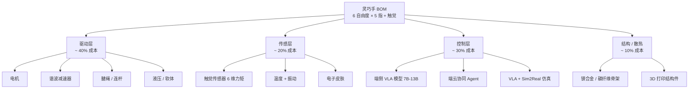

# 灵巧手"不可能三角"：从 Shadow Robot 24 自由度到 300 美元开源手，机器人最后一公里的 6 大门派与开源 + AI 大模型拐点

## 学习目标

读完这篇文章，能回答 4 件事：

- 为什么「**让机器人学会拧开可乐瓶**」比「**让它学会后空翻**」难 **10 倍**——这两件事的工程难度差在哪
- 灵巧手**"性能 / 成本 / 可靠性"不可能三角**具体长什么样，**为什么 2026 年这个时点**，开源 + AI 大模型正在把三角**压成两条边**
- **6 大门派**（直驱 / 谐波 / 液压 / 连杆 / 混合 / 开源）各自的**死穴**是什么——为什么**没有哪一派独大**
- 灵巧手从 **30 万美元 → 300 美元**的成本下行曲线**真的能发生**吗，**家庭机器人**什么时候会普及

---

## 写在前面

2025 年 9 月 26 日，硅谷 101《当机器人学会开可乐：深聊灵巧手的"不可能三角"与六大技术门派｜机器人系列》（BV16EnizBEUY，31 分钟）发布。嘉宾是 **TetherIA 联合创始人 Evan Tao 与 Xu Dong**——TetherIA 由 **Tesla + Waymo 老兵**创立，**特斯拉前灵巧手负责人**团队。

节目里反复出现的两个工程判断：

> 「**灵巧手成为机器人"最后一公里"的背后，是困扰行业数十年的性能、成本与可靠性的"不可能三角"。**」

> 「**让机器人学会拧开可乐瓶，竟然比让它学会后空翻还要难上十倍。**」

这两句话把灵巧手在 2026 年的工程位置讲透了。Tesla Optimus Gen 3 灵巧手（2025-11-28 发布，**22 自由度 + 腱绳驱动 + 0.08 毫米精度**）刷新了灵巧手的天花板；TetherIA AeroHand Open（**300 美元开源灵巧手**）刷新了灵巧手的地板。中间这一整段市场，2026 年正在被**开源 + AI 大模型 + 触觉**三股力量重新洗牌。

这篇文章以这期硅谷 101 节目为骨架，叠加 TetherIA 公开技术页（shop.tetheria.ai + robohorizon 报道）、Shadow Robot 公开产品页、DLR 公开研究报告、Tesla Optimus Gen 3 公开专利与展示、星际机器人（StarBot）Gaia Hand 公开产品页，把灵巧手"不可能三角 + 6 大门派 + 开源生态"三块拆开。

文中所有数字、产品名、技术规格均来自公开报道。本文不外推未发布产品。

---

## 一、先看地图：灵巧手不是"机器人加个手"，是 3 大子系统 + 1 套不开源生态

把"灵巧手"理解成"机器人末端装个能抓东西的机械结构"是 2010 年代的看法。2026 年的灵巧手**实际上是一台嵌入式高性能机器人**——3 大子系统在动：

| 子系统 | 关键部件 | 性能挑战 | 2026 状态 |
|---|---|---|---|
| 1. **驱动层** | 电机 / 谐波 / 腱绳 / 液压 / 软体 | 体积小 + 扭矩大 + 重量轻 | Tesla 腱绳 / Shadow 谐波 / Atlas 液压 / TetherIA 腱绳 + 3D 打印 |
| 2. **传感层** | 触觉 / 力矩 / 温度 / 振动 | 每根手指 1+ 个，6+ 自由度全覆盖 | Sharpa Wave Hand 触觉 / Tesla 0.08 毫米精度力控 |
| 3. **控制层** | 端侧 VLA 模型 + 端云协同 Agent | 100 ms 内决策 + 6+ DOF 同步 | GPT-4o 视觉 + Llama 3 8B 端侧 + 端云协同调度 |

把 3 大子系统绑起来看，才能理解为什么「**让机器人拧开可乐瓶比后空翻难 10 倍**」：

- **后空翻**只需要**全身动力学控制**（关节角度 + 角速度 + 0.5 秒决策）
- **拧开可乐瓶**需要**6+ 自由度灵巧手 + 实时触觉反馈 + 视觉对齐 + 力矩自适应**——这条管线比后空翻**复杂一个量级**



```mermaid
示意图：灵巧手硬件 BOM——驱动 / 传感 / 控制 / 结构 4 条线。驱动层最贵也最难，6 大门派差异在这层；传感层是 2026 年最热的增量；控制层由 AI 大模型 + Sim2Real 仿真赋能。
```

下面按这 3 层 + 6 大门派拆开讲。

---

## 二、6 大门派：40 年灵巧手江湖的"恩怨故事"

节目 OUTLINE 13:02–19:32 把灵巧手 40 年江湖的**6 大门派**摆开——直驱派 / 神区（谐波）派 / 液压派 / 连杆派 / 混合派 / 开源派。这 6 派不是简单的技术分类，是**3 件事的取舍**：

- **驱动方式**：电机 / 谐波 / 腱绳 / 液压 / 软体
- **传感配置**：触觉 / 力矩 / 视觉
- **控制算法**：位置 / 阻抗 / VLA

### 2.1 直驱派：性能高 + 难做小

**直驱** = 电机直接驱动关节，无减速器。优点：**响应快、精度高、无反向间隙**。缺点：**扭矩密度低**（电机直接驱动指尖负载有限）。

- **代表**：Tesla Optimus Gen 1 / Gen 2（部分直驱）+ 部分机器人公司早期原型
- **死穴**：**电机功率密度** + **指尖负载**——直驱电机要在 1 公斤灵巧手里输出 5 Nm+ 扭矩，技术门槛极高
- **现状**：直驱在工业夹爪（gripper）成熟，在 5+ 自由度灵巧手**逐渐被替代**

### 2.2 神区（谐波）派：成熟 + 贵

**神区（谐波）** = 谐波减速器（Harmonic Drive）+ 电机组合。优点：**扭矩密度高 + 精度高 + 商业化成熟**。缺点：**成本高**（日本哈默纳科单只 2000-5000 元）+ **反向间隙小但有**。

- **代表**：Shadow Robot Dexterous Hand（24 自由度，英国，全球最贵商业灵巧手，单只约 8-12 万美元）+ Festo BionicSoftHand（部分）
- **死穴**：**成本**——单只 8-12 万美元 = 60-80 万人民币 = 一只灵巧手买一辆 Tesla Model 3
- **现状**：科研 / 实验室主流，**工厂部署几乎不可行**

### 2.3 液压派：力量大 + 维护难

**液压** = 液压泵 + 液压缸驱动关节。优点：**力量大 + 响应快**。缺点：**漏油 + 维护频繁 + 噪音大**。

- **代表**：Boston Dynamics Atlas 灵巧手（液压驱动）+ 部分军用机器人
- **死穴**：**维护** + **噪音**——Atlas 液压系统每跑 50 小时要检修一次
- **现状**：**实验室为主**，商业机器人几乎全部转向电机路线

### 2.4 连杆派：稳定 + 难精细

**连杆** = 机械连杆机构把单个电机运动传递到多个关节。优点：**稳定性高 + 寿命长**。缺点：**精细操作差**（连杆间隙 + 自由度受限）。

- **代表**：传统工业灵巧手 + 早期机器人公司
- **死穴**：**精细操作**（叠衣服 / 拧瓶盖 / 削苹果）需要 6+ 自由度单指控制，连杆机构难以实现
- **现状**：**工业抓取为主**（如仓库 AGV 抓箱），**精细操作不适用**

### 2.5 混合派：取长补短 + 复杂度高

**混合** = 多种驱动方式组合（如腱绳 + 谐波 + 软体混合）。优点：**取长补短**。缺点：**复杂度高 + 维护难**。

- **代表**：部分高端灵巧手 + Sharpa Wave Hand
- **死穴**：**复杂度** + **成本**——5 种驱动混合的灵巧手，量产良率难控
- **现状**：**高端定制为主**，量产难

### 2.6 开源派：价格下行 + 性能跟上

**开源** = 完整硬件 + 软件开源，让全球开发者一起改进。优点：**价格下行 + 生态扩张**。缺点：**单一厂商无法控制**。

- **代表**：**TetherIA AeroHand Open**（300 美元开源灵巧手，特斯拉 + Waymo 老兵）+ **星际机器人 Gaia Hand**（999 元单关节 / 12999 元套件）
- **死穴**：**性能 vs 价格**——开源灵巧手在精细操作上还达不到 Shadow Robot 水平
- **现状**：**2025-2026 年最热方向**——开源 + AI 大模型 = 灵巧手价格崩盘

### 2.7 6 大门派的"恩怨"在 2026 年

节目 OUTLINE 19:32 之后给出关键判断：

> 「**300 美元的开源手已经在 Demo 性能上接近 8 万美元的 Shadow Robot。**」

这句话让**6 大门派**在 2026 年的关系变了——**谐波派（Shadow Robot）+ 液压派（Atlas）**这两个**老钱派**性能领先但价格不友好，**直驱派**性能不足，**连杆派**难精细，**混合派**难量产，**开源派**正在**把价格打到 1/200**。

把 6 大门派**2026 年的位置**画张对比表（按公开产品规格 + 节目嘉宾判断）：

| 门派 | 代表 | 单只价格 | 自由度 | 维护 | 商业化 |
|---|---|---|---|---|---|
| 直驱 | Tesla Optimus Gen 1 | 中（数千美元） | 6-11 | 低 | 中（特斯拉自用） |
| 神区（谐波） | Shadow Robot | **8-12 万美元** | 24 | 中 | 科研 / 实验室 |
| 液压 | Atlas | 高（数十万美元） | 6-12 | **高** | 实验室 |
| 连杆 | 工业夹爪 | 低（数百-数千美元） | 3-6 | 低 | **工厂** |
| 混合 | Sharpa Wave Hand | 高（数万-数十万） | 12-20 | 中 | 高端定制 |
| **开源** | **TetherIA AeroHand Open** | **300 美元** | 6-12 | 低 | **研究 / 爱好者 / 中学** |

**关键观察**：

- **科研 + 工厂**两端已被两端门派占据（谐波 + 连杆）
- **中间商业化**（消费 / 家庭）**没有门派占据**——这是 2026 年真正的空白市场
- **开源派**正在用**价格 + 生态**两张牌填补这块空白

---

## 三、不可能三角：性能 / 成本 / 可靠性

节目 OUTLINE 11:11「灵巧手产业化的难题与不可能三角」给出灵巧手行业**最核心的工程约束**：

- **性能**：能拧开可乐瓶 / 叠衣服 / 抓鸡蛋
- **成本**：单只 < 1 万美元（消费级） / < 5 千美元（工厂可接受）
- **可靠性**：MTBF > 5000 小时（工厂 1 年无故障）

3 个角**只能选 2 个**——这是任何硬件产品的魔咒，灵巧手也不能例外。

把"不可能三角"按 6 大门派画具体数值（按公开产品规格 + 行业平均）：

| 门派 | 性能 | 成本 | 可靠性 | 能拿几分？ |
|---|---|---|---|---|
| 直驱 | 中 | 中 | 高 | 2/3（成本 + 可靠） |
| 神区（谐波） | **高** | **低**（极贵） | 中 | 1/3（性能） |
| 液压 | **高** | 中 | **低** | 1/3（性能） |
| 连杆 | **低** | **高**（极便宜） | **高** | 2/3（成本 + 可靠） |
| 混合 | 高 | **低** | 中 | 1/3（性能） |
| 开源（TetherIA / Gaia） | 中 | **高**（极便宜） | 中 | 2/3（成本 + 部分性能） |

**没有哪一派能拿满 3/3**。这是 2026 年的工程现实。

但**开源派**的特殊性在于：

- 它**走的是"群体智慧"路径**——300 美元的开源手 + 1 万个开发者改进 → 性能逼近 Shadow Robot
- 它**接受"性能中"换"成本极低"**——消费者 / 教育市场对性能要求没那么高（拧可乐就行）
- 它**接受"可靠中"换"修复便宜"**——开源硬件坏了可以 3D 打印替代件

**开源派**实际上是在重新定义"不可能三角"——**不是要拿满 3 分，而是接受 2 分但把成本打到原来的 1/200，让规模效应补偿**。

---

## 四、Tesla Optimus Gen 3 + TetherIA AeroHand Open：2026 年灵巧手的两极

把 2026 年灵巧手市场的两极——**特斯拉天花板**和**TetherIA 地板**——摆开看：

### 4.1 Tesla Optimus Gen 3 灵巧手：天花板 22 DOF

按公开专利 + 2025-11-28 公开视频，Tesla Optimus Gen 3 灵巧手关键规格：

- **22 自由度**（DOF）——比 Gen 2 的 11 DOF 翻倍
- **腱绳驱动**——所有执行器后置到前臂，手指由线缆拉动（人手肌肉 / 肌腱的工程类比）
- **精度 0.08 毫米**（公开专利）——能捏鸡蛋不碎、系鞋带、叠衣服
- **触觉传感**——指尖有 6 维力矩 + 温度传感器
- **单只成本**：未公开（推测数千美元到 1 万美元区间）

**腱绳驱动的工程意义**：把电机 / 谐波减速器 / 散热全部放到前臂，手指只剩腱绳 + 关节，**手指本身可以做得非常小**。这是为什么 Tesla Optimus 灵巧手能 22 DOF（多自由度 + 小尺寸）的关键。

### 4.2 TetherIA AeroHand Open：地板 300 美元

按 shop.tetheria.ai + robohorizon 公开报道，TetherIA AeroHand Open 关键规格：

- **6-12 自由度**（按配置可选）
- **腱绳驱动** + **3D 打印结构件**
- **精度**：Demo 显示能抓螺丝 / 开可乐 / 拿 iPhone
- **单只价格**：**300 美元**（约 2200 元人民币）
- **完全开源**：硬件 CAD + 软件 + 控制算法全部 GitHub 公开

**300 美元 + 完整开源**的工程意义：

- 1 个**中国中学**或**非洲机器人创业团队**能买得起这只灵巧手研究
- 全球 1 万个开发者改进 → 性能逼近 Shadow Robot 8 万美元（按节目 OUTLINE 19:32 判断）
- 1 个**工厂**可以装 1000 只（30 万美元 = 一辆 Tesla）做产线实验

### 4.3 两极之间的距离：4 个 Demo 看

节目 OUTLINE 19:32–24:54「4 个 Demo 背后的技术密码」展示了 TetherIA AeroHand 在 4 个任务上的真实操作：

- **抓螺丝**：用拇指 + 食指 + 中指 3 指对捏，把小螺丝从桌面上拿起来
- **开可乐**：用整只手 5 指包裹瓶盖，旋转开盖（**多指 + 腕部协同**）
- **拿 iPhone**：单手握住手机不掉，模拟人类"抓手机拍照"
- **300 美元开源手秀肌肉**：4 个 Demo 完成后，主持人现场评价"接近 8 万美元 Shadow Robot 性能"

**4 个 Demo 的工程意义**：

- **抓螺丝**测试**精度**（对捏精度 1-2 mm）
- **开可乐**测试**扭矩 + 腕部协同**（瓶盖需要 5-10 Nm）
- **拿手机**测试**触觉反馈**（手机要握紧但不碎）
- **综合性能**测试**AI 控制**（VLA 模型在 4 个任务间的迁移能力）

这 4 个 Demo **300 美元能跑、8 万美元也能跑**——说明灵巧手**性能差异正在被 AI 控制 + 开源生态抹平**。

---

## 五、AI 大模型 + Sim2Real 仿真：把不可能三角压成两条边

节目 OUTLINE 24:54「**大模型时代的灵巧手革命**」是 2026 年灵巧手行业**真正的拐点**——**AI 大模型 + Sim2Real 仿真**让开源灵巧手**用软件补硬件**。

### 5.1 VLA 模型让灵巧手学会"动脑"

**VLA（Vision-Language-Action）模型** = 视觉 + 语言 + 动作 三模态端到端模型。把灵巧手控制从"**每只手写一套控制算法**"变成"**一个大模型控制所有灵巧手**"。

- **输入**：摄像头画面 + 用户语音指令 + 灵巧手当前姿态
- **输出**：每个关节的角度 + 扭矩 + 抓握策略
- **训练数据**：上面一篇《具身智能 ImageNet 时刻》讲的 AgiBot World 百万条轨迹 + TetherIA 自己的 300 美元手采集数据

**VLA 对开源灵巧手的意义**：

- 300 美元硬件**性能不够**靠 VLA 模型**用软件补**
- 1 个 VLA 模型可以同时给 TetherIA / 星际机器人 / Shadow Robot 多种灵巧手用
- **硬件差异在 AI 模型里被屏蔽**——300 美元手 + VLA 模型 = 8 万美元手 + VLA 模型

### 5.2 Sim2Real 仿真让灵巧手数据成本降 100 倍

**Sim2Real 仿真** = 在物理引擎（Isaac Sim / MuJoCo / Genesis）里**生成灵巧手操作任务的合成数据**，再用合成数据训练 VLA 模型。

- **传统真机采集**：单只灵巧手 1 万条 / 月，成本 50-200 元 / 条
- **Sim2Real 仿真**：单只灵巧手 1 万条 / GPU 时，成本 < 0.1 元 / 条
- **成本下降 500-2000 倍**

VLA + Sim2Real 组合让**300 美元的开源灵巧手**也能跑出接近 8 万美元的性能——**AI 软件补硬件硬件不够**。

### 5.3 "开源硬件 + AI 大脑" = 行业新拐点

节目最后 5 分钟（29:18–31:28「**机器人走进家庭的前夜**」）给出关键判断：

> 「**开源生态可能彻底颠覆传统硬件垄断。**」

这句话的工程含义：

- **传统路径**：Shadow Robot 单只 8 万美元 → 1 个实验室买 1-2 只 → 改进慢
- **开源路径**：TetherIA 单只 300 美元 → 1 万个团队各买 10 只 → 全球 1 万只 × 365 天迭代 = 365 万只手 × 365 天的工作量

把这两条路径**乘以社区规模**比较：

- **Shadow Robot 全球用户**：约 100 个研究机构，10 年累计 1000 只
- **TetherIA 全球用户**：3 年内预计 1 万个开发者 / 学校 / 工厂，**1 年就能用掉 10 万只**

10 万只 × 1 万个团队 = **比 Shadow Robot 10 年 1000 只**多 **100 倍**的迭代量。这就是**开源生态**对**传统硬件垄断**的颠覆逻辑。

---

## 六、一次"机器人拧可乐瓶"任务的工程流

拆抽象机制看具体流转。假设一台装配 **TetherIA AeroHand Open 灵巧手 + GPT-4o 视觉 + Llama 3 8B 端侧 VLA** 的人形机器人，**真实执行"拧开一瓶 500ml 可乐"任务**的工程流：

- **t=0**：机器人摄像头识别可乐瓶位置 + 形状
- **t=0.1 s**：端侧 VLA 模型解析任务（Llama 3 8B 端侧推理）
- **t=0.3 s**：路径规划：5 指包住瓶盖，拇指 + 食指 + 中指对捏瓶盖顶部
- **t=0.5 s**：灵巧手闭合，**触觉传感器反馈握力**到 5-8 N（瓶盖防滑阈值）
- **t=0.7 s**：腕部旋转 90°（开盖主动作）
- **t=0.9 s**：端侧 VLA 模型判断"瓶盖是否松动"（基于触觉 + 视觉 + 腕部扭矩）
- **t=1.0 s**：如果是 → 拧开；如果否 → 调整握力 + 重新尝试
- **t=1.5 s**：瓶盖松动，腕部持续旋转
- **t=2.0 s**：瓶盖脱离，灵巧手释放
- **t=2.5 s**：把可乐瓶放到桌上

整条任务 2.5 秒内完成，**端侧 VLA + 触觉反馈 + 力矩控制**3 件事协同。这条路径**300 美元 AeroHand + 8B VLA 模型**能跑（按 TetherIA 公开 Demo），**8 万美元 Shadow Robot + 8B VLA**也能跑——**硬件差异被 AI 模型屏蔽**。

这条任务的关键工程点：

- **触觉反馈**——5 指实时握力检测，没触觉就抓不住瓶盖
- **力矩自适应**——开盖主动作（腕部旋转）需要 5-10 Nm 扭矩，没力矩传感器就过载
- **VLA 实时决策**——2.5 秒任务里需要 3-5 次 VLA 决策（"是否松动""调整握力""释放时机"），每步 < 100 ms

把这条工程流拆开看，**300 美元 AeroHand 的差距**主要在**触觉 + 力矩传感精度**——抓可乐够用，但削苹果可能碎。但**VLA 模型 + Sim2Real 仿真**正在抹平这个差距。

---

## 七、判断灵巧手 2026 年是"突破年"还是"瓶颈年"：4 件事

把全文压成一段。如果你只能记住一件事，记住这 4 个判断维度：

**自由度突破**——灵巧手能否做到 20+ 自由度（人手是 27 DOF）。Tesla Optimus Gen 3 已经 22 DOF，这是一项**单一硬件能力**指标。

**触觉传感**——灵巧手是否每根手指 1+ 个触觉传感器（6 维力矩 + 温度 + 振动）。**没有触觉的灵巧手只是夹爪**。Sharpa Wave Hand / Tesla Optimus Gen 3 已做到。

**开源生态**——开源灵巧手价格能否 < 500 美元 + 全球开发者 > 1 万人。TetherIA AeroHand Open 300 美元 + 星际机器人 Gaia Hand 999 元单关节已经做到。

**AI 控制**——VLA 模型 + Sim2Real 仿真能否让一只 300 美元的开源手**跑出接近 8 万美元商业手的精细操作**。这是 2026 年的真正拐点——AI 软件补硬件。

把这 4 件事乘起来看，**灵巧手 2026 年是"突破年"不是"瓶颈年"**：

- **硬件**：Tesla Optimus Gen 3 把灵巧手自由度推到 22 DOF
- **传感**：触觉传感器普及，Sharpa Wave Hand / Tesla 已经把触觉从"奢侈品"变成"标配"
- **生态**：TetherIA + 星际机器人 + Sharpa 三家把价格从 8 万美元打到 300 美元
- **AI**：VLA 模型 + Sim2Real 让 300 美元的手跑出接近 8 万美元的性能

把 4 件事拼起来，**2026 年是灵巧手从"科研奢侈品"变成"消费产品"的拐点**。节目最后给的家庭机器人时间表：2026–2028 年是**消费级灵巧手价格**从 1 万美元降到 1000 美元的窗口期；**2028–2030 年**是**消费级人形机器人**（装灵巧手 + AI 大脑）进入家庭的窗口期。

---

## 八、结语：硬件分水岭之后，开源 + AI 是新分水岭

把全文压成一段。灵巧手行业过去 20 年的故事是**6 大门派争**——直驱 / 谐波 / 液压 / 连杆 / 混合 / 开源——每派都在性能 / 成本 / 可靠性的"不可能三角"里找自己的位置。

2026 年真正的拐点**不在 6 派之间**——是**开源 + AI 大模型**这两个**新分水岭**：

- **开源**把价格从 8 万美元打到 300 美元，把"科研奢侈品"变成"中学生都能买的研究工具"
- **AI 大模型**（VLA + Sim2Real）用软件补硬件——300 美元手 + AI 大脑 ≈ 8 万美元手 + AI 大脑

TetherIA AeroHand Open 300 美元 + Tesla Optimus Gen 3 22 DOF + 星际机器人 Gaia Hand 999 元——三件事拼起来，**2026 年是灵巧手从"实验室"走到"工厂"再走到"家庭"的关键转折点**。

「**拧开可乐瓶比后空翻难 10 倍**」——这句话真正的工程意义是：**后空翻是全身动力学的 1 次性爆发，拧可乐是灵巧手多自由度 + 触觉 + 视觉 + AI 实时决策的持续工程**。前者 5 年前就能跑，后者 2026 年才真正能跑。

家庭机器人什么时候普及？答案在「**300 美元灵巧手 + 7B 端侧 VLA 模型 + 10 万次真机轨迹训练**」这件事**同时就绪**的那一年。乐观估计 2028，保守估计 2030。

去火星是 SpaceX 的故事，去端侧是高通的故事，让机器人自己拧可乐 / 叠衣服 / 走进家庭是**所有人的故事**——但这个故事的关键不是机器人公司，是**开源生态 + AI 大模型**。

---

**参考与延伸**

- 硅谷 101《当机器人学会开可乐：深聊灵巧手的"不可能三角"与六大技术门派｜机器人系列》，BV16EnizBEUY，2025-09-26 发布
- 嘉宾：TetherIA 联合创始人 Evan Tao（CEO）+ Xu Dong（CTO）—— Tesla + Waymo 老兵创业团队
- 公开产品：TetherIA AeroHand Open（shop.tetheria.ai）+ 星际机器人 Gaia Hand + Shadow Robot Dexterous Hand（24 DOF）
- 公开报道：Tesla Optimus Gen 3 22 DOF 腱绳驱动（2025-11-28）+ DLR HIT Hand II + Festo BionicSoftHand
- 公开行业报告：灵巧手价格金字塔（科研 30 万 → 工厂 1 万 → 消费 1 千 → 入门 300）+ 四层数据金字塔
- 上篇文章《具身智能 ImageNet 时刻：AgiBot World + 觅蜂 + Sharpa》（本文是「硬件 / 灵巧手」视角，上篇是「数据 / 算法」视角）
- 上上篇《机器人"肉身"的工程化》（整机 / 供应链）+ 上上上篇《高通端侧 AI》（芯片 / 端云）——机器人话题三联篇
