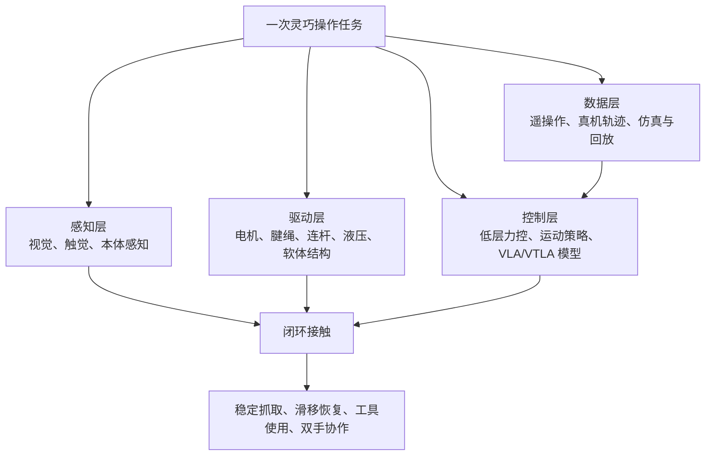

# 灵巧手不可能三角：300 美元级开源手，改写了什么

灵巧手的热闹，很容易被一个数字带偏：300 美元。

这个数字确实重要。TetherIA 的 Aero Hand Open 把一只五指、腱绳驱动、可复现的开源手做到 314 美元级，足够让实验室、学校、独立开发者不再把灵巧手当成只能远观的设备。但它真正改写的不是“低价硬件直接追平 Shadow Robot”，而是把灵巧操作研究的迭代单位，从“少数实验室手里一两台昂贵设备”，改成“更多团队能买、能拆、能坏、能修、能采数据的硬件底座”。

这篇文章以硅谷 101《[当机器人学会开可乐：深聊灵巧手的“不可能三角”与六大技术门派](https://www.bilibili.com/video/BV16EnizBEUY/)》为线索，结合 TetherIA、Shadow Robot、Tesla Optimus、星际光年 Gaia Hand、Sharpa Wave、LEAP Hand 和 VLA / Sim2Real 论文，回答 4 个问题：

- 为什么“开可乐”比“后空翻”更像机器人商业化的验收题。
- 灵巧手的性能、成本、可靠性为什么长期互相牵制。
- 6 条技术路线分别在牺牲什么，不要被“门派”这个词骗成单选题。
- 300 美元级开源手和 VLA 模型会先改变哪类团队，哪些场景仍然没到时候。

文中涉及公开规格与产品状态，按 2026-06-13 可核验资料整理；厂商宣传口径、媒体报道与论文结论会分开标注。凡是没有公开来源支撑的具体精度、寿命、量产时间表，不当作确定事实使用。

## 一张地图：灵巧手不是“夹爪升级版”

工业夹爪解决的是“拿住一个东西”。灵巧手解决的是“在接触过程中持续改变手与物体的关系”。这就是为什么看似日常的开瓶、拿手机、拧螺丝，会比一次漂亮的全身动作更难商业化。

一只灵巧手至少有 4 条线同时工作：

| 线索 | 它决定什么 | 常见短板 |
|---|---|---|
| 驱动 | 手指能输出多大力，速度和体积能否同时成立 | 小电机力不够，减速器贵，腱绳会磨损和松弛 |
| 传感 | 能否知道“碰到了什么、用了多大力、有没有滑” | 触觉贵、易坏，数据频率和标定难度高 |
| 控制 | 能否从“看见物体”走到“稳定完成动作” | 低层闭环、策略泛化和异常恢复经常脱节 |
| 数据 | 能否让同一只手学会更多任务 | 真机采集慢，仿真接触不稳定，跨硬件迁移困难 |

后空翻主要考验全身动力学、关节功率和轨迹控制。开可乐则多了一层麻烦：瓶盖和手指之间每一瞬间都在发生微小滑移，抓紧会压坏，抓松会打滑，拧不开还要重新调整姿态。它不是一个动作，而是一串接触反馈。

## “六大门派”更像 6 种工程取舍

视频里把灵巧手路线概括成直驱、谐波、液压、连杆、混合、开源 6 派。这个说法适合做入门地图，但要补一条边界：前 5 个主要是硬件驱动和机构路线，开源则是研发组织方式。现实产品往往混在一起，例如 TetherIA Aero Hand Open 是开源项目，同时采用腱绳驱动和欠驱动机构；Tesla Optimus 新手部也是腱绳 / 线缆思路，但不属于开源路线。

| 路线 | 典型代表 | 优先解决 | 付出的代价 |
|---|---|---|---|
| 直驱 / 准直驱 | 一些电机内置式原型、模块化关节手 | 控制简单、响应直接、维护路径短 | 手指空间太小，电机扭矩密度和散热容易卡住 |
| 谐波 / 精密减速 | DLR-HIT Hand II、部分高端实验手 | 精度、刚度、可控性 | 成本、重量、装配复杂度上升 |
| 腱绳 / 线缆 | Shadow Dexterous Hand、Tesla Optimus 新手部、TetherIA Aero Hand Open | 把执行器移出手指，换来更轻的末端和更像人手的布局 | 线缆摩擦、松弛、标定漂移和维护成本 |
| 液压 / 气动 / 软体 | Boston Dynamics 早期液压系统、软体抓取手 | 高功率密度、顺应性、安全接触 | 噪音、泄漏、维护、精细控制一致性 |
| 连杆 / 欠驱动 | 工业抓取手、低成本五指手 | 可靠、便宜、容易量产 | 单关节独立控制少，复杂在手操作受限 |
| 开源 / 模块化生态 | LEAP Hand、Aero Hand Open、GaiaHand | 降低复现和维修成本，让数据采集规模变大 | 质量一致性、售后、标定和长期可靠性需要社区或供应链补课 |

这 6 条线没有哪一条能“通吃”。Shadow Robot 的旗舰手能提供非常高的研究自由度，但采购和维护都不是消费产品的尺度；连杆和欠驱动方案便宜可靠，却很难处理复杂工具操作；开源路线让更多团队上手，但在高频触觉、长期稳定性和产品级质控上还要继续爬坡。

## 不可能三角：哪条边都不能白拿

灵巧手的不可能三角，可以拆成一句更硬的工程话：

> 想要更多自由度、更大指尖力、更细触觉和更高可靠性，就会同时增加零件数、标定成本、故障点和供应链难度。

| 目标 | 工程上通常怎么做 | 随之出现的问题 |
|---|---|---|
| 高性能 | 增加主动自由度、触觉阵列、力矩控制和高速通信 | BOM 上升，调参和标定变复杂，坏点更多 |
| 低成本 | 使用 3D 打印件、标准舵机、欠驱动和开源 PCB | 精度、寿命和批次一致性难与高端方案相比 |
| 高可靠性 | 减少自由度、做模块化快换、降低接触复杂度 | 灵巧性下降，任务范围收窄 |

这也是为什么“300 美元级开源手”不应被理解成“低价版 Shadow Robot”。更准确的看法是：它把研究成本从“不能坏”变成“坏了也能修”，把数据采集从“少量贵设备排队使用”变成“更多便宜设备并行试错”。这对 VLA 和模仿学习尤其关键，因为模型需要的不是一台完美的手，而是大量可复现、可标定、可回放的手。

## 五个坐标：Shadow、Tesla、TetherIA、Gaia、Sharpa

先把几个常被放在一起比较的坐标点摆清楚。

| 产品 / 项目 | 可核验规格 | 适合怎么看 |
|---|---|---|
| [Shadow Dexterous Hand](https://shadowrobot.com/dexterous-hand-series/) | 官方页面写明：20 个电机、腱绳驱动、20 个主动 DOF 加 4 个欠驱动运动 / 24 关节、100+ 传感器，控制和传感最高到 1 kHz，旗舰手重约 4.3 kg | 高端研究工具。它代表“性能和传感密度”这一端，不代表消费级成本 |
| Tesla Optimus 新手 / 前臂 | 2024-11-28 公开演示中，Optimus 工程负责人 Milan Kovac 提到手部 22 DOF、腕 / 前臂 3 DOF；报道同时注明演示为实时遥操作 | 量产意图强，但公开资料仍有限。可以讨论路线，不能把未公开精度和成本当事实 |
| [TetherIA Aero Hand Open](https://tetheria.github.io/aero-hand-open/) | 官方项目页写明：314 美元级、<400 g；GitHub README 写明 7 DOF、16 joints、389 g、开源硬件与固件；商店页写明约 10 N 指尖力、开合约 1 Hz | 低成本、可复现、适合研究和教育的数据底座 |
| [GaiaHand / Gaia Hand 20](https://github.com/Stella-robot/GaiaHand) | GaiaHand 开源仓库强调五指、模块化、低成本、MIT；星际光年产品页给出 Gaia Hand 20 的 20 DOF、基础版 9,998 元早鸟价 / 16,999 元日常价；媒体报道提到单关节模组 999 元 | 中国供应链把“可维修、模块化、低成本”推向产品化 |
| [Sharpa Wave](https://www.sharpa.com/) | 官方页写明 22 DOF，强调人手尺寸、结构和触觉敏感度；Wave 页面强调单指 >20 N 与 >4 Hz 手势速度的组合 | 触觉和高动态操作路线，适合观察“触觉 + VLA/VTLA”如何进入整机参考设计 |

再补一个学术开源坐标：[LEAP Hand](https://leaphand.com/) 在 2023 年已经把 16 DOF 低成本灵巧手做到约 2,000 美元，并强调 4 小时可组装、可用于遥操作、被动视频学习和 Sim2Real。TetherIA 把价格继续压低，GaiaHand 把模块化和中国供应链放进同一套叙事里。2026 年的变化不是某一家突然“发明了灵巧手”，而是低价可复现硬件开始扎堆出现。

## 300 美元级开源手到底改写了什么

TetherIA Aero Hand Open 的公开 Demo 包括从平面拿起 iPhone、抓 M5 螺丝、扣动电钻扳机、打开汽水罐。它们分别测到不同能力：

| Demo | 主要测试 | 不能推出什么 |
|---|---|---|
| 拿 iPhone | 平面拾取、接触顺应性、抓握姿态 | 不能说明能长期处理所有薄片物体 |
| 抓 M5 螺丝 | 指尖定位、欠驱动手指的可控性 | 不能说明具备工业装配级重复精度 |
| 扣动电钻扳机 | 指尖力、单指动作幅度、工具交互 | 不能说明能稳定完成复杂工具任务 |
| 开汽水 / 可乐 | 多指协同、滑移处理、腕部配合 | 不能说明家庭环境里的通用开盖能力已经解决 |

这些 Demo 的价值在于证明一件事：低成本手不再只能“摆姿势”。它已经能参与真实物体操作，足够用于采集数据、测试控制策略、训练学生和快速验证算法。

但它没有消除高端手的意义。Shadow 这类研究手依然在传感密度、控制频率、可扩展性和成熟集成上有优势；Sharpa 这类触觉手在高分辨率触觉上走另一条路；Tesla 的路线则关心整机、前臂、布线、量产和维护闭环。开源手改写的是“谁能参与迭代”，不是“所有硬件差距都被软件抹平”。

## VLA 与 Sim2Real：软件能补硬件，但补不了物理

VLA（Vision-Language-Action）模型让机器人把视觉、语言和动作放进同一个策略接口里。Google 的 [RT-2](https://arxiv.org/abs/2307.15818) 证明了视觉语言模型可以和机器人轨迹一起训练，把动作也表示成模型可输出的 token；[OpenVLA](https://arxiv.org/abs/2406.09246) 进一步开源了 7B 参数 VLA，并使用 97 万条真实机器人演示训练。AgiBot World 这类数据集则把规模推到 [100 台机器人、100 万+ 轨迹、100+ 场景](https://arxiv.org/html/2503.06669v2)。

对灵巧手来说，VLA 的意义不是让一个大模型每 10 毫秒直接控制每个电机。更合理的分层是：

| 层级 | 频率 | 做什么 | 典型失败 |
|---|---|---|---|
| 语义 / 任务层 | 低频 | 理解“拿起手机”“开瓶盖”“递给人” | 目标理解错、场景误判 |
| 策略 / 运动层 | 中频 | 生成抓握姿态、手腕路径、重试策略 | 迁移到新物体时动作不稳 |
| 触觉 / 力控层 | 高频 | 处理滑移、过载、接触瞬间的修正 | 传感器噪声、标定漂移、延迟 |

开源硬件和 Sim2Real 连接在中间两层。MuJoCo、Isaac Sim 这类仿真环境能便宜地产生大量接触场景，真实硬件则负责把“仿真里看起来可行”的策略筛掉。Aero Hand Open 官方文档已经提供 MuJoCo 支持和 ROS 2 / SDK 路径；Gaia Hand 也在强调 Isaac / MuJoCo 生态。这说明低价手的卖点开始从“买得起”转向“能进训练流水线”。

不过，软件补硬件有边界：

- 没有触觉或力反馈，模型只能猜接触状态。
- 腱绳长期松弛、摩擦变化和舵机批次差异，不能靠一次训练永远解决。
- 仿真接触再好，也会在真实材料、湿滑表面、形变物体上露出差距。
- Demo 成功率不等于 24 小时产线可靠性，更不等于家庭场景安全性。

这几条边界不扫兴，反而是判断 2026 年灵巧手行业的关键。真正值得追踪的不是“某只手又完成了一个视频 Demo”，而是同一只手能否在可复现的测试集上，把成功率、失败原因和维修成本连续记录下来。

## 一次“开可乐”任务如何流过系统

以“打开一瓶可乐”为例，抽象一点看，任务会经过这条链路：

1. 视觉先确定瓶身、瓶盖和桌面的相对位置，估计瓶盖朝向。
2. 策略层生成预抓姿态：哪几根手指固定瓶盖，手腕从哪个方向提供旋转。
3. 手指闭合时，触觉或电流反馈判断是否已经接触、是否滑移。
4. 低层控制器限制指尖力，避免把瓶身压坏或让瓶盖打滑。
5. 手腕开始旋转；如果扭矩变化不符合预期，策略层决定加力、换姿态或重新抓。
6. 瓶盖松动后，系统切换成低力保持，避免继续挤压或把瓶子带倒。
7. 任务结束后记录轨迹：成功 / 失败、滑移时刻、重试次数、力控曲线和视觉帧。

这条链路里，硬件、模型和数据谁都不能缺席。硬件负责把力真实施加到物体上；触觉负责告诉系统“接触是不是按计划发生”；模型负责把失败转成下一次尝试；数据负责让第 100 次尝试比第 1 次更稳。

所以“开可乐比后空翻难 10 倍”这句话可以换成更工程化的说法：后空翻难在大功率和稳定轨迹，开可乐难在接触状态不断变化。前者像一次高能动作，后者像一段带错误恢复的闭环程序。

## 2026 年到底是突破年，还是瓶颈年

答案取决于你看哪一层。

如果看“普通家庭机器人”，2026 年仍然太早。可靠性、安全认证、清洁维护、儿童和宠物共处、异常物体处理，都不是一个开源硬件价格能解决的。

如果看“灵巧操作研究和具身智能数据采集”，2026 年已经明显变了。判断依据有 5 条：

- 低价手开始支持完整的 CAD、PCB、固件、SDK、ROS 2 和仿真路径。
- 7B 级 VLA 模型和百万轨迹数据集给策略迁移提供了共同语言。
- 模块化关节、3D 打印件和标准件降低了维修恐惧。
- 触觉路线重新升温，Sharpa、Tesla、星际光年等都把触觉放进产品叙事。
- 评估指标正在从“能不能拍 Demo”转向“成功率、可复现、可维修、可量产”。

这就是开源手的位置：它不是家庭机器人的最后答案，而是让更多团队开始生成问题、数据和失败样本的入口。

## 怎么选：不同团队的采用顺序

如果你是高校实验室，优先选能进仿真、能遥操作、能维修的开源手。Aero Hand Open、LEAP Hand、GaiaHand 这类平台的意义在于课程、论文和数据流水线，不在于一次性买到最高性能。

如果你是机器人创业团队，先想清楚任务边界。仓储分拣、3C 装配、餐饮后厨、零售补货，需要的手不一样。能用二指夹爪解决的任务，不要为了“人形”强行上五指手。

如果你是整机厂，灵巧手不是末端配件，而是前臂、腕部、布线、热管理、控制器和数据系统的一部分。Tesla 把执行器后移到前臂的思路值得看，难点也在这里：手越像人，手之外的系统越重。

如果你关注家庭机器人，先看 3 个指标：连续运行多久不需要维护，失败时能不能安全停下，用户能否在家里完成低成本维修。价格下降是必要条件，不是充分条件。

## 结语：拐点不在“谁赢”，在“谁能持续迭代”

灵巧手过去像一个昂贵的研究符号：看起来接近人手，买起来远离普通团队。2026 年的新变化，是低价开源硬件、模块化供应链、VLA 模型和大规模数据集开始咬合。

Shadow Robot 仍然代表高端研究工具的上限；Tesla 让行业看到整机量产语境下的手 / 前臂一体化；TetherIA、LEAP、GaiaHand 把复现门槛压低；Sharpa 这类触觉路线提醒大家，真正稳定的灵巧操作离不开接触反馈。

家庭机器人不会因为 300 美元级灵巧手立刻到来。更可能发生的是：未来两三年，学校、实验室、创业团队和整机厂先拿这些手建立数据飞轮。等一只手不仅能开可乐，还能解释为什么这次没开成、下一次该怎么修正、坏了哪里该换，灵巧手才会从演示台走向日常工作台。

## 参考与延伸

- 硅谷 101：[当机器人学会开可乐：深聊灵巧手的“不可能三角”与六大技术门派](https://www.bilibili.com/video/BV16EnizBEUY/)
- TetherIA：[Aero Hand Open 项目页](https://tetheria.github.io/aero-hand-open/)、[GitHub 仓库](https://github.com/TetherIA/aero-hand-open)、[官方文档](https://docs.tetheria.ai/docs/intro/)
- Shadow Robot：[Dexterous Hand Series](https://shadowrobot.com/dexterous-hand-series/)
- Tesla Optimus 新手部报道：[Optimus new hand upgrade includes 22 degrees of freedom](https://cybernews.com/entertainment/optimus-new-hand-upgrade/)
- 星际光年：[GaiaHand 开源仓库](https://github.com/Stella-robot/GaiaHand)、[Gaia Hand 20 产品页](https://www.stella-robot.com/sys-nd/9.html)、[读特报道](https://www.dutenews.com/n/article/10521474)
- Sharpa：[Sharpa Wave](https://www.sharpa.com/pages/wave)、[NVIDIA Isaac GR00T 参考设计合作新闻](https://www.sharpa.com/blogs/news/sharpa-brings-dexterous-tactile-manipulation-to-the-nvidia)
- DLR：[DLR-HIT Hand II](https://www.dlr.de/en/rm/research/robotic-systems/hands/dlr-hit-hand-ii)
- LEAP Hand：[项目页](https://leaphand.com/)、[CMU 报道](https://www.cs.cmu.edu/news/2023/leap-hand)
- VLA 与数据集：[RT-2](https://arxiv.org/abs/2307.15818)、[OpenVLA](https://arxiv.org/abs/2406.09246)、[AgiBot World Colosseo](https://arxiv.org/html/2503.06669v2)
