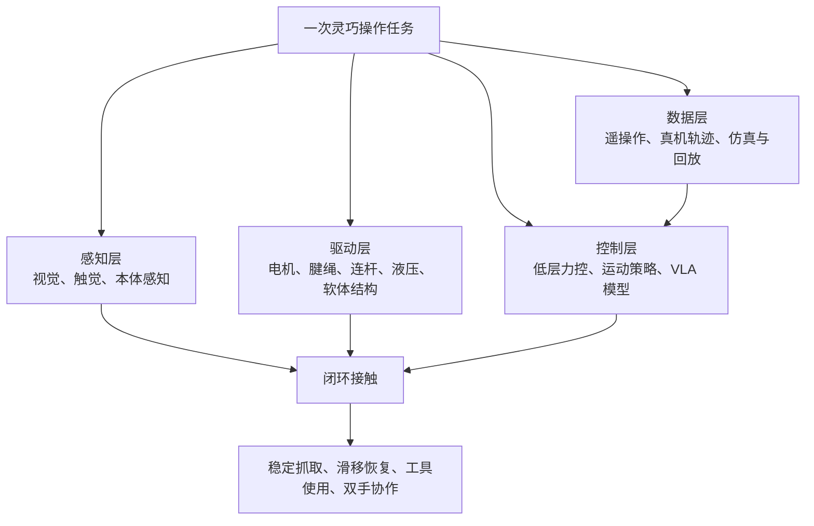

# 灵巧手不可能三角：300 美元级开源手，改写了什么

先给判断：300 美元级开源灵巧手改写的不是性能上限，而是「谁能参与迭代」。Shadow 这样的旗舰手在传感密度和控制频率上仍然一骑绝尘；变化在于，过去一只够格进实验室的灵巧手贵过一辆汽车，如今一个课题组的经费就能把五指手放上桌面，跑数据、跑算法、带学生。门槛落到这个位置，行业的数据飞轮才转得起来。

全文沿「不可能三角」这个框架展开——性能、成本、可靠性三者最多同时拿到两样：先看六条技术路线各自押注什么、放弃什么，再对比五个代表性产品与项目的规格坐标，然后拆解一只 300 美元级的手的公开 Demo 能证明什么、不能证明什么，最后给 VLA 模型与仿真训练在这幅图景里定位。

## 先画地图：灵巧手不是「夹爪升级版」

工业夹爪解决的是「拿住一个东西」，灵巧手解决的是「在接触过程中持续改变手与物体的关系」。开瓶盖、拿手机、拧螺丝这些日常动作迟迟难以商业化，原因就在这里：它们是连续的接触状态变化，任何一层能力掉链子，任务就失败。

一次灵巧操作会同时动用四层能力：

```mermaid
flowchart TB
    Task[一次灵巧操作任务] --> Perception[感知层<br/>视觉、触觉、本体感知]
    Task --> Actuation[驱动层<br/>电机、腱绳、连杆、液压、软体结构]
    Task --> Control[控制层<br/>低层力控、运动策略、VLA 模型]
    Task --> Data[数据层<br/>遥操作、真机轨迹、仿真与回放]

    Perception --> Loop[闭环接触]
    Actuation --> Loop
    Control --> Loop
    Data --> Control
    Loop --> Outcome[稳定抓取、滑移恢复、工具使用、双手协作]
```

后文反复出现的问题——某条路线为什么贵、某个 Demo 为什么不算数、VLA 为什么补不了触觉——都可以放回这四层里看。

## 六条技术路线：各自的押注与代价

「六大门派」的说法出自硅谷 101 的视频（见文末参考）。把它当 6 种工程取舍来看更准确：没有一条路线全面胜出，每一条都在用某处的代价换另一处的能力。

| 路线 | 典型代表 | 优先解决 | 付出的代价 |
|---|---|---|---|
| 直驱 / 准直驱 | 电机内置式原型、模块化关节手 | 控制简单、响应直接、维护路径短 | 手指空间太小，电机扭矩密度和散热容易卡住 |
| 谐波 / 精密减速 | DLR-HIT Hand II、部分高端实验手 | 精度、刚度、可控性 | 成本、重量、装配复杂度上升 |
| 腱绳 / 线缆 | Shadow Dexterous Hand、Tesla Optimus 新手部、Aero Hand Open | 把执行器移出手指，换来更轻的末端和更像人手的布局 | 线缆摩擦、松弛、标定漂移和维护成本 |
| 液压 / 气动 / 软体 | Boston Dynamics 早期液压平台、软体抓取手 | 高功率密度、顺应性、安全接触 | 噪音、泄漏、维护、精细控制一致性 |
| 连杆 / 欠驱动 | 工业抓取手、低成本五指手 | 可靠、便宜、容易量产 | 单关节独立控制少，复杂在手操作受限 |
| 开源 / 模块化生态 | LEAP Hand、Aero Hand Open、GaiaHand | 降低复现和维修成本，让数据采集规模变大 | 质量一致性、售后、标定和长期可靠性需要社区或供应链补课 |

## 不可能三角：哪条边都不能白拿

自由度、指尖力、触觉、可靠性，每一样都要用零件数、标定成本、故障点和供应链难度去换。

| 目标 | 工程上通常怎么做 | 随之出现的问题 |
|---|---|---|
| 高性能 | 增加主动自由度、触觉阵列、力矩控制和高速通信 | BOM 上升，调参和标定变复杂，坏点更多 |
| 低成本 | 使用 3D 打印件、标准舵机、欠驱动和开源 PCB | 精度、寿命和批次一致性难与高端方案相比 |
| 高可靠性 | 减少自由度、做模块化快换、降低接触复杂度 | 灵巧性下降，任务范围收窄 |

高端手和低价手分别站在三角形的两个顶点上：Shadow 用重量和价格换性能与传感密度，开源手用规格换成本和可维修性。真正难的是在中间找位置的量产路线——Tesla 的答案是靠整机一体化摊薄成本，Sharpa 的答案是先在触觉上建立差异化。

## 五个坐标：Shadow、Tesla、TetherIA、Gaia、Sharpa

下面五个产品与项目覆盖了三角形的顶点和两条中间路线。规格全部取自官方页面、README 或一手报道，可以直接核对。

| 产品 / 项目 | 可核验规格 | 适合怎么看 |
|---|---|---|
| [Shadow Dexterous Hand](https://shadowrobot.com/dexterous-hand-series/) | 官方页面写明：20 个电机、腱绳驱动、24 关节（20 主动 + 4 欠驱动）、100+ 传感器、控制与传感最高 1 kHz、整机约 4.3 kg | 高端研究工具，「性能 + 传感密度」这一端的天花板，与消费级成本无关 |
| Tesla Optimus 新手 / 前臂 | 2024-11-28 公开演示，工程负责人 Milan Kovac 透露：手部 22 个自由度（约为前代的两倍）、腕/前臂 3 个；演示为实时遥操作 | 量产语境下「手 + 前臂一体化」的代表；公开资料仍有限，未公布的精度和成本不能当事实引用 |
| [Aero Hand Open](https://chestnut-robotics.github.io/aero-hand-open/)（Chestnut Robotics，原 TetherIA） | 项目页写明：314 美元、389 g、7 个主动自由度、16 个关节；[官方文档](https://docs.tetheria.ai/docs/intro/)写明：指尖力约 12 N、全开全合约 1.2 Hz；开源硬件与固件 | 低成本、可复现，适合研究和教育场景的数据底座 |
| [Gaia Hand](https://github.com/Stella-robot/GaiaHand)（星际光年） | 开源仓库（MIT 协议）对应 15 自由度版本；商品版 Gaia Hand 20 为 16 主动 + 4 被动自由度，早鸟价 9,998 元、日常价 16,999 元；媒体报道提到单关节模组 999 元 | 中国供应链把「可维修、模块化、低成本」推进到产品化 |
| [Sharpa Wave](https://www.sharpa.com/pages/wave) | 官方规格表写明：22 个主动自由度；单指力最高 20 N、动作速度最高 4 Hz（分高低配置档） | 触觉 + 高动态操作路线，观察「触觉 + VLA」进入整机参考设计的样本 |

## 300 美元级的手，Demo 能证明什么

Aero Hand Open 的公开 Demo 包括：从平面拿起 iPhone、抓 M5 螺丝、扣动电钻扳机、打开汽水罐。四项分别测到不同能力，也各有不能推出的结论：

| Demo | 主要测试 | 不能推出什么 |
|---|---|---|
| 拿 iPhone | 平面拾取、接触顺应性、抓握姿态 | 不能说明能长期处理所有薄片物体 |
| 抓 M5 螺丝 | 指尖定位、欠驱动手指的可控性 | 不能说明具备工业装配级重复精度 |
| 扣动电钻扳机 | 指尖力、单指动作幅度、工具交互 | 不能说明能稳定完成复杂工具任务 |
| 开汽水罐 | 多指协同、滑移处理、腕部配合 | 不能说明家庭环境里的通用开盖能力已经解决 |

这组 Demo 的价值在一条底线上：低价手不再只能「摆姿势」。它已经能参与真实物体操作，够用于数据采集、控制策略验证、学生训练和快速迭代——这正是「谁能参与迭代」被改写的具体含义。

## VLA 与 Sim2Real：软件补不了物理

VLA（Vision-Language-Action，视觉-语言-动作模型）把视觉、语言和动作放进同一个策略接口。三个节点值得记住：Google 的 [RT-2](https://arxiv.org/abs/2307.15818) 证明视觉语言模型可以把动作表示成 token、与网络知识一起训练；[OpenVLA](https://arxiv.org/abs/2406.09246) 开源了 7B 参数模型，用 97 万条真实机器人演示训练；[AgiBot World](https://arxiv.org/html/2503.06669v2) 数据集把规模推到 100 台机器人、100 万+ 轨迹、100+ 场景。

对灵巧手来说，VLA 的意义不是让一个大模型每 10 毫秒直接控制每个电机。合理的分工是分层的：

| 层级 | 频率 | 做什么 | 典型失败 |
|---|---|---|---|
| 语义 / 任务层 | 低频 | 理解「拿起手机」「开瓶盖」「递给人」 | 目标理解错、场景误判 |
| 策略 / 运动层 | 中频 | 生成抓握姿态、手腕路径、重试策略 | 迁移到新物体时动作不稳 |
| 触觉 / 力控层 | 高频 | 处理滑移、过载、接触瞬间的修正 | 传感器噪声、标定漂移、延迟 |

这张表也回答了一个常见误解：VLA 替代不了触觉。触觉是物理信号，没有传感器就没有输入，模型只能在触觉数据之上做策略调整。这也是触觉路线（Sharpa、Tesla、星际光年）在 2026 年集体升温的原因——模型越强，触觉输入的瓶颈效应越明显。

## 一次「开可乐」任务流过系统的样子

把前文的机制串起来，看「打开一瓶可乐」这条链路怎么走（抽象流程，不对应任何具体产品的实现）：

1. 视觉确定瓶身、瓶盖和桌面的相对位置，估计瓶盖朝向。
2. 策略层生成预抓姿态：哪几根手指固定瓶盖，手腕从哪个方向提供旋转。
3. 手指闭合时，触觉或电流反馈判断是否已经接触、是否滑移。
4. 低层控制器限制指尖力，避免压坏瓶身或让瓶盖打滑。
5. 手腕开始旋转；扭矩变化不符合预期时，策略层决定加力、换姿态或重新抓。
6. 瓶盖松动后，系统切换成低力保持，避免继续挤压或把瓶子带倒。
7. 任务结束后记录轨迹：成功 / 失败、滑移时刻、重试次数、力控曲线和视觉帧。

第 3、5、6 步任何一步失手都要回到第 2 步重来——真实系统里这类任务的成功率瓶颈通常不在「抓没抓住」，而在接触状态变化的每一步都要闭环。后空翻可以靠全身动力学一次成型，开可乐不行，工程难度反而更高。

## 2026 年：突破还是瓶颈，取决于看哪一层

家庭场景仍然太早。可靠性、安全认证、清洁维护、儿童宠物共处、异常物体处理，都不是一个开源硬件价格能解决的问题。

灵巧操作研究和数据采集，2026 年已经明显不同。判断依据有 5 条：

- 低价手开始支持完整的 CAD、PCB、固件、SDK、ROS 2 和仿真路径。
- 7B 级 VLA 模型和百万轨迹数据集给策略迁移提供了共同语言。
- 模块化关节、3D 打印件和标准件降低了维修恐惧。
- 触觉路线重新升温，Sharpa、Tesla、星际光年都把触觉放进产品叙事。
- 评估指标正在从「能不能拍 Demo」转向「成功率、可复现、可维修、可量产」。

最有分量的是最后一条：行业开始用工程标准而不是营销标准要求灵巧手，这才是「拐点」的可靠信号。

## 怎么选：不同团队的采用顺序

| 团队类型 | 推荐方案 | 原因 |
|---|---|---|
| **高校实验室** | Aero Hand Open、LEAP Hand、GaiaHand | 能进仿真、能遥操作、能维修。LEAP Hand 整机 2000 美元以下、16 个全驱动自由度，出自 CMU 团队（RSS 2023） |
| **机器人创业团队** | 按任务边界在二指夹爪和五指手之间选 | 能用二指夹爪解决的任务，不要为了「人形」强行上五指手 |
| **整机厂** | Tesla 式手 / 前臂一体化 | 灵巧手不是末端配件，而是前臂、腕部、布线、热管理、控制器和数据系统的一部分 |
| **家庭机器人关注者** | 先看三个指标：连续运行多久不需要维护、失败时能否安全停下、用户能否在家低成本完成维修 | 价格下降是必要条件，不是充分条件 |

一个经验判断：开源手的维护优势——模块化、标准件、可 3D 打印替换——能不能兑现，取决于社区活跃度和供应链成熟度，而不是开源协议本身。选型之前先看仓库的 issue 响应速度和备件渠道。

## 结语：拐点不在「谁赢」，在「谁能持续迭代」

灵巧手过去像一个昂贵的研究符号：看起来接近人手，买起来远离普通团队。2026 年的变化，是低价开源硬件、模块化供应链、VLA 模型和大规模数据集开始咬合。

Shadow 仍然代表高端研究工具的上限；Tesla 展示了整机量产语境下的手 / 前臂一体化；Aero Hand Open、LEAP Hand、GaiaHand 把复现门槛压到课题组预算之内；Sharpa 这类触觉路线提醒所有人，稳定的灵巧操作离不开接触反馈。

家庭机器人不会因为一只 300 美元的手立刻到来。更可能发生的是：未来两三年，学校、实验室、创业团队和整机厂先拿这些手建立数据飞轮。等一只手不仅能开可乐，还能解释为什么这次没开成、下一次该怎么修正、坏了该换哪个零件，灵巧手才会从演示台走向工作台。

## 参考与延伸

- 硅谷 101：[当机器人学会开可乐：深聊灵巧手的「不可能三角」与六大技术门派](https://www.bilibili.com/video/BV16EnizBEUY/)（B 站视频，2025-09-29）
- Chestnut Robotics（原 TetherIA）：[Aero Hand Open 项目页](https://chestnut-robotics.github.io/aero-hand-open/)、[GitHub 仓库](https://github.com/Chestnut-Robotics/aero-hand-open)、[官方文档](https://docs.tetheria.ai/docs/intro/)
- Shadow Robot：[Dexterous Hand Series](https://shadowrobot.com/dexterous-hand-series/)
- Tesla Optimus：[Optimus' new hand upgrade includes 22 degrees of freedom](https://cybernews.com/entertainment/optimus-new-hand-upgrade/)（Cybernews，2024-11-29）
- 星际光年：[GaiaHand 开源仓库](https://github.com/Stella-robot/GaiaHand)、[Gaia Hand 20 产品页](https://www.stella-robot.com/sys-nd/9.html)
- Sharpa：[Sharpa Wave 规格页](https://www.sharpa.com/pages/wave)
- LEAP Hand：[项目页](https://leaphand.com/)、[论文（RSS 2023）](https://arxiv.org/abs/2309.06440)
- VLA 与数据集：[RT-2](https://arxiv.org/abs/2307.15818)、[OpenVLA](https://arxiv.org/abs/2406.09246)、[AgiBot World Colosseo](https://arxiv.org/html/2503.06669v2)
