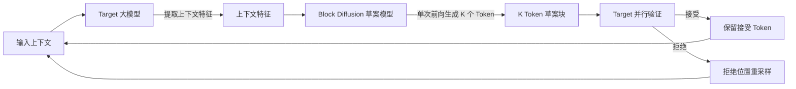

DFlash 想解决的，不是把 LLM 生成加速一圈，而是推测解码里最靠串行的那一段——草案生成。传统推测解码用一个小自回归模型来起草，起草本身仍要一步步走；DFlash 把草案模型换成块扩散模型，一次前向就"恢复"出一整块 Token，再由目标模型并行验收。论文报告在典型配置下做到 6 倍以上的无损加速，比当下 SOTA 的 EAGLE-3 最多快 2.5 倍。

数据与代码来自 [z-lab/dflash](https://github.com/z-lab/dflash)、论文 [arXiv:2602.06036](https://arxiv.org/abs/2602.06036) 与 Hugging Face 模型集合，本次核验日期 2026-08-20。

## 学习目标

读完本文后，你应该能：

- 说清 DFlash 与传统草案模型在生成方式上的差异，以及这一差异卡住了什么瓶颈
- 解释上下文特征条件化为什么能抬高接受率，并知道接受率与加速比的关系
- 正确解读论文的加速数字：6 倍测的是什么、2.5 倍相对谁、两者都不能推出什么
- 根据模型家族与后端支持表，判断自己的目标模型能否接入、该走哪条后端

## 目录

- [一、它解决的是哪一段瓶颈](#一它解决的是哪一段瓶颈)
- [二、系统总览](#二系统总览)
- [三、核心机制](#三核心机制)
- [四、一次任务如何流过系统](#四一次任务如何流过系统)
- [五、加速多少，怎么读这些数字](#五加速多少怎么读这些数字)
- [六、支持的模型与接入方式](#六支持的模型与接入方式)
- [七、DFlash 2：并行起草的新一代](#七dflash-2并行起草的新一代)
- [八、起步](#八起步)
- [九、适用边界与采用顺序](#九适用边界与采用顺序)
- [十、常见问题](#十常见问题)
- [十一、自测题](#十一自测题)
- [结语](#结语)
- [相关资源](#相关资源)

## 一、它解决的是哪一段瓶颈

推测解码（Speculative Decoding）的思路分两步：先用一个轻量草案模型（draft model）快速吐出 K 个候选 Token，再让目标大模型并行验证，接受正确、拒绝错误并重采样。这条路径的每个环节都算得通，但有个容易被忽略的短板——草案模型本身是自回归的。

自回归解码每生成一个 Token 都要等前一个结算完，GPU 在长序列下大量时间花在等待上，利用率起不来。推测解码用小模型先起草，目标模型并行验证，把"串行生成"换成了"并行验证"，所以理论上能提吞吐、不降质量。可草案模型只要还是自回归，起草 K 个 Token 就得串行跑 K 步；起草越快，这个串行段占的时间比重越大，加速的天花板就被它压住。

DFlash 的取舍很直接：把草案这一环也改成一次前向出整块，串行段就只剩下扩散模型本身的那几步。

## 二、系统总览

DFlash 的链路里有两条并行机会，一条在草案生成，一条在验证。先看整体怎么流动：



关键在两条特征：一是草案模型用"块扩散"方式一次生成整块 Token，不再逐 Token 自回归；二是草案模型被目标模型的上下文特征条件化，特征质量直接决定接受率，而接受率决定最终加速比。这两条是 DFlash 区别于传统草案模型的核心。

## 三、核心机制

### 3.1 一次前向出整块

扩散模型把"生成"看成从噪声里一步步还原信号。图像生成场景里，它一次还原整幅图，而不是一个像素一个像素先生成。DFlash 把这个思路搬到 Token 序列上：把一整块 Token 当作待还原的信号，草案模型从噪声出发，一次前向把整块候选 Token 恢复出来。

对比自回归草案的 K 步串行，块扩散把这块的生成成本压到单次前向附近。代价是扩散本身有降噪步数，草案模型也得更小、更轻，否则省下的时间又会被扩散开销吃回去。

### 3.2 草案被目标特征条件化

单靠"块扩散"并不能保证草案质量。DFlash 让草案模型接收从目标模型提取的上下文特征——也就是大模型在评估当前输入时产生的那层中间表示。草案读了这层特征再起草，相当于"先理解目标在期待什么，再往下续"。

这是论文里把它和普通扩散草案区分开的关键点，也是接受率能提上去的原因：草案越贴近目标模型会接什么，验证阶段被拒绝的 Token 就越少，一次能向前推进的步数就越多，加速比就越接近理论值。

### 3.3 验证仍由目标模型负责

草案只是候选，最终把关的还是目标模型。目标模型拿到"原始上下文 + 草案块"后并行验证每个 Token：接受的保留，拒绝的位置触发重采样。因为验证严格按目标模型自己的分布来，这套机制保持推测解码的"无损"性质——输出在统计上与纯自回归一致，不因提速而改变质量。

## 四、一次任务如何流过系统

以服务端后端跑 Qwen3.5-27B 为例，`num_speculative_tokens`（候选块长度）设 15：

1. 用户输入进入目标模型，模型算出一层上下文特征。
2. 特征喂给 DFlash 草案模型，草案单次前向吐出 15 个候选 Token。
3. 目标模型把这 15 个候选与原始上下文一起并行验证，接受一部分、拒绝一部分。
4. 接受的前缀直接输出；第一个被拒绝的位置之后重采样，这段替换为真实生成。
5. 当前缀推进后，用新的上下文特征重新起草下一块，循环往复。

这个例子说明一点：DFlash 的收益不是"每块全对"，而是"每块里接受得多、拒绝得少"。接受率上不去，扩散草案省下的起草时间会被反复重采样抵消。

## 五、加速多少，怎么读这些数字

论文报告在 gsm8k、math500、humaneval、mbpp、mt-bench 等数据集上，DFlash 做到超过 6 倍的无损加速，并比 EAGLE-3 最多快 2.5 倍。

先说要测的是什么：这是端到端的推测解码加速比，也就是"纯自回归的时间 ÷ 用 DFlash 的时间"，且是无损口径——输出 token 的分布要和自回归一致才算数。6 倍是相对自回归的提升，不是相对 EAGLE-3 的提升；2.5 倍那个数字才是和 EAGLE-3 的横向对比。

因此有几件事不能从论文数字直接推出来：

- 不是所有模型、任务都有 6 倍。加速依赖接受率、目标模型大小、生成长度；小模型、短生成、接受率低的场景收益明显变小。
- 6 倍是论文评测配置下的结果（含具体草案、上下文长度、批处理方式），部署时要在自己的模型和流量上重测。
- 无损是对"输出质量"而言，不意味着推理路径本身没有额外开销；草案模型和扩散步数都要占显存和算力。

## 六、支持的模型与接入方式

DFlash 草案模型覆盖主流开源家族，官方按家族维护公开权重：

| 目标家族 | 可用草案 |
|---|---|
| Qwen | Qwen3.6（27B、35B-A3B）、Qwen3.5（4B、9B、27B、35B-A3B、122B-A10B、397B-A17B）、Qwen3（4B/8B 非思考、Coder-Next、Coder-30B-A3B） |
| Gemma | Gemma 4（12B、31B、26B-A4B） |
| MiniMax | M2.5、M2.7 |
| Kimi | K2.5、K2.6、K2.7-Code |
| 其他 | GPT-OSS（20B、120B）、Llama-3.1-8B、GLM 5.1、Alpamayo 1.5/R1（10B） |

完整权重列表见 [DFlash 模型集合](https://huggingface.co/collections/z-lab/dflash)，具体检查点以集合页为准，不要依赖本文的概括做自动化判断。

接入后端按场景分两类：本地推理与服务端部署。

| 后端 | 定位 | 说明 |
|---|---|---|
| Transformers | 本地快速验证 | 支持 DFlash 2 的 Muse-Glimmer-30B，以及 DFlash 的 Qwen3、Llama-3.1-8B |
| MLX | Apple Silicon 原生 | 支持 DFlash 2 的 Qwen3.8-27B，以及 DFlash 的 Qwen3、Qwen3.5、Qwen3.6、Gemma 4 |
| SGLang | 服务端部署 | 需使用合入 DFlash 支持的版本（[PR #35371](https://github.com/sgl-project/sglang/pull/35371)） |
| vLLM | 服务端部署 | 需使用合入 DFlash 支持的版本（[PR #52816](https://github.com/vllm-project/vllm/pull/52816)） |
| oMLX | Apple Silicon 服务端 | 专用构建，见官方发布页 |
| llama.cpp | 轻量部署 | 需使用合入 DFlash 支持的版本（[PR #27342](https://github.com/ggml-org/llama.cpp/pull/27342)） |

模型家族与后端支持都在持续扩展，接入前先到仓库 README 确认当前口径。

## 七、DFlash 2：并行起草的新一代

2026 年 8 月，官方发布 DFlash 2，延续"草案并行"的路线，首批权重为 Muse-Glimmer-30B 与 Qwen3.8-27B 两个检查点（见 [DFlash 2 集合](https://huggingface.co/collections/z-lab/dflash-2)）。

DFlash 2 把草案模型和推理强度（reasoning strength / reasoning effort）绑定：Muse 走 `reasoning_strength`，Qwen3.8 走 `reasoning_effort`，两者都有 low / medium / high / xhigh 四档，默认取中高档，让"草案多费一点算力换更高接受率"这件事变得可调。

接入差异集中在后端：Muse-Glimmer-30B 走 Transformers 后端，Qwen3.8-27B 走 MLX 后端。官方在 DFlash 2 上报告了更长的生成例（见仓库首页视频），但骨架和初版一致——块扩散草案 + 目标模型上下文条件化 + 并行验证，没有另起炉灶。对已跑通初版的团队，DFlash 2 的迁移点主要是草案模型和 CLI 参数名，不是架构。

## 八、起步

基础包只含 OpenAI 兼容的调用能力；本地推理需要额外装 MLX（Apple Silicon）或 Transformers（Linux）：

```bash
pip install dflash
pip install "dflash[local]"   # 本地推理：MLX + Transformers
```

Transformers 后端跑 DFlash 2 的 Muse-Glimmer-30B（草案用 `--draft` 指定，目标模型用 `--model`）：

```bash
dflash generate transformers \
  --model meta-models/Muse-Glimmer-30B \
  --draft z-lab/Muse-Glimmer-30B-DFlash2 \
  --reasoning high --temperature 1 --top-p 0.95 --top-k 64 \
  "How many positive whole-number divisors does 196 have?"
```

MLX 后端跑 DFlash 2 的 Qwen3.8-27B。量化目标或草案时建议 `block_size <= 5`，否则 MLX 当前的量化矩阵乘核在更宽验证宽度下效率会掉：

```bash
dflash generate mlx \
  --model mlx-community/Qwen3.8-27B-4bit \
  --draft z-lab/Qwen3.8-27B-DFlash2 \
  --draft-bits 4 --block-size 5 --reasoning xhigh \
  "How many positive whole-number divisors does 196 have?"
```

生产环境通常先起一个支持 DFlash 的 SGLang 或 vLLM 服务，再用 OpenAI 兼容方式接入：

```bash
dflash generate openai \
  --base-url http://127.0.0.1:8000 --model Qwen/Qwen3.8-27B \
  "How many positive whole-number divisors does 196 have?"
```

评测也走同一套接口，用 `dflash benchmark` 可以复现论文口径的加速比：

```bash
dflash benchmark openai \
  --base-url http://127.0.0.1:8000 --model Qwen/Qwen3.8-27B \
  --dataset gsm8k --num-prompts 128 --concurrency 1 --reasoning xhigh \
  --temperature 1 --top-p 0.95 --top-k 20
```

## 九、适用边界与采用顺序

先看什么时候值得用 DFlash：

- 目标是长序列生成，文章、代码、长对话这类生成长度占大头、串行段占比高的任务。
- 把加速看作吞吐或时延敏感的服务端优化，而不是单次小请求的优化。
- 目标模型在官方支持列表里，草案模型现成可下，不用自己训。

可以缓一缓的情况：

- 目标模型不在列表里，得等训练配方开源再自己训草案，前期成本不低。
- 纯 CPU 或显存紧张的环境。草案模型和扩散步数都要占显存，省下的时间可能被内存交换吃掉。
- 极短生成任务。草案加载、扩散步数、上下文特征提取的固定开销，在小请求里可能抵消加速收益。

从接入成本排序，建议先走 Transformers 后端把效果跑通，确认接受率和加速比在自己模型上成立，再考虑 SGLang / vLLM 的服务端集成。Apple Silicon 上的 MLX 是低成本的试水路径，但加速比和 CUDA 环境不可直接类比。DFlash 2 的接入则反过来：先看你的目标模型落在哪个后端，Muse 走 Transformers、Qwen3.8 走 MLX，按对应命令直接起。

## 十、常见问题

**Q1：DFlash 和普通扩散草案模型有什么不同？**

普通扩散草案不读目标模型的上下文特征，草稿质量和接受率都上不去。DFlash 的核心差异是"目标特征条件化"，这是论文里把它和普通扩散草案区分开的关键。

**Q2：上下文特征从哪来？会增加额外计算吗？**

特征来自目标模型在评估当前输入时产生的中间表示，是目标模型前向的副产品。草案读了这层特征再起草，接受率更高，但目标模型的单次前向本身就要发生，这部分成本不是新增的。

**Q3：6 倍加速是所有人都能拿到的吗？**

不是。论文数字是评测配置下的上限，依赖接受率、目标模型大小、生成长度和草案匹配度。部署前要在自己的模型和流量上重测。

**Q4：无损是什么意思？**

输出在统计上与纯自回归一致，不因提速而改变质量。无损针对的是输出分布，不是说推理路径没有额外开销。

**Q5：我的模型不在支持列表里，能用吗？**

没有现成草案。作者称会开源训练配方，届时可以为自己跑的模型训练 DFlash 草案；在那之前只能等社区适配或自己训。

**Q6：DFlash 2 和初版选哪个？**

取决于目标模型和后端：Muse-Glimmer-30B 走 DFlash 2 + Transformers，Qwen3.8-27B 走 DFlash 2 + MLX；其余 Qwen / Gemma / MiniMax / Kimi 家族继续用初版权重。两者架构相同，不是替代关系，而是覆盖不同模型。

**Q7：接入后加速不明显，先查什么？**

按顺序排查：先确认草案模型与目标模型家族匹配，混配家族会把接受率压到接近随机；再用 `dflash benchmark` 在同数据集上量一次接受率，接受率低说明草案或上下文特征链路有问题，不是后端配置问题；最后确认任务确实以长生成为主，短请求的固定开销会吃掉大部分收益。

## 十一、自测题

1. 推测解码里，"串行段"具体指哪一段？DFlash 用什么方式把它消掉？
2. 草案被目标模型上下文特征条件化，为什么能提高接受率？
3. 论文的"6 倍无损加速"和"比 EAGLE-3 快 2.5 倍"分别是什么口径？各自不能推出什么？
4. 你的目标模型在哪个家族？应该用初版还是 DFlash 2，走哪个后端？
5. 给一个不适合用 DFlash 的场景，并说明原因。

## 结语

DFlash 的价值不在"换了个草案模型"，而在把推测解码里最串行的一环也改成并行。草案从"逐 Token 自回归"变成"一次前向出整块"，再靠目标模型的上下文特征把接受率抬上去，整条链路才真正跑出超过 6 倍的加速。它没有改变"目标模型把关"这一层，所以无损性质保住了。对已经跑长序列服务的团队，这是少有的、接入成本相对可控的加速方向；但能不能吃到这个收益，最终取决于自己的模型和任务在同一条链路上测出来的接受率。

## 相关资源

- GitHub：[z-lab/dflash](https://github.com/z-lab/dflash)（MIT 协议，Python）
- 论文：[DFlash: Block Diffusion for Flash Speculative Decoding（arXiv:2602.06036）](https://arxiv.org/abs/2602.06036)
- DFlash 博客：[z-lab.ai/projects/dflash](https://z-lab.ai/projects/dflash/)
- DFlash 2 博客：[inco.ai/blog/dflash2](https://inco.ai/blog/dflash2/)
- 模型集合：[DFlash](https://huggingface.co/collections/z-lab/dflash) 与 [DFlash 2](https://huggingface.co/collections/z-lab/dflash-2)
