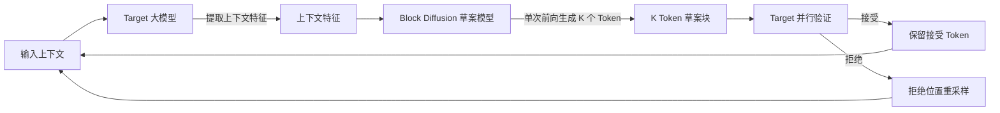

DFlash 想解决的，不是把 LLM 生成加速一圈，而是推测解码里最靠串行的那一段——草案生成。传统推测解码用一个小自回归模型来起草，起草本身仍要一步步走；DFlash 把草案模型换成块扩散模型，一次前向就"恢复"出一整块 Token，再由目标模型并行验收。论文报告在典型配置下做到 6 倍以上的无损加速，比当下 SOTA 的 EAGLE-3 最多快 2.5 倍。

数据与代码来自 [z-lab/dflash](https://github.com/z-lab/dflash)、论文 [arXiv:2602.06036](https://arxiv.org/abs/2602.06036) 与 Hugging Face 模型集合，本次核验日期 2026-08-05。

## 一、它解决的是哪一段瓶颈

推测解码（Speculative Decoding）的思路分两步：先用一个轻量草案模型快速吐出 K 个候选 Token，再让目标大模型并行验证，接受正确、拒绝错误并重采样。这条路径的每个环节都算得通，但有个容易被忽略的短板——草案模型本身是自回归的。

自回归解码每生成一个 Token 都要等前一个结算完，GPU 在长序列下大量时间花在等待上，利用率起不来。推测解码用小模型先起草，目标模型并行验证，把"串行生成"换成了"并行验证"，所以理论上能提吞吐、不降质量。可草案模型只要还是自回归，起草 K 个 Token 就得串行跑 K 步；起草越快，这个串行段占的时间比重越大，加速的天花板就被它压住。

DFlash 的取舍很直接：把草案这一环也改成一次前向出整块，串行段就只剩下扩散模型本身的那几步。

## 二、系统总览

DFlash 的链路里其实有两条并行机会，一条在草案生成，一条在验证。先看整体怎么流动：



关键在两条特征：一是草案模型用"块扩散"方式一次生成整块 Token，不再逐 Token 自回归；二是草案模型会被目标模型的上下文特征条件化，特征质量直接决定接受率，而接受率决定最终加速比。这两条是 DFlash 区别于传统草案模型的核心。

## 三、核心机制

### 3.1 一次前向出整块

扩散模型把"生成"看成从噪声里一步步还原信号。图像生成场景里，它一次还原整幅图，而不是一个像素一个像素先生成。DFlash 把这个思路搬到 Token 序列上：把一整块 Token 当作待还原的信号，草案模型从噪声出发，一次前向把整块候选 Token 恢复出来。

对比自回归草案的 K 步串行，块扩散把这块的生成成本压到单次前向附近。代价是扩散本身有降噪步数，草案模型也得更小、更轻，否则省下的时间又会被扩散开销吃回去。

### 3.2 草案被目标特征条件化

单靠"块扩散"并不能保证草案质量。DFlash 让草案模型接收从目标模型提取的上下文特征——也就是大模型在评估当前输入时产生的那层中间表示。草案读了这层特征再起草，相当于"先理解目标在期待什么，再往下续"。

这是论文里把它和普通扩散草案区分开的关键点，也是接受率能提上去的原因：草案越贴近目标模型会接什么，验证阶段被拒绝的 Token 就越少，一次能向前推进的步数就越多，加速比就越接近理论值。

### 3.3 验证仍由目标模型负责

草案只是候选，最终把关的还是目标模型。目标模型拿到"原始上下文 + 草案块"后并行验证每个 Token：接受的保留，拒绝的位置触发重采样。因为验证严格按目标模型自己的分布来，这套机制保持推测解码的"无损"性质——输出在统计上与纯自回归一致，不因提速而改变质量。

## 四、一次任务如何流过系统

以 vLLM 后端跑 Qwen3.5-27B 为例，README 里推荐草案为 `z-lab/Qwen3.5-27B-DFlash`，`num_speculative_tokens` 设 15：

1. 用户输入进入目标模型，模型算出一层上下文特征。
2. 特征喂给 DFlash 草案模型，草案单次前向吐出 15 个候选 Token。
3. 目标模型把这 15 个候选与原始上下文一起并行验证，接受一部分、拒绝一部分。
4. 接受的前缀直接输出；第一个被拒绝的位置之后重采样，这段替换为真实生成。
5. 当前缀推进后，用新的上下文特征重新起草下一块，循环往复。

这个例子说明一点：DFlash 的收益不是"每块全对"，而是"每块里接受得多、拒绝得少"。接受率上不去，扩散草案省下的起草时间会被反复重采样抵消。

## 五、加速多少，怎么读这些数字

论文报告在 gsm8k、math500、humaneval、mbpp、mt-bench 等数据集上，DFlash 做到超过 6 倍的无损加速，并比 EAGLE-3 最多快 2.5 倍。

先说要测的是什么：这是端到端的推测解码加速比，也就是"纯自回归的时间 ÷ 用 DFlash 的时间"，且是无损口径——输出 token 的分布要和自回归一致才算数。6 倍是相对自回归的提升，不是相对 EAGLE-3 的提升；2.5 倍那个数字才是和 EAGLE-3 的横向对比。

因此有几件事不能从论文数字直接推出来：

- 不是所有模型、任务都有 6 倍。加速依赖接受率、目标模型大小、生成长度；小模型、短生成、接受率低的场景收益明显变小。
- 6 倍是论文评测配置下的结果（含具体草案、上下文长度、批处理方式），部署时要在自己的模型和流量上重测。
- 无损是对"输出质量"而言，不意味着推理路径本身没有额外开销；草案模型和扩散步数都要占显存和算力。

## 六、支持的模型与接入方式

DFlash 草案模型覆盖主流开源家族，README 当前列出的映射如下：

| 目标模型 | DFlash 草案 |
|---|---|
| gemma-4-31B-it | [z-lab/gemma-4-31B-it-DFlash](https://huggingface.co/z-lab/gemma-4-31B-it-DFlash) |
| gemma-4-26B-A4B-it | [z-lab/gemma-4-26B-A4B-it-DFlash](https://huggingface.co/z-lab/gemma-4-26B-A4B-it-DFlash) |
| MiniMax-M2.7（Preview） | [z-lab/MiniMax-M2.7-DFlash](https://huggingface.co/z-lab/MiniMax-M2.7-DFlash) |
| MiniMax-M2.5（Preview） | [z-lab/MiniMax-M2.5-DFlash](https://huggingface.co/z-lab/MiniMax-M2.5-DFlash) |
| Kimi-K2.6（Preview） | [z-lab/Kimi-K2.6-DFlash](https://huggingface.co/z-lab/Kimi-K2.6-DFlash) |
| Kimi-K2.5 | [z-lab/Kimi-K2.5-DFlash](https://huggingface.co/z-lab/Kimi-K2.5-DFlash) |
| Qwen3.6-27B | [z-lab/Qwen3.6-27B-DFlash](https://huggingface.co/z-lab/Qwen3.6-27B-DFlash) |
| Qwen3.6-35B-A3B | [z-lab/Qwen3.6-35B-A3B-DFlash](https://huggingface.co/z-lab/Qwen3.6-35B-A3B-DFlash) |
| Qwen3.5-4B | [z-lab/Qwen3.5-4B-DFlash](https://huggingface.co/z-lab/Qwen3.5-4B-DFlash) |
| Qwen3.5-9B | [z-lab/Qwen3.5-9B-DFlash](https://huggingface.co/z-lab/Qwen3.5-9B-DFlash) |
| Qwen3.5-27B | [z-lab/Qwen3.5-27B-DFlash](https://huggingface.co/z-lab/Qwen3.5-27B-DFlash) |
| Qwen3.5-35B-A3B | [z-lab/Qwen3.5-35B-A3B-DFlash](https://huggingface.co/z-lab/Qwen3.5-35B-A3B-DFlash) |
| Qwen3.5-122B-A10B | [z-lab/Qwen3.5-122B-A10B-DFlash](https://huggingface.co/z-lab/Qwen3.5-122B-A10B-DFlash) |
| gpt-oss-20b | [z-lab/gpt-oss-20b-DFlash](https://huggingface.co/z-lab/gpt-oss-20b-DFlash) |
| gpt-oss-120b | [z-lab/gpt-oss-120b-DFlash](https://huggingface.co/z-lab/gpt-oss-120b-DFlash) |
| Qwen3-Coder-Next | [z-lab/Qwen3-Coder-Next-DFlash](https://huggingface.co/z-lab/Qwen3-Coder-Next-DFlash) |
| Qwen3-4B（non-thinking） | [z-lab/Qwen3-4B-DFlash-b16](https://huggingface.co/z-lab/Qwen3-4B-DFlash-b16) |
| Qwen3-8B（non-thinking） | [z-lab/Qwen3-8B-DFlash-b16](https://huggingface.co/z-lab/Qwen3-8B-DFlash-b16) |
| Qwen3-Coder-30B-A3B | [z-lab/Qwen3-Coder-30B-A3B-DFlash](https://huggingface.co/z-lab/Qwen3-Coder-30B-A3B-DFlash) |
| Llama-3.1-8B-Instruct | [z-lab/LLaMA3.1-8B-Instruct-DFlash-UltraChat](https://huggingface.co/z-lab/LLaMA3.1-8B-Instruct-DFlash-UltraChat) |

DeepSeek-V4-Flash、DeepSeek-V4-Pro、GLM-5.1 标记为 Coming soon。作者称会开源训练配方，届时可为自己跑的模型训练 DFlash 草案。

接入有四种后端，适配场景不同：

| 后端 | 说明 |
|---|---|
| Transformers | 仅 Qwen3 与 LLaMA-3.1 支持，适合快速验证 |
| SGLang | `--speculative-algorithm DFLASH`，服务端部署 |
| vLLM | v0.20.1+ 内置核心支持；Gemma4 需专用构建 |
| MLX | Apple Silicon 原生，社区已有多种实现 |

## 七、起步

仓库建议为每个后端单独建虚拟环境，从源码安装：

```bash
git clone https://github.com/z-lab/dflash.git
cd dflash
uv pip install -e ".[transformers]"
```

Transformers 后端的用法（草案模型用 `spec_generate` 直接驱动，目标模型作为参数传入）：

```python
from transformers import AutoModel, AutoModelForCausalLM, AutoTokenizer

draft = AutoModel.from_pretrained(
    "z-lab/Qwen3-8B-DFlash-b16", trust_remote_code=True,
    dtype="auto", device_map="cuda:0",
).eval()
target = AutoModelForCausalLM.from_pretrained(
    "Qwen/Qwen3-8B", dtype="auto", device_map="cuda:0",
).eval()
tokenizer = AutoTokenizer.from_pretrained("Qwen/Qwen3-8B")

messages = [{"role": "user", "content": "How many positive whole-number divisors does 196 have?"}]
input_ids = tokenizer.apply_chat_template(
    messages, return_tensors="pt", add_generation_prompt=True,
    enable_thinking=False,
).to(draft.device)

output = draft.spec_generate(
    input_ids=input_ids, max_new_tokens=2048, temperature=0.0,
    target=target, stop_token_ids=[tokenizer.eos_token_id],
)
print(tokenizer.decode(output[0], skip_special_tokens=False))
```

生产环境通常走服务端。vLLM 的接入是在启动参数里挂 `--speculative-config`：

```bash
vllm serve Qwen/Qwen3.5-27B \
  --speculative-config '{"method": "dflash", "model": "z-lab/Qwen3.5-27B-DFlash", "num_speculative_tokens": 15}' \
  --attention-backend flash_attn \
  --max-num-batched-tokens 32768
```

## 八、适用边界与采用顺序

先看什么时候值得用 DFlash：

- 目标是长序列生成，文章、代码、长对话这类生成长度占大头、串行段占比高的任务。
- 把加速看作吞吐或时延敏感的服务端优化，而不是单次小请求的优化。
- 目标模型在官方支持列表里，草案模型现成可下，不用自己训。

可以缓一缓的情况：

- 目标模型不在列表里，得等训练配方开源再自己训草案，前期成本不低。
- 纯 CPU 或显存紧张的环境。草案模型和扩散步数都要占显存，省下的时间可能被内存交换吃掉。
- 极短生成任务。草案加载、扩散步数、上下文特征提取的固定开销，在小请求里可能抵消加速收益。

从接入成本排序，建议先走 Transformers 后端把效果跑通，确认接受率和加速比在自己模型上成立，再考虑 SGLang / vLLM 的服务端集成。Apple Silicon 上的 MLX 是低成本的试水路径，但加速比和 CUDA 环境不可直接类比。

## 结语

DFlash 的价值不在"换了个草案模型"，而在把推测解码里最串行的一环也改成并行。草案从"逐 Token 自回归"变成"一次前向出整块"，再靠目标模型的上下文特征把接受率抬上去，整条链路才真正跑出超过 6 倍的加速。它没有改变"目标模型把关"这一层，所以无损性质保住了。对已经跑长序列服务的团队，这是少有的、接入成本相对可控的加速方向；但能不能吃到这个收益，最终取决于自己的模型和任务在同一条链路上测出来的接受率。

## 相关资源

- GitHub：[z-lab/dflash](https://github.com/z-lab/dflash)（MIT 协议，Python，约 5.6k Stars）
- 论文：[DFlash: Block Diffusion for Flash Speculative Decoding（arXiv:2602.06036）](https://arxiv.org/abs/2602.06036)
- 博客：[z-lab.ai/projects/dflash](https://z-lab.ai/projects/dflash/)
- 模型库：[Hugging Face 集合 z-lab/dflash](https://huggingface.co/collections/z-lab/dflash)