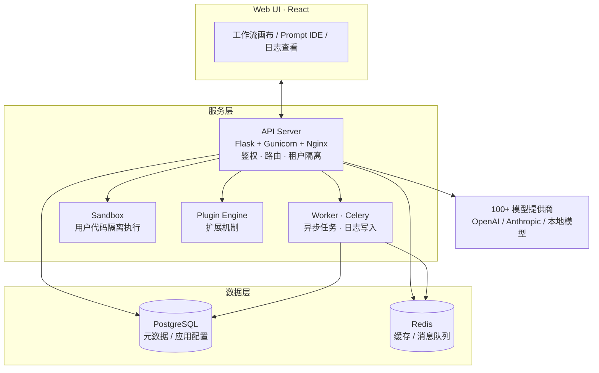

# Dify：开源 Agentic Workflow 开发平台从入门到精通指南

## 目录

1. 平台定位与整体架构
2. 原理分析
3. 架构分析
4. 安装配置
5. 实战演示
6. 开发扩展
7. 采用顺序与适用边界
附录：术语速查

## 1. 平台定位与整体架构

[Dify](https://github.com/langgenius/dify) 把 AI 工作流、RAG 管道、Agent、模型管理整合到一个可视化界面里，开发者从原型到生产可以在一个平台上完成。

这篇指南写给已经调过模型 API、但被「多步流程、日志、权限」这类与模型无关的活拖住的开发者。看完你应当能独立完成四件事：用 Docker Compose 部署一套可用的 Dify；把知识库问答和多步骤 Agent 工作流推到线上；用日志、标注和 A/B 对比持续改进 Prompt；在选型时能说清 Dify 和 LangChain 各自该什么时候用。

取舍很清楚：Dify 的定制化上限受平台约束，极致灵活的团队更适合 LangChain/LangGraph。多数团队如果需求落在「快速验证 + 生产可观测」这个区间，Dify 效率更高。

下面依次拆平台的内部结构、部署方式和扩展点。

---



Dify 的核心是 API Server，所有用户操作经过它；Worker 承担异步任务；Sandbox 隔离执行不可信代码；PostgreSQL 和 Redis 分别存元数据和缓存。

## 2. 原理分析

### 2.1 什么是 Agentic Workflow

LLM 应用的常规用法是**单轮问答**：用户给一段 Prompt，模型返回一个答案。简单场景够用，但面对复杂业务流程时有两个问题——任务无法在单次调用中完成，需要拆成多步；决策需要根据执行结果动态调整。

Agentic Workflow 把 AI 任务的执行单元从单次调用扩展到多步循环，每个步骤可以由 LLM、其他模型或传统代码共同完成，步骤之间通过状态传递形成有向图结构。

拿「分析竞品报告」来说。传统 Prompt 大概长这样：

```text
请分析以下竞品信息，输出优劣势分析报告。
```

用 Agentic Workflow 拆开：

1. **信息提取**（LLM）：从原始文本中提取竞品名称、关键指标
2. **并行查询**（Tool）：针对每个竞品查询最新市场数据
3. **综合分析**（LLM）：将提取信息与查询结果合并，生成结构化报告
4. **质量校验**（LLM）：检查报告逻辑完整性，决定是否需要补充查询

这四个步骤构成一个有向无环图（DAG）：每个节点可以独立替换，可以并行执行，失败时只重跑受影响的分支。Dify Workflow 的核心抽象就是这张图。

### 2.2 Dify 的设计决策

**抽象层次的一致性。** 聊天助手、Agent、工作流、RAG 应用都统一到「应用（Application）」这个概念下，区别只在于执行模型和流程编排方式。开发者在同一个界面里完成从简单对话机器人到复杂多步骤工作流的全部开发，不用在多个工具间切换。

**提示词即资产。** Prompt、上下文和对话历史是 Dify 的第一等公民。每次对话、每个工作流节点都有版本记录，可以回滚和对比。模型能力的差异根子在 Prompt 工程，而 Prompt 工程需要版本管理。

**BaaS 优先。** 所有功能都配有 REST API 和 Webhook，天然嵌入已有业务系统。平台本身是 Backend-as-a-Service，前端通过 API 调用所有能力，不依赖 Dify 的前端界面。

### 2.3 Dify 与其他开发方式的对比

有些场景直接调 API 或 LangChain 更合适。下表按维度对比。

| 维度 | 直接调用 API | LangChain / LangGraph | Dify |
|------|------------|----------------------|------|
| 上手难度 | 低 | 高 | 中 |
| 快速原型 | 极快 | 大量胶水代码 | 拖拽即可 |
| Workflow 编排 | 需自建 | 灵活 | 可视化 + 代码 |
| 生产可观测性 | 自建 | 部分 | 内置 |
| 多租户/权限 | 自建 | 自建 | 开箱即用 |
| 定制化上限 | 最高 | 最高 | 中（受限于平台能力） |

快速验证 AI 概念并进入生产时，Dify 效率更高。追求极致定制化或已有成熟基础设施的团队，LangChain/LangGraph 是更灵活的底层框架。Dify 的自定义工具机制可以接入 LangChain Chain。

## 3. 架构分析

### 3.1 整体架构

Dify 由多个职责独立的组件组成，全部通过 Docker 容器化部署。从功能层次上分四层：

```text
┌─────────────────────────────────────────────────────────┐
│                    Web UI (React)                       │
│              提示词 IDE / 工作流画布 / 日志              │
├─────────────────────────────────────────────────────────┤
│                      API Server                         │
│          (Flask + Nginx + Gunicorn)                     │
│     应用管理 / 鉴权 / 租户隔离 / API 路由 / 事件分发     │
├─────────────┬──────────────┬───────────────────────────┤
│  Worker     │  Plugin      │  Sandbox                  │
│  (Celery)   │  Engine      │  (代码执行隔离)            │
│  异步任务   │  扩展机制    │  用户自定义代码安全执行     │
├─────────────┴──────────────┴───────────────────────────┤
│                PostgreSQL        Redis                  │
│              (元数据/应用配置)   (缓存/消息队列)         │
├─────────────────────────────────────────────────────────┤
│           支持 100+ 模型提供商（OpenAI / Anthropic /     │
│           本地模型 / Azure / Gemini 等）                 │
└─────────────────────────────────────────────────────────┘
```

**Web UI** 层是 React 单页应用，负责用户交互、工作流可视化编排、提示词调试、日志查看。

**API Server** 是 Dify 的核心，用 Python/Flask 实现，通过 Gunicorn + Nginx 做生产部署。几乎所有用户可见的功能——应用的创建、版本管理、API 调用、日志读取——都经过这一层。它还负责租户隔离、访问控制（基于 RBAC）和审计日志。

**Worker** 层基于 Celery 实现异步任务系统。LLM 推理调用、日志写入、数据导出等耗时操作以异步任务方式执行，通过 Redis 做消息队列。Worker 支持水平扩展，可根据负载增加节点。

**Sandbox** 是一个隔离执行环境，用于安全运行用户上传的自定义 Python 代码片段和部分工具逻辑，防止恶意代码影响主机系统。

**数据库层** 使用 PostgreSQL 存储应用元数据、用户配置、对话历史和日志。Redis 承担缓存、Session 存储和 Celery 消息队列角色。

### 3.2 核心数据模型

Dify 的核心实体有以下几类：

**Tenant（租户）** 是 Dify 的顶级隔离单位。每个租户拥有独立的用户体系、应用配置、积分制度和用量统计。多租户设计意味着 Dify 可以直接用于 SaaS 化运营。

**App（应用）** 是 Dify 的核心工作单元，分为四种类型：

- **chatApp**：对话类应用，支持多轮对话和上下文记忆
- **completionApp**：补全类应用，适用于一次性生成任务
- **workflowApp**：工作流应用，基于有向图编排的复杂任务
- **agentApp**：Agent 应用，基于 ReAct 或 Function Calling 的智能体

**Conversation（会话）** 关联一个 App 和一个终端用户，记录完整的多轮对话历史。每个 Message 属于一个 Conversation，支持人工标注和反馈。

**Workflow（工作流）** 是 Dify 编排复杂任务的核心能力，由多个 **Node（节点）** 和 **Edge（边）** 组成，Node 代表一个处理单元（如 LLM 调用、条件分支、数据转换），Edge 代表数据流向。工作流支持条件分支、并行执行、循环等复杂控制流。

**Dataset（知识库）** 是 Dify 的 RAG 能力载体。每个 Dataset 包含多个 Document，文档经过切片（Chunking）处理后存入向量数据库（默认是 pgvector，PostgreSQL 的向量扩展）。Dify 支持从 PDF、PPT、Word、Markdown 等格式直接导入。

### 3.3 推理调用链路

一次 LLM 调用的完整链路：

```text
用户请求 → API Server（鉴权+路由）
         → 检查缓存（Redis）
         → 构造 Prompt（含上下文+变量替换）
         → 调用模型提供商 API（OpenAI兼容格式）
         ← 接收模型响应
         → 流式/非流式返回
         → 记录日志（PostgreSQL + S3/本地）
         → 触发 Webhook（如果配置了）
```

Dify 对模型调用做了两层抽象：底层是 **Model Runtime**，对接各提供商的具体 API 实现；上层是 **Model Config**，保存每个租户的配置（API Key、base URL、模型参数等）。切换模型提供商对上层应用透明，也支持在同一应用内做 A/B 模型对比。

### 3.4 一个任务如何流过系统

拿「分析竞品报告」工作流举例，追踪一次完整调用经过的组件：

1. 用户在 Web UI 输入「分析 Notion 的最新动态」，前端把请求发到 `POST /v1/workflows/run`
2. API Server 接收请求，校验 API Key，从 PostgreSQL 读取该工作流的图结构（节点 + 边）和当前版本
3. 工作流引擎按拓扑序执行节点：
   - **LLM 节点（提取竞品名称）**：API Server 同步调用模型提供商，构造 Prompt（含变量替换），等待响应
   - **工具节点（搜索）**：自定义 HTTP 工具由 API Server 直接发请求；包含用户上传代码片段的工具调度到 Sandbox 隔离执行
   - **LLM 节点（综合报告）**：再次调用模型，把前序节点的输出拼进 Prompt
4. 长耗时副作用（日志写入、Webhook 触发）通过 Celery 投递到 Redis，Worker 异步消费
5. 流式响应经 API Server 逐 chunk 返回前端；Worker 同时把完整对话记录、Token 消耗、各节点耗时写入 PostgreSQL，上传文件存到 S3 或本地卷

这条路径上有三个设计点：同步链路只做模型调用和流式返回，副作用全部异步化；Sandbox 把不可信代码隔离在独立容器，主进程不暴露文件系统；模型调用经过 Model Runtime 抽象层，切换提供商不需要改工作流定义。

## 4. 安装配置

### 4.1 环境要求

Dify 对硬件的要求因规模和功能而异。单机体验和功能验证的推荐配置：

| 资源 | 最低要求 | 推荐配置 |
|------|---------|---------|
| CPU | 2 核 | 4 核以上 |
| 内存 | 4 GiB | 8 GiB 以上 |
| 磁盘 | 20 GiB | 50 GiB 以上（视文档量） |
| Docker | 20.x + Compose V2 | 最新稳定版 |

需要跑较大的开源模型（如 Llama3 70B）时，内存建议 16 GiB 以上，或者使用 Ollama 等本地推理服务通过 OpenAI-compatible API 接入 Dify。

### 4.2 Docker Compose 快速部署

Docker Compose 是推荐的安装方式，一条命令启动完整服务。

```bash
# 克隆仓库
git clone https://github.com/langgenius/dify.git
cd dify/docker

# 复制环境变量配置
cp .env.example .env

# 启动所有服务
docker compose up -d
```

启动完成后，打开浏览器访问 `http://localhost/install`，按引导创建管理员账号。部署是否健康，看三处：

- `docker compose ps`：所有服务应为 `running`，没有 `Restarting` 或 `Exited`。
- 首次访问 `/install` 是安装引导页；配置完成后访问 `/signin` 应进入登录页。
- `docker compose logs -f api`：启动过程没有连接 PostgreSQL / Redis 失败的堆栈；第一次调用模型后，日志正常记录 token 消耗。

`.env` 文件中需要关注几个关键配置项：

```bash
# 服务基础配置
SECRET_KEY=your-secret-key-here          # 建议使用随机字符串
CONSOLE_WEB_URL=http://localhost          # 前端地址
CONSOLE_API_URL=http://localhost/api       # 后端API地址

# 数据库（默认使用 Docker Compose 内置 PostgreSQL）
DB_USERNAME=dify
DB_PASSWORD=dify
DB_HOST=postgres
DB_PORT=5432
DB_DATABASE=dify

# Redis（默认使用 Docker Compose 内置 Redis）
REDIS_HOST=redis
REDIS_PORT=6379

# 模型提供商配置（按需填写）
# OpenAI
OPENAI_API_KEY=sk-xxxx
# Azure OpenAI
AZURE_OPENAI_ENDPOINT=https://your-resource.openai.azure.com
AZURE_OPENAI_API_KEY=xxxx
# Anthropic
ANTHROPIC_API_KEY=sk-ant-xxxx
```

连接本地模型服务（如 Ollama）时，在 Dify 的「模型供应商」页面添加「OpenAI-Compatible 接口」，填入 Ollama 的地址（通常是 `http://localhost:11434/v1`）和模型名称即可。

### 4.3 常用生产环境配置

**反向代理配置（Nginx）**

生产环境中，建议用 Nginx 做反向代理，同时处理 SSL 终止和请求限流：

```nginx
server {
    listen 443 ssl;
    server_name dify.your-domain.com;

    ssl_certificate /path/to/cert.pem;
    ssl_certificate_key /path/to/key.pem;

    # 下面 location /api 用到的 api_limit zone，需在 http 上下文先定义，例如：
    # limit_req_zone $binary_remote_addr zone=api_limit:10m rate=10r/s;

    client_max_body_size 100M;

    location / {
        proxy_pass http://localhost:80;
        proxy_set_header Host $host;
        proxy_set_header X-Real-IP $remote_addr;
        proxy_set_header X-Forwarded-For $proxy_add_x_forwarded_for;
        proxy_set_header X-Forwarded-Proto $scheme;

        # SSE 流式响应需要关闭缓冲
        proxy_buffering off;
        proxy_cache off;
        chunked_transfer_encoding on;
    }

    location /api {
        limit_req zone=api_limit burst=20 nodelay;
        proxy_pass http://localhost:80;
    }
}
```

**外部 PostgreSQL**

数据量较大时，可以将 PostgreSQL 迁移到独立数据库服务器：

```bash
# .env 中修改数据库连接
DB_HOST=your-postgres-host.internal
DB_PORT=5432
DB_DATABASE=dify
DB_USERNAME=dify_prod
DB_PASSWORD=strong-password-here
```

**外部 S3 兼容存储**

Dify 的日志和上传文件默认存储在本地 Docker 卷中，生产环境建议切换到 S3 兼容存储（如 MinIO、阿里云 OSS、AWS S3）：

```bash
S3_ENDPOINT=https://your-bucket.s3.region.amazonaws.com
S3_BUCKET_NAME=dify-logs
S3_ACCESS_KEY=AKIAxxx
S3_SECRET_KEY=xxx
S3_REGION=us-east-1
```

### 4.4 常见安装问题排查

**端口冲突**

Docker Compose 默认占用端口 `80`（Nginx）、`5432`（PostgreSQL）、`6379`（Redis）、`3000`（前端）。这些端口已被占用时，修改 `docker-compose.yaml` 中的端口映射或停掉冲突服务。

**模型调用返回 400/401 错误**

先确认 API Key 正确，然后在 Dify 的「模型供应商」页面点击对应供应商卡片的「检查连接」按钮。Dify 会发送一个探测请求来验证配置是否生效。使用代理时，确保代理支持 `POST` 方法和流式响应格式。

**向量检索结果不准确**

检查知识库的切片策略。Dify 默认按固定长度切片，容易在句子中间断开，导致语义不完整。可以在知识库设置中将切片策略调整为「语义分块」，或手动调整切片大小和重叠参数。

### 4.5 运行时与自定义工具排查

安装阶段的问题大多集中在端口和 API Key，运行时的问题更分散。

**工作流节点执行失败但日志信息有限。** 先在「日志」页面找到对应的工作流运行记录，展开各节点的输入输出和耗时。如果节点输入为空，通常是上游变量的传递路径配置错误——检查节点之间的变量映射是否对齐了字段名和类型；如果节点输入正常但输出异常，进入节点详情查看 LLM 的原始响应和错误码。流式响应中断时，检查 Nginx 或反向代理是否关闭了 `proxy_buffering`，SSE 链路被中间层缓冲会导致 chunk 丢失。

**模型调用超时或限流。** Dify 的 Model Runtime 层会透传上游提供商的错误码。OpenAI 兼容接口返回 429 时，先在「模型供应商」页面降低该模型的并发上限，或在 Nginx 层加 `limit_req` 做全局限流。超时问题需要区分是模型本身慢还是网络链路慢——可以在 Dify 容器内直接 `curl` 模型 API 测基线延迟，再对比 Dify 日志里的耗时。本地模型（Ollama、LM Studio）首次调用慢通常是模型加载耗时，预热一次后再测。

**Sandbox 代码异常退出。** Sandbox 是独立容器，用户代码里的 `import` 失败、内存超限或死循环都会被隔离层捕获并返回错误。排查时先在 Sandbox 日志里看 Python 异常堆栈；如果是缺少依赖，Dify 的 Sandbox 默认只预装常用库，需要自定义依赖时通过插件机制扩展 Sandbox 镜像，不要直接改主镜像。代码执行超时默认有上限，长耗时任务应当拆成异步任务通过 Worker 执行，而不是塞进 Sandbox。

**自定义工具调用返回 502/504。** 多数情况是目标 API 不可达或 SSL 证书问题。在 Dify 容器内用 `curl` 直接请求目标 API 验证网络连通性；如果目标 API 在内网，确认 Dify 容器能解析内网域名。OpenAPI Schema 定义错误也会导致调用失败——Dify 对 Schema 的字段类型和 `required` 校验比较严格，建议先用本地 Swagger UI 验证 Schema 再导入。

**Worker 积压、异步任务延迟。** 在 `docker compose logs worker` 里观察 Celery 任务队列长度。如果持续积压，说明 Worker 节点不够，可以通过 `docker compose up -d --scale worker=N` 水平扩容。Redis 内存不足也会导致任务丢失，监控 Redis 的 `used_memory` 指标。

## 5. 实战演示

### 5.1 场景一：基于知识库的问答机器人

Dify 最典型的使用场景——把产品文档上传到知识库，用户提问时自动检索相关片段并生成答案。

**创建知识库。** 左侧菜单选「知识库」→「创建知识库」，上传文档（支持 PDF、Word、PPT、Markdown、TXT），选择切片策略。Dify 提供「自动」和「手动」两种模式，自动模式会识别文档结构切片，手动模式允许自定义切片大小和重叠。

**创建应用。** 选「创建应用」→「聊天助手」，在提示词编排页面启用 RAG，关联刚创建的知识库：

```text
你是一个专业的技术支持助手。当用户提问时，先从知识库中检索相关信息，
然后结合检索结果给出准确、专业的回答。如果知识库中没有相关信息，
请明确告知用户，并提供一般性的建议。
```

调整模型参数（温度、Top-P、最大 token 数），保存。

**测试与发布。** 在右侧对话窗口输入问题，观察检索结果和答案质量。确认效果后点击「发布」，获得 API 地址：

```python
import requests

response = requests.post(
    "https://your-dify-instance/v1/chat-messages",
    headers={
        "Authorization": "Bearer app-YOUR_API_KEY",
        "Content-Type": "application/json"
    },
    json={
        "query": "你们产品的退款政策是什么？",
        "user": "user-123",
        "response_mode": "streaming"
    },
    stream=True
)

for line in response.iter_lines():
    if line:
        print(line.decode("utf-8"))
```

### 5.2 场景二：多步骤 Agent 工作流

实现一个「竞品分析助手」：用户输入竞品名称后，自动完成提取竞品信息 → 并行搜索最新动态 → 整理分析报告。

创建工作流应用后，进入可视化编排画布，编排节点：

```text
[开始] → [LLM: 提取竞品名称和关键指标]
       → [工具: 谷歌搜索 × 3（并行）]
       → [LLM: 综合信息生成报告]
       → [结束]
```

- **LLM 节点**：选择模型，编写 Prompt，定义输入变量（从前序节点传递）
- **工具节点**：Dify 提供 50+ 内置工具（Google 搜索、DALL·E、Stable Diffusion 等），也支持自定义 HTTP 工具
- **条件分支**：搜索结果为空时跳转到「补充搜索」分支，否则进入报告生成
- **变量传递**：第一个 LLM 节点的输出 `company_name` 成为工具节点的输入；多个搜索工具的输出汇聚到数组变量 `search_results` 中

点击「试运行」输入竞品名称，观察每个节点的执行状态和输出。可以改造为支持多个竞品批量输入的版本——用到数组变量和循环节点。

### 5.3 场景三：LLMOps——基于生产数据优化 Prompt

Dify 完整记录生产环境的用户对话，为持续的 Prompt 优化提供数据基础。

在「日志」页面，可以查看每条对话的完整链路：用户输入 → 完整 Prompt → 模型输出 → Token 消耗 → 响应时间。需要改进的对话，点击「标注」添加人工反馈（「回答不准确」「信息过时」「格式不规范」），这些标注数据可导出用于 fine-tuning 或作为评估集。

Dify 还支持在「日志」页面对同一条用户输入，用不同 Prompt 版本做 A/B 对比。

## 6. 开发扩展

### 6.1 自定义工具

Dify 的工具系统支持通过 OpenAPI Schema 定义自定义 HTTP 工具，新版本也兼容 [MCP](https://modelcontextprotocol.io/)。开发一个自定义工具只需几步：

在「工具」→「自定义工具」中新建工具，填写基本信息，然后编写接口定义：

```json
{
  "schema": {
    "name": "get_weather",
    "description": "查询指定城市的当前天气",
    "parameters": {
      "type": "object",
      "properties": {
        "city": {
          "type": "string",
          "description": "城市名称，如北京、上海"
        },
        "unit": {
          "type": "string",
          "enum": ["celsius", "fahrenheit"],
          "default": "celsius"
        }
      },
      "required": ["city"]
    }
  }
}
```

然后填写目标 API 的地址、认证方式（API Key / Bearer Token / 无认证），以及请求体构造方式。Dify 支持将用户输入的对话参数自动映射到 API 请求参数中。在工具配置页面填写测试参数验证调用结果，确认正常后即可在工作流和 Agent 中使用。

### 6.2 API 集成

Dify 提供完整的 REST API，遵循 OpenAI 的接口规范：

```bash
# 创建应用
curl -X POST "https://your-dify-instance/v1/apps" \
  -H "Authorization: Bearer YOUR_API_KEY" \
  -H "Content-Type: application/json" \
  -d '{
    "name": "竞品分析助手",
    "description": "自动完成竞品信息收集与分析报告生成",
    "app_type": "agent",
    "icon": "🤖"
  }'

# 获取应用详情
curl "https://your-dify-instance/v1/apps/{app_id}" \
  -H "Authorization: Bearer YOUR_API_KEY"
```

消息发送 API 兼容 OpenAI SDK，只需修改 base URL 和 API Key：

```python
import openai

client = openai.OpenAI(
    api_key="YOUR_DIFY_API_KEY",
    base_url="https://your-dify-instance/v1"
)

response = client.chat.completions.create(
    model="draft-app",
    messages=[
        {"role": "user", "content": "帮我分析下智谱 AI 的最新动态"}
    ],
    stream=True,
    user="user-id-123"
)

for chunk in response:
    print(chunk.choices[0].delta.content, end="", flush=True)
```

### 6.3 插件机制

Dify 的插件系统（Plugin）允许以插件形式扩展平台能力，无需修改核心代码。官方示例包括：SAML SSO（对接企业身份提供商）、自定义模型（接入官方未直接支持的模型服务）、Webhook 增强（在特定事件触发自定义业务逻辑）。插件开发文档在 Dify 官方文档的「扩展开发」章节，涉及 Python 打包、权限声明和生命周期钩子等标准机制。

## 7. 采用顺序与适用边界

**选 Dify 的场景：** 团队想快速验证 AI 概念，不想在基础设施上耗时间；应用要同时管多模型、RAG 管道和工作流编排；企业级能力（多租户、权限、审计日志）是硬需求。

**不选 Dify 的场景：** 工作流逻辑超出 Dify 节点能力，需要极致定制化；已经有成熟的 LLMOps 基础设施，再套一层 Dify 反而增加复杂度；场景单一，直接调 API 就够。

**采用顺序：** 先用 Docker Compose 跑通单机版，熟悉工作流编排和知识库；选一个真实业务场景做试点（推荐从 RAG 问答开始，门槛最低）；验证效果后迁移到生产配置（外部数据库 + S3 + Nginx）；按需开发自定义工具和插件。

**深入方向：** 官方文档 docs.dify.ai；GitHub Discussions 社区；DAG 编排、条件分支、循环处理等高级工作流特性；Embedding 模型选择、分块策略、混合检索等 RAG 优化；插件生态还处于早期，适合贡献自定义工具。

## 附录：术语速查

| 术语 | 说明 |
|------|------|
| Application（应用） | Dify 的统一工作单元，聊天助手、Agent、工作流、RAG 应用都归到这一类 |
| Agent App | 基于 ReAct 或 Function Calling 循环决策的应用 |
| Workflow（工作流） | 用节点（Node）和边（Edge）编排的任务图 |
| Node / Edge | Node 是处理单元，Edge 表示数据流向 |
| Tenant（租户） | Dify 的顶级隔离单位，对应一个独立用户体系与应用配置 |
| Dataset（知识库） | RAG 载体，文档切片后存入向量数据库 |
| Chunking（切片） | 把长文档切块以便检索，策略影响检索质量 |
| pgvector | PostgreSQL 的向量扩展，Dify 默认向量存储 |
| Conversation / Message | 一次会话及其中的消息，支持人工标注与反馈 |
| Model Runtime / Config | 底层对接模型商家的实现层 / 每租户的模型配置 |
| Sandbox | 隔离执行用户代码的独立容器 |
| Celery / Worker | 异步任务框架，承担日志写入、导出等耗时任务 |


