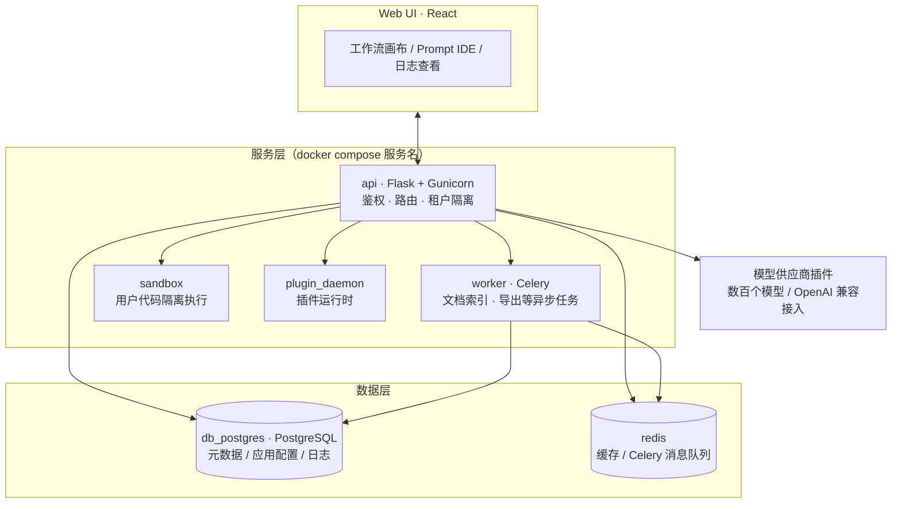

# Dify 拆解：把 LLM 应用的工程外围收进一个可视化平台

一个 LLM（Large Language Model，大语言模型）应用要上线，真正花在模型调用上的代码往往不多，大头是流程编排、知识检索、日志、权限、多环境配置这些工程外围。[Dify](https://github.com/langgenius/dify) 把这堆外围收进一个可视化平台：工作流编排、RAG（Retrieval-Augmented Generation，检索增强生成）管道、Agent、模型管理，从原型到生产在一个界面里完成。

它的规模不小：约 15.8 万 Stars、2.5 万 Forks（2026 年 10 月，GitHub 实时数据），当前最新版本 v1.17.1（2026 年 9 月发布）。官方对模型支持的口径是「数十个推理提供商、数百个模型」，覆盖 GPT、Mistral、Llama3 等闭源与开源模型，以及任何 OpenAI API 兼容的服务。

这篇拆解写给已经调过模型 API、但被多步流程、日志、权限这类活拖住的开发者。读完你能判断三件事：Dify 和直接调 API、LangChain 各自适合什么场景；一套 Docker Compose 怎么从零跑到可用；真出问题时去哪查。

一个提醒：Dify 迭代很快，1.x 全面插件化之后，模型接入方式、`.env` 变量都和 0.x 时代不同。本文以 v1.17.x 为基准，配置项以你所用版本的 `docker/.env.example` 注释为准。

## 平台定位：它替你做了什么

Dify 的核心抽象是「应用（Application）」。聊天助手、文本生成、Chatflow、工作流、Agent 都归到这个概念下，区别只在执行模型和编排方式。你在同一个界面里完成从简单对话机器人到复杂多步骤工作流的全部开发。

三个设计决策值得注意：

**提示词编排即开发界面。** 每个应用都有可视化编排页：写 Prompt、挂上下文和变量、调模型参数、试运行。工作流的改动是草稿态，点「发布」才对外生效——生产环境不会因为你保存了一下就变了行为。

**BaaS（Backend-as-a-Service，后端即服务）优先。** 每个 App 发布后自带 REST API 和 Web App 地址，前端通过 API 调用所有能力，不依赖 Dify 自己的界面。已有业务系统可以把 Dify 当后端用。

**可观测内置。** 每条对话的完整链路——用户输入、实际发给模型的 Prompt、模型输出、Token 消耗、响应时间——都记录在日志页，可以加人工标注反馈，标注数据能导出用于微调或做评估集。

上限也说清楚：Dify 的定制化受平台约束，工作流节点能力之外的需求要靠插件或外部服务补。极致灵活的团队更适合 LangChain/LangGraph 这类代码框架。

## 系统地图：服务构成与调用链


```mermaid
flowchart TB
    subgraph UI["Web UI · React"]
        UI1["工作流画布 / Prompt IDE / 日志查看"]
    end
    subgraph SVC["服务层（docker compose 服务名）"]
        API["api · Flask + Gunicorn<br/>鉴权 · 路由 · 租户隔离"]
        WORKER["worker · Celery<br/>文档索引 · 导出等异步任务"]
        SANDBOX["sandbox<br/>用户代码隔离执行"]
        PLUGIN["plugin_daemon<br/>插件运行时"]
    end
    subgraph DATA["数据层"]
        DB[("db_postgres · PostgreSQL<br/>元数据 / 应用配置 / 日志")]
        REDIS[("redis<br/>缓存 / Celery 消息队列")]
    end
    MODELS["模型供应商插件<br/>数百个模型 / OpenAI 兼容接入"]

    UI <--> API
    API --> WORKER
    API --> SANDBOX
    API --> PLUGIN
    API --> DB
    API --> REDIS
    WORKER --> DB
    WORKER --> REDIS
    API --> MODELS
```

`api` 服务是核心，用 Python/Flask 实现，Gunicorn + Nginx 做生产部署。几乎所有用户可见的功能——应用管理、API 调用、日志读取——都经过它；租户隔离和成员角色控制也在这层。`worker` 基于 Celery，承担知识库文档的切片与向量化、数据导出这类重活，通过 Redis 收任务，可以水平扩容。`sandbox` 是独立容器，隔离执行用户上传的代码片段，主进程不把文件系统暴露给它。`plugin_daemon` 是 1.x 插件化的运行时，模型供应商和工具插件都跑在这里。可选向量库服务（Weaviate、pgvector、Qdrant、Milvus 等）按需启用。

一次对话请求的链路：

```text
用户消息 → api（校验 API Key，读应用配置）
         → 命中标注回复？（配置了标注回复且问题匹配 → 直接返回固定答案）
         → 组装 Prompt（变量替换 + 上下文 + 知识库检索结果）
         → 经模型供应商插件调用模型
         ← 流式返回（SSE）
         → 对话记录、Token 消耗写入 PostgreSQL
         → 触发 Webhook（如配置）
```

工具节点的外呼请求走 `ssrf_proxy` 出网——这是刻意设计，防止工作流被指向内网地址。

拿「分析竞品报告」工作流看一次完整执行：

1. 前端发 `POST /v1/workflows/run`，api 校验 API Key，从 PostgreSQL 读该工作流的图结构和当前发布版本
2. 工作流引擎按图执行节点：LLM 节点同步调模型；工具节点的外呼经 SSRF 代理；含用户代码的工具调度到 sandbox
3. 流式响应（SSE，Server-Sent Events，服务器推送事件）经 api 逐 chunk 返回前端；完整运行记录、Token 消耗、各节点耗时异步落库

三个设计点：同步链路只做模型调用和流式返回，重活异步化；不可信代码隔离在独立容器；模型调用经过统一的插件层，切换供应商不改工作流定义。

## 核心概念：应用类型、工作流与知识库

**应用类型。** 当前版本的 App 模式有六种：`chat`（聊天助手）、`completion`（文本生成，一次性任务）、`advanced-chat`（Chatflow，多轮对话 + 流程编排）、`workflow`（工作流，单次运行出结果）、`agent`（新式 Agent，带独立 sandbox，能跑命令、装软件、处理文件）和 `agent-chat`（传统 Agent，官方标记为 legacy）。Agent 节点也能作为工作流中的一个步骤嵌入。传统 Agent 和 Agent 节点支持两种推理策略：Function Calling（模型原生工具调用，适合 GPT-4、Claude 这类支持好的模型）和 ReAct（Thought → Action → Observation 循环，适合不支持原生函数调用的模型）。

**工作流。** 由节点（Node）和边（Edge）组成的有向图。节点覆盖 LLM 调用、知识检索、条件分支（IF/ELSE）、并行分支、迭代（Iteration，对数组变量逐项处理）、代码执行、HTTP 请求等。每个节点的输出是变量，供下游节点引用——工作流编程的实质就是这张变量传递图。

**知识库（Dataset）。** RAG 能力的载体。文档上传后经过清洗、分段（Chunking）、向量化入库。分段有两种模式：

- **通用（General）**：所有分段同一套设置（分隔符、最大长度、重叠），命中的分段直接作为检索结果；
- **父子（Parent-child）**：先切大块（父），再切小块（子），检索匹配子块、返回整个父块。小块匹配得准，大块上下文全，这个模式就是为解决「准与全不可兼得」设计的。

注意：分段模式在知识库创建后**不可更改**，能随时调的只有分隔符、长度、重叠这些参数。文件存储默认走 OpenDAL 的本地盘（`STORAGE_TYPE=opendal`，`OPENDAL_SCHEME=fs`），向量库默认 Weaviate，都可以在 `.env` 里切换。

## 设计取舍：与直接调 API、LangChain 的对比

| 维度 | 直接调用 API | LangChain / LangGraph | Dify |
|------|------------|----------------------|------|
| 上手难度 | 低 | 高 | 中 |
| 快速原型 | 极快 | 大量胶水代码 | 画布上拖拽 |
| 流程编排 | 自建 | 代码级灵活 | 可视化 + 节点能力上限 |
| 生产可观测 | 自建 | 部分 | 内置日志、标注 |
| 多租户/权限 | 自建 | 自建 | 开箱即用 |
| 定制化上限 | 最高 | 最高 | 中，节点和插件之外要绕路 |

需求落在「快速验证 + 生产可观测」区间，Dify 效率最高；需要节点能力之外的深度定制，或者已有成熟 LLMOps（LLM Operations，大模型应用运维）基础设施，再套一层 Dify 反而多一套要维护的东西。两者不互斥：Dify 的自定义工具可以包一层 HTTP 服务，把 LangChain 写的逻辑接进来。

## 部署：Docker Compose 从零到可用

### 环境要求

官方最低要求：CPU ≥ 2 核，内存 ≥ 4 GiB。软件要求：Linux 装 Docker 19.03+ 和 Docker Compose 2.24.0+；macOS 用 Docker Desktop，虚拟机至少配 2 vCPU 和 8 GiB 内存。磁盘看知识库规模，起步 20 GiB 是稳妥值。

模型推理由外部服务承担——云 API 或本地 Ollama 之类——Dify 容器本身开销不大，机器规格主要看知识库和并发量。

### 快速部署

```bash
# 克隆仓库（官方建议锁定最新 release 分支，而非 main）
git clone --branch "$(curl -s https://api.github.com/repos/langgenius/dify/releases/latest | jq -r .tag_name)" https://github.com/langgenius/dify.git
cd dify/docker

# 复制环境变量配置
cp .env.example .env

# 启动所有服务
docker compose up -d
```

启动后访问 `http://localhost/install` 创建管理员账号。部署是否健康，看三处：

- `docker compose ps`：所有服务应为 `running`，没有 `Restarting` 或 `Exited`
- 首次访问 `/install` 是安装引导页；配置完成后 `/signin` 应进入登录页
- `docker compose logs -f api`：没有连接 PostgreSQL / Redis 失败的堆栈；配置模型后调用一次，日志正常记录 Token 消耗

`.env` 里最该改的一项是 `SECRET_KEY`——用于签名会话，生产环境必须换成随机长串（留空会自动生成并持久化到 storage 目录，但显式设置更稳）。数据库和 Redis 的默认值（`DB_HOST=db_postgres`、`REDIS_HOST=redis` 等）指向 compose 内部服务，单机部署不用动。

模型接入不在 `.env` 里配。装好后进界面 **Integrations → Model Provider**，从 Marketplace 安装对应供应商插件并填 API Key。接本地 Ollama 有两条路：装官方 Ollama 插件填服务地址；或者用 OpenAI-API-compatible 插件指向 `http://<host>:11434/v1`，后者适用于任何兼容 OpenAI 格式的推理服务。

### 生产配置要点

**反向代理。** compose 已内置 nginx，默认暴露 80/443（`EXPOSE_NGINX_PORT` / `EXPOSE_NGINX_SSL_PORT`）。要外挂 Nginx 做 SSL 终止和限流，注意 SSE 流式响应必须关缓冲，否则流式输出会被中间层攒住：

```nginx
# http 上下文先定义：limit_req_zone $binary_remote_addr zone=api_limit:10m rate=10r/s;
server {
    listen 443 ssl;
    server_name dify.your-domain.com;

    ssl_certificate /path/to/cert.pem;
    ssl_certificate_key /path/to/key.pem;
    client_max_body_size 100M;

    location / {
        proxy_pass http://127.0.0.1:80;
        proxy_set_header Host $host;
        proxy_set_header X-Real-IP $remote_addr;
        proxy_set_header X-Forwarded-For $proxy_add_x_forwarded_for;
        proxy_set_header X-Forwarded-Proto $scheme;

        # SSE 流式响应必须关闭缓冲
        proxy_buffering off;
        proxy_cache off;
        chunked_transfer_encoding on;
    }

    location /api {
        limit_req zone=api_limit burst=20 nodelay;
        proxy_pass http://127.0.0.1:80;
    }
}
```

**外部数据库与对象存储。** 数据量上来后，PostgreSQL 可以迁到独立实例，改 `.env` 里的 `DB_HOST`、`DB_USERNAME`、`DB_PASSWORD` 指过去即可。文件存储同理：把 `OPENDAL_SCHEME` 从 `fs` 换成 `s3`，按 OpenDAL 的约定补上 endpoint、bucket、密钥等配置项（具体键名以所用版本 `.env.example` 注释为准）。

### 端口与常见安装问题

compose 默认只把 nginx 的 80/443 暴露到宿主机，PostgreSQL、Redis、sandbox 都在内部网络里，不占宿主机端口。80 被占用时改 `EXPOSE_NGINX_PORT`，或直接在外层代理处理。

**模型调用返回 400/401。** 先在 Integrations → Model Provider 里对对应供应商跑连接检查，Dify 会发一个探测请求验证配置。走代理时确认代理支持 POST 和流式响应。

**向量检索不准。** 先查分段设置：分隔符是否把句子拦腰切断、最大长度是否过小。检索质量的上限很大程度在分段和 Embedding 模型选择上，问题定位从这两处入手。

## 排查：从安装问题到运行时

安装阶段的问题集中在端口和 API Key，运行时的问题更分散。

**工作流节点执行失败但日志信息有限。** 到「日志」页定位运行记录，展开各节点的输入、输出和耗时。节点输入为空，多半是上游变量传递配错了——逐一核对节点间的变量映射，字段名和类型对齐；输入正常但输出异常，进节点详情看模型原始响应和错误码。流式中断时检查反向代理的 `proxy_buffering` 是否已关。

**模型调用超时或限流。** Dify 会透传上游供应商的错误码，看到 429 就到供应商侧确认配额。区分超时是模型慢还是网络慢：进容器直接 `curl` 模型 API 测基线延迟，再对比 Dify 日志里的耗时。本地模型首次调用慢通常是权重加载，预热一次再测。

**sandbox 代码异常退出。** sandbox 是独立容器，`import` 失败、内存超限、死循环都会被隔离层捕获返回错误。先看 sandbox 日志里的 Python 堆栈；缺依赖时通过自定义 sandbox 镜像解决，不要改主镜像。长耗时任务不该塞进 sandbox，拆出去走外部服务。

**自定义工具返回 502/504。** 多数是目标 API 不可达或证书问题，进容器 `curl` 验证连通性；目标在内网时确认容器能解析内网域名（默认的 SSRF 代理会拦内网地址，这是安全特性，放行需要改代理配置）。OpenAPI Schema 定义错误也会导致调用失败——Dify 对字段类型和 `required` 校验严格，先在本地 Swagger UI 验证再导入。

**Worker 积压。** `docker compose logs worker` 观察 Celery 队列。持续积压就 `docker compose up -d --scale worker=N` 扩容；Redis 内存不足会丢任务，盯住 `used_memory` 指标。

## 实战：知识库问答、多步工作流与日志驱动迭代

### 场景一：知识库问答机器人

把产品文档上传知识库，用户提问时自动检索相关片段生成答案——这是 Dify 最典型的用法。

建知识库：左侧「知识库」→「创建」，上传文档（PDF、Word、PPT、TXT、Markdown 等），选分段模式。结构规整的长文档选父子模式，一般场景通用模式够用。

建应用：「创建应用」→「聊天助手」，在编排页启用上下文并关联知识库，写系统提示词：

```text
你是一个专业的技术支持助手。回答问题时依据知识库检索结果，
检索不到相关信息就明确告知用户，不要编造。
```

调好温度和最大 Token 数，右侧对话窗口验证效果，然后点「发布」拿 API 凭证调用：

```python
import requests

response = requests.post(
    "https://your-dify-instance/v1/chat-messages",
    headers={
        "Authorization": "Bearer app-YOUR_API_KEY",
        "Content-Type": "application/json"
    },
    json={
        "query": "你们产品的退款政策是什么？",
        "inputs": {},
        "user": "user-123",
        "response_mode": "streaming"
    },
    stream=True
)

for line in response.iter_lines():
    if line:
        print(line.decode("utf-8"))
```

`query` 是用户消息，`inputs` 填 App 定义的开头变量，`user` 是终端用户标识——这是 Dify 自己的接口格式，不是 OpenAI 的 messages 数组。

### 场景二：多步骤工作流

做一个竞品分析助手：输入竞品名，自动提取关键信息 → 并行搜索最新动态 → 汇总成报告。

创建工作流应用，在画布上编排：

```text
[开始] → [LLM: 提取公司名和关键指标]
       → [工具: 搜索插件 × 3（并行分支）]
       → [LLM: 汇总生成报告]
       → [结束]
```

工具从 Marketplace 装搜索类插件，或者用自定义 OpenAPI 工具接自己的服务。LLM 节点的输出定义成变量传给下游；多个并行搜索的输出汇聚进数组变量，报告节点一次性引用。加一个 IF/ELSE 节点处理「搜索结果为空走补充搜索」的分支；要对一批竞品逐个跑，套迭代节点。

「试运行」单测整条流，每个节点的输入输出和耗时实时可见。改完点「发布」才对 API 生效——草稿和线上版本是分离的。

### 场景三：用日志和标注驱动迭代

Dify 记录生产环境每条对话的完整链路：用户输入、实际 Prompt、模型输出、Token 消耗、响应时间。迭代闭环在日志页完成：

- 对低质量回答点「标注」，写上原因（不准确、过时、格式问题），标注对积累成评估集，可导出用于微调
- 配置「标注回复」后，高频问题和固定答案直接命中返回，不消耗模型调用
- 编排页切换模型或参数重新试跑，对比同一输入下的回答质量，选定后发布

这套机制的价值不在单点功能，而在把「改 Prompt」从凭感觉变成对着生产数据做决策。

## 扩展：工具、API 与插件生态

### 自定义工具

工具的来源有四类：Marketplace 工具插件、自定义 OpenAPI 工具、把工作流发布成工具、连接外部 MCP（Model Context Protocol，模型上下文协议）服务器。自定义 HTTP 工具的接法：在「工具」→「自定义」里导入 OpenAPI 描述，粘贴或给 URL 均可：

```yaml
openapi: 3.1.0
info:
  title: 天气查询工具
  description: 查询指定城市的当前天气
  version: 1.0.0
servers:
  - url: https://api.example.com
paths:
  /weather:
    get:
      operationId: getWeather
      description: 查询指定城市的当前天气
      parameters:
        - name: city
          in: query
          required: true
          schema:
            type: string
            description: 城市名称，如北京、上海
        - name: unit
          in: query
          required: false
          schema:
            type: string
            enum: [celsius, fahrenheit]
            default: celsius
      responses:
        "200":
          description: 成功返回天气信息
```

导入后按 `servers` 条目填认证方式（API Key / Bearer Token / 无认证），Dify 会把参数定义映射到用户输入或从对话中提取的值。填测试参数验证调用结果，通过后即可在工作流和 Agent 里引用。

### API 集成

Dify 的 Service API 是自有格式，和 OpenAI 的 chat completions 不兼容——不能把 OpenAI SDK 的 `base_url` 指到 Dify 就用。端点按应用类型分：聊天类应用走 `POST /v1/chat-messages`，工作流应用走 `POST /v1/workflows/run`，鉴权统一是 App 级别的 Bearer Token。

工作流应用的调用示例：

```bash
curl -X POST "https://your-dify-instance/v1/workflows/run" \
  -H "Authorization: Bearer app-YOUR_API_KEY" \
  -H "Content-Type: application/json" \
  -d '{
    "inputs": {"company_name": "Notion"},
    "response_mode": "streaming",
    "user": "user-123"
  }'
```

`inputs` 的键名对应该工作流「开始」节点定义的输入变量；`response_mode` 选 `blocking`（同步等结果，Cloud 环境有超时限制）或 `streaming`（SSE 逐事件推送）。完整端点清单见官方 API Reference，覆盖会话管理、文件上传、消息反馈、标注等 60 余个接口。

### 插件与 Marketplace

1.x 之后，模型供应商、工具、数据源、触发器、Agent 策略都以插件形式存在，从 [Dify Marketplace](https://marketplace.dify.ai/) 一键安装，插件跑在独立的 `plugin_daemon` 服务里，不碰核心代码。自己写插件有官方脚手架（dify-plugin CLI），支持模型、工具、Agent 策略等类型，Python 打包、权限声明、生命周期钩子都有现成规范。

企业级能力是另一条线：SAML SSO、细粒度 RBAC、审计日志属于企业版，社区版提供的是工作空间成员的基础角色（所有者、管理员、编辑者、普通成员）。

## 采用边界与上手顺序

三条 license 边界先划清——Dify 用的是带附加条件的修改版 Apache 2.0：

1. **多租户限制**：未经 Dify 书面授权，不能用其源码运营多租户环境。Dify 语境下一个租户等于一个工作空间，也就是说拿它做 SaaS 服务对外卖多租户账号需要商业授权；给单一企业内部用、作为自家应用的后端没问题。
2. **前端标识**：使用 Dify 前端时不得移除或修改界面上的 logo 和版权信息；不用它的前端（纯 API 后端用法）不受此限。
3. 商用（含企业内部作为开发平台）本身是允许的。

**适合 Dify 的场景：** 团队要快速验证 AI 应用，不想在流程编排、日志、权限上重复造轮子；应用需要同时管多模型、RAG 管道和工作流；单一组织内部使用，不涉及多租户转售。

**不适合的场景：** 工作流逻辑超出节点能力且不愿写插件；已有成熟 LLMOps 栈，再引一层多一套维护成本；拿它做对外多租户 SaaS 又不想买商业授权。

**上手顺序：** Docker Compose 跑通单机 → 界面装一个模型供应商插件 → 建知识库问答应用走通全流程 → 用工作流搭一个真实业务场景 → 有定制需求再写工具插件。官方文档在 docs.dify.ai，版本变化快，配置项以 `docker/.env.example` 注释和 changelog 为准。

## 附录：术语速查

| 术语 | 说明 |
|------|------|
| Application（应用） | Dify 的统一工作单元，聊天助手、Agent、工作流、RAG 应用都归到这一类 |
| App 模式 | `chat` / `completion` / `advanced-chat`（Chatflow）/ `workflow` / `agent` / `agent-chat`（传统） |
| Workflow（工作流） | 用节点（Node）和边（Edge）编排的任务图，草稿与发布版本分离 |
| Node / Edge | Node 是处理单元，Edge 表示数据流向 |
| Tenant / Workspace（租户/工作空间） | 顶级隔离单位，对应独立成员体系与应用配置；license 层面一租户即一工作空间 |
| Dataset（知识库） | RAG 载体，文档分段后存入向量数据库，默认 Weaviate |
| Chunking（分段） | 通用（General）与父子（Parent-child）两种模式，创建后不可切换 |
| Model Provider（模型供应商） | 以插件形式安装，数百个模型 / OpenAI 兼容接入 |
| plugin_daemon | 插件运行时服务，模型与工具插件跑在这里 |
| Sandbox | 隔离执行用户代码的独立容器 |
| ssrf_proxy | 工具外呼的 SSRF 防护代理 |
| Celery / Worker | 异步任务框架，承担文档索引、导出等耗时任务 |
| Service API | Dify 自有格式的应用 API，非 OpenAI 兼容，App 级 Bearer Token 鉴权 |
| Marketplace | 官方插件市场，模型供应商、工具、Agent 策略等在此分发 |
