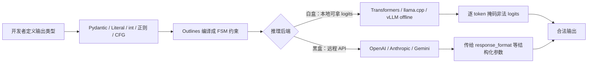

# Outlines：在生成时就把 LLM 输出锁进结构里，而不是事后修补

LLM 的输出不可控，多数方案是生成完再修：解析、正则、重试。Outlines 换了个位置动手——在每一步生成 token 时，只允许模型选符合结构的 token，把非法的可能性直接挡在生成过程之外。

读下去之前，先说清这篇文章能给你什么：一是搞懂"生成时约束"到底是什么、和重试解析差在哪；二是看清同一个约束在自托管模型和云 API 两种后端下，保证程度其实不一样；三是用完知道自己的场景到底要不要引这个库。

理解它，先抓住一件事：这既是一个能直接用的库，也是一段行业共享的算法遗产——你给它一个 Python 类型、Pydantic 模型或正则，它编译成一个有限状态机（finite-state machine，FSM），再用这个 FSM 去掩码每一步的 logits。这个思路最早来自 Willard 与 Louf 的论文 Efficient Guided Generation for Large Language Models（arXiv:2307.09702），后来 vLLM、SGLang 等推理框架做结构化输出时都沿用了同一套逻辑——只是如今它们更常用更快的新引擎（XGrammar、llguidance），很少有人还直接挂在 Outlines 上。下面把这两层拆开看。

## 系统地图：约束发生在哪一层

先看 Outlines 在工作里处于什么位置。它不替代模型，也不替代推理框架，它夹在两者之间，替你把"输出类型"翻译成"生成时的约束"。关键在约束落地的姿势不同，取决于推理后端能不能拿到 logits：



两种路径的保证程度不一样。白盒路径有 model 词表的完整打分，能把每个非法的 token 直接掩掉，这是 Outlines 最硬的一档；黑盒路径拿不到 logits，只能把约束转成对方 API 的结构化输出参数（例如 OpenAI 的 `response_format`），能不能逐 token 收紧，取决于远端服务自己怎么实现。写代码时两者可以共用同一套输出类型，但心里要清楚：真正"逐 token 保证"的是白盒那一侧。

## 先拆开两件事：生成时约束 ≠ 生成后解析

"先生成，再解析，失败重试"和"生成时保证合法"是两种不同的工程姿态，差别落在三个地方：

| 维度 | 生成后解析 | 生成时约束 |
|------|-----------|-----------|
| 失败怎么处理 | 重试、正则修复、降级 | 没有非法输出，不需要重试 |
| 成功率依赖 | 模型能力和 prompt 技巧 | 约束本身，与模型能力无关 |
| 额外成本 | 重试的 token 和时间 | 把结构编译成 FSM 一次，之后每次生成只加微秒级开销 |

Outlines 走第二条路。它的工作方式不是"猜一个合法输出"，而是把结构先编译成一个可判定的约束，再让模型只能在这个约束里走。

## 核心机制：一个 FSM 怎么把输出锁住

### 1. 算法从哪来：正则、JSON 模型、文法都变成状态机

"生成时保证合法"这件事能做到，靠的不是 prompt，而是一个可计算的结构。FSM 归纳了当前已生成的前缀，告诉你下一个位置还允许哪些 token：输出是 JSON，你已生成了 `{"rating":`，那么下一个 token 只能是合法数字或引号；剩下所有不满足状态的 token 一律把 logits 压到负无穷，模型只能从剩下的里采样。整个约束过程是确定性的，与模型是否"听话"无关。

这一步只需要做一次——把输出类型编译成 FSM 是昂贵的，但编译完就固定了。之后每次生成，状态机跟着前缀往前走，掩码的增量开销很小；这也正是生成时约束对比重试方案在成本上的底气。

### 2. 类型即约定

Outlines 的 API 对齐 Python 的类型系统，输出类型直接作为第二个参数传给模型对象。先初始化一个模型：

```python
from typing import Literal
import outlines
import openai

client = openai.OpenAI()
model = outlines.from_openai(client, "gpt-4o")

sentiment = model(
    "Analyze: 'This product completely changed my life!'",
    Literal["Positive", "Negative", "Neutral"],
)
# 只会是三者之一，不会是别的词
```

`Literal` 枚举固定的选项，`int` 只放行数字 token，`bool` 只放行 true/false。写起来就是 Python 类型注解，不需要学新的 DSL。

### 3. 复杂对象：Pydantic 模型直接复用

更有结构的输出用 Pydantic 定义，然后整个模型类当输出类型传入。`outlines.from_openai` 换成 `outlines.from_transformers(model, tokenizer)`、`outlines.from_ollama(client, ...)`，其余代码不变——这是 Outlines 的 Provider independence，切换推理后端只改初始化那一行。

```python
from enum import Enum
from pydantic import BaseModel

class Rating(Enum):
    poor = 1
    fair = 2
    good = 3
    excellent = 4

class ProductReview(BaseModel):
    rating: Rating
    pros: list[str]
    cons: list[str]
    summary: str

review = model("Review the XPS 13.", ProductReview)
parsed = ProductReview.model_validate_json(review)
```

已有的 Pydantic 模型不用改，Outlines 把它编译成约束，生成的字符串保证能被 `model_validate_json` 解析。

### 4. 语法层：正则、上下文无关文法、XML、FHIR

类型和 Pydantic 覆盖不了的部分，比如一段必须匹配正则的文本、XML 结构、FHIR 资源，走最底层的语法约束。这一层是 Outlines 相对其他库的差异点——它支持完整的 JSON Schema 规范、正则和上下文无关文法，而不只是 JSON。

## 一个流程案例：产品评论结构化分析

把前面的机制串起来看一次完整调用：

1. 定义 `ProductReview` 模型，四个字段：rating、pros、cons、summary。
2. `outlines.from_openai` 初始化模型，把 `ProductReview` 作为输出类型传入。
3. Outlines 把模型编译成 FSM——每个位置该是哪些 token、不该是哪些 token。
4. 模型开始生成，FSM 要求第一个 token 只能走合法开头。
5. 每一步，如果模型想选一个不在当前合法集合里的 token，Outlines 把它的 logits 压掉，让模型从剩余合法 token 里重选。
6. 生成结束，得到的字符串一定落在 `ProductReview` 允许的结构里。
7. `ProductReview.model_validate_json(review)` 直接解析，不需要错误处理分支。

## 边界：100% 是目标，不是绝对承诺

"100% 合法"是 Outlines 的官方定位，但要把它读准确。它保证的是"生成的 token 一定落在约束定义的集合里"，这是机制层面能做到的。前提有两个：一是模型词表里必须存在能表达目标结构的 token——如果某个字符或片段压根不在词表里，会出现无法表达的情况，而不是乱生成；二是白盒路径才有逐 token 掩码，走黑盒 API 时最终能不能收紧取决于远端服务。所以"100%"是对"格式合规"的保证，不是对"内容正确"的保证——模型可以在合法结构里给出语义上错的答案，这一点和任何 LLM 应用一样需要自己兜底。

## 谁该先上，谁可以等

适合直接用的场景：

- 输出要喂给程序继续处理，参数格式错一次就崩一次的工具调用、函数调用。
- 分类、信息抽取，要求结果一定落在预设集合里。
- 团队自己托管模型（Transformers、llama.cpp、Ollama、本地 vLLM），想要逐 token 级别的保证。

可以先等等的场景：

- 纯文本生成，写文章、讲故事，不需要结构约束。
- 只调某一家云厂商的 API：它自带的 structured output 已经接近一等公民，底层可能用的是 XGrammar 这类更快的引擎，没必要再绕一层库。
- 已经把服务托管在 vLLM、SGLang 上：这些框架默认就自带结构化引擎（通常是 XGrammar），单独引 Outlines 反而多一层依赖。

## 结尾

Outlines 真正站住的地方，不是它作为库的那一层 API，而是它把"模型会不会输出奇怪格式"从运行时问题变成了编译期问题，并把这个方法做成了行业惯例。后来更快的 XGrammar、llguidance 替代它在 serving 框架里的位置，但 FSM 掩码的思路就是从它的论文里长出来的。对直接使用它的人来说，收益是去掉重试和解析的胶水代码；对整个生态来说，它不是炫技的库，而是结构化生成这条技术路线公认的起点。

想把这个理解落地，可以找一台装得上的小模型（比如 `SmolLM2`）自己跑三件事：先用 `Literal` 锁定三个词，连问十次，确认每次输出都在三者之内；然后传一个 Pydantic 模型，故意把 `summary` 字段改成超长文本，看生成的 JSON 是不是照样能被 `model_validate_json` 解析；最后把同一个模型切到 OpenAI 后端，对比一下"逐 token 掩码"和"远端 `response_format`"对异常输入的表现差别。三条跑完，这篇讲的两个边界——格式保证不等于内容正确、白盒黑盒强弱不同——就都验证了。