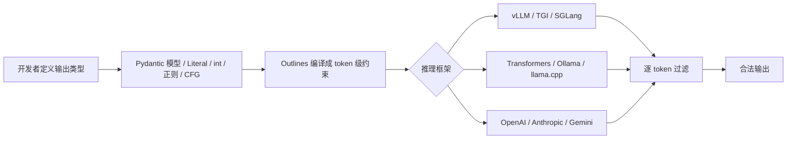

# Outlines：在生成时就把 LLM 输出锁进结构里，而不是事后修补

LLM 的输出不可控，多数方案是生成完再修：解析、正则、重试。Outlines 换了个位置动手——在每一步生成 token 时，只允许模型选符合结构的 token，把非法的可能性直接挡在生成过程之外。

它真正有分量的地方不止于此。除了给应用开发者一个 `model(prompt, output_type)` 的接口，Outlines 还被 vLLM、TGI、SGLang 这些主流推理框架内置成底层的结构化生成引擎。也就是说，你直接用它，和你调用某个带 structured output 的 serving 框架，背后可能是同一套约束逻辑。

## 系统地图：约束发生在哪一层

先看 Outlines 在工作里处于什么位置。它不替代模型，也不替代推理框架，它夹在两者之间，替你把"输出类型"翻译成"生成时的 token 白名单"。



同样一段代码，底下的推理后端可以换。这是 Outlines 的 Provider independence：`outlines.from_vllm`、`outlines.from_transformers`、`outlines.from_openai` 都是同一套生成器接口，切换时只改初始化那一行。

## 先拆开两件事：生成时约束 ≠ 生成后解析

"先生成，再解析，失败重试"和"生成时保证合法"是两种不同的工程姿态，差别落在三个地方：

| 维度 | 生成后解析 | 生成时约束 |
|------|-----------|-----------|
| 失败怎么处理 | 重试、正则修复、降级 | 没有非法输出，不需要重试 |
| 成功率依赖 | 模型能力和 prompt 技巧 | 约束本身，与模型能力无关 |
| 额外成本 | 重试的 token 和时间 | 编译一次约束，之后每次生成只加微秒级开销 |

Outlines 走的第二条路。它把 Pydantic 模型、JSON Schema、正则、上下文无关文法编译成 token 层面的约束，然后在推理时逐 token 过滤。

## 核心机制：约束怎么变成 token 白名单

### 1. 类型即约定

Outlines 的 API 对齐 Python 的类型系统，输出类型直接作为第二个参数传进去。注意要先初始化一个模型对象：

```python
import outlines
import openai
from typing import Literal

client = openai.OpenAI()
model = outlines.from_openai(client, "gpt-4o")

sentiment = model(
    "Analyze: 'This product completely changed my life!'",
    Literal["Positive", "Negative", "Neutral"],
)
# 只会是三者之一，不会是别的词
```

`Literal` 枚举固定的选项，`int` 只放行数字 token，`bool` 只放行 true/false。写起来就是 Python 类型注解，不需要学新的 DSL。

### 2. 复杂对象：Pydantic 模型直接复用

更复杂的结构用 Pydantic 定义，然后把模型类当输出类型传进去：

```python
from pydantic import BaseModel
from enum import Enum

class Rating(Enum):
    poor = 1
    fair = 2
    good = 3
    excellent = 4

class ProductReview(BaseModel):
    rating: Rating
    pros: list[str]
    cons: list[str]
    summary: str

review = model(
    "Review: The XPS 13 has great battery life and a stunning display, but it runs hot.",
    ProductReview,
    max_new_tokens=200,
)
parsed = ProductReview.model_validate_json(review)
```

已有的 Pydantic 模型不用改，Outlines 把 schema 编译成约束。生成的字符串保证能被 `model_validate_json` 解析。

### 3. 语法层：正则、上下文无关文法、XML、FHIR

类型和 Pydantic 覆盖不了的部分，比如一段必须匹配正则的文本、XML 结构、FHIR 资源，走最底层的语法约束。这一层也是 Outlines 相对其他库的差异点——它支持完整的 JSON Schema 规范、正则和上下文无关文法，而不是只支持 JSON。

## 一个流程案例：产品评论结构化分析

把前面的机制串起来看一次完整调用：

1. 定义 `ProductReview` 模型，四个字段：rating、pros、cons、summary。
2. `outlines.from_openai` 初始化模型，传入 `ProductReview` 作为输出类型。
3. Outlines 把模型编译成 token 级约束——每个位置该是什么 token、不该是什么 token。
4. 模型开始生成第一个 token，约束要求先输出 `{`。
5. 每一步，如果模型想选一个不在当前白名单里的 token，Outlines 直接把它过滤掉，让模型从剩余合法 token 里重选。
6. 生成结束，字符串一定是合法 JSON，且符合 `ProductReview` 的结构。
7. `ProductReview.model_validate_json(review)` 直接解析，不需要错误处理分支。

## 边界：100% 是目标，不是绝对承诺

"100% 合法"是 Outlines 的官方定位，但要把它读准确。它保证的是"生成的 token 一定落在约束定义的集合里"，这是机制层面能做到的。有一个前提：模型词表里必须存在能表达目标结构所需的 token。如果某个字符或片段压根不在词表里，就出现了无法生成的极端情况，而不是乱生成。所以"100%"是对"格式合规"的保证，不是对"内容正确"的保证——模型可能在合法结构里给出语义上错的答案，这一点和任何 LLM 应用一样需要自己兜底。

## 谁该先上，谁可以等

适合直接用的场景：

- 输出要喂给程序继续处理，参数格式错一次就崩一次的工具调用、函数调用。
- 分类、信息抽取，要求结果一定落在预设集合里。
- 需要在不同模型、不同推理后端之间切换，且不想改业务代码。

可以暂时不用的场景：

- 纯文本生成，写文章、讲故事，不需要结构约束。
- 只调某一家云厂商的 API，且它自带的 structured output 已经够用——那层能力背后可能就用了 Outlines。

## 结尾

Outlines 把"模型会不会输出奇怪格式"从运行时问题变成了编译期问题。对直接使用它的人来说，收益是去掉重试和解析的胶水代码；对整个生态来说，它已经是好几套主流 serving 框架的底层依赖。后者是它真正站稳的原因——结构化生成不是一个炫技的库，而是 AI 应用接进生产系统时绕不开的一层。