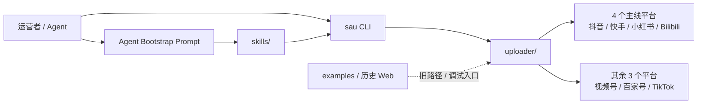

SocialAutoUpload 很容易被误读成一个“已经完整打通 7 个平台”的成品。更准确的说法是：它已经把 7 个平台的底层 uploader 铺开了，但真正收敛成统一 CLI、也最适合交给 Agent 接手的，目前是抖音、快手、小红书、Bilibili 这 4 条主线。

这不是抠字眼，而是决定你能不能少走弯路的判断。你如果按“7 平台已经同样成熟”的预期去用它，大概率会混淆主线入口、历史路径和底层能力；如果你先接受“4 条主线先跑稳，其余平台再补”的现实，整个项目反而会变得很清楚。

这篇文章想回答的，就是这三个问题：现在真正能拿来用的是哪一层；为什么项目要把 CLI 和 skill 放到比旧 Web 更靠前的位置；以及如果你只想尽快跑通一条发布链路，第一步该从哪里开始。

## 先看系统地图

先看图，再看表。图里最关键的信息，不是平台数量，而是“谁是当前主线，谁还是底层覆盖，谁只是历史入口”。



这张表比“支持 7 平台”更重要，因为它把当前仓库里几条容易混在一起的路径拆开了。

| 层级 | 负责什么 | 当前覆盖 | 什么时候该用 |
| ---- | ---- | ---- | ---- |
| `uploader/` | 各平台底层自动化实现 | 7 个平台都有对应入口 | 你要研究平台细节、补平台能力、调试底层行为 |
| `sau` CLI | 当前主线统一命令入口 | 抖音、快手、小红书、Bilibili | 你要稳定执行登录、检查、上传、定时发布 |
| `skills/` | 给 OpenClaw、Codex、Claude Code 等 Agent 的封装 | 抖音、快手、小红书、Bilibili | 你希望把发布任务交给 Agent，而不是自己手敲命令 |
| `examples/` 与历史 Web | 旧路径、调试入口、历史实现 | 部分平台仍有示例 | CLI 主线不可用，或你在回看旧实现时再碰 |

如果你只记住一句话，可以记这句：**7 平台是底层能力的覆盖面，4 平台才是当前主线真正打磨过的 CLI 和 skill 路径。** 这决定了你该从哪里开始，也决定了你不该误把旧入口当成当前最稳的入口。

## 能力边界比功能清单更值得先看

README 里的平台矩阵已经说明了能力分层，但把它翻成工程语言之后，会更容易判断项目状态。

| 平台 | 视频上传 | 图文上传 | 定时发布 | CLI 主线 | Agent Skill | 当前备注 |
| ---- | ---- | ---- | ---- | ---- | ---- | ---- |
| 抖音 | ✅ | ✅ | ✅ | ✅ | ✅ | 当前主线最完整的路径之一 |
| 快手 | ✅ | ✅ | ✅ | ✅ | ✅ | 已接入 CLI 和 skill，适合主线验证 |
| 小红书 | ✅ | ✅ | ✅ | ✅ | ✅ | 浏览器自动化路径已收敛到主线 |
| Bilibili | ✅ | ❌ | ✅ | ✅ | ✅ | 运行时会自动准备 `biliup` |
| 视频号 | ✅ | ❌ | ✅ | ❌ | ❌ | 底层实现存在，但不在统一 CLI 主线 |
| 百家号 | ✅ | ❌ | ✅ | ❌ | ❌ | 仍以底层自动化和示例路径为主 |
| TikTok | ✅ | ❌ | ✅ | ❌ | ❌ | README 明确写了当前示例走 Chrome 路径 |

这张表背后的含义是：如果你的目标是“先把一条可靠流程跑起来”，那就别一上来把 7 个平台都纳入方案。更稳的做法是先围绕已经接入 `sau` 的 4 个平台搭建工作流，等这条主线跑顺了，再决定要不要把视频号、百家号或 TikTok 加进来。

## 它真正收敛的是重复劳动，而不是浏览器本身

项目作者在 README 里反复强调一点：AI 很强，不代表每次都该让 Agent 临场解析页面、截图、猜 DOM、现写操作逻辑。上传这类动作的特点恰好相反：步骤高度重复，平台页面虽然会改，但任务结构很稳定，无非是登录、选文件、填标题、填描述、带标签、设发布时间、确认提交。

这类工作一旦被收敛成命令，就会出现三个变化。

1. 你不用每次重新教 Agent “这次要点哪个按钮”。
2. 你可以把发布动作放进脚本、定时任务或其他流水线里，而不是只停留在交互会话里。
3. 真正需要人盯的部分，缩小成账号登录、二维码、平台风控和内容本身，而不是整条上传链路。

换句话说，SocialAutoUpload 的价值不在于替你发一条视频，而在于把“多平台发布”这件事从一次性操作，收成一条可复查、可复用、可继续自动化的路径。

## 当前主线怎么组织

如果按最新文档理解项目结构，当前主线可以粗略看成下面这几个部分：

```text
social-auto-upload/
├── uploader/      # 各平台底层实现
├── sau_cli.py     # 当前 CLI 主入口
├── skills/        # 面向 Agent 的平台 skill
├── docs/          # 安装、CLI、Bootstrap 等文档
└── examples/      # 历史示例与调试脚本
```

这里最容易写错的，是把 `skills/` 当成另一套独立能力。实际上它更像“把主线路径翻译成 Agent 更容易遵守的契约”。`agent-bootstrap.md` 并不是在教模型理解所有源码，而是在强制它走一条更少歧义的路线：优先用 `uv` 装环境，优先看 `docs/install.md`、`docs/CLI.md` 和 `skills/`，优先验证 `douyin`、`kuaishou`、`xiaohongshu`、`bilibili` 这 4 个入口，不要先掉进历史 `examples/` 或旧 Web 路径里。

这个设计看起来朴素，但很适合 Agent 场景。Agent 最怕的不是命令少，而是入口太多、历史路径太多、文档优先级不清。SocialAutoUpload 的 Bootstrap Prompt 做的事情，本质上就是先把搜索空间砍小，再让 Agent 去执行。

## 一次真实任务会怎样流过系统

拿“让 Agent 帮你把视频发到小红书，并设成今晚定时发布”这件事举例，主线通常会经过下面几步：

1. 你把仓库和 `docs/agent-bootstrap.md` 一起交给 Agent。
2. Agent 按文档要求完成环境安装，优先验证 `sau --help` 和 4 个主线平台的子命令入口。
3. 你给出账号名、素材路径、标题、描述、标签和定时发布时间。
4. Agent 调用 `sau xiaohongshu upload-video ... --schedule` 这类统一命令，而不是自己现写浏览器脚本。
5. `sau` 再把动作分发到对应的平台 uploader，由浏览器自动化层去处理页面交互。
6. 失败时，你看到的是更靠近业务动作的错误，例如账号状态、二维码、文件、参数，而不是一整段临时脚本里某个选择器失效。

这条路径最重要的收益，不是“省一次点击”，而是把错误也收敛进了统一接口。对批量运营来说，能定位失败位置往往比“理论上全自动”更重要。

## 从零到可用，官方文档现在推荐怎么装

如果你只想先验证主线，最短路径不是 `requirements.txt`，也不是旧 Web 面板，而是官方安装文档里的这一套：

```bash
git clone https://github.com/dreammis/social-auto-upload.git
cd social-auto-upload

uv venv
source .venv/bin/activate

uv pip install -e .
PLAYWRIGHT_DOWNLOAD_HOST="https://npmmirror.com/mirrors/playwright" patchright install chromium
cp conf.example.py conf.py

sau --help
sau douyin --help
sau kuaishou --help
sau xiaohongshu --help
sau bilibili --help
```

这里有两个细节值得单独说。

第一，安装文档已经把主依赖收敛到 `pyproject.toml`，普通用户不该再优先走旧的 `requirements.txt` 路径。第二，当前文档已经把 `patchright install chromium` 写进主线安装步骤里，这说明 Patchright 对这个项目来说已经不只是“未来计划”，而是当前主线的一部分。

## CLI 统一了什么，没有统一什么

`sau` 的好处，不只是把命令变短，而是把几类操作抽成了统一约定。

1. 登录与账号检查：`login`、`check` 两组子命令在 4 个主线平台上保持一致。
2. 视频上传参数：统一围绕 `--file`、`--title`、`--desc`、`--tags`、`--schedule` 展开。
3. 图文上传参数：统一围绕 `--images`、`--title`、`--note`、`--tags`、`--schedule` 展开。
4. 运行方式：`--headless`、`--headed`、`--debug` 被拆成独立维度，而不是糊成一个开关。

例如，抖音与小红书的视频命令已经非常接近：

```bash
sau douyin upload-video \
  --account creator \
  --file videos/demo.mp4 \
  --title "示例标题" \
  --desc "示例简介" \
  --tags 自动化,内容矩阵 \
  --schedule "2026-06-01 21:30"
```

而 Bilibili 虽然也走统一入口，但它保留了自己的平台特性，比如 `--tid`：

```bash
sau bilibili upload-video \
  --account creator \
  --file videos/demo.mp4 \
  --title "示例标题" \
  --desc "示例简介" \
  --tid 249 \
  --tags 自动化,测试 \
  --schedule "2026-06-01 21:30"
```

这种设计很合理。统一入口负责把 80% 的公共动作收起来，但不会为了表面一致，硬把各平台特有的参数抹平。真正做多平台工具时，最怕的就是为了“统一”而丢掉平台差异；`sau` 目前没有走那条路。

## 第一次验收，先看这 3 个点

如果你今天就准备把它跑起来，别急着先传素材，先把下面这 3 个检查点过掉。

1. `sau --help` 和 4 个主线平台的 `--help` 都能正常返回，这说明环境、入口和可执行脚本已经对上了。
2. 先做 `login` 和 `check`，再做上传。账号状态没校验通过时，直接上传通常只会把错误往后拖。
3. 第一次上传优先选一个最小样本：一条短视频或一组图片，外加明确的 `--schedule` 时间。这样你更容易分清问题出在参数、账号、页面还是定时逻辑。

这一步不花太久，但能筛掉大部分“其实还没装好就开始怀疑平台风控”的误判。

## Agent 集成真正省下来的，是“第一次交接成本”

这套项目对 AI Agent 用户最有价值的文档，不是 README，而是 [Agent Bootstrap Prompt](https://github.com/dreammis/social-auto-upload/blob/main/docs/agent-bootstrap.md)。因为真正麻烦的地方，往往不是“Agent 会不会执行命令”，而是“它第一次接手仓库时，会不会走错路”。

这份 Prompt 做了几件很务实的事：

1. 指定当前工作目录就是仓库根目录。
2. 指定优先使用 `uv`，不要默认回退到历史依赖路径。
3. 指定优先走 `sau` CLI，而不是旧 `examples/` 和旧 Web。
4. 指定安装完成后先验证 4 个主线平台入口是否可用。
5. 指定遇到二维码时要把图片展示给用户，而不是只回一个路径。

如果你经常把仓库交给 Claude Code、Codex 或 OpenClaw，这类“先收窄路径，再验收结果”的 Bootstrap 文档，比一份很长的功能说明更值钱。它直接减少了 Agent 乱逛仓库、误用历史入口、把错误吞掉的概率。

## Patchright 在这里扮演什么角色

原稿里最需要纠正的一点，是把 Patchright 写成“微软出品的 Playwright 分支”。这不准确。

Patchright 官方 README 的说法是：它是一个基于 Playwright 的 patched、强调降低检测概率的版本，目标是作为 Playwright 的 drop-in replacement 使用。它并不是 Microsoft 官方维护的 Playwright 分支，当前也只面向 Chromium 系浏览器，不支持 Firefox 和 WebKit。

这件事为什么重要？因为它会影响你的预期。

1. 你可以把它理解成“为了自动化场景做过补丁处理的浏览器驱动层”，而不是通用浏览器框架的官方主线。
2. 它确实解释了项目为什么会把“更隐蔽、更稳定的自动化方案”列为重构重点。
3. 但你不能从“用了 Patchright”直接推出“平台一定检测不到”或者“风控问题已经彻底解决”。自动化是否稳定，仍然取决于页面变化、账号状态、IP、操作节奏和平台策略。

从 SocialAutoUpload 的角度看，Patchright 的意义更像是把浏览器自动化底座换成了更贴近这个场景的工具，而不是一张免死金牌。

## 你需要留意的几个现实限制

这类项目最容易被宣传口号带跑偏，实际使用时要先记住下面几件事。

1. 旧 Web 相关代码仍然保留，但官方已经明确说明那不是当前主线，也不保证和最新 `uploader/`、`sau_cli.py` 完全同步。
2. Bilibili 的上传能力依赖 `biliup`，但当前 CLI 会在首次运行时自动准备它，不需要你手工先装一遍。
3. Bilibili 登录更适合用户自己在本地真实终端执行；如果终端二维码显示不完整，可以直接打开当前目录下的 `qrcode.png` 扫码。
4. 国内网络环境下，安装浏览器驱动或访问 GitHub Release 可能会慢，文档已经给出了 `PLAYWRIGHT_DOWNLOAD_HOST` 镜像和 `gh-proxy` 这类排障建议。

这些细节看起来不像“技术亮点”，但它们往往决定你第一天能不能跑通。

## 谁该优先用它，谁可以先等等

如果你符合下面几种情况，SocialAutoUpload 很值得上手：

1. 你需要把同一条视频或图文分发到多个平台，而且发布动作会重复发生。
2. 你已经在用 Agent 协助做内容生产，希望把“生成内容”和“分发内容”接成一条链。
3. 你不满足于一次性脚本，而是想把登录、检查、上传、定时发布沉淀成可复用命令。

反过来，如果你只是偶尔在一两个平台手动发内容，或者你当前最关心的是“有没有完整后台管理面板”，那它未必是最先该上的工具。这个项目当下最强的部分，是 CLI 主线和 Agent 集成，而不是一套已经完全收敛的可视化运营后台。

## 更稳的采用顺序

如果你准备真用，而不是只看热闹，我建议按下面顺序推进：

1. 先按官方文档把 `uv`、`sau` 和 `patchright` 装到可验证状态。
2. 先验证 `douyin`、`kuaishou`、`xiaohongshu`、`bilibili` 这 4 个主线平台的 CLI 入口。
3. 先跑登录和账号检查，再跑上传，不要跳过 `check`。
4. 等主线跑顺，再决定是否研究视频号、百家号、TikTok 的底层路径或历史示例。
5. 如果你准备交给 Agent，用 Bootstrap Prompt 作为第一条消息，而不是让模型自由探索整个仓库。

这个顺序的好处很直接：你先把最稳定的 80% 路径跑通，再去碰还在演进的 20%。对于自动化项目，这通常比“一次性全打通”更省时间。

## 结论

SocialAutoUpload 当前最成熟的地方，不是“支持 7 个平台”这句简介，而是它已经把多平台上传这件事收敛成了一条相对清楚的主线：底层由 `uploader/` 承接，执行由 `sau` CLI 统一，交给 Agent 时再由 `skills/` 和 Bootstrap Prompt 把入口限制住。

如果你把它当成“全平台、全能力、全可视化都已经完工”的产品，会高估它当前的收敛程度；如果你把它当成“围绕 4 个主线平台，把上传动作做成可调用能力”的工程化项目，那它现在的价值就很明确了。对内容矩阵、AI 创作工作流和 Agent 集成场景来说，这条路确实比每次重新写浏览器脚本稳得多。

## 参考资料

- [项目 README](https://github.com/dreammis/social-auto-upload)
- [安装说明](https://github.com/dreammis/social-auto-upload/blob/main/docs/install.md)
- [CLI 使用说明](https://github.com/dreammis/social-auto-upload/blob/main/docs/CLI.md)
- [Agent Bootstrap Prompt](https://github.com/dreammis/social-auto-upload/blob/main/docs/agent-bootstrap.md)
- [历史 Web 版本说明](https://github.com/dreammis/social-auto-upload/blob/main/docs/legacy-web.md)
- [Patchright README](https://github.com/Kaliiiiiiiiii-Vinyzu/patchright)
